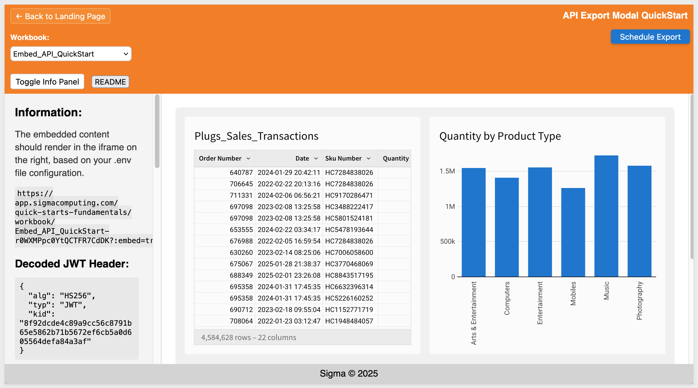
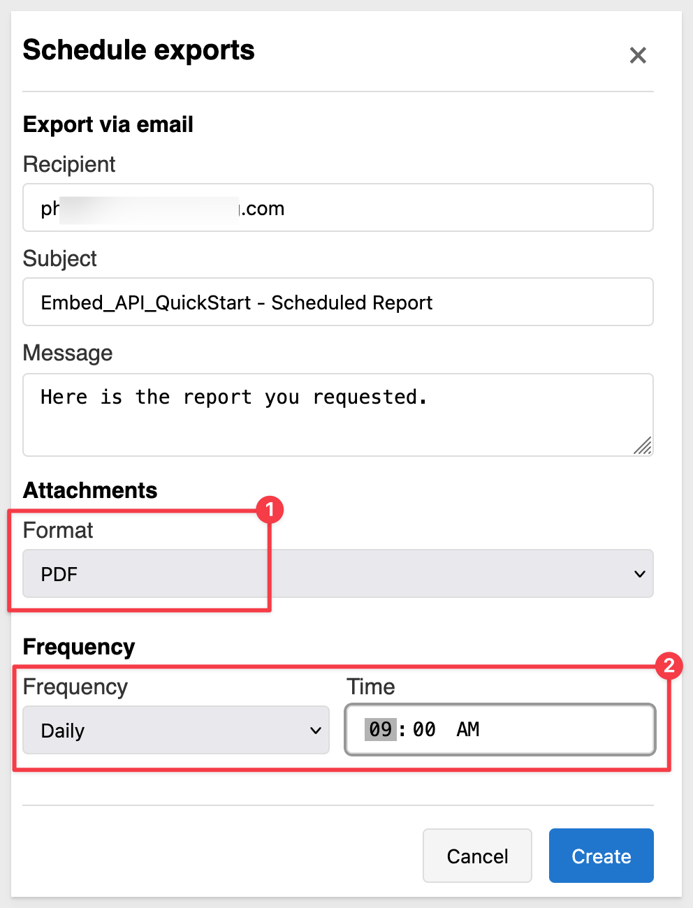
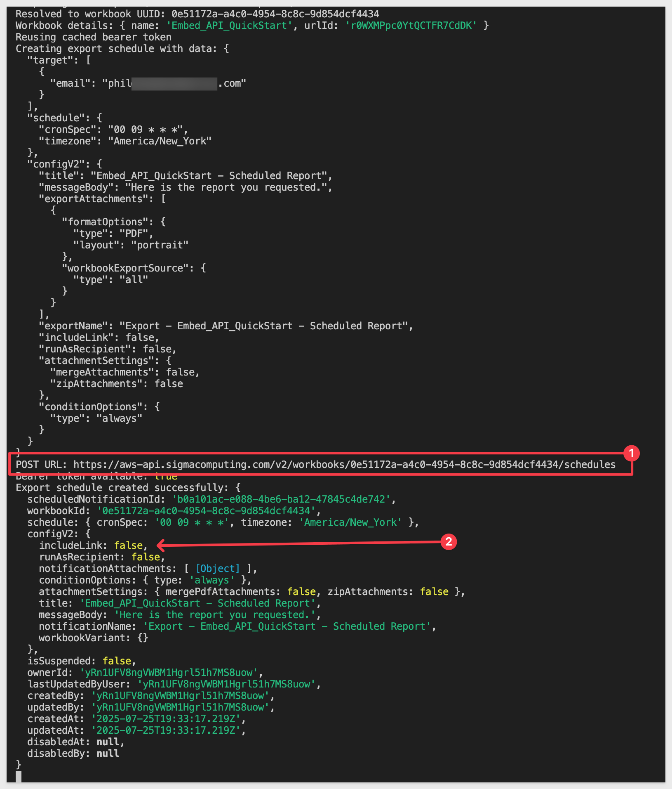
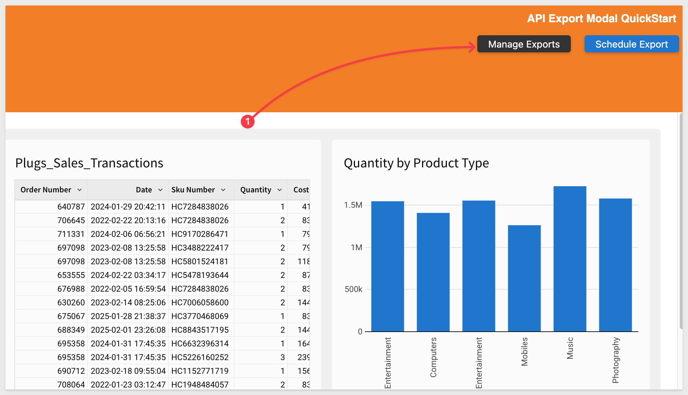
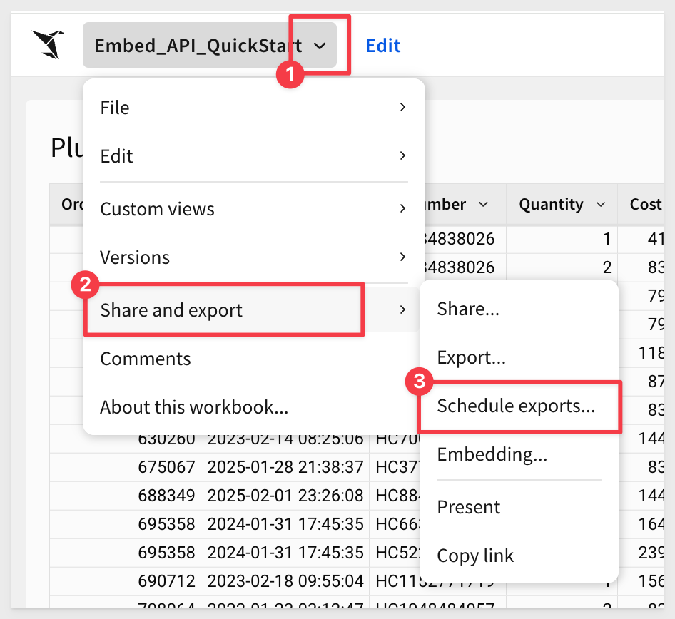
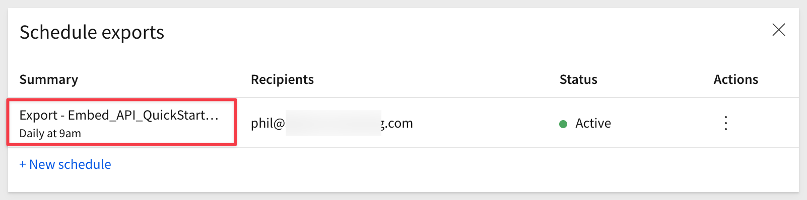
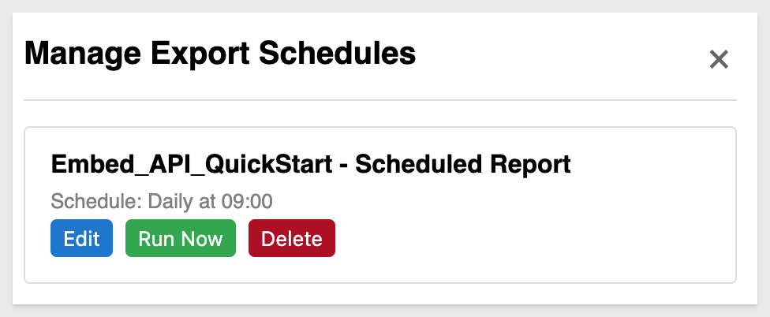
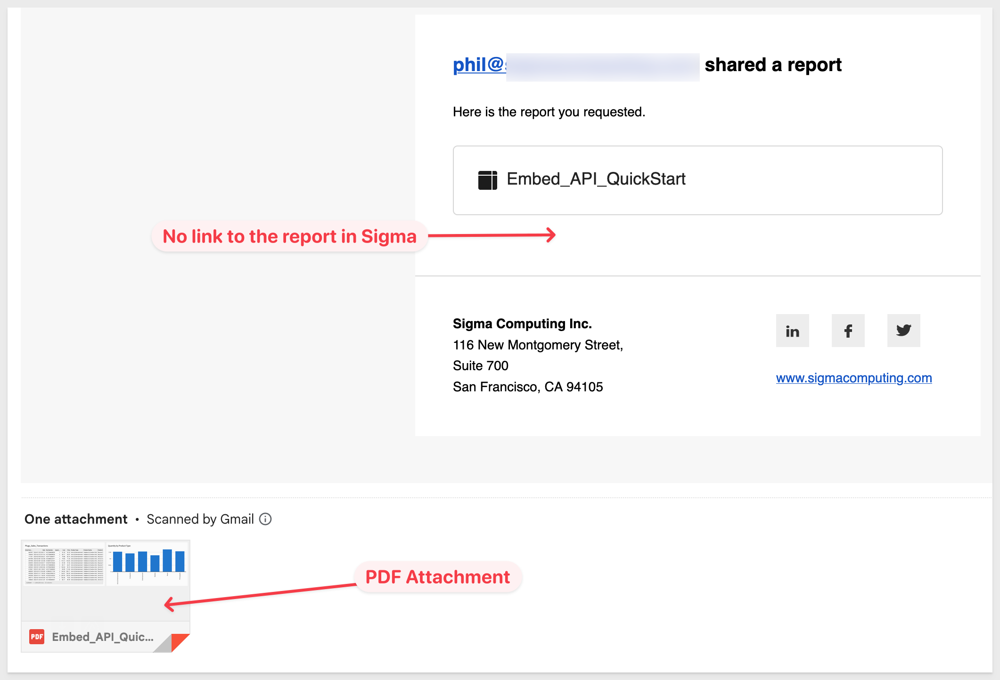

author: pballai
id: embedding_rest_api_usage_04_export_modal
summary: embedding_rest_api_usage_04_export_modal
categories: embedding
environments: web
status: published
feedback link: https://github.com/sigmacomputing/sigmaquickstarts/issues
tags: default
lastUpdated: 2025-07-25

# REST API Usage 04: Scheduling Exports

## Overview 
Duration: 5

This QuickStart demonstrates how to extend an embedded Sigma workbook with scheduled export functionality using the Sigma REST API.

<aside class="positive">
<strong>IMPORTANT:</strong><br> We will rely on the information in the README for the implementation details and not discuss them in this QuickStart. A button is provided on the webpage for easy access.
</aside>

Unlike basic embedding scenarios, this implementation provides users with export management capabilities directly within the host application. We won't cover every possibility, but we will cover these three core workflows:

**1: Schedule an Export:**<br>
Allow users to create scheduled exports by configuring email recipients, subject lines, message content, export format (PDF, CSV, Excel), and delivery frequency (daily, weekly, monthly). The system handles `workbook ID` resolution and validates all parameters before creating the schedule via the Sigma API.

**2: Manage Export Schedules:**<br>
Provide users with a management interface to view existing export schedules, edit configurations (with recipient re-entry for security compliance), delete unwanted schedules, and immediately trigger exports with custom recipient lists.

**3: Send Now:**<br>
Enable users to send exports on-demand using existing schedule configurations, with the ability to specify different recipients for ad-hoc sharing without modifying the original schedule.

This approach enables a complete export management experience directly within the embedded environment. It's especially useful for SaaS providers, internal dashboards, or any scenario where users need to share Sigma content via email without requiring direct access to the Sigma interface.

<aside class="positive">
<strong>IMPORTANT:</strong><br> This QuickStart builds on the setup from "REST API Usage 01: Getting Started". If you haven’t yet cloned the repo, installed dependencies, and configured your Sigma workspace, please follow that QuickStart first.
</aside>

[REST API Usage 01: Getting Started](https://quickstarts.sigmacomputing.com/guide/embedding_rest_api_usage_01_getting%20started_started/index.html?index=..%2F..index#0)

<aside class="positive">
<strong>IMPORTANT:</strong><br> Some screens in Sigma may appear slightly different from those shown here. This is because Sigma continuously adds and enhances functionality. Rest assured—Sigma’s intuitive interface ensures that any differences won’t prevent you from completing the QuickStart successfully.
</aside>

For more information on Sigma's product release strategy, see [Sigma product releases](https://help.sigmacomputing.com/docs/sigma-product-releases)

If something doesn’t work as expected, here's how to [contact Sigma support](https://help.sigmacomputing.com/docs/sigma-support)

### Target Audience
Developers who want to use Sigma's REST API to programmatically control Sigma in an embedded context.

### Prerequisites

<ul>
  <li>Any modern browser will work.</li>
  <li>Access to your Sigma environment.</li>
  <li>Some familiarity with Sigma is assumed. Not all steps are shown, as the basics are assumed understood.</li>
  <li>Microsoft VSCode or other suitable development tool.</li>
 </ul>

<aside class="positive">
<strong>IMPORTANT:</strong><br> Sigma recommends using non-production resources when completing QuickStarts.
</aside>

<button>[Sigma Free Trial](https://www.sigmacomputing.com/free-trial/)</button><br>

<button>[Download Visual Studio Code](https://code.visualstudio.com/download)</button>

<aside class="negative">
<strong>IMPORTANT:</strong><br> Some features may carry a "Beta" tag. Beta features are subject to quick, iterative changes. As a result, the latest product version may differ from the contents of this document.
</aside>
 


## Start the Server
Duration: 5

Start the Express server in terminal from the `embedding_qs_series_2_api_use_cases` folder and enable debugging:
```code
DEBUG=true npm start
```

The server is ready when it displays: `Server listening at http://localhost:3000`.

Browse to the landing page:
```code
http://localhost:3000
```

Select the `Exports` page and click `Go`.

Select the `Embed_API_QuickStart` workbook:



<aside class="negative">
<strong>NOTE:</strong><br> We are using the "View" user in this workflow for simplicity only. 
</aside>

The embed loads but there are no exports set up yet, and we can only see the `Schedule Export` button.


<!-- END OF SECTION-->

## Schedule an Export
Duration: 5

Click the `Schedule Export` button to access the modal.

Configure it to send a `PDF` daily at 9:00 AM to a valid email address:



Click `Create`.

Observing the console log, we can see the `POST` command to Sigma along with the various path and body parameters sent. For example, we set the `includeLink` value to `false` since this is an embed and we don't want embed users to have that link back to Sigma in the email:



A popup will confirm the export was created with `Export schedule created successfully!`.

Click `Ok` to close that.

We are returned to the page and now there is a `Manage Exports` button present. This appears whenever the selected workbook has a export schedule:



Before we look at that, let's confirm in Sigma that the export job has been created there.

Open Sigma and navigate to the `Embed_API_QuickStart`. 

Select `Scheduled Exports` from the workbook's menu:



We will have the job just created listed:




<!-- END OF SECTION-->

## Manage Exports
Duration: 5

Back in our host application, click the `Manage Exports` button.

For each export job, we provide three functions:



They are self-explanatory; go ahead and experiment with them to see how they work, observing the console and browser inspection logs for each operation. 

For example, if we click, `Run Now`, we are prompted for one or more email addresses to send to. we are asked to confirm and then we verify the email arrived in our mailbox:



### Cleanup
You may want to delete any export jobs created so that they do not run on future schedules. Just click the `Delete` button for each job created.

Once all are deleted, the `Manage Exports` button will be hidden.


<!-- END OF SECTION-->

## What we've covered
Duration: 5

In this QuickStart, we demonstrated how to extend your Sigma embedding experience with export management functionality. Specifically, we covered:

- Creating scheduled export configurations with custom recipients, subjects, messages, and delivery formats (PDF, CSV, Excel).
- Setting up automated delivery schedules with daily, weekly, or monthly frequency options and custom timing.
- Managing existing export schedules through a dedicated interface that allows viewing, editing, and deleting configurations.
- Implementing immediate export delivery using saved schedule configurations with custom recipient targeting.
- Integrating export functionality seamlessly with embedded workbook selection and preview capabilities.

This QuickStart builds on the foundational embedding setup and introduces a practical use case for email-based content sharing directly from the embedded environment, eliminating the need for users to access the Sigma interface directly.

**Additional Resource Links**

[Blog](https://www.sigmacomputing.com/blog/)<br>
[Community](https://community.sigmacomputing.com/)<br>
[Help Center](https://help.sigmacomputing.com/hc/en-us)<br>
[QuickStarts](https://quickstarts.sigmacomputing.com/)<br>

Be sure to check out all the latest developments at [Sigma's First Friday Feature page!](https://quickstarts.sigmacomputing.com/firstfridayfeatures/)
<br>

[](https://twitter.com/sigmacomputing)&emsp;
[](https://www.linkedin.com/company/sigmacomputing)&emsp;
[](https://www.facebook.com/sigmacomputing)


<!-- END OF WHAT WE COVERED -->
<!-- END OF QUICKSTART -->
