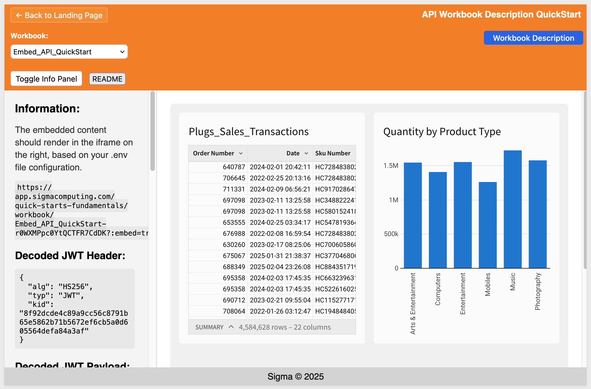
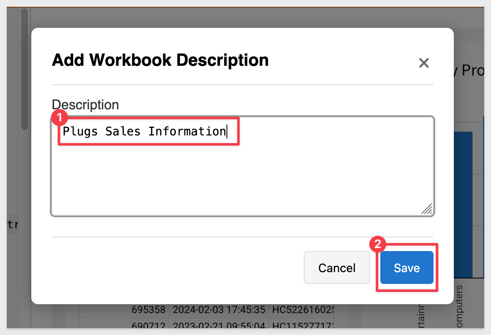
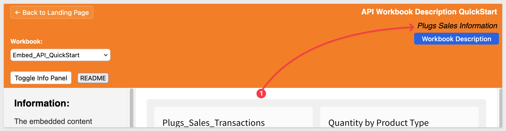
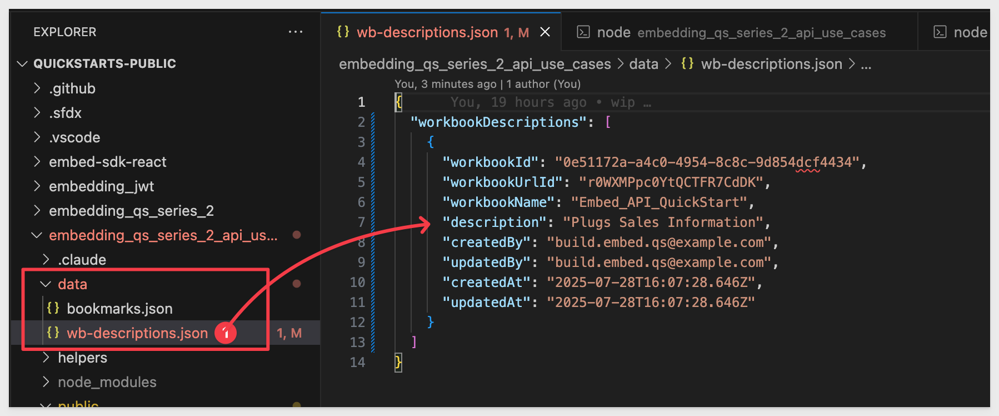
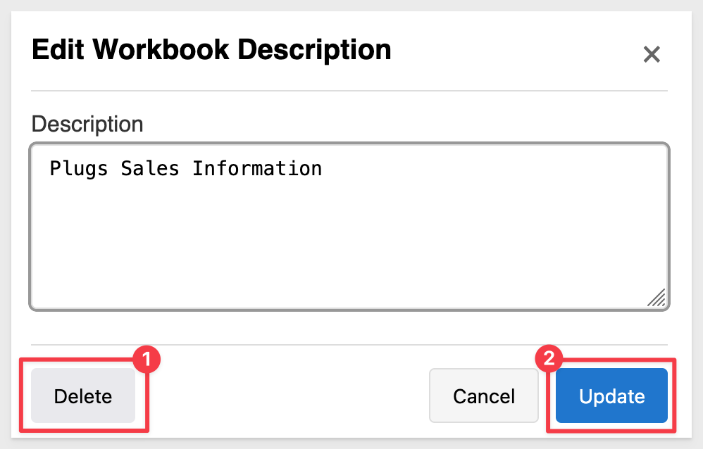

author: pballai
id: embedding_rest_api_usage_05_wb_descriptions
summary: embedding_rest_api_usage_05_wb_descriptions
categories: embedding
environments: web
status: published
feedback link: https://github.com/sigmacomputing/sigmaquickstarts/issues
tags: default
lastUpdated: 2025-07-25

# REST API Usage 05: Workbook Descriptions

## Overview 
Duration: 5

This QuickStart demonstrates how to enhance embedded Sigma workbooks with custom description functionality. Since Sigma's API doesn't natively support workbook descriptions, we'll implement a local storage solution using [lowdb](https://www.npmjs.com/package/lowdb) to enable users to add, edit, and delete contextual information directly within the embedded environment.

The pattern shown here can be extended to store any custom metadata—usage notes, business context, data lineage information, or other supplementary details that help users understand and effectively utilize workbook content.

<aside class="positive">
<strong>IMPORTANT:</strong><br> This QuickStart builds on the setup from "REST API Usage 01: Getting Started". If you haven’t yet cloned the repo, installed dependencies, and configured your Sigma workspace, please follow that QuickStart first.
</aside>

[REST API Usage 01: Getting Started](https://quickstarts.sigmacomputing.com/guide/embedding_rest_api_usage_01_getting%20started_started/index.html?index=..%2F..index#0)

<aside class="positive">
<strong>IMPORTANT:</strong><br> Some screens in Sigma may appear slightly different from those shown here. This is because Sigma continuously adds and enhances functionality. Rest assured—Sigma’s intuitive interface ensures that any differences won’t prevent you from completing the QuickStart successfully.
</aside>

For more information on Sigma's product release strategy, see [Sigma product releases](https://help.sigmacomputing.com/docs/sigma-product-releases)

If something doesn’t work as expected, here's how to [contact Sigma support](https://help.sigmacomputing.com/docs/sigma-support)

### Target Audience
Developers who want to use Sigma's REST API to programmatically control Sigma in an embedded context.

### Prerequisites

<ul>
  <li>Any modern browser will work.</li>
  <li>Access to your Sigma environment.</li>
  <li>Some familiarity with Sigma is assumed. Not all steps are shown, as the basics are assumed understood.</li>
  <li>Microsoft VSCode or other suitable development tool.</li>
 </ul>

<aside class="positive">
<strong>IMPORTANT:</strong><br> Sigma recommends using non-production resources when completing QuickStarts.
</aside>

<button>[Sigma Free Trial](https://www.sigmacomputing.com/free-trial/)</button><br>

<button>[Download Visual Studio Code](https://code.visualstudio.com/download)</button>

<aside class="negative">
<strong>IMPORTANT:</strong><br> Some features may carry a "Beta" tag. Beta features are subject to quick, iterative changes. As a result, the latest product version may differ from the contents of this document.
</aside>
 


## Setup Local Database
Duration: 5

If you haven't already, open the project in VSCode and start a terminal session and navigate to the folder `embedding_qs_series_2_api_use_cases` in terminal. 

The only extra thing we need to do is install a local database that will be used to store extended workbook description information. We will use a version of [lowdb](https://www.npmjs.com/package/lowdb) that supports commonJS for this. 

<aside class="negative">
<strong>ABOUT lowdb:</strong><br> lowdb is a small, fast, and zero-dependency local JSON database. It stores data in a plain .json file and provides a simple JavaScript API for reading and writing. It’s ideal for lightweight use cases like demos, prototypes, and local development — perfect for this QuickStart, where we want to persist workbook description metadata without setting up a full database server.
</aside>

Run the following command in terminal:
```code
npm install lowdb@1.0.0
```

Lowdb installs really quickly:


The git repository already contains a `Data` folder with the required `wb-descriptions.json` file. The data file is initially empty except for:
```code
{
  "workbookDescriptions": []
}
```

### Database schema
The system maintains the local lowdb database in the `wb-descriptions.json` file storing:

```json
{
  "workbookDescriptions": [
    {
      "workbookId": "0e51172a-a4c0-4954-8c8c-9d854dcf4434",
      "workbookUrlId": "r0WXMPpc0YtQCTFR7CdDK",
      "workbookName": "Embed_API_QuickStart",
      "description": "Plugs Sales Information",
      "createdBy": "build.embed.qs@example.com",
      "updatedBy": "build.embed.qs@example.com",
      "createdAt": "2025-07-28T16:26:57.802Z",
      "updatedAt": "2025-07-28T16:26:57.802Z"
    }
  ]
}
```

<aside class="positive">
<strong>IMPORTANT:</strong><br> Click the `README` button to review the implementation details for this project.
</aside>


<!-- END OF SECTION-->

## Start the Server
Duration: 5

Start the Express server in terminal from the `embedding_qs_series_2_api_use_cases` folder and enable debugging:
```code
DEBUG=true npm start
```

The server is ready when it displays: `Server listening at http://localhost:3000`.

Browse to the landing page:
```code
http://localhost:3000
```

Select the `Set Workbook Description` page and click `Go`.

Select the `Embed_API_QuickStart` workbook:



<aside class="negative">
<strong>NOTE:</strong><br> We are using the "View" user in this workflow for simplicity only. 
</aside>

The embed loads and there is a `Workbook Description` button provided.


<!-- END OF SECTION-->

## Setting Descriptions
Duration: 5

Click the `Workbook Description` button to access the modal.

Enter some text for the description:



Click `Save`.

<aside class="negative">
<strong>NOTE:</strong><br> The code does not restrict the description form but in practice it would be wise to set some boundaries like length and so on. 
</aside>

A popup will confirm the description was created with `Workbook description saved successfully!`.

Click `Ok` to close that.

We are returned to the page and the description is placed below the page title:



Confirm in the local database that the description has been created there:



<aside class="positive">
<strong>IMPORTANT:</strong><br> This same pattern can be extended to store other custom metadata about workbooks such as usage notes, business context, data lineage information, or any other supplementary information that would help users of the embed understand and effectively use the workbook content.
</aside>

### Deleting descriptions
If the selected workbook has an existing description, it can be updated or deleted by clicking the `Workbook Description` button again. Since one already exists, we display a `Delete` option and the `Save` button is labeled `Update`:




<!-- END OF SECTION-->

## What we've covered
Duration: 5

In this QuickStart, we demonstrated how to enhance embedded Sigma workbooks with custom description capabilities using local storage. We covered implementing a complete description management system that allows users to create, update, and delete workbook descriptions directly within the embedded environment. 

This approach provides a foundation for extending embedded workbooks with custom metadata storage, enabling richer context and documentation without requiring modifications to the underlying Sigma workbook structure.

**Additional Resource Links**

[Blog](https://www.sigmacomputing.com/blog/)<br>
[Community](https://community.sigmacomputing.com/)<br>
[Help Center](https://help.sigmacomputing.com/hc/en-us)<br>
[QuickStarts](https://quickstarts.sigmacomputing.com/)<br>

Be sure to check out all the latest developments at [Sigma's First Friday Feature page!](https://quickstarts.sigmacomputing.com/firstfridayfeatures/)
<br>

[](https://twitter.com/sigmacomputing)&emsp;
[](https://www.linkedin.com/company/sigmacomputing)&emsp;
[](https://www.facebook.com/sigmacomputing)


<!-- END OF WHAT WE COVERED -->
<!-- END OF QUICKSTART -->
