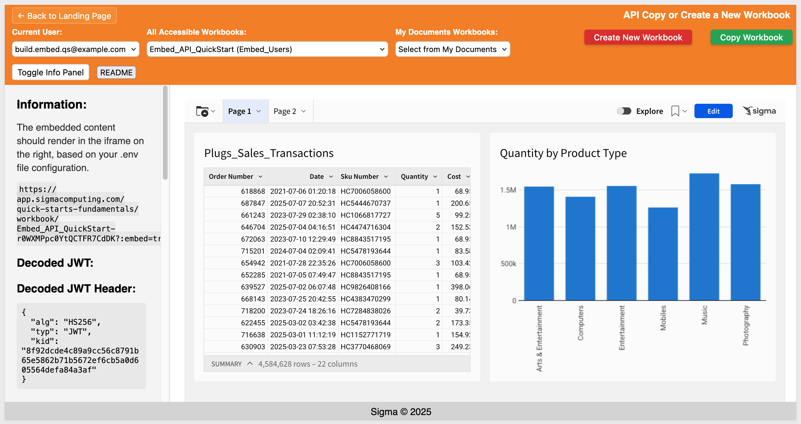

author: pballai
id: embedding_rest_api_useage_06_copy_or_new_wb
summary: embedding_rest_api_useage_06_copy_or_new_wb
categories: embedding
environments: web
status: published
feedback link: https://github.com/sigmacomputing/sigmaquickstarts/issues
tags: default
lastUpdated: 2025-07-25

# REST API Usage 06: Copy or Create a New Workbook 

## Overview 
Duration: 5

The` API Copy or Create Workbook` QuickStart demonstrates how to manage Sigma workbooks programmatically using the REST API. It walks through creating new workbooks, intelligently copying existing ones, and managing sharing behavior—all while delivering a seamless user experience.

This sample implementation showcases how to:
- Create a new workbook and store it in the user’s `My Documents` folder
- Copy an existing workbook, with optional renaming and team workspace sharing
- Handle naming conflicts and pre-load workbooks for immediate use
- Display success feedback, auto-refresh workbook lists, and maintain a polished UI

While this guide uses a specific design pattern, the approach is flexible—demonstrating how Sigma’s API can be used to build custom workbook management workflows that meet the needs of your organization.

<aside class="positive">
<strong>IMPORTANT:</strong><br> We will rely on the information in the README for the implementation details and not discuss them in this QuickStart. A button is provided on the webpage for easy access.
</aside>

<aside class="positive">
<strong>IMPORTANT:</strong><br> This QuickStart builds on the setup from "REST API Usage 01: Getting Started". If you haven’t yet cloned the repo, installed dependencies, and configured your Sigma workspace, please follow that QuickStart first.
</aside>

[REST API Usage 01: Getting Started](https://quickstarts.sigmacomputing.com/guide/embedding_rest_api_usage_01_getting%20started_started/index.html?index=..%2F..index#0)

<aside class="positive">
<strong>IMPORTANT:</strong><br> Some screens in Sigma may appear slightly different from those shown here. This is because Sigma continuously adds and enhances functionality. Rest assured—Sigma’s intuitive interface ensures that any differences won’t prevent you from completing the QuickStart successfully.
</aside>

For more information on Sigma's product release strategy, see [Sigma product releases](https://help.sigmacomputing.com/docs/sigma-product-releases)

If something doesn’t work as expected, here's how to [contact Sigma support](https://help.sigmacomputing.com/docs/sigma-support)

### Target Audience
Developers who want to use Sigma's REST API to programmatically control Sigma in an embedded context.

### Prerequisites

<ul>
  <li>Any modern browser will work.</li>
  <li>Access to your Sigma environment.</li>
  <li>Some familiarity with Sigma is assumed. Not all steps are shown, as the basics are assumed understood.</li>
  <li>Microsoft VSCode or other suitable development tool.</li>
 </ul>

<aside class="positive">
<strong>IMPORTANT:</strong><br> Sigma recommends using non-production resources when completing QuickStarts.
</aside>

<button>[Sigma Free Trial](https://www.sigmacomputing.com/free-trial/)</button><br>

<button>[Download Visual Studio Code](https://code.visualstudio.com/download)</button>

<aside class="negative">
<strong>IMPORTANT:</strong><br> Some features may carry a "Beta" tag. Beta features are subject to quick, iterative changes. As a result, the latest product version may differ from the contents of this document.
</aside>
 


## Start the Server
Duration: 5

Start the Express server in terminal from the `embedding_qs_series_2_api_use_cases` folder and enable debugging:
```code
DEBUG=true npm start
```

The server is ready when it displays: `Server listening at http://localhost:3000`.

Browse to the landing page:
```code
http://localhost:3000
```

Select the `Copy or Create a New Workbook` page and click `Go`.

Select the `Embed_API_QuickStart` workbook:



<aside class="negative">
<strong>NOTE:</strong><br> We are using the "Build" user in this workflow for simplicity only. 
</aside>

<aside class="positive">
<strong>IMPORTANT:</strong><br> Click the `README` button to review the implementation details for this project.
</aside>


<!-- END OF SECTION-->

## Create a New Workbook
Duration: 5

When the page first loads, you’ll see two list controls:
- One showing all workbooks the build user has access to
- One displaying those stored in the build user’s My Documents folder


Click `Create New Workbook` to open the modal.

Enter a name, then click `Create Workbook`:


In this implementation, all newly created workbooks are saved to the user’s `My Documents` folder. However, you could easily modify the logic to allow selection other locations.

Once complete, you’ll see a confirmation message, `Workbook created successfully!`.

You can then find the workbook in Sigma under Recent:

By [impersonating](https://help.sigmacomputing.com/docs/impersonate-users) the build user, you’ll also see the workbook under My Documents:


The newly created workbook (though still empty) is preloaded and appears in the `My Documents` select list as well:


<aside class="negative">
<strong>NOTE:</strong><br> We left the Sigma menu visible in the embed to make the workbook more obvious since it has no content.
</aside>

Once a workbook is created, the `Copy Workbook` button becomes available.

There are many small design decisions behind the `Create New Workbook` functionality. This example illustrates just one possible approach. 

By leveraging the API, you can support a wide range of customized behaviors to fit your organization's needs.


<!-- END OF SECTION-->

## Copy the New Workbook
Duration: 5

Now that a workbook is loaded, you can click `Copy Workbook`.

The user can provide a name for the new workbook or leave it blank. If left blank, the name defaults to the original workbook name with (copy) appended.

In this implementation, users can:
- Save the copy to their own `My Documents` folder
- Optionally share it to any `Team Workspace` they are a member of

This behavior was defined at design time, but could be expanded to support other destinations:


After the copy is complete, a confirmation message appears, `Workbook copied successfully!`.

The new workbook is then loaded for us.

When impersonating the build user in Sigma, we can confirm that:
- The new workbook appears as expected
- The selected `Team Workspace` (if used) has the appropriate access


In this example, we hardcoded the team permission to `View` for simplicity. 

This logic is found in the file: `routes/api/workbook-copy-create.js`, in the following block:
```code
    // If this was a team workspace copy, share the workbook with the team
    if (teamIdForSharing) {
      if (DEBUG) console.log(`Sharing copied workbook with team: ${teamIdForSharing}`);
      
      try {
        const grantsUrl = `${process.env.BASE_URL}/workbooks/${data.workbookId}/grants`;
        const grantsData = {
          grants: [
            {
              grantee: {
                teamId: teamIdForSharing
              },
              permission: 'view'
            }
          ]
        };
```


<!-- END OF SECTION-->

## What we've covered
Duration: 5

In this QuickStart, you learned how to use Sigma’s REST API to create and copy workbooks programmatically. We covered:
- Creating a new workbook and storing it in the user’s My Documents folder
- Handling naming conflicts automatically during workbook creation
- Copying a workbook with optional team workspace sharing
- Preloading and refreshing workbook lists for immediate access
- Assigning default permissions using API-driven logic

This example demonstrates just one way to design a custom workbook management flow—providing a solid foundation you can extend to fit your specific use case.

**Additional Resource Links**

[Blog](https://www.sigmacomputing.com/blog/)<br>
[Community](https://community.sigmacomputing.com/)<br>
[Help Center](https://help.sigmacomputing.com/hc/en-us)<br>
[QuickStarts](https://quickstarts.sigmacomputing.com/)<br>

Be sure to check out all the latest developments at [Sigma's First Friday Feature page!](https://quickstarts.sigmacomputing.com/firstfridayfeatures/)
<br>

[](https://twitter.com/sigmacomputing)&emsp;
[](https://www.linkedin.com/company/sigmacomputing)&emsp;
[](https://www.facebook.com/sigmacomputing)


<!-- END OF WHAT WE COVERED -->
<!-- END OF QUICKSTART -->
