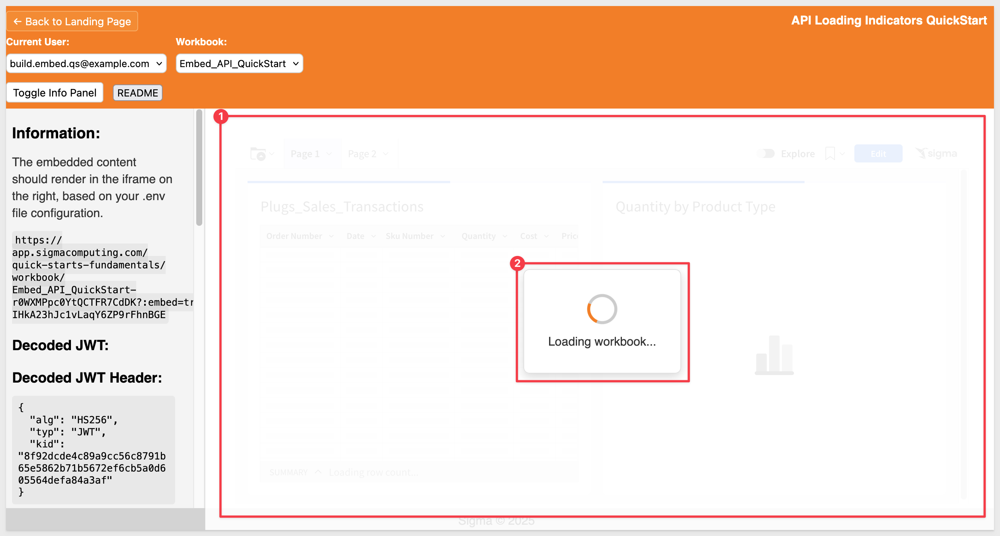

author: pballai
id: embedding_rest_api_useage_07_custom_loader
summary: embedding_rest_api_useage_07_custom_loader
categories: embedding
environments: web
status: published
feedback link: https://github.com/sigmacomputing/sigmaquickstarts/issues
tags: default
lastUpdated: 2025-08-07

# REST API Usage 07: Custom Loading Indicators

## Overview 
Duration: 5

This QuickStart demonstrates how to implement custom loading indicators for Sigma embeds that display while a workbook is loading.

The host application listens for Sigma’s `workbook:dataLoaded` postMessage event to determine when to hide the loading indicator—ensuring a smooth user experience during embed initialization.

<aside class="positive">
<strong>IMPORTANT:</strong><br> We will rely on the information in the README for the implementation details and not discuss them in this QuickStart. A button is provided on the webpage for easy access.
</aside>

<aside class="positive">
<strong>IMPORTANT:</strong><br> This QuickStart builds on the setup from "REST API Usage 01: Getting Started". If you haven’t yet cloned the repo, installed dependencies, and configured your Sigma workspace, please follow that QuickStart first.
</aside>

[REST API Usage 01: Getting Started](https://quickstarts.sigmacomputing.com/guide/embedding_rest_api_usage_01_getting%20started_started/index.html?index=..%2F..index#0)

<aside class="positive">
<strong>IMPORTANT:</strong><br> Some screens in Sigma may appear slightly different from those shown here. This is because Sigma continuously adds and enhances functionality. Rest assured—Sigma’s intuitive interface ensures that any differences won’t prevent you from completing the QuickStart successfully.
</aside>

For more information on Sigma's product release strategy, see [Sigma product releases](https://help.sigmacomputing.com/docs/sigma-product-releases)

If something doesn’t work as expected, here's how to [contact Sigma support](https://help.sigmacomputing.com/docs/sigma-support)

### Target Audience
Developers who want to use Sigma's REST API to programmatically control Sigma in an embedded context.

### Prerequisites

<ul>
  <li>Any modern browser will work.</li>
  <li>Access to your Sigma environment.</li>
  <li>Some familiarity with Sigma is assumed. Not all steps are shown, as the basics are assumed understood.</li>
  <li>Microsoft VSCode or other suitable development tool.</li>
 </ul>

<aside class="positive">
<strong>IMPORTANT:</strong><br> Sigma recommends using non-production resources when completing QuickStarts.
</aside>

<button>[Sigma Free Trial](https://www.sigmacomputing.com/free-trial/)</button><br>

<button>[Download Visual Studio Code](https://code.visualstudio.com/download)</button>

<aside class="negative">
<strong>IMPORTANT:</strong><br> Some features may carry a "Beta" tag. Beta features are subject to quick, iterative changes. As a result, the latest product version may differ from the contents of this document.
</aside>
 


## Start the Server
Duration: 5

Start the Express server in terminal from the `embedding_qs_series_2_api_use_cases` folder and enable debugging:
```code
DEBUG=true npm start
```

The server is ready when it displays: `Server listening at http://localhost:3000`.

Browse to the landing page:
```code
http://localhost:3000
```

Select the `Loading Indicators` page and click `Go`.

<aside class="positive">
<strong>IMPORTANT:</strong><br> Click the `README` button to review the implementation details for this project.
</aside>


<!-- END OF SECTION-->

## Loading Indicators
Duration: 5

Select the `Build` user and any available workbook from the dropdown menus.

Once a workbook is selected, the iframe area becomes translucent and a loading indicator is displayed. The indicator uses a simple CSS spinner:



There are many ways to implement custom loaders; in this case, we chose a lightweight CSS-based approach and centralized the styling in the `/styles/main.css file`. This allows the same loading logic to be reused across other project pages without duplicating code.

The relevant styles begin in the section labeled `CENTRALIZED LOADING INDICATORS` within `main.css`.

```code
/* ============================================================================
   CENTRALIZED LOADING INDICATORS
   ============================================================================ */

/* Loading Overlay for Embeds */
.embed-loading-overlay {
  position: absolute;
  top: 0;
  left: 0;
  width: 100%;
  height: 100%;
  background: rgba(255, 255, 255, 0.9);
  display: flex;
  justify-content: center;
  align-items: center;
  z-index: 1000;
  border-radius: var(--border-radius);
}

/* Loading Spinner Container */
.loading-spinner {
  background: white;
  padding: 2rem;
  border-radius: var(--spacing-sm);
  text-align: center;
  box-shadow: 0 4px 12px rgba(0, 0, 0, 0.15);
  border: 1px solid #e0e0e0;
}

/* Animated Spinner */
.loading-spinner .spinner {
  width: 40px;
  height: 40px;
  border: 4px solid var(--border-light);
  border-top: 4px solid var(--primary-color);
  border-radius: 50%;
  animation: spin 1s linear infinite;
  margin: 0 auto 1rem auto;
}

/* Loading Text */
.loading-spinner .loading-text {
  color: var(--secondary-color);
  font-size: 16px;
  font-weight: 500;
  font-family: var(--font-family);
}

/* Iframe Translucency During Loading */
iframe.loading {
  opacity: 0.85;
  transition: opacity 0.3s ease;
}

iframe:not(.loading) {
  opacity: 1;
  transition: opacity 0.3s ease;
}
```


<!-- END OF SECTION-->

## PostMessage API
Duration: 5

To determine when an embed has fully loaded, the host application listens for Sigma’s outbound JavaScript event: `workbook:dataLoaded`. When this event is received, the application hides the custom loader—ensuring users see a loading indicator during initialization and the embed only appears once it’s ready.

For example, the screenshot below shows the `workbook:dataLoaded` event firing. The final two log entries are additional messages from the sample code used for validation:


### Error Handling
In some cases, an embed may fail to load within a reasonable timeframe. To account for this, the sample implementation includes a 30-second timeout. If the embed doesn't load within that window, a popup appears instructing the user to reload the page.

This timeout is included for demonstration purposes only and can be adjusted or removed based on your use case.

### Loading Indicator Functions
The design is intentionally self-contained in a single `index.html` file, making it easy to understand and modify. All logic related to the loader, event handling, and UI feedback is placed in the `script` section of that file.

Here’s how the logic is organized:

**// UTILITY FUNCTIONS (lines 167–218)**<br>
- showEmbedLoader() – Displays the custom loading overlay
- hideEmbedLoader() – Hides the loading overlay
- showLoadingError() – Displays an error message after timeout
- base64UrlDecode() – Decodes JWTs (not related to loading)

**// SIGMA EMBED EVENT HANDLING (lines 144–164)**<br>
- window.addEventListener("message", ...) – Listens for workbook:dataLoaded and calls hideEmbedLoader() when the event is received

**// SIGMA EMBED FUNCTIONS (line 257+)**<br>
- loadEmbed() – Initiates the embed load and triggers showEmbedLoader()

This structure follows a clear separation of concerns:
- Utility functions are grouped together
- Event handling is centralized
- Embed logic is isolated in its own section

The 30-second timeout is implemented in `showEmbedLoader()` (lines 184-190) using `setTimeout()` and is a key safety feature that ensures users get feedback if the Sigma
embed fails to load or doesn't send the expected `workbook:dataLoaded` event within 30 seconds.


<!-- END OF SECTION-->

## What we've covered
Duration: 5

In this QuickStart, you learned how to implement a custom loading indicator for Sigma embeds using the `workbook:dataLoaded event from the PostMessage API. We covered:
- Displaying a CSS-based loading overlay while the workbook loads
- Listening for the `workbook:dataLoaded` event to hide the loader at the right time
- Handling loading errors with a timeout and fallback messaging
- Structuring loader logic using utility functions, event listeners, and embed triggers

This pattern helps create a smoother, more professional embed experience while giving you full control over how and when content is shown to users.

**Additional Resource Links**

[Blog](https://www.sigmacomputing.com/blog/)<br>
[Community](https://community.sigmacomputing.com/)<br>
[Help Center](https://help.sigmacomputing.com/hc/en-us)<br>
[QuickStarts](https://quickstarts.sigmacomputing.com/)<br>

Be sure to check out all the latest developments at [Sigma's First Friday Feature page!](https://quickstarts.sigmacomputing.com/firstfridayfeatures/)
<br>

[](https://twitter.com/sigmacomputing)&emsp;
[](https://www.linkedin.com/company/sigmacomputing)&emsp;
[](https://www.facebook.com/sigmacomputing)


<!-- END OF WHAT WE COVERED -->
<!-- END OF QUICKSTART -->
