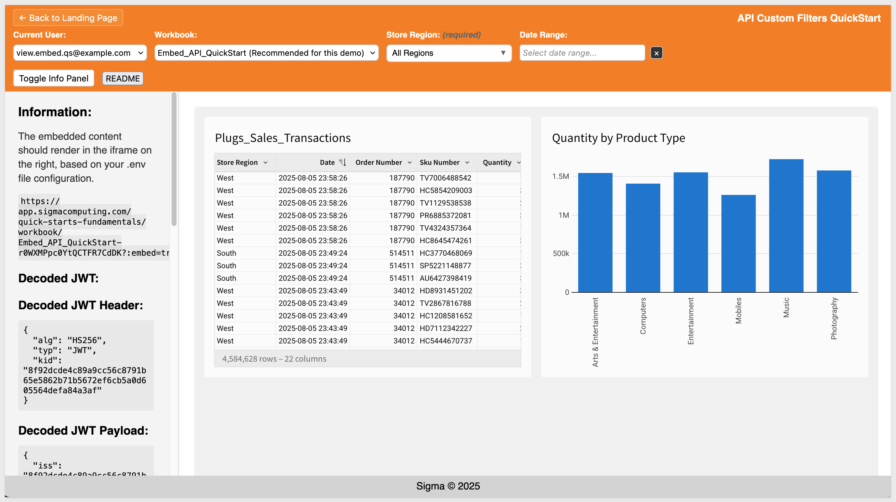
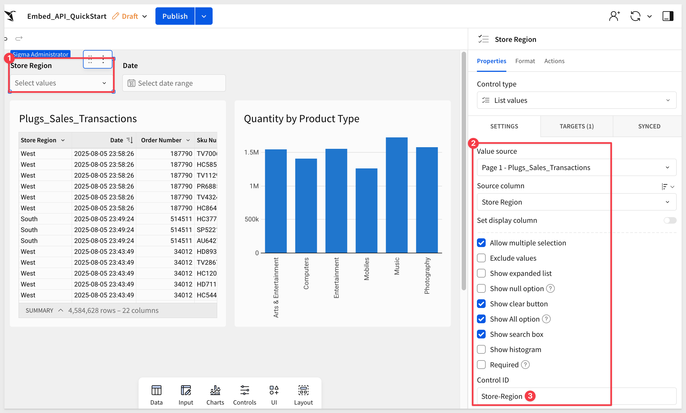
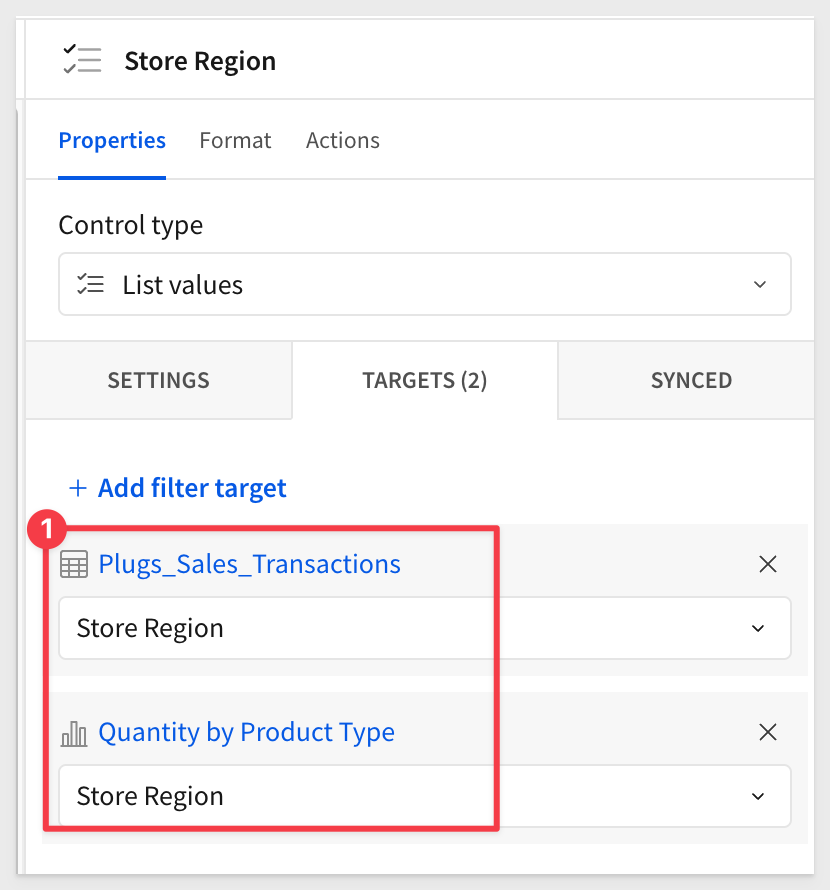
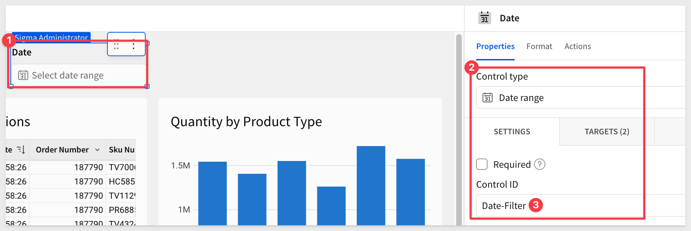
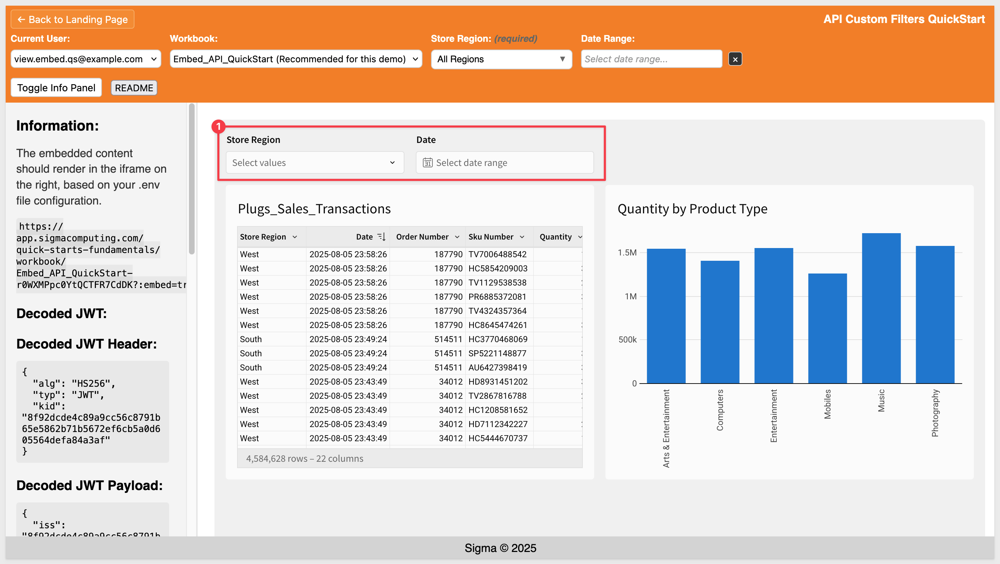
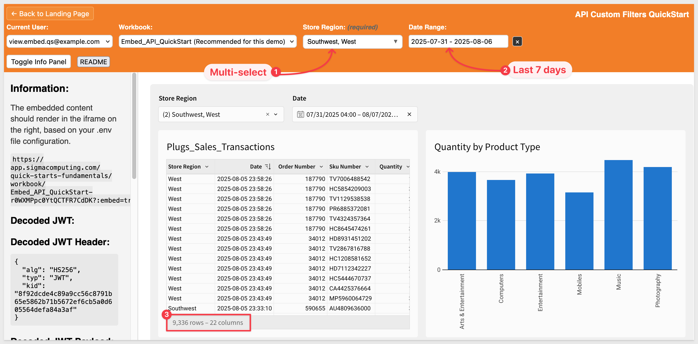
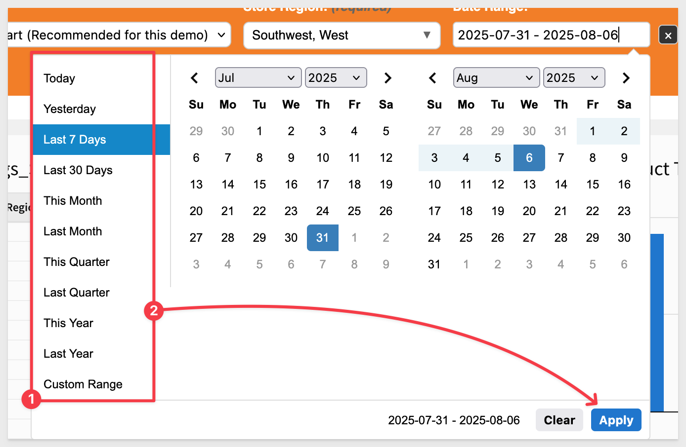
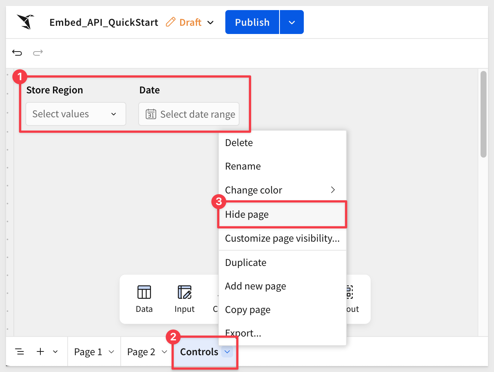

author: pballai
id: embedding_rest_api_useage_08_filters
summary: embedding_rest_api_useage_08_filters
categories: embedding
environments: web
status: published
feedback link: https://github.com/sigmacomputing/sigmaquickstarts/issues
tags: default
lastUpdated: 2025-08-06

# REST API Usage 08: Filters

## Overview 
Duration: 5

This QuickStart demonstrates filter synchronization between a host application and Sigma embeds. It uses `Store Region` and `Date Range `filters in the host application that stay in sync with matching controls in the embedded Sigma workbook—creating a seamless experience where filter changes instantly update the embedded content.

<aside class="positive"> <strong>IMPORTANT:</strong><br> Implementation details are covered in the README and are not repeated in this QuickStart. A button is provided on the webpage for quick access. </aside>
<aside class="positive">

<strong>IMPORTANT:</strong><br> This QuickStart builds on the setup from "REST API Usage 01: Getting Started". If you haven’t yet cloned the repo, installed dependencies, and configured your Sigma workspace, please follow that QuickStart first.
</aside>

[REST API Usage 01: Getting Started](https://quickstarts.sigmacomputing.com/guide/embedding_rest_api_usage_01_getting%20started_started/index.html?index=..%2F..index#0)

<aside class="positive">
<strong>IMPORTANT:</strong><br> Some screens in Sigma may appear slightly different from those shown here. This is because Sigma continuously adds and enhances functionality. Rest assured—Sigma’s intuitive interface ensures that any differences won’t prevent you from completing the QuickStart successfully.
</aside>

For more information on Sigma's product release strategy, see [Sigma product releases](https://help.sigmacomputing.com/docs/sigma-product-releases)

If something doesn’t work as expected, here's how to [contact Sigma support](https://help.sigmacomputing.com/docs/sigma-support)

### Target Audience
Developers who want to use Sigma's REST API to programmatically control Sigma in an embedded context.

### Prerequisites

<ul>
  <li>Any modern browser will work.</li>
  <li>Access to your Sigma environment.</li>
  <li>Some familiarity with Sigma is assumed. Not all steps are shown, as the basics are assumed understood.</li>
  <li>Microsoft VSCode or other suitable development tool.</li>
 </ul>

<aside class="positive">
<strong>IMPORTANT:</strong><br> Sigma recommends using non-production resources when completing QuickStarts.
</aside>

<button>[Sigma Free Trial](https://www.sigmacomputing.com/free-trial/)</button><br>

<button>[Download Visual Studio Code](https://code.visualstudio.com/download)</button>

<aside class="negative">
<strong>IMPORTANT:</strong><br> Some features may carry a "Beta" tag. Beta features are subject to quick, iterative changes. As a result, the latest product version may differ from the contents of this document.
</aside>
 


## Start the Server
Duration: 5

Start the Express server in terminal from the `embedding_qs_series_2_api_use_cases` folder and enable debugging:
```code
DEBUG=true npm start
```

The server is ready when it displays: `Server listening at http://localhost:3000`.

Browse to the landing page:
```code
http://localhost:3000
```

Select the `Custom Filters` page and click `Go`.

Select the `Embed_API_QuickStart` workbook:



The embed will load once a `Current User` is selected. 

<aside class="positive">
<strong>IMPORTANT:</strong><br> Click the `README` button to review the implementation details for this project.
</aside>


<!-- END OF SECTION-->

## Add Controls to Workbook
Duration: 5

Before using the sample application, we need to add the corresponding filter controls to the `Embed_API_QuickStart` workbook. These controls will allow the workbook to process inbound events from the host application when the user changes filters.

In Sigma, open the `Embed_API_QuickStart` workbook.

### List control
Add a `List control` and configure it as shown:



<aside class="positive">
<strong>IMPORTANT:</strong><br> Ensure the Control ID matches exactly, as the host application references the control by this value.
</aside>

Set the `Target` to both elements in the embed, referencing the `Store Region` column.



### Date range control
Add a `Date range` control to the page and configure it as shown. Set both elements in the embed as targets:



`Publish` the workbook.

Now our embed will display the Sigma controls:




<!-- END OF SECTION-->

## Using the Filters
Duration: 5

In the host application, select `Current users`, choose the `Embed_API_QuickStart` workbook, and test the filters by selecting different `Store Regions` and `Date Ranges`.

For example, you can select multiple regions, and the list control will display them as a comma‑delimited list:



The date picker provides all the common ranges, along with a custom range option:



This implementation uses an open‑source jQuery date range picker from [jsdelivr's free CDN](https://www.jsdelivr.com/).

It also incorporates a custom loading indicator, as described in the QuickStart, [REST API Usage 07: Custom Loading Indicators](https://quickstarts.sigmacomputing.com/guide/embedding_rest_api_useage_07_custom_loader/index.html?index=..%2F..index#0)

<aside class="positive">
<strong>IMPORTANT:</strong><br> Click the `README` button to review the implementation details for this project.
</aside>


<!-- END OF SECTION-->

## Hide controls
Duration: 5

Now that the host controls are confirmed to work, you can move them to a hidden page so embed users will not see or interact with them.

In Sigma, select both controls and `Move` them to a new page. 

Rename the new page `Controls` and hide it:



`Publish` the workbook.

With the controls hidden, they no longer appear in the embed, but the host application filters continue to function as expected:


<!-- END OF SECTION -->

## What we've covered
Duration: 5

In this QuickStart, you learned how to synchronize filters between a host application and an embedded Sigma workbook. 

We covered:
- Starting the sample Express server and loading the Custom Filters workbook
- Adding matching filter controls (List and Date Range) in Sigma to respond to host‑side filter changes
- Testing host‑controlled filters for multi‑selection and date range picking
- Using an open‑source jQuery date range picker and integrating a custom loading indicator
- Hiding filter controls on a separate, hidden workbook page while retaining full host application control

This pattern provides a seamless, user‑friendly way to manage embedded content while keeping filter logic centralized in the host application.

**Additional Resource Links**

[Blog](https://www.sigmacomputing.com/blog/)<br>
[Community](https://community.sigmacomputing.com/)<br>
[Help Center](https://help.sigmacomputing.com/hc/en-us)<br>
[QuickStarts](https://quickstarts.sigmacomputing.com/)<br>

Be sure to check out all the latest developments at [Sigma's First Friday Feature page!](https://quickstarts.sigmacomputing.com/firstfridayfeatures/)
<br>

[](https://twitter.com/sigmacomputing)&emsp;
[](https://www.linkedin.com/company/sigmacomputing)&emsp;
[](https://www.facebook.com/sigmacomputing)


<!-- END OF WHAT WE COVERED -->
<!-- END OF QUICKSTART -->
