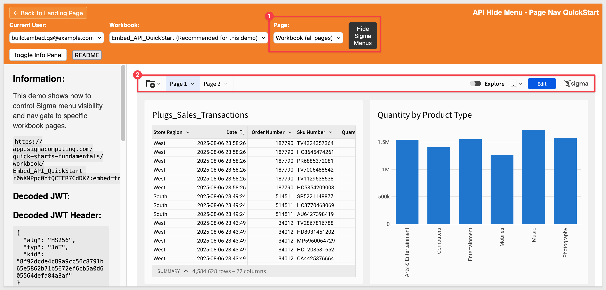
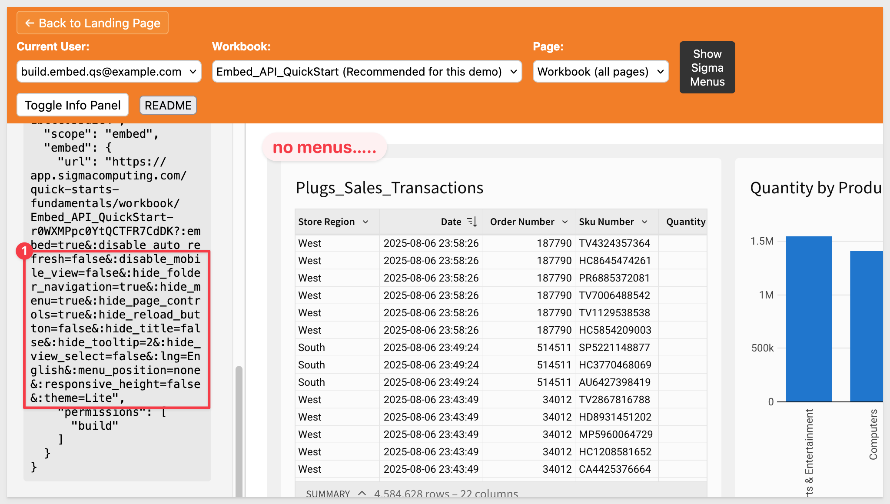
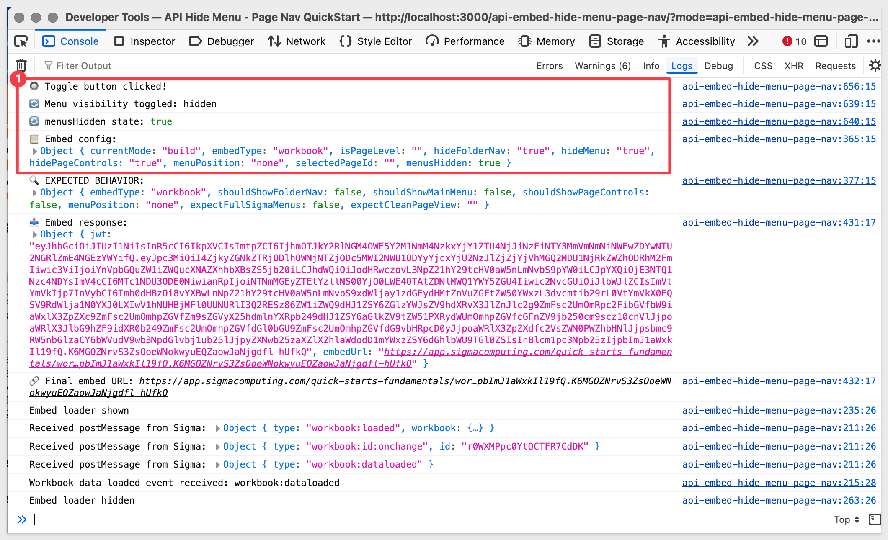
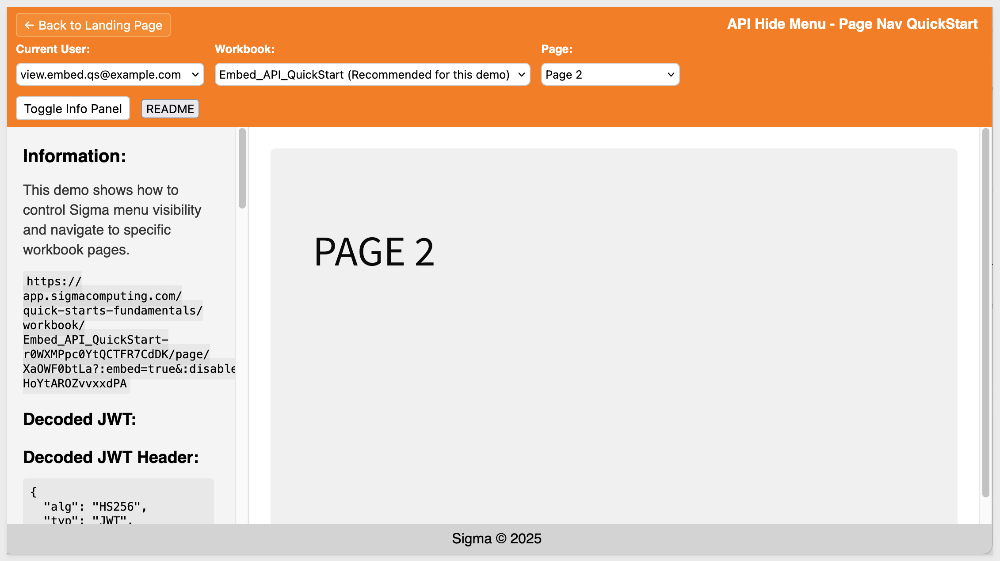

author: pballai
id: embedding_rest_api_useage_09_hide_menus
summary: embedding_rest_api_useage_09_hide_menus
categories: embedding
environments: web
status: published
feedback link: https://github.com/sigmacomputing/sigmaquickstarts/issues
tags: default
lastUpdated: 2025-08-08

# REST API Usage 09: Hide Menus & Page Nav

## Overview 
Duration: 5

Some embed customers prefer to have the host application control page navigation and hide the default menu options included in a Sigma embed.

This QuickStart demonstrates how to hide Sigma's built-in menus, and programmatically navigate between workbook pages using the Sigma Embedding API in an embedded application.

<aside class="positive">
<strong>IMPORTANT:</strong><br> We will rely on the information in the README for the implementation details and not discuss them in this QuickStart. A button is provided on the webpage for easy access.
</aside>

<aside class="positive">
<strong>IMPORTANT:</strong><br> This QuickStart builds on the setup from "REST API Usage 01: Getting Started". If you haven’t yet cloned the repo, installed dependencies, and configured your Sigma workspace, please follow that QuickStart first.
</aside>

[REST API Usage 01: Getting Started](https://quickstarts.sigmacomputing.com/guide/embedding_rest_api_usage_01_getting%20started_started/index.html?index=..%2F..index#0)

<aside class="positive">
<strong>IMPORTANT:</strong><br> Some screens in Sigma may appear slightly different from those shown here. This is because Sigma continuously adds and enhances functionality. Rest assured—Sigma’s intuitive interface ensures that any differences won’t prevent you from completing the QuickStart successfully.
</aside>

For more information on Sigma's product release strategy, see [Sigma product releases](https://help.sigmacomputing.com/docs/sigma-product-releases)

If something doesn’t work as expected, here's how to [contact Sigma support](https://help.sigmacomputing.com/docs/sigma-support)

### Target Audience
Developers who want to use Sigma's REST API to programmatically control Sigma in an embedded context.

### Prerequisites

<ul>
  <li>Any modern browser will work.</li>
  <li>Access to your Sigma environment.</li>
  <li>Some familiarity with Sigma is assumed. Not all steps are shown, as the basics are assumed understood.</li>
  <li>Microsoft VSCode or other suitable development tool.</li>
 </ul>

<aside class="positive">
<strong>IMPORTANT:</strong><br> Sigma recommends using non-production resources when completing QuickStarts.
</aside>

<button>[Sigma Free Trial](https://www.sigmacomputing.com/free-trial/)</button><br>

<button>[Download Visual Studio Code](https://code.visualstudio.com/download)</button>

<aside class="negative">
<strong>IMPORTANT:</strong><br> Some features may carry a "Beta" tag. Beta features are subject to quick, iterative changes. As a result, the latest product version may differ from the contents of this document.
</aside>
 


## Start the Server
Duration: 5

Start the Express server in terminal from the `embedding_qs_series_2_api_use_cases` folder and enable debugging:
```code
DEBUG=true npm start
```

The server is ready when it displays: `Server listening at http://localhost:3000`.

Browse to the landing page:
```code
http://localhost:3000
```

Select the `Hide Sigma Menus / Page Nav` page and click `Go`.

Select the `Build` user and the `Embed_API_QuickStart` workbook.

Since we are using the workbook created during the `REST API Usage 01: Getting Started` QuickStart, we will already have two workbook pages. If not, review [section 3](https://quickstarts.sigmacomputing.com/guide/embedding_rest_api_usage_01_getting%20started_started/index.html?index=..%2F..index#2) of getting started to see how the workbook was created.

When the workbook loads, the `Page` menu is set to show all pages and there is a button that allows the Sigma menus to be toggled on/off:



<aside class="positive">
<strong>IMPORTANT:</strong><br> Click the `README` button to review the implementation details for this project.
</aside>


<!-- END OF SECTION-->

## Hiding Menus
Duration: 5

Clicking the `Hide Sigma Menus` button sends optional user interface parameters to Sigma. These values are embedded in the JWT and can be viewed in the decoded token in the sidebar:



The specific parameters we adjusted are:
```code
HIDE_FOLDER_NAVIGATION     # Show folder navigation (default=false)
HIDE_MENU                  # Show main menu bar (default=false)
HIDE_PAGE_CONTROLS         # Show page controls (default=false)
MENU_POSITION              # Position menus at top (When no value is specified, defaults to none.)
```

These default values are set in the `.env` file, and the application updates them dynamically when the button is clicked.

<aside class="positive">
<strong>IMPORTANT:</strong><br> If you modified any of these ".env" parameter values during other QuickStarts, be sure to reset them to the defaults above to ensure this QuickStart functions as expected.
</aside>

You can see how these parameters are set in your browser’s developer console—each button click is logged for easy inspection:



For more information, see [Embed URL parameters](https://help.sigmacomputing.com/docs/embed-url-parameters)


<!-- END OF SECTION-->

## Page Navigation
Duration: 5

With the Sigma menu hidden, we needed to provide a way to navigate between workbook pages from the host application.

The `Page` list control displays all pages in the selected workbook and allows the user to choose one for display.

The application uses several Sigma Embedding API endpoints to enable dynamic page navigation. These endpoints are fully described in the project’s `README`.

Once a page is selected from the `Pages` control, the button to hide/show menus is hidden. This is because Sigma’s built-in menus are not shown when page-level embeds are used.

For more information, see [What URL to use](https://help.sigmacomputing.com/docs/create-an-embed-api-with-json-web-tokens#what-url-to-use)



### Page control alternatives
We chose to use a list control for simplicity, but there are many other options available to suit your host application’s UX requirements.

The best approach often depends on how many workbook pages exist and how users are expected to navigate them. For example:
For example:

**For just a few pages, a card-based grid can provide visual appeal:**<br>
```html
<div class="page-grid">
  <div class="page-card" data-page-id="123">
    <div class="thumbnail">📊</div>
    <h3>Sales Dashboard</h3>
    <p>Monthly sales performance metrics</p>
  </div>
</div>
```

**With 4–8 pages, a tabbed interface works well:**<br>
```html
<div class="page-tabs">
  <button class="tab active">Overview</button>
  <button class="tab">Sales</button>
  <button class="tab">Analytics</button>
</div>
```

**For 8–20 pages, a sidebar navigation pattern adds clarity:**<br>
```html
<div class="page-sidebar">
  <div class="category">Financial Reports</div>
  <ul class="page-list">
    <li class="page-item">Revenue Dashboard</li>
    <li class="page-item">Cost Analysis</li>
  </ul>
</div>
```

**With 20+ pages, a searchable dropdown is typically most scalable:**<br>
```html
<div class="page-selector">
  <input type="text" placeholder="Search pages...">
  <div class="filtered-results">
    <!-- Dynamic results -->
  </div>
</div>
```

Choose the pattern that best balances usability and scale for your users. Each approach can be wired to Sigma’s page navigation API just like the list control used in this QuickStart.

## Advanced Use Cases
This design pattern can be extended to support more advanced embedding scenarios, including:
- **Role-based menu control** – Customize menu visibility based on user roles or permissions
- **Context-aware navigation** – Display dynamic page lists based on user access or workflow context
- **Branded navigation** – Build custom navigation overlays that wrap and control Sigma embeds
- **Multi-workbook experiences** – Enable seamless navigation across multiple embedded workbooks
- **Mobile-responsive embedding** – Adapt controls and layout for different device screen sizes

Sigma’s embedding API gives you the flexibility to design tailored, high-quality user experiences that match your application’s needs.

## What we've covered
Duration: 5

In this QuickStart, you learned how to customize Sigma embeds by hiding built-in menus and controlling workbook page navigation from a host application. We covered:
- Using .env parameters and JWT settings to control menu visibility in Sigma
- Navigating between workbook pages programmatically using Sigma’s Embedding API
- Designing host-side UI controls (like dropdowns or tabs) to drive embedded page changes
- Exploring alternative UX patterns for page navigation based on the number of pages
- Considering advanced use cases like role-based UI, multi-workbook navigation, and mobile responsiveness

This approach gives developers full control over the embedded experience while preserving the flexibility of Sigma’s native features.

**Additional Resource Links**

[Blog](https://www.sigmacomputing.com/blog/)<br>
[Community](https://community.sigmacomputing.com/)<br>
[Help Center](https://help.sigmacomputing.com/hc/en-us)<br>
[QuickStarts](https://quickstarts.sigmacomputing.com/)<br>

Be sure to check out all the latest developments at [Sigma's First Friday Feature page!](https://quickstarts.sigmacomputing.com/firstfridayfeatures/)
<br>

[](https://twitter.com/sigmacomputing)&emsp;
[](https://www.linkedin.com/company/sigmacomputing)&emsp;
[](https://www.facebook.com/sigmacomputing)


<!-- END OF WHAT WE COVERED -->
<!-- END OF QUICKSTART -->
