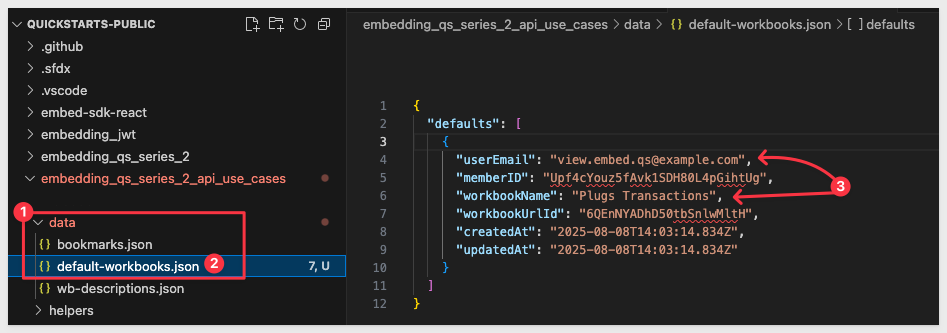

author: pballai
id: embedding_rest_api_useage_10_set_default_workbook
summary: embedding_rest_api_useage_10_set_default_workbook
categories: embedding
environments: web
status: published
feedback link: https://github.com/sigmacomputing/sigmaquickstarts/issues
tags: default
lastUpdated: 2025-08-11

# REST API Usage 10: Set Default Workbook

## Overview 
Duration: 5

This QuickStart demonstrates how to implement a default workbook selection feature for embedded Sigma content using the Sigma API and local storage.

Each user can set one preferred workbook that will automatically load whenever their account is selected. They can also clear their default selection or change it at any time from the list of workbooks they have permission to access.

<aside class="positive">
<strong>IMPORTANT:</strong><br> We will rely on the information in the README for the implementation details and not discuss them in this QuickStart. A button is provided on the webpage for easy access.
</aside>

<aside class="positive">
<strong>IMPORTANT:</strong><br> This QuickStart builds on the setup from "REST API Usage 01: Getting Started". If you haven’t yet cloned the repo, installed dependencies, and configured your Sigma workspace, please follow that QuickStart first.
</aside>

[REST API Usage 01: Getting Started](https://quickstarts.sigmacomputing.com/guide/embedding_rest_api_usage_01_getting%20started_started/index.html?index=..%2F..index#0)

<aside class="positive">
<strong>IMPORTANT:</strong><br> Some screens in Sigma may appear slightly different from those shown here. This is because Sigma continuously adds and enhances functionality. Rest assured—Sigma’s intuitive interface ensures that any differences won’t prevent you from completing the QuickStart successfully.
</aside>

For more information on Sigma's product release strategy, see [Sigma product releases](https://help.sigmacomputing.com/docs/sigma-product-releases)

If something doesn’t work as expected, here's how to [contact Sigma support](https://help.sigmacomputing.com/docs/sigma-support)

### Target Audience
Developers who want to use Sigma's REST API to programmatically control Sigma in an embedded context.

### Prerequisites

<ul>
  <li>Any modern browser will work.</li>
  <li>Access to your Sigma environment.</li>
  <li>Some familiarity with Sigma is assumed. Not all steps are shown, as the basics are assumed understood.</li>
  <li>Microsoft VSCode or other suitable development tool.</li>
 </ul>

<aside class="positive">
<strong>IMPORTANT:</strong><br> Sigma recommends using non-production resources when completing QuickStarts.
</aside>

<button>[Sigma Free Trial](https://www.sigmacomputing.com/free-trial/)</button><br>

<button>[Download Visual Studio Code](https://code.visualstudio.com/download)</button>

<aside class="negative">
<strong>IMPORTANT:</strong><br> Some features may carry a "Beta" tag. Beta features are subject to quick, iterative changes. As a result, the latest product version may differ from the contents of this document.
</aside>
 


## Start the Server
Duration: 5

Start the Express server in terminal from the `embedding_qs_series_2_api_use_cases` folder and enable debugging:
```code
DEBUG=true npm start
```

The server is ready when it displays: `Server listening at http://localhost:3000`.

Browse to the landing page:
```code
http://localhost:3000
```

Select the `Set Default Workbook` page and click `Go`.

Select the `View` user.

Click the black arrow to open the workbooks list, then select the `Plugs Transactions` workbook.

<aside class="negative">
<strong>NOTE:</strong><br>  If you do not have the <strong>Plugs Transactions</strong> workbook, create a workbook in Sigma and share it with both the <strong>View</strong> and <strong>Build</strong> users. The actual workbook content does not matter for this QuickStart.
</aside>


<!-- END OF SECTION-->

## Testing
Duration: 5

Click `Set Default`. The button will turn red, and its label will change to `Clear Default`. 

In the workbook list, the `Plugs Transactions` workbook will now have `(Default)` appended to its name.

A new record is written to the [lowdb](https://sourceforge.net/projects/lowdb.mirror/) JSON database to reflect this setting:



### Clear default
Click `Clear Default` for the `View` user and refresh the browser.

Reselect the `View` user to verify that no workbook is loaded until the user selects one.

### Validating Another State
Set `Embed_API_QuickStart` as the default workbook. Then manually switch to the `Plugs Transactions` workbook.

You’ll now see a `Clear Default` button available for the user:


Set the `Plugs Transactions` as default and then switch to the `Embed_API_QuickStart` workbook.

Click `Clear Default`.

With this workflow, users can easily control which workbook appears when the page loads.

<aside class="negative">
<strong>NOTE:</strong><br> The UX is intentionally simplified for this demonstration. We designed it this way to make the workflow and controls easy to understand. 
</aside>

<aside class="positive">
<strong>IMPORTANT:</strong><br> Click the <strong>README</strong> button to review the implementation details for this project.
</aside>


<!-- END OF SECTION-->

## What we've covered
Duration: 5

In this QuickStart, you learned how to implement a default workbook selection feature for embedded Sigma content using the Sigma API and local storage. This pattern helps personalize the embed experience, making it faster and easier for users to access the workbook they use most often.

**Additional Resource Links**

[Blog](https://www.sigmacomputing.com/blog/)<br>
[Community](https://community.sigmacomputing.com/)<br>
[Help Center](https://help.sigmacomputing.com/hc/en-us)<br>
[QuickStarts](https://quickstarts.sigmacomputing.com/)<br>

Be sure to check out all the latest developments at [Sigma's First Friday Feature page!](https://quickstarts.sigmacomputing.com/firstfridayfeatures/)
<br>

[](https://twitter.com/sigmacomputing)&emsp;
[](https://www.linkedin.com/company/sigmacomputing)&emsp;
[](https://www.facebook.com/sigmacomputing)


<!-- END OF WHAT WE COVERED -->
<!-- END OF QUICKSTART -->
