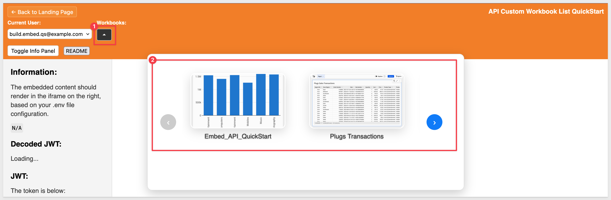
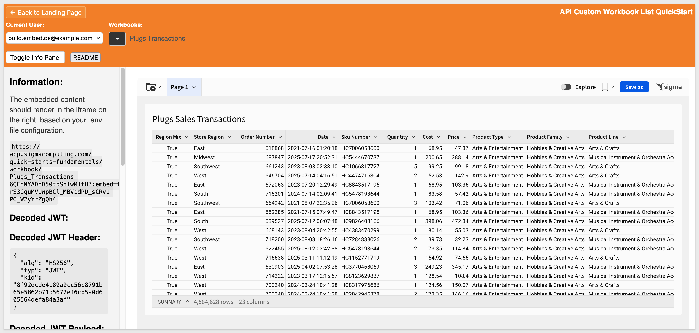
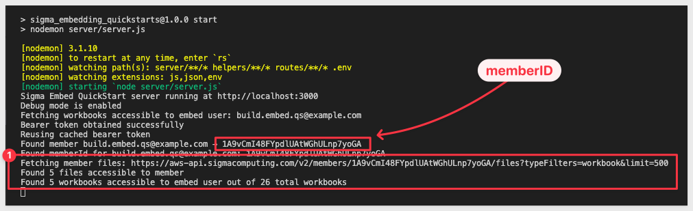
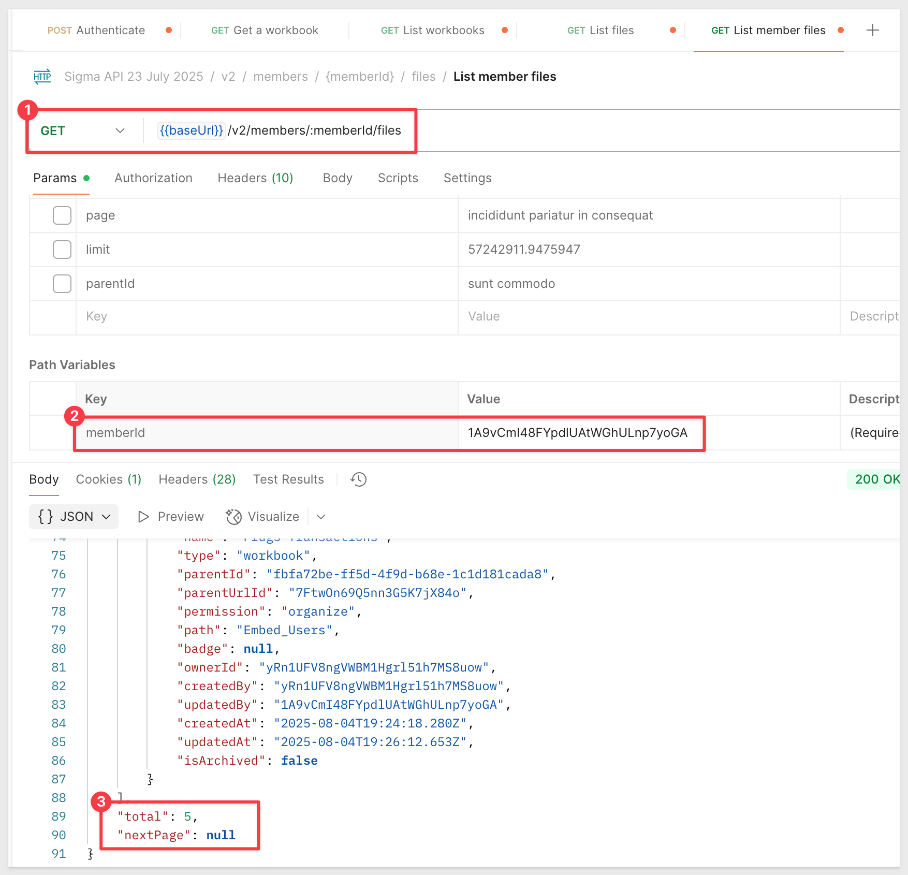

author: pballai
id: embedding_rest_api_useage_11_custom_workbook_list
summary: embedding_rest_api_useage_11_custom_workbook_list
categories: embedding
environments: web
status: published
feedback link: https://github.com/sigmacomputing/sigmaquickstarts/issues
tags: default
lastUpdated: 2025-08-12

# REST API Usage 11: Custom Workbook List

## Overview 
Duration: 5

This QuickStart demonstrates an interactive workbook selection experience using a simple, stable carousel interface. Users can visually browse available workbooks through thumbnail images and smooth navigation, creating an engaging way to discover and select embedded content.

It’s important to understand how the workbooks displayed in the carousel are selected. Sigma is highly flexible, and workbooks can be stored in multiple locations—sometimes leading to content sprawl and the risk of exposing content to unauthorized users, whether embedded or not.

For that reason, it’s best practice to store workbooks in dedicated workspaces and share those workspaces with specific users or teams. In the embed context, maintaining a 1:1 relationship between workspaces and user groups is ideal to simplify management and ensure proper access control.

Our implementation uses the [List member files](https://help.sigmacomputing.com/reference/listaccessibleinodes) API endpoint, which returns **all documents and folders accessible to a specific user.**

In the sample application, when a user is selected, we call this endpoint, pass the user’s `member ID`, and apply a `type filter` for workbooks only. We did not take the additional step of filtering workbooks by storage location or path.

For enhanced security, you could implement path-based filtering—for example, only allowing users to access content in the `Embed_Users` workspace. You could use the user’s team membership to filter the results accordingly. This additional filtering helps prevent accidental exposure of content that users shouldn’t have access to, even if Sigma’s permission system technically permits it.

The filtered response is then displayed using a carousel control, though it could just as easily be rendered with other UI components.

<aside class="positive">
<strong>IMPORTANT:</strong><br> We will rely on the information in the README for the implementation details and not discuss them in this QuickStart. A button is provided on the webpage for easy access.
</aside>

<aside class="positive">
<strong>IMPORTANT:</strong><br> This QuickStart builds on the setup from "REST API Usage 01: Getting Started". If you haven’t yet cloned the repo, installed dependencies, and configured your Sigma workspace, please follow that QuickStart first.
</aside>

[REST API Usage 01: Getting Started](https://quickstarts.sigmacomputing.com/guide/embedding_rest_api_usage_01_getting%20started_started/index.html?index=..%2F..index#0)

<aside class="positive">
<strong>IMPORTANT:</strong><br> Some screens in Sigma may appear slightly different from those shown here. This is because Sigma continuously adds and enhances functionality. Rest assured—Sigma’s intuitive interface ensures that any differences won’t prevent you from completing the QuickStart successfully.
</aside>

For more information on Sigma's product release strategy, see [Sigma product releases](https://help.sigmacomputing.com/docs/sigma-product-releases)

If something doesn’t work as expected, here's how to [contact Sigma support](https://help.sigmacomputing.com/docs/sigma-support)

### Target Audience
Developers who want to use Sigma's REST API to programmatically control Sigma in an embedded context.

### Prerequisites

<ul>
  <li>Any modern browser will work.</li>
  <li>Access to your Sigma environment.</li>
  <li>Some familiarity with Sigma is assumed. Not all steps are shown, as the basics are assumed understood.</li>
  <li>Microsoft VSCode or other suitable development tool.</li>
 </ul>

<aside class="positive">
<strong>IMPORTANT:</strong><br> Sigma recommends using non-production resources when completing QuickStarts.
</aside>

<button>[Sigma Free Trial](https://www.sigmacomputing.com/free-trial/)</button><br>

<button>[Download Visual Studio Code](https://code.visualstudio.com/download)</button>

<aside class="negative">
<strong>IMPORTANT:</strong><br> Some features may carry a "Beta" tag. Beta features are subject to quick, iterative changes. As a result, the latest product version may differ from the contents of this document.
</aside>
 


## Start the Server
Duration: 5

Start the Express server in terminal from the `embedding_qs_series_2_api_use_cases` folder and enable debugging:
```code
DEBUG=true npm start
```

The server is ready when it displays: `Server listening at http://localhost:3000`.

Browse to the landing page:
```code
http://localhost:3000
```

Select the `Custom Workbook List` page and click `Go`.


<!-- END OF SECTION-->

## Testing
Duration: 5

Select either user and click the down arrow to open the carousel:



Scroll the carousel and click any workbook to load it:



<aside class="negative">
<strong>NOTE:</strong><br> Carousel thumbnails are PNG images stored in the <code>/assets/workbook-thumbnails</code> folder with a name that matches the workbook name. Your Sigma instance may contain fewer or different workbooks, and that is expected.
</aside>

### Browser inspection
Using the browser console log, you can observe the sequence of events after selecting the `Build` user (mode):



For additional validation, you can test the `List Workbooks` endpoint in Postman:



For details on using Sigma’s API with Postman, see the QuickStart: [Sigma API with Postman](https://quickstarts.sigmacomputing.com/guide/sigma_api_with_postman/index.html?index=..%2F..index#0)

<aside class="positive">
<strong>IMPORTANT:</strong><br> Click the <strong>README</strong> button to review the implementation details for this project.
</aside>


<!-- END OF SECTION-->

## What we've covered
Duration: 5

In this QuickStart, you learned how to create an interactive workbook selection experience using a carousel interface in an embedded Sigma application. 

This design pattern provides a visually engaging and user-friendly way to browse and load embedded Sigma workbooks, while also highlighting best practices for secure content organization.

**Additional Resource Links**

[Blog](https://www.sigmacomputing.com/blog/)<br>
[Community](https://community.sigmacomputing.com/)<br>
[Help Center](https://help.sigmacomputing.com/hc/en-us)<br>
[QuickStarts](https://quickstarts.sigmacomputing.com/)<br>

Be sure to check out all the latest developments at [Sigma's First Friday Feature page!](https://quickstarts.sigmacomputing.com/firstfridayfeatures/)
<br>

[](https://twitter.com/sigmacomputing)&emsp;
[](https://www.linkedin.com/company/sigmacomputing)&emsp;
[](https://www.facebook.com/sigmacomputing)


<!-- END OF WHAT WE COVERED -->
<!-- END OF QUICKSTART -->
