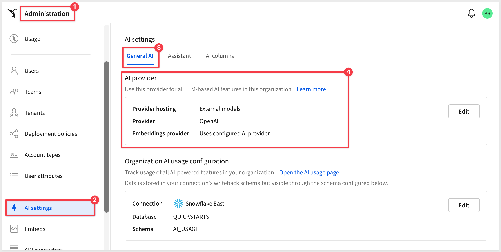
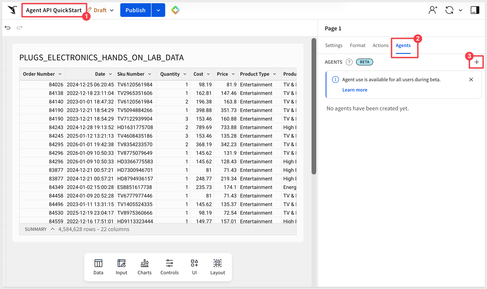
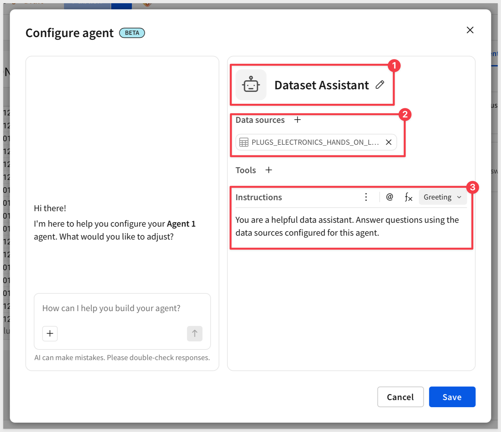
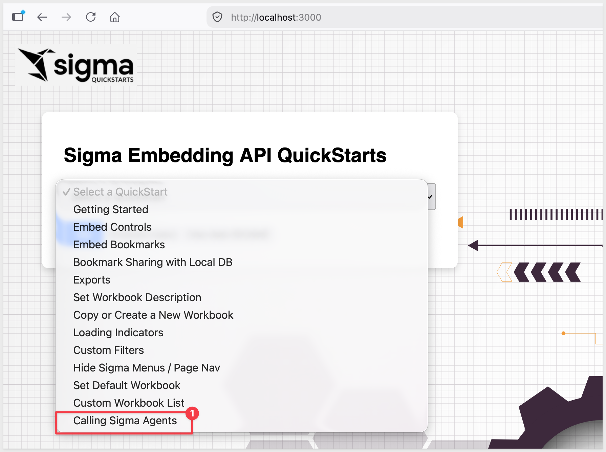
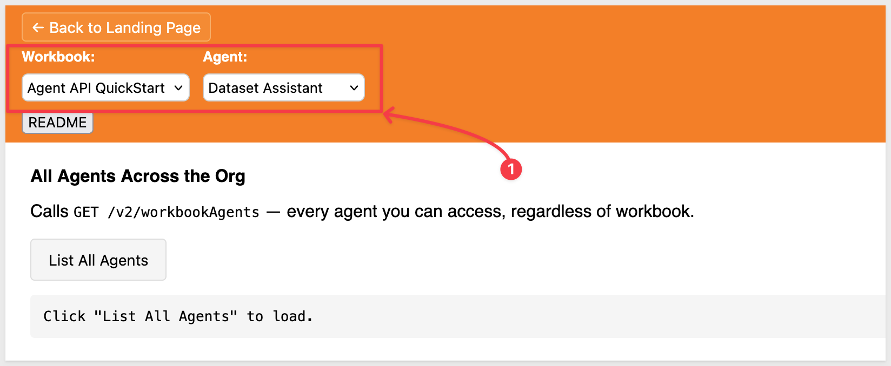
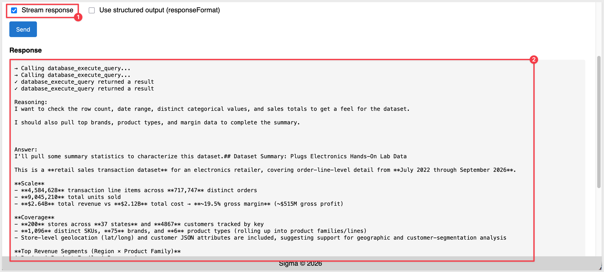
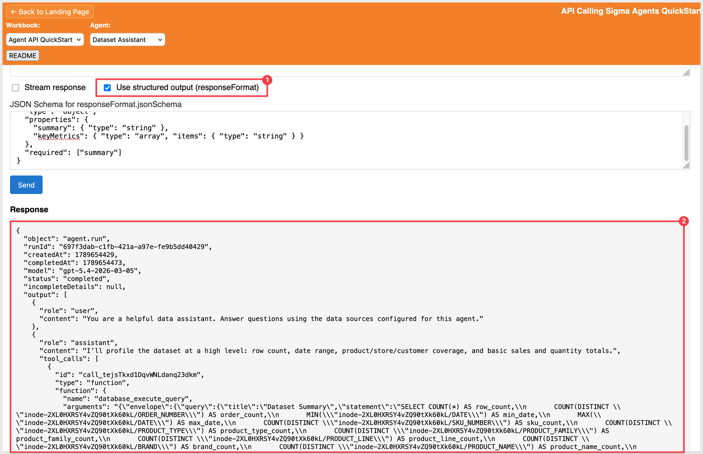

author: pballai
id: embedding_rest_api_useage_12_calling_agents
summary: embedding_rest_api_useage_12_calling_agents
categories: embedding
environments: web
status: Published
feedback link: https://github.com/sigmacomputing/sigmaquickstarts/issues
tags: default
lastUpdated: 2026-09-17

# REST API Usage 12: Call Sigma Agents from Your Application

## Overview
Duration: 5

Until now, a Sigma agent could only be reached from inside a Sigma workbook. This QuickStart shows how to call an agent over the REST API instead, so you can embed it in your own chat interface, trigger it from a scheduled job, or fold its output into another application entirely.

We will call a Sigma agent directly from a REST endpoint — get back a single JSON response, or a live stream of its reasoning and tool calls — without routing through a chat element or a workbook action.

Because these calls run against the same agent configuration you set up in the workbook, governance doesn't change just because the entry point does. Row-level security, the data sources the agent is allowed to query, and the tools it can use are all inherited automatically — there's no separate permission model to define or maintain just because the caller is your own application instead of a person in Sigma.

That inheritance is what makes a few patterns possible that weren't before: embed a Sigma agent inside your own product's chat interface instead of Sigma's, trigger one from a scheduled job to generate a recurring summary, or fold its answer into a pipeline that feeds another system — all without asking your Sigma admins to open up a second, API-specific set of permissions.

The API also carries over the same transparency Sigma Assistant shows in its own UI — you get the agent's reasoning and every tool call it made, not just a final answer — and adds a few things a real integration needs: streaming for a responsive interface, structured output for a predictable shape your code can consume directly, and the ability to pin calls to a tagged workbook version so dev, staging, and production behave consistently.

<aside class="positive">
<strong>IMPORTANT:</strong><br> This QuickStart builds on the setup from "REST API Usage 01: Getting Started". If you haven't yet cloned the repo, installed dependencies, and configured your Sigma workspace, please follow that QuickStart first.
</aside>

[REST API Usage 01: Getting Started](https://quickstarts.sigmacomputing.com/guide/embedding_rest_api_usage_01_getting%20started_started/index.html?index=..%2F..index#0)

<aside class="positive">
<strong>IMPORTANT:</strong><br> Some screens in Sigma may appear slightly different from those shown here. This is because Sigma continuously adds and enhances functionality. Rest assured—Sigma’s intuitive interface ensures that any differences won’t prevent you from completing the QuickStart successfully.
</aside>

For more information on Sigma's product release strategy, see [Sigma product releases](https://help.sigmacomputing.com/docs/sigma-product-releases)

If something doesn’t work as expected, here's how to [contact Sigma support](https://help.sigmacomputing.com/docs/sigma-support)

### Target Audience
Developers who want to call a Sigma agent programmatically, outside of a workbook's chat element or action sequence.

### Prerequisites

<ul>
  <li>Any modern browser will work.</li>
  <li>Access to your Sigma environment.</li>
  <li>Some familiarity with Sigma is assumed. Not all steps are shown, as the basics are assumed understood.</li>
  <li>Microsoft VSCode or other suitable development tool.</li>
  <li>REST API Usage 01: Getting Started completed, including a configured Sigma workspace and client credentials.</li>
  <li>An AI provider configured for your Sigma organization — required before any agent will run. See <a href="https://help.sigmacomputing.com/docs/configure-ai-features-for-your-organization#configure-an-ai-provider">Configure an AI provider</a>.</li>
 </ul>

<aside class="positive">
<strong>IMPORTANT:</strong><br> Sigma recommends using non-production resources when completing QuickStarts.
</aside>

<button>[Sigma Free Trial](https://www.sigmacomputing.com/free-trial/)</button><br>

<button>[Download Visual Studio Code](https://code.visualstudio.com/download)</button>

<aside class="negative">
<strong>IMPORTANT:</strong><br> Some features may carry a "Beta" tag. Beta features are subject to quick, iterative changes. As a result, the latest product version may differ from the contents of this document.
</aside>


<!-- END OF SECTION-->

## Configure an Agent for API Access
Duration: 5

A Sigma agent doesn't need any special setup to be called over the API — the same agent you'd normally reach through a chat element works as-is. This section confirms you have one to call and explains what governs its behavior when the call comes from outside the workbook.

### Confirm your AI provider

Before building an agent, confirm your organization has an AI provider configured — an agent can't run without one.

Log in to Sigma as an `Administrator` and navigate to `Administration` > `AI settings`. Under `AI provider`, confirm a `Provider hosting` option is selected.



<aside class="positive">
<strong>NOTE:</strong><br> This QuickStart was tested using an <strong>External model</strong> provider (OpenAI). Either provider hosting option works for calling an agent over the API — see <a href="https://help.sigmacomputing.com/docs/configure-ai-features-for-your-organization#configure-an-ai-provider">Configure an AI provider</a> if you need to set one up.
</aside>

### Confirm or create an agent

Rather than reusing the shared `Embed_API_QuickStart` workbook from earlier in this series, create a dedicated workbook for this QuickStart so the agent's setup doesn't get tangled up with other REST API Usage examples.

In Sigma, click `Create New` > `Workbook`.

Click `Save as`, name it `Agent API QuickStart`, and save it in the `Embed_Users` workspace created earlier in this series:
```copy-code
Agent API QuickStart
```

<aside class="negative">
<strong>IMPORTANT:</strong><br> Save the workbook inside <code>Embed_Users</code>, not your personal folder. The sample app's workbook picker only lists workbooks whose path matches the <code>WORKSPACE_NAME</code> value in <code>.env</code> — a workbook saved elsewhere won't show up there.
</aside>

Add a table to the workbook as a data source — any table from a connection you have access to works.

In the right panel, click the `Agents` tab.



Click `+` to create a new agent. Double-click the default `Agent 1` name and rename it to something descriptive:
```copy-code
Dataset Assistant
```

<aside class="positive">
<strong>NOTE:</strong><br> Naming the agent matters here — the sample page's agent picker displays this name (via the API's <code>agentName</code> field), so a default <code>Agent 1</code> makes agents hard to tell apart once you have more than one.
</aside>

Point it at the table you just added as a data source, and add a short instruction such as:

```copy-code
You are a helpful data assistant. Answer questions using the data sources configured for this agent.
```



Click `Save`, then click `Publish` on the workbook.

<aside class="negative">
<strong>IMPORTANT:</strong><br> The Agent API reads from the workbook's <strong>published</strong> version, not the draft. If you rename the agent, change its instructions, or add data sources later, you need to <code>Publish</code> again before those changes show up in an API call.
</aside>

<aside class="positive">
<strong>NOTE:</strong><br> A chat element isn't required for this QuickStart. The agent lives at the workbook level independent of any chat element — we're calling it directly, so no chat element needs to be on the page.
</aside>

### How permissions carry over

An API call to an agent runs as the calling user, not as a service account. That means:

- **Row-level security** applies exactly as it would in the Sigma UI — a call made on behalf of a restricted user only sees what that user is allowed to see.
- **Instructions, data sources, and tools** are whatever you configured on the agent in the workbook. There's no separate API-only configuration to maintain.

<aside class="positive">
<strong>WHY IT MATTERS:</strong><br> Your governance model doesn't fork in two directions. Whether someone reaches this agent through a chat element or your own application's API call, the same permissions and configuration apply — one place to manage both.
</aside>


<!-- END OF SECTION-->

## Start the Server / List Available Agents
Duration: 5

With the agent in place, switch to the sample application to make the actual API calls. It uses the same project as the rest of this series, so a new page is all that's needed.

Start the Express server in terminal from the `embedding_qs_series_2_api_use_cases` folder:
```copy-code
npm start
```

The server is ready when it displays: `Server listening at http://localhost:3000`.

Browse to the landing page:
```copy-code
http://localhost:3000
```

Select the `Calling Sigma Agents` page and click `Go`.



<aside class="positive">
<strong>IMPORTANT:</strong><br> Most implementation details (routing, environment setup, error handling) are covered in the README rather than repeated here. The actual request code that calls Sigma's Agent API is shown inline in the next section, since that's the point of this QuickStart. A button is provided on the webpage for quick access to the full README.
</aside>

### Find an agent to call

Before calling an agent, you need its `workbookId` and `agentId`. Rather than hunting for these in the Sigma UI, the sample page calls two endpoints to look them up:

- `GET /v2/workbookAgents` returns every agent you can access across the org
- `GET /v2/workbooks/{workbookId}/agents` returns just the agents on a specific workbook

The page lists the results in a dropdown. Select the agent you configured in the previous section.



<aside class="positive">
<strong>NOTE:</strong><br> Listing agents this way is also how you'd discover agents programmatically in a real integration — for example, to populate a picker in your own application rather than hardcoding an `agentId`.
</aside>


<!-- END OF SECTION-->

## Call an Agent and Stream the Response
Duration: 8

With a workbook and agent selected, you're ready to call it. We'll start with a single non-streaming call, then switch on streaming to see the difference.

### The actual request

Underneath the UI, the sample app's backend makes a straightforward proxy call to Sigma — this is the part of the code that actually matters for this QuickStart:

```javascript
// Non-streaming: one request, one JSON response
const response = await axios.post(url, req.body, { headers });
res.json(response.data);

// Streaming: same request, but the response is piped straight through
const upstream = await axios.post(url, req.body, {
  headers,
  responseType: "stream",
});
upstream.data.pipe(res);
```

`url` is `{BASE_URL}/workbooks/{workbookId}/agents/{agentId}`, `headers` carries the bearer token from client credentials, and `req.body` is whatever the caller sent — `messages`, `stream`, and `responseFormat` all pass through untouched. Everything else in the route (auth token handling, error responses) is in `routes/api/agents.js`, covered in the README.

### Send a non-streaming message

### Send a non-streaming message

We can use the default text in the `Message` box:
```copy-code
Summarize this dataset.
```

Leave `Stream response` unchecked and click `Send`.

The response comes back as a single JSON object once the agent finishes — but `output` isn't just the final answer, it's the agent's full multi-turn trace:

```json
{
  "object": "agent.run",
  "runId": "...",
  "status": "completed",
  "output": [
    {
      "role": "assistant",
      "reasoning": "I want to get a sense of the data first...",
      "content": "I'll pull some summary statistics to describe this dataset.",
      "tool_calls": [
        { "id": "...", "type": "function", "function": { "name": "database_execute_query", "arguments": "..." } }
      ]
    },
    {
      "role": "tool",
      "tool_call_id": "...",
      "content": "# Query result...\n<table>...</table>"
    },
    {
      "role": "assistant",
      "content": "## Dataset Summary\n\nThis dataset covers 4.5M order-line records..."
    }
  ],
  "usage": {
    "turns": 2,
    "durationMs": 26638,
    "inputTokens": 15388,
    "outputTokens": 2066,
    "totalTokens": 17454
  },
  "workbookVersion": 4
}
```

Every step the agent took is in there: which query it decided to run and why (`reasoning`, `tool_calls`), the raw result that came back (`role: "tool"`), and its final written answer (the last `role: "assistant"` entry). That's the same transparency Sigma Assistant shows in the UI — reasoning, tool calls, and sources — just available as data instead of a chat transcript. For a simple display, take the last entry in `output`; for anything closer to a real chat UI, you'll want the intermediate steps too.

`usage` gives you enough to track cost and latency per call — the same data backing Sigma's AI usage dashboard, just scoped to this one request.

### Stream the response

Check `Stream response` and click `Send` again, using the same message.

Instead of waiting for the full run to finish, the response arrives as a stream of server-sent events — one small JSON payload at a time:

```
event: text-delta
data: {"type":"text-delta","delta":"I","channel":"reasoning"}

event: tool-call
data: {"type":"tool-call","callId":"toolu_...","name":"database_execute_query"}

event: tool-result
data: {"type":"tool-result","callId":"toolu_...","name":"database_execute_query","output":"...","isError":false}

event: text-delta
data: {"type":"text-delta","delta":"## Dataset Summary","channel":"answer"}
```

Each event's `data` payload carries a `type` field telling you what to do with it:

- **`text-delta`** — a chunk of text. The `channel` field tells you which stream it belongs to: `reasoning` is the agent thinking through its approach, `answer` is the actual reply you'd show the user.
- **`tool-call`** — the agent has decided to call a tool (its arguments stream in separately via `tool-call-args-delta` events, chunked the same way as text).
- **`tool-result`** — the tool finished and returned its output.

The sample page parses this stream and renders it as a running activity log plus a live-growing answer, rather than showing the raw event text:



<aside class="positive">
<strong>WHY IT MATTERS:</strong><br> Streaming is what makes a custom chat interface feel responsive. A user watching a spinner for several seconds reads very differently than one watching an answer appear as it's generated — even though the total time is the same. The separate <code>reasoning</code> channel also means you can choose to show or hide the agent's thinking, the same way Sigma Assistant lets you expand "Analysis breakdown" in the UI.
</aside>

<aside class="positive">
<strong>NOTE:</strong><br> The API also supports running an agent against a specific tagged workbook version, so a dev, staging, or production caller can get stable, predictable behavior instead of always hitting the latest published version. Sigma's docs describe this capability without yet detailing the exact parameter — check <a href="https://help.sigmacomputing.com/docs/call-agents-with-the-api">Call Sigma agents with the API</a> for the current specifics before relying on it.
</aside>


<!-- END OF SECTION-->

## Structured Output with responseFormat
Duration: 5

An agent's answer normally comes back as prose — great for a chat window, harder to drop into your own application's data model. `responseFormat` lets you ask for that same answer shaped as JSON matching a schema you provide, instead.

### Request a JSON Schema

Check `Use structured output (responseFormat)`. The sample page fills in a starter schema:

```
{
  "type": "object",
  "properties": {
    "summary": { "type": "string" },
    "keyMetrics": { "type": "array", "items": { "type": "string" } }
  },
  "required": ["summary"]
}
```

Click `Send`.

Alongside the usual `output` trace, the response now includes an `outputParsed` field shaped exactly like the schema:

```json
{
  "outputParsed": {
    "summary": "High-level dataset summary: 4,584,628 rows and 717,747 orders spanning 2022-07-17 to 2026-09-15, with 1,096 SKUs across 6 product types...",
    "keyMetrics": [
      "Rows: 4,584,628",
      "Orders: 717,747",
      "Total revenue: 2,638,400,049.98",
      "Top product family by revenue: Hobbies & Creative Arts (731,746,615.28)"
    ]
  }
}
```

That's the difference `responseFormat` makes: instead of regex-ing an answer out of `output`'s free text, you read `outputParsed` directly — the same shape every time, ready to hand to your own UI or downstream logic:



<!-- <aside class="negative">
<strong>KNOWN ISSUE:</strong><br> As of this writing, <code>responseFormat</code> fails when the org's AI provider is set to <strong>Data warehouse hosted model</strong> backed by Claude Sonnet 5 — you'll get <code>400 This model does not support assistant message prefill. The conversation must end with a user message.</code> Switching <code>Administration</code> &gt; <code>AI settings</code> &gt; <code>Provider hosting</code> to <strong>External model</strong> (bringing your own OpenAI or Anthropic API key) resolved it in testing. This is a model-compatibility issue on Sigma's side, not a request-shape problem — if you hit this error, it isn't your setup.
</aside> -->

<aside class="positive">
<strong>NOTE:</strong><br> The AI provider is an org-wide setting — if you switched it to test this, remember to switch it back afterward if that change wasn't intended to stick.
</aside>


<!-- END OF SECTION-->

## What We've Covered
Duration: 5

We took a Sigma agent that previously only lived inside a chat element or an action sequence, and turned it into a callable service — reachable from a script, a scheduled job, or an interface we built ourselves.

### Core concepts
- **List agents programmatically** — `GET /v2/workbookAgents` and `GET /v2/workbooks/{workbookId}/agents` let an application discover which agents it can call, rather than hardcoding IDs
- **Call an agent directly** — `POST /v2/workbooks/{workbookId}/agents/{agentId}` runs the agent and returns its full multi-turn trace: reasoning, tool calls, tool results, and a final answer
- **Stream the response** — the same call, with `stream: true`, delivers that trace incrementally as server-sent events instead of waiting for the full run to finish
- **Request structured output** — `responseFormat` returns an `outputParsed` object matching a JSON Schema you define, instead of prose you'd have to parse yourself

### Key takeaways

**Permissions don't fork:**
An API call runs as the calling user, with the same row-level security, data sources, and tools configured on the agent in the workbook — no separate API-only permission model to maintain.

**Transparency travels with the call:**
The same reasoning-and-tool-calls visibility Sigma Assistant shows in the UI is available as data over the API — useful for debugging, for building trust in a custom interface, or for logging what an agent actually did.

**Structured output is what makes an agent usable inside other software:**
Prose is fine for a chat window. A JSON object matching a schema you defined is what lets an agent's output flow into your own application's data model without brittle text parsing.

### Next steps

- [Call Sigma agents with the API](https://help.sigmacomputing.com/docs/call-agents-with-the-api)
- [Build Sigma agents](https://help.sigmacomputing.com/docs/build-agents)
- [Configure AI features for your organization](https://help.sigmacomputing.com/docs/configure-ai-features-for-your-organization)

For building a conversational interface inside a Sigma workbook instead of a custom application, see [Build Conversational AI Apps with Chat Elements and Snowflake Cortex](https://quickstarts.sigmacomputing.com/guide/aiapps_chat_element/index.html)

**Additional Resource Links**

[Blog](https://www.sigmacomputing.com/blog/)<br>
[Community](https://community.sigmacomputing.com/)<br>
[Help Center](https://help.sigmacomputing.com/hc/en-us)<br>
[QuickStarts](https://quickstarts.sigmacomputing.com/)<br>

Be sure to check out all the latest developments at [Sigma's First Friday Feature page!](https://quickstarts.sigmacomputing.com/firstfridayfeatures/)
<br>

[](https://twitter.com/sigmacomputing)&emsp;
[](https://www.linkedin.com/company/sigmacomputing)&emsp;
[](https://www.facebook.com/sigmacomputing)


<!-- END OF WHAT WE COVERED -->
<!-- END OF QUICKSTART -->
