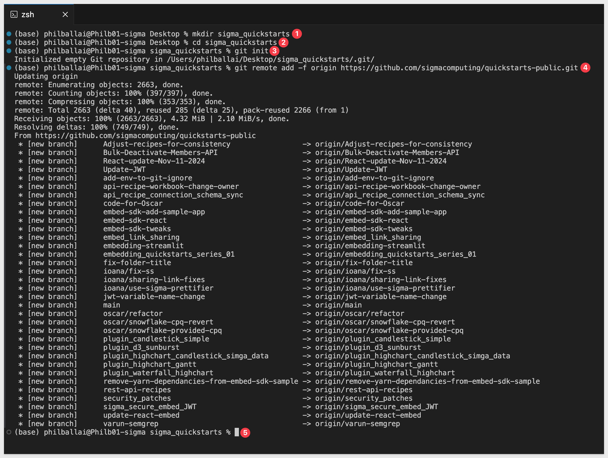
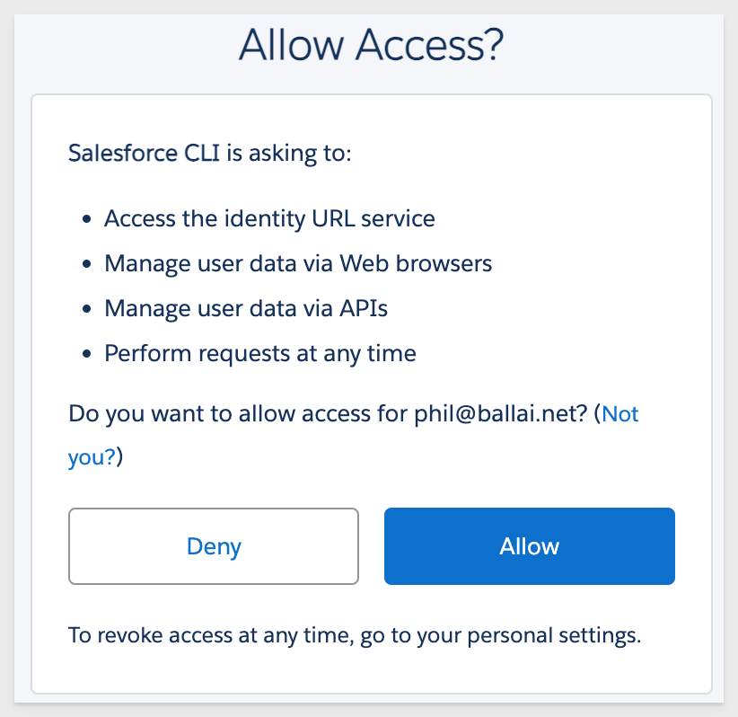
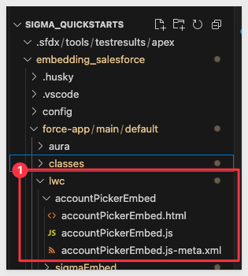

author: pballai
id: embedding_use_case_embed_into_salesforce_v3
summary: embedding_use_case_embed_into_salesforce_v3
categories: Embedding
environments: web
status: Published
feedback link: https://github.com/sigmacomputing/sigmaquickstarts/issues
tags: embedding
lastUpdated: 2025-05-27

# Use Case: Embed into Salesforce

## Overview 
Duration: 5 

This QuickStart introduces you to embedding Sigma into Salesforce.

We will use a Salesforce developer account and a Sigma trial to demonstrate two simple use cases:

1: Embedding a static table from Sigma's sample database inside Salesforce, Using an Lightning Web Component (LWC) with a select list.

2: Using a LWC (select list value) to pass the selected value to filter the table in the Sigma embed. 

<aside class="positive">
<strong>IMPORTANT:</strong><br> Some screens in Sigma may appear slightly different from those shown in QuickStarts. This is because Sigma continuously adds and enhances functionality. Sigma’s intuitive interface ensures that any differences won’t prevent you from completing this QuickStart successfully.
</aside>

For more information on Sigma's product release strategy, see [Sigma product releases](https://help.sigmacomputing.com/docs/sigma-product-releases)

If something doesn’t work as expected, here's how to [contact Sigma support](https://help.sigmacomputing.com/docs/sigma-support)

### Target Audience
Semi-technical users involved in planning or implementing Sigma embedding. No SQL or technical data skills are needed to complete this QuickStart. It does assume some common computer skills like installing software, using Terminal, navigating folders and copy/paste operations.

### Prerequisites

<ul>
  <li>A computer with a current browser. Any modern browser will work.</li>
  <li>Admin access to a Sigma environment.</li>
  <li>Admin access to a Salesforce environment.</li>
</ul>

<aside class="positive">
<strong>IMPORTANT:</strong><br> Sigma recommends using non-production resources when completing QuickStarts.
</aside>

<aside class="negative">
<strong>IMPORTANT:</strong><br> Some features may carry a "Beta" tag. Beta features are subject to quick, iterative changes. As a result, the latest product version may differ from the contents of this document.
</aside>

<button>[Free Sigma Trial](https://www.sigmacomputing.com/free-trial/)</button>   <button>[SalesForce Dev. Account](https://developer.salesforce.com/signup)</button>


<!-- END -->

## Sigma Configuration
Duration: 5 

We’ll move through this section quickly, assuming you've completed similar steps in Sigma before.

Log into Sigma as the `Administrator`, create a new workbook, and add a table element to the page.

Use the Sigma sample database to create a workbook containing one table.

Set the table’s source to the `ACCOUNT` table from the `Sigma Sample Database` > `APPLICATIONS ` > `SALESFORCE` schema:


We will use the `Name` column later in this exercise, we moved that to the first position.

Click `Save as` and name the workbook `Use Case: Embed into Salesforce QuickStart`.

Open the published version:


Copy the full URL from your browser — we’ll use it in the next section

<aside class="negative">
<strong>NOTE:</strong><br> Sigma supports embedding workbooks, pages, single elements or even the Ask Sigma interface.
</aside>

For more information on URL formats for JWT embedding, see [What URL to use](https://help.sigmacomputing.com/docs/create-an-embed-api-with-json-web-tokens#what-url-to-use)

### Share with team
Share the workbook with the `Sales_People` team we created in the `Embedding 01: Getting Started` QuickStart, granting `Can view` permission:


### Sigma Embed Credentials
Now we’ll generate credentials to secure the embed in Salesforce.

Navigate to `Administration` > `Developer Access`:


Click `Create New `in the top-right corner. This opens the `Create client credentials` modal.

Under `Select privileges` choose `Embedding`.

Provide a `Name` and `Description` of your choice.

Under `Owner`, select an organization member with the account type you want to associate with the embed secret. For now, select yourself or another Administrator.

<aside class="negative">
<strong>BEST PRACTICE:</strong><br> Use service accounts for key operations like client credentials.
</aside>


Click `Create.`

Copy the generated `Client ID` and `Secret`, and store them for later use


Click `Close.`

These credentials can be used for all embeds, but you may create as many credentials as you prefer.


<!-- END OF SECTION-->

## Git Repository
Duration: 5

### Clone the Git Repository Project Folder
We have made sample project code available in a public GitHub repository to save time.

While you may clone the entire repository (it is not that large), we’ll avoid cloning portions of the repository that aren't immediately relevant.

Instead, we will use VSCode and terminal to perform a git `sparse-checkout` of the specific project folder we are interested in. 

This takes a few extra steps, but results in a cleaner local project folder.

Open `VSCode` and a new `Terminal` session.

Create a new directory in a location of your choice, using the command:

For example:
```code
mkdir sigma_quickstarts
```

Change to the new directory:
```code
cd sigma_quickstarts
```

Execute the terminal command:
```code
git init
```

Add the remote repository as the origin:
```code
git remote add -f origin https://github.com/sigmacomputing/quickstarts-public.git
```

No errors should show:



Enable sparse checkout:
```code
git config core.sparseCheckout true
```

Specify the folder you want to clone by adding it to the sparse-checkout configuration and also clone to project configuration file:
```code
echo "embedding_salesforce" >> .git/info/sparse-checkout
echo "embedding_salesforce/sfdx-project.json" >> .git/info/sparse-checkout
```

Pull the specified folder from the repository:
```code
git pull origin main
```

Once complete, your local `sigma_quickstarts` folder will contain the embedding_salesforce project:


<!-- END OF SECTION-->

## VSCode Configuration
Duration: 5 

In VSCode, click the `Extensions` icon, search for `Salesforce ext` and select the `Salesforce Extension Pack`:


Accept any warnings about publisher trust. The installation takes a few minutes.

The Salesforce Extension Pack depends on the Salesforce CLI under the hood.

In a browser, go to the [Salesforce CLI page](https://developer.salesforce.com/tools/sfdxcli) and download the version for your operating system.

Run the installer and follow the prompts. Nothing special here, just a standard installation.

Once installed, we can test it by running:

In VSCode, open a new terminal session.

```code
sfdx --version
```

The terminal should return a version message, similar to: (OS dependent):
```code
@salesforce/cli/2.89.8 darwin-arm64 node-v22.15.0
```

### Authorize the Salesforce org
Run this in the VSCode terminal:

```code
sfdx auth:web:login --alias myOrg --instance-url https://login.salesforce.com --set-default
```

A browser will open requesting that you log into your Salesforce org. Provide your credentials and login.

Salesforce will ask if it should allow access:



You’ll see a message confirming: "Authentication Successful. You've successfully logged in. You can now close this browser tab or window."

The terminal will confirm that your org is connected to your local project:


<!-- END OF SECTION-->

## Configure the Embed
Duration: 5

We need to configure the embed parameters in our VSCode project files. Apart from other files mentioned in use case two, no other files were added to the project to make it work.

### Use Case 1: Basic Sigma Embed
The project has four files to support the static embed, two of which require editing, located in the project as shown below:


**1: sigmaEmbed.js**
- Handles the LWC logic. On component load, it calls an Apex method to retrieve a signed JWT, then builds the full Sigma iframe URL. using your Base URL and workbook slug.
- We can refer to this as the Sigma embed API.

Open this file and replace the placeholders for `{YOUR_ORG_SLUG}` and `{YOUR_WORKBOOK_ID}` in the code-block below:

```code
// This method is called when the component is inserted into the DOM
connectedCallback() {
    getSignedJWT()
        .then(jwt => {
            const baseUrl = 'https://app.sigmacomputing.com/{YOUR_ORG_SLUG}/workbook';
            const workbookSlug = 'Use-Case-Embed-into-Salesforce-QuickStart-{YOUR_WORKBOOK_ID}';
            const cacheBuster = `&_ts=${Date.now()}`;
            this.iframeUrl = `${baseUrl}/${workbookSlug}?:embed=true&:jwt=${jwt}${cacheBuster}`;
        })
        .catch(error => {
            console.error('Failed to fetch JWT:', error);
        });
 }
```

Save the file after editing.

**2: SigmaJWTController.cls**<br>
The Apex class functions as your embed API — it signs a JWT server-side and provides it to the LWC, which then constructs the Sigma embed URL.

- This Apex class signs the JWT and contains:
    - getSignedJWT() — the method called by the component
    - Helper methods to encode the JWT and generate a UUID
    - Your `clientId` and `secret` from Sigma

Open this file and replace the placeholders for `{YOUR_CLIENT_ID}` and `{YOUR_SECRET}` in this code-block:

```code
// Replace these with your actual Sigma credentials
    String clientId = '{YOUR_CLIENT_ID}';  // Your Sigma client ID
    String secret = '{YOUR_SECRET}';  // Your Sigma secret key
```

Save the file after editing.

**3: sigmaEmbed.html**<br>
- Renders the Sigma embed using an iframe element. Once the iframeUrl is available, the workbook appears inside Salesforce.
- No edits required.

**4: sigmaEmbed.js-meta.xml**<br>
- Makes the component usable inside the Lightning App Builder. Enables this LWC to be dropped on App or Record pages.
- No edits required.


### Deploy to Org
In the VSCode terminal, run this command, making sure that you are in the `embedding_salesforce` folder:

```code
sf deploy metadata --source-dir force-app/main/default/classes/SigmaJWTController.cls \
                   --source-dir force-app/main/default/classes/SigmaJWTController.cls-meta.xml \
                   --source-dir force-app/main/default/lwc/sigmaEmbed
```

This deploys: the Apex controller, the Lightning Web Component, and its metadata.


<!-- END -->

## Salesforce Configuration
Duration: 10

Now that you've deployed the component, we can put your sigmaEmbed Lightning Web Component onto a page.

<aside class="negative">
<strong>NOTE:</strong><br> It is recommended to use a private (incognito) browser to test to avoid caching issues.
</aside>

Log into Salesforce, click on the gear icon and select `Setup`:


Search for `App Builder` in setup:


It's okay if you're briefly redirected through Salesforce Classic.

Click `New`, choose `App Page` and click `Next`

Name it something like `Sigma Embed`.

Choose a layout (`One Region` is fine).

Search for `Sig` in the `Components` list.

Drag the `sigmaEmbed` component onto the canvas:


It should initially display “Loading Sigma dashboard...” by default followed by the embedded content:


Click save.

Decide where this page should appear in Salesforce by clicking `Activate` and selecting the `LIGHTNING EXPERIENCE` tab. Then click `Add page to app`.

Use the up/down arrows to position `Sigma Embed` where you'd like it to appear in the app navigation:


Click `Save`.

Navigate to the `Sales` page in Salesforce:


Now we can use the Sigma embed as if it was natively part of Salesforce!


<aside class="negative">
<strong>NOTE:</strong><br> We limited the functionality on this embed by specifying 'account_type' => 'View' in the project file "SigmaJWTController.cls".

The account_type value affects what the user can do inside the embed. 

For example, changing it to Build or Analyze allows editing or export access, depending on your Sigma permissions.
</aside>

For more information, see [Create and manage account types](https://help.sigmacomputing.com/docs/create-and-manage-account-types)


<!-- END -->

## Use Case Two
Duration: 5

It is often useful to enhance the level of interactivity between Salesforce and Sigma by passing values to Sigma when a user clicks a value in Salesforce.

For example, a user viewing an account list in Salesforce may want to select a specific account and have Sigma filter the embedded data to display information relevant to that account only.

<aside class="positive">
<strong>IMPORTANT:</strong><br> In a normal environment, key identifiers like "Customer ID" would exist in tables so that they can be joined. 

Since the developers Salesforce "Account" list will not contain the same key identifiers as Sigma's sample data, we won't build a fully functional example. 

Instead, we will demonstrate how to code the Salesforce key values to pass to Sigma and handle the mapping in code.
</aside>

### Example: Salesforce Account Name
Let’s use the example of a Salesforce user selecting an account and passing that unique `Account Name` to Sigma, where it will show the value in a workbook page.

The previous version was simple, with no dynamic components or interaction with Salesforce account data. It just displayed a Sigma embed in a static manner, without specific account-based customization.

Now we will add a select list in Salesforce to allow a user to select an account name. The selected account name will be passed to Sigma where it will be used to filter the account table that is embedded on the Salesforce page. 

To simplify this demo, we'll show a dropdown of Salesforce Accounts — when the user selects one, it updates a Sigma text input control to show that Account ID (or name).

In a real application, this value could be dynamically retrieved from Salesforce record context or user interaction.

### Use Case 2: Control Sigma from Salesforce
The project has three additional files to support this use case.We’ll reuse the already deployed `SigmaJWTController.cls`; only one of the new files requires editing:



**1: accountPickerEmbed.html**
- A lightning-combobox, which renders a dropdown selector in the UI.

**2: accountPickerEmbed.js**
- Frontend logic for handling user selection and JWT/token loading.
- Dynamically sets the iframe src with the JWT and selected Account name passed as a parameter to Sigma (e.g., &SF_AccountName=...).

Open this file and replace the placeholders for `{YOUR_ORG_SLUG}` and `{YOUR_WORKBOOK_ID}` in the code-block below:

```code
    const baseUrl = 'https://app.sigmacomputing.com/{YOUR_ORG_SLUG}/workbook';
    const workbookSlug = 'Use-Case-Embed-into-Salesforce-QuickStart-{YOUR_WORKBOOK_ID}';
```

**3: accountPickerEmbed.js-meta.xml**
- Metadata file that makes the component available in App Builder.
- Specifies that this component can be added to AppPage or RecordPage.

We can deploy this set of files using the terminal command:
```code
sf deploy metadata --source-dir force-app/main/default/lwc/accountPickerEmbed
```


<!-- END -->

## Passing Values to Sigma
Duration: 5

Next, we need to configure the extra functionality in Sigma.

### User Attribute
In Sigma, navigate to `Administration` > `User Attributes` and click the `Create Attribute` button.

Name the new attribute `sfaccount`. 

Click `Create`:


### Add a control in Sigma
Open the `Use Case: Embed into Salesforce QuickStart` workbook in Sigma and place it in `Edit` mode.

Add a new `Controls` > `List value` control to the page.

Configure its properties to be:


<aside class="positive">
<strong>IMPORTANT:</strong><br> The "Control ID" used must match exactly, as it is referenced in the Salesforce code by name.
</aside>

The `Control_ID` used needs to be `SF_AccountName` as that is what is being referenced in the file `accountPickerEmbed.js`.

Set the target column to `Name` in the `ACCOUNTS` table under `DATA ELEMENTS`:


`Publish` the workbook.

If we refresh the Salesforce page, we can see the new control:


We are exposing this Sigma control in the embed only for demonstration purposes. 

Since we left the Sigma control visible, we can see that happen in testing. In production, we would hide the Sigma control as the user would not need to see it in this use case.

### Add the Salesforce control to the page
In Salesforce, return to `Setup` > `Lightning App Builder` and add the `accountPickerEmbed` custom control to the page:

<aside class="negative">
<strong>NOTE:</strong><br> You may need to refresh the page to see the new custom control.
</aside>


Click `Save`.

Before we test, recall that we said the Salesforce sample data (at the time of this QuickStart) does not align with the Sigma sample data but we’ll work around that.

Here is what we did.

We modified the query in `SigmaJWTController.cls` to populate the list control to return only the value `Cooper`, ensuring it appears once.

Then we trimmed off the rest of any remaining characters:


This is because we found that all the account names in Salesforce have random numbers appended to them:


When `Cooper` is passed to Sigma, it can be used with a `Contains` filter on the table. 

We know that we have some records that match that value and the specific data returned isn’t important for this demonstration. We just wanted to make sure something is returned that made sense. 

Save the `Sigma Embed` page in the Lightning App Builder and return to the `Sales` > `Sigma Embed` page in Salesforce. 

Now we can see how the Lightning control can pass data to filter a table in the Sigma embed:


## What we've covered
Duration: 5

In this QuickStart, you learned how to securely embed a Sigma dashboard into Salesforce using Lightning Web Components.

We walked through two core use cases:
- A static embed that displays a Sigma workbook inside a Salesforce page
- An interactive embed that filters Sigma content based on a value selected from a Salesforce dropdown


<!-- THE FOLLOWING ADDITIONAL RESOURCES IS REQUIRED AS IS FOR ALL QUICKSTARTS -->
**Additional Resource Links**

Be sure to check out all the latest developments at [Sigma's First Friday Feature page!](https://quickstarts.sigmacomputing.com/firstfridayfeatures/)

[Help Center Home](https://help.sigmacomputing.com)<br>
[Sigma Community](https://community.sigmacomputing.com/)<br>
[Sigma Blog](https://www.sigmacomputing.com/blog/)<br>
<br>

[](https://twitter.com/sigmacomputing)&emsp;
[](https://www.linkedin.com/company/sigmacomputing)&emsp;
[](https://www.facebook.com/sigmacomputing)


<!-- END OF WHAT WE COVERED -->
<!-- END OF QUICKSTART -->
