author: pballai
id: embedding_use_case_secure_embedding_into_streamlit
summary: embedding_use_case_secure_embedding_into_streamlit
categories: embedding
environments: web
status: published
feedback link: https://github.com/sigmacomputing/sigmaquickstarts/issues
tags: default
lastUpdated: 2025-05-23

# Use Case: Secure Embedding into Streamlit

## Overview 
Duration: 5 

This QuickStart will guide you through the implementation of a quick and easy method for rapidly developing method to embed Sigma content in a Streamlit application. Embedding Sigma content within Streamlit applications is a powerful toolset that empowers developers, data analysts, and even business users to create interactive data applications backed by the power of Sigma.

### What is Streamlit
Streamlit is an open-source app framework written in Python. It helps you create interactive web apps for data science and machine learning in a short time. It is compatible with all major Python libraries, such as scikit-learn, Keras, PyTorch, SymPy (LaTeX), NumPy, pandas, Matplotlib, and more.

Streamlit is intended to provide Snowflake users the ability to quickly deploy applications and share data.

**Teams use Streamlit to build Python applications to benefit from:**
<ul>
    <li>Rapid Development Cycle</li>
    <li>Simplified Coding Experience</li>
    <li>Flexible Components</li>
    <li>Internal or External Facing</li>
    <li>Extensible Embedding</li>
</ul>

Streamlit works seamlessly with Sigma to accelerate deployment for any data applications built, especially those that rely on visualizations, while providing the user with our industry-differentiated ability to deep dive into the data powering those visuals and unlocking the power of your data warehouse.

**Building the analytics front-end in Sigma provides:**
<ul>
    <li>A familiar, spreadsheet-like interface for end users.</li>
    <li>No-code or semantic knowledge required.</li> 
    <li>Full role-based access control support.</li>
    <li>Data governance and lineage.</li> 
    <li>Full feature set while embedded.</li>
    <li>The ability to leverage massive datasets.</li>
</ul>

<aside class="positive">
<strong>IMPORTANT:</strong><br> Some screens in Sigma may appear slightly different from those shown in QuickStarts. This is because Sigma continuously adds and enhances functionality. Rest assured, Sigma’s intuitive interface ensures that any differences will not prevent you from successfully completing any QuickStart.
</aside>

For more information on Sigma's product release strategy, see [Sigma product releases](https://help.sigmacomputing.com/docs/sigma-product-releases)

If something is not working as you expect, here's how to [contact Sigma support](https://help.sigmacomputing.com/docs/sigma-support)

### Target Audience
The typical audience for this QuickStart includes users of Excel, common Business Intelligence or Reporting tools, and semi-technical users who want to try out or learn Sigma.

### Prerequisites

<ul>
  <li>Any modern browser is acceptable.</li>
  <li>Access to your Sigma environment.</li>
  <li>Some familiarity with Sigma is assumed. Not all steps will be shown, as the basics are assumed to be understood.</li>
 </ul>

<aside class="positive">
<strong>IMPORTANT:</strong><br> Sigma recommends using non-production resources when completing QuickStarts.
</aside>

<button>[Sigma Free Trial](https://www.sigmacomputing.com/free-trial/)</button>

<aside class="negative">
<strong>IMPORTANT:</strong><br> Some features may carry a "Beta" tag. Beta features are subject to quick, iterative changes. As a result, the latest product version may differ from the contents of this document.
</aside>
 


## Setup Python
Duration: 20

We will start by setting up our local Python environment based on Miniconda, which is a lightweight version of Conda (Anaconda). If you already have an existing Python environment, you may use that, or proceed with Miniconda.

Conda is an open-source, cross-platform, language-agnostic package manager and environment management system. It was originally developed to solve complex package management challenges faced by Python data scientists, and today is a popular package manager for Python and R.

Miniconda is a much smaller installer (~200 MB vs. ~4+ GB) compared to full Conda and saves time and disk space compared with installing the full Conda application.

It includes only Conda, Python, the packages they depend on, and a small number of other useful packages, including pip, zlib and a few others. 

Packages not included must be installed manually or called at runtime.

[Use the following link to download the Miniconda](https://docs.conda.io/en/latest/miniconda.html) Download the version that includes **Python 3.8 or above** based on your operating system and processor (e.g., x86 32-bit, 64-bit, or Apple Silicon).

<aside class="negative">
<strong>IMPORTANT:</strong><br> Check the Snowflake Snowpark documentation for the latest version information. Related installation steps may have changed since this QuickStart was published. 
</aside>

After downloading the appropriate version of Miniconda for your operating system go ahead and run the installation, accept the license agreement and use the default settings:

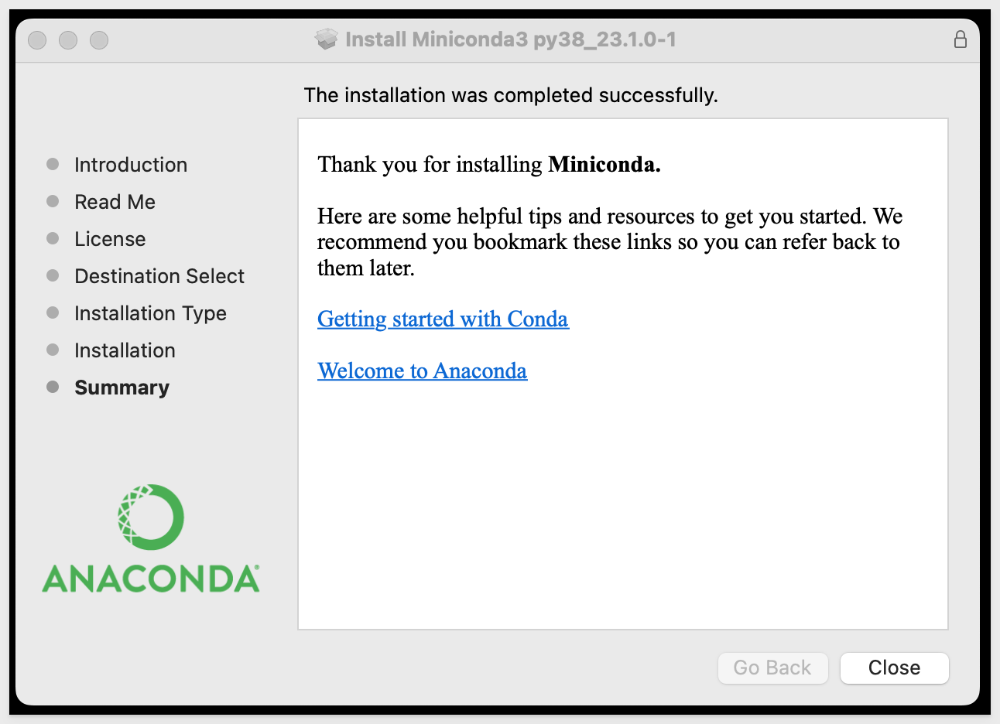

Now that Miniconda and Python (v3.8 or higher) are installed, we can move to the next step.


<!-- END OF NEXT SECTION-->

## Setup VSCode
Duration: 20

[Install VSCode from Microsoft's download site](https://code.visualstudio.com/download)

Run the installer and accept all default settings.

Once VSCode is installed, we’ll configure it for this use case.

Open VSCode and click the sidebar icon for `Extensions`. 

Search for Python, then select and install the extension shown below.

<aside class="negative">
<strong>NOTE:</strong><br> In the image, the extension was previously installed so no action was required.
</aside>

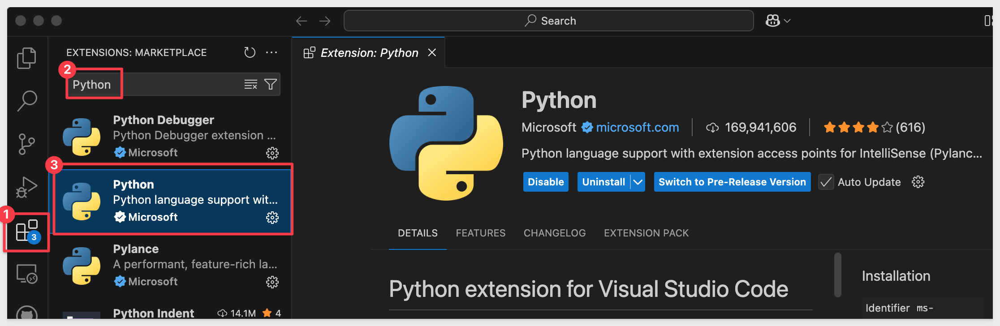

<aside class="negative">
<strong>NOTE:</strong><br> VSCode may notify you (in the lower left corner of the application) that it requires a restart. Click Restart to proceed. This is required when the extension needs to perform additional registration with VSCode.
</aside>


<aside class="negative">
<strong>NOTE:</strong><br>Microsoft also offers a Python extension called Pylance, which is optional but recommended to complete this QuickStart. Pylance improves productivity, reduces errors, and enhances the overall experience of writing Python in VSCode.
</aside>

[Pylance Extension page](https://marketplace.visualstudio.com/items?itemName=ms-python.vscode-pylance)

We now have a development environment ready, but we need to do a few more steps.


<!-- END OF NEXT SECTION-->

## Create a Python Environment
Duration: 20

Since we installed Miniconda, every available Conda package is not present in our system. While this saves installation time and conserves disk space, it’s important to remember, we will have to be aware that each VSCode project must have its required package dependencies installed at runtime. 

While we could install packages globally, we prefer to avoid that to maintain tight control over our development environment. 

To support this, we'll use dedicated Python environments to isolate project dependencies.

For our first project, we will create a Python environment called `streamlit`.

In our local computer, navigate to your Miniconda installation directory. The default is based on your computer username.

Right-click and open a terminal session:


First, let's see what environments already exist. Run the command:
```plaintext
conda env list
```

We should see the "base" environment that is included with Miniconda. 

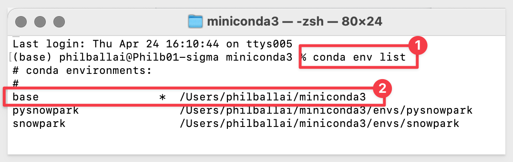

Now let’s create a new environment called `streamlit` for our project. Run the command:

```plaintext
conda create --name streamlit python=3.8
```

When prompted to proceed, type `y` and hit return:


We need to activate our new environment. Run the command:
```plaintext
conda activate streamlit
```

Listing the environments again, we should see `streamlit` being the current select noted by the "*":
```plaintext
conda env list
```

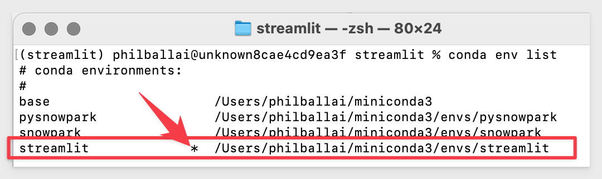

Our new `streamlit` environment is now ready.


<!-- END OF NEXT SECTION-->

## Install Streamlit

<aside class="negative">
<strong>NOTE:</strong><br> The following instructions demonstrate installation on macOS. If you're using a different operating system, your steps may differ slightly.
</aside>

To install Streamlit locally. execute the following command in Terminal:

```plaintext
pip install streamlit
```

A lot of information will be displayed and the command prompt will appear when done. There should be no error messages:

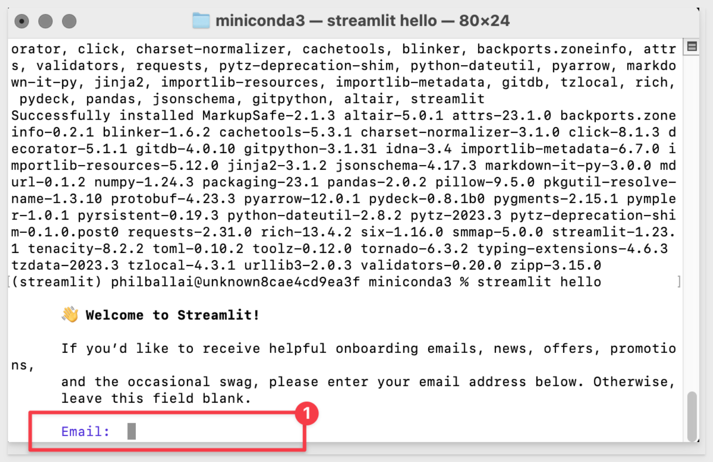

Now we can test our local Streamlit environment. Run the following command in your terminal:
```plaintext
streamlit hello
```

If prompted, click Allow to let Python accept incoming network connections:

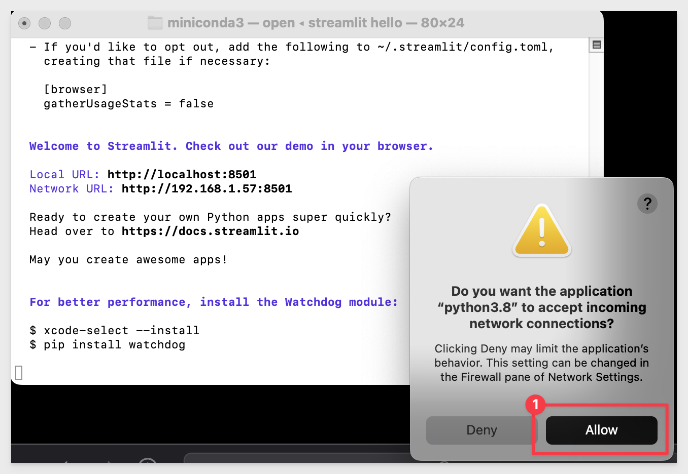

You may see a prompt asking for your email address (we will skip over that, so leave it blank and press `Enter`):


Streamlit will automatically open your default browser to its demo welcome page:

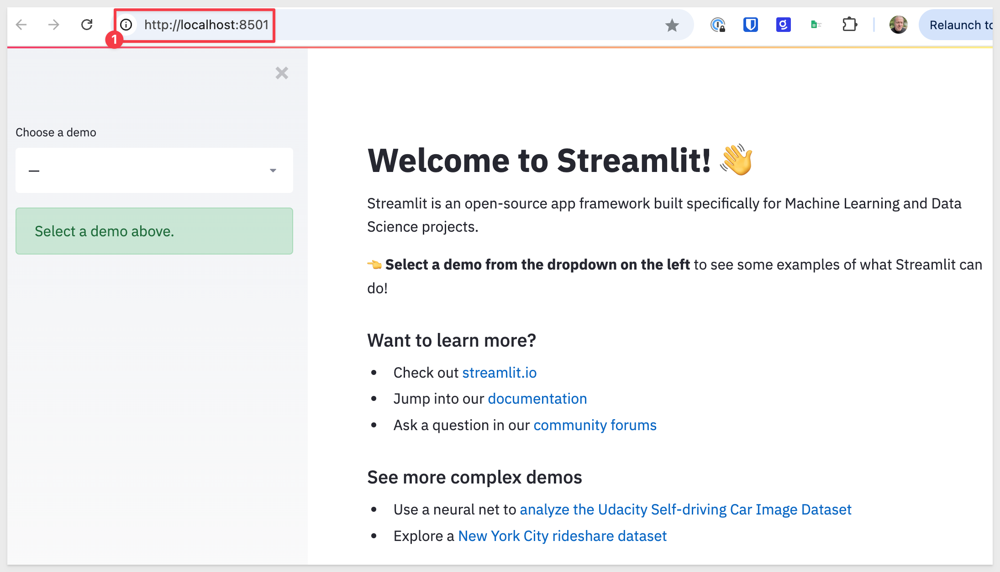

<aside class="negative">
<strong>NOTE:</strong><br> Streamlit uses port 8501 on your local computer. Although this port is not commonly used, you may need to temporarily stop any conflicting service if it is unavailable. If you're running multiple Streamlit apps, they will launch on subsequent ports such as 8502, 8503, and so on.
</aside>


<!-- END OF NEXT SECTION-->

## Source Code from Git
Duration: 5 

To make this easier, we’ve stored the project code in Git. While you could clone the entire repository (it’s not that large), we want to avoid cloning sections of the repository that aren’t relevant to this QuickStart.

Instead, we’ll use VSCode and Terminal to perform a Git `sparse-checkout` of the specific project folder we're interested in. This involves a few extra steps but results in a cleaner local project folder.

Open VSCode and start a new Terminal session.

Navigate to the directory where you want to clone the repo folder:

For example:
```code
cd {/path/to/your/directory}
```

Create a new directory for the project:
```code
mkdir embedding_streamlit
```

Change to the new directory:
```code
cd embedding_streamlit
```

Initialize a new Git repository:
```code
git init
```

Add the remote repository as the origin:
```code
git remote add -f origin https://github.com/sigmacomputing/quickstarts-public.git
```

Enable sparse checkout:
```code
git config core.sparseCheckout true
```

Specify the folder to include in the sparse checkout:
```code
echo "embedding_signed_URL/streamlit/" >> .git/info/sparse-checkout
```

At this point, we’ve run each command and haven’t seen any errors:

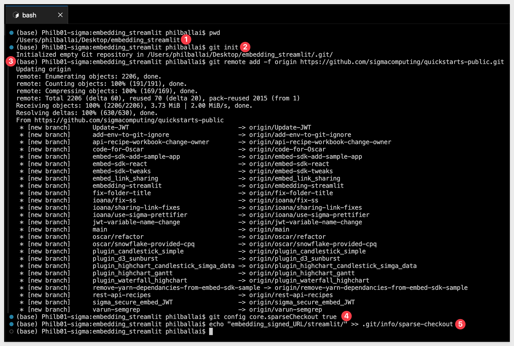

Pull only the specified folder from the repository:
```code
git pull origin main
```

You should now see a project folder called `streamlit`:

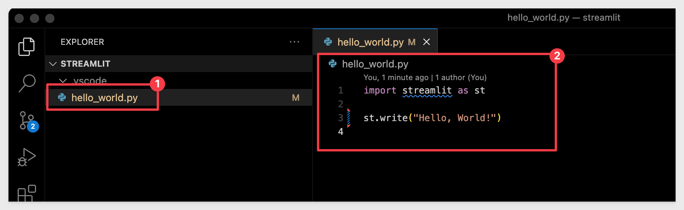

The project has almost everything we need, but we’ll still need to configure some embedded content and credentials from Sigma before testing it out.


<!-- END OF SECTION-->

## Sigma Embed Content
Duration: 20

We need to embed something into Streamlit from Sigma. To keep this simple, we’ll use the `Plugs Electronics Profit Planning Tool Template`.

Log into Sigma (as Administrator), navigate to `Template`s, and click the `Plugs Profit Planning Tool Template`:

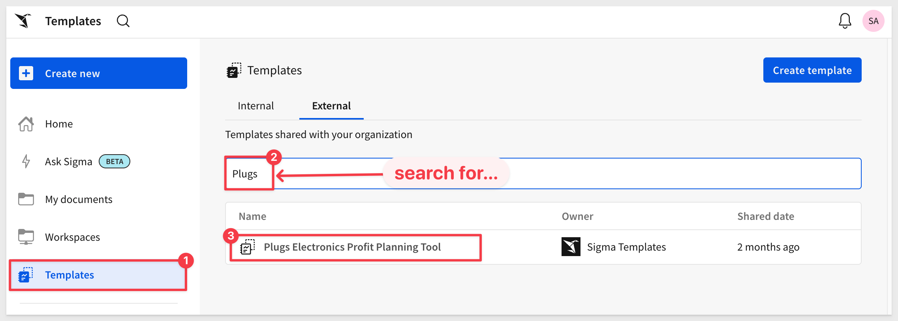

Next, we need the URL for the published version of the workbook:

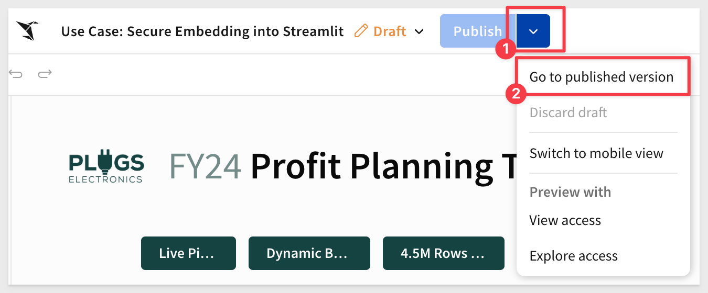

Once in the published view, copy the full URL from your browser and save it to a text file—you’ll need it later.

<aside class="positive">
<strong>IMPORTANT:</strong><br> Sigma embedding supports embedding a Workbook, Page, or individual Elements into external applications.
</aside>

### Share with Team
We need to share our workbook with a Sigma team.

If you completed the Getting Started QuickStart for embedding, you should already have a team named Sales_People.

If not, go ahead and create it by navigating to `Administration` > `Teams` and click `Create team`:

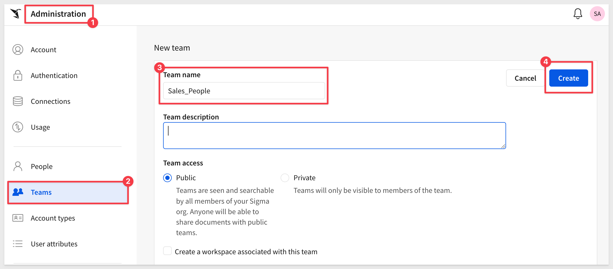

### Sigma Embed Credentials
Now we’ll generate credentials to secure the embed in Streamlit.

Navigate to `Administration` > `Developer Access`:

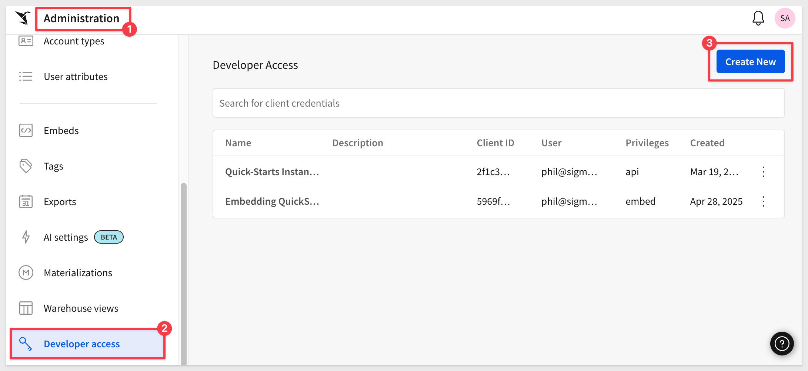

Click `Create New `in the top-right corner. This opens the `Create client credentials` modal.

Under `Select privileges` choose `Embedding`.

Provide a `Name` and `Description` of your choice.

Under `Owner`, select an organization member with the account type you want to associate with the embed secret. For now, select yourself or another Administrator.

<aside class="negative">
<strong>BEST PRACTICE:</strong><br> Use service accounts for key operations like client credentials.
</aside>

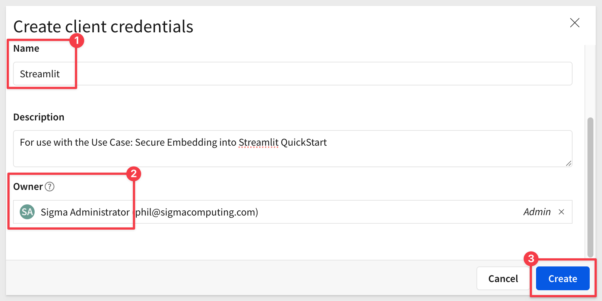

Click `Create.`

Copy the provided `ClientID` and `Secret` and store them for later use:

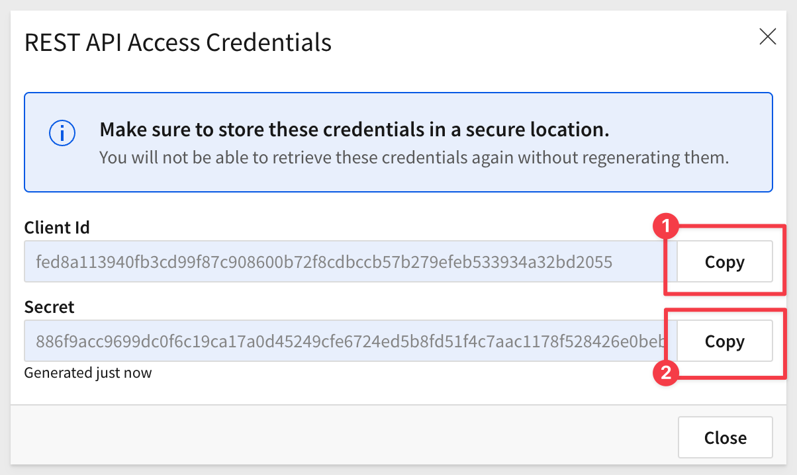

Click `Close.`

We can use these credentials for all embeds, but you may create as many credentials as you prefer.


<!-- END OF SECTION-->

## Testing the Secure Embed in Streamlit
Duration: 5

Open the `embedding_streamlit` folder in VSCode and locate the `.env` file.

Replace the placeholder values with your own `CLIENT_ID`, `SECRET` and `BASE_URL`:

```code
SESSION_LENGTH=3600
PORT=3000

CLIENT_ID=
SECRET=

BASE_URL=
EMAIL=sales_person@example.com
ACCOUNT_TYPE=Build
TEAMS=Sales_People
```

After updating `.env` with your values, `save` it.

Use a VSCode terminal session (or your terminal of choice) to navigate to your project folder and activate the Conda environment:

```code
conda activate streamlit
```

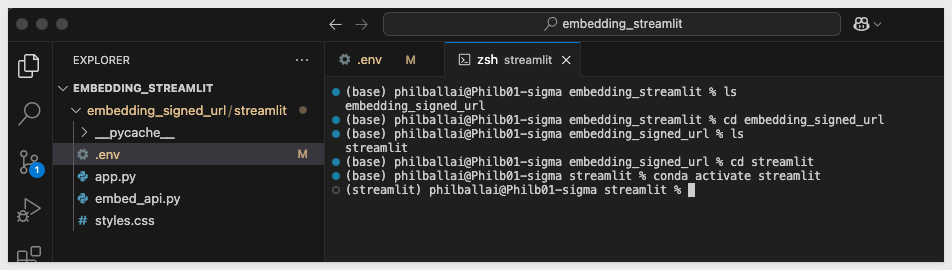

### Variables management
Our project stores configuration and sensitive values in a `.env` file, which helps keep secrets like API keys out of the main codebase—improving both security and flexibility.

To load values from the `.env` file, we use the `python-dotenv` package.

If you haven’t already installed it, run this command in your terminal:

```code
pip install python-dotenv
```

### Start the Streamlit App
Once the environment is activated and dependencies are installed, launch the app:

Start the Streamlit app:
```code
streamlit run app.py
```

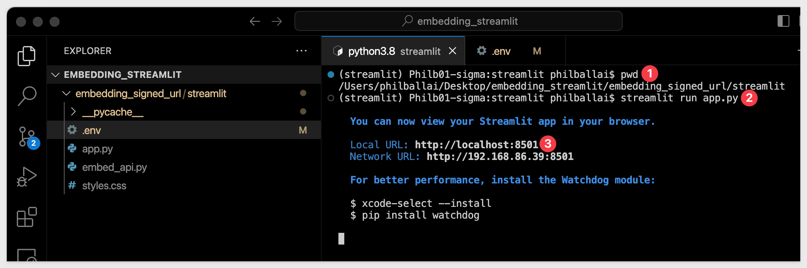

Your browser should automatically open and display the Streamlit app with the embedded Sigma content:

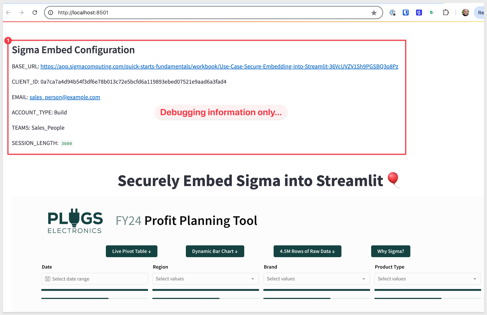

Congratulations, you’ve successfully set up a Streamlit app with a secure Sigma embed.


<!-- END OF SECTION-->

## What we've covered
Duration: 5

In this QuickStart, we learned what Streamlit is and how to securely embed Sigma into a Streamlit application that we built together.

**Additional Resource Links**

[Blog](https://www.sigmacomputing.com/blog/)<br>
[Community](https://community.sigmacomputing.com/)<br>
[Help Center](https://help.sigmacomputing.com/hc/en-us)<br>
[QuickStarts](https://quickstarts.sigmacomputing.com/)<br>

Be sure to check out all the latest developments at [Sigma's First Friday Feature page!](https://quickstarts.sigmacomputing.com/firstfridayfeatures/)
<br>

[](https://twitter.com/sigmacomputing)&emsp;
[](https://www.linkedin.com/company/sigmacomputing)&emsp;
[](https://www.facebook.com/sigmacomputing)


<!-- END OF WHAT WE COVERED -->
<!-- END OF QUICKSTART -->
