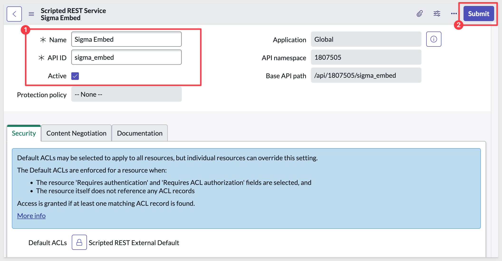
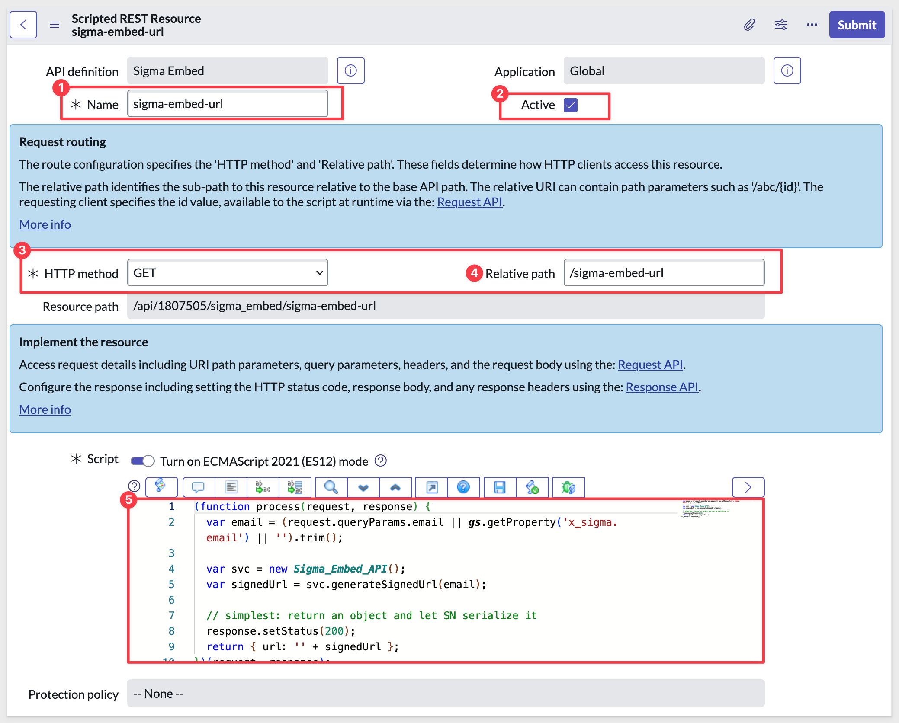

author: pballai
id: embedding_use_case_servicenow
summary: embedding_use_case_servicenow
categories: Embedding
environments: web
status: published
feedback link: https://github.com/sigmacomputing/sigmaquickstarts/issues
tags: default
lastUpdated: 2025-06-07

# Use Case: Embed into ServiceNow

## Overview 
Duration: 5 

This QuickStart introduces you to embedding Sigma into ServiceNow.

We will use a ServiceNow developer account and a Sigma trial to demonstrate how to minimally embed Sigma into a ServiceNow page using an iframe and a JSON Web Token (JWT) to secure the connection and provide the necessary JWT claims.

<aside class="positive">
<strong>IMPORTANT:</strong><br> Some screens in Sigma may appear slightly different from those shown in QuickStarts. This is because Sigma continuously adds and enhances functionality. Rest assured, Sigma’s intuitive interface ensures that any differences will not prevent you from successfully completing any QuickStart.
</aside>

For more information on Sigma's product release strategy, see [Sigma product releases](https://help.sigmacomputing.com/docs/sigma-product-releases).

If something doesn’t work as expected, here's how to [contact Sigma support](https://help.sigmacomputing.com/docs/sigma-support).

### Target Audience
The typical audience for this QuickStart includes users of Excel, common Business Intelligence or reporting tools, and semi-technical users who want to try out or learn Sigma.

### Prerequisites

<ul>
  <li>Any modern browser is acceptable.</li>
  <li>Access to your Sigma environment.</li>
  <li>Some familiarity with Sigma is assumed; not all basic steps will be shown.</li>
  <li>A ServiceNow developer account.</li>
</ul>

<aside class="positive">
<strong>IMPORTANT:</strong><br> Sigma recommends using non-production resources when completing QuickStarts.
</aside>

<button>[Sigma Free Trial](https://www.sigmacomputing.com/free-trial/)</button>

<button>[ServiceNow Developer Account](https://developer.servicenow.com/dev.do#!/learn/learning-plans/washingtondc/new_to_servicenow/app_store_learnv2_buildmyfirstapp_washingtondc_personal_developer_instances)</button>

<aside class="negative">
<strong>IMPORTANT:</strong><br> Some features may carry a "Beta" tag. Beta features are subject to quick, iterative changes. As a result, the latest product version may differ from the contents of this document.
</aside>
 


## Required Sigma Configuration
Duration: 5

We need to create a few things in Sigma to embed into our host application. We will keep this part simple, as it is not the primary focus of this QuickStart.

### Client Credentials
Client credentials (a unique Client ID and Embed Secret) are the foundation of secure embedding.

Sigma uses the Client ID to determine which Embed Secret is referenced in a request. Each time a request is made, the server-side embed API uses the Embed Secret to generate an encrypted signature.

Together, the Client ID and Embed Secret create a robust security framework for server-side interactions with Sigma.

Navigate to `Administration` and scroll down to `Developer Access`.

Click `Create New`:


In the `Create client credentials` modal, select both the `REST API` and `Embedding` checkboxes, provide a name, and assign an administrative user as the owner:


<aside class="negative">
<strong>BEST PRACTICE:</strong><br> In production environments, use separate client credentials for REST API and embedding. Here we use one set to keep testing simple.
</aside>

Click `Create`.

<aside class="positive">
<strong>IMPORTANT:</strong><br> For security purposes, Sigma provides a one-time view of the Embed Secret at the time of creation and does not display it again. Because the secret is non-retrievable, it’s important to store it securely when you create it.

If you lose the Embed Secret, or it becomes compromised, you can revoke it and generate a new one; however, this invalidates the previous secret and all embeds that use it. When a new secret is generated, you must update your embed API and all existing embeds.
</aside>


Copy and paste the `Client ID` and `Secret` into a text file for later use. 

### Teams
Next, we’ll create a team and share the workbook with that team. The host application will then pass Sigma the team information when accessing content, along with other user details. 

Create a team named `Embed_Users` (creating a workspace is not required):


### Create Content to Embed
Return to the homepage and click the `+ Create new` button, then select `Workbook`:


Drag a new `Table` from the `Data` group on the `Element bar`:


Click `Select source`.

Sigma allows users to search for tables by name; type `hands` in the search bar and select the `PLUGS_ELECTRONICS_HANDS_ON_LAB_DATA` table from the `RETAIL` schema:


This opens the selected table in a new, unsaved workbook named `Exploration`:


Rename the table by double-clicking its name and changing it to `Plugs_Sales_Transactions`.

Click the `Save as` button and save the workbook as `Embed_Service_QuickStart`.

### Share the Workbook
Share **both workbooks** as shown below, setting the permission level to `View`:


This will allow the `View` user to look at the workbook and perform basic actions like sorting and filtering.

<aside class="positive">
<strong>IMPORTANT:</strong><br> This grants any member of the team access. You can also adjust the permission level dynamically using the `Account Type` JWT claim at runtime for specific users.
</aside>

For more information on Sigma default account types, see [Default account types](https://help.sigmacomputing.com/docs/create-and-manage-account-types#default-account-types).

### Workbook baseURL
Open the workbook's menu and select `Go to published version`:


Copy the entire URL from the browser and paste into a text file for later use:


<!-- END -->

## ServiceNow (SN) - Initial Configuration
Duration: 5

Navigating in ServiceNow can be challenging for those unfamiliar with its many features. For this reason, we will provide direct links for each configuration step. All links follow the same pattern:

**<your_instance>:** Replace this with the portion of the URL that identifies your ServiceNow developer instance. 

For example, if the page URL is:
```code
https://dev274798.service-now.com/sys_properties_list.do
```

use https://dev274798.service-now.com in place of <your_instance>.

If you prefer to use the ServiceNow navigation menu instead of direct links, that is also fine.

### Create System Properties
We will use ServiceNow `System Properties` to configure required parameters (JWT claims) used when securely embedding Sigma.

For more information, see [JSON web token claims reference](https://help.sigmacomputing.com/docs/json-web-token-claims-reference)

Log in to your ServiceNow developer instance. Once the instance is running (this can take a few minutes), navigate to:
```code
<your_instance>.service-now.com/sys_properties_list.do
```

This process is repetitive, so we’ll show the steps for the first property and then list the others.

Click `New`


Name the new system property `x_sigma.client_id`, set the `Type` to `String`, and paste the Sigma `Client ID` created earlier into the `Value` box.

Click `Submit`:


Repeat the same process for the remaining required system properties:

`x_sigma.debug` – 'true' or 'false'.

`x_sigma.secret` – Sigma embed secret created early.

`x_sigma.base_url` – Sigma embed base URL from earlier steps

`x_sigma.session_length` – session lifetime in seconds. Use `3600`.

`x_sigma.account_type` - "View".

`x_sigma.teams` - as created earlier, "Embed_Users".

`x_sigma.email` - use "view.embed.qs@example.com" or another email address you prefer, as long as it is not an existing Sigma portal user.

Once created, we can see then all at once by setting a filter:


<!-- END OF SECTION-->

## ServiceNow - Create Script Include
Duration: 5

We need to create a **Script Include** that will handle the server-side generation of the Sigma embed JWT. This script will securely read the system properties we created earlier, construct the JWT claims, and sign them with the Sigma Embed Secret. The output will be a valid JWT that can be passed to the Sigma embed URL in our widget.

<aside class="negative">
<strong>NOTE:</strong><br> We recommend opening a separate browser tab for each ServiceNow page you configure. This makes it easy to return to a previous configuration page if adjustments are needed.
</aside>

Navigate to:
```code
<your_instance>.service-now.com/sys_script_include_list.do
```

Click `New`

- Set the name to `Sigma_Embed_API`.
- Make it Accessible from: `All application scopes`.
- Set `Active` to checked.

Paste the following script into the script section (#4):
```code
/**
 * Script Include: Sigma_Embed_API
 * Purpose: Generate a Sigma embed URL signed with HS256 (no platform crypto).
 * Inputs via sys_properties:
 *   x_sigma.client_id           (Sigma Embed Client ID)    [required]
 *   x_sigma.secret              (Sigma Embed Secret)       [required]
 *   x_sigma.base_url            (Workbook/Dashboard URL)   [required]
 *   x_sigma.session_length      (seconds, default 3600; hard-capped at 30d)
 *   x_sigma.email               (default subject email if not passed)
 *   x_sigma.account_type        (e.g., View)
 *   x_sigma.teams               (comma-separated team names)
 *   x_sigma.ua_*                (user_attributes map; keys are after ua_)
 *   x_sigma.eval_connection_id  (optional)
 *   x_sigma.secret_is_base64    (true if secret is base64-encoded)
 *   x_sigma.debug               (true to enable gs.info logs)
 */
var Sigma_Embed_API = Class.create();
Sigma_Embed_API.prototype = {
  initialize: function () {
    // Load core config from sys_properties
    this.debug       = (gs.getProperty('x_sigma.debug', 'false') === 'true');
    this.client_id   = gs.getProperty('x_sigma.client_id', '');
    this.secret      = gs.getProperty('x_sigma.secret', '');
    this.base_url    = gs.getProperty('x_sigma.base_url', '');
    this.session_len = parseInt(gs.getProperty('x_sigma.session_length', '3600'), 10) || 3600;

    // Hard fail early if required inputs are missing
    if (!this.client_id || !this.secret || !this.base_url) {
      throw 'Missing required properties: x_sigma.client_id, x_sigma.secret, x_sigma.base_url';
    }
  },

  /**
   * Build a signed Sigma embed URL.
   * @param {string} email Optional subject email; falls back to x_sigma.email
   * @returns {string} Full URL with :embed=true&:jwt=<token>
   */
  generateSignedUrl: function (email) {
    var now = Math.floor(Date.now() / 1000);
    var exp = now + Math.min(this.session_len, 2592000); // enforce 30d max

    // Subject (user identity)
    var subject_email = (email && ('' + email).trim()) ||
                        gs.getProperty('x_sigma.email', this.client_id);

    // Access claims
    var account_type = (gs.getProperty('x_sigma.account_type', 'View') || 'View').trim();

    // Teams (CSV → array)
    var teams = [];
    var teams_raw = (gs.getProperty('x_sigma.teams', '') || '').trim();
    if (teams_raw) {
      var parts = teams_raw.split(',');
      for (var i = 0; i < parts.length; i++) {
        var t = ('' + parts[i]).trim();
        if (t) teams.push(t);
      }
    }

    // user_attributes: gather all x_sigma.ua_* properties
    var user_attributes = {};
    var gr = new GlideRecord('sys_properties');
    gr.addQuery('name', 'STARTSWITH', 'x_sigma.ua_');
    gr.query();
    while (gr.next()) {
      var key = ('' + gr.getValue('name')).replace(/^x_sigma\.ua_/, '');
      var val = '' + gr.getValue('value');
      if (key) user_attributes[key] = val;
    }

    // Optional eval_connection_id
    var eval_connection_id = (gs.getProperty('x_sigma.eval_connection_id', '') || '').trim();

    // --- JWT header & payload (HS256) ---
    var header = { alg: 'HS256', typ: 'JWT', kid: this.client_id };
    var payload = {
      sub:  subject_email,
      iss:  this.client_id,
      jti:  gs.generateGUID(),
      iat:  now,
      exp:  exp,
      account_type:    account_type,
      user_attributes: user_attributes
    };
    if (teams.length > 0)            payload.teams = teams;
    if (eval_connection_id)          payload.eval_connection_id = eval_connection_id;

    // Sign the token (pure-JS HMAC-SHA256 → compact JWS)
    var token = this._sign_jwt(header, payload, this.secret);

    // Base URL + required embed params
    var joiner = (this.base_url.indexOf('?') >= 0) ? '&' : '?';
    var url = this.base_url + joiner + ':embed=true&:jwt=' + encodeURIComponent(token);

    // Optional UI params passthrough (if set as x_sigma.*)
    var opt_keys = [
      'disable_mobile_view', 'hide_menu', 'hide_folder_navigation', 'hide_tooltip',
      'lng', 'menu_position', 'responsive_height', 'theme'
    ];
    var extras = [];
    for (var k = 0; k < opt_keys.length; k++) {
      var prop = 'x_sigma.' + opt_keys[k];
      var val  = gs.getProperty(prop, null);
      if (val !== null && val !== '' && typeof val !== 'undefined') {
        extras.push(':' + opt_keys[k] + '=' + encodeURIComponent('' + val));
      }
    }
    if (extras.length) url += '&' + extras.join('&');

    if (this.debug) gs.info('[Sigma_Embed_API] final_url=' + url);
    return url;
  },

  // ------------------------------------------------------------
  // JWT signer (compact JWS) using pure-JS HMAC-SHA256
  // ------------------------------------------------------------
  _sign_jwt: function (header_obj, payload_obj, secret) {
    var header_b64  = this._b64url_string(this._json(header_obj));
    var payload_b64 = this._b64url_string(this._json(payload_obj));
    var signing_in  = header_b64 + '.' + payload_b64;

    // Support base64-encoded secrets if x_sigma.secret_is_base64=true
    var isB64    = (gs.getProperty('x_sigma.secret_is_base64', 'false') === 'true');
    var keyBytes = isB64 ? this._from_b64(('' + secret).replace(/[\r\n]/g, '').trim())
                         : this._utf8(('' + secret));

    var msgBytes = this._utf8(signing_in);
    var sigBytes = this._hmac_sha256(msgBytes, keyBytes); // bytes
    var sigB64   = this._b64_from_bytes(sigBytes);        // Base64
    var sigUrl   = this._to_b64url(sigB64);               // base64url

    return signing_in + '.' + sigUrl;
  },

  // ------------------------------------------------------------
  // Helpers: JSON, UTF-8, Base64, SHA-256, HMAC-SHA256
  // ------------------------------------------------------------
  _json: function (obj) { return new global.JSON().encode(obj); },

  _utf8: function (str) {
    var out = [], i = 0, c, c2;
    for (; i < str.length; i++) {
      c = str.charCodeAt(i);
      if (c < 0x80) out.push(c);
      else if (c < 0x800) out.push(0xc0 | (c >> 6), 0x80 | (c & 0x3f));
      else if (c >= 0xd800 && c < 0xe000) {
        i++; c2 = str.charCodeAt(i);
        var u = 0x10000 + (((c & 0x3ff) << 10) | (c2 & 0x3ff));
        out.push(0xf0 | (u >> 18), 0x80 | ((u >> 12) & 0x3f), 0x80 | ((u >> 6) & 0x3f), 0x80 | (u & 0x3f));
      } else {
        out.push(0xe0 | (c >> 12), 0x80 | ((c >> 6) & 0x3f), 0x80 | (c & 0x3f));
      }
    }
    return out;
  },

  _b64_from_bytes: function (bytes) {
    var chars = 'ABCDEFGHIJKLMNOPQRSTUVWXYZabcdefghijklmnopqrstuvwxyz0123456789+/', out = '', i = 0;
    for (; i < bytes.length; i += 3) {
      var b0 = bytes[i] & 0xff,
          b1 = (i + 1 < bytes.length) ? (bytes[i + 1] & 0xff) : 0,
          b2 = (i + 2 < bytes.length) ? (bytes[i + 2] & 0xff) : 0;
      var tri = (b0 << 16) | (b1 << 8) | b2;
      out += chars[(tri >>> 18) & 0x3f];
      out += chars[(tri >>> 12) & 0x3f];
      out += (i + 1 < bytes.length) ? chars[(tri >>> 6) & 0x3f] : '=';
      out += (i + 2 < bytes.length) ? chars[tri & 0x3f] : '=';
    }
    return out;
  },

  _to_b64url: function (b64) {
    return ('' + b64).replace(/\+/g, '-').replace(/\//g, '_').replace(/=+$/g, '');
  },

  _b64url_string: function (plain_str) {
    return this._to_b64url(this._b64_from_bytes(this._utf8(plain_str)));
  },

  // Base64 decoder (used only when x_sigma.secret_is_base64=true)
  _from_b64: function (b64) {
    var s = ('' + b64).replace(/[\r\n\s]/g, '');
    var table = {}, chars = 'ABCDEFGHIJKLMNOPQRSTUVWXYZabcdefghijklmnopqrstuvwxyz0123456789+/';
    for (var i = 0; i < chars.length; i++) table[chars.charAt(i)] = i;
    var out = [], j = 0, acc = 0, bits = 0, c, val;
    for (i = 0; i < s.length; i++) {
      c = s.charAt(i); if (c === '=') break;
      val = table[c];  if (val === undefined) continue;
      acc = (acc << 6) | val; bits += 6;
      if (bits >= 8) { bits -= 8; out[j++] = (acc >> bits) & 0xff; }
    }
    return out;
  },

  // SHA-256 (bytes → 32-byte array)
  _sha256: function (bytes) {
    function rotr(n, x){ return (x >>> n) | (x << (32 - n)); }
    function Ch(x,y,z){ return (x & y) ^ (~x & z); }
    function Maj(x,y,z){ return (x & y) ^ (x & z) ^ (y & z); }
    function Σ0(x){ return rotr(2,x) ^ rotr(13,x) ^ rotr(22,x); }
    function Σ1(x){ return rotr(6,x) ^ rotr(11,x) ^ rotr(25,x); }
    function σ0(x){ return rotr(7,x) ^ rotr(18,x) ^ (x >>> 3); }
    function σ1(x){ return rotr(17,x) ^ rotr(19,x) ^ (x >>> 10); }

    var K = [
      0x428a2f98,0x71374491,0xb5c0fbcf,0xe9b5dba5,0x3956c25b,0x59f111f1,0x923f82a4,0xab1c5ed5,
      0xd807aa98,0x12835b01,0x243185be,0x550c7dc3,0x72be5d74,0x80deb1fe,0x9bdc06a7,0xc19bf174,
      0xe49b69c1,0xefbe4786,0x0fc19dc6,0x240ca1cc,0x2de92c6f,0x4a7484aa,0x5cb0a9dc,0x76f988da,
      0x983e5152,0xa831c66d,0xb00327c8,0xbf597fc7,0xc6e00bf3,0xd5a79147,0x06ca6351,0x14292967,
      0x27b70a85,0x2e1b2138,0x4d2c6dfc,0x53380d13,0x650a7354,0x766a0abb,0x81c2c92e,0x92722c85,
      0xa2bfe8a1,0xa81a664b,0xc24b8b70,0xc76c51a3,0xd192e819,0xd6990624,0xf40e3585,0x106aa070,
      0x19a4c116,0x1e376c08,0x2748774c,0x34b0bcb5,0x391c0cb3,0x4ed8aa4a,0x5b9cca4f,0x682e6ff3,
      0x748f82ee,0x78a5636f,0x84c87814,0x8cc70208,0x90befffa,0xa4506ceb,0xbef9a3f7,0xc67178f2
    ];

    var l = bytes.length, bitHi = Math.floor(l / 0x20000000), bitLo = (l << 3) >>> 0;
    var withOne = bytes.slice(0); withOne.push(0x80);
    while ((withOne.length % 64) !== 56) withOne.push(0);

    var words = [];
    for (var i = 0; i < withOne.length; i += 4) {
      words.push(((withOne[i] << 24) | (withOne[i+1] << 16) | (withOne[i+2] << 8) | (withOne[i+3] | 0)) >>> 0);
    }
    words.push(bitHi >>> 0); words.push(bitLo >>> 0);

    var H0=0x6a09e667,H1=0xbb67ae85,H2=0x3c6ef372,H3=0xa54ff53a,
        H4=0x510e527f,H5=0x9b05688c,H6=0x1f83d9ab,H7=0x5be0cd19;

    var W = new Array(64);
    for (var j = 0; j < words.length; j += 16) {
      for (var t = 0; t < 16; t++) W[t] = words[j+t] >>> 0;
      for (t = 16; t < 64; t++) W[t] = (σ1(W[t-2]) + W[t-7] + σ0(W[t-15]) + W[t-16]) >>> 0;

      var a=H0,b=H1,c=H2,d=H3,e=H4,f=H5,g=H6,h=H7;
      for (t = 0; t < 64; t++) {
        var T1 = (h + Σ1(e) + Ch(e,f,g) + K[t] + W[t]) >>> 0;
        var T2 = (Σ0(a) + Maj(a,b,c)) >>> 0;
        h=g; g=f; f=e; e=(d + T1) >>> 0;
        d=c; c=b; b=a; a=(T1 + T2) >>> 0;
      }
      H0=(H0+a)>>>0; H1=(H1+b)>>>0; H2=(H2+c)>>>0; H3=(H3+d)>>>0;
      H4=(H4+e)>>>0; H5=(H5+f)>>>0; H6=(H6+g)>>>0; H7=(H7+h)>>>0;
    }

    var out = [];
    function push(w){ out.push((w>>>24)&255,(w>>>16)&255,(w>>>8)&255,w&255); }
    push(H0); push(H1); push(H2); push(H3); push(H4); push(H5); push(H6); push(H7);
    return out;
  },

  // HMAC-SHA256 (bytes → 32-byte array)
  _hmac_sha256: function (msgBytes, keyBytes) {
    var block = 64; // 512-bit block size
    if (keyBytes.length > block) keyBytes = this._sha256(keyBytes);
    if (keyBytes.length < block) {
      var pad = new Array(block - keyBytes.length);
      for (var i = 0; i < pad.length; i++) pad[i] = 0;
      keyBytes = keyBytes.concat(pad);
    }
    var oKey = [], iKey = [];
    for (var j = 0; j < block; j++) { oKey[j] = keyBytes[j] ^ 0x5c; iKey[j] = keyBytes[j] ^ 0x36; }
    return this._sha256(oKey.concat(this._sha256(iKey.concat(msgBytes))));
  },

  // Class marker
  type: 'Sigma_Embed_API'
};
```


Click `Submit`

<aside class="positive"> <strong>IMPORTANT:</strong><br> ServiceNow provides the <code>GlideCertificateEncryption</code> API for cryptographic operations such as generating HMACs or digital signatures. It may be possible to use this instead of native JavaScript crypto libraries for tighter integration and security. </aside>


<!-- END OF SECTION-->

## ServiceNow - Create REST Resource
Duration: 5

We need to create a **REST API Resource** that will act as the endpoint for generating and returning the Sigma embed JWT. This REST Resource will call the `Sigma_Embed_API` Script Include we created earlier, receive the signed JWT, and return it to the widget or page requesting the embed.

<aside class="positive">
<strong>IMPORTANT:</strong><br> This REST Resource is the key to avoiding browser CORS issues when embedding Sigma into ServiceNow.  

The browser never directly requests a JWT from Sigma — instead, the widget calls this ServiceNow endpoint, which securely generates the signed Sigma embed URL server-side using the `Sigma_Embed_API` Script Include.  

Because the JWT is generated and applied in ServiceNow’s server context, the final URL is returned to the client without exposing the secret in any browser-visible code.
</aside>


Navigate to:
```code
<your_instance>.service-now.com/sys_ws_definition_list.do
```

Click `New`

- Set the name to `Sigma Embed`.
- The API ID should be `sigma_embed`.
- Set `Active` to checked.

Click `Submit`:



The UI will return to the `Scripted REST APIs` page. Search for `Sigma` and click into the `Sigma Embed` just created.

Click the `New` button in the lower right corner to create a new resource inside the service:


- Set the name to `sigma-embed-url`.
- Set `Active` to checked.
- The HTTP method should be `GET`.
- Relative path should be `/sigma-embed-url`.

Paste the following script in the `* Script` box:
```code
(function process(request, response) {
  var email = (request.queryParams.email || gs.getProperty('x_sigma.email') || '').trim();

  var svc = new Sigma_Embed_API();
  var signedUrl = svc.generateSignedUrl(email);

  // simplest: return an object and let SN serialize it
  response.setStatus(200);
  return { url: '' + signedUrl };
})(request, response);
```

Click `Submit`:




<!-- END OF SECTION-->

## ServiceNow - Create Widget
Duration: 5

We need to create a **Service Portal Widget** that will request the Sigma embed JWT from our REST Resource and then dynamically render the Sigma content inside an `iframe`. 

This widget will be placed on a page in the Service Portal.

Navigate to:
```code
<your_instance>.service-now.com/sp_widget_list.do
```

Click `New`

Set the Name to `Sigma iFrame`.

In each of the following sections we apply code to operations and styling to the Iframe.

In `Body HTML template` copy/paste the following code:
```code
<div>
  <iframe ng-src="{{c.sigmaUrl}}" style="width:100%; height:90vh; border:0;" allowfullscreen></iframe>
</div>
```

<aside class="positive">
<strong>IMPORTANT:</strong><br> Sigma’s embed URLs point to a different domain than your ServiceNow instance, which means browsers will enforce cross-site content restrictions.  
To allow the embedded Sigma content to render in the `iframe`, we addressed this in two ways:

1. **Server-side REST Resource proxying** – Our ServiceNow REST Resource makes the secure request to Sigma using the JWT, then returns a *fully signed embed URL* to the widget. The browser never directly fetches the JWT from Sigma, avoiding CORS issues.  

2. **Iframe URL sanitization in Angular** – In the client controller, we use `$sce.trustAsResourceUrl(rawUrl)` to explicitly tell AngularJS the Sigma embed URL is safe to load, bypassing Angular’s default `$sce` content security restrictions.  

These steps ensure the iframe loads correctly without being blocked by either browser CORS policy or Angular’s security context.
</aside>


In the `CSS` section:
```code
#sigma_embed {
  width: 100%;
  height: 90vh;
  border: none;
}
```

In the `Client controller` section:
```code
api.controller = function($scope, $http, $sce) {
  var c = this;
  c.sigmaUrl = '';

  c.$onInit = function() {
    $http.get('/api/1807505/sigma_embed/sigma-embed-url').then(function(res) {
      var rawUrl = (res.data && res.data.result && res.data.result.url) ||
                   (res.data && res.data.url) || '';
      if (rawUrl) {
        // Tell Angular this URL is safe to use in an <iframe>
        c.sigmaUrl = $sce.trustAsResourceUrl(rawUrl);
      } else {
        console.error('[Sigma Iframe] Unexpected response payload:', res.data);
      }
    }, function(err) {
      console.error('[Sigma Iframe] Failed to fetch signed URL', err);
    });
  };
};
```

In `controllerAS` set the first box to `c` and the `Link` box to:
```code
function link(scope, element, attrs, controller) {
}
```

Click `Submit`:


<!-- END OF SECTION-->

## ServiceNow - Create Page in Page Designer
Duration: 5

We need to create a Service Portal Page that will host our Sigma iFrame widget. This page will be accessible through the Service Portal and is where the embedded Sigma content will actually appear.

Navigate to:
```code
<your_instance>.service-now.com/$sp.do
```

Click the link for `Add a new Page`:


Set the `Page title` to `Sigma QuickStart` and click `Submit`.

Next, place a `Container` on the page to hold the Iframe:


Drag the `12` column into the page container:


Using the `Filter Widget` search box, locate the `Sigma Iframe` and drag/drop it onto the page:


If everything is configured correctly, the `Plugs Sales Transactions` table should appear:

Click on the icon in the upper-right corner to jump to the webpage:


We have successfully embedded Sigma into ServiceNow:


<aside class="positive"> <strong>IMPORTANT:</strong><br> While this demonstration works, it does not imply production readiness. A careful review of ServiceNow best practices and security recommendations is outside the scope of this QuickStart and should be provided by ServiceNow. </aside>


<!-- END OF SECTION-->

## What we've covered
Duration: 5

In this QuickStart, we:

<ul> <li>Configured the necessary settings in Sigma, including client credentials, team setup, and content sharing.</li> <li>Set up system properties in ServiceNow to store Sigma embed parameters.</li> <li>Created the `Sigma_Embed_API` Script Include to generate a signed JWT for secure embedding.</li> <li>Built a REST Resource in ServiceNow to provide the signed Sigma embed URL to the front end.</li> <li>Developed a Service Portal Widget to display Sigma content inside an iFrame.</li> <li>Created a Service Portal Page using Page Designer to host the Sigma iFrame widget.</li> <li>Tested the embedded Sigma workbook inside ServiceNow to verify successful integration.</li> </ul>

You now have a working example of embedding Sigma into ServiceNow using a secure JWT-based approach. While this QuickStart demonstrates the core process, adapting it for production should include additional security hardening, adherence to ServiceNow development best practices, and proper user access controls.

**Additional Resource Links**

[Blog](https://www.sigmacomputing.com/blog/)<br>
[Community](https://community.sigmacomputing.com/)<br>
[Help Center](https://help.sigmacomputing.com/hc/en-us)<br>
[QuickStarts](https://quickstarts.sigmacomputing.com/)<br>

Be sure to check out all the latest developments at [Sigma's First Friday Feature page!](https://quickstarts.sigmacomputing.com/firstfridayfeatures/)
<br>

[](https://twitter.com/sigmacomputing)&emsp;
[](https://www.linkedin.com/company/sigmacomputing)&emsp;
[](https://www.facebook.com/sigmacomputing)


<!-- END OF WHAT WE COVERED -->
<!-- END OF QUICKSTART -->
