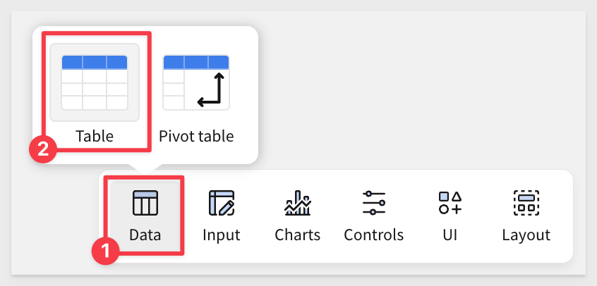
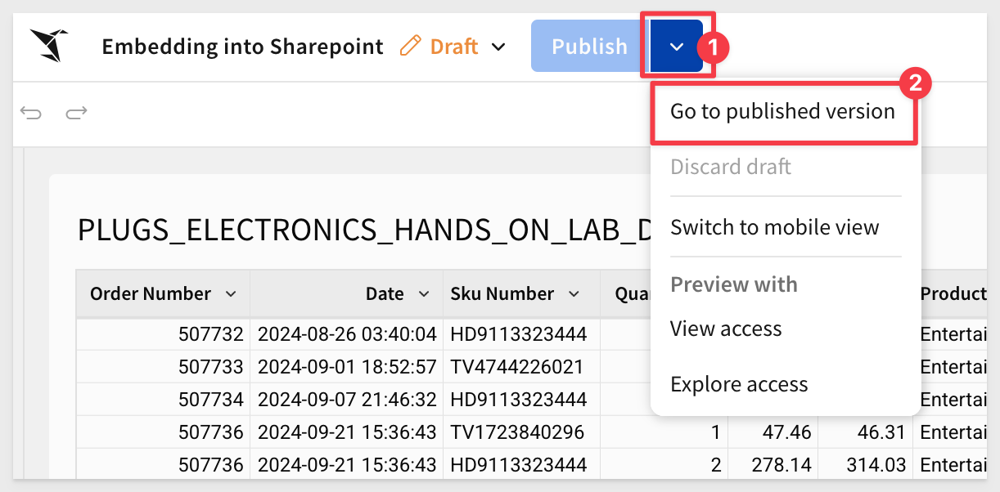
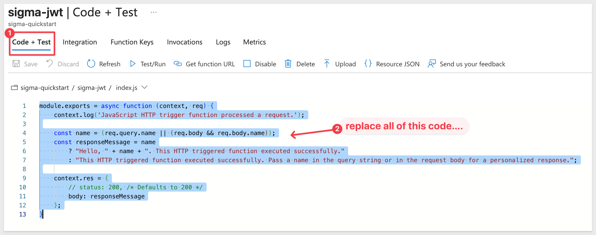
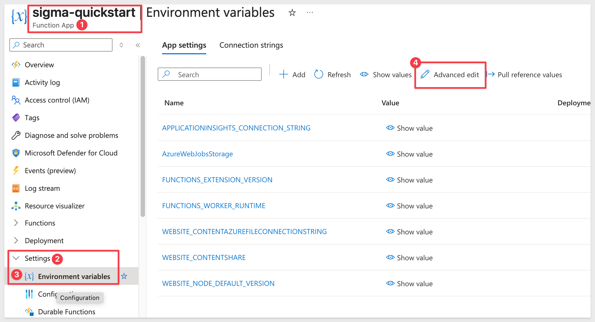

author: pballai
id: embedding_use_case_sharepoint
summary: embedding_use_case_sharepoint
categories: embedding
environments: web
status: published
feedback link: https://github.com/sigmacomputing/sigmaquickstarts/issues
tags: default
lastUpdated: 2025-09-26

# Use Case: Embed into Microsoft Sharepoint

## Overview 
Duration: 5 

In this QuickStart, you'll learn how to securely embed a Sigma workbook into Microsoft SharePoint Online using JWT authentication.

You'll deploy an Azure Function that mints short-lived JWTs and deploy a SharePoint Framework (SPFx) web part that automatically gets the current user's identity, calls the function, and displays the Sigma workbook.

This is the production-ready pattern most customers use. It leverages SharePoint's built-in authentication and ensures the correct user identity and permissions flow through to Sigma without requiring additional login steps.

<aside class="positive">
<strong>IMPORTANT:</strong><br> Some screens in Sigma may appear slightly different from those shown in QuickStarts. This is because Sigma continuously adds and enhances functionality. Rest assured, Sigma’s intuitive interface ensures that any differences will not prevent you from successfully completing any QuickStart.
</aside>

For more information on Sigma's product release strategy, see [Sigma product releases](https://help.sigmacomputing.com/docs/sigma-product-releases)

If something doesn’t work as expected, here's how to [contact Sigma support](https://help.sigmacomputing.com/docs/sigma-support)

### Target Audience
IT administrators, SharePoint developers, and business intelligence teams who need to securely embed analytics into their organization's SharePoint environment. This QuickStart is ideal for those implementing a production-ready embedding solution that leverages existing Microsoft 365 authentication.

### Prerequisites

<ul>
  <li>Access to your Sigma environment with administrative privileges.</li>
  <li>Microsoft 365 tenant with SharePoint Online (E3/E5 or trial).</li>
  <li>Azure subscription (free tier is sufficient for this QuickStart).</li>
  <li>Node.js 20 LTS installed on your development machine.</li>
  <li>Basic familiarity with SharePoint administration (App Catalog access).</li>
</ul>

<aside class="positive">
<strong>IMPORTANT:</strong><br> Sigma recommends using non-production resources when completing QuickStarts.
</aside>

<button>[Sigma Free Trial](https://www.sigmacomputing.com/free-trial/)</button>

<button>[Azure Free Trial](https://azure.microsoft.com/en-us/pricing/purchase-options/azure-account)</button>

<aside class="negative">
<strong>IMPORTANT:</strong><br> Some features may carry a "Beta" tag. Beta features are subject to quick, iterative changes. As a result, the latest product version may differ from the contents of this document.
</aside>
 

<!-- END OF SECTION-->

## Required Sigma Configuration
Duration: 5

We need to create a few things in Sigma to embed into Sharepoint. We will keep this part simple, as it is not the primary focus of this QuickStart.

### Client Credentials
Client credentials (a unique Client ID and Embed Secret) are the foundation of secure embedding.

Sigma uses the Client ID to determine which Embed Secret is referenced in a request. Each time a request is made, the server-side embed API uses the Embed Secret to generate an encrypted signature.

Together, the Client ID and Embed Secret create a robust security framework for server-side interactions with Sigma.

Navigate to `Administration` and scroll down to `Developer Access`.

Click `Create New`:


In the `Create client credentials` modal, select the `Embedding` checkbox, provide a name, and assign an administrative user as the owner:


<aside class="negative">
<strong>BEST PRACTICE:</strong><br> In production environments, use separate client credentials for REST API and embedding. 
</aside>

Click `Create`.

<aside class="positive">
<strong>IMPORTANT:</strong><br> For security purposes, Sigma provides a one-time view of the Embed Secret at the time of creation and does not display it again. Because the secret is non-retrievable, it’s important to store it securely when you create it.

If you lose the Embed Secret, or it becomes compromised, you can revoke it and generate a new one; however, this invalidates the previous secret and all embeds that use it. When a new secret is generated, you must update your embed API and all existing embeds.
</aside>


Copy and paste the `Client ID` and `Secret` into a text file for later use. 

### Teams
Next, we’ll create a team and share the workbook with that team. The host application will then pass Sigma the team information when accessing content, along with other user details. 

Create a team named `Embed_Users` (creating a workspace is not required):


### Create Content to Embed
Return to the homepage and click the `+ Create new` button, then select `Workbook`:


Drag a new `Table` from the `Data` group on the `Element bar`:



Click `Select source`.

Sigma allows users to search for tables by name; type `hands` in the search bar and select the `PLUGS_ELECTRONICS_HANDS_ON_LAB_DATA` table from the `RETAIL` schema:


This opens the selected table in a new, unsaved workbook named `Exploration`:


Click the `Save as` button and save the workbook as `Embedding into Sharepoint`.

### Share the Workbook
Share the workbook with the `Embed_Users` team, setting the permission level to `View`:


This will allow the `View` user to look at the workbook and perform basic actions like sorting and filtering.

<aside class="positive">
<strong>IMPORTANT:</strong><br> This grants any member of the team access. You can also adjust the permission level dynamically using the `Account Type` JWT claim at runtime for specific users.
</aside>

For more information on Sigma default account types, see [Default account types](https://help.sigmacomputing.com/docs/create-and-manage-account-types#default-account-types)

### Workbook baseURL
Open the workbook's menu and select `Go to published version`:



Copy the entire URL from the browser and paste into a text file for later use:


<!-- END OF SECTION-->

## Deploy to Azure  
Duration: 5

### Create Function App in Azure Portal

Log into [Azure](https://portal.azure.com) search for `Function App` and click into that:


Click `+ Create`.

Chose the `Consuption` plan and click `Select`.

<aside class="positive">
<strong>IMPORTANT:</strong><br> Use the regular <b>Consumption (Y1) plan</b> for this QuickStart. Flex Consumption has compatibility issues with environment variables.
</aside>

Configure the basic settings:
   - **Subscription**: Your Azure subscription
   - **Resource Group**: Create new or use existing
   - **Function App name**: Something unique (e.g., `sigma-embed-quickstart-yourname`)
   - **Operating System**: Windows
   - **Runtime stack**: Node.js
   - **Version**: 20 LTS
   - **Region**: Central US (or your preferred region)


Click `Review + create`.

On the `Review + create` tab click the `Create` button.

Azure will validate the configuration and if good, start a deployment. We need to wait for that to complete (usually 2-3 minutes):

Click `Go to resource`.


### Deploy the Function Code
In your Function App, click the `Create function` button as shown:


Choose `HTTP trigger` (first on the list) and click the `Next` button:


Name the HTTP trigger and select `Function` for the Authorization level. This provides security for the function itself via a function key will we capture later.


Click `Create`

Once created, Azure will leave us on the `Code + Test` page.



Replace the default code with this JWT implementation for Sigma:
```code
const crypto = require("crypto");

function b64url(input) {
  return Buffer.from(input).toString("base64")
    .replace(/=/g,"").replace(/\+/g,"-").replace(/\//g,"_");
}

function signHS256(payload, secret, kid) {
  const header = { alg: "HS256", typ: "JWT" };
  if (kid) header.kid = kid;
  const encHeader = b64url(JSON.stringify(header));
  const encPayload = b64url(JSON.stringify(payload));
  const data = `${encHeader}.${encPayload}`;
  const sig = crypto.createHmac("sha256", secret).update(data).digest("base64")
    .replace(/=/g,"").replace(/\+/g,"-").replace(/\//g,"_");
  return `${data}.${sig}`;
}

function appendEmbedParams(baseUrl, jwt) {
  const sep = baseUrl.includes("?") ? "&" : "?";
  const hasEmbed = /(?:[?&]):embed=/.test(baseUrl);
  return `${baseUrl}${sep}:jwt=${encodeURIComponent(jwt)}${hasEmbed ? "" : "&:embed=true"}`;
}

module.exports = function (context, req) {
  try {
    const { BASE_URL, CLIENT_ID, SECRET, ACCOUNT_TYPE = "", TEAM = "" } = process.env;
    
    if (!BASE_URL || !CLIENT_ID || !SECRET) {
      context.bindings.res = { 
        status: 500, 
        headers: { "Content-Type": "application/json" },
        body: JSON.stringify({ error: "Missing BASE_URL, CLIENT_ID, or SECRET in Environment variables." })
      };
      context.done();
      return;
    }
    
    const userEmail = (req.query && req.query.user ? String(req.query.user) : "").trim();
    if (!userEmail) {
      context.bindings.res = { 
        status: 400, 
        headers: { "Content-Type": "application/json" },
        body: JSON.stringify({ error: "Missing 'user' (email)." })
      };
      context.done();
      return;
    }

    const now = Math.floor(Date.now()/1000);
    const exp = now + 60*10;
    const payload = {
      iss: CLIENT_ID, 
      sub: userEmail, 
      aud: "sigma", 
      iat: now, 
      exp,
      jti: `${CLIENT_ID}-${now}-${Math.random().toString(36).substr(2, 9)}`,
      ...(ACCOUNT_TYPE ? { account_type: ACCOUNT_TYPE } : {}),
      ...(TEAM ? { teams: [TEAM] } : {})
    };

    const token = signHS256(payload, SECRET, CLIENT_ID);
    const embedUrl = appendEmbedParams(BASE_URL, token);

    context.bindings.res = { 
      status: 200, 
      headers: { "Content-Type": "application/json" },
      body: JSON.stringify({ ok: true, embedUrl, expires_in: exp - now })
    };
    context.done();
  } catch (e) {
    context.bindings.res = { 
      status: 500, 
      headers: { "Content-Type": "application/json" },
      body: JSON.stringify({ error: "JWT generation failed", detail: String(e) })
    };
    context.done();
  }
};
```

Click `Save`.

### Function URL
While we are here, let's copy the function URL for use later. Copy and save it to your text file:


<!-- END OF SECTION-->

## Configure Environment Variables
Duration: 3

Go to your Function App > `Settings` > `Environment variables` (this is much faster than adding variables individually).



Add your additional variables beneath the existing JSON, updating the values marked with `YOUR_*` with the value captured earlier.


Update these specific values:
   - `YOUR_SIGMA_WORKBOOK_URL`: Your complete Sigma workbook URL
   - `YOUR_SIGMA_CLIENT_ID`: Client ID from earlier Sigma setup  
   - `YOUR_SIGMA_SECRET`: Secret from earlier Sigma setup
   - `YOUR_TEAM_NAME`: `Embed_Users` is provided for you but if you shared to a different team, adjust accordingly.

```code
,  
{
    "name": "ACCOUNT_TYPE",
    "value": "View",
    "slotSetting": false
  },
  {
    "name": "BASE_URL", 
    "value": "YOUR_SIGMA_WORKBOOK_URL",
    "slotSetting": false
  },
  {
    "name": "CLIENT_ID",
    "value": "YOUR_SIGMA_CLIENT_ID", 
    "slotSetting": false
  },
  {
    "name": "SECRET",
    "value": "YOUR_SIGMA_SECRET",
    "slotSetting": false
  },
  {
    "name": "TEAM",
    "value": "Embed_Users",
    "slotSetting": false
  }
```

<aside class="negative">
<strong>NOTE:</strong><br> Azure will warn you if your JSON is not formed correctly. Common errors include missing commas, curly-braces ect...
</aside>

Click `OK` to save all settings at once and then click `Apply` and `Confirm`. Once the screen reloads, we can proceed to the next step.

<aside class="positive">
<strong>NOTE:</strong><br> This JSON includes all the necessary Azure Function settings. The Advanced Edit approach is faster and more reliable than adding variables individually but you can do it one be one in the Azure UI if you are not comfortable editing JSON directly.
</aside>


<!-- END OF SECTION-->

## Configure Cross Origin Resource Sharing (CORS)
Duration: 2

SharePoint needs to be able to call your Azure Function:

Search for `CORS` in the function app and select it:


Add your SharePoint tenant origin (replace `yourtenant` with your actual tenant name).
```code
https://yourtenant.sharepoint.com
```

Click `Save` and wait for the save confirmation.

### Test the Function
We can manually test our function in a browser using the function URL captured earlier but we need to add a user to it since that is required.

For example, our url is:
```code
https://sigma-quickstart2-dxg6cmgshzb9ccec.centralus-01.azurewebsites.net/api/sigma-jwt?code=jwAJIx7YTA9jmhOBo3u5VbgpefO0avE-Nr48sTjCYK1RAPBIg==
```

To include a user as a URL parameter we simple append:
```code
&user=test@example.com
```

Sending that in the browser results in a valid embedUrl which we can also click one-time to see the Sigma embed:


<!-- END OF SECTION-->

## Configure and Deploy SPFx Web Part
Duration: 8

Now let's configure and deploy the SharePoint web part that calls your Azure Function. SPFx provides automatic user authentication and native SharePoint integration.

### Clone the Git Repository Project Folder
We have made sample SPFx project code available in a public GitHub repository to save time.

While you may clone the entire repository (it is not that large), we want to avoid cloning portions of the repository that aren't immediately relevant. 

Instead, we will use VSCode and terminal to perform a git `sparse-checkout` of the specific project folder we are interested in. This involves a few extra steps, but results in a cleaner local project folder.

Open `VSCode` and a new `Terminal` session.

Create a new directory in a location of your choice, using the command:

For example:
```code
mkdir sigma_quickstarts
```

Change to the new directory:
```code
cd sigma_quickstarts
```

Execute the terminal command:
```code
git init
```

Add the remote repository as the origin:
```code
git remote add -f origin https://github.com/sigmacomputing/quickstarts-public.git
```

No errors should show:


Enable sparse checkout:
```code
git config core.sparseCheckout true
```

Specify the folder you want to clone by adding it to the sparse-checkout configuration:
```code
echo "sigma-embed-sharepoint" >> .git/info/sparse-checkout
```

Pull the specified folder from the repository:
```code
git pull origin main
```

### Configure Your Function URL
Open `src/webparts/sigmaEmbed/components/SigmaEmbed.tsx`

Update the `functionUrl` with your Azure Function details (line 32):
```typescript
const functionUrl = `https://YOUR_FUNCTION_NAME.azurewebsites.net/api/HttpTrigger1?code=YOUR_FUNCTION_KEY&user=${encodeURIComponent(userEmail)}`;
```

Replace:
- `YOUR_FUNCTION_NAME` with your actual Azure Function App name
- `YOUR_FUNCTION_KEY` with the function key from Azure Portal

### Build and Deploy to SharePoint
Open a terminal session in the `sigma-embed-sharepoint` folder.

Install project dependencies:
```code
npm install
```

Build for deploy:
```code
gulp build --ship
gulp bundle --ship  
gulp package-solution --ship
```

### Deploy to SharePoint:
We need to add our SPFx webpart to Sharepoint.

Navigate the the `Apps` page in Sharepoint:
```code
https://[yourtenant].sharepoint.com/sites/appcatalog
```

Replace `[yourtenant]` with your actual tenant name.

Once on the page, click `Apps for Sharepoint`:


Click `+ New`:


Browse to the `sigma-sharepoint-webpart.sppkg` file in the VSCode project folder and select it.


Click `OK` to upload the file to your SharePoint App Catalog.

When prompted, click `Deploy`:


<!-- END OF SECTION-->

## Test in SharePoint
Duration: 3

Create a new page in Sharepoint:


Select the `Communications` site (if you are in a Sharepoint trial only).

Click `Create blank`.

Once on the blank page, click `See all web parts`:


Search for `Sigma` and select the `SigmaEmbed` SPFx web part:


The page will then render the web part and we are done!


The web part will automatically:
- Get the current SharePoint user's email
- Call your Azure Function to get a JWT token
- Display the Sigma workbook with proper user authentication

### Troubleshooting

**CORS errors**: Ensure your SharePoint domain is added to Azure Function CORS settings.<br>
**Blank embed**: Check that the user has access to the Sigma workbook or team.<br>
**Function errors**: Verify environment variables are set correctly in Azure.

If a mistake was made in the `SigmaEmbed.tsx` file (the URL specifically), edit and save the file again, rebuild the project and upload it again into the `Apps for Sharepoint` page, over writing the existing `SigmaEmbed` web part.


<!-- END OF SECTION-->

## What we've covered
Duration: 5

In this QuickStart, we built a complete Sigma SharePoint embedding solution with a simplified approach that:

- Created Azure Function with copy/paste JWT code - No Git repository needed for the function  
- Deployed SharePoint Framework web part from a single Git repository  
- Configured secure authentication that automatically gets SharePoint user context  
- Established proper CORS to allow SharePoint to call your Azure Function  
- Enabled seamless workbook access based on Sigma team membership  

This streamlined approach eliminates complexity while providing enterprise-grade security. Your users can now access Sigma workbooks directly within SharePoint with their existing identity! 

**Additional Resource Links**

[Blog](https://www.sigmacomputing.com/blog/)<br>
[Community](https://community.sigmacomputing.com/)<br>
[Help Center](https://help.sigmacomputing.com/hc/en-us)<br>
[QuickStarts](https://quickstarts.sigmacomputing.com/)<br>

Be sure to check out all the latest developments at [Sigma's First Friday Feature page!](https://quickstarts.sigmacomputing.com/firstfridayfeatures/)
<br>

[](https://twitter.com/sigmacomputing)&emsp;
[](https://www.linkedin.com/company/sigmacomputing)&emsp;
[](https://www.facebook.com/sigmacomputing)


<!-- END OF WHAT WE COVERED -->
<!-- END OF QUICKSTART -->
