author: pballai
id: embedding_use_cases_databricks_oauth
summary: embedding_use_cases_databricks_oauth
categories: Embedding
environments: web
status: published
feedback link: https://github.com/sigmacomputing/sigmaquickstarts/issues
tags: default
lastUpdated: 2026-01-26

# Use Case: Sigma with Databricks OAuth

## Overview
Duration: 5

This QuickStart demonstrates how to implement **connection-level OAuth with PKCE** for Sigma embedding with Databricks, enabling secure, user-specific data access in embedded analytics.

### What You'll Learn

In this QuickStart, you'll implement a complete OAuth 2.0 authentication flow that allows each embedded user to query Databricks using their own credentials. This approach ensures:

**Enhanced Security**: OAuth with PKCE (Proof Key for Code Exchange) protects against authorization code interception, making it ideal for embedded applications where client secrets cannot be safely stored.

**User-Level Data Governance**: Each user queries Databricks with their own permissions, ensuring row-level security and data access policies are enforced at the source—not just in Sigma.

**Automatic Token Management**: Access tokens are short-lived (60 minutes) and automatically refreshed, reducing the risk of token compromise while maintaining seamless user experience.

**Complete Audit Trail**: All Databricks queries execute under the authenticated user's identity, providing clear audit logs that track exactly who accessed what data and when.

### What You'll Build

You'll create a Node.js application that:

1. **Authenticates users** with Databricks via OAuth 2.0 with PKCE
2. **Manages tokens securely** using server-side sessions with automatic refresh
3. **Encrypts OAuth tokens** using Sigma's encryption SDK before passing to embedded content
4. **Generates signed JWTs** that contain encrypted user credentials for Sigma embedding
5. **Embeds Sigma dashboards** that query Databricks using each user's specific permissions

The application demonstrates both the technical implementation and the security best practices required for production deployment.

<aside class="positive">
<strong>IMPORTANT:</strong><br> Some screens in Sigma may appear slightly different from those shown in QuickStarts. This is because Sigma continuously adds and enhances functionality. Rest assured, Sigma's intuitive interface ensures that any differences will not prevent you from successfully completing any QuickStart.
</aside>

For more information on Sigma's product release strategy, see [Sigma product releases](https://help.sigmacomputing.com/docs/sigma-product-releases)

If something doesn't work as expected, here's how to [contact Sigma support](https://help.sigmacomputing.com/docs/sigma-support)

### Target Audience
Developers and technical users implementing Sigma embedding with OAuth. Basic familiarity with Node.js, environment variables, and OAuth concepts is recommended.

### Prerequisites

<ul>
  <li>Any modern browser is acceptable.</li>
  <li>Access to your Sigma environment.</li>
  <li>Some familiarity with Sigma is assumed. Not all steps will be shown, as the basics are assumed to be understood.</li>
  <li>Access to your Databricks Environment with administrative privileges.</li>
 </ul>

<aside class="positive">
<strong>IMPORTANT:</strong><br> Sigma recommends using non-production resources when completing QuickStarts.
</aside>

<button>[Sigma Free Trial](https://www.sigmacomputing.com/free-trial/)</button><br><br>
<button>[Databricks Free Trial](https://www.databricks.com/try-databricks)</button>

<aside class="negative">
<strong>IMPORTANT:</strong><br> Some features may carry a "Beta" tag. Beta features are subject to quick, iterative changes. As a result, the latest product version may differ from the contents of this document.
</aside>


## Connection-Level OAuth with PKCE
Duration: 5

When embedding Sigma with Databricks, you have two primary authentication approaches: **organization-level OAuth** and **connection-level OAuth**. This QuickStart focuses on **connection-level OAuth with PKCE** (Proof Key for Code Exchange), which provides several key advantages for embedded analytics.

### Why Connection-Level OAuth?

**Connection-level OAuth with PKCE** allows each user to authenticate directly with Databricks using their own credentials. 

This approach offers:

- **Enhanced Security**: PKCE protects against authorization code interception attacks, making it ideal for public clients like single-page applications and mobile apps.

- **User-Level Data Access**: Each embedded user queries Databricks with their own permissions, ensuring data governance and row-level security are enforced at the source.

- **Simplified Token Management**: Access tokens are short-lived (typically 1 hour) and automatically refreshed, reducing the risk of token compromise.

- **Audit Trail**: All queries run under the authenticated user's identity, providing clear audit logs in Databricks.

### Connection-Level vs Organization-Level OAuth

The key difference lies in how tokens are managed:

**Connection-Level OAuth (This QuickStart)**:
- Each user authenticates individually with Databricks
- Tokens are scoped to specific connections
- Supports PKCE for enhanced security
- Ideal for embedded scenarios where user identity matters

**Organization-Level OAuth**:
- Uses a single service account or shared credentials
- All users query through the same identity
- Simpler setup but less granular access control
- Better for scenarios where all users have the same data permissions

<aside class="positive">
<strong>IMPORTANT:</strong><br> Sigma supports PKCE exclusively for connection-level OAuth. This is a key reason to choose connection-level authentication when implementing embedded analytics with user-specific data access requirements.
</aside>

### OAuth Flow Overview
The authentication flow follows these steps:

1. User initiates login from your application
2. Application generates a PKCE code challenge and redirects to Databricks
3. User authenticates with Databricks credentials
4. Databricks redirects back with an authorization code
5. Application exchanges code + PKCE verifier for access and refresh tokens
6. Tokens are encrypted and passed to Sigma for secure embedding
7. Sigma workbook loads with user's Databricks permissions applied

For more detailed information on OAuth and PKCE fundamentals, see [OAuth with PKCE for Secure Integration](https://quickstarts.sigmacomputing.com/guide/security_oauth_pkce_secure_integration/index.html?index=..%2F..index#0)


<!-- END OF SECTION-->

## Creating the OAuth App in Databricks
Duration: 5

To enable OAuth authentication between Sigma and Databricks, you'll create an app connection in the Databricks Account Console.

### Navigate to App Connections
Log into Databricks and click your user profile icon in the upper right corner.

Select `workspace` and `Manage account`:

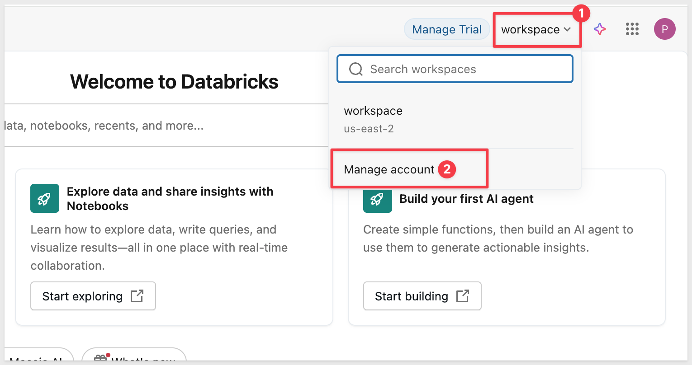

<aside class="positive">
<strong>NOTE:</strong><br> The Account Console is separate from the Workspace. OAuth apps must always be created at the account level in the Account Console. However, the same OAuth app can generate either account-level or workspace-level tokens depending on which authentication endpoints you use. This QuickStart uses workspace-level tokens to avoid SSO complexity.
</aside>

In the Account Console, click on `Settings` (gear icon), then click the `App connections` tab.

Click the `Add connection` button:

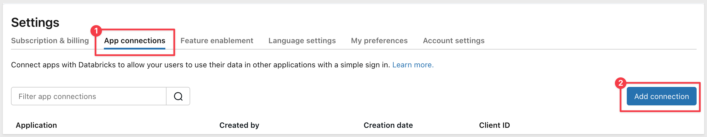

### Configure the OAuth App

Fill out the connection form with the following values:

**Application Name:**
```plaintext
Sigma Embedding
```

**Redirect URLs:**
Sigma requires **three redirect URLs** for OAuth to work properly - one for connection authorization, one for embedded workbook access, and one for the locally hosted application we will provision later. Enter all three URLs based on your Sigma cloud instance (one per line).

**AWS (most common):**
```plaintext
https://aws-api.sigmacomputing.com/api/v2/oauth/1/authcode
https://aws-api.sigmacomputing.com/v2/auth/oauth/databricks/callback
http://localhost:3000/auth/databricks/callback
```

**Azure:**
```plaintext
https://azure-api.sigmacomputing.com/api/v2/oauth/1/authcode
https://azure-api.sigmacomputing.com/v2/auth/oauth/databricks/callback
http://localhost:3000/auth/databricks/callback
```

**GCP:**
```plaintext
https://api.sigmacomputing.com/api/v2/oauth/1/authcode
https://api.sigmacomputing.com/v2/auth/oauth/databricks/callback
http://localhost:3000/auth/databricks/callback
```

<aside class="negative">
<strong>IMPORTANT:</strong><br> All three redirect URLs are required. The first handles connection authorization in Sigma Admin, the second handles OAuth flows in embedded workbooks, and the third is for our local Node.js app.
</aside>

**Access scopes:**
- Check `All APIs` (required for Sigma OAuth authentication flow - includes SQL access)

**Client secret:**
- Keep `Generate a client secret` checked

**Token TTL values:**
- `Access token TTL`: Leave at `60` minutes (default)
- `Refresh token TTL`: Leave at `10080` minutes (7 days - default)

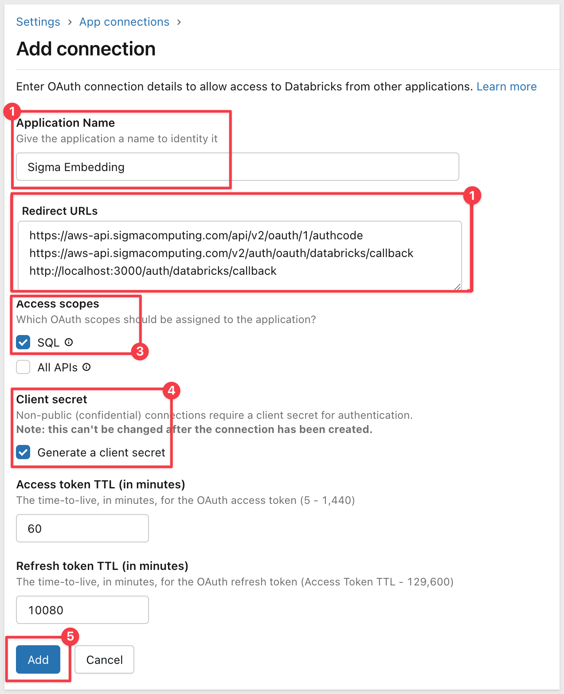

Click `Add`.

### Save Client Credentials
After creating the connection, Databricks displays the **Client ID** and **Client Secret**:

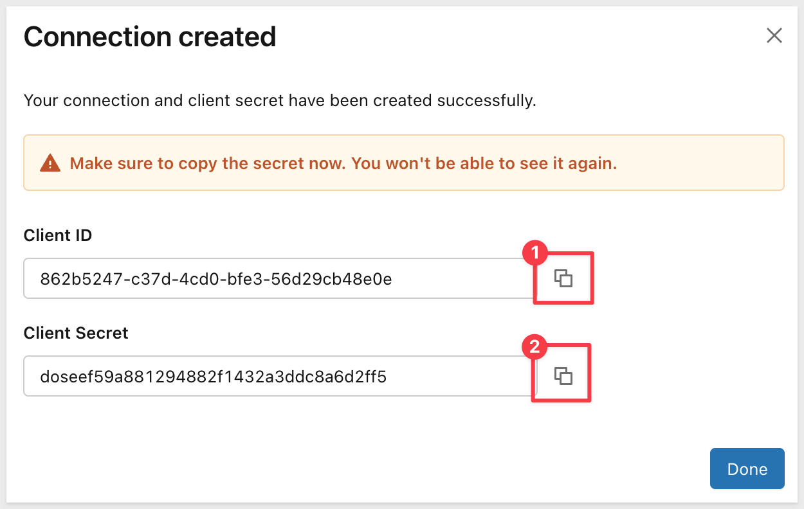

<aside class="negative">
<strong>IMPORTANT:</strong><br> Copy both the Client ID and Client Secret immediately. The Client Secret will not be shown again after you close this dialog.
</aside>

Copy these values to a secure location - you'll need them when configuring the `.env` file later.

Click `Done`.

<aside class="positive">
<strong>NOTE:</strong><br> If you have many app connections, the new Sigma Embedding app connection may be listed on a later page in the App connections tab. You can use the search/filter to locate it quickly.
</aside>


<!-- END OF SECTION-->

## Simplify Authentication for Testing (Trial Accounts)
Duration: 5

If you're using a Databricks trial account for this QuickStart, you'll need to configure authentication to avoid using third-party authenticator apps like Google Authenticator. This step is specific to trial accounts without corporate SSO.

<aside class="positive">
<strong>IMPORTANT:</strong><br> If your organization uses a corporate SSO provider (like Okta, Azure AD, etc.), you can skip this section. OAuth will work with your existing SSO setup - you'll simply authenticate through your identity provider when authorizing the Sigma connection.
</aside>

### Why This Configuration is Needed for Trial Accounts

Databricks trial accounts typically don't have corporate SSO configured. By default, they may require Multi-Factor Authentication (MFA) using apps like Google Authenticator. For this QuickStart demonstration, we'll configure Databricks to use simpler email-based authentication instead.

**Production vs Trial:**
- **Production with SSO:** Users authenticate through your identity provider (Okta, Azure AD, etc.) - no changes needed
- **Trial accounts:** Configure to use one-time passcodes via email to avoid setting up authenticator apps

### Configure Authentication Method

In the Databricks Account Console, go to `Security` → `Authentication`.

Under `Authentication`, click `Manage`:

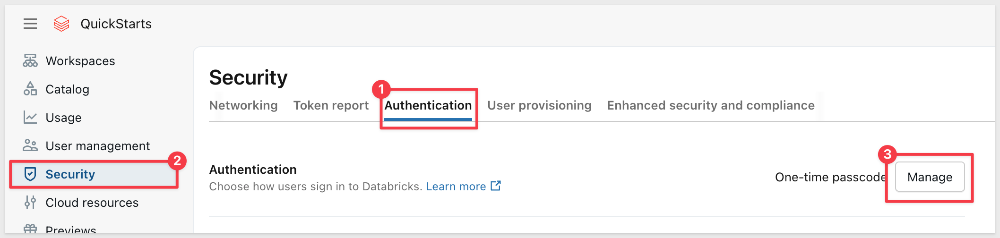

You'll see two options:
- **Single sign-on with my identity provider** - Use this if you have corporate SSO configured
- **Sign-in with email or external providers** - Use this for trial accounts

For trial accounts, select **"Sign-in with email or external providers"**.

Under `Choose sign-in options`, make sure **"One-time passcode"** is checked. If you're using a Google email for your Databricks trial account, also check the Google authentication option:


This allows users to authenticate using a one-time code sent to their email address, avoiding the need for Google Authenticator or other MFA apps.

<aside class="positive">
<strong>NOTE:</strong><br> The warning message "Selecting one-time passcode will change the MFA policy from Disabled to Recommended" is expected. This enables email-based MFA instead of app-based MFA.
</aside>

Click `Update` to save the authentication configuration.

With this configuration, when you authorize the Sigma connection to Databricks, you'll simply enter a code sent to your email rather than using an authenticator app.


<!-- END OF SECTION-->

## Databricks Connection
Duration: 5

We need to create a connection to Databricks in Sigma. 

Log into Sigma as an admin and navigate to `Administration` > `Connections`.

Click `Create Connection`.

Select `Type` and choose Databricks.
 
In the `Connection credentials` section we need to provide a name and then fetch two values from Databricks.

- Connection Name: `Databricks_OAuth_QuickStart` (or your preferred name)

We need to get some values from Databricks: <br>
- Server Hostname: This is your Databricks workspace URL **without https://** <br>
- HTTP Path: This comes from your Databricks SQL warehouse

### Get Connection Details from Databricks

In another browser tab, return to Databricks.

**If you don't have a workspace yet:**

1. In the Databricks Account Console, click `Workspaces` in the left sidebar
2. Click `Create workspace`:

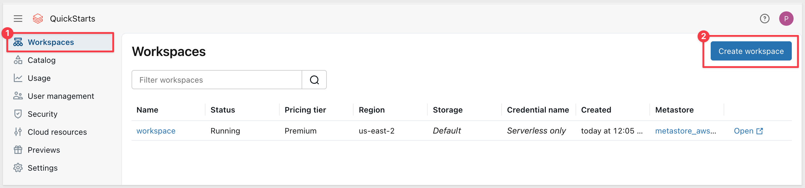

3. Follow the prompts to create a new workspace (select your cloud provider and region)
4. The workspace takes a minute or so to provision (as indicated on the right sidebar)
5. Once provisioned, click the `Open workspace` button:

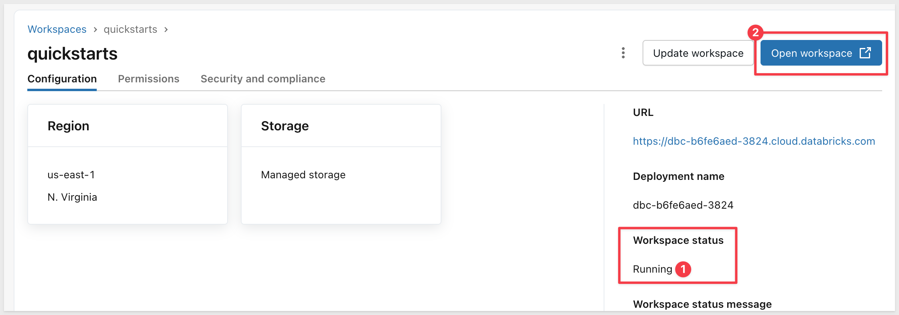

**Access SQL Warehouses:**
Once inside a Databricks workspace, click `SQL warehouses` in the left sidebar (under the SQL grouping).

<aside class="positive">
<strong>NOTE:</strong><br> If you don't have a SQL warehouse yet, click `Create SQL warehouse` and use the default settings. A Starter warehouse is sufficient for this QuickStart.
</aside>

Click your SQL warehouse name, then click the `Connection details` tab.

Copy the `Server hostname` and `HTTP path` values:

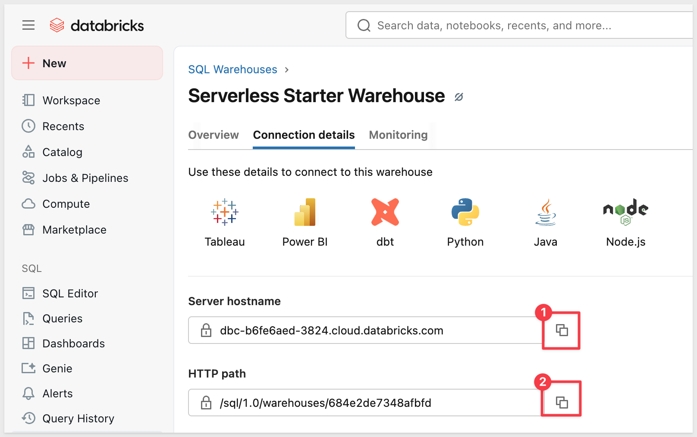

### Configure Connection in Sigma
Return to Sigma and paste the `Server hostname` and `HTTP path` values into the connection form.

Set the `Authentication` method to `OAuth`:

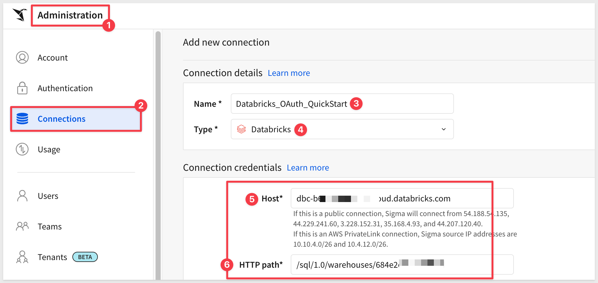

### Select OAuth Provider

In the `OAuth` section, you need to select the correct provider based on where your Databricks workspace is hosted.

**Identify your Databricks cloud provider** by looking at your workspace URL:

**Azure Databricks:**
- URL pattern: `https://adb-1234567890123456.2.azuredatabricks.net`
- Contains: `azuredatabricks.net`
- Select: `Databricks on Azure`

**AWS Databricks:**
- URL pattern: `https://dbc-12345678-1234.cloud.databricks.com`
- Contains: `cloud.databricks.com`
- Select: `Databricks on AWS`

**GCP Databricks:**
- URL pattern: `https://12345678901234.5.gcp.databricks.com`
- Contains: `gcp.databricks.com`
- Select: `Other` (then configure manually)

### Add OAuth Credentials
After selecting the OAuth provider, you'll see fields for OAuth configuration:

**Metadata URL:**
This QuickStart uses **workspace-level OAuth** to avoid Microsoft/SSO authentication complexities in trial accounts. The Metadata URL format is:

**For AWS Databricks:**
```plaintext
https://<your-workspace-host>/oidc/v1/.well-known/openid-configuration
```

For example:
```plaintext
https://dbc-220fa1cd-21d9.cloud.databricks.com/oidc/v1/.well-known/openid-configuration
```

**For Azure Databricks:**
```plaintext
https://<your-workspace-host>/oidc/v1/.well-known/openid-configuration
```

For example:
```plaintext
https://adb-1234567890123456.2.azuredatabricks.net/oidc/v1/.well-known/openid-configuration
```

Replace `<your-workspace-host>` with your actual Databricks workspace hostname (without https://).

<aside class="positive">
<strong>TIP:</strong><br> To find your workspace host, log into your Databricks workspace and copy the hostname from the browser URL (e.g., dbc-220fa1cd-21d9.cloud.databricks.com).
</aside>

<aside class="negative">
<strong>IMPORTANT:</strong><br> We use workspace-level OAuth (not account-level) because account-level OAuth routes through Microsoft/Azure authentication, which can reject personal Microsoft accounts. Workspace-level OAuth allows email-based authentication with one-time passcodes.
</aside>

**Client ID:** Paste the Client ID from the Databricks OAuth app you created earlier

**Client Secret:** Paste the Client Secret from the Databricks OAuth app

Tick the boxes for `Require PKCE` and `Use JWT...`:

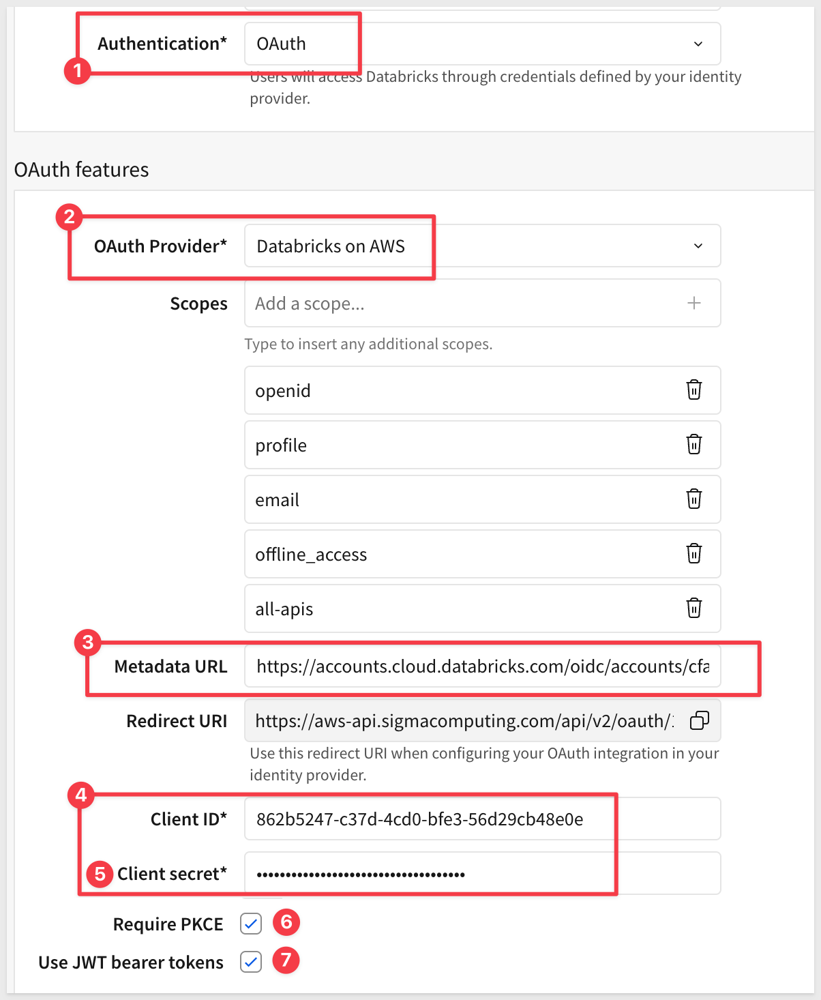

Click `Create` to save the connection.

### Authorize Your OAuth Connection
Before you can use the Databricks OAuth connection, you need to complete the OAuth authorization flow.

After creating the connection, you'll see the connection details page. Click the `Browse` button to view the connection's data sources:

You'll see a warning message: **"Sign in to view this connection"** with the message **"Your OAuth session has expired. Sign in to view this connection."**

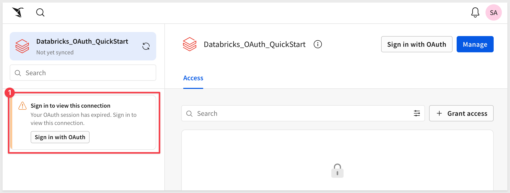

Click the `Sign in with OAuth` button.

This will redirect you to Databricks where you'll:
1. Log in with your Databricks credentials (if not already logged in)
2. Review the permissions Sigma is requesting
3. Click `Allow` or `Authorize` to grant Sigma access

After authorizing, you'll be redirected back to Sigma. You'll see the connection's **Access** tab showing **No one has access to this connection.**

### Grant Connection Access

Before you can use the connection, you need to grant access to users or teams.

Click the `Grant access` button in the top right.

Search for and select:
- Your admin user account
- The `Sales_People` team (or the team you're using for embedded users)

Select the appropriate access level (typically `Can use` for embedded users) and confirm:

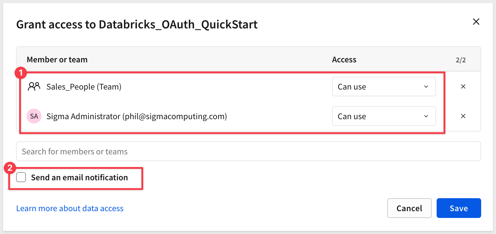

<aside class="positive">
<strong>IMPORTANT:</strong><br> For embedded users, OAuth authentication happens through your application. The access you grant here controls which Sigma users/teams can use this connection. The actual Databricks authentication will be handled by your embed application, which passes OAuth tokens in the JWT.
</aside>

### Verify Connection Access

After granting access, click the `Browse` button (or navigate to the Sources tab) to verify the connection is working.

You should see the Databricks database structure in the left sidebar:
- Expand **samples**
- Expand **nyctaxi**
- Verify you can see the **trips** table


This confirms the OAuth connection is properly configured and ready to use.

### Get the Connection ID
After authorizing the connection, you'll need the `Connection ID` for later configuration.

Return to `Administration` > `Connections` and select the `Databricks_OAuth_QuickStart` connection.

Look at the browser URL - it will look like one of these formats:
```plaintext
https://app.sigmacomputing.com/your-org/admin/connections/1a2b3c4d-5e6f-7g8h-9i0j-k1l2m3n4o5p6
```

The string at the end (e.g., `1a2b3c4d-5e6f-7g8h-9i0j-k1l2m3n4o5p6`) is your Connection ID.

Copy this value and save it temporarily - you'll add it to the `.env` file later when we set up the local application.

<aside class="positive">
<strong>TIP:</strong><br> You can always find the Connection ID by navigating to the connection in Sigma Admin and checking the browser URL.
</aside>


<!-- END OF SECTION-->

## Create Content to Embed
Duration: 5 

Any Sigma URL can be embedded, assuming the proper permissions are passed along as parameters.

Sigma is flexible and offers different workflows for creating content based on the source data.

For example, we could first create a [data model](https://help.sigmacomputing.com/docs/intro-to-data-models), set permissions on it, and then save it off for later use in a workbook. 

We would then create a workbook with a table that shows data from the data model we saved earlier. This is a great way to ensure that downstream content is using trusted data that has been properly constructed and secured prior to use. 

If you are interested in data modeling in Sigma, see: [Fundamentals 10: Data Modeling](https://quickstarts.sigmacomputing.com/guide/fundamentals_10_data_modeling/index.html?index=..%2F..index#0)

<aside class="negative">
<strong>NOTE:</strong><br> To leverage the features in secure embedding, permission to your data is required at some level. Creating a data model and granting permissions to it is considered a best practice.
</aside>

To minimize the steps, we will leverage a different workflow.

<aside class="positive">
<strong>IMPORTANT:</strong><br> In either case, customers should evaluate the many options in Sigma against their own information security, compliance and governance policies, in order to make the best choices for their organizations. Sigma will be there to assist in these decisions, at any time you need.
</aside>

### Create a Workbook with Databricks Sample Data
In Sigma, return to the homepage and click the `+ Create new` button and click `Workbook`:

Drag a new `Table` from the `Data` group on the `Element bar`:

Click `Select source`.

In the connection browser, navigate to your **Databricks_OAuth_QuickStart** connection (the OAuth connection you created earlier).

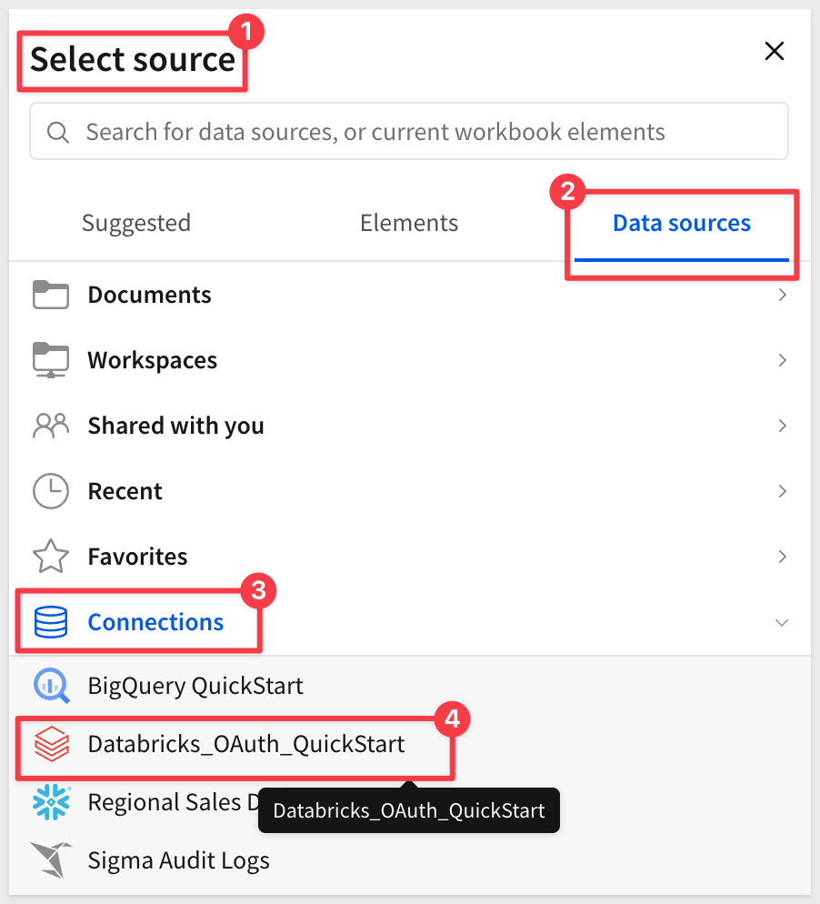

<aside class="positive">
<strong>IMPORTANT:</strong><br> Make sure you select the Databricks OAuth connection, not the Sigma Sample Database. This ensures the workbook uses Databricks data and demonstrates the OAuth authentication flow.
</aside>

Expand the connection and navigate to the **samples** database (available in all Databricks workspaces).

Expand **nyctaxi** and select the **trips** table:

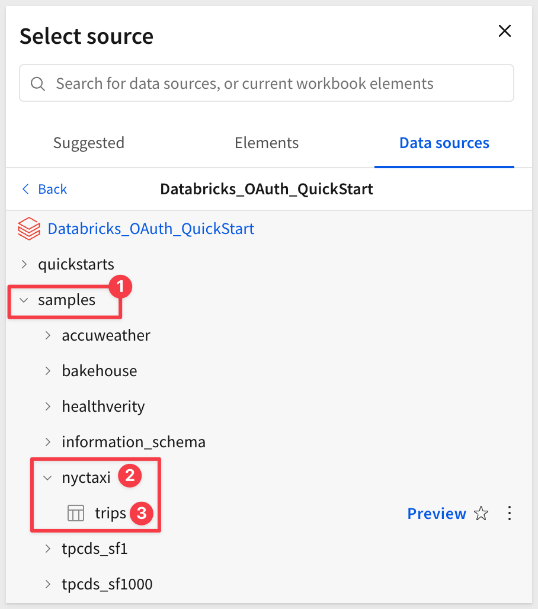

This opens the selected table in a new (unsaved) workbook that carries the temporary name `Exploration`:

The table shows NYC taxi trip data including pickup/dropoff times, locations, fares, and passenger counts.

Click the `Save as` button and save the workbook with the name `Use Case - Databricks with OAuth`:

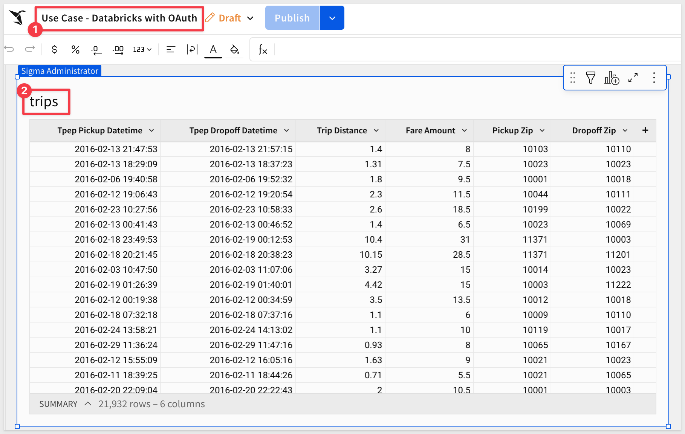

<aside class="negative">
<strong>NOTE:</strong><br> You may have noticed that Sigma provides `Folders`, a `My Documents` folder, as well as `Workspaces`. This enables a variety of use-cases to be possible with regards to how documents are stored, managed and shared with others.
</aside>

### Share Workbook with Team
Before the workbook can be embedded for users in the `Sales_People` team, you need to share it with them. Create the team if it does not exist from previous QuickStarts.

Click the `Share` button in the top right of the workbook.

In the share dialog:
1. Search for `Sales_People` team
2. Select the team from the dropdown
3. Set the permission level to `Can view`
4. Click `Share` or `Add` to confirm:

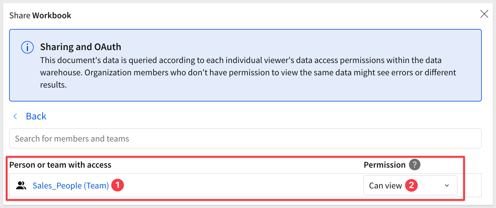

<aside class="positive">
<strong>IMPORTANT:</strong><br> Embedded users must have permission to access the workbook through team membership or direct sharing. In this case, we're granting access to the Sales_People team, which matches the TEAMS parameter we'll use in the JWT.
</aside>

### Base URL
Sigma embedding uses the `Base URL` (the URL shown in the browser's address bar) to identify what is shown in any embed.

This allows any Sigma workbook, page, or element(s) to be embedded.

<aside class="positive">
<strong>IMPORTANT:</strong><br> When using the "Base URL", the workbook must be switched to the published version.
</aside>

Switch the workbook to the `Published version`:

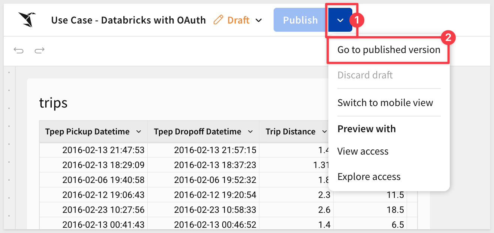

Then just copy the URL and save it for later use.


<!-- END OF SECTION-->

## Client credentials
Duration: 5

Client credentials (a unique client ID and embed secret) are the foundation of secure embedding.

Sigma uses the client ID to determine which embed secret is referenced in a request. Each time a request is made, the server-side embed API uses the embed secret to generate an encrypted signature.

Together, the client ID and embed secret create a robust security framework for server-side interactions with Sigma.

Navigate to `Administration` and scroll down to `Developer Access`.

Click `Create New`:


In the `Create client credentials` modal, select `Embedding`, give it a name, and assign an administrative user as the owner.


<aside class="negative">
<strong>NOTE:</strong><br> Client credentials can also be used for access to Sigma's REST API if the "REST API" checkbox is also selected.
</aside>

Click `Create`.

<aside class="positive">
<strong>IMPORTANT:</strong><br> For security purposes, Sigma provides a one-time view of the embed secret at the time of creation and does not display it again. Because the secret is non-retrievable, it's important that you store the secret securely when you create it.

If you lose the embed secret, or it becomes compromised, you can revoke it and generate a new one; however, this invalidates the previous secret and all embeds that use it. When a new secret is generated, you must modify the embed API and update all existing embeds.
</aside>


Copy and paste the `Client ID` and `Secret` into the respective locations in the `.env` file, in the `# Shared by all QuickStarts` grouping.


<!-- END -->

## Git Repository
Duration: 5

### Clone the Git Repository Project Folder
We have made sample project code available in a public GitHub repository to save time.

While you could clone the entire repository, we'll use sparse-checkout to clone only the specific folder we need, keeping your local project cleaner.

We will use VSCode and the terminal to perform a git `sparse-checkout` of the specific project folder we are interested in. This involves a few extra steps, but results in a cleaner local project folder.

Open `VSCode` and a new `Terminal` session.

Create a new directory in a location of your choice, using the command:

For example:
```code
mkdir sigma_quickstarts
```

Change to the new directory:
```code
cd sigma_quickstarts
```

Execute the terminal command:
```code
git init
```

Add the remote repository as the origin:
```code
git remote add -f origin https://github.com/sigmacomputing/quickstarts-public.git
```

No errors should show:


Enable sparse checkout:
```code
git config core.sparseCheckout true
```

Specify the folder you want to clone by adding it to the sparse-checkout configuration:
```code
echo "embedding_qs_series_2" >> .git/info/sparse-checkout
```

Pull the specified folder from the repository:
```code
git pull origin main
```
<aside class="positive">
<strong>IMPORTANT:</strong><br> The next step requires Node.js. If it has never been installed on your machine, install it from the official site:

[Download Node.js](https://nodejs.org/)

We recommend installing the **LTS (Long Term Support)** version.

Once installed, you can verify the installation in Terminal with:

node -v
npm -v
</aside>

Change directory to the new folder:
```code
cd embedding_qs_series_2
```

Finally, load node into the local project:
```code
npm install
```

After the command runs, click the button to `Open Folder`:


Using the folder navigation, locate your folder and click `Open`. 

We can now see the project called `SIGMA_QUICKSTARTS` with a folder called `embedding_qs_series_2`:

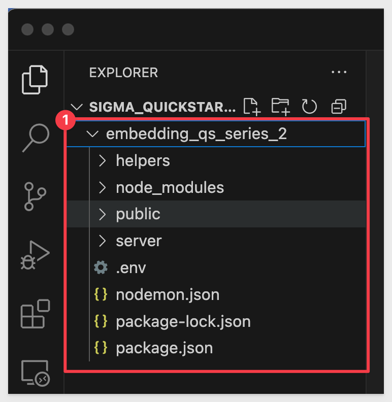

### Install Dependencies

The Databricks OAuth application requires several Node.js packages for OAuth authentication, session management, and Sigma embedding.

Navigate to the `databricks_oauth` folder:
```code
cd public/databricks_oauth
```

Install the application dependencies:
```code
npm install
```

This installs the following key packages:
- **express & express-session**: Web server and session management
- **@sigmacomputing/node-embed-sdk**: Sigma embedding with OAuth token encryption
- **axios**: HTTP client for Databricks API calls
- **dotenv**: Environment variable management

<aside class="positive">
<strong>NOTE:</strong><br> The installation should complete without errors. If you see vulnerability warnings, these can typically be addressed after initial testing.
</aside>


<!-- END OF SECTION-->

## Databricks OAuth Application Architecture
Duration: 5

The Databricks OAuth application demonstrates a complete implementation of connection-level OAuth with PKCE for Sigma embedding.

### Application Structure

The application is located in `public/databricks_oauth/` and consists of several key components:

**Core Files:**
- `server.js`: Express server with OAuth routes and session management
- `login.html`: Login page with "Login with Databricks" button
- `index.html`: Dashboard page that displays the embedded Sigma workbook

**Helper Modules (helpers/folder):**
- `pkce.js`: PKCE code challenge and verifier generation (RFC 7636)
- `databricks-auth.js`: Databricks OAuth functions (authorize, token exchange, refresh)
- `embed-api-oauth.js`: Sigma JWT generation with encrypted OAuth tokens

**Additional Tools:**
- `databricks-token-cli.js`: Standalone CLI tool for testing token generation

<aside class="positive">
<strong>IMPORTANT:</strong><br> This application handles the complete OAuth flow: user authentication, token storage, automatic refresh, and secure token passing to Sigma via encrypted JWT.
</aside>

### How It Works

1. **User Login**: User clicks "Login with Databricks" → redirects to Databricks with PKCE challenge
2. **OAuth Callback**: Databricks redirects back with auth code → exchange for access/refresh tokens
3. **Token Storage**: Tokens stored securely in server-side session
4. **Sigma Embedding**: Access token encrypted and passed to Sigma in JWT
5. **Auto-Refresh**: Tokens automatically refreshed before expiration

### Environment file (.env)
The `.env` file contains configuration settings for the embedding server and each QuickStart. It helps separate runtime parameters (variables) like client secrets and user identity from the source code.

The file is organized into three key sections:

**1: Global Settings:**<br>
Shared across all QuickStarts (e.g. CLIENT_ID, SECRET, SESSION_LENGTH, PORT).

**2: Default Embed User:**<br>
Provides fallback identity parameter values (EMAIL, ACCOUNT_TYPE, TEAMS) to be used if not overridden by a specific QuickStart.

**3: QuickStart-Specific Blocks:**<br>
Each QuickStart has a dedicated section (e.g. GETTING_STARTED_BASE_URL) that may override the user, team, base URL, and so on.

The .env file provides fallback logic for each JWT:

- The code checks if QuickStart-specific settings exist (like GETTING_STARTED_EMAIL).
- If not found or blank, it falls back to the default user values defined in the shared block.

This allows you to maintain a consistent test user by default, and easily override it per QuickStart as needed for different workflows.

Open the `.env` file. We will copy and paste key values as we progress through sections of this QuickStart:

<aside class="positive">
<strong>IMPORTANT:</strong><br> Parameters in the "Default Embed User" group of .env will be overridden by parameters in the other groups. It is there for convenience as often the parameters are common, so having a default group is merely a time saver. Nothing more. 
</aside>


<!-- END OF SECTION-->

## Configure Environment Variables
Duration: 10

Now we need to configure the `.env` file with all the values we've collected throughout this QuickStart.

Return to VS Code and open the `.env` file located at:
```plaintext
embedding_qs_series_2/.env
```

The file is shared across all QuickStarts in this series. We'll configure both the shared settings and the Databricks OAuth-specific section.

### 1. Shared Sigma Embedding Settings

Locate the `# Shared by all QuickStarts` section and add your Sigma embedding client credentials:

```plaintext
CLIENT_ID=your-sigma-client-id-here
SECRET=your-sigma-secret-here
```

For example:
```plaintext
CLIENT_ID=34818770a97bc60baae7a5f88fe59f4452bc26c76ab79c831da6bd658e5ab8768
SECRET=d460d9bb8b3b385e0e4e5f9041782227c02add14a14aaea7bc0556b3375519b7...
```

<aside class="negative">
<strong>IMPORTANT:</strong><br> Use the actual Client ID and Secret from the Sigma client credentials you created earlier (in the "Client credentials" section).
</aside>

### 2. Default Embed User Settings
The default embed user settings are already configured:
```plaintext
EMAIL=sales_person@example.com
ACCOUNT_TYPE=View
TEAMS=Sales_People
```

You can leave these as-is, or customize them for your organization.

<aside class="positive">
<strong>NOTE:</strong><br> For embedded users, use an email that is NOT a native Sigma user. Embedded users are automatically created with the "EMBED" identifier.
</aside>

### 3. Databricks OAuth Configuration
Scroll to the bottom of the `.env` file and locate (or add) the `# Use Case: Databricks OAuth` section.

Configure the following values with the information you've collected:

**1. Sigma Embedding Settings**
Set the workbook URL you copied earlier:
```plaintext
DATABRICKS_OAUTH_BASE_URL=https://app.sigmacomputing.com/your-org/workbook/your-workbook-id
```

Leave these optional overrides blank (they'll use the default embed user settings):
```plaintext
DATABRICKS_OAUTH_EMAIL=
DATABRICKS_OAUTH_ACCOUNT_TYPE=
DATABRICKS_OAUTH_TEAMS=
```

**2. Databricks OAuth Configuration**
Set your Databricks workspace host (copy from your workspace URL):
```plaintext
DATABRICKS_HOST=https://dbc-1234567890-1234.cloud.databricks.com
```

Set your Databricks account ID (optional for workspace-level authentication, but keep it for reference):
```plaintext
DATABRICKS_ACCOUNT_ID=12345678-1234-1234-1234-123456789012
```

<aside class="positive">
<strong>TIP:</strong><br> To find your Account ID, go to Databricks Account Console and look at the URL: https://accounts.cloud.databricks.com/workspaces?account_id=YOUR-ACCOUNT-ID
</aside>

Set the OAuth app credentials from the Databricks app connection you created:
```plaintext
DATABRICKS_OAUTH_CLIENT_ID=12345678-1234-1234-1234-123456789abc
DATABRICKS_OAUTH_CLIENT_SECRET=dose1234567890abcdef1234567890abcdef
```

<aside class="negative">
<strong>IMPORTANT:</strong><br> The Client Secret starts with "dose" (Databricks OAuth SEcret) and is typically 39 characters. Make sure to copy the entire secret.
</aside>

Set the redirect URI (must exactly match your Databricks OAuth app configuration):
```plaintext
DATABRICKS_REDIRECT_URI=http://localhost:3000/auth/databricks/callback
```

Set the authentication level to workspace (for this QuickStart):
```plaintext
DATABRICKS_AUTH_LEVEL=workspace
```

<aside class="positive">
<strong>NOTE:</strong><br> We use workspace-level OAuth to avoid Microsoft/SSO authentication issues with trial accounts. For production with corporate SSO, you can use account-level OAuth instead.
</aside>

**3. Databricks Connection ID in Sigma**
Set the Connection ID you copied from the Sigma connection URL:
```plaintext
DATABRICKS_CONNECTION_ID=ABCdef123GHI456jkl789MNO012pqr
```

**4. Additional Settings**
Set a session secret (change this in production):
```plaintext
DATABRICKS_SESSION_SECRET=change-this-to-random-string-in-production
```

Leave token file saving disabled for web app mode:
```plaintext
DATABRICKS_SAVE_TOKEN_TO_FILE=false
```

<aside class="positive">
<strong>IMPORTANT:</strong><br> Make sure DATABRICKS_REDIRECT_URI matches exactly what you configured in your Databricks OAuth app. For local development, use `http://localhost:3000/auth/databricks/callback`.
</aside>

Save the `.env` file.

### Start the Application
Navigate to the databricks_oauth directory:
```code
cd public/databricks_oauth
```

Start the server:
```code
node server.js
```

You should see output confirming the server is running:
```plaintext
============================================================
Sigma Embedding with Databricks OAuth Server
============================================================
Server running at: http://localhost:3000
Login page: http://localhost:3000/login.html
Health check: http://localhost:3000/health
============================================================
Databricks Host: https://dbc-536d031c-0593.cloud.databricks.com
Auth Level: workspace
Sigma Base URL: https://app.sigmacomputing.com/quick-starts-fundamentals/workbook/Use-Case-Databricks-with-OAuth-6w2cUiJlvQeG1rI5rqQehC
============================================================
```

<aside class="positive">
<strong>TIP:</strong><br> If you see "Cannot find module" errors, make sure you ran `npm install` in the `public/databricks_oauth` directory.
</aside>


<!-- END -->

## Test the OAuth Flow
Duration: 10

Now that the application is running, let's test the complete OAuth authentication flow.

### Access the Login Page

Open your browser and navigate to:
```plaintext
http://localhost:3000/login.html
```

You should see the login page with a "Login with Databricks" button:


### Initiate OAuth Authentication

Click the `Login with Databricks` button.

This triggers the OAuth flow:
1. Your browser redirects to Databricks
2. The application generates a PKCE code challenge
3. Databricks prompts you to authenticate

<aside class="positive">
<strong>NOTE:</strong><br> If you're already logged into Databricks, you may be redirected directly without seeing a login prompt.
</aside>

### Authenticate with Databricks

Enter your Databricks credentials if prompted, then click `Allow` or `Authorize` to grant the application access.

The application requests the following permissions:
- **SQL**: Query data from Databricks
- **All APIs**: Full API access for OAuth flow
- **offline_access**: Ability to refresh tokens

### View the Embedded Dashboard

After successful authentication, you'll be redirected back to the dashboard page at:
```plaintext
http://localhost:3000/dashboard
```

The page displays:
- Your authenticated Databricks user email at the top
- The embedded Sigma workbook showing NYC taxi trip data
- A logout button

<aside class="positive">
<strong>IMPORTANT:</strong><br> The Sigma workbook is now querying Databricks using YOUR authenticated credentials. All queries run with your Databricks permissions, ensuring proper data governance.
</aside>

### Verify the OAuth Token Flow

The application has successfully:
1. Authenticated you with Databricks via OAuth 2.0 with PKCE
2. Retrieved and stored your access and refresh tokens
3. Encrypted your Databricks access token
4. Generated a signed Sigma JWT with the encrypted token
5. Embedded the Sigma workbook with your user context

You can interact with the workbook just like any Sigma dashboard: filter data, drill down, and explore. All queries execute with your Databricks permissions:

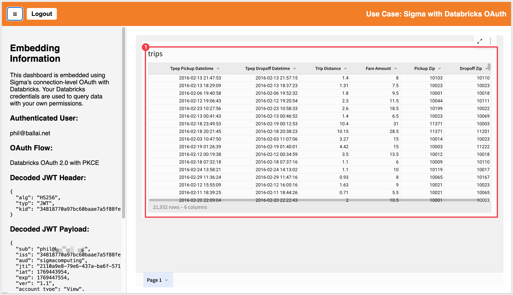


### Test Token Refresh (Optional)

The application automatically refreshes tokens 5 minutes before expiration. To test this:

1. Leave the dashboard open for about 55 minutes (access tokens typically last 60 minutes)
2. Interact with the workbook (e.g., apply a filter)
3. Check the server console logs - you should see token refresh messages

<aside class="negative">
<strong>NOTE:</strong><br> If you see authentication errors, check that your Databricks OAuth app redirect URI exactly matches `http://localhost:3000/auth/databricks/callback`.
</aside>

### Logout

Click the `Logout` button to end your session. This:
- Destroys the server-side session
- Clears all stored tokens
- Redirects back to the login page


<!-- END OF SECTION-->

## Technical Deep Dive: JWT Structure and Token Encryption
Duration: 5

Understanding how OAuth tokens are passed to Sigma is critical for troubleshooting connection-level OAuth implementations.

### JWT Payload Structure

The application generates a JWT (JSON Web Token) that contains the encrypted Databricks access token. The JWT payload includes:

```plaintext
{
  "sub": "sales_person@example.com",      // User email
  "iss": "<sigma-client-id>",             // Sigma client ID
  "aud": "sigmacomputing",                // Required audience
  "jti": "<unique-id>",                   // Unique token ID
  "iat": 1234567890,                      // Issued at timestamp
  "exp": 1234571490,                      // Expiration timestamp
  "ver": "1.1",                           // CRITICAL: Must be "ver" as STRING
  "account_type": "View",                 // Sigma account type
  "teams": ["Sales_People"],              // Team membership
  "connection_oauth_tokens": {            // Encrypted OAuth tokens
    "<connection-id>": "<encrypted-token>"
  }
}
```

<aside class="negative">
<strong>CRITICAL:</strong><br> The version field MUST be `ver: "1.1"` (as a string), NOT `version: 1.1` (as a number). Using the wrong field name will result in the error: "connection_oauth_tokens is only supported in ver 1.1"
</aside>

### Token Encryption Process

The Databricks access token is encrypted before being added to the JWT:

1. **Generate Databricks Token**: User authenticates → Databricks returns access token
2. **Encrypt Token**: Use `@sigmacomputing/node-embed-sdk` to encrypt the token with your Sigma secret
3. **Build JWT**: Add encrypted token to JWT payload under `connection_oauth_tokens[connectionId]`
4. **Sign JWT**: Sign the complete payload with your Sigma secret using HS256 algorithm
5. **Pass to Sigma**: Append JWT to embed URL as `:jwt=<token>` parameter

The encryption ensures the Databricks access token is never exposed in the browser or network traffic.

### Code Reference

In `helpers/embed-api-oauth.js`, the key code is:

```javascript
const { encrypt } = require('@sigmacomputing/node-embed-sdk');

// Encrypt the Databricks access token
const encryptedToken = encrypt(sigmaSecret, databricksAccessToken);

// Build JWT payload - note "ver" as string!
const payload = {
  sub: email,
  iss: sigmaClientId,
  aud: 'sigmacomputing',
  jti: uuid(),
  iat: now,
  exp: expirationTime,
  ver: '1.1',  // Must be "ver" as STRING
  account_type: accountType,
  teams: teamsArray,
  connection_oauth_tokens: {
    [connectionId]: encryptedToken
  }
};

// Sign the JWT
const token = jwt.sign(payload, sigmaSecret, {
  algorithm: 'HS256',
  keyid: sigmaClientId
});
```

<aside class="positive">
<strong>NOTE:</strong><br> The `@sigmacomputing/node-embed-sdk` package uses AES-256 encryption to secure the OAuth token. Sigma decrypts it server-side using your embed secret, then uses it to query Databricks with the user's permissions.
</aside>

### Common Issues and Solutions

**Error: "connection_oauth_tokens is only supported in ver 1.1"**
- **Cause**: Using `version: 1.1` (number) instead of `ver: '1.1'` (string)
- **Solution**: Change the JWT field name to `ver` and use a string value `'1.1'`

**Error: "Invalid encrypted token"**
- **Cause**: Token encryption failed or wrong secret used
- **Solution**: Verify you're using the correct Sigma embed secret for encryption

**Error: "Sign in to view this connection"**
- **Cause**: Metadata URL mismatch between Sigma connection and application
- **Solution**: Ensure both use workspace-level OAuth (not account-level)

**Error: "Personal Microsoft accounts are not supported"**
- **Cause**: Using account-level OAuth with trial account
- **Solution**: Use workspace-level OAuth with workspace metadata URL format


<!-- END OF SECTION-->

## Production Considerations
Duration: 5

Before deploying connection-level OAuth with Databricks to production, consider these important security and operational best practices.

### Security Hardening

**1. Environment Variables**
- Never commit `.env` files to source control
- Use environment-specific secrets management (AWS Secrets Manager, Azure Key Vault, etc.)
- Rotate OAuth client secrets periodically
- Change `DATABRICKS_SESSION_SECRET` to a cryptographically random value

**2. Session Security**
```javascript
// In production, enable secure session cookies
app.use(session({
  secret: process.env.DATABRICKS_SESSION_SECRET,
  resave: false,
  saveUninitialized: false,
  cookie: {
    secure: true,        // Require HTTPS
    httpOnly: true,      // Prevent XSS
    sameSite: 'strict',  // Prevent CSRF
    maxAge: 24 * 60 * 60 * 1000
  }
}));
```

**3. HTTPS Requirements**
- Deploy application behind HTTPS (required for secure cookies)
- Update Databricks OAuth app redirect URI to use `https://` instead of `http://localhost`
- Configure SSL/TLS certificates

**4. Token Storage**
- Current implementation stores tokens in server-side sessions (secure)
- For distributed systems, use Redis or similar for session storage
- Never store OAuth tokens in browser localStorage or cookies

### OAuth App Configuration

**Production Redirect URIs:**
Update your Databricks OAuth app to include production callback URLs:

```plaintext
https://your-domain.com/auth/databricks/callback
https://aws-api.sigmacomputing.com/api/v2/oauth/1/authcode
https://aws-api.sigmacomputing.com/v2/auth/oauth/databricks/callback
```

Remove the `localhost` redirect URI from production apps.

### Authentication Method Selection

**For Production with Corporate SSO:**
- Use **account-level OAuth** with your identity provider (Okta, Azure AD, etc.)
- Configure Databricks authentication to use your corporate SSO
- Update Sigma connection metadata URL to account-level format:
  ```plaintext
  https://accounts.cloud.databricks.com/oidc/accounts/{ACCOUNT_ID}/.well-known/openid-configuration
  ```
- Update `.env`: `DATABRICKS_AUTH_LEVEL=account`

**For Production with Workspace-Level Auth:**
- Keep **workspace-level OAuth** (as demonstrated in this QuickStart)
- Simpler authentication, but limited to single workspace
- Better for scenarios without enterprise SSO

### Monitoring and Logging

**Add Production Logging:**
```javascript
// Log OAuth events for audit trail
console.log('[OAuth] User authenticated:', {
  email: userEmail,
  timestamp: new Date().toISOString(),
  tokenExpiry: new Date(tokenExpiresAt).toISOString()
});

// Monitor token refresh events
console.log('[OAuth] Token refreshed for user:', userEmail);
```

**Monitor Token Expiration:**
- Set up alerts for failed token refresh attempts
- Track token expiration patterns to optimize refresh timing
- Log authentication failures for security monitoring

### Error Handling

**Improve User-Facing Errors:**
```javascript
// Instead of generic error redirects
res.redirect('/login.html?error=authentication_failed');

// Provide specific, actionable messages
res.redirect('/login.html?error=token_expired&message=Please+sign+in+again');
```

**Graceful Degradation:**
- Handle network failures during OAuth callback
- Provide clear error messages when Databricks is unavailable
- Implement retry logic for transient failures

### Performance Optimization

**Token Refresh Strategy:**
- Current implementation refreshes 5 minutes before expiration
- Adjust based on your usage patterns and token TTL
- Consider proactive refresh for long-running sessions

**Session Management:**
- Clean up expired sessions periodically
- Set appropriate session TTL based on security requirements
- Use Redis or similar for distributed session storage

### Compliance and Audit

**Data Governance:**
- All queries run with user's Databricks permissions (row-level security enforced)
- Audit logs in Databricks show actual user identity
- Sigma embedding logs capture user email and teams

**Access Control:**
- Grant Sigma connection access only to required teams
- Use Sigma's team-based permissions for workbook access
- Regularly review OAuth app permissions in Databricks

**Token Lifecycle:**
- Access tokens: 60 minutes (configurable in Databricks OAuth app)
- Refresh tokens: 7 days (configurable in Databricks OAuth app)
- Session cookies: 24 hours (configurable in Express session)

<aside class="positive">
<strong>IMPORTANT:</strong><br> Connection-level OAuth provides strong data governance by enforcing user-level permissions at the source. This ensures embedded users can only access data they're authorized to see in Databricks, making it ideal for multi-tenant embedded analytics.
</aside>


<!-- END OF SECTION-->

## What we've covered
Duration: 5

In this QuickStart, you implemented connection-level OAuth with PKCE for Sigma embedding with Databricks, creating a Node.js application that authenticates each user individually and passes their encrypted credentials to Sigma. This ensures embedded users query Databricks with their own permissions, providing true user-level data governance and complete audit trails.

The working implementation demonstrates how every query runs under the authenticated user's identity, automatically enforcing row-level security and access policies at the source.

**Additional Resource Links**

[Blog](https://www.sigmacomputing.com/blog/)<br>
[Community](https://community.sigmacomputing.com/)<br>
[Help Center](https://help.sigmacomputing.com/hc/en-us)<br>
[QuickStarts](https://quickstarts.sigmacomputing.com/)<br>

Be sure to check out all the latest developments at [Sigma's First Friday Feature page!](https://quickstarts.sigmacomputing.com/firstfridayfeatures/)
<br>

[](https://twitter.com/sigmacomputing)&emsp;
[](https://www.linkedin.com/company/sigmacomputing)&emsp;
[](https://www.facebook.com/sigmacomputing)


<!-- END OF WHAT WE COVERED -->
<!-- END OF QUICKSTART -->
