author: pballai
id: events-hol_build_app_with_claude_and_mcp
summary: events-hol_build_app_with_claude_and_mcp
categories: eventhols
environments: web
status: Hidden
feedback link: https://github.com/sigmacomputing/sigmaquickstarts/issues
tags: eventhols
lastUpdated: 2026-10-05

# Build an AI app with Claude and the Sigma MCP server

## Overview
Duration: 5

SIGMA LIVE 2026 · HANDS-ON LAB

In this lab you'll build a working store performance app for Plugs Electronics, a fictional retailer with 200 stores. You won't click through menus. You'll describe what you want to Claude, and Claude will build it in your Sigma org through the Sigma MCP server, on live data in the warehouse.

<aside class="positive">
<strong>IMPORTANT:</strong><br> Some screens in Sigma may appear slightly different from those shown in QuickStarts. This is because Sigma continuously adds and enhances functionality. Rest assured, Sigma's intuitive interface ensures that any differences will not prevent you from successfully completing any QuickStart.
</aside>

### Who this lab is for
Anyone who builds or plans dashboards and apps in Sigma. No coding needed. If you can describe a dashboard to a colleague, you can do this lab.

### What you'll learn
- How Claude uses the Sigma MCP server to find data, check it, and build on it
- How to write a prompt that gets a reliable build: name the decisions, not just the goal
- How an app goes beyond a dashboard: input tables, a decision drawer, and an audit log that write back to the warehouse
- How to add a Sigma agent that answers questions from your app's live data

### Prerequisites

<ul>
  <li>A Sigma login for the lab org. A link will be provided after registration.</li>
  <li>A browser tab for Claude and one for Sigma, side by side if you can.</li>
  <li>A Claude account on a plan that supports uploading plugins. If your organization manages Claude, an admin may need to allow custom plugins first.</li>
  <li>The ability to add connectors in Claude and connect them.</li>
  <li>The plugin zip file from Sigma. Download link supplied later.</li>
</ul>

### How this lab works

- Paste each prompt into Claude exactly as written, then wait. Builds take 3 to 10 minutes.
- Don't edit the workbook in Sigma while Claude is building. Open it to look, but wait for Claude to say it's done before you change anything.
- Errors may scroll by during a build. Claude usually fixes them itself. Only step in when it stops and asks you something.
- If you fall behind, raise your hand. Your facilitator will get you onto a checkpoint so you can keep going.

For more information on Sigma's product release strategy, see [Sigma product releases](https://help.sigmacomputing.com/docs/sigma-product-releases)


<!-- END OF SECTION-->

## Install the Sigma Build MCP plugin in Claude
Duration: 5

Before we start, we need to download and install the MCP plugin into Claude.

Click the button to start the download and save it somewhere easy to find. **There is no need to unzip the files.**

<button>[Download the Plugin](https://sigma-quickstarts-main.s3.us-west-1.amazonaws.com/zip/sigma-build-staging-us-aws.plugin.zip)</button>

<aside class="negative">
<strong>This plugin is beta.</strong> Features and steps may change before the final release.
</aside>

### Part 1: Upload the plugin to Claude

Sign in to Claude, then follow the steps below.

**1. Open Customize**<br>
In Claude, select `Customize` > `Plugins` > `Yours` from the left sidebar.

Click the `+ Add` button and select `Upload a plugin`.

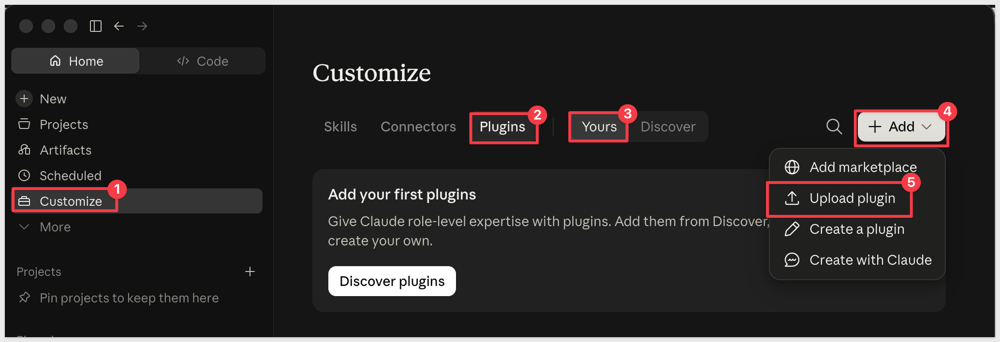

**2. Select the zip file**<br>
Choose the Sigma Build MCP plugin zip file you downloaded. Note the file size is `92.8 KB`. Click `Upload`.  

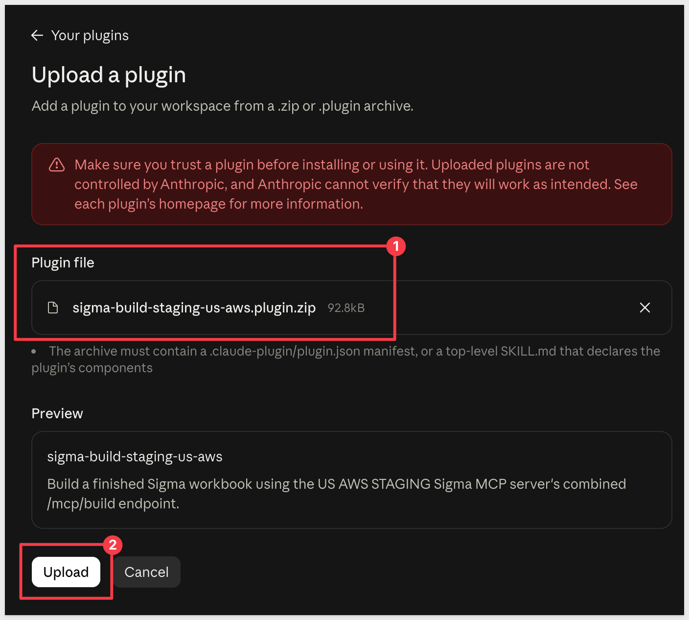

Claude will run a security scan and, once done, the plugin is ready for use.

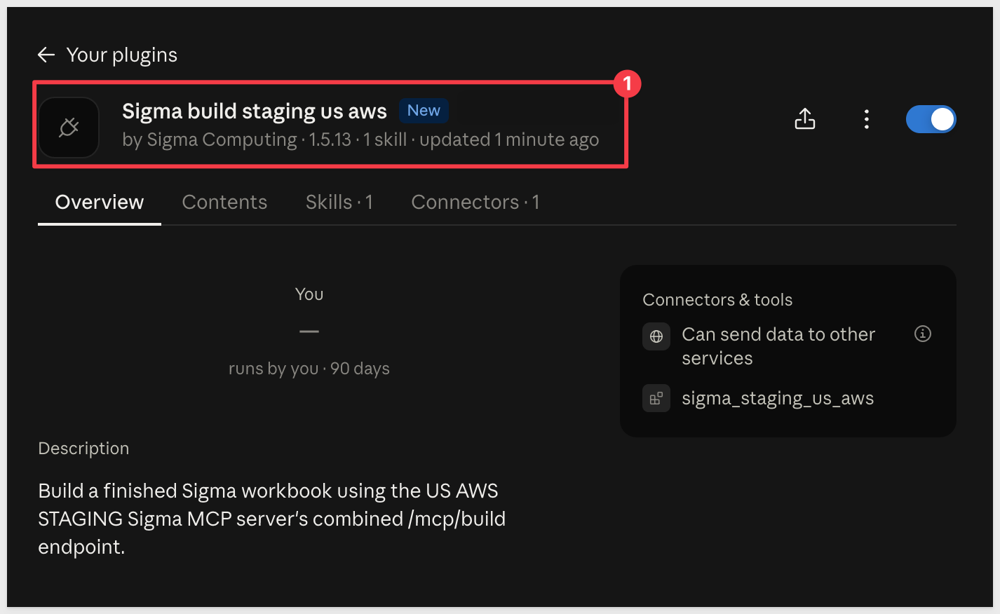

### Part 2: Connect to Sigma with OAuth

**1. Go to Connectors**<br>
Select the `Connectors` tab.

**2. Start the connection**<br>
Next to the Sigma connector, select `Connect`. A Sigma sign-in window opens.

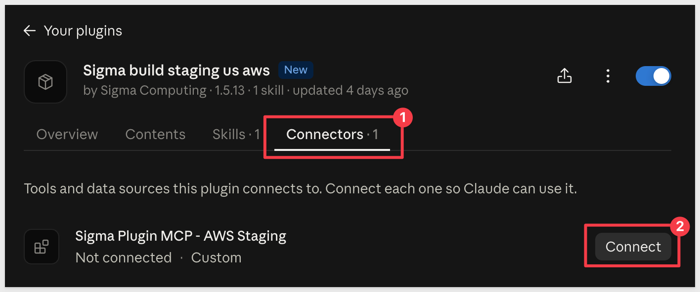

**3. Sign in to Sigma**<br>
Claude will open your default browser. Sign in with your usual method, including single sign-on (SSO) if your organization uses it.

**4. Approve access**<br>
Review the permissions Sigma requests, then select `Continue connecting`.

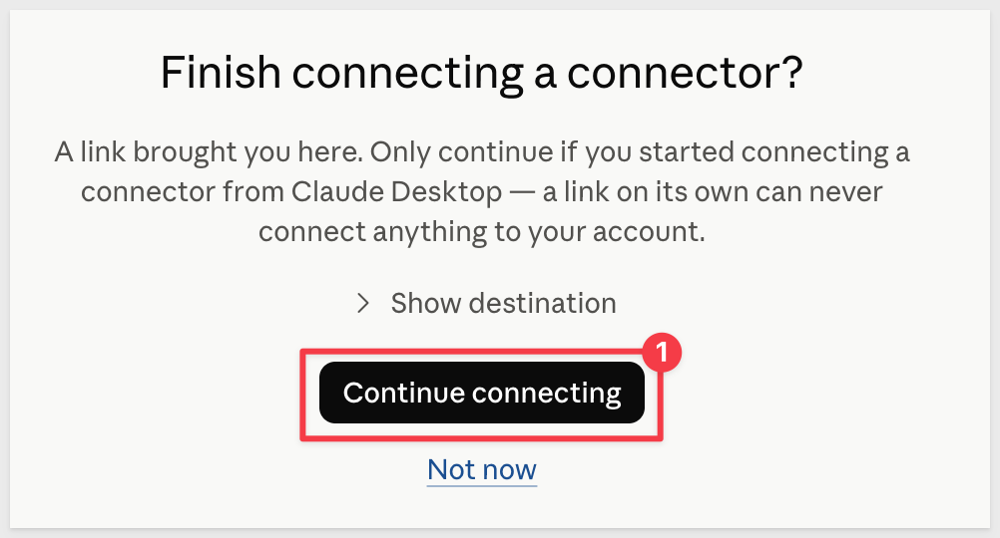

**5. Log into the Sigma lab instance**<br>
This will land you on a Sigma login page. Enter the following and click `Continue`.

```copy-code
sigma-live-november-2026-nyc
```

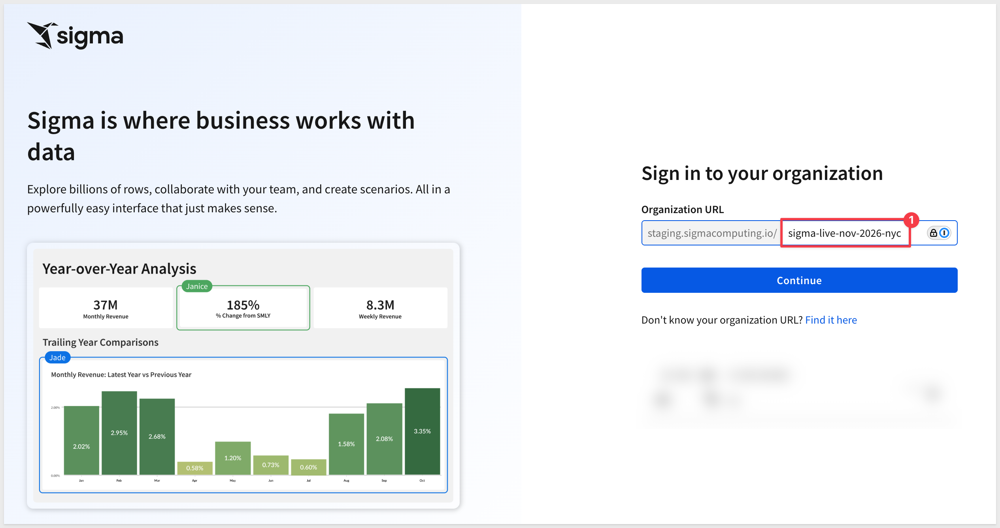

Use the credentials supplied by your facilitator.

**6. Confirm the connection**<br>
When prompted, click `Allow`.

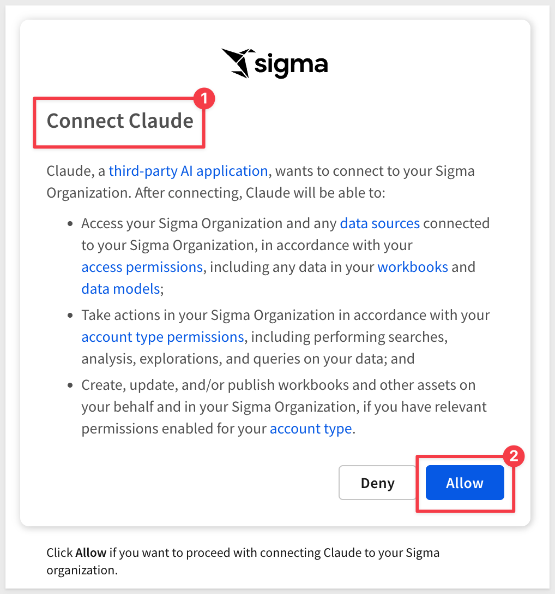

Back in Claude, check that the connector shows as `Connected`.

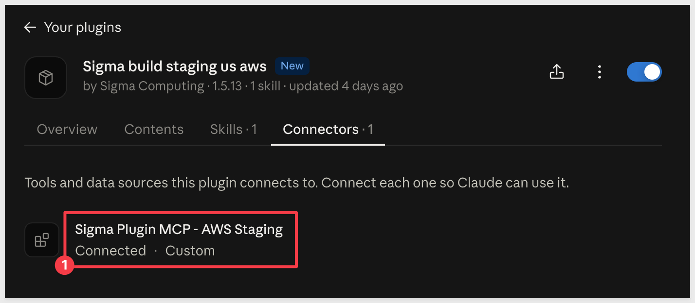

### Part 3: Choose tool permissions

Claude asks how to handle each Sigma tool. For each one, choose `Always allow`, `Needs approval`, or `Never allow`. You can change these any time under `Customize` > `Connectors`.

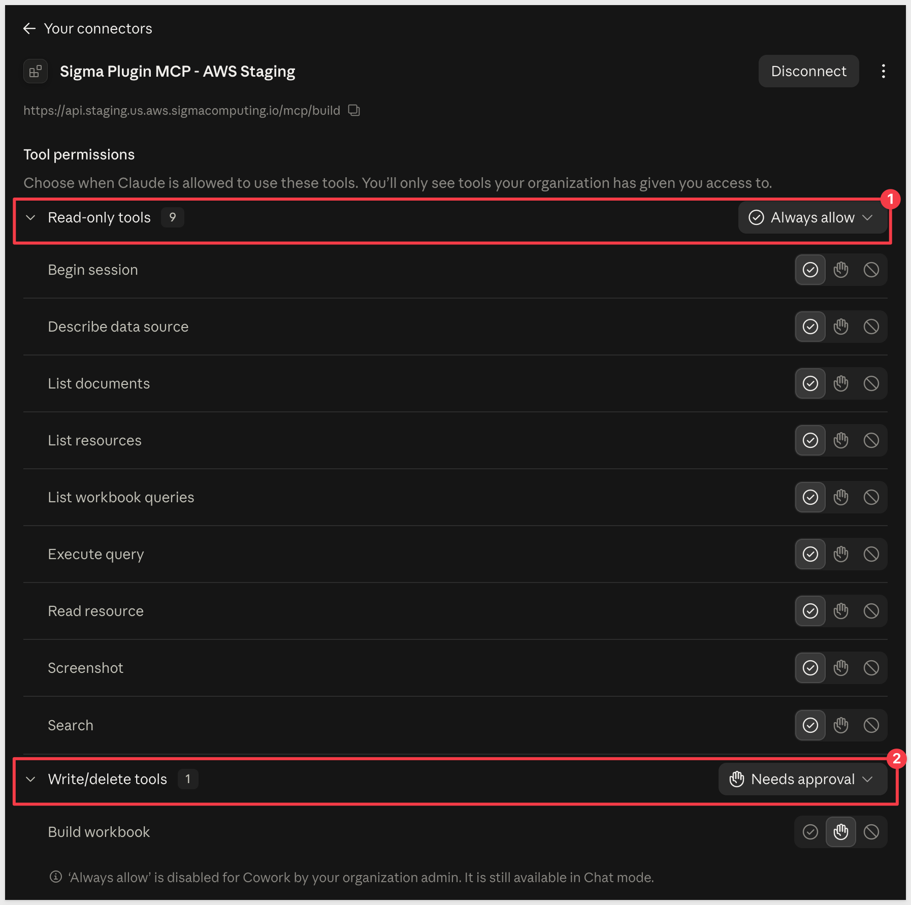

### Test it

Start a new chat and make a simple request.

```copy-code
Build a workbook from the table PLUGS_ELECTRONICS_HANDS_ON_LAB_DATA in the RETAIL schema of the Sigma Sample Database connection, with a KPI for total revenue and a chart of revenue by month.
```

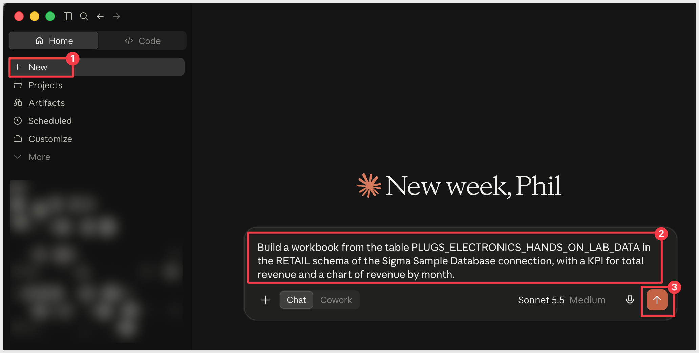

Claude may prompt (depending on the permissions you just set for it). Since this is the first time, we selected `Allow once`.

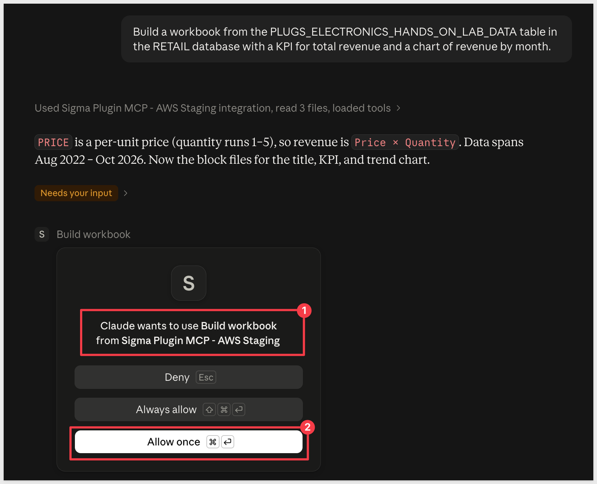

Claude carefully constructs the new workbook and, when done, provides a summary and a link to it.

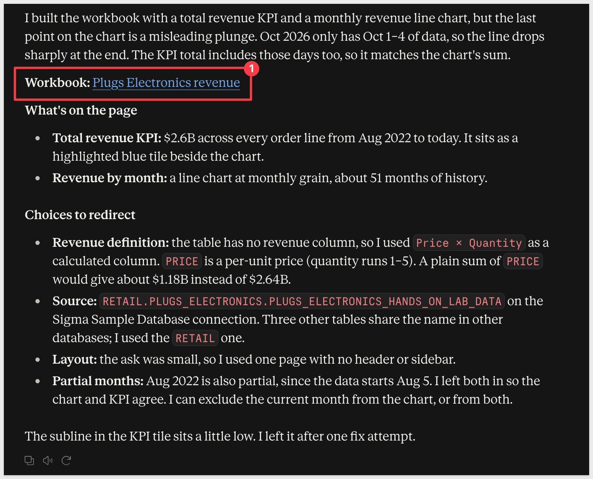

After logging into Sigma with the credentials supplied by your facilitator, we are presented with the new workbook.

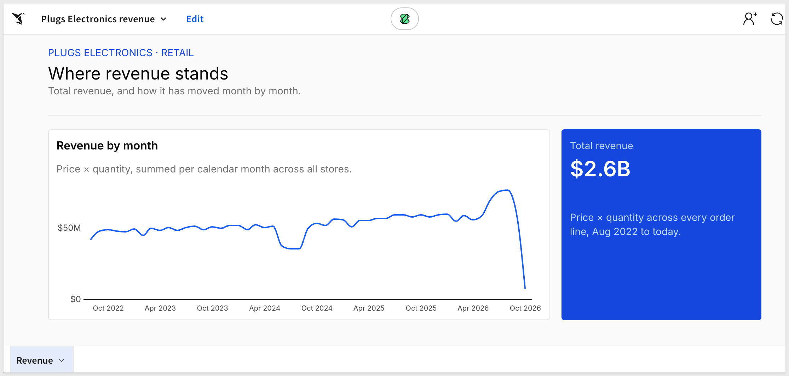

### Troubleshooting

| Issue | What to try |
| --- | --- |
| Upload plugin isn't available | Your organization may restrict custom plugins. Ask your Claude admin to enable them. |
| The sign-in window doesn't open | Allow pop-ups for claude.ai, then select Connect again. |
| Sign-in works but Claude shows an error | Disconnect the connector, reconnect, and approve the permissions again. |
| Claude can't find your data | Confirm your Sigma account has access to the connection or data model you're asking about. |

### Need help?

Contact your Sigma Customer Success Manager or Sigma Support.


<!-- END OF SECTION-->

## Connect and discover
Duration: 5

Next, let's build something more involved. Start a new chat and ask the following.

```copy-code
Start a Sigma session. Then find the table PLUGS_ELECTRONICS_HANDS_ON_LAB_DATA in the RETAIL schema of the Sigma Sample Database connection. There is a second copy in an EXAMPLES schema, so use the RETAIL one.

Describe its columns, then run a query that returns: total rows, the number of distinct stores and regions, the earliest and latest order date, and total revenue (Price times Quantity).

Don't build anything yet. Summarize what the data covers in three sentences.
```

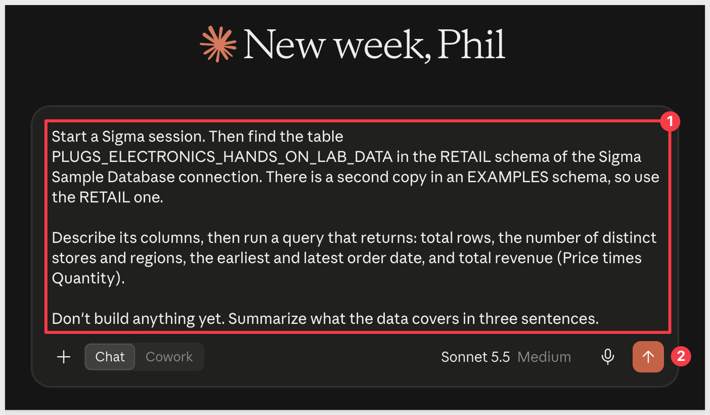

**WHAT YOU SHOULD SEE**<br>
About 4.6 million rows, 200 stores, 5 regions, and orders from July 2022 through the last week or two.

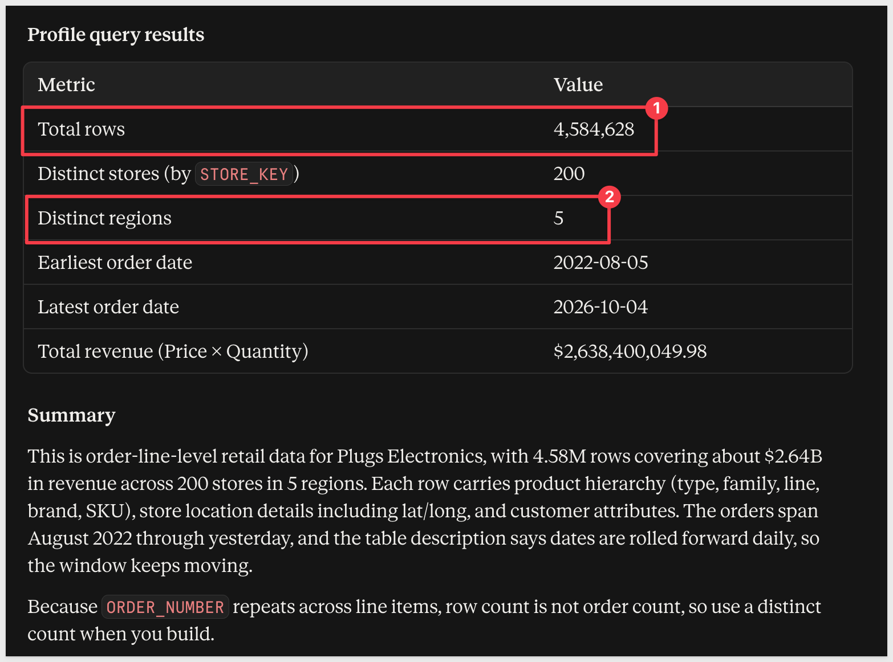

**WHY IT MATTERS**<br>
Claude signs in with your identity, so it can only see what you can see in Sigma. Every query runs live in the warehouse. No data is copied into Claude or into Sigma.

Leave this chat window open.


<!-- END OF SECTION-->

## Overview dashboard
Duration: 12

Now that we are comfortable we have identified the right source table, we can create a workbook.

Use the next prompt but replace **{YOUR_FIRST_NAME}** before you send it.

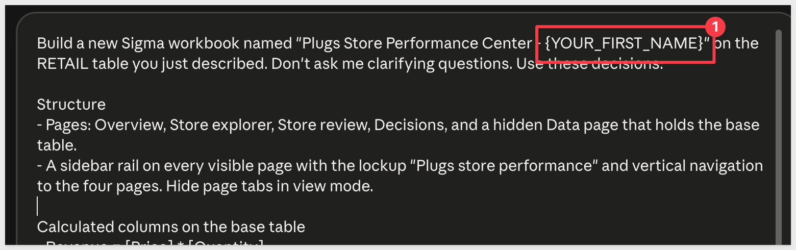

```copy-code
Build a new Sigma workbook named "Plugs Store Performance Center - {YOUR_FIRST_NAME}" on the RETAIL table you just described. Don't ask me clarifying questions. Use these decisions:

Structure
- Pages: Overview, Store explorer, Store review, Decisions, and a hidden Data page that holds the base table.
- A sidebar rail on every visible page with the lockup "Plugs store performance" and vertical navigation to the four pages. Hide page tabs in view mode.

Calculated columns on the base table
- Revenue = [Price] * [Quantity]
- Gross profit = ([Price] - [Cost]) * [Quantity]
- Period: "Last 12 months" for the 12 complete calendar months before the current month, "Prior 12 months" for the 12 months before that, and "Current month" or "Earlier" for everything else. Compute it relative to today, with no hardcoded dates.

Overview page
- A title that greets the viewer by first name.
- Four KPIs comparing Last 12 months to Prior 12 months: Revenue, Gross profit, Gross margin, and Units sold (sum of Quantity).
- A line chart of monthly revenue over the last 24 full months, beside a donut of last-12-month revenue by Store Region.
- A horizontal bar chart of the top 10 brands by last-12-month revenue, with axis labels instead of data labels, beside a table of Product Type with Last 12 mo, Prior 12 mo, and YoY change colored green or red.

Leave the other three pages with only a title for now. When it's built, screenshot the Overview and tell me the four KPI values.
```

**WHAT YOU SHOULD SEE**<br>
Claude will provide the workbook link along with summary information as before.

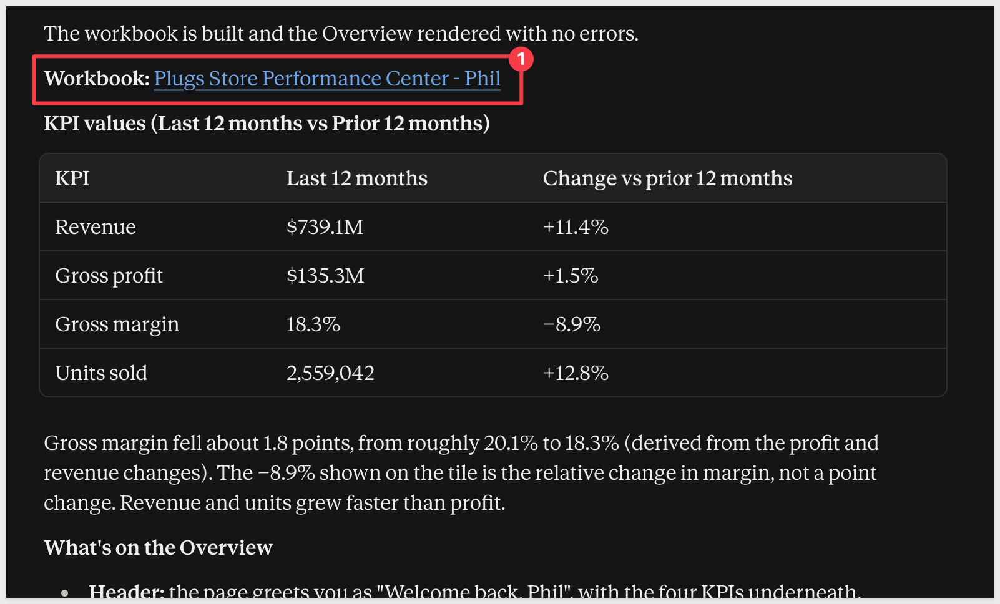

An Overview page with four KPIs compared to the prior year, a monthly revenue trend, revenue by region, top brands, and category growth.

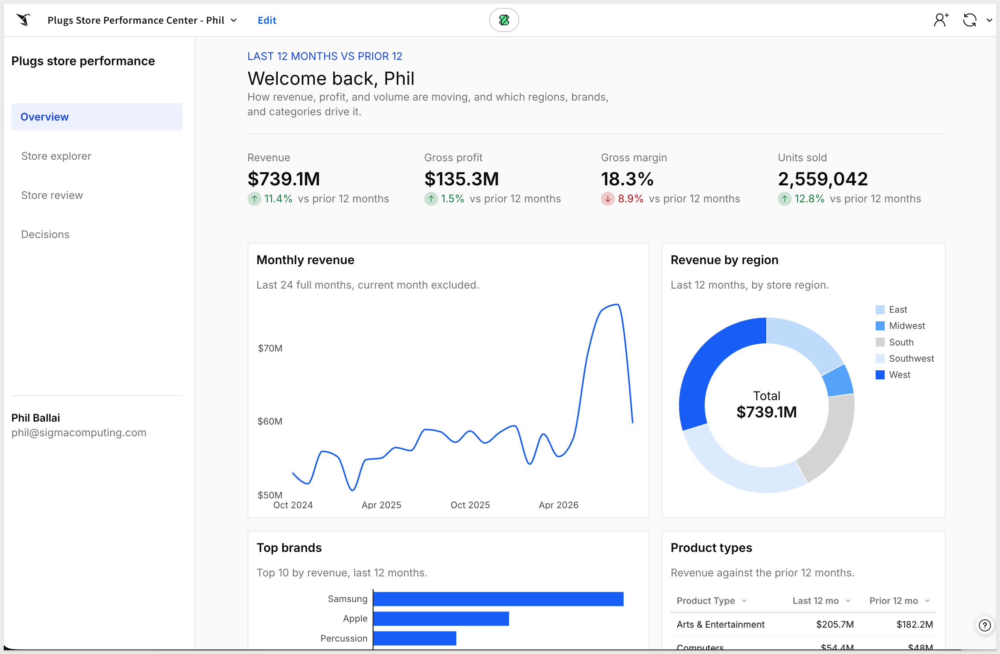

**WHY IT MATTERS**<br>
The prompt defines "last 12 months" relative to today. The workbook stays current as data arrives, with no hardcoded dates and no one maintaining it.

There are also three links in the left sidebar for `Store explorer`, `Store review`, and `Decisions`. We will build those out next.


<!-- END OF SECTION-->

## Store explorer
Duration: 10

Moving faster now, here is the prompt to build the `Store explorer` page.

```copy-code
Keep working in the same workbook. Don't create a new one. Build the Store explorer page:
- A filter toolbar with a Search box (Store Name, contains), a Region list, and a Product type list. These filters apply to this page only, not the Overview.
- A point map using Store Latitude and Store Longitude, with points sized and shaded by last-12-month revenue. No point labels.
- A table with one row per store (Store Name, Store Region, Store City) showing Last 12 mo revenue, Prior 12 mo revenue, YoY change, and Margin. Sort by YoY change, worst first. Color YoY change red when negative and green when positive.

Screenshot the page when done.
```

In our test, Claude did not provide the screenshot as expected, but that is fine. Careful prompting is always important to save time and tokens too.

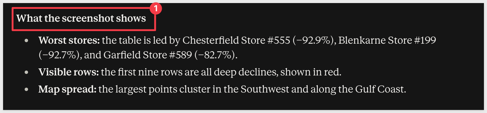

Click the link to the workbook (or refresh Sigma in the browser) to see the results on the `Store explorer` page.

**WHAT YOU SHOULD SEE**<br>
Search and filters, a map of every store sized by revenue, and a table of stores with the steepest declines at the top.

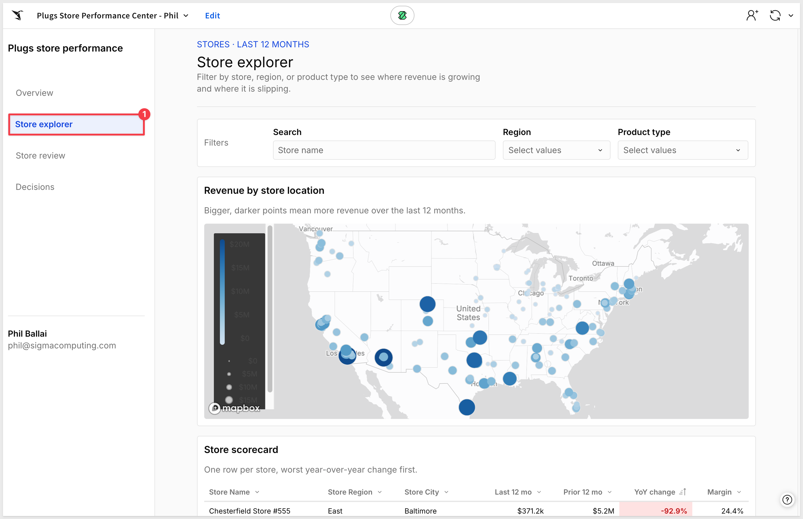

**WHY IT MATTERS**<br>
Try the filters. Each change is a new query against the full 4.6 million rows in the warehouse, not a sample or an extract.


<!-- END OF SECTION-->

## Review queue with writeback
Duration: 20

This is where the dashboard becomes an app. Stores with declining revenue land in a queue. Managers assign an owner and an action, then approve, escalate, or dismiss each one, and every decision is saved to the warehouse.

Here is the prompt to build the `Store review` and `Decisions` pages.

```copy-code
Keep working in the same workbook. Turn Store review into a review queue app that writes back to the warehouse. Put all input tables on the Sigma Sample Database connection. Don't ask me clarifying questions.

The queue
- On the Data page, a table with one row per store (Store Name and Store Region) and three calculations: Last 12 mo revenue, Prior 12 mo revenue, and Revenue YoY (last divided by prior, minus 1). Filter it to stores where Revenue YoY is below zero, excluding blanks.
- On Store review, a linked input table over that table, keyed on Store Name (shown as "Store"). Show Region, Last 12 mo, and YoY change, plus editable columns: Decision (single select: Approved, Dismissed, Escalated), Action (text), Owner (text), and Note (text). Sort by YoY change, worst first. Anyone the workbook is shared with can edit.
- A chip beside the page title that counts stores with no Decision, like "52 to decide".
- A toolbar with a Search box on Store, a Region list, and an "Open a store" picker.

The decision flow
- Picking a store in "Open a store" opens a drawer titled "Decide on this store". It shows the store name, last-12-month revenue, YoY change, Owner, and Action, plus a Note text area and three buttons: Approve, Escalate, and Dismiss.
- Each button sets that store's Decision, adds a row to the decision log with the store, decision, and note, refreshes the queue, and closes the drawer.

The Decisions page
- An empty input table named "Decision log" with Store, Decision (same three options), and Note, plus created at and created by system columns.
- A KPI strip under it counting Approved, Escalated, and Dismissed.

Seed data
- In the queue, set Blenkarne Store #199 to Approved (Action "Inventory audit", Owner "Priya Raman") and Maple Store #367 to Escalated (Action "Staffing review", Owner "Marcus Lee"). If either store isn't in the queue, use the two worst-declining stores instead.
- Add matching rows to the Decision log.

A linked input table needs separate build calls: commit the queue's source table first, then add the linked table, then seed the rows. When it's done, screenshot Store review and Decisions.
```

**WHAT YOU SHOULD SEE**<br>
Store review shows about 50 declining stores, worst first, with a count of how many still need a decision. The Decisions page shows a log with who decided and when.

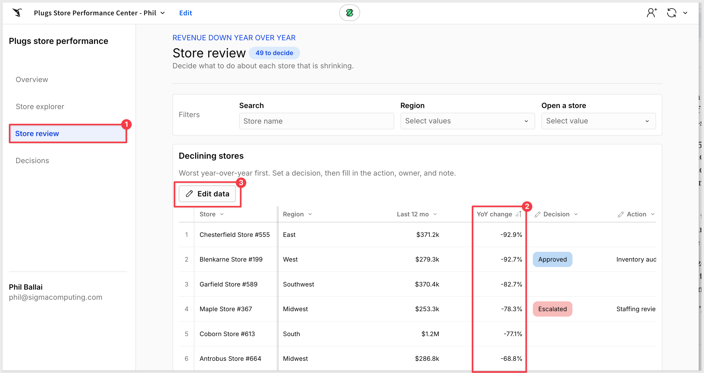

The `Edit data` button allows specific values to be set.

<video src="assets/writeback.mp4"></video>

**WHY IT MATTERS**<br>
Input tables write to your own warehouse, governed by the same permissions as the rest of Sigma. The decision log records who changed what and when, so the app has an audit trail on day one.


<!-- END OF SECTION-->

## Store performance analyst chat element
Duration: 8

Let's enrich the workbook's AI features by adding a `Store performance analyst` chat element to every page.

```copy-code
Keep working in the same workbook. Add a Sigma agent:
- A header strip on every visible page with a button labeled "Ask the analyst" that opens a popover containing a chat element.
- Name the agent "Store performance analyst". Give it the base table and the review queue as sources.
- Instructions: answer questions about Plugs sales, stores, and the review queue from the attached data only, in two or three sentences, naming the number that decides it. Say plainly when the data doesn't answer. It can read the data but can't change the workbook or the data.

Screenshot the Overview when done.
```

**WHAT YOU SHOULD SEE**<br>
An `Ask the analyst` button at the top right of every page opens a chat.

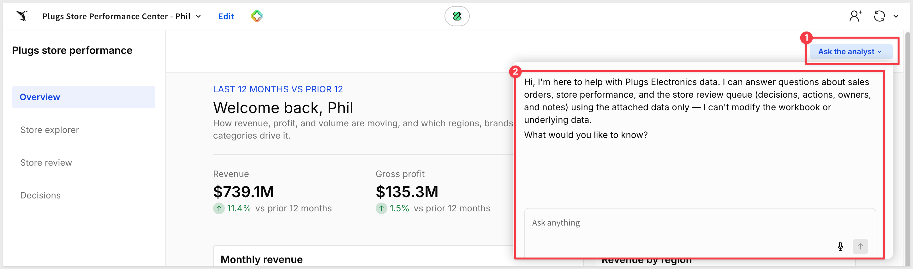

**WHY IT MATTERS**<br>
The agent answers from the same governed data as your charts, including decisions made in the queue a minute ago.


<!-- END OF SECTION-->

## Test it, share it, make it yours
Duration: 7

### Use your app

On `Store review`, pick a store in `Open a store`, type a note, and click `Approve`. Watch the decision update and the count drop.

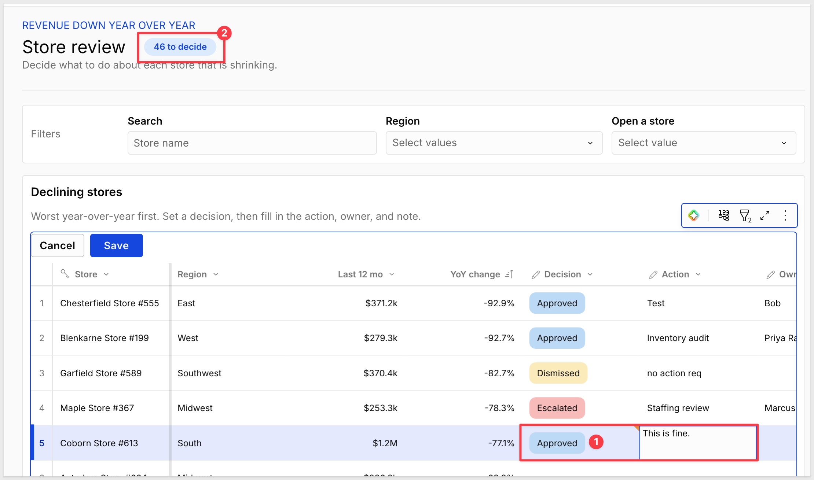

Save the change.

Click `Ask the analyst` and try:

- Which region has the most stores in the review queue?
- What was Blenkarne Store #199's revenue over the last 12 months, and how does it compare to the year before?
- Which product type grew fastest year over year?

Use the `double-arrow` icon to expand the chat element:

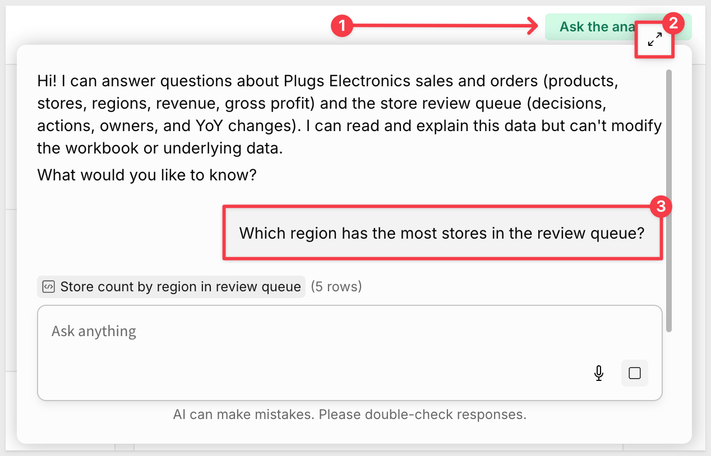

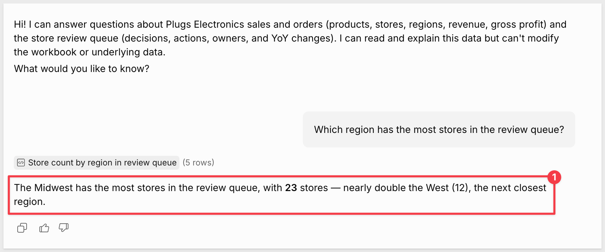

Click the `double-arrow` icon to restore the workbook again.

Share the workbook with your neighbor and have them make a decision.

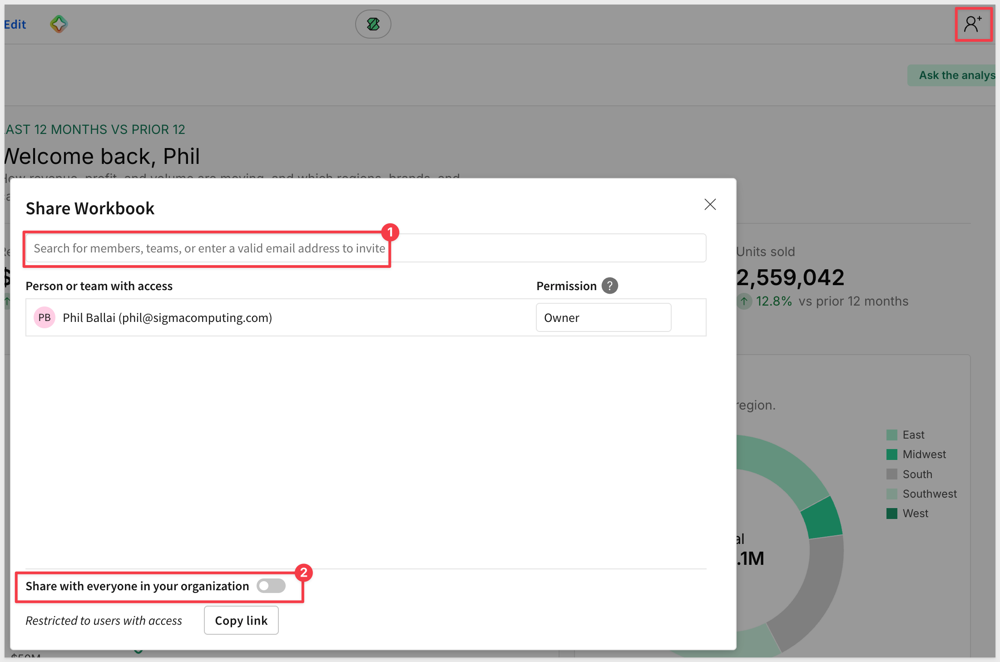

### Make it yours

Go back to Claude and ask for a change in your own words. Here are some ideas for you to choose from:

- Switch the workbook theme to emerald.
- On the Overview, add a KPI that counts stores down year over year.
- Add a Margin column to the review queue.
- On Store explorer, add a bar chart of last-12-month revenue by Product Type that responds to the filters.
- Rename the Overview title to greet the viewer and name their region.

For example, here is the workbook in emerald, adjusted using the first idea in the list above.

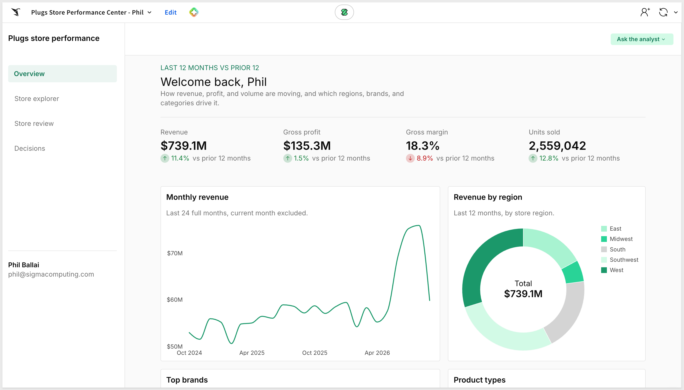

### If you fall behind

Your facilitator will share a checkpoint workbook. Duplicate it, copy the copy's URL, and paste this into Claude before the next prompt:

```copy-code
I'm continuing a lab from this workbook: {WORKBOOK URL}. Start a Sigma session, work only in this workbook from now on, and don't create a new one. Confirm the pages it has, then wait for my next instruction.
```


<!-- END OF SECTION-->

## Conclusion and next steps
Duration: 5

You built a four-page app on live warehouse data by describing it: dashboards, a store explorer, a review queue with writeback and an audit log, and a Sigma agent. The same approach works on your own data today.

### Take it further

Pick one process on your team that lives in a spreadsheet and an email thread, such as approvals, exceptions, or follow-ups, and describe it to Claude the way these prompts describe the store review.

Ask your Sigma team for a follow-up session to build it on your own data.

### Resources

Sigma documentation: [help.sigmacomputing.com](https://help.sigmacomputing.com)<br>
Sigma agents: [help.sigmacomputing.com/docs/build-agents](https://help.sigmacomputing.com/docs/build-agents)

**Additional Resource Links**

[Blog](https://www.sigmacomputing.com/blog/)<br>
[Community](https://community.sigmacomputing.com/)<br>
[Help Center](https://help.sigmacomputing.com/hc/en-us)<br>
[QuickStarts](https://quickstarts.sigmacomputing.com/)<br>

Be sure to check out all the latest developments at [Sigma's First Friday Feature page!](https://quickstarts.sigmacomputing.com/firstfridayfeatures/)
<br>

[](https://twitter.com/sigmacomputing)&emsp;
[](https://www.linkedin.com/company/sigmacomputing)&emsp;
[](https://www.facebook.com/sigmacomputing)


<!-- END OF WHAT WE COVERED -->
<!-- END OF QUICKSTART -->
