author: pballai
id: events-hol_build_app_with_sigma_assistant
summary: Build a four-page store performance app with Sigma Assistant, from dashboards to a writeback review queue and a Sigma agent.
categories: eventhols
environments: web
status: Hidden
feedback link: https://github.com/sigmacomputing/sigmaquickstarts/issues
tags: eventhols
lastUpdated: 2026-10-07

# Build an AI app with Sigma Assistant

## Overview
Duration: 5

SIGMA LIVE 2026 · HANDS-ON LAB

In this lab you'll build a working store performance app for Plugs Electronics, a fictional retailer with 200 stores. You won't click through menus. You'll describe what you want to Sigma Assistant, and Assistant will build it for you in `Build` mode, directly in your workbook, on live data in the warehouse.

<aside class="positive">
<strong>IMPORTANT:</strong><br> Some screens in Sigma may appear slightly different from those shown in QuickStarts. This is because Sigma continuously adds and enhances functionality. Rest assured, Sigma's intuitive interface ensures that any differences will not prevent you from successfully completing any QuickStart.
</aside>

### Who this lab is for
Anyone who builds or plans dashboards and apps in Sigma. No coding needed. If you can describe a dashboard to a colleague, you can do this lab.

### What you'll learn
- How Assistant finds data, checks it, and builds on it, all inside your workbook
- How to write a prompt that gets a reliable build: name the decisions, not just the goal
- How an app goes beyond a dashboard: input tables, a decision drawer, and an audit log that write back to the warehouse
- How to add a Sigma agent that answers questions from your app's live data

### Prerequisites

<ul>
  <li>A Sigma login for the lab org. A link will be provided after registration.</li>
  <li>Access to a Sigma environment where Assistant is enabled for building.</li>
  <li>An AI provider configured by your administrator. See <a href="https://help.sigmacomputing.com/docs/configure-ai-features-for-your-organization#set-up-an-ai-provider">Set up an AI provider</a>.</li>
  <li>The <strong>Use Assistant</strong> and <strong>Create, edit, and publish workbooks</strong> permissions on your account type.</li>
</ul>

### How this lab works

- Paste each prompt into Assistant exactly as written, then wait. Builds take 3 to 10 minutes.
- Don't edit the workbook while Assistant is building. Watch it work, but wait for Assistant to say it's done before you change anything.
- Assistant may ask you questions or switch modes during a build. Answer only when it stops and asks you something.
- If you fall behind, raise your hand. Your facilitator will get you onto a checkpoint so you can keep going.

### If you fall behind

Your facilitator will share a checkpoint workbook. Duplicate it, open your copy, and open Assistant in it. Assistant works in the workbook you have open, so you can send the next prompt right away.

For more information on Sigma's product release strategy, see [Sigma product releases](https://help.sigmacomputing.com/docs/sigma-product-releases)


<!-- END OF SECTION-->

## Get started with Sigma Assistant
Duration: 5

Before we start, let's sign in to Sigma and find Assistant.

### Part 1: Sign in to the lab org

**1. Open the lab link**<br>
Open the link provided after registration. Sign in to the Sigma lab instance by entering the following and clicking `Continue`.

```copy-code
sigma-live-november-2026-nyc
```

Use the credentials supplied by your facilitator.

### Part 2: Create a workbook and open Assistant

**1. Create a workbook**<br>
From the Sigma home page, select `Create New` > `Workbook`.

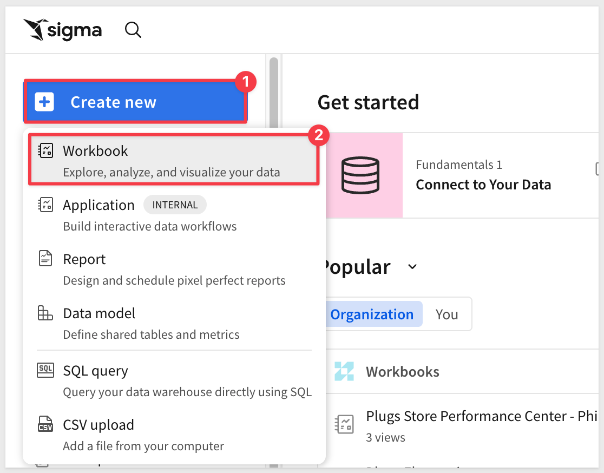

**2. Open Assistant**<br>
A new blank page offers a prompt in the center of the page. You can also open Assistant from the `Assistant panel` icon in the workbook header, or with the `⌘ + K` (macOS) or `Ctrl + K` (Windows) keyboard shortcut.

Assistant has two modes when editing a workbook.

- `Plan` mode proposes an approach and builds nothing until you approve it.
- `Build` mode creates and changes workbook content.

Use the mode picker in the prompt bar to switch between them.

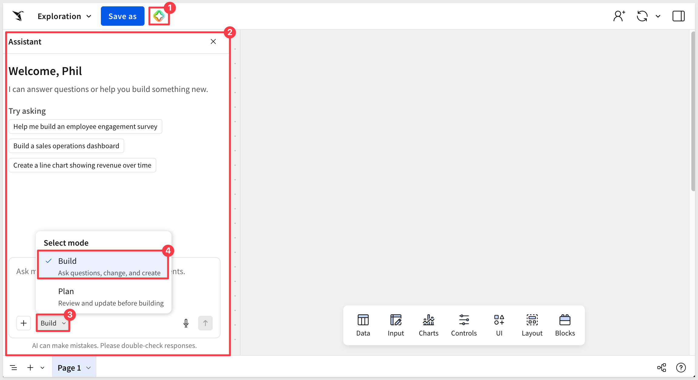

### Test it

Make sure Assistant is in `Build` mode and make a simple request.

```copy-code
Build a workbook from the table PLUGS_ELECTRONICS_HANDS_ON_LAB_DATA in the RETAIL schema of the Sigma Sample Database connection, with a KPI for total revenue and a chart of revenue by month.
```

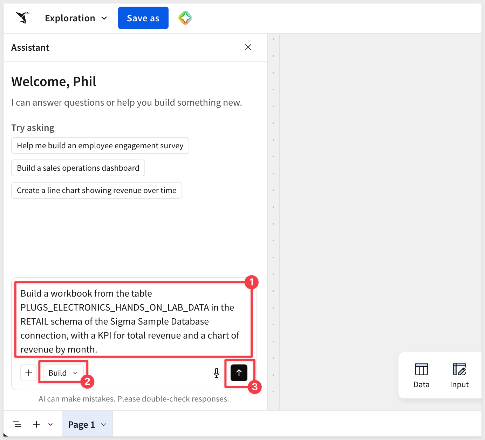

Assistant may pause and confirm that the table it selected is the correct one:

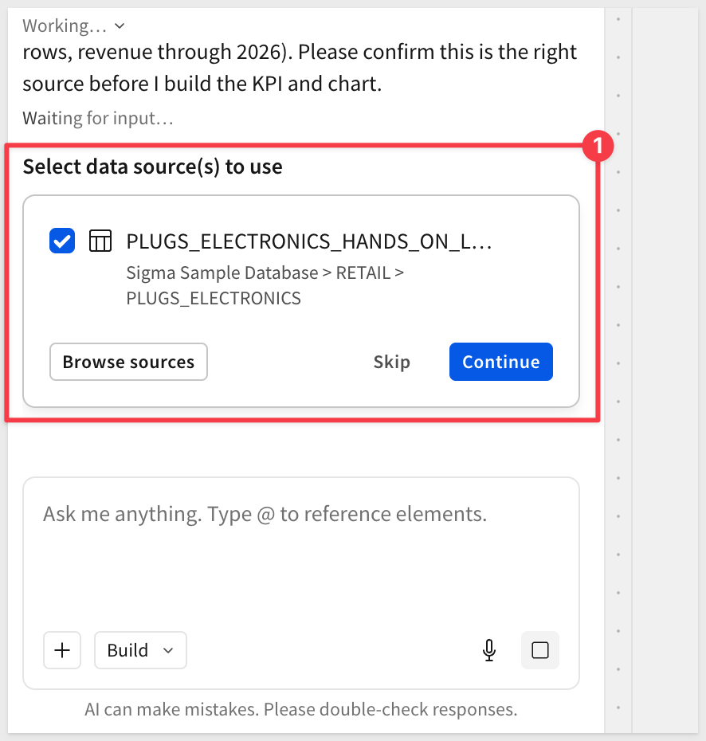

Click `Continue`.

Assistant reads the table, builds the KPI and chart on the page, and, when done, summarizes what it created.

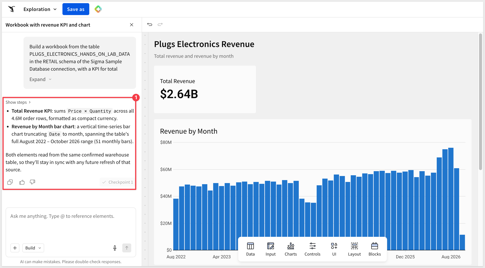

There is no need to save this workbook.

### Troubleshooting

| Issue | What to try |
| --- | --- |
| The build stops with an error | Read the message in the Assistant panel, then reply in plain language with what you'd like it to try instead. |
| Assistant responds but doesn't change the workbook | Check the mode picker. `Plan` mode proposes an approach but does not build. Switch to `Build`. |
| Assistant can't find your data | Confirm your Sigma account has access to the connection or data model you're asking about. |
| Assistant isn't available in the workbook | Confirm Assistant is enabled for building in your org and that your account type has the Use Assistant permission. |

### Need help?

Contact your Sigma Customer Success Manager or Sigma Support.


<!-- END OF SECTION-->

## Connect and discover
Duration: 5

Next, let's build something more involved.

Click the 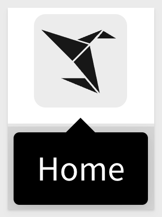 icon in the upper left corner to return to the homepage.

Create a new workbook and set the mode to `Plan`, so nothing is built while we look at the data, and ask the following.

```copy-code
Find the table PLUGS_ELECTRONICS_HANDS_ON_LAB_DATA in the RETAIL schema of the Sigma Sample Database connection. There is a second copy in an EXAMPLES schema, so use the RETAIL one.

Describe its columns, then run a query that returns: total rows, the number of distinct stores and regions, the earliest and latest order date, and total revenue (Price times Quantity).

Don't build anything yet. Summarize what the data covers in three sentences.
```

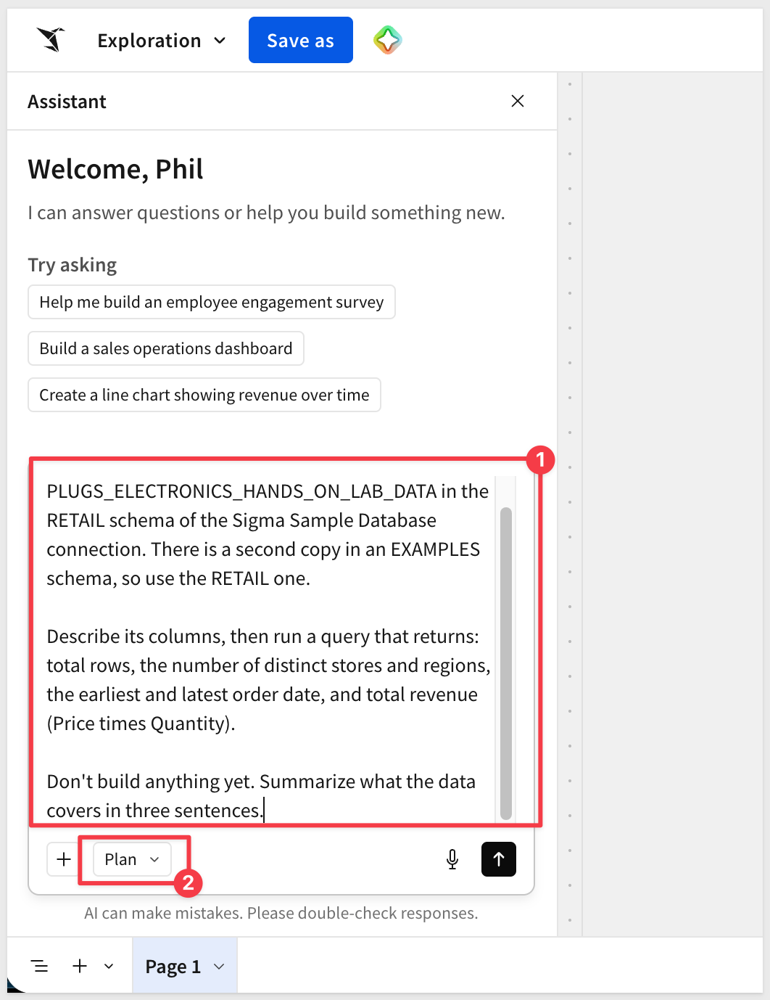

**WHAT YOU SHOULD SEE**<br>
About 4.6 million rows, 200 stores, 5 regions, and relevant details.

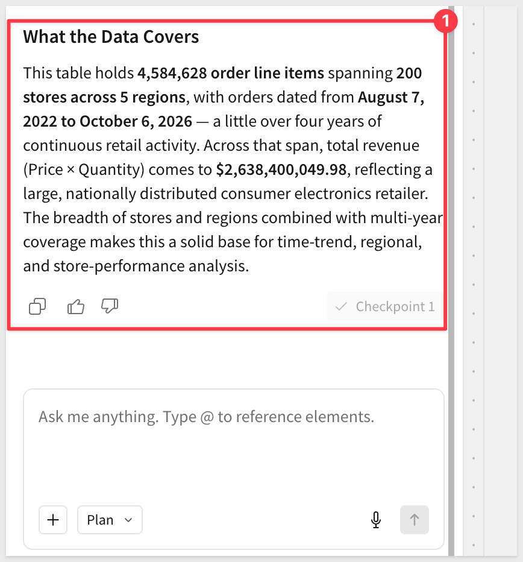

**WHY IT MATTERS:**<br>
Assistant works with your identity and permissions, so it can only see what you can see in Sigma. Every query runs live in the warehouse. No data is copied out of Sigma.

Leave this workbook open.


<!-- END OF SECTION-->

## Overview dashboard
Duration: 12

Now that we are comfortable we have identified the right source table, we can build the dashboard.

Click the `Save as` button and name the workbook, replacing **{YOUR_FIRST_NAME}** with your own.

```copy-code
Plugs Store Performance Center - {YOUR_FIRST_NAME}
```

Make sure Assistant is in `Build` mode and send the next prompt.

```copy-code
Build the Plugs store performance app in this workbook, on the RETAIL table you just described. Don't ask me clarifying questions. Use these decisions:

Structure
- Pages: Overview, Store explorer, Store review, Decisions, and a hidden Data page that holds the base table.
- A sidebar rail on every visible page with the lockup "Plugs store performance" and vertical navigation to the four pages. Hide page tabs in view mode.

Calculated columns on the base table
- Revenue = [Price] * [Quantity]
- Gross profit = ([Price] - [Cost]) * [Quantity]
- Period: "Last 12 months" for the 12 complete calendar months before the current month, "Prior 12 months" for the 12 months before that, and "Current month" or "Earlier" for everything else. Compute it relative to today, with no hardcoded dates.

Overview page
- A title that greets the viewer by first name.
- Four KPIs comparing Last 12 months to Prior 12 months: Revenue, Gross profit, Gross margin, and Units sold (sum of Quantity).
- A line chart of monthly revenue over the last 24 complete calendar months, excluding the current month, beside a donut of last-12-month revenue by Store Region.
- A horizontal bar chart of the top 10 brands by last-12-month revenue, with axis labels instead of data labels, beside a grouped table, not the raw source table, with one row per Product Type and exactly three calculated columns: Last 12 mo revenue, Prior 12 mo revenue, and YoY change (last divided by prior, minus 1) colored green when positive and red when negative. Sort it by YoY change, highest first.

Leave the other three pages with only a title for now. When it's built, tell me the four KPI values.
```

<aside class="positive">
<strong>TIP:</strong><br> In practice, for a build this size, you might want to switch to `Plan` mode first and send the same prompt. Assistant proposes pages, elements, and layout, and builds nothing until you approve. Planning up front also saves AI credits, because Assistant builds the right thing once.
</aside>

**WHAT YOU SHOULD SEE**<br>
Assistant starts building and elements start to appear in the workbook panel.

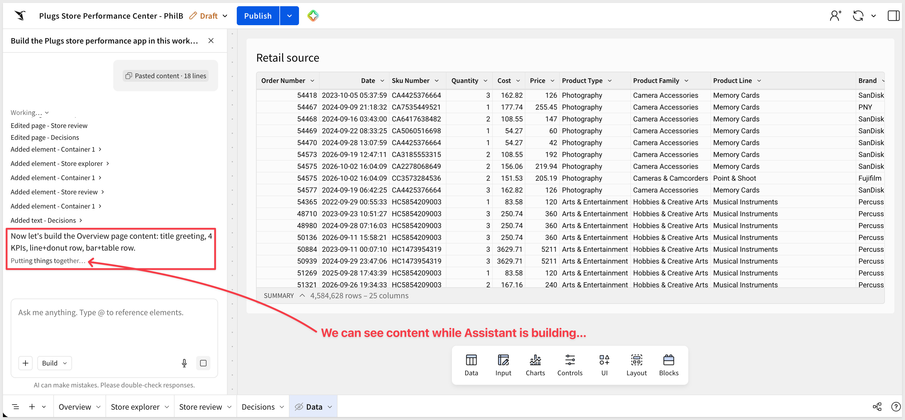

When done, select the `Overview` page. It shows a personalized greeting, four KPIs comparing the last 12 months to the prior 12 months, a monthly revenue trend, revenue by region, top brands, and a table of product type performance.

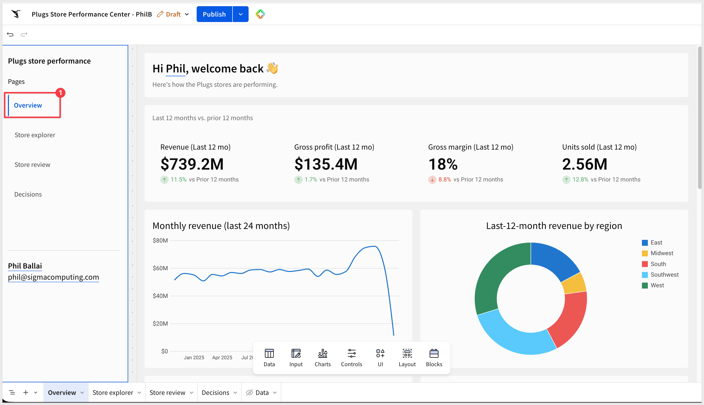

**WHY IT MATTERS:**<br>
The prompt defines "last 12 months" relative to today. The workbook stays current as data arrives, with no hardcoded dates and no one maintaining it.

There are also three links in the left sidebar for `Store explorer`, `Store review`, and `Decisions`. We will build those out next.


<!-- END OF SECTION-->

## Store explorer
Duration: 10

Moving faster now, here is the prompt to build the `Store explorer` page.

```copy-code
Keep working in this workbook. Build the Store explorer page:
- A filter toolbar with a Search box (Store Name, contains), a Region list, and a Product type list. These filters apply to this page only, not the Overview.
- A point map using Store Latitude and Store Longitude, with points sized and shaded by last-12-month revenue. No point labels.
- A table with one row per store (Store Name, Store Region, Store City) showing Last 12 mo revenue, Prior 12 mo revenue, YoY change, and Margin. Sort by YoY change, worst first. Color YoY change red when negative and green when positive.
```

When Assistant is done, open the `Store explorer` page from the sidebar.

**WHAT YOU SHOULD SEE**<br>
Search and filters, a map of every store sized by revenue, and a table of stores with the steepest declines at the top.

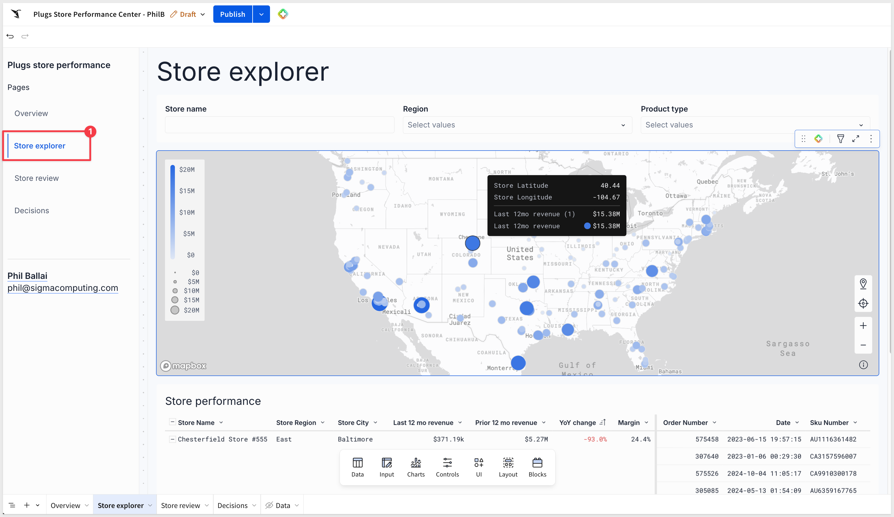

**WHY IT MATTERS:**<br>
Try the filters. Each change is a new query against the full 4.6 million rows in the warehouse, not a sample or an extract.


<!-- END OF SECTION-->

## Review queue with writeback
Duration: 20

This is where the dashboard becomes an app.

Stores with declining revenue are collected in a review queue, where managers assign an owner and an action, then approve, escalate, or dismiss each one.

Every decision is written back to the warehouse, so it is saved for everyone who uses the app.

Here is the prompt to build the `Store review` and `Decisions` pages.

```copy-code
Keep working in this workbook. Turn Store review into a review queue app that writes back to the warehouse. Put all input tables on the Sigma Sample Database connection. Don't ask me clarifying questions.

The queue
- On the Data page, a table with one row per store (Store Name and Store Region) and three calculations: Last 12 mo revenue, Prior 12 mo revenue, and Revenue YoY (last divided by prior, minus 1). Filter it to stores where Revenue YoY is below zero, excluding blanks.
- On Store review, a linked input table over that table, keyed on Store Name (shown as "Store"). Show Region, Last 12 mo, and YoY change, plus editable columns: Decision (single select: Approved, Dismissed, Escalated), Action (text), Owner (text), and Note (text). Sort by YoY change, worst first. Anyone the workbook is shared with can edit.
- A chip beside the page title that counts stores with no Decision, like "52 to decide".
- A toolbar with a Search box on Store, a Region list, and an "Open a store" picker.

The decision flow
- Picking a store in "Open a store" opens a drawer titled "Decide on this store". It shows the store name, last-12-month revenue, YoY change, Owner, and Action, plus a Note text area and three buttons: Approve, Escalate, and Dismiss.
- Each button sets that store's Decision, adds a row to the decision log with the store, decision, and note, refreshes the queue, and closes the drawer.

The Decisions page
- An empty input table named "Decision log" with Store, Decision (same three options), and Note, plus created at and created by system columns.
- A KPI strip under it counting Approved, Escalated, and Dismissed.

Seed data
- In the queue, set Blenkarne Store #199 to Approved (Action "Inventory audit", Owner "Priya Raman") and Maple Store #367 to Escalated (Action "Staffing review", Owner "Marcus Lee"). If either store isn't in the queue, use the two worst-declining stores instead.
- Add matching rows to the Decision log.
```

During the build, Assistant will ask which connection to use for the `Decision log` input table. Select the `Sigma Sample Database` connection and allow the build to proceed.

When done, close Assistant, `Publish` the workbook and `Go to published` version so we can review the work.

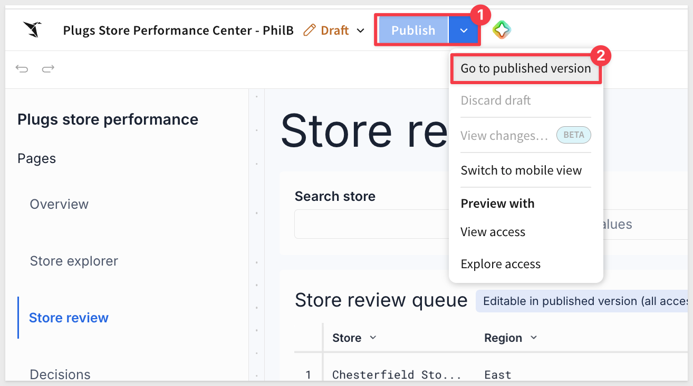

**WHAT YOU SHOULD SEE**<br>
Store review shows about 50 declining stores, worst first, with a count of how many still need a decision.

The `Edit data` button allows specific values to be set.

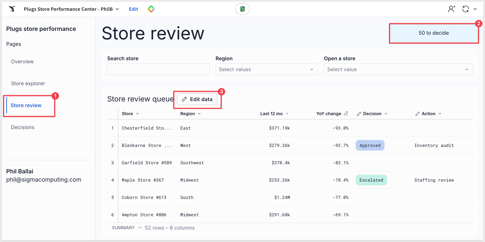

Select the `Decisions` page. The `Decision log` holds the two seeded decisions, with who made each one and when, and a KPI strip beneath it counts the decisions by type. With the seed data, that is one `Approved`, one `Escalated`, and no `Dismissed`.

We can also `Edit` records.

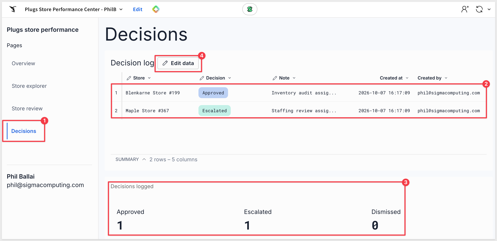

**WHY IT MATTERS:**<br>
Input tables write to your own warehouse, governed by the same permissions as the rest of Sigma. The decision log records who changed what and when, so the app has an audit trail on day one.


<!-- END OF SECTION-->

## Store performance analyst chat element
Duration: 8

Let's enrich the workbook's AI features by adding a `Store performance analyst` chat element to every page.

Click the `Edit` link, reopen Assistant and ask:

```copy-code
Keep working in this workbook. Add a Sigma agent:
- A header strip on every visible page with a button labeled "Ask the analyst" that opens a popover containing a chat element.
- Name the agent "Store performance analyst". Give it the base table and the review queue as sources.
- Instructions: answer questions about Plugs sales, stores, and the review queue from the attached data only, in two or three sentences, naming the number that decides it. Say plainly when the data doesn't answer. It can read the data but can't change the workbook or the data.
```

**WHAT YOU SHOULD SEE**<br>
An `Ask the analyst` button at the top right of every page opens a chat.

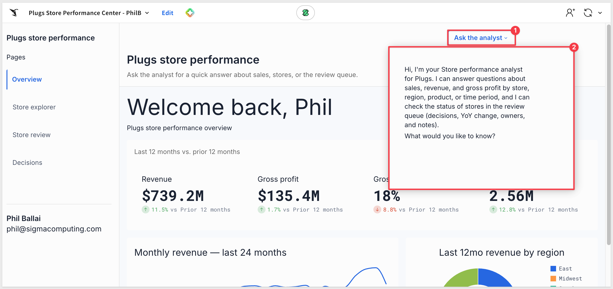

**WHY IT MATTERS:**<br>
The agent answers from the same governed data as your charts, including decisions made in the queue a minute ago.


<!-- END OF SECTION-->

## Test it, share it, make it yours
Duration: 7

### Use your app

On `Store review`, pick a store in `Open a store`, type a note, and click `Approve`.

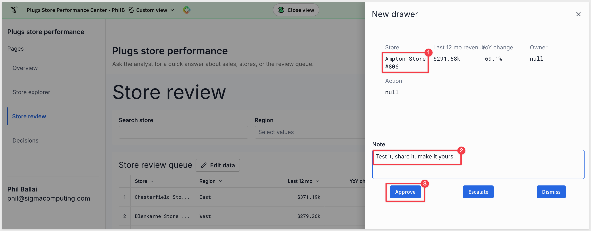

The decision counter updates to `49` remaining.

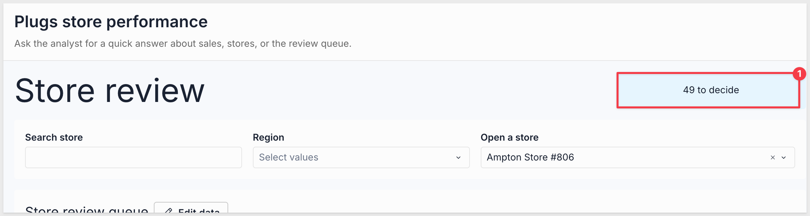

Click `Ask the analyst` and try one of the following:

- Which region has the most stores in the review queue?
- What was Blenkarne Store #199's revenue over the last 12 months, and how does it compare to the year before?
- Which product type grew fastest year over year?

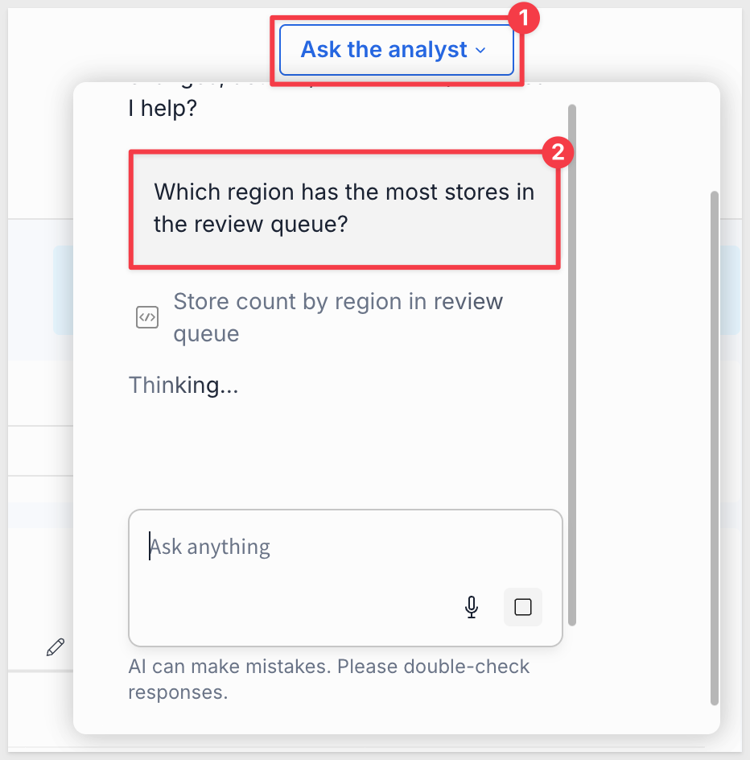

Use the `double-arrow` icon to expand the chat element to full page.

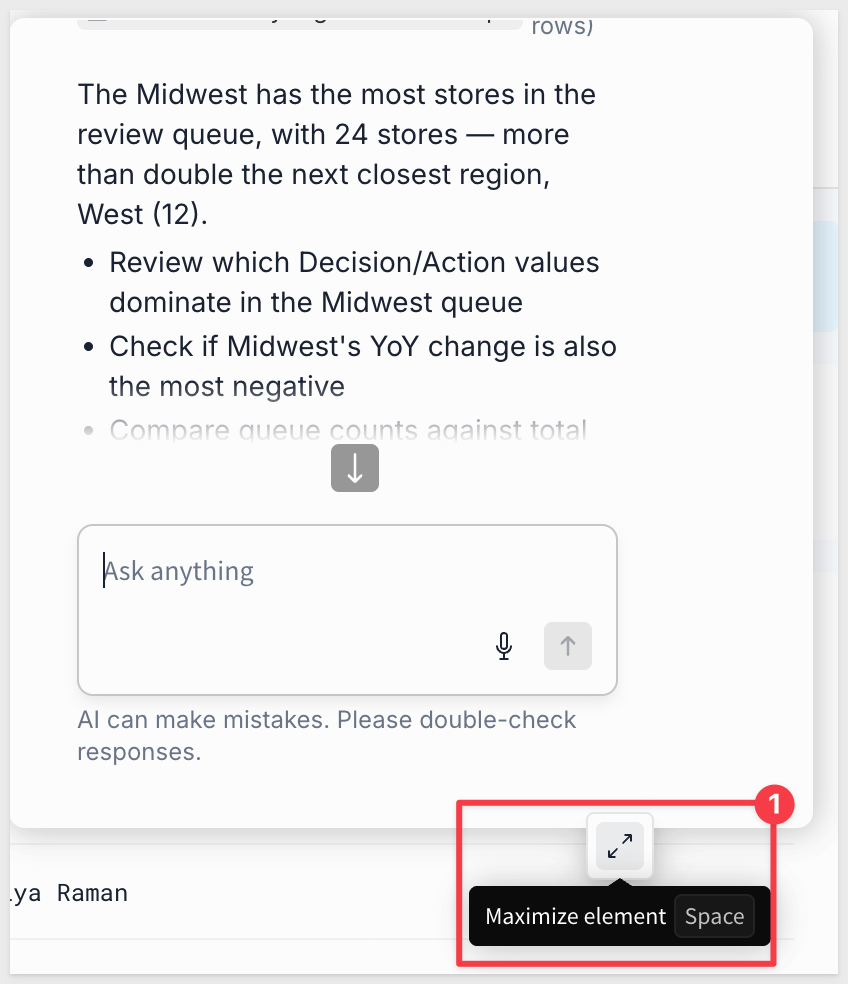

Click the `double-arrow` icon to restore the workbook again.

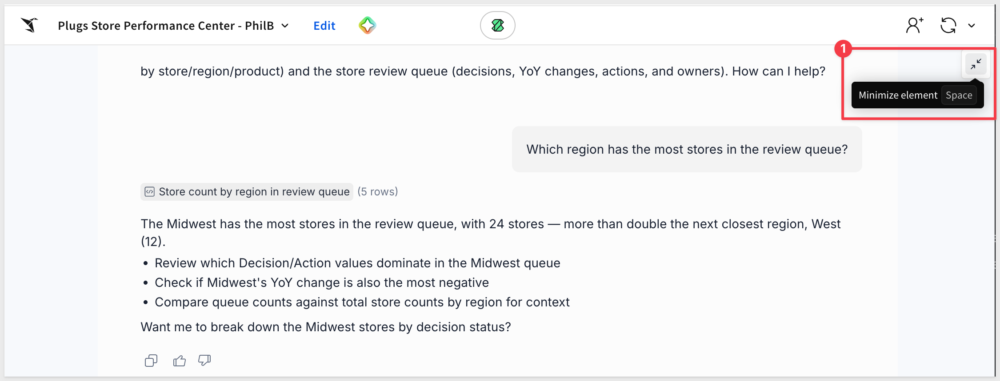

Make sure to `Publish` the workbook so that content shared is the latest version.

Share the workbook with your neighbor and have them make a decision.

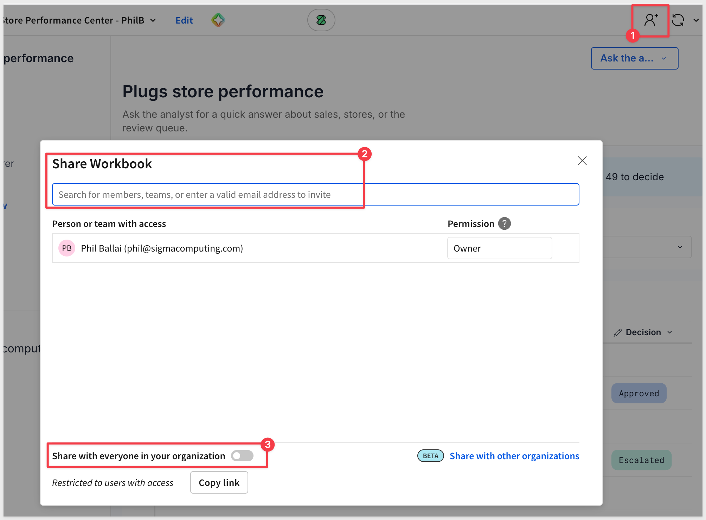

### Make it yours

Open Assistant (with workbook in `Edit` mode) and ask for a change in your own words.

We can also change a single element by selecting it and using the `Ask or edit with prompt` icon on its toolbar.

For example, we can target a request to just the title element.

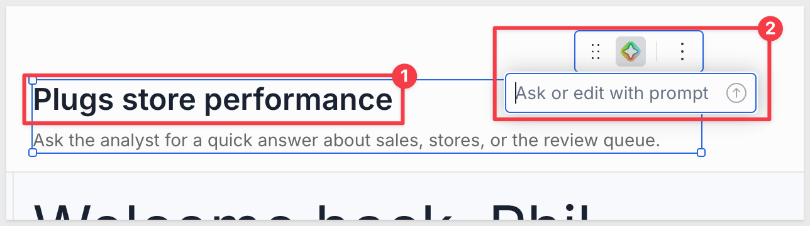

Here are some ideas for you to choose from:

- Switch the workbook theme to emerald.
- On the Overview, add a KPI that counts stores down year over year.
- Add a Margin column to the review queue.
- On Store explorer, add a bar chart of last-12-month revenue by Product Type that responds to the filters.
- Rename the Overview title to greet the viewer and name their region.

For example, we asked the workbook Assistant to change the theme to emerald.

Assistant determined that there is no emerald theme, but it still made the changes.

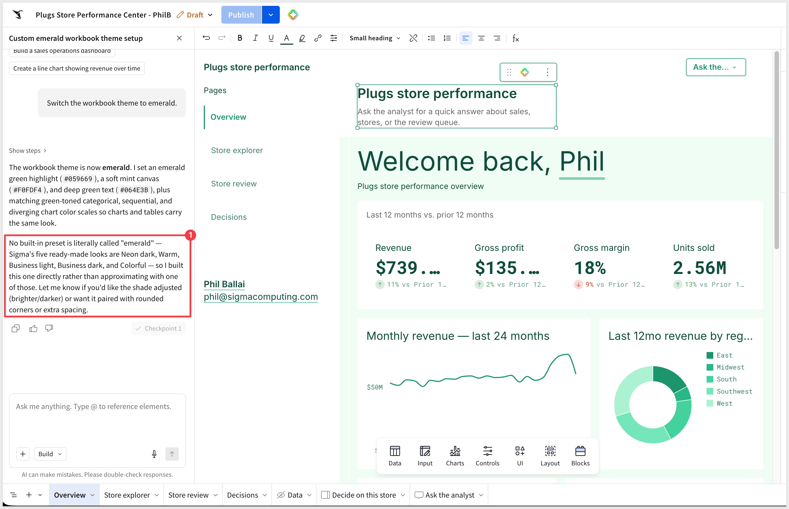


<!-- END OF SECTION-->

## Conclusion and next steps
Duration: 5

You built a four-page app on live warehouse data by describing it: dashboards, a store explorer, a review queue with writeback and an audit log, and a Sigma agent. The same approach works on your own data today.

### Take it further

Pick one process on your team that lives in a spreadsheet and an email thread, such as approvals, exceptions, or follow-ups, and describe it to Assistant the way these prompts describe the store review.

Ask your Sigma team for a follow-up session to build it on your own data.

### Resources

[Sigma documentation](https://help.sigmacomputing.com)<br>
[QuickStarts](https://quickstarts.sigmacomputing.com/)<br>
[Use Sigma Assistant to build dashboards and apps](https://help.sigmacomputing.com/docs/use-ai-to-build-dashboards-and-apps)<br>
[Sigma agents](https://help.sigmacomputing.com/docs/build-agents)

**Additional Resource Links**

[Blog](https://www.sigmacomputing.com/blog/)<br>
[Community](https://community.sigmacomputing.com/)<br>
[Help Center](https://help.sigmacomputing.com/hc/en-us)<br>

Be sure to check out all the latest developments at [Sigma's First Friday Feature page!](https://quickstarts.sigmacomputing.com/firstfridayfeatures/)
<br>

[](https://twitter.com/sigmacomputing)&emsp;
[](https://www.linkedin.com/company/sigmacomputing)&emsp;
[](https://www.facebook.com/sigmacomputing)


<!-- END OF WHAT WE COVERED -->
<!-- END OF QUICKSTART -->
