author: pballai
id: common_date_functions
summary: Common Date Functions
categories: functions
environments: web
status: Published
feedback link: https://github.com/sigmacomputing/sigmaquickstarts/issues
tags: default
lastUpdated: 2025-11-26

# Common Date Functions

## Overview 
Duration: 5 

This QuickStart presents common challenges when working with dates. Sigma can be used to manipulate dates to get the desired results, quickly and easily.

There are many ways to work with dates in Sigma. Not every solution is covered and you may even find a better method. Suggestions and feedback are always appreciated.

This QuickStart assumes you have a working instance of Sigma and the connection called Sigma Sample Database.

We will use the Sigma-provided `RETAIL`.`PLUGS_ELECTRONICS`.`PLUGS_ELECTRONICS_HANDS_ON_LAB_DATA` table so you can follow along and recreate each step in your own Sigma environment.

### Target Audience
Sigma builders looking for solutions to date challenges or who just want to learn new date methods.

### Prerequisites

<ul>
  <li>Any modern browser is acceptable.</li>
  <li>Access to your Sigma environment.</li>
  <li>Some familiarity with Sigma is assumed. Not all steps are shown, as basic Sigma functionality is assumed.</li>
</ul>

<aside class="positive">
<strong>IMPORTANT:</strong><br> Sigma recommends using non-production resources when completing QuickStarts.
</aside>

<button>[Sigma Free Trial](https://www.sigmacomputing.com/free-trial/)</button><br>

<aside class="negative">
<strong>IMPORTANT:</strong><br> Some features may carry a "Beta" tag. Beta features are subject to quick, iterative changes. As a result, the latest product version may differ from the contents of this document.
</aside>
  

<!-- END OF OVERVIEW -->

## Basic Formatting
Duration: 10

Before we dig in, let's first create a `Data` page so that we can use the same table data several times, but only query the warehouse one time. 

Log into Sigma, click `Create new` and select `Workbook`.

From the `Element bar`, under the `Data` group, place a new `Table` on the page.

In the `Select source` modal, search for `Hands` and select the `PLUGS_ELECTRONICS_HANDS_ON_LAB_DATA` table from the `RETAIL` database:


Rename the page to `Data`.

Save the workbook as `Common_Date_Functions_QuickStart`.

### Basic formatting
We’re primarily interested in the `Date` column, which is coming in 'as-is' from the warehouse:


Click on the `Date` column down arrow and select `Truncate date`. This is one way to modify how the `Date` column is displayed.


If you select the `Day` option, you'll see the column name changes to `Day of Date`.

Reset the `Date` column back to the default. You can use `Remove date truncate` from the column's menu but the `Undo` icon is faster:

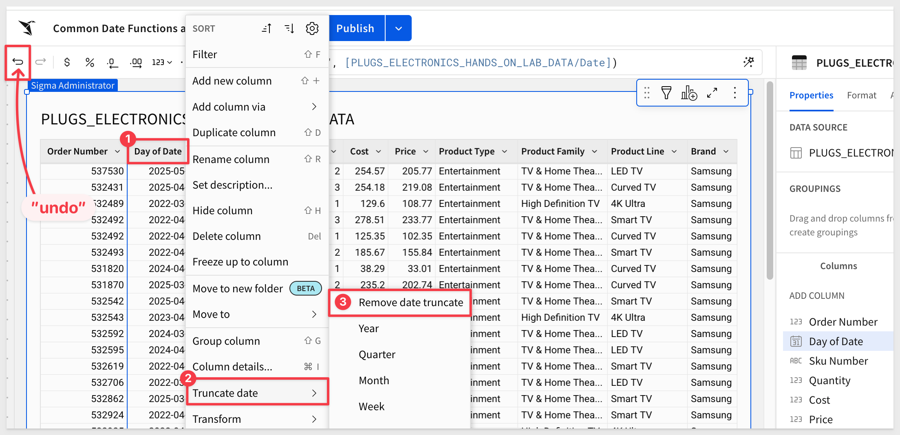

Click on the `Date` column down arrow and select `Format date`. This is another way to change how the `Date` column is displayed:

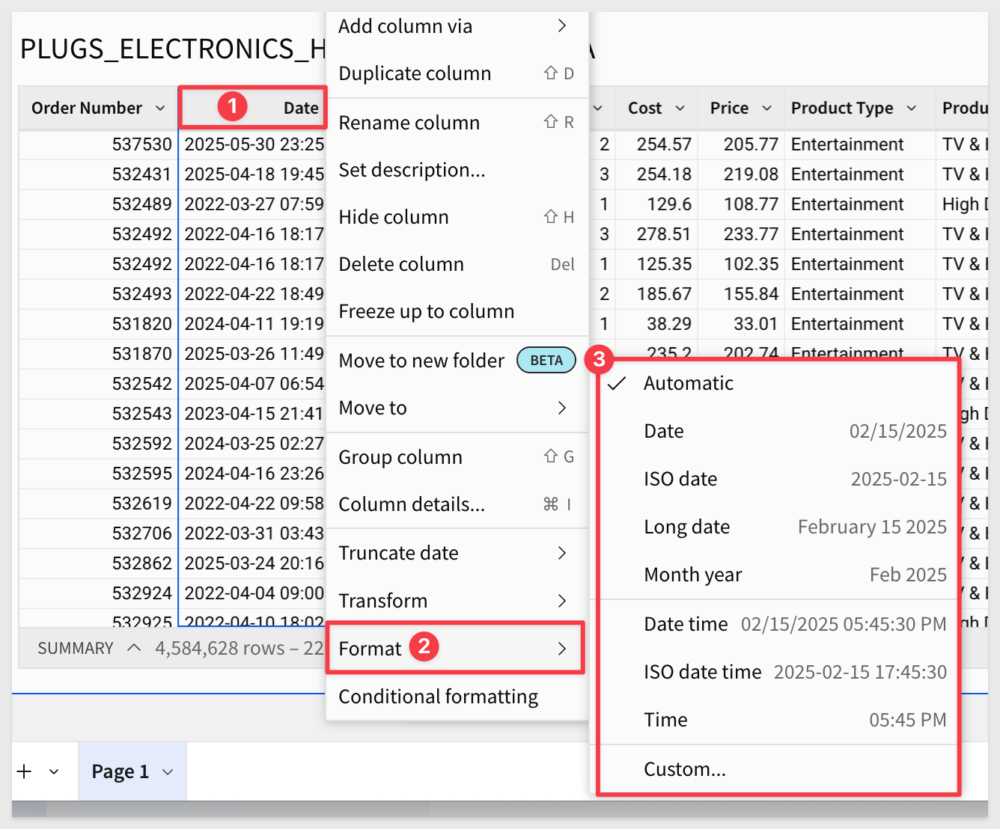

Feel free to experiment with the available options, resetting to the original when done.


<!-- END OF SECTION-->

## Custom Formatting
Duration: 10

Let's create a page for this section so that you can easily reference the material later.

Create a new page and rename it `Custom Formatting` and add another table from `Element bar` > `Data`, this time selecting the `PLUGS_ELECTRONICS_HANDS_ON_LAB_DATA` from the `Data` page:

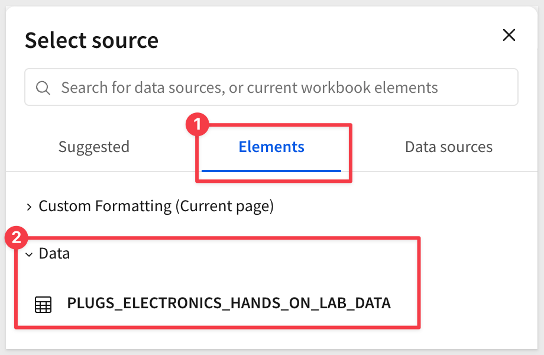

<aside class="positive">
<strong>IMPORTANT:</strong><br> Child tables let us manipulate source data without modifying the original table. Another major benefit is that data is only fetched from the warehouse once, saving time and warehouse costs too.
</aside>

Rename the table to `Custom_Date_Formats`.

We can also hide all the columns except for `Date` just to make things easier to see.

We will create more child tables as we go through more sections later.

### Custom date formats
Sigma supports applying custom formats to date columns. You can do this by selecting the `Date` column menu and then `Format` > `Custom`:

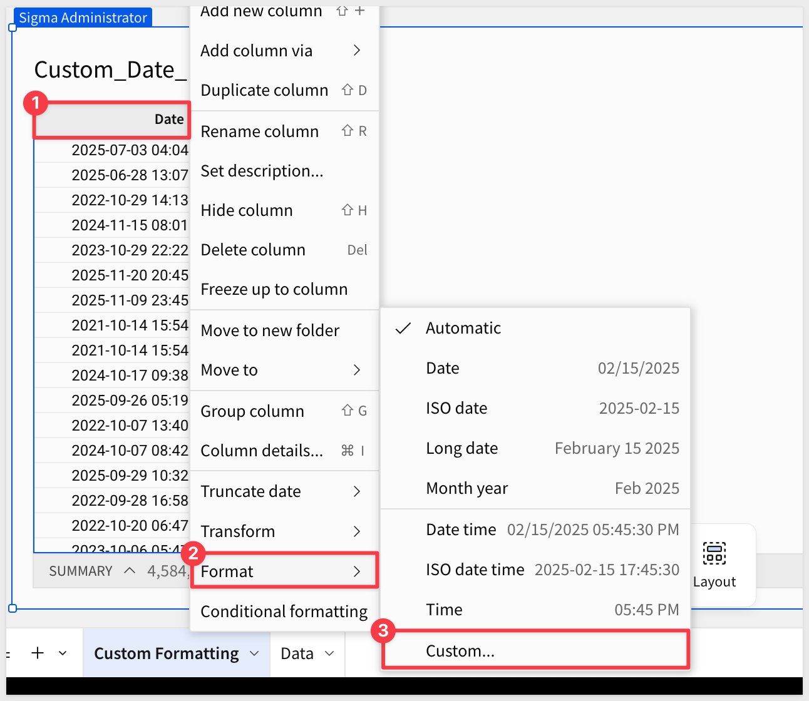

Entering the format string below will show a sample output in the popup:
```code
%a %B %d %Y
```


This helps confirm your format string is correct before applying it.

Feel free to experiment, then reset the `Date` column back to the default when done.

### The formula bar 
Another way to apply custom date formatting is by using the formula bar and the `DateFormat` function.

For example, you may want to get the full month name from a date column.

Rename the `Date` column to `Original_Date`.

Create a new column by using the `Date` column's menu and selecting `Add new column`. 

Rename the new column `Month_of_Date`.

Click the `Month_of_Date` column, copy/paste this formula into the formula bar and press enter.
```code
DateFormat(Date([Original_Date]), "%B")
```

This demonstrates how to use the formula bar to apply both a function (DateFormat) and a custom format string:

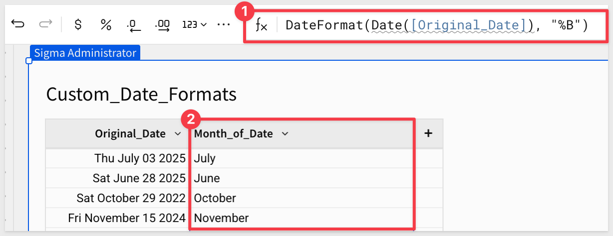

Here are a few other examples created by adjusting the value after the percent in the formula:


For more information, see [Custom format strings](https://help.sigmacomputing.com/docs/define-custom-datetime-formats#custom-format-strings)

Click `Publish`.


<!-- END OF SECTION-->

## Current / Previous Weekday
Duration: 10

Now that we've covered the basics, let's apply what we've learned to a new use case.

For example, it's often useful for users to know the `Effective Business Day` an order was placed. If an order is placed on a Saturday or Sunday, this column will show Friday as the effective day, helping analysts align reporting with standard business operations.

We'll continue working with the `Custom_Date_Formats` table from the previous section.

First, let's see what day of the week each order was placed. Add a new column and rename it to `Order_Day_of_Week`.

Set the formula to:
```code
DateFormat([Original_Date], "%A")
```

<aside class="negative">
<strong>NOTE:</strong><br> The %A in the formula returns the full weekday name from the date.
</aside>

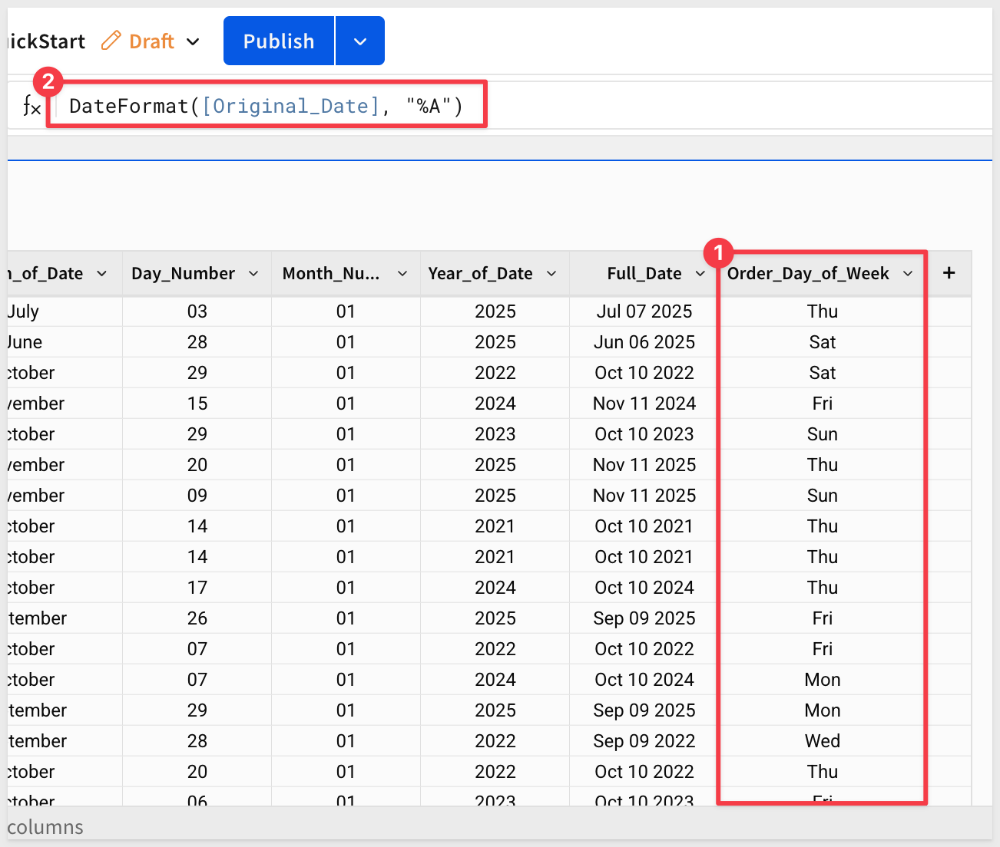

Now we can see which orders were placed on weekends. Let's create a column that shows the effective business day.

Add another new column and rename it to `Effective_Business_Day`.

Use the following formula:
```code
DateFormat(DateAdd("day", If(Weekday([Original_Date]) = 7, -1, Weekday([Original_Date]) = 1, -2, 0), [Original_Date]), "%A")
```

This formula evaluates the order date:
- If it's Saturday (7), it subtracts 1 day to show Friday
- If it's Sunday (1), it subtracts 2 days to show Friday
- Otherwise, it shows the actual order date (0 days difference)
- Then formats the result to display only the weekday name

The table now shows both the actual day the order was placed and the effective business day for reporting:

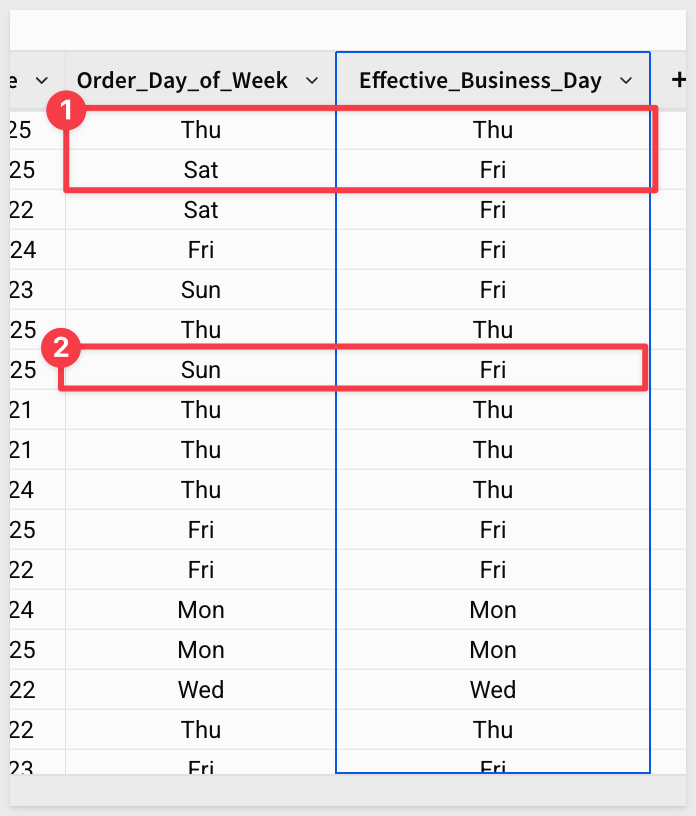

For more information, see [Define custom datetime formats](https://help.sigmacomputing.com/docs/define-custom-datetime-formats)

Click `Publish`.


<!-- END OF SECTION-->

## Time Between Dates
Duration: 10

It can be useful to measure the time elapsed between two dates (or timestamps). Some examples are:

**Call Center Support:** Call duration<br>
**Customer Service:** Order fulfillment time<br>
**Healthcare:** Time since last blood test<br>

Let's take a look at the customer service use case.

Marketing is interested in targeting customers who purchase frequently but only has a table with all orders to start with.

They want to answer a few key questions:
<ul>
        <li>When was a customer's first order?</li>
        <li>When was their second order?</li>
        <li>Number of days between the first and second order?</li>
        <li>How long since they last placed an order?</li>
        <li>Marketing will use this in campaigns targeting active and inactive customers.</li>
</ul>

Create a new page named `Time_Between_Dates`.

Place another child table of the `Data` > `PLUGS_ELECTRONICS_HANDS_ON_LAB_DATA` table onto the new page. 

Rename the child table `Time_Between_Dates`.

Since we don’t need most columns in the child table, we can delete them, leaving only the `Customer Name` and `Today` columns.

Using the `Element panel`, move the `Customer Name` and `Today` columns to the top of the list and then select all others and click `Delete 20 columns`:

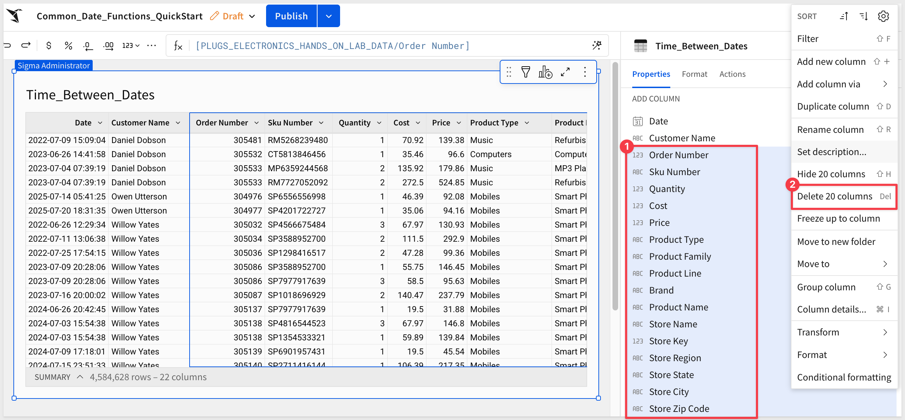

Drag the `Customer Name` column to `GROUP BY`.

<aside class="positive">
<strong>IMPORTANT:</strong><br> Our flat dataset contains customer orders, where a single order may include multiple items. To avoid counting the same order multiple times, we want to group by the order day. This allows us to perform accurate date-based calculations. Without this grouping, the table would contain multiple rows per day for the same order—something Marketing specifically wants to avoid.
</aside>

To simplify the view, filter the data where `Customer Name = Leah Douglas`:

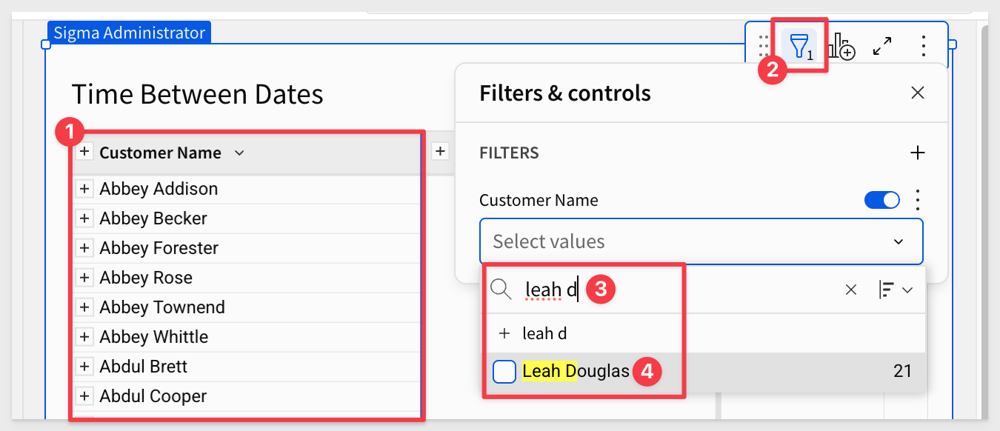

The table should now look like this:

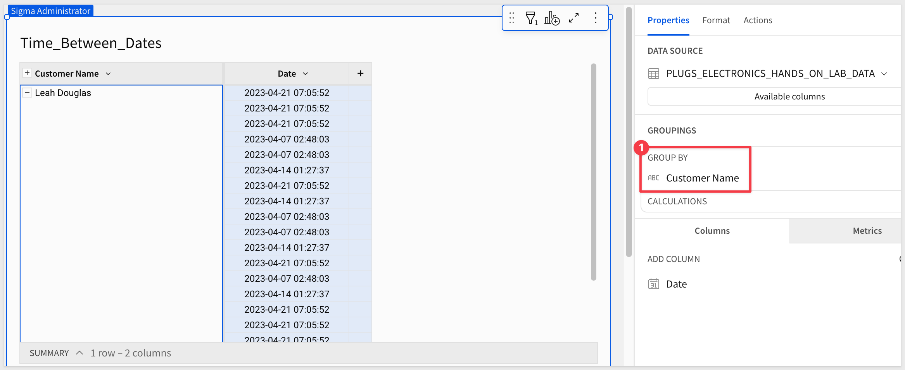

Add a new column next to `Customer Name` and rename it to `First_Order`.

For `First_Order` set the formula to:
```plaintext
Min([Date])
```

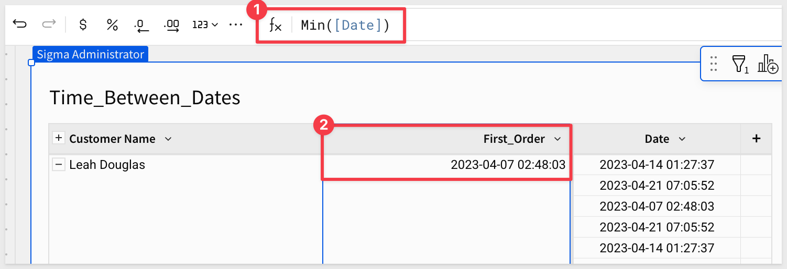

Now add four more columns, renaming them and applying the following formulas:

<aside class="negative">
<strong>PRO TIP:</strong><br> Use keyboard shortcuts to save time. For example, use "Shift +"  to add a new column.
</aside>

For more information, see [Keyboard shortcuts: Microsoft Windows](https://help.sigmacomputing.com/docs/keyboard-shortcuts-microsoft-windows) or [Keyboard shortcuts: Mac OS](https://help.sigmacomputing.com/docs/keyboard-shortcuts-mac-os)

```code
Column Name:                    Formula:
Second_Order                    Nth([Date], 2)
Last_Order                      Max([Date])
Days_1st_to_2nd_Order           DateDiff("day", [First_Order], [Second_Order])
Days_Since_Last_Order           DateDiff("day", [Last_Order], Today())
```

Hide the `Date` column.

The table should now look like this:

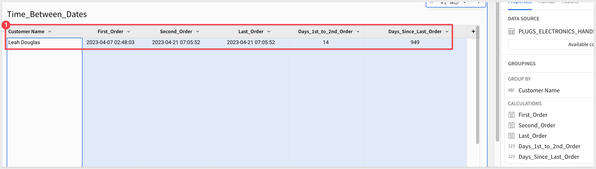

Go ahead and disable the filter.

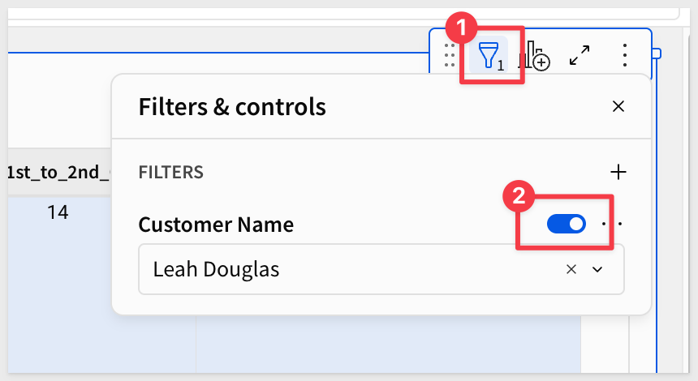

Marketing now has the data they requested:

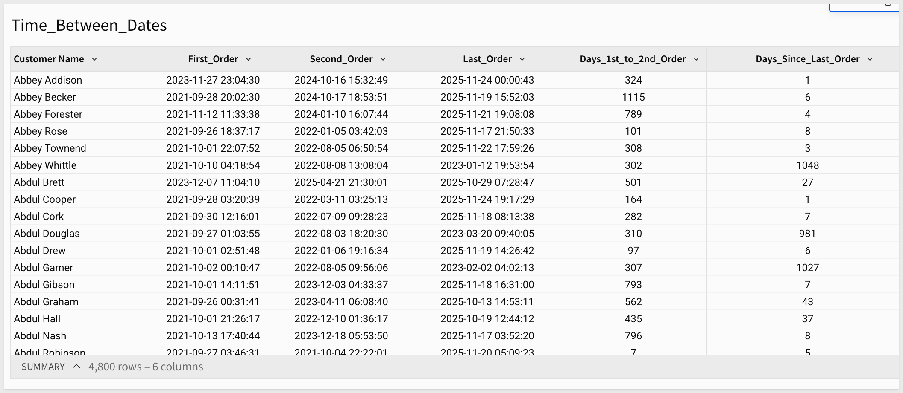


<!-- END OF SECTION-->

## Week over Week
Duration: 10

Sales Operations wants to see how weekly sales numbers look compared to the previous week.

Let's use this example to explore Sigma's `Lead` and `Lag` functions. These functions make this type of comparison surprisingly easy.

In this example, we'll approach the data a bit differently. 

Create another workbook page named `Week_Over_Week`.

Add a table to the page, and this time select `F_Sales` from the `Sigma Sample Database`.

This gives us all the sales transactions.

Next, we’ll join another table to bring in point-of-sale data.

Click the `3-dot menu` on the `F_Sales` table and select `Element Source` and then `Join`:


Search for and select `F_Point_of_Sale` from the `RETAIL` schema and select only the `Sales Amount` column.

<aside class="positive"><strong>IMPORTANT:</strong><br> Bring only the columns you need to save compute costs and performance. You can easily add columns back later if needed.</aside>

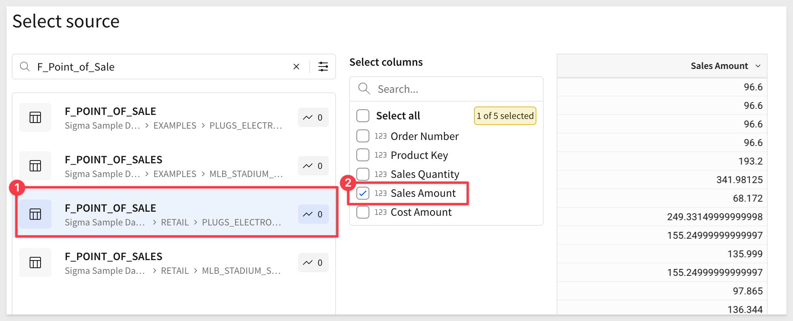

Now choose the type of join and identify the join keys (matching columns from each table).

<aside class="negative"><strong>NOTE:</strong><br> Sigma's advanced functionality is able to pre-configure the join for you and show you the results, saving you time.</aside>

Since we’re joining the two tables on `Order Number`, we have a 100% match. This works because every sale must have an order number, so it exists in both tables.

<aside class="positive"><strong>IMPORTANT:</strong><br> SQL joins can be confusing if you don't work with them often. Sigma makes it easy to see the impact of a join and get it right the first time.</aside>

For more information, see [Join types](https://help.sigmacomputing.com/docs/join-types)

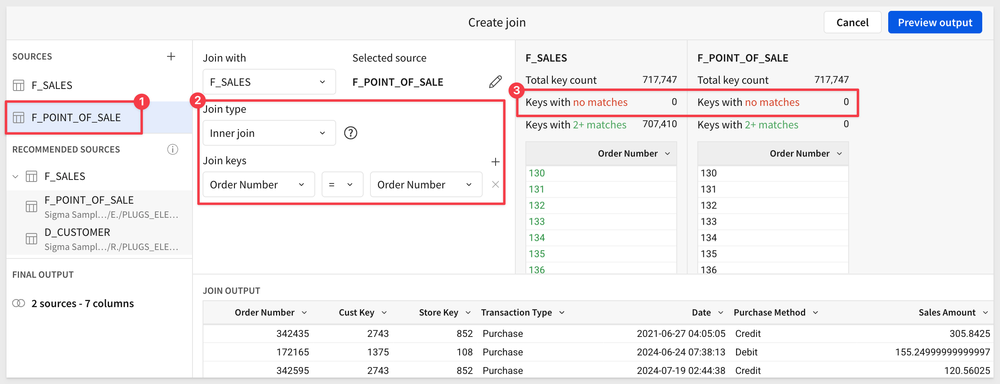

Click Preview output. Sigma shows the tables lineage. This allows us to see how our table was constructed, which columns are selected and more. We could also join more tables from here:

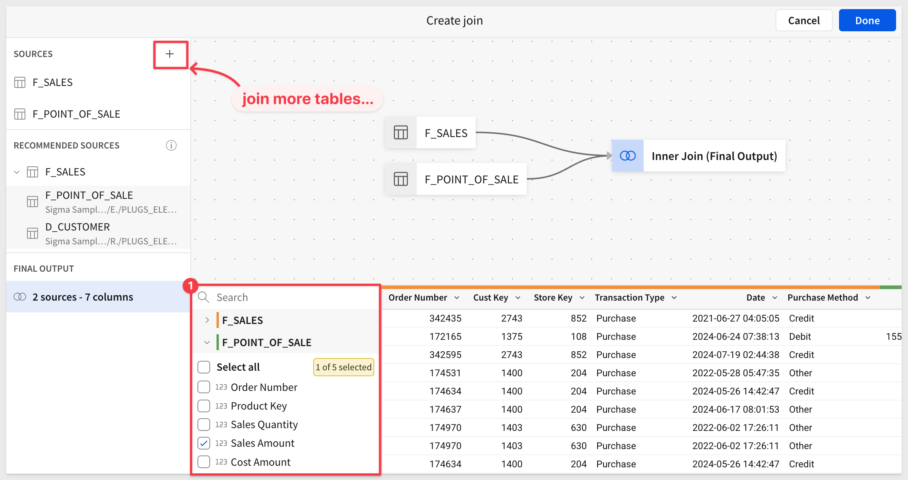

For more information, see [View workbook and data model data lineage](https://help.sigmacomputing.com/docs/workbook-data-lineage)

Click `Done`, and rename the table `Week_over_Week_Sales`.

Drag the `Date` column to `Groupings` and truncate it to `Week`.

Hide the `Order Number`, `Cust Key` and `Store Key` columns:

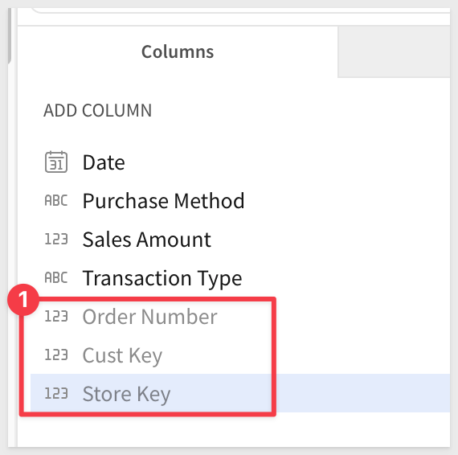

Drag the `Sales Amount` column to `Calculations`, rename it to `Weekly_Sales` and set the format to `currency`:


Add two calculated columns using the `+` icon in the `CALCULATIONS` panel. Rename each and set the formulas to:
```code
Column:                         Formula:
Sales_Lag_1_Week      [Weekly_Sales] / Lag([Weekly_Sales], 1)
Sales_Lead_1_Week     [Weekly_Sales] / Lead([Weekly_Sales], 1)
```

Format the `Lead/Lag` columns as percentages and sort the `Week of Date` column in descending order:

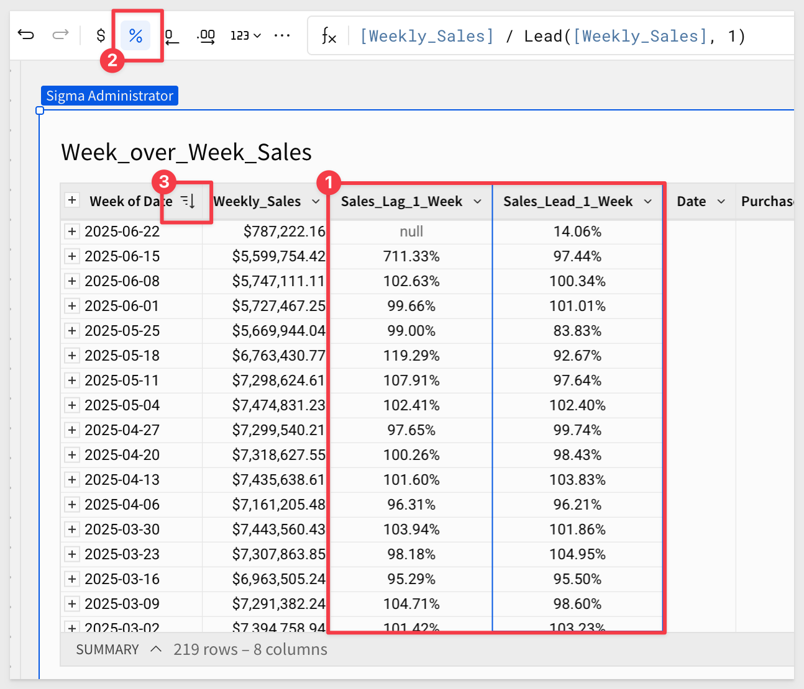

<aside class="negative"><strong>NOTE:</strong><br> The most current week will show null as there is no data for the future week yet.</aside>

For more information, see [Lead](https://help.sigmacomputing.com/docs/lead)

Sales Operations can now compare weekly sales performance at a glance.

This use case could also be solved using Sigma’s `DateLookback` function. The `DateLookback` function returns the value of a variable at a previous point in time (or lookback period) determined by a specified date and offset.

We will use `DateLookback` in the next section.


<!-- END OF SECTION-->

## Year over Year
Duration: 10

Viewing data organized `year over year by month` helps users understand business performance in use cases like seasonality. It allows users to see whether performance is improving, flat, or declining year over year.

Now that we've learned how to navigate Sigma, we’ll move a bit faster.

Create another workbook page named `Year_over_Year`.

Add another child of the `PLUGS_ELECTRONICS_HANDS_ON_LAB_DATA` table to it.

Rename the table to `Year_Over_Year_by_Month`.

Start by hiding all 22 columns. Use `Shift + Click` to select the first and last, then click `Hide column`.

Now we have lots of columns to work with but none are displayed:

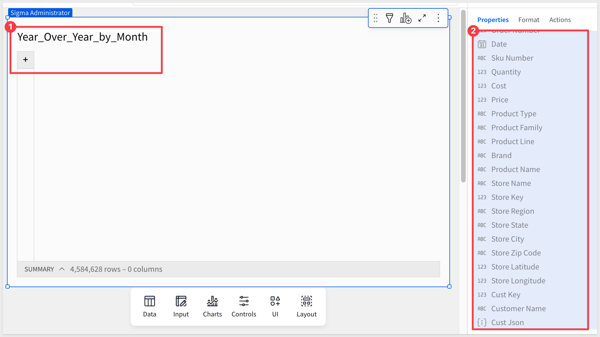

First, rename the hidden `Date` column to `Today`, just to avoid confusion with the formulas later.

Add a new grouping by clicking the `+` next to `GROUPINGS` and selecting `Add new column`:

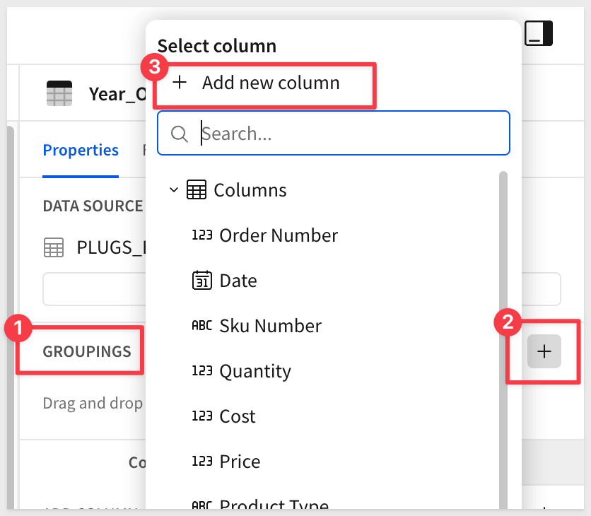

Set the formula to:
```code
DateFormat(Date([Today]), "%m")
```

Rename this column `Month_Number` and set its sort order to `Ascending`. 

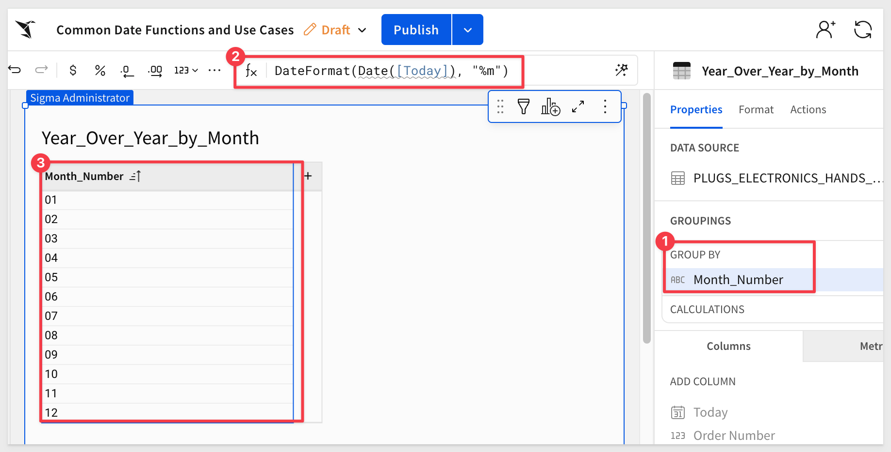

Add the `Today` column to a second grouping.

Set the new column's formula to:
```code
DateTrunc("year", [Today])
```

Rename the column `Year`:


Add a new calculation by clicking the `+` next to `CALCULATIONS` in the `Year` grouping, and select `New column`:
```code
Sum([Quantity] * [Price])
```

Format the column as currency and rename it `Monthly_Sales`.

The table should now look similar to this (after collapsing/expanding and formatting):

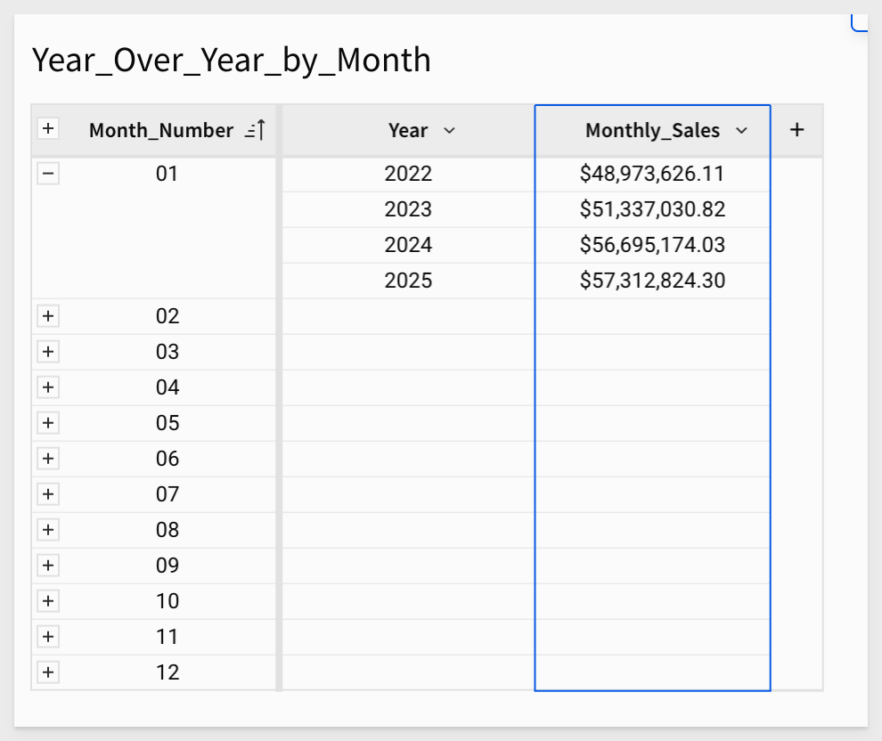

Add a new `CALCULATION` by clicking the `+` to the right of `CALCULATIONS` in the `Year` grouping and select `New column`.


Configure the new column as shown below:
```code
Column Name:       Formula:
Previous_Year      DateLookback([Monthly_Sales], [Year], 1, "year")
```

Now we can calculate the year over year percentage difference for each month.

Add another new `CALCULATION` column to the same grouping and configure it using:
```code
Column Name:      Formula:
% Change          ([Monthly_Sales] - [Previous_Year]) / [Previous_Year]
```

Set the column's format to `Percentage`.

Now we can start to see trends in the data.

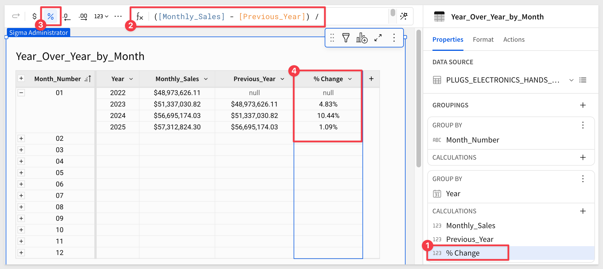

For more information, see [DateLookback](https://help.sigmacomputing.com/docs/datelookback)

Click `Publish`.


<!-- END OF SECTION-->

## InDate Range
Duration: 10

The `InDateRange` function provides a succinct way to write calculations such as `last year` or `this year`. It also simplifies more complex calculations, making them shorter and easier to read. While there are other ways to solve this, let's explore a different approach using `InDateRange`.

What's different with the `InDateRange` function is that it will return `True` or `False` based on its configuration. The table can then be filtered based on an `InDateRange` column being `True` or `False`.

For example, we may want to see how sales this year compare with last year, side by side.

Create a new page and rename it to `InDate_Range`.

Add another child of the `PLUGS_ELECTRONICS_HANDS_ON_LAB_DATA` table to it.

Rename the table `Sales_Comparison`.

Change the `Date` column's format to `Date` (to remove the time portion of it). 

Rename the `Date` column to `Today`.

Hide all other columns.

Add a new column using this configuration:
```code
Column Name:      Formula:
Week              DatePart("week", [Today])
```

Add another new column using this configuration:
```code
Column Name:      Formula:
Sales_Amount     [Price] * [Quantity]
```

Hide this column.

Next, use the `InDateRange` function to create four new columns.

For each of the following new columns, use the following configuration:
```code
Column Name:              Formula:
isCurrent_Year            InDateRange([Today], "current", "year")
isLast_Year               InDateRange([Today], "last", "year")
This_Year_Sales_Amount    SumIf([Sales_Amount], [isCurrent_Year])
Last_Year_Sales_Amount    SumIf([Sales_Amount], [isLast_Year])
```

The table should now look like this. Notice that sales amount values only appear for the current and previous years. All others are null:

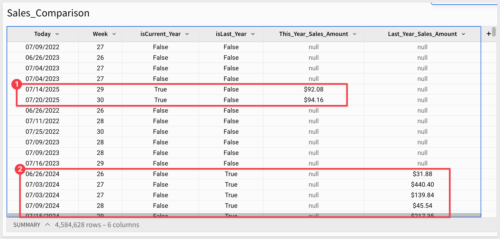

Instead of filtering the table to show only rows for the current and previous years, let’s use a pivot table.

Add a child pivot table:

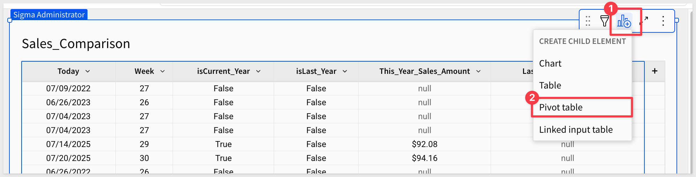

Configure the pivot table as shown below and rename it `Sales - This Year vs. Last`:

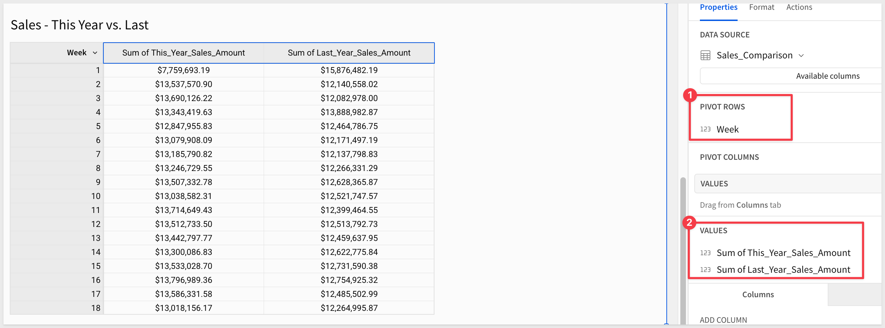

From here we can start to dig deeper into the analysis by calculating sales changes or adding visualizations.

For more information, see [InDateRange](https://help.sigmacomputing.com/docs/indaterange)


<!-- END OF SECTION-->


## InPrior Date Range
Duration: 10

The `InPriorDateRange` function is used to calculate values from a prior time period such as "This Week Last Year" or "Same Quarter Last Year".

It returns a `Boolean` (True or False), which we can use in formulas to compare current and prior period performance.

A common use case is comparing quarterly sales performance year-over-year by region to identify growth trends.

Create a new page and rename it to `InPrior_Date_Range`.

Add another child of the `PLUGS_ELECTRONICS_HANDS_ON_LAB_DATA` table to it.

Rename the table `Quarterly_Sales_Comparison`.

First, let's create a column to calculate sales amount. Add a new column and configure it:
```code
Column Name:     Formula:
Sales_Amount     [Price] * [Quantity]
```

Hide this column - we'll use it in calculations but don't need to display it.

Now group the data by `Store Region`.

Next, we'll create Boolean columns to identify which rows belong to the current quarter and the same quarter last year.

Add two new columns with these configurations:
```code
Column Name:              Formula:
isCurrent_Quarter         InDateRange([Date], "current", "quarter")
isPrior_Quarter           InPriorDateRange([Date], "quarter", "year")
```

The `InPriorDateRange` function evaluates each row's date and returns `true` if it falls in the same quarter one year ago.

Now we can use these Boolean columns to calculate sales for each period. Add three more calculated columns:
```code
Column Name:                    Formula:
Current_Quarter_Sales           SumIf([Sales_Amount], [isCurrent_Quarter])
Prior_Quarter_Sales             SumIf([Sales_Amount], [isPrior_Quarter])
Quarter_over_Quarter_Change     ([Current_Quarter_Sales] - [Prior_Quarter_Sales]) / [Prior_Quarter_Sales]
```

Hide the `isCurrent_Quarter`, `isPrior_Quarter`, and `Sales_Amount` columns.

Format the `Quarter_over_Quarter_Change` column as a percentage.

Format the sales columns as currency.

Hide all other columns.

If we filter on `isCurrent_Quarter` = `True`, we can see the sales for the current quarter, by `Store Region`:

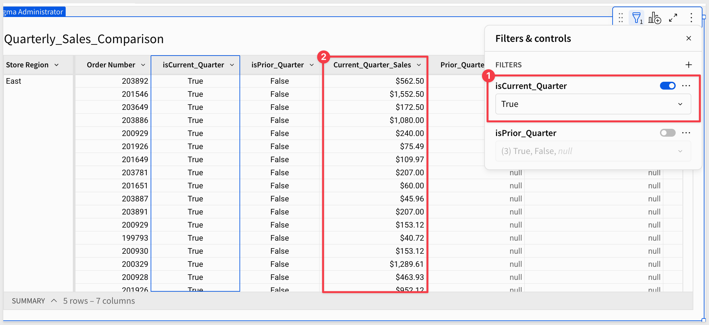

The same is true for `Prior_Quarter_Sales`:

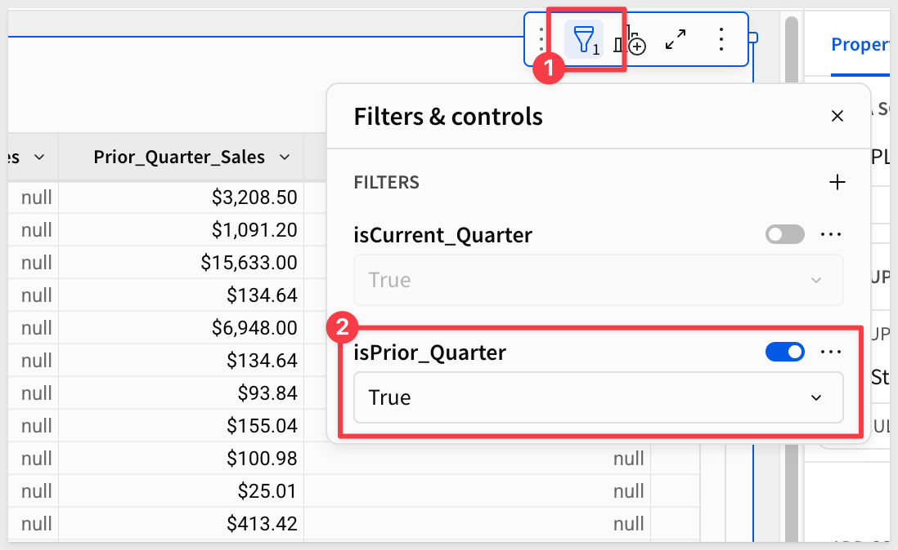

From here we can leverage this data using grouping, pivot tables, and charts to orient the comparisons in many different ways.

<aside class="negative"><strong>NOTE:</strong><br> This is not the only way to achieve this outcome. You could get similar results using the "InDateRange" function with custom date ranges, filters, or the "DateLookback" function. Sigma is flexible and we want to get you thinking about possible options and how each may affect a use case.</aside>

For more information, see [InPriorDateRange](https://help.sigmacomputing.com/docs/inpriordaterange)


<!-- END OF SECTION-->

## Date Calendars - The Retail 4-5-4 Calendar
Duration: 10

Companies often use table-based calendars in analytics to help address data consistency, seasonality, and planning.

In this QuickStart step, we’ll build a pivot table that leverages the `NRF Retail 4-5-4 Calendar` combined with our `Plugs Electronics` sample data to analyze same-store sales the way most retailers prefer. These same general methods apply to any table-based calendar you use.

The NRF Retail 4-5-4 Calendar is a standardized retail calendar developed by the National Retail Federation (NRF) to help retailers track and analyze their sales performance. It is widely used by retailers in the United States, and it is particularly useful for businesses that operate on a fiscal year that does not align with the traditional calendar year. The calendar helps retailers plan their inventory, staffing, and marketing strategies based on historical sales data and seasonal trends.

<aside class="negative">
<strong>NOTE:</strong><br> Please refer to the NRF website for the most recent versions of the calendar. This example calendar used here may not represent a current version.
</aside>

For more information, see [NRF 4-5-4 Calendar](https://nrf.com/resources/4-5-4-calendar)

Add a new workbook page, and this time, add the `PLUGS_ELECTRONICS_HANDS_ON_LAB_DATA` table by selecting it from the sample database instead of the `Data` page:


Rename the page `Date_Calendar`.

Rename the table to `Same_Store_Sales`.

Add a new column, rename it to `Order_Value` and use this formula:
```code
[Quantity] * [Price]
```

Create a new join:

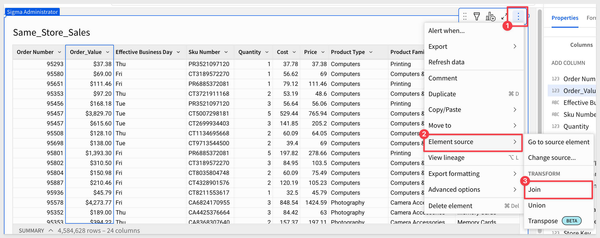

Search for the `4_5_4_CALENDAR` in the `RETAIL` schema and select it:

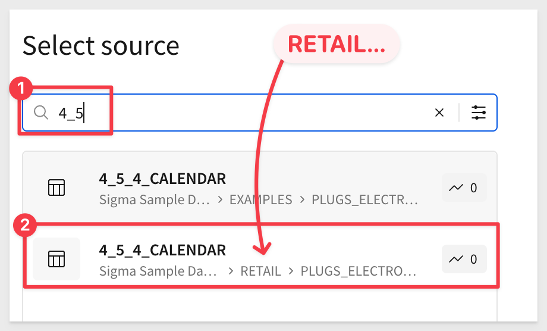

We are now presented with a screen that allows us to adjust how the two tables are joined. We need to adjust the join to use the `Date` and `Today` columns

If we look closely at the join results we can see there is a mismatch; the timestamps are causing a problem:


Joining on mismatched data types can cause issues, but Sigma supports formula-based joins to correct the issue.

To handle the datatype issue, we will use a formula for each join key:


Apply this formula to both join keys:
```code
DateTrunc("day", [Date])
```

After making the changes, you should have many matches. It won't be a 100% match, as there are some values in the Plugs table that are not in the 4-5-4 table.

Click `Preview Output` and `Done`.

Now, create a child of this table and select `Pivot Table` as the type:


Rename the pivot table to `Same_Store_Sales_454_Calendar`.

Configure the pivot table as shown below:


Let’s say we want to see same-store sales for Thanksgiving. The `Fiscal Day of the Year` value according to the 4-5-4 Calendar is `299` in week `43`.

We can add a list page control to the page:


Configure it to filter based on the `Fiscal Week`:

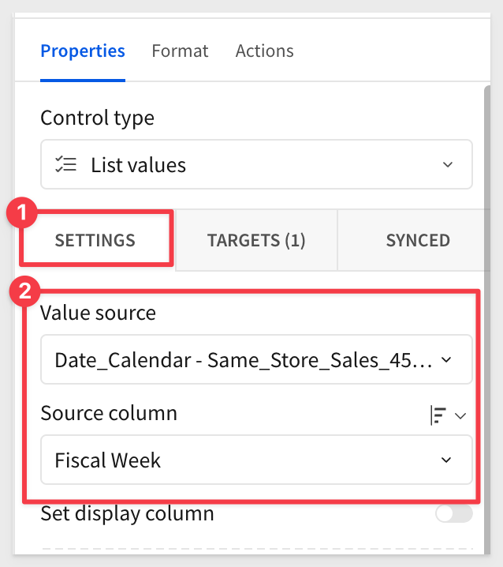

And set its target to `Fiscal Week`:

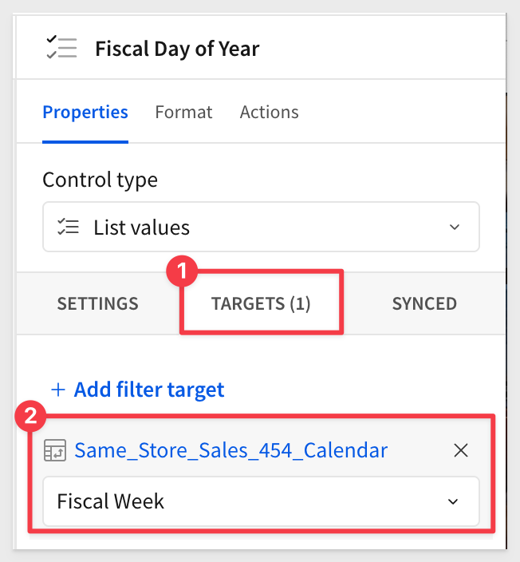

<aside class="negative">
<strong>NOTE:</strong><br> We used "Fiscal Week" so we can see the days leading up to holidays too.
</aside>

Use the control to find week 43:

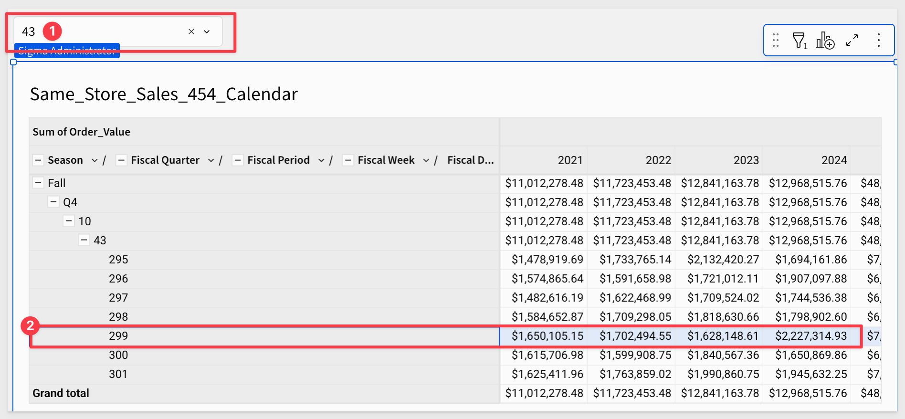

Click `Publish`.

Of course, we could make this more user-friendly by making a control that shows major holidays by name and other improvements but that is outside the scope of this QuickStart.

[NRF Calendar](https://nrf.com/resources/4-5-4-calendar)


<!-- END OF SECTION-->

## What we've covered
Duration: 5

In this QuickStart, we explored many of the most commonly used date functions and the use cases where they’re applied. While not comprehensive, this guide highlights key patterns and techniques for working with dates in Sigma. There are many more ways to leverage dates—so keep exploring!

For more information, see [Function index](https://help.sigmacomputing.com/docs/function-index)

**Additional Resources:**

Be sure to check out all the latest developments at [Sigma's First Friday Feature page!](https://quickstarts.sigmacomputing.com/firstfridayfeatures/)

[Blog](https://www.sigmacomputing.com/blog/)<br>
[Community](https://community.sigmacomputing.com/)<br>
[Help Center](https://help.sigmacomputing.com/hc/en-us)<br>
[QuickStarts](https://quickstarts.sigmacomputing.com/)<br>
<br>

[](https://twitter.com/sigmacomputing)&emsp;
[](https://www.linkedin.com/company/sigmacomputing)&emsp;
[](https://www.facebook.com/sigmacomputing)


<!-- END OF WHAT WE COVERED -->
<!-- END OF QUICKSTART -->
