author: pballai
id: common_date_functions_and_use_cases
summary: Common Date Functions and Use Cases
categories: functions
environments: web
status: Published
feedback link: https://github.com/sigmacomputing/sigmaquickstarts/issues
tags: Getting Started

# Common Date Functions and Use Cases
<!-- The above name is what appears on the website and is searchable. -->

## Overview 
Duration: 5 

This QuickStart presents common challenges when working with dates. Sigma can be used to manipulate dates to get the desired results, quickly and easily.

There are many ways to solution with dates in Sigma. Not every solution is covered and you may even found a better method. Suggestions and feedback is always appreciated.

This QuickStart assumes you have a working instance of Sigma and the Sigma Sample Dataset.

We will use the Sigma provided `PLUGS_ELECTRONICS_HANDS_ON_LAB_DATA` table so that you can recreate each QuickStart Step in your own Sigma environment.

 ### Target Audience
Anyone who is looking for solutions to date challenges or just want to learn new date methods.

### Prerequisites
1: A computer with a current browser. It does not matter which browser you want to use.<br>
2: A Sigma account.
  
### What You’ll Learn
How to apply Sigma functions to date challenges.

### What You’ll Build

We will cover a large number of methods for working with dates in Sigma. Date logic can be confusing so we will start with the basics to show how Sigma makes the simple stuff easy and then get more complex to show how Sigma makes the hard stuff possible all through an easy to used interface. 


<!-- END OF OVERVIEW -->

## **Basic Formatting**
Duration: 10

Let's start simply by presenting the standard ways to alter/adjust a date column.

Create a new Workbook and place the `PLUGS_ELECTRONICS_HANDS_ON_LAB_DATA` table on the page. You can just take all the columns. We are mostly interested in the Date column right now but will use the others as we add logic later.


Click on the `Date` columns down arrow and select `Truncate date`. This is one way to adjust how the Date column will be modified.


If you select the `Day` option, notice that the column name is changed to `Day of Date`

Reset the Date column back the the default (use "Remove date truncate" or the back icon if you are in edit mode).

Click on the `Date` columns down arrow and select `Format date`. This is another way to adjust how the Date column will be modified:


Feel free to experiment with the available options, resetting to the original when done.


<!-- END OF SECTION-->

## **Custom Formatting**
Duration: 10

Sigma supports applying custom formats to date columns. You can do this by selecting the `Date` columns menu and then `Format` and `Custom`:


Setting the `Format string` to the code below will cause the popup to show you a sample of the output. This is quite useful to know your string is correct before applying it.

```plaintext
%a %B %d %Y
```

[A full list of custom format strings is available here.](https://help.sigmacomputing.com/hc/en-us/articles/8181440400915)


Feel free to experiment and then reset the `Date` column back to the default when done.

Another way to use custom date formatting is to apply a Function in the formula bar using one of the many `DateFormat` functions.

For example, you may want to get the full month-name from a date column.

Create a new column and rename it `Month of Date`.

Place this code in the formula bar and click the checkmark (or press Enter):

```plaintext
DateFormat(Date([Original Date]), "%B")
```


Here are some others we built using the same method and there are many more possible:


<!-- END OF SECTION-->

## **Current / Previous Weekday**
Duration: 10

It can be useful to get the current or previous weekday when presenting data to users. For example, in the table below we have one row of data with today's date in the `Today` column.

We use this column in a Function to determine If the input date is a Monday, we show the day in the `Day Name of Today` and then the function returns the calculated `Current Weekday`.


The Function is:
```plaintext
DateFormat(DateAdd("day", (If(Weekday([Today]) = 7, -1, Weekday([Today]) = 1, -2, 0)), [Today]), "%A")
```

If the input date is a Sunday, the function returns the date of the Friday immediately previous.


[A breakdown of this Function's parts is available here.](https://help.sigmacomputing.com/hc/en-us/articles/360042442014-Find-Latest-Weekday-and-Previous-Weekday)

[Several other useful examples of using Functions is available here.](https://help.sigmacomputing.com/hc/en-us/sections/360007760634-Workbook-Analysis)

We will not explore them all but a few more may be helpful.


<!-- END OF SECTION-->

## **Time Between Dates**
Duration: 10

It is often useful to know the elapsed time between two dates (and times). Some examples are:

**Call Center Support:** Call duration<br>
**Customer Service:** Order fulfillment time<br>
**Healthcare:** Time since last blood test<br>

Let's take a look at the Customer Service use case.

Marketing is interested in targeting customers who purchase frequently but only has a table with all orders to start with.

They want to know a few things:

 <ul>
        <li>When was a customer's first order?</li>
        <li>When was their second order?</li>
        <li>Number of days between the first and second order?</li>
        <li>How long since they last placed an order?</li>
        <li>Marketing will use this in campaigns targeting active and inactive customers.</li>
</ul>


Create another Workbook Page.

The data we will use is still the `PLUGS_ELECTRONICS_HANDS_ON_LAB_DATA` table. You can create a child of the table we used earlier of just add a new table to the Page based on it as source. We only need the columns `Customer Name` and `Date`.

`Group` the table by `Customer Name`.

Truncate the `Date` column to day:


<aside class="postive">
<strong>IMPORTANT:</strong><br> Our flat dataset has customer orders and a single customer order can have multiple items on it. To account for this, we want to group on the order day so that we can then do some date math against that. Otherwise, our table will have multiple rows for the same day (in most cases) and that is not what Marketing wants.
</aside>

`Group` by the `Day of Date`:

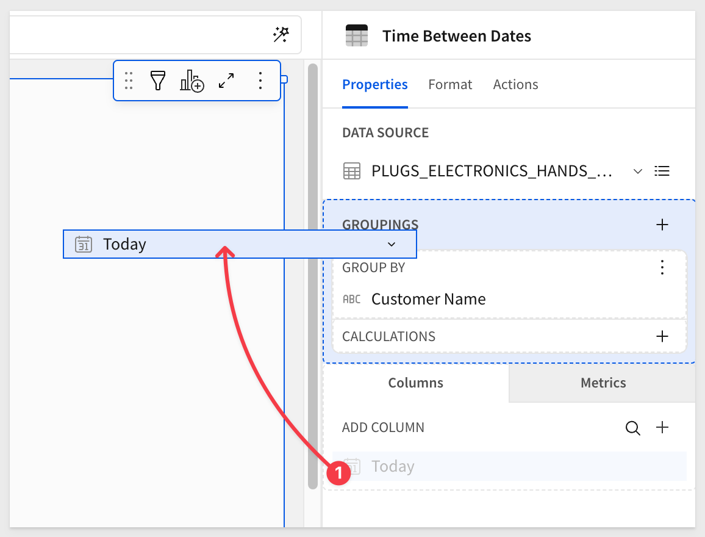

Lets filter the data (to keep things simple to see as we work) for `Customer Name` = `Leah Douglas`:


The table should now look like this:

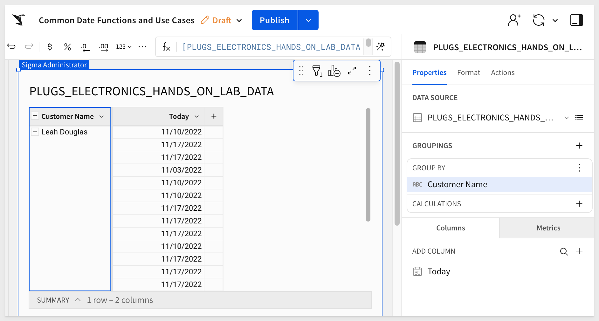

Add a new column by clicking the `Customer Name` menu arrow and rename it to `First Order`:


For `First Order` set the formula to:
```plaintext
Min([Day of Date])
```

Now we will add four more columns, rename them as shown below and apply the Functions in the formula bar for each:

```plaintext
Column:                         Formula:
Second Order                    Nth([Day of Date], 2)
Last Order                      Max([Day of Date])
Days 1st to 2nd Order           DateDiff("day", [First Order], [Second Order])
Days 1st to Last                DateDiff("day", [First Order], [Last Order])
```

The table should now look like this (after collapsing it):

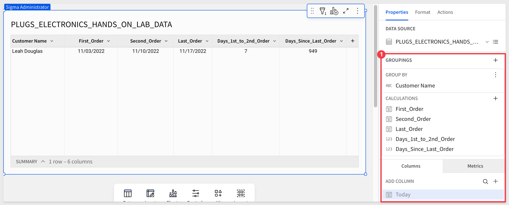

Go ahead and turn off the filter:


Now Marketing has the data they are requesting:


<!-- END OF SECTION-->

## **Week over Week**
Duration: 10

Sales Operations wants to know see how weekly sales numbers look compared to the previous week.

Let's use this example to investigate using the Lead and Lag function in Sigma. These functions make this use case surprisingly simple to execute.

In this example, we will go about getting data a different way (extra credit!). Create another Workbook Page and rename it `Week Over Week`.

Add a table to the Page but this time select the `F_Sales` from the Sample Database, selecting these columns:


This gives us all the sales transactions. Now we want to join a table to this for the point of sale data.

Click the menu in the F_Sales table and select `Element Source` and then `Join`:


Select the table `F_Point_of_Sale`, selecting only the `Sales Amount` column.

<aside class="postive"><strong>IMPORTANT:</strong><br> Bring only the columns you need to save compute costs and performance. You can easily add columns back later if needed.</aside>


Now we have to decide what type of join we want and on which columns (Join Keys).

<aside class="negative"><strong>NOTE:</strong><br> Sigma's advanced functionality is able to pre-configure the join for you and show you the results, saving you time.</aside>

Based on our joining the two tables against Order Number we have 100% match. Change the join to inner join and see the results. Still 100%, so in this case, either join will work.

<aside class="postive"><strong>IMPORTANT:</strong><br> SQL joins can be confusing if you don't work with them often. Sigma makes it easy to see the impact of a join and get it right the first time.</aside>

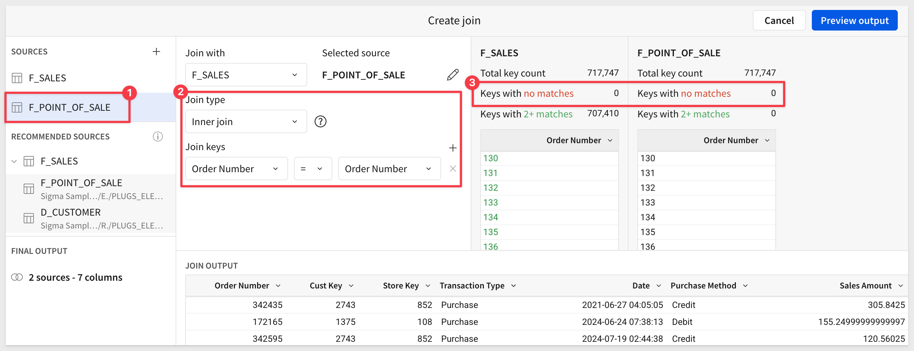

Preview the data and click `Done`. We now have a table on our Page we can rename to `Week over Week Sales`.

Drag the `Date` column to `Groupings` and Truncate it to `Week`:

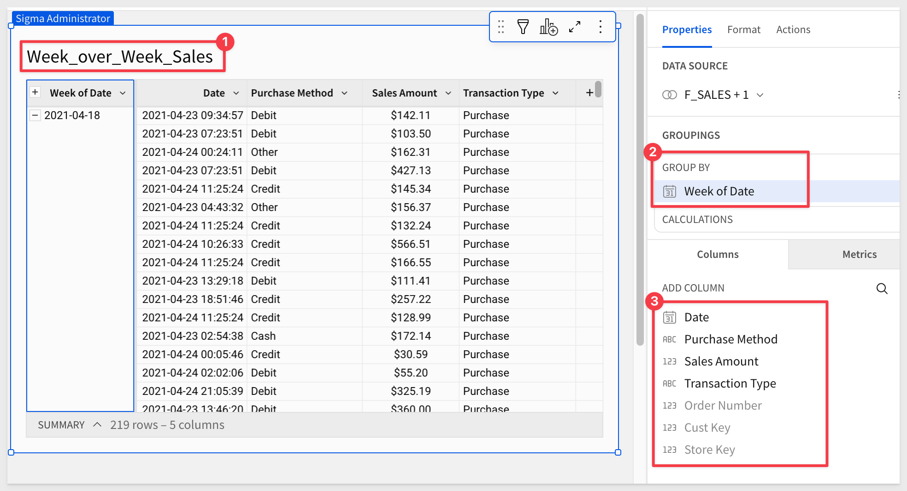

Hide the `Order Number`, `Date` and `Sales Amount` columns.

Drag the `Sales Amount` column to `Calculations`, rename it to `Weekly Sales` and set the format to `currency`:

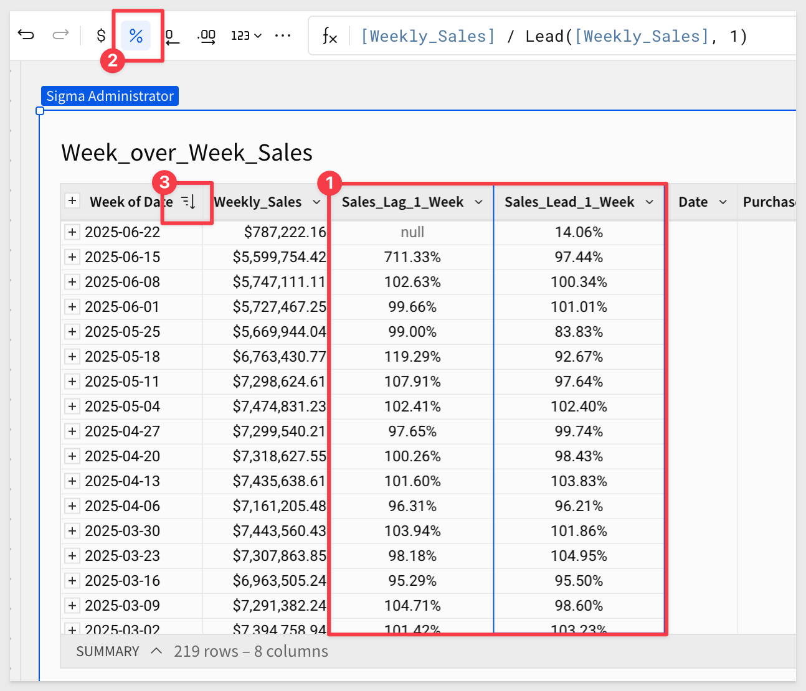

Add two calculated columns (in CALCULATIONS). Rename each and set the functions as:

```plaintext
Column:                         Formula:
Sales Lag 1 Week      [Weekly Sales] / Lag([Weekly Sales], 1)
Sales Lead 1 Week     [Weekly Sales] / Lead([Weekly Sales], 1)
```

Set the `Lead/Lag` columns to `percentage`:


<aside class="negative"><strong>NOTE:</strong><br> The most current week should be null for Lag as there is no data for the future week yet.</aside>

[Read more about Lead and Lag funtions.](https://help.sigmacomputing.com/hc/en-us/articles/360042442134-Calculate-Week-Over-Week-Numbers)


<!-- END OF SECTION-->

## **Year over Year**
Duration: 10

Viewing data organized `Year over year by month` gives users insight on how a business is doing in use cases like seasonality. Observing year over year performance gauges if performance is improving, static, or worsening.

We are going to move a little faster now that we learned how to work with the Sigma UI.

Create a new Workbook Page and add the `PLUGS_ELECTRONICS_HANDS_ON_LAB_DATA` table to it.

Hide all columns to start. Use `Shift` and `Click` to select the first and last in the list and then click `Hide column`.

Add a new group (click the `+` to the right of `GROUPINGS` and select `Date`)

Set the formula for the `Day of Date` column to:

```plaintext
DatePart("month", [Date]) 
```
Rename this column `Month Number` and set it's sort order to `Ascending`. 


Add a new column: 

Set it's formula to 
```plaintext
DateTrunc("year", [Date])
```
Add a new group (click the `+` to the right of `GROUPINGS` and select `Year of Date`)

Add a new column (to the right of `Year to Date`) and rename it `Monthly Sales`. Set it's formula to:

```plaintext
Sum([Quantity] * [Price])
```

The table should now look like this (after collapsing/expanding and formatting):


Add a new `CALCULATION` (click the `+` to the right of `CALCULATIONS` in the `Year of Date` grouping and select `New column`)

Configure the new column as shown below:

```plaintext
Column:             Formula:
Previous Month      Lead([Monthly Sales], -1)
```

Add another new `CALCULATION` (click the `+` to the right of `CALCULATIONS` in the `Year of Date` grouping and select `New column`)
```plaintext
Column:            Formula:
Year over Year     ([Monthly Sales] - [Previous Month]) / [Previous Month]
```

Set the `Year over Year` columns format to `Percentage`.

Now we can start to see trends in the data.

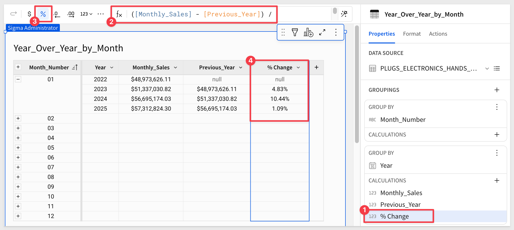


<!-- END OF SECTION-->

## **InDate Range**
Duration: 10

The InDateRange function provides a succinct way to write calculations such as Year to Date and Last 3 Month. It also simplifies more complex calculations, making them shorter and easier to read.

The InDateRange function will return True or False based on it's configuration. The table can then be filtered based on a InDateRange column being true or false.

For example, we may want to see how sales this year compare with last year, side by side.

Create a new Workbook and rename it to InDate Range.

Add the `PLUGS_ELECTRONICS_HANDS_ON_LAB_DATA` table.

Truncate the `Date` column to `Day`.

Add a new column as:
```plaintext
DatePart("week", [Day of Date])
```

Rename the new column to `Week`.

Add a new column called `Sales Amount`.

Set it's formula to
```plaintext
[Price] * [Quantity]
```

Hide this column.

We will use the `InDate Range` function in several new columns.

For each of the following new columns you add, configure them using the following:

```plaintext
COLUMN NAME          FORMULA TO APPLY TO COLUMN
                    
Week #               DatePart("week", [Date])
isCurrent Year       InDateRange([Date], "current", "year")
isLast Year          InDateRange([Date], "last", "year")
isCurrent Quarter    InDateRange([Date], "to_date", "quarter")
isCurrent Month      InDateRange([Date], "to_date", "month")
isCurrent Week       InDateRange([Date], "to_date", "week")
isIN Last 2 Weeks    InDateRange([Date], "last", "week", 2)
TY Sales Amount      SumIf([Sales Amount], [isCurrent Year])
LY Sales Amount      SumIf([Sales Amount], [isLast Year])
```

The table should now look like this:


Next add a child PivotTable.


Configure the Pivot Table as shown:


<aside class="negative"><strong>NOTE:</strong><br> There are nulls after week 9 because that is when this Pivot was run there were no sales past week 9 for the current year.</aside>

Now that we have all these columns as part of our data there are many ways you may want to leverage them in Sigma to create interesting Period over Period style visualizations.


<!-- END OF SECTION-->

## **Lookups - Year over Year**
Duration: 10

In this example we will demonstrate using data from one table in another. 

Let's assume that there are two tables that have columns that do not exist in a third. We can use a Lookup to bring those columns over to the third table. 

The tables will be are joined by a pair of columns — one from each — that share common values. We call these joining columns join keys.

Columns created from a lookup can be added using the Lookup function. However, you can also add a new lookup column without explicitly writing a formula. 

[Click here for more information on using Lookups](https://help.sigmacomputing.com/hc/en-us/articles/4409911623571-Add-Columns-via-Lookups)

Create a new Workbook Page and add the `PLUGS_ELECTRONICS_HANDS_ON_LAB_DATA` table to it.

Rename this table `Regional Sales Performance - This vs. Last Year`.

Duplicate the table using the table menu.

Rename this table `Sales This Year`

On the second table, hide all the columns leaving only `Store Name`, `Store Region`, `Store Key`, `Quantity` and `Date`.

Add a new column, rename it `Total Sale` and set it's formula to:
```plaintext
[Price] * [Quantity]
```
The formula on the `Date` column to:

```plaintext
DateTrunc("day", [Date])
```

Your page should now look link this:


Let's filter this table to display orders from this year only:


Back on the `Regional Sales Performance - This vs. Last Year`, we want to group on the `Store Region` column.

Now all a new column / Column via lookup:


You will be prompted to set how the two tables will be joined. Use this configuration:


Now drag the new Lookup column to the `Calculations` grouping:


Now lets get last years sales. Duplicate the table `Sales This Year`. 


Rename the table to `Sales Last Year`.

Change the filter to use last year as the range.


The page should look like this now (after moving thing around to suit):

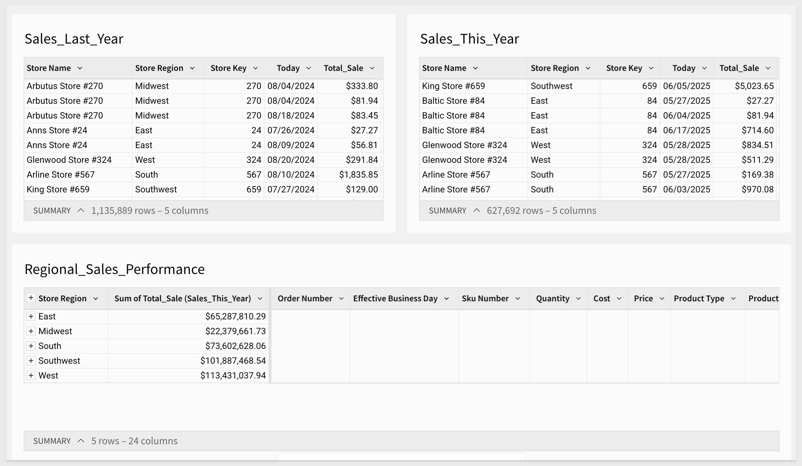

Now add another new column via Lookup (into the `Regional Sales Performance - This vs. Last Year` table) as before using the new `Sales Last Year` table.

The only configuration difference is the source table as shown:


Drag this new column to `Calculations` and you are done. We now have last year and this year (by Store Region) with all the detail as well.


<aside class="postive"><strong>IMPORTANT:</strong><br> Lookups can be very powerful and this was a basic example so that you can see the workflow against sample data you are already used to from other QuickStarts.</aside>


<!-- END OF SECTION-->

## **InPrior Date Range**
Duration: 10

The InPriorDateRange function is used for calculations that look at a date range in a prior period, such as This Week Last Year.

The results will appear as `Boolean` (true or false) and we can use that to filter rows to suit.

To make this go faster, open the Workbook `Lookups -  Year over Year` and use `Save As` to make a copy as `InPrior Date Range`.

Rename the `Sales This Year` to `Sales In Current Quarter`. Do the same for `Sales Last Year`, to `Sales Last Year - Same Quarter`.

We could use the **InDate Range** function in a new column on the `Sales This Year` table to reduce the date range to the quarter we are interested in but lets see if we can do it with filters instead.

In the `Sales In Current Quarter` set a filter on the `Day of Date` column:

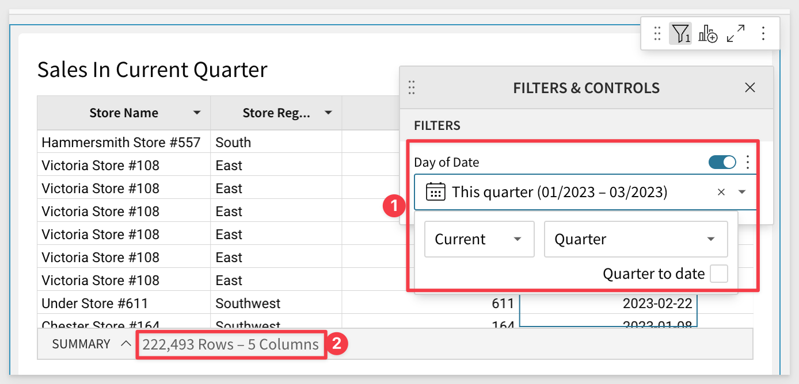

In the `Sales Last Year - Same Quarter`set a filter on the `Day of Date` column:

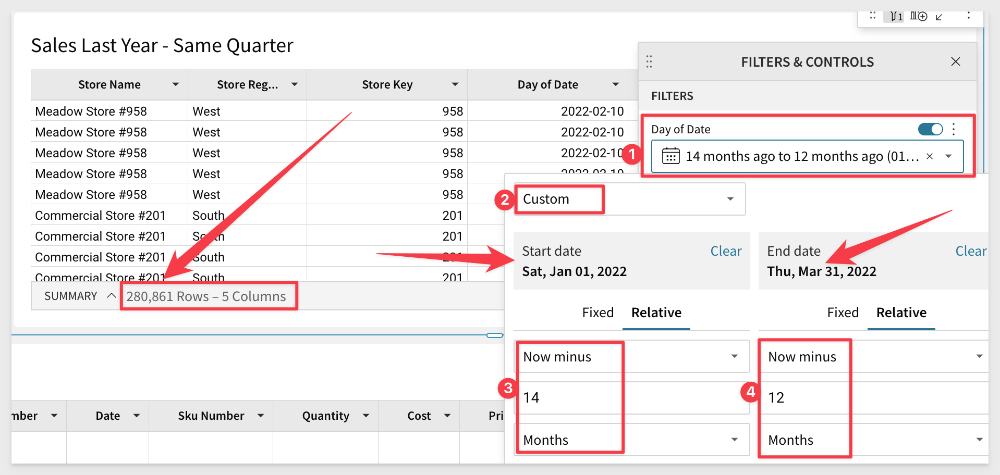

<aside class="negative"><strong>NOTE:</strong><br> You could also use the InDateRange function. We just wanted to get you thinking about possible options and how each may effect a use case.</aside>

Now lets adjust the `Regional Sales Performance - This vs. Last Year` table to Lookup on the new columns.

We can manually adust the column formulas but you may find it easier to use the UI.

Click the column `Sum of Total Sale (Sales This Year)` and select `Edit Lookup` from the options:

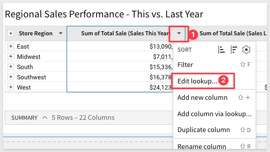

Change the `Column to add` to `In Current Qtr` and the `Aggregate` to `Sum` and click Done.


Rename the column to `Sum of Total Sale (This Qtr)`.

Now do the same thing for the `Sum of Total Sale (Sales Last Year)` column renaming it to reflect quarters too.

You should now have a table that looks like this (the table also is renamed to reflect quarters):

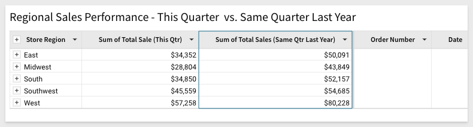

<aside class="negative"><strong>NOTE:</strong><br> You can click on the `InPriorDateRange` name in the formula bar to see the details on how to use this function</aside>

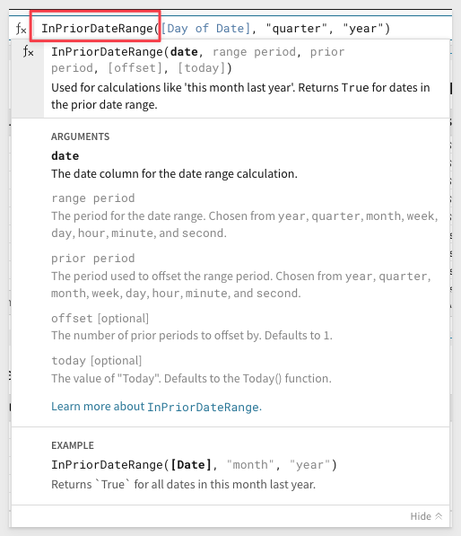


<!-- END OF SECTION-->

## **Date Calendars - The Retail 4-5-4 Calendar**
Duration: 10

Companies often use table-based calendars in analytics to help address data consistency, seasonality, and planning.

In this QuickStart Step we will build a pivot table that leverages the `NRF Retail 4-5-4 Calendar` combined with our `Plugs Electronics` sample data to look at same store sales the way most retailers prefer. The same general methods apply to using any table-based calendar you may have.

The NRF Retail 4-5-4 Calendar is a standardized retail calendar developed by the National Retail Federation (NRF) to help retailers track and analyze their sales performance. It is widely used by retailers in the United States, and it is particularly useful for businesses that operate on a fiscal year that does not align with the traditional calendar year. The calendar helps retailers plan their inventory, staffing, and marketing strategies based on historical sales data and seasonal trends.

Create a new Workbook and rename it to `Same Store Sales`.

In this exercise we will use some Sigma functionality not yet covered to enhance your learning by creating a joined table for Plugs sales and the 4-5-4 table to that for analysis.

Add a new Table to the Workbook.

Navigate to the `Sigma Sample Database` / `Plugs_Electronics` / `Plugs_Electronics_Hands_On_Lab_Data` table:


Rename the table to `Plugs Same Store Sales`.

We will need to calculate the value of each row (Order Value) since the data only has quantity and price.

Add a new column, rename it to `Order Value` and use this formula:

```plaintext
[Quantity] * [Price]
```

Click the `Tables` menu and select `Element Source` then `Join`:


Navigate to the `4_5_4_CALENDAR` and select it:

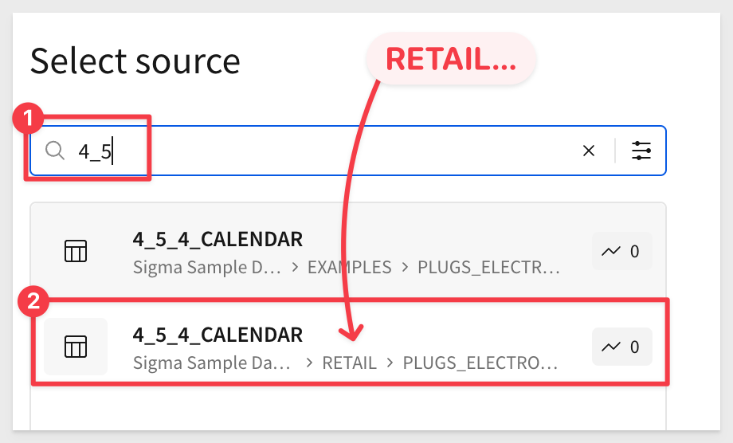

We are now presented with a screen that allows us to adjust how the two tables are joined. We will need to adjust how the 4-5-4 table is joined as we want to join on the `Date` column. For this to work, we need to ensure the datatype is the same. To do that, click the 4-5-4 table (on the left) and change the `Join Keys` for **both tables** to use a custom formula. That formula is:

```plaintext
DateTrunc("day", [DATE])
```

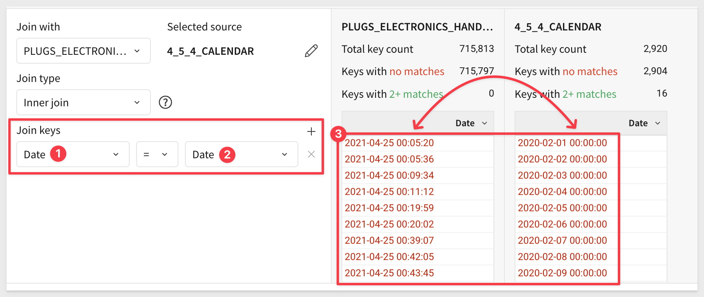

<aside class="negative"><strong>NOTE:</strong><br> We need to do this because the 4-5-5 Calendar has DATETIME formatted values for DATE (ie: 01/15/2023:00:00:00) and the Plugs Date column has DATETIME but the time component has varying values, so no match is possible. The time of each sale is not important for our analysis as we only want to 'bucket" dates into the 4-5-4 Calendar ranges.</aside>

After making the changes, you should have many matches. It won't be 100% match as there are some values in the Plugs table that are not in the 4-5-4 table. Click `Preview Output`.

We are presented with the data and a graphical representation of the data flow (lineage):


We can now create a `Child` from this table and use a `Pivot Table`:


Now we can create our pivot by dragging column name (in the Element Panel to the respective groupings, not the table) as shown below:

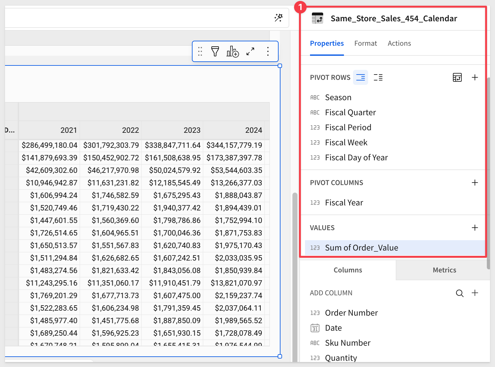

Rename the pivot table to `Plugs Same Store Sales - 454 Calendar`.

Notice that #4 shows no data for the Fiscal Year= 2019. Filter that out:


Let's say we want to see the Sale Store Sales for Thanksgiving. Since 2022 is the most recent year we had a Thanksgiving, the `Fiscal Day of the Year` value according to the 4-5-4 Calendar is `299. 

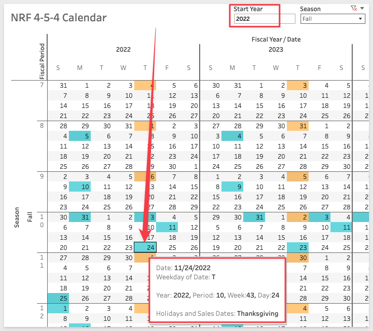

Now we can see the year-over-year side by side with just a few clicks to expand as show:

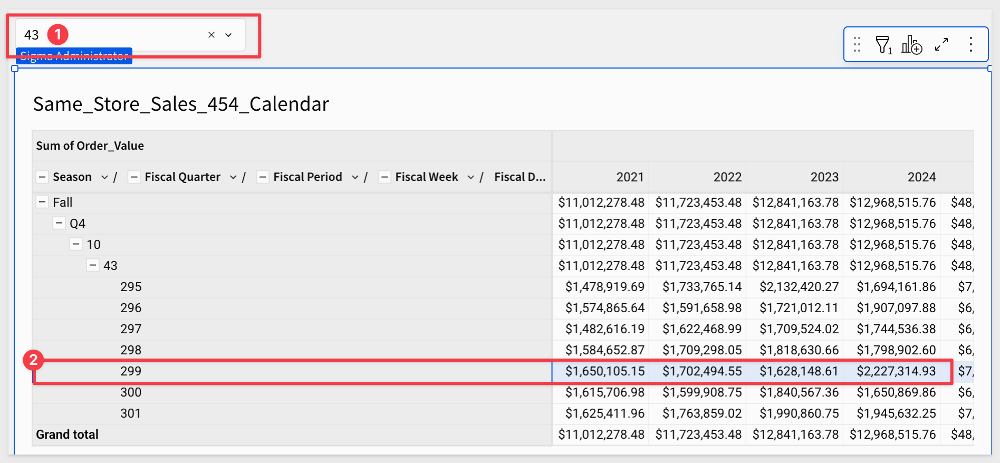

Of course we could make this more user-friendly by adding a Page Control to allow filtering that shows major holidays and other improvements but that is outside the scope of this QuickStart.

[Link to the NRF Calendar Page](https://nrf.com/resources/4-5-4-calendar)


<!-- END OF SECTION-->

## What we've covered
Duration: 5

In this QuickStart we covered many of the commonly used date functions and use cases where they are applied. This was not comprehensive and there are many more ways to leverage dates in Sigma.

[To get more information on date functions in Sigma, click here.](https://help.sigmacomputing.com/hc/en-us/categories/360002442993-Function-Index)

<!-- THE FOLLOWING ADDITIONAL RESOURCES IS REQUIRED AS IS FOR ALL QUICKSTARTS -->
**Additional Resource Links**

[Help Center Home](https://help.sigmacomputing.com/hc/en-us)<br>
[Sigma Community](https://community.sigmacomputing.com/)<br>
[Sigma Blog](https://www.sigmacomputing.com/blog/)<br>
<br>

[](https://twitter.com/sigmacomputing)&emsp;
[](https://www.linkedin.com/company/sigmacomputing)
[](https://www.facebook.com/sigmacomputing)


<!-- END OF WHAT WE COVERED -->
<!-- END OF QUICKSTART -->
