author: pballai
id: common_date_functions_and_use_cases
summary: Common Date Functions and Use Cases
categories: functions
environments: web
status: Published
feedback link: https://github.com/sigmacomputing/sigmaquickstarts/issues
tags: default
lastUpdated: 2025-06-25

# Common Date Functions and Use Cases

## Overview 
Duration: 5 

This QuickStart presents common challenges when working with dates. Sigma can be used to manipulate dates to get the desired results, quickly and easily.

There are many ways to work with dates in Sigma. Not every solution is covered and you may even find a better method. Suggestions and feedback are always appreciated.

This QuickStart assumes you have a working instance of Sigma and the connection called Sigma Sample Database.

We will use the Sigma-provided `RETAIL`.`PLUGS_ELECTRONICS`.`PLUGS_ELECTRONICS_HANDS_ON_LAB_DATA` table so you can follow along and recreate each step in your own Sigma environment.

### Target Audience
Sigma builders looking for solutions to date challenges or who just wants to learn new date methods.

### Prerequisites

<ul>
  <li>Any modern browser is acceptable.</li>
  <li>Access to your Sigma environment.</li>
  <li>Some familiarity with Sigma is assumed. Not all steps are shown, as basic Sigma functionality is assumed.</li>
</ul>

<aside class="positive">
<strong>IMPORTANT:</strong><br> Sigma recommends using non-production resources when completing QuickStarts.
</aside>

<button>[Sigma Free Trial](https://www.sigmacomputing.com/free-trial/)</button><br>

<aside class="negative">
<strong>IMPORTANT:</strong><br> Some features may carry a "Beta" tag. Beta features are subject to quick, iterative changes. As a result, the latest product version may differ from the contents of this document.
</aside>
  

<!-- END OF OVERVIEW -->

## Basic Formatting
Duration: 10

Let's start with the standard ways to adjust a date column.

Log into Sigma, click `Create new` and select `Workbook`.

From the `Element bar`, under the `Data` group, place a new `Table` on the page.

Click `Select source` for the new table.

Search for `Hands` and select the `PLUGS_ELECTRONICS_HANDS_ON_LAB_DATA` table from the `RETAIL` database. 

Save the workbook as `Common Date Functions and Use Cases`.

We’re primarily interested in the `Date` column, which is coming in 'as-is' from the warehouse:

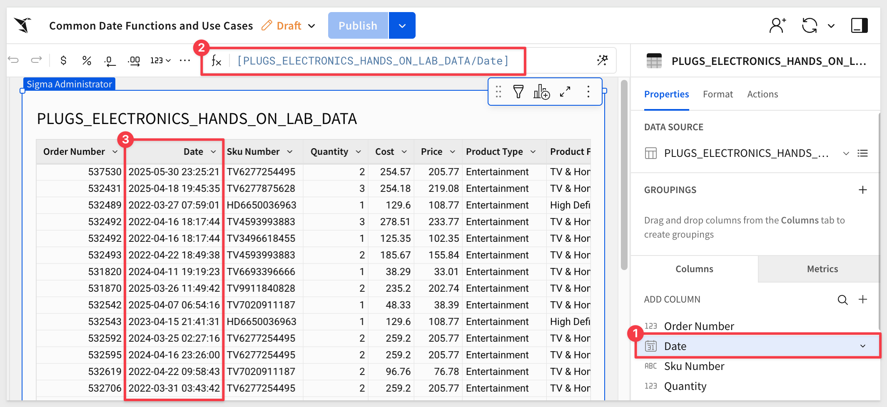

Click on the `Date` column down arrow and select `Truncate date`. This is one way to modify how the `Date` column is displayed.

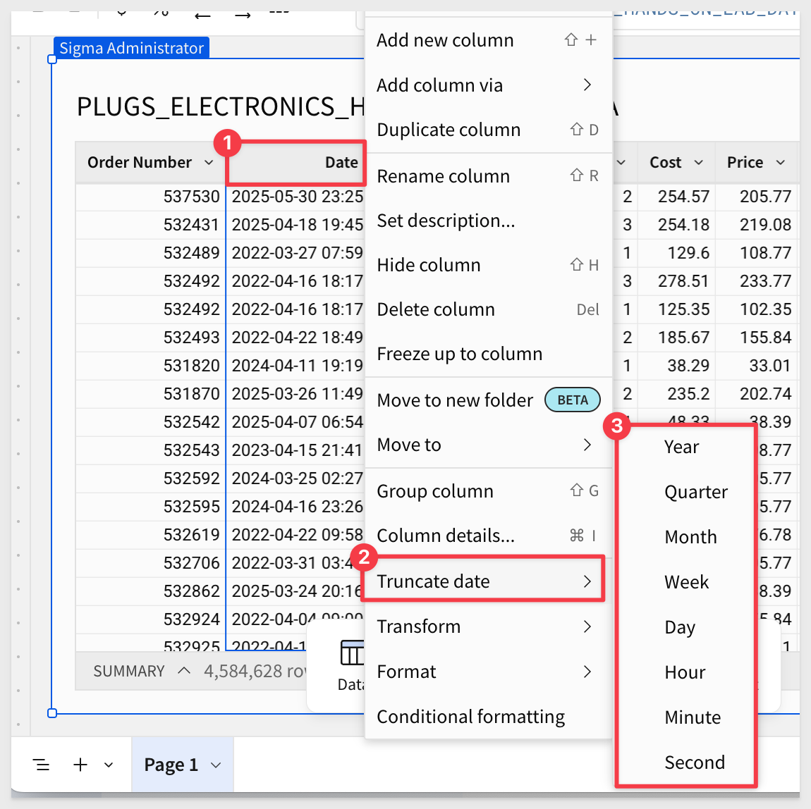

If you select the `Day` option, you'll see the column name changes to `Day of Date`.

Reset the `Date` column back to the default. You can use `Remove date truncate` from the column's menu but the `Undo` icon is faster:

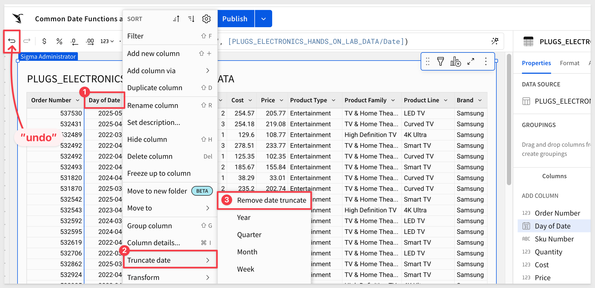

Click on the `Date` column down arrow and select `Format date`. This is another way to change how the `Date` column is displayed:

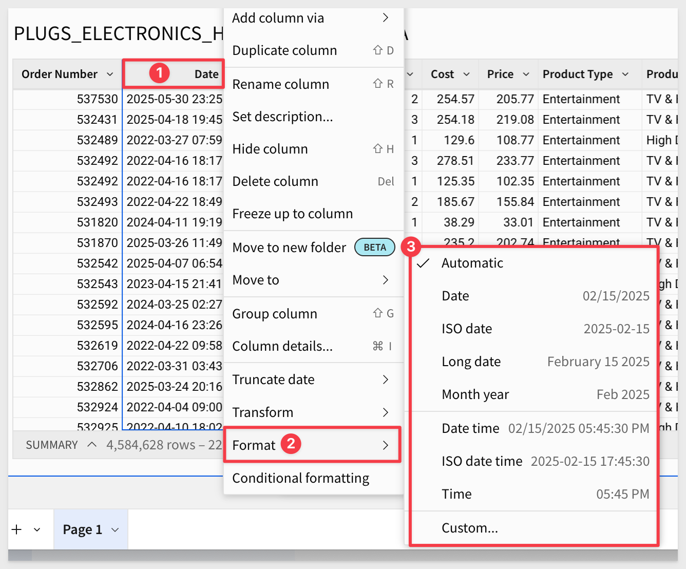

Feel free to experiment with the available options, resetting to the original when done.


<!-- END OF SECTION-->

## Custom Formatting
Duration: 10

Sigma supports applying custom formats to date columns. You can do this by selecting the `Date` column menu and then `Format` > `Custom`:


Entering the format string below will show a sample output in the popup:
```code
%a %B %d %Y
```

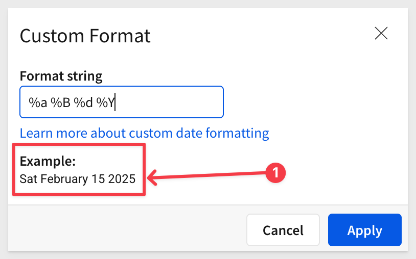

This helps confirm your format string is correct before applying it.

Feel free to experiment, then reset the `Date` column back to the default when done.

### The formula bar 
Another way to apply custom date formatting is by using the formula bar and the `DateFormat` function.

For example, you may want to get the full month name from a date column.

Create a new column by using the `Date` columns menu and selecting `Add new column`. Rename the new column `Month of Date`.

To make it clear for users, rename the `Date` column to `Original_Date`.

Click the `Month of Date` column, enter this formula into the formula bar and press enter.
```code
DateFormat(Date([Original_Date]), "%B")
```

This demonstrates how to use the formula bar to apply both a function (DateFormat) and a custom format string:

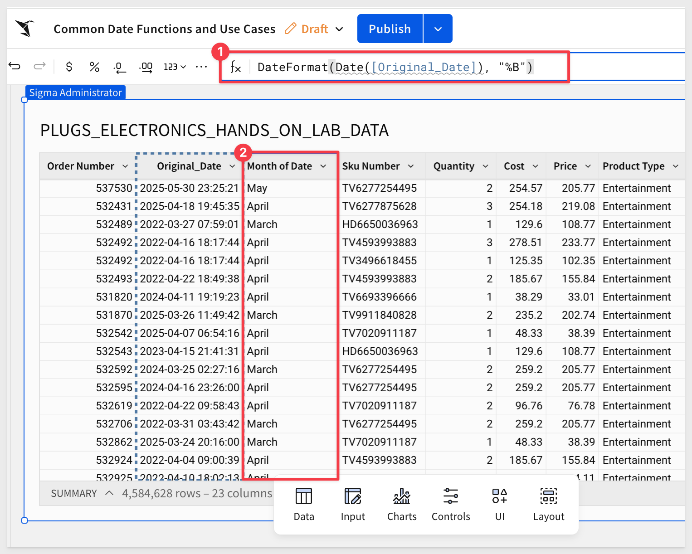

Here are a few other examples created using the same method—many more are possible:


For more information, see [Custom format strings](https://help.sigmacomputing.com/docs/define-custom-datetime-formats#custom-format-strings)


<!-- END OF SECTION-->

## Current / Previous Weekday
Duration: 10

Now that we’ve covered the basics, let’s apply what we’ve learned to a new use case.

For example, it’s often useful for users to know the `Effective Business Day` an order was placed. If an order is placed on a Saturday or Sunday, this column will show Friday as the effective day, helping analysts align reporting with standard business operations.

Undo any changes we made to our table, and then format the `Date` column to basic `Date` format:

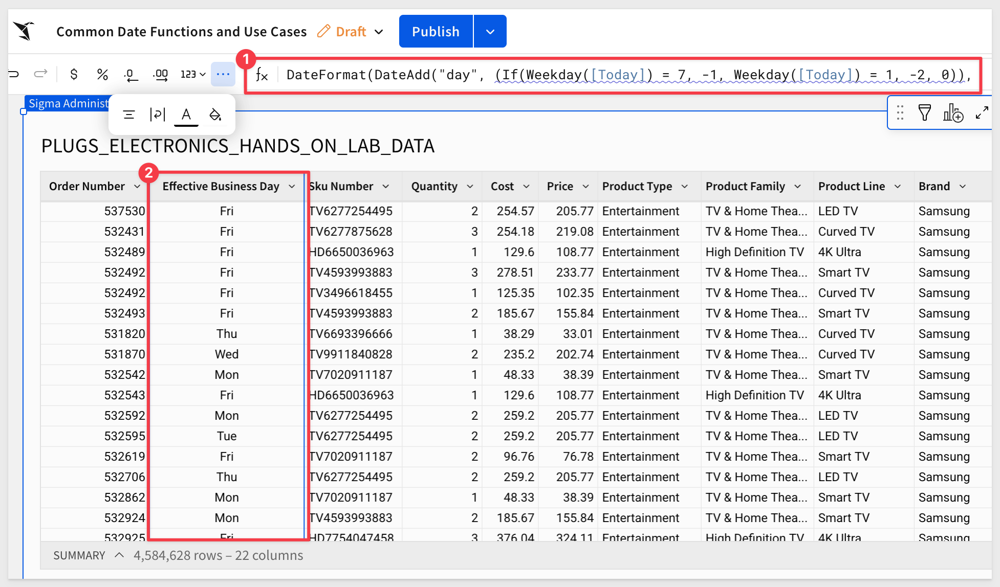

Rename the `Date` column to `Today` to make its purpose clearer to users.

Next, we want to display the weekday name for each value in the `Today` column.

Add a new column next to `Today`, and set its formula to:
```code
DateFormat(Date([Today]), "%A")
```

<aside class="negative">
<strong>NOTE:</strong><br> The %A in the formula returns the full weekday name from the date.
</aside>

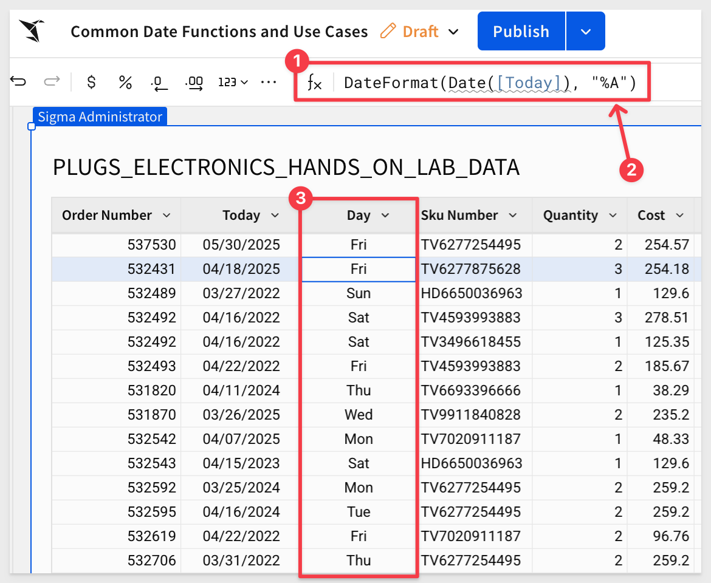

Now that we have the current weekday name, we can apply it to the use case.

Add another new column next to `Day` and use the following formula:
```code
DateFormat(DateAdd("day", (If(Weekday([Today]) = 7, -1, Weekday([Today]) = 1, -2, 0)), [Today]), "%A")
```

This formula returns the previous weekday name if today is Saturday (7) or Sunday (1); otherwise, it returns today’s name.

Then, hide the `Today` and `Day` columns, and rename the new column to `Effective Business Day`:


For more information, see [Define custom datetime formats](https://help.sigmacomputing.com/docs/define-custom-datetime-formats)

Click `Publish`.


<!-- END OF SECTION-->

## Time Between Dates
Duration: 10

s often useful to measure the time elapsed between two dates (or timestamps). Some examples are:

**Call Center Support:** Call duration<br>
**Customer Service:** Order fulfillment time<br>
**Healthcare:** Time since last blood test<br>

Let's take a look at the customer service use case.

Marketing is interested in targeting customers who purchase frequently but only has a table with all orders to start with.

They want to answer a few key questions:

 <ul>
        <li>When was a customer's first order?</li>
        <li>When was their second order?</li>
        <li>Number of days between the first and second order?</li>
        <li>How long since they last placed an order?</li>
        <li>Marketing will use this in campaigns targeting active and inactive customers.</li>
</ul>

We’ll continue using the `PLUGS_ELECTRONICS_HANDS_ON_LAB_DATA` table, but this time we’ll create a child table.


<aside class="positive">
<strong>IMPORTANT:</strong><br> Child tables let us manipulate source data without modifying the original table. Another major benefit is that data is only fetched from the warehouse once, saving time and warehouse costs too.
</aside>

Rename the child table `Time Between Dates` and move it to a new workbook page:

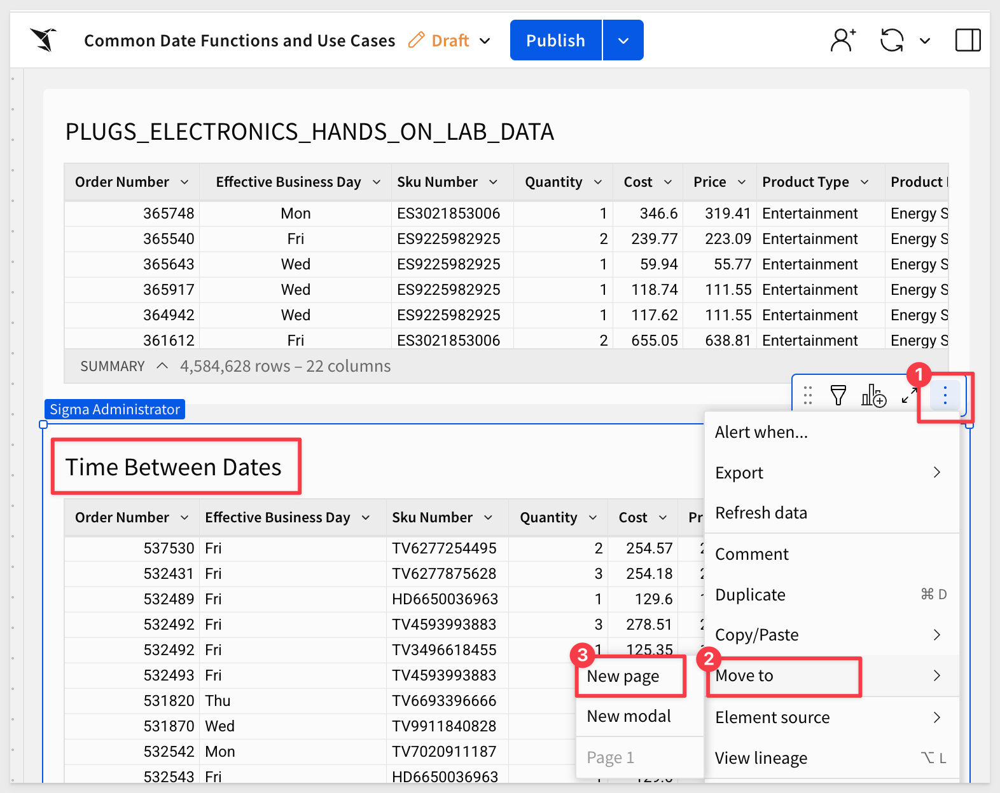

Rename the new workbook page `Time Between Dates`.

We only need a few columns including the `Today` column but that is hidden from our last section. No problem—it’s still available in the child table, and we can make it visible:

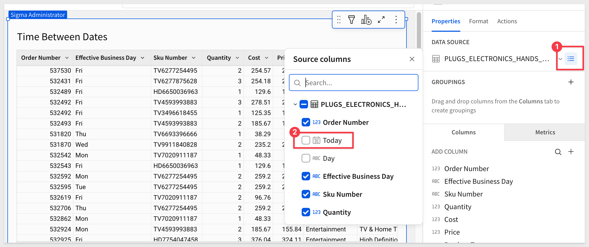

Since we don’t need most columns in the child table, we can delete them, leaving only the `Customer Name` and `Today` columns.

Using the `Element panel`, move the `Customer Name` and `Today` columns to the top of the list and then select all others and click `Delete 21 columns`:

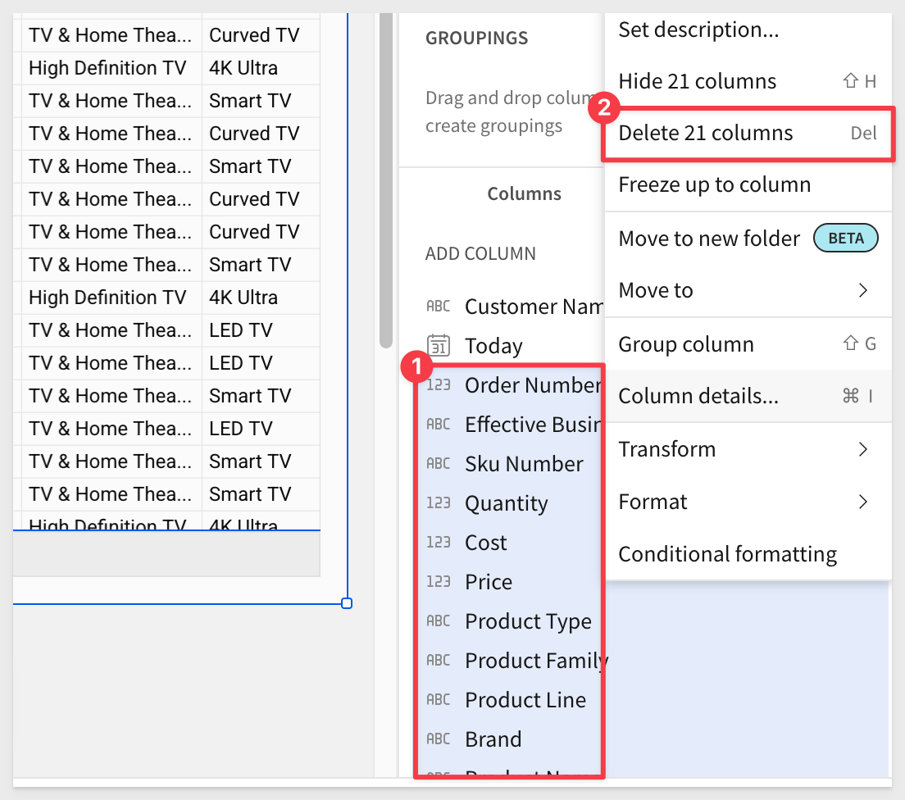

Drag the `Customer Name` column to `GROUP BY`.

<aside class="positive">
<strong>IMPORTANT:</strong><br> Our flat dataset contains customer orders, where a single order may include multiple items. To avoid counting the same order multiple times, we want to group by the order day. This allows us to perform accurate date-based calculations. Without this grouping, the table would contain multiple rows per day for the same order—something Marketing specifically wants to avoid.
</aside>

Drag the `Customer Name` column to `GROUPINGS` to create a new group.

To simplify the view, filter the data where `Customer Name = Leah Douglas`:

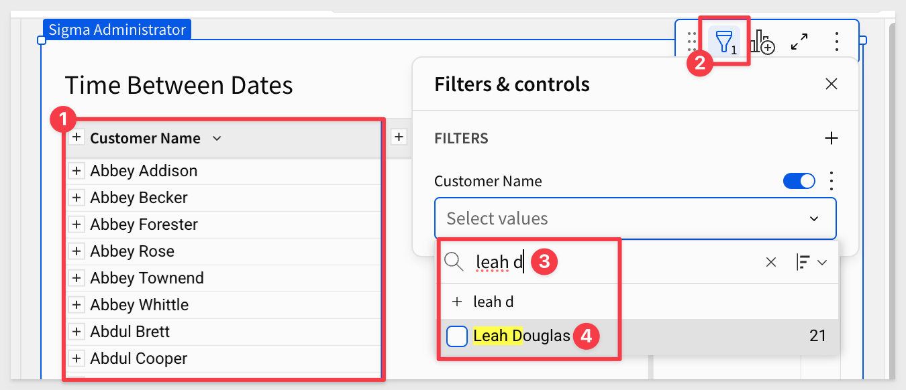

The table should now look like this:


Add a new column next to `Customer Name` and rename it to `First_Order`.

For `First_Order` set the formula to:
```plaintext
Min([Today])
```

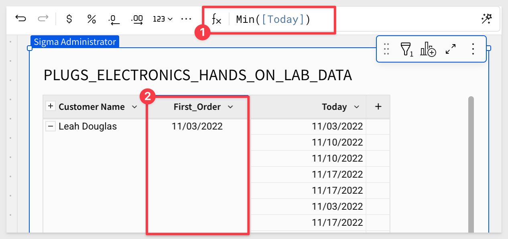

Now add four more columns, renaming them and applying the following formulas:

<aside class="negative">
<strong>PRO TIP:</strong><br> Use keyboard shortcuts to save time. For example, use "Shift +"  to add a new column.
</aside>

For more information, see [Keyboard shortcuts: Microsoft Windows](https://help.sigmacomputing.com/docs/keyboard-shortcuts-microsoft-windows) or [Keyboard shortcuts: Mac OS](https://help.sigmacomputing.com/docs/keyboard-shortcuts-mac-os)

```code
Column Name:                    Formula:
Second_Order                    Nth([Today], 2)
Last_Order                      Max([Today])
Days_1st_to_2nd_Order           DateDiff("day", [First_Order], [Second_Order])
Days_Since_Last_Order           DateDiff("day", [Last_Order], Today())
```

Hide the `Today` column.

The table should now look like this:


Go ahead and disable the filter.

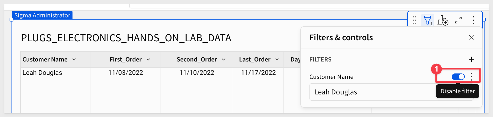

Marketing now has the data they requested:

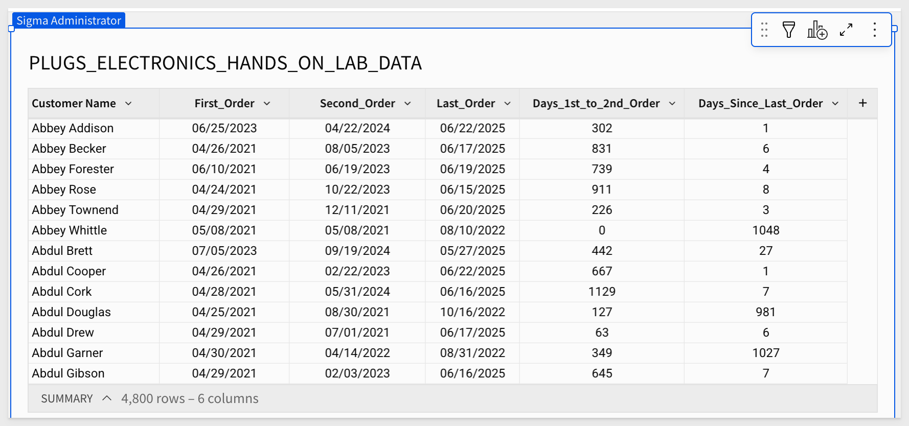


<!-- END OF SECTION-->

## Week over Week
Duration: 10

Sales Operations wants to see how weekly sales numbers look compared to the previous week.

Let’s use this example to explore Sigma’s `Lead` and `Lag` functions. These functions make this type of comparison surprisingly easy.

In this example, we’ll approach the data a bit differently this time. Create another Workbook Page and rename it `Week Over Week`.

Add a table to the page, and this time select `F_Sales` from the `Sigma Sample Database`.

This gives us all the sales transactions.

Next, we’ll join another table to bring in point-of-sale data.

Click the `3-dot menu` on the `F_Sales` table and select `Element Source` and then `Join`:


Search for and select `F_Point_of_Sale` from the `RETAIL` schema and select only the `Sales Amount` column.

<aside class="positive"><strong>IMPORTANT:</strong><br> Bring only the columns you need to save compute costs and performance. You can easily add columns back later if needed.</aside>

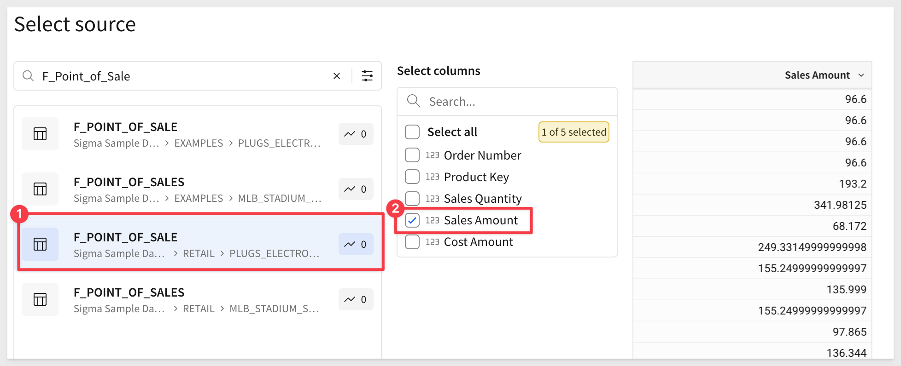

Now choose the type of join and identify the join keys (matching columns from each table).

<aside class="negative"><strong>NOTE:</strong><br> Sigma's advanced functionality is able to pre-configure the join for you and show you the results, saving you time.</aside>

Since we’re joining the two tables on `Order Number`, we have a 100% match. This works because every sale must have an order number, so it exists in both tables.

<aside class="postive"><strong>IMPORTANT:</strong><br> SQL joins can be confusing if you don't work with them often. Sigma makes it easy to see the impact of a join and get it right the first time.</aside>

For more information, see [Join types](https://help.sigmacomputing.com/docs/join-types)


Click Preview output. Sigma shows the tables lineage. This allows us to see how our table was constructed, which columns are selected and more. We could also join more tables from here:

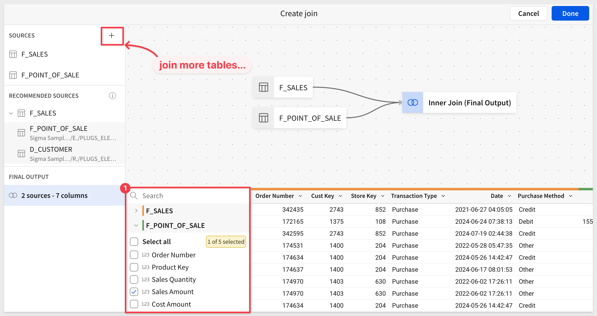

For more information, see [View workbook and data model data lineage](https://help.sigmacomputing.com/docs/workbook-data-lineage)

Click `Done`, and rename the table `Week_over_Week_Sales`.

Drag the `Date` column to `Groupings` and truncate it to `Week`.

Hide the `Order Number`, `Date` and `Sales Amount` columns:


Drag the `Sales Amount` column to `Calculations`, rename it to `Weekly_Sales` and set the format to `currency`:


Add two calculated columns using the `+` icon in the `CALCULATIONS` panel. Rename each and set the formulas to:
```code
Column:                         Formula:
Sales_Lag_1_Week      [Weekly_Sales] / Lag([Weekly_Sales], 1)
Sales_Lead_1_Week     [Weekly_Sales] / Lead([Weekly_Sales], 1)
```

Format the `Lead/Lag` columns as percentages and sort the `Week of Date` column in descending order:


<aside class="negative"><strong>NOTE:</strong><br> The most current week will show null as there is no data for the future week yet.</aside>

For more information, see [Lead](https://help.sigmacomputing.com/docs/lead)

Sales Operations can now compare weekly sales performance at a glance.

This use case could also be solved using Sigma’s `DateLookback` function. The `DateLookback` function returns the value of a variable at a previous point in time (or lookback period) determined by a specified date and offset.

We will use `DateLookback` in the next section.


<!-- END OF SECTION-->

## Year over Year
Duration: 10

Viewing data organized `year over year by month` helps users understand business performance in use cases like seasonality. It allows users to see whether performance is improving, flat, or declining year over year.

Now that we've learned how to navigate Sigma, we’ll move a bit faster.

Since we’ll reuse the `Page 1` source, rename the page to `Data`.

Add a new workbook page and add another child of the `PLUGS_ELECTRONICS_HANDS_ON_LAB_DATA` table to it.

Rename the page `Year over Year` and the table to `Year_Over_Year_by_Month`.

Add the `Today` column back as we did in the last section.

Start by hiding all columns. Use `Shift + Click` to select the first and last, then click `Hide column`.

Now we have lots of columns to work with but none are displayed:

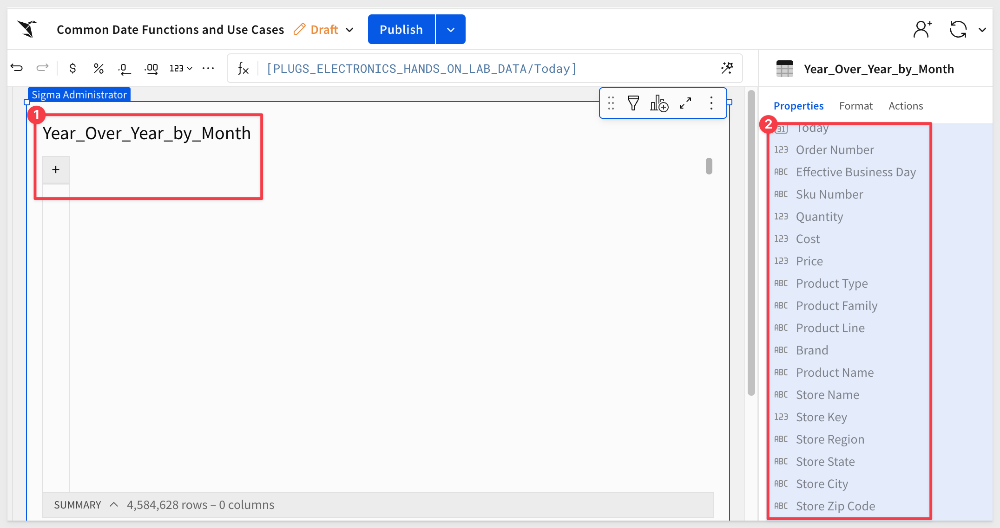

Add a new grouping by clicking the `+` next to `GROUPINGS` and selecting the `Today` column.

Set the formula for the `Day of Today` column to:
```code
DateFormat(Date([Today]), "%m")
```

Rename this column `Month_Number` and set its sort order to `Ascending`. 

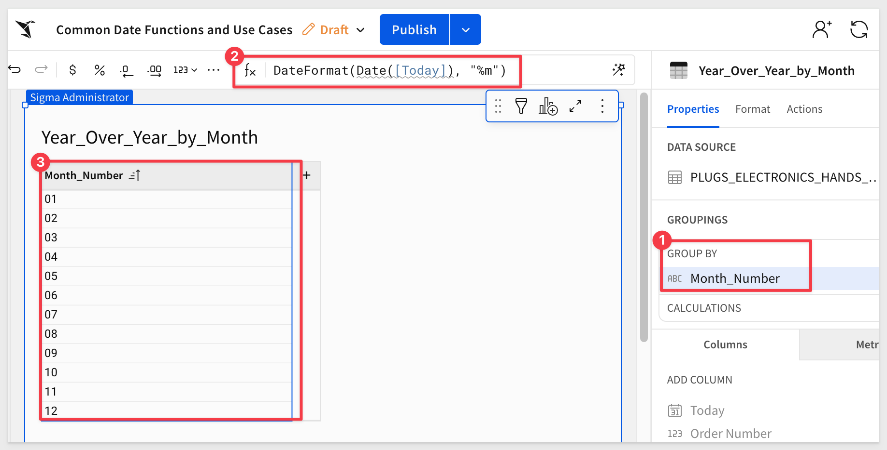

Add another `GROUPING` selecting the `Today` column again. 

Set the new column's formula to:
```code
DateTrunc("year", [Today])
```

Rename the column `Year`:

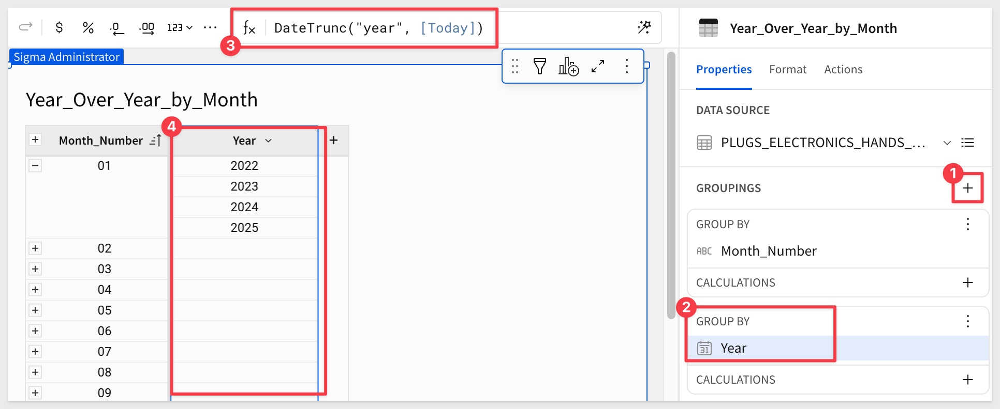

Add a new calculation by clicking the `+` next to `CALCULATIONS` in the `Year` grouping, and select `New column`:
```code
Sum([Quantity] * [Price])
```

Format the column as currency.

The table should now look similar to this (after collapsing/expanding and formatting):

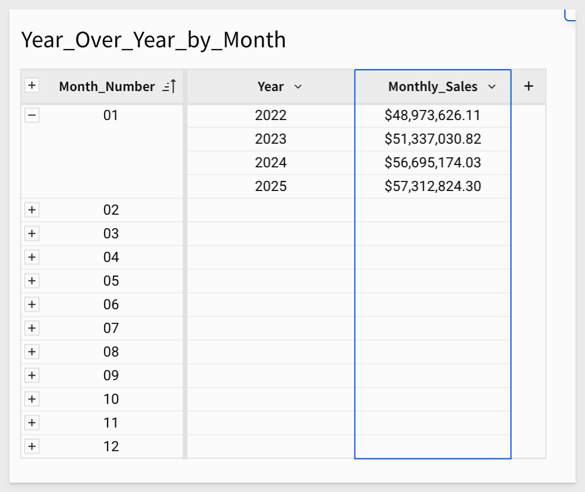

Add a new `CALCULATION` by clicking the `+` to the right of `CALCULATIONS` in the `Year` grouping and select `New column`.

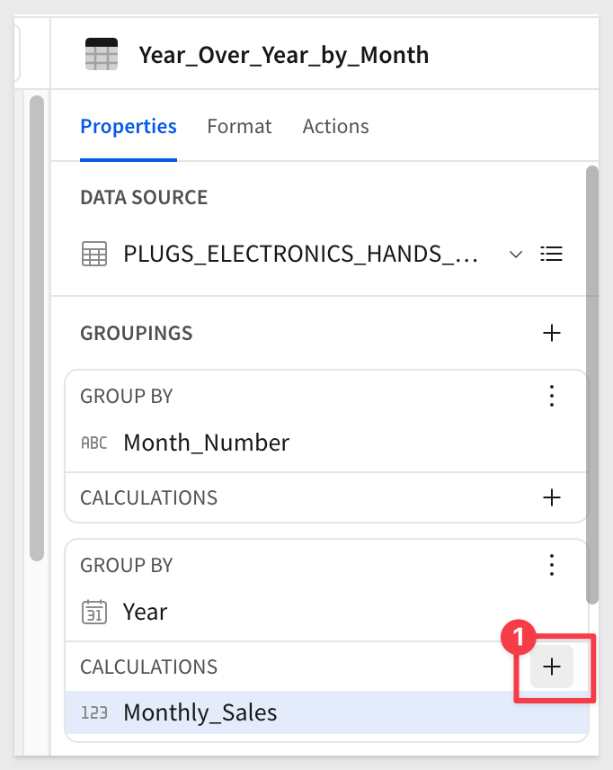

Configure the new column as shown below:
```code
Column Name:       Formula:
Previous_Year      DateLookback([Monthly_Sales], [Year], 1, "year")
```

Now we can calculate the year over year percentage difference for each month.

Add another new `CALCULATION` column to the same grouping and configure it using:
```code
Column Name:      Formula:
% Change          ([Monthly_Sales] - [Previous_Year]) / [Previous_Year]
```

Set the column's format to `Percentage`.

Now we can start to see trends in the data.


For more information, see [DateLookback](https://help.sigmacomputing.com/docs/datelookback)

Click `Publish`.


<!-- END OF SECTION-->

## InDate Range
Duration: 10

The `InDateRange` function provides a succinct way to write calculations such as `last year` or `this year`. It also simplifies more complex calculations, making them shorter and easier to read. While there are other ways to solve this, let’s explore a different approach using `InDateRange`.

What's differnt with the `InDateRange` function is that it will return `True` or `False` based on its configuration. The table can then be filtered based on an `InDateRange` column being `True` or `False`.

For example, we may want to see how sales this year compare with last year, side by side.

Create a new page and rename it to `InDate Range`.

Add another child of the `PLUGS_ELECTRONICS_HANDS_ON_LAB_DATA` table and move it to the new page. 

Rename the table `Sales_Comparison`.

Add the `Today` column back to the table. 

<aside class="negative">
<strong>NOTE:</strong><br> We’ve had to add this column back a few times. Perhaps we should have included it in the source table on the Data page? That’s easy enough to fix—and probably not the last time we realize we need a column after building downstream!
</aside>

Add a new column using this configuration:
```code
Column Name:      Formula:
Week              DatePart("week", [Today])
```

Add another new column using this configuration:
```code
Column Name:      Formula:
Sales_Amount     [Price] * [Quantity]
```

Hide this column.

Next, use the `InDateRange` function to create four new columns.

For each of the following new columns, use the following configuration:
```code
Column Name:              Formula:
isCurrent_Year            InDateRange([Today], "current", "year")
isLast_Year               InDateRange([Today], "last", "year")
This_Year_Sales_Amount    SumIf([Sales_Amount], [isCurrent_Year])
Last_Year_Sales_Amount    SumIf([Sales_Amount], [isLast_Year])
```

The table should now look like this. Notice that sales amount values only appear for the current and previous years. All others are null:

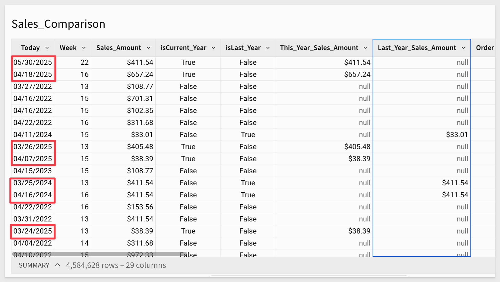

Instead of filtering the table to show only rows for the current and previous years, let’s use a pivot table.

Add a child pivot table:

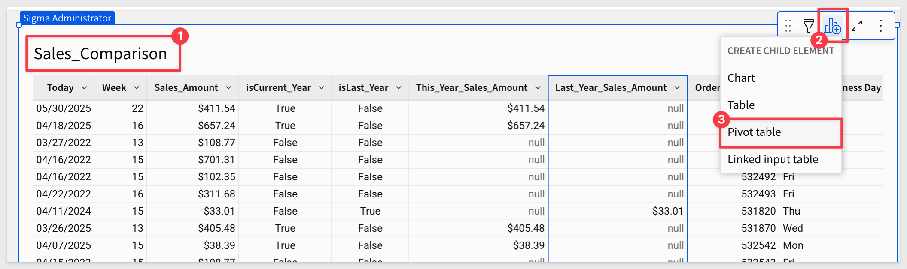

Configure the pivot table as shown below and rename it `Sales - This Year vs. Last`:

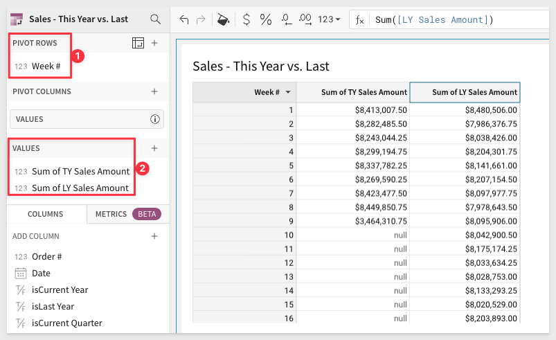

From here we can start to dig deeper into the analysis by calculating sales changes or adding visualizations.

For more information, see [InDateRange](https://help.sigmacomputing.com/docs/indaterange)


<!-- END OF SECTION-->

## Lookups
Duration: 10

In this example, we’ll demonstrate how to use data from one table in another using a Lookup.

Imagine two tables contain useful columns that are missing from a third table. To enrich the third table, we can use a `Lookup` to bring in those missing columns.

Lookups work by matching rows based on shared values between two columns—one from each table. These columns are known as join keys and we will simulate how this works using our existing sample data.

Add a new workbook page and place another child of the `PLUGS_ELECTRONICS_HANDS_ON_LAB_DATA` table from the `Data` page to it.

Another way to do this is to add a new `Table` from the `Element bar` and set the source as shown:

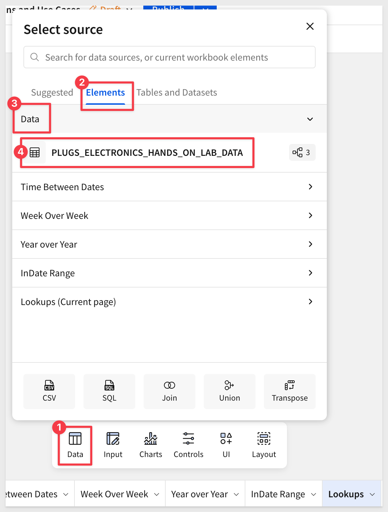

Rename the page `Lookups` and the table to `Regional_Sales_Performance`.

Add the `Today` column back as we did in the last section.

Duplicate the table using the table menu.

Rename this duplicated table `Sales_This_Year`

On the `Sales_This_Year` table, hide all the columns leaving only `Store Name`, `Store Region`, `Store Key`, and `Today`.

Add a new column, rename it `Total_Sale` and set its formula to:
```code
[Price] * [Quantity]
```

Your page should now look like this:


Filter this table to show only orders from this year (click the drop-down arrow on the `Today` column and select `Filter`):


On the `Regional Sales Performance` table, we want to group on the `Store Region` column.

Now add a new column via lookup:


You will be prompted to set how the two tables will be joined. Use this configuration:

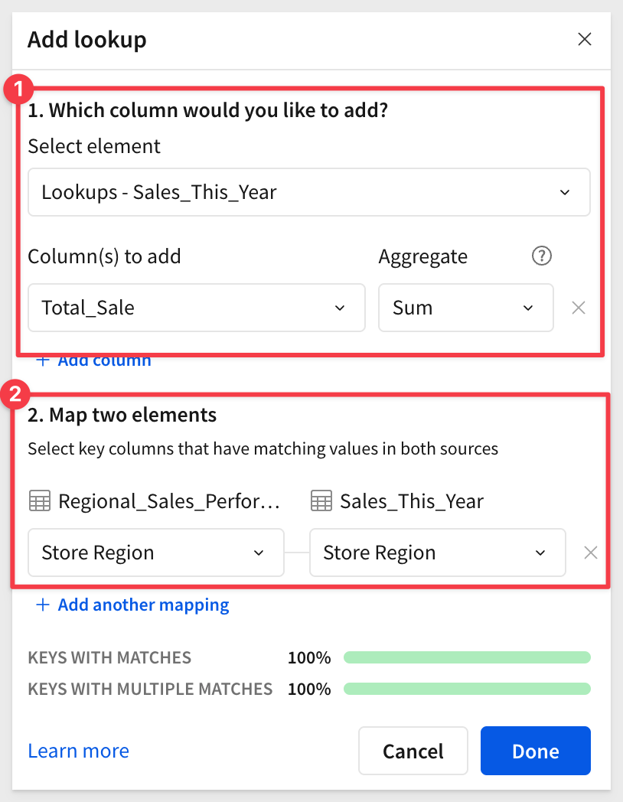

Now drag the new lookup column to the `Calculations` section of the `Store Region` grouping:

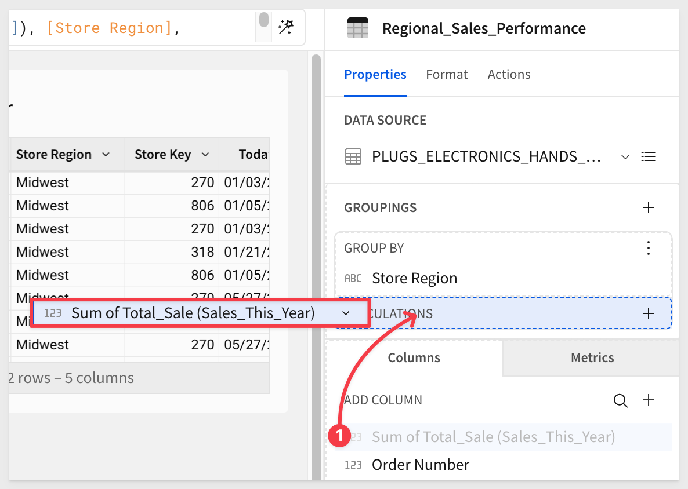

Now let’s get last year’s sales. Duplicate the `Sales_This_Year` table:

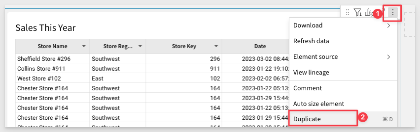

Rename the table to `Sales_Last_Year`.

Change the filter to use last year as the range:

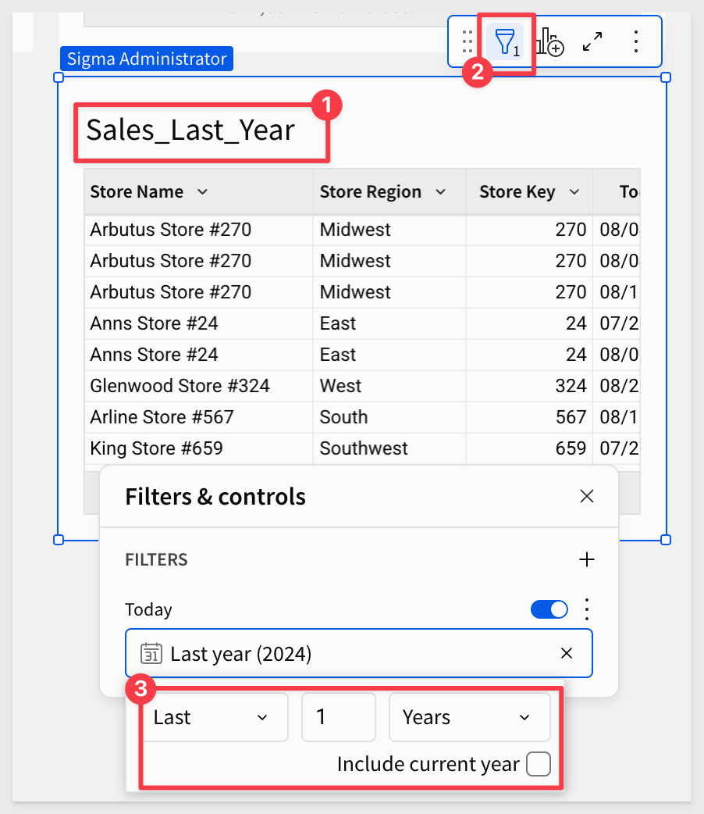

The page should now look like this (after rearranging elements as needed):


Now add another lookup column to the `Regional_Sales_Performance` table, using `Sales_Last_Year` as the source.

The only configuration difference is the source table as shown:

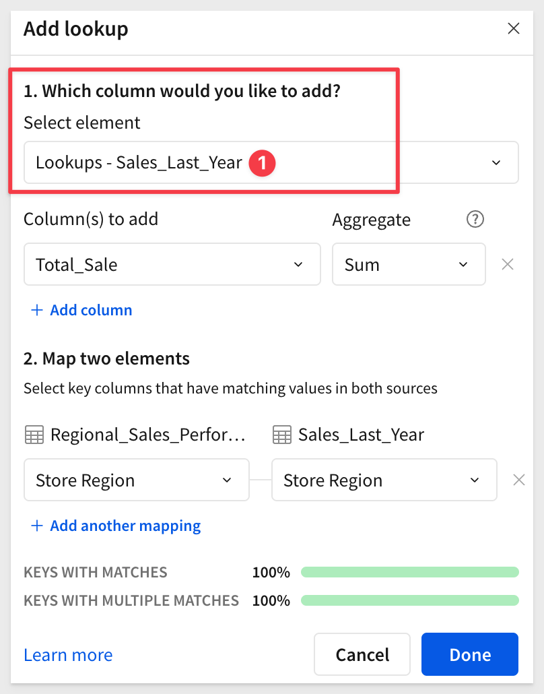

Drag this new column into the `Calculations` section—and we’re done. We now have both last year’s and this year’s sales by store region, with full detail.

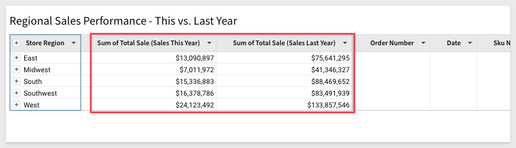

<aside class="positive"><strong>IMPORTANT:</strong><br> Lookups can be very powerful and this was a basic example so that you can see the workflow against sample data you are already used to from other QuickStarts.</aside>

For more information, see [Add columns through Lookup](https://help.sigmacomputing.com/docs/add-columns-through-lookup)


<!-- END OF SECTION-->

## InPrior Date Range
Duration: 10

The `InPriorDateRange` function is used to calculate values from a prior time period such as "This Week Last Year".

It returns a `Boolean` (True or False), which we can use to filter rows.

To speed things up, duplicate the `Lookups` page and rename the copy `InPrior_Date_Range`.

Rename the `Sales_This_Year` table to `Sales_In_Current_Quarter`. 

Also rename the `Sales_Last_Year` table to `Sales_Last_Year_Same_Quarter`.

In the `Sales_Last_Year_Same_Quarter` table, we want to filter the data to show only the rows from last quarter. We can do that by simply using the filters control:

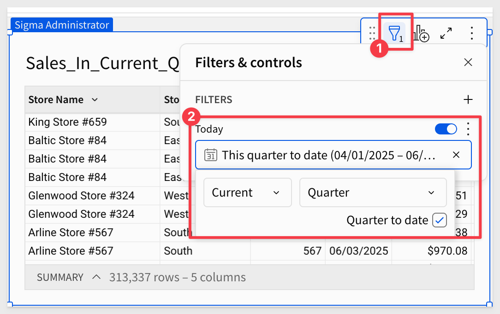

In the `Sales_Last_Year_Same_Quarter`, add a new column named `InPriorQuarter` and set its formula to:
```code
InPriorDateRange([Today], "quarter", "year")
```

This will evaluate the `Today` column and return `true` or `false` if the date is in the quarter, one year prior.

Next, update the table’s filters by adding a new one on the `InPriorQuarter` column and set it to show only rows where the value is `True`.

We can disable the filter for `Today` since our formula is providing the filter now: 

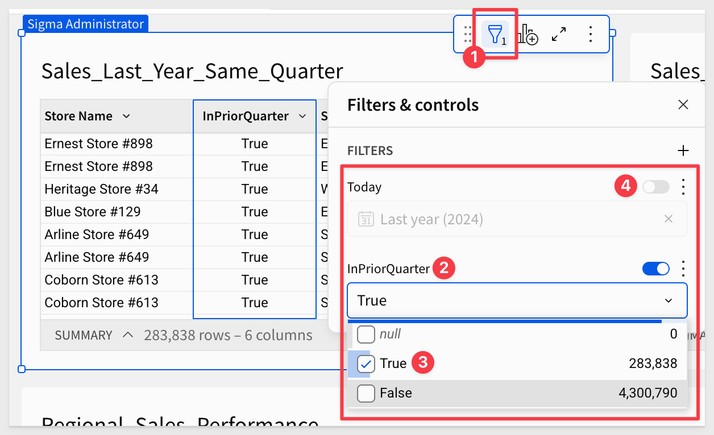

Since the `Regional_Sales_Performance` table already uses lookups to bring in the `Total Sale` column from both source tables, we don't have to do anything; the sales are summed and grouped already. 

We are done:


Compare these values to those on the `Lookups` page—you’ll see they are significantly lower.

<aside class="negative"><strong>NOTE:</strong><br> This is not the only way to achieve this outcome. You could get similar results using the "InDateRange" function, "filters" or other date functions too. Sigma is flexible and we want to get you thinking about possible options and how each may affect a use case.</aside>

<aside class="positive"><strong>BEST PRACTICE:</strong><br> When developing content on any platform, it’s important to consider the needs of future developers. Strive for simplicity and efficiency to ensure your work is easy to understand and maintain. Additionally, be mindful of the cost implications of your design—especially regarding warehouse storage and compute usage.</aside>


<!-- END OF SECTION-->

## Date Calendars - The Retail 4-5-4 Calendar
Duration: 10

Companies often use table-based calendars in analytics to help address data consistency, seasonality, and planning.

In this QuickStart step, we’ll build a pivot table that leverages the `NRF Retail 4-5-4 Calendar` combined with our `Plugs Electronics` sample data to analyze same-store sales the way most retailers prefer. These same general methods apply to any table-based calendar you use.

The NRF Retail 4-5-4 Calendar is a standardized retail calendar developed by the National Retail Federation (NRF) to help retailers track and analyze their sales performance. It is widely used by retailers in the United States, and it is particularly useful for businesses that operate on a fiscal year that does not align with the traditional calendar year. The calendar helps retailers plan their inventory, staffing, and marketing strategies based on historical sales data and seasonal trends.

<aside class="negative">
<strong>NOTE:</strong><br> Please refer to the NRF website for the most recent versions of the calendar. This example calendar used here may not represent a current version.
</aside>

For more information, see [NRF 4-5-4 Calendar](https://nrf.com/resources/4-5-4-calendar)

Add a new workbook page, and this time, add the `PLUGS_ELECTRONICS_HANDS_ON_LAB_DATA` table by selecting it from the sample database instead of the `Data` page:

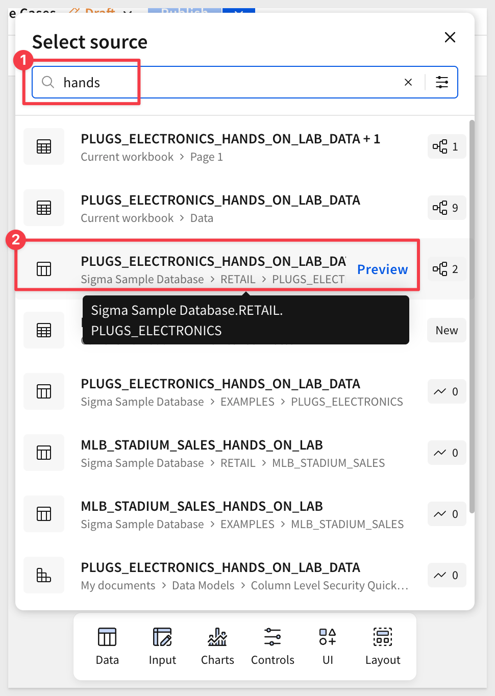

Rename the page `Date_Calendar`.

Rename the table to `Same_Store_Sales`.

Add a new column, rename it to `Order_Value` and use this formula:
```code
[Quantity] * [Price]
```

Create a new join:

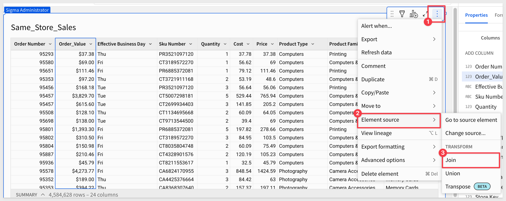

Search for the `4_5_4_CALENDAR` in the `RETAIL` schema and select it:


We are now presented with a screen that allows us to adjust how the two tables are joined. We need to adjust the join to use the `Date` and `Today` columns

If we look closely at the join results we can see there is a mismatch; the timestamps are causing a problem:


Joining on mismatched data types can cause issues, but Sigma supports formula-based joins to correct the issue.

To handle the datatype issue, we will use a formula for each join key:

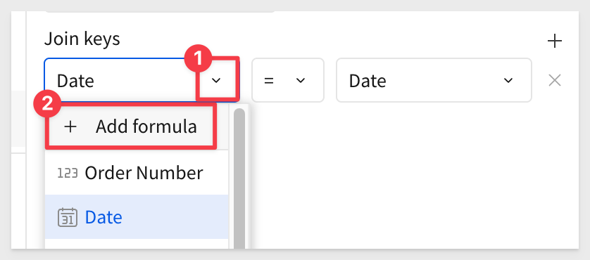

Apply this formula to both join keys:
```code
DateTrunc("day", [DATE])
```

After making the changes, you should have many matches. It won’t be a 100% match, as some values in the Plugs table that are not in the 4-5-4 table.

Click `Preview Output` and `Done`.

Now, create a child of this table and select `Pivot Table` as the type:


Rename the pivot table to `Same_Store_Sales_454_Calendar`.

Configure the pivot table as shown below:


Let’s say we want to see same-store sales for Thanksgiving. The `Fiscal Day of the Year` value according to the 4-5-4 Calendar is `299` in week `43`.

We can add a list page control to the page:

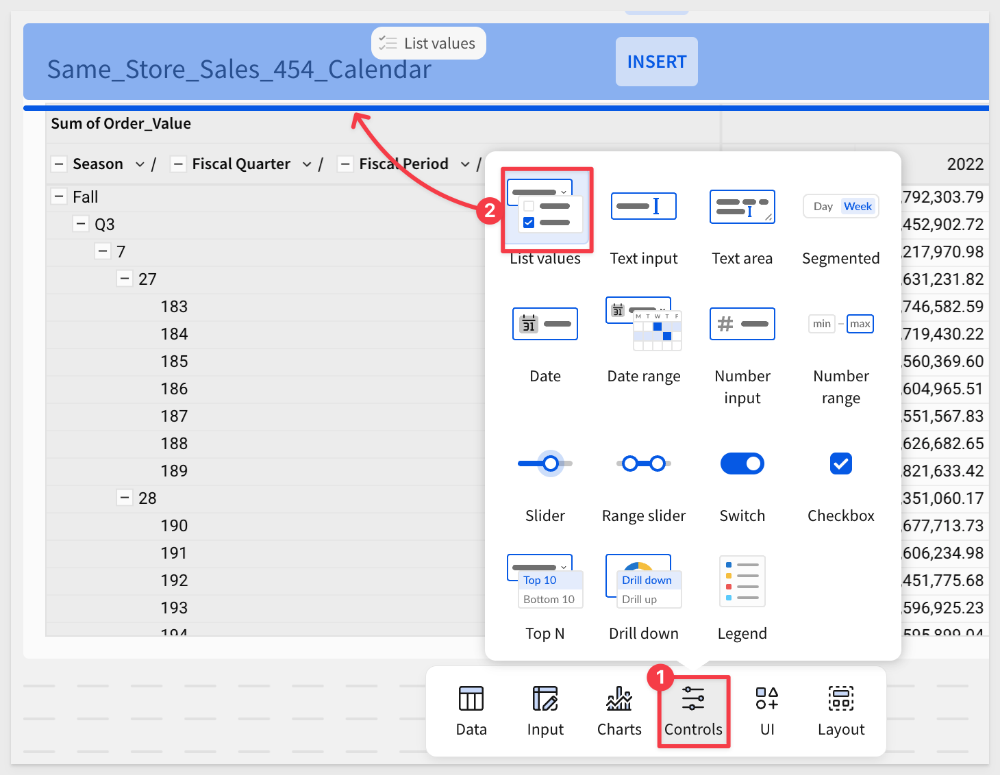

Configure it to filter based on the `Fiscal Week`:

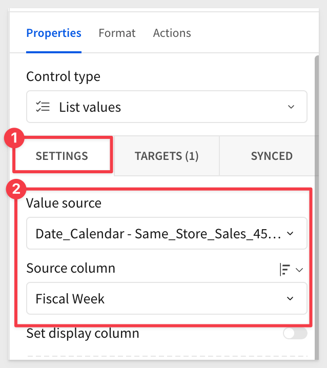

And set its target to `Fiscal Week`:


<aside class="negative">
<strong>NOTE:</strong><br> We used "Fiscal Week" so we can see the days leading up to holidays too.
</aside>

Use the control to find week 43:


Click `Publish`.

Of course, we could make this more user-friendly by making a control that shows major holidays by name and other improvements but that is outside the scope of this QuickStart.

[NRF Calendar](https://nrf.com/resources/4-5-4-calendar)


<!-- END OF SECTION-->

## What we've covered
Duration: 5

In this QuickStart, we explored many of the most commonly used date functions and the use cases where they’re applied. While not comprehensive, this guide highlights key patterns and techniques for working with dates in Sigma. There are many more ways to leverage dates—so keep exploring!

For more information, see [Function index](https://help.sigmacomputing.com/docs/function-index)

**Additional Resources:**

Be sure to check out all the latest developments at [Sigma's First Friday Feature page!](https://quickstarts.sigmacomputing.com/firstfridayfeatures/)

[Blog](https://www.sigmacomputing.com/blog/)<br>
[Community](https://community.sigmacomputing.com/)<br>
[Help Center](https://help.sigmacomputing.com/hc/en-us)<br>
[QuickStarts](https://quickstarts.sigmacomputing.com/)<br>
<br>

[](https://twitter.com/sigmacomputing)&emsp;
[](https://www.linkedin.com/company/sigmacomputing)&emsp;
[](https://www.facebook.com/sigmacomputing)


<!-- END OF WHAT WE COVERED -->
<!-- END OF QUICKSTART -->
