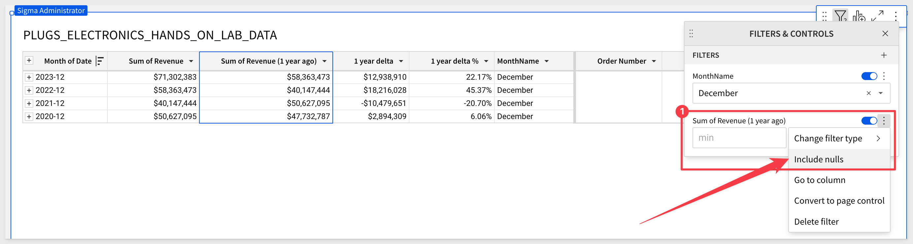

author: pballai
id: functions_period_over_period_analysis
summary: functions_period_over_period_analysis
categories: Functions
environments: web
status: Published
feedback link: https://github.com/sigmacomputing/sigmaquickstarts/issues
tags: default
lastUpdated: 2024-01-23

# Getting Started with Period Over Period Analysis in Sigma

## Overview 
Duration: 5 

Period over period (PoP) analysis, while conceptually straightforward, can be challenging for some people to understand and execute effectively. 

PoP analysis involves selecting two or more specific time periods and comparing key metrics or data points between these periods. These periods can be days, weeks, months, quarters, or years, depending on the context and objectives of the analysis.

It offers a structured approach to understanding data trends over time, which is crucial for any data-driven decision-making process. 

However, it's not just about comparing numbers. **It's about identifying trends, patterns, and changes over time and gaining insight into what drives changes in those numbers,** This can be invaluable in a variety of technical and business contexts.

This QuickStart **QS** will discuss typical use cases and demonstrate the methods in Sigma to create useful PoP analysis with ease.

### Target Audience
This QuickStart is designed for data analysts, business strategists, and marketing professionals who want to effectively utilize period over period analysis using Sigma.

### Prerequisites

<ul>
  <li>A computer with a current browser. It does not matter which browser you want to use.</li>
  <li>Access to your Sigma environment.</li>
  <li>Some familiarity with Sigma is assumed. Not all steps will be shown as the basics are assumed to be understood.</li>
</ul>

<aside class="postive">
<strong>IMPORTANT:</strong><br> Sigma recommends that you use non-production resources when doing QuickStarts.
</aside>

<button>[Sigma Free Trial](https://www.sigmacomputing.com/free-trial/)</button>
  
### What You’ll Learn
A basic understanding of PoP analysis and how to use Sigma effectively when creating content.


<!-- END OF OVERVIEW -->

## A Little More About PoP Analysis
Duration: 20

#### What is involved?
Period over period (PoP) analysis is a method of comparing metrics or data points across different, but comparable, time periods. 

In general, these factors require consideration when creating a PoP analysis:

 <ul>
      <li><strong>Comparative Analysis Over Time:</strong> PoP analysis involves selecting two or more specific time periods and comparing key metrics or data points between these periods. These periods can be days, weeks, months, quarters, or years, depending on the context and objectives of the analysis.</li>
      <li><strong>Consistent Time Frames:</strong> The periods compared should be of equal length and similarly positioned. For example, comparing Q1 of one year to Q1 of another year, or comparing the month of December across different years.</li>
      <li><strong>Metric Selection:</strong> The metrics compared can vary widely, from sales figures and website traffic to production costs and customer engagement metrics, depending on the industry and the specific questions being addressed.</li>
 </ul>

### Why PoP is important

 <ul>
      <li><strong>Trend Identification:</strong> PoP analysis helps identify trends over time, allowing technical professionals to see whether certain metrics are improving, declining, or remaining stable.</li>
      <li><strong>Seasonal Adjustments:</strong> It's crucial for understanding seasonal impacts on business or user behavior. For example, retail businesses often compare month-over-month (MoM) or year-over-year (YoY) sales to plan inventory and marketing strategies.</li>
      <li><strong>Performance Measurement:</strong> In a business context, PoP analysis is essential for assessing the effectiveness of strategies or initiatives. If a new marketing campaign was launched, comparing sales figures before and after the campaign can gauge its impact.</li>
      <li><strong>Forecasting and Planning:</strong> Understanding past trends is critical for accurate forecasting and strategic planning. PoP analysis provides a historical context that can inform future business decisions.</li>
      <li><strong>Anomaly Detection:</strong> It aids in identifying anomalies or outliers. A sudden spike or drop in a normally consistent trend can indicate an issue or an opportunity that might require further investigation.</li>
</ul>

As you can plainly see, gaining insights into what drives changes in the data over time is invaluable in a variety of technical and business contexts. This is why it so widely used across almost any industry.

#### Technical considerations
While it is tempting to just "jump right in" and start comparing values based on different time periods, there are some things to keep in ming at all times.

 <ul>
      <li><strong>Data Quality and Consistency:</strong> Ensure that the data is accurate and consistent across the periods being compared.</li>
      <li><strong>Normalization:</strong> Sometimes, data might need to be normalized to make fair comparisons, especially if there are changes in data collection methods or business processes.</li>
      <li><strong>Statistical Significance:</strong> When analyzing trends or changes, it's important to consider the statistical significance of the findings, especially in cases with large datasets. In other words, what change has meaningful impact to the business?</li>
      <li><strong>Visualization Tools:</strong> Utilizing appropriate data visualization tools can make it easier to spot trends and communicate findings to non-technical stakeholders.
</ul>

<aside class="positive">
<strong>IMPORTANT:</strong><br> Sigma addresses these areas by proving direct access to the data warehouse at massive scale, allowing users to drill anywhere in the data using a familiar spreadsheet interface. 
</aside>

### Common use cases
PoP is widely used across industries but these are the most common reasons why that is true.

 <ul>
      <li><strong>Trend Identification:</strong> For example, healthcare wants to know which patients receiving the same treatment are improving, declining, or remaining stable.</li>
      <li><strong>Seasonal Adjustments:</strong> For example, retail businesses often compare month-over-month (MoM) or year-over-year (YoY) sales to plan inventory and marketing strategies.</li>
      <li><strong>Performance Measurement:</strong>  If a new marketing campaign was launched, comparing sales figures before and after the campaign can gauge its impact.</li>
      <li><strong>Forecasting and Planning:</strong> Sale management always wants to know where products are selling well (or not), and make adjustments accordingly to staffing levels.</li>
      <li><strong> Anomaly Detection:</strong> Product managers might react to a sudden spike or drop in a normally consistent item. This can indicate an issue or an opportunity that might require further investigation.</li>
</ul>

There really is no end to the ways companies need to leverage PoP analysis. 

The common thread is always to identify a meaningful change, and react to it as fast as possible, in order to operate efficiently and drive better outcomes. 


<!-- END OF SECTION-->

## PoP in Sigma
Duration: 20

Sigma provides users of different skill levels the benefit of two ways to create PoP analysis. For less technical users, we provide a "wizard-based" interface that makes creating PoP analysis a breeze. For the more technical users, we provide all the functions and tools to create any PoP analysis they may want. 

Which route you choose is up to you and we will show example of both to help you see the difference.

### Sample Data
For both methods, we will use the `PLUGS_ELECTRONICS_HANDS_ON_LAB_DATA` table which is made available to all customers via the `Sigma Sample Data` connection. 

If you are unsure how to build a workbook based on this data, please review the [QuickStart: Fundamentals 1: Getting Around.](https://quickstarts.sigmacomputing.com/guide/fundamentals-1-getting-around/index.html?index=..%2F..index#4)

We also need to calculate the line item `Revenue`, as this table does not supply. This is really simple to do in Sigma:

Columns can be added by clicking the `+` in the `Element Panel` / `Columns` sidebar but we prefer to click the column we want to create the new column next to. For example, to create the new column to the right of the `Date` column:


Rename this columne to `Revenue` and set it's formula to:
```code
[Price] * [Quantity]
```


Save your workbook.

### Sigma's PoP Wizard
Sigma’s guided workflow for building period-over-period analyses provides a quick and convenient way to evaluate performance over time. 

It allows users to generate dynamic period comparisons **without entering complex custom formulas,** then easily visualize the results to identify trends, patterns, and anomalies.

<aside class="negative">
<strong>NOTE:</strong><br> PoP features can be used in tables, pivot tables, and visualizations.
</aside>

For this example we are interested in holiday sales in December, over time. To do this, we will use Sigma's PoP wizard to create a grouped table that shows the revenue, amount of difference, and percentage change year over year.

Open the `Revenue` column's menu and select `Add column via` > `Period over period comparison...`:


We are presented the PoP Wizard where we can configure for the output we are interested in. In this case, we want to sum revenue, using the date column and compare the `Same month last year`:


To read more about all the options that are available, and there are many, refer to [Sigma's documentation on PoP analysis.](https://help.sigmacomputing.com/docs/create-and-edit-period-over-period-analysis)

Three calculations are created for us by the wizard (number 1 in the screenshot) and the table is grouped by `Date` for us too:


This gets us close to what we wanted but we are showing all the months for each year and we only really wanted `December` sales.

A simple way to achieve this is to add a column for `MonthName` (anywhere in the table really), and set the formula to:
```code
MonthName([Date])
```

This will provide the name of the month for each row, based on the `Date` column:


Now we simply set a new filter on the `MonthName` column to only show December:


Since `2019` is the last year, there are `nulls` in the data because there is no data from `2018` (in this example). We filter on one of the columns having a null value and uncheck the check from `Include nulls`:

<aside class="positive">
<strong>IMPORTANT:</strong><br> Your text here.
</aside>

<aside class="positive">
<strong>IMPORTANT:</strong><br> Sigma's sample data shifts dates automatically as each year passes in order to keep the data "current". Please make note of that if you see some discrepancies between what your sample data shows and what the screenshots in QuickStart show. 
</aside>

We now have our analysis and can easily further manipulate it or build child visualizations from this base table.

We added a simple conditional formatting to negative value cells:


<!-- END OF SECTION-->

## PoP without the Wizard
Duration: 20


<!-- END OF SECTION-->


## What we've covered
Duration: 5

In this lab we learned how to.........

**Additional Resource Links**

[Blog](https://www.sigmacomputing.com/blog/)<br>
[Community](https://community.sigmacomputing.com/)<br>
[Help Center](https://help.sigmacomputing.com/hc/en-us)<br>
[QuickStarts](https://quickstarts.sigmacomputing.com/)<br>

Be sure to check out all the latest developments at [Sigma's First Friday Feature page!](https://quickstarts.sigmacomputing.com/firstfridayfeatures/)
<br>

[](https://twitter.com/sigmacomputing)&emsp;
[](https://www.linkedin.com/company/sigmacomputing)&emsp;
[](https://www.facebook.com/sigmacomputing)


<!-- END OF WHAT WE COVERED -->
<!-- END OF QUICKSTART -->