author: pballai
id: functions_popular_functions
summary: functions_popular_functions
categories: Functions
environments: web
status: Published
feedback link: https://github.com/sigmacomputing/sigmaquickstarts/issues
tags: default
lastUpdated: 2025-12-05

# Popular Functions

## Overview
Duration: 5

Sigma provides over 200 functions that enable you to transform, calculate, and analyze data directly in your workbooks. 

This QuickStart focuses on some of the most frequently used functions, demonstrating practical applications through hands-on examples using sample retail data.

You'll learn how to categorize values, handle null data, filter and search text, enrich datasets with lookups, calculate percentages, parse patterns, analyze hierarchies, and implement conditional logic—all essential skills for building powerful analytics in Sigma.

### Template
We have also made the final workbook that is created during this QuickStart available as a Sigma Template. This option. allows you to read along while having the workbook built for you. The template is not required and the end result is the same if you build it yourself. 

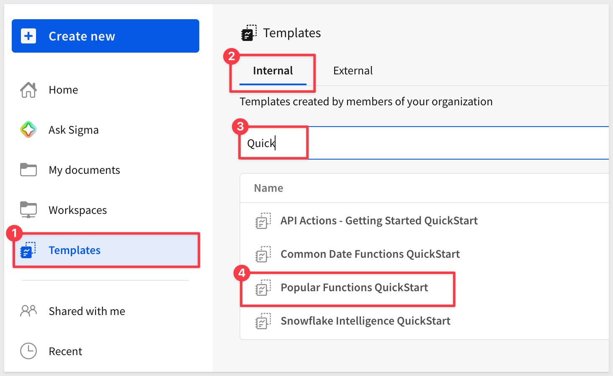

<aside class="positive">
<strong>IMPORTANT:</strong><br> Some screens in Sigma may appear slightly different from those shown in QuickStarts. This is because Sigma continuously adds and enhances functionality. Rest assured, Sigma’s intuitive interface ensures that any differences will not prevent you from successfully completing any QuickStart.
</aside>

For more information on Sigma's product release strategy, see [Sigma product releases](https://help.sigmacomputing.com/docs/sigma-product-releases)

If something doesn’t work as expected, here's how to [contact Sigma support](https://help.sigmacomputing.com/docs/sigma-support)

### Target Audience
The typical audience for this QuickStart includes users of Excel, common Business Intelligence or Reporting tools, and semi-technical users who want to try out or learn Sigma.

### Prerequisites

<ul>
  <li>Any modern browser is acceptable.</li>
  <li>Access to your Sigma environment.</li>
  <li>Some familiarity with Sigma is assumed. Not all steps will be shown, as the basics are assumed to be understood.</li>
 </ul>

<aside class="positive">
<strong>IMPORTANT:</strong><br> Sigma recommends using non-production resources when completing QuickStarts.
</aside>

<button>[Sigma Free Trial](https://www.sigmacomputing.com/free-trial/)</button>

<aside class="negative">
<strong>IMPORTANT:</strong><br> Some features may carry a "Beta" tag. Beta features are subject to quick, iterative changes. As a result, the latest product version may differ from the contents of this document.
</aside>
 

<!-- END OF OVERVIEW -->

## Data Page Setup
Duration: 5

Log into Sigma, click `Create new` and select `Workbook`.

From the `Element bar`, under the `Data` group, place a new `Table` on the page.

In the `Select source` modal, search for `Hands` and select the `PLUGS_ELECTRONICS_HANDS_ON_LAB_DATA` table from the `RETAIL` database:

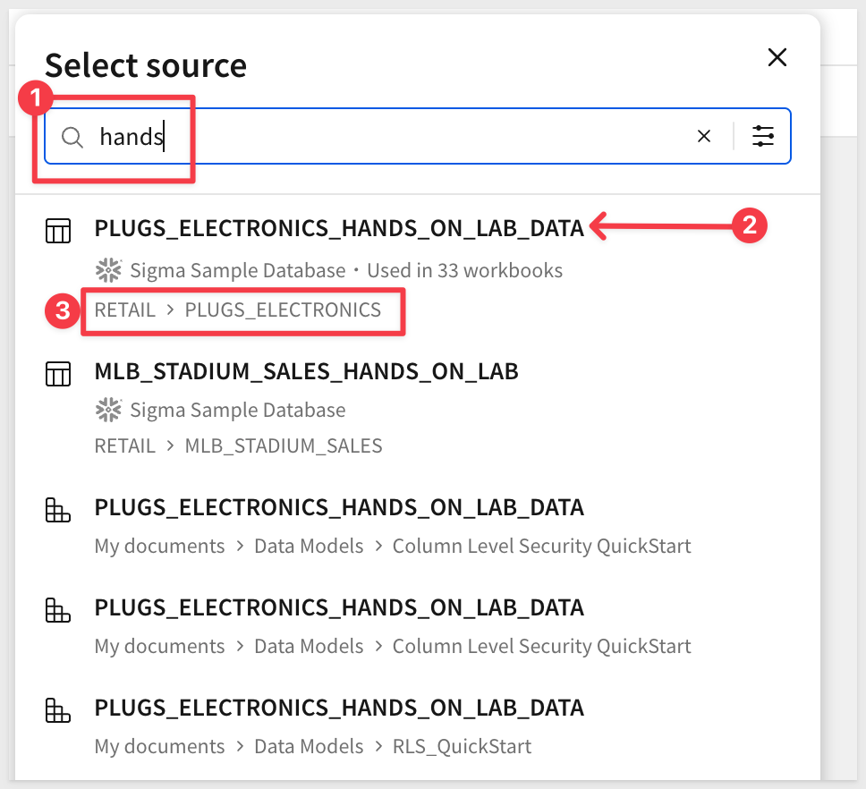

Rename the page `Data`.

We will use this table multiple times by creating child tables from it to use on other pages. 

<aside class="positive">
<strong>IMPORTANT:</strong><br> Child tables let us manipulate source data without modifying the original table. Another major benefit is that data is only fetched from the warehouse once, saving time and warehouse costs too.
</aside>

Save the workbook as `Popular Functions QuickStart`:

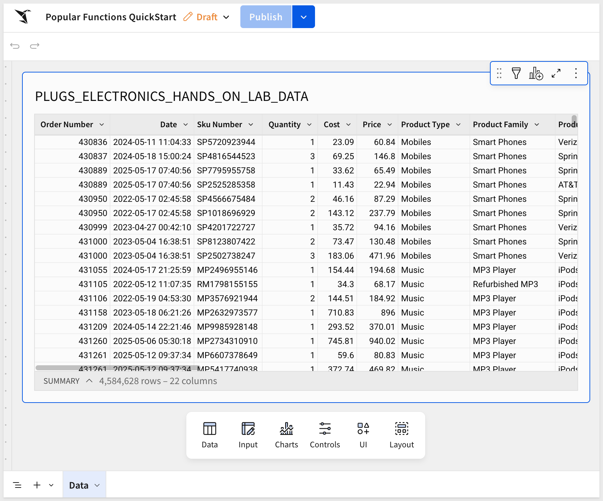


<!-- END OF SECTION-->

## BinFixed() / BinRange()
Duration: 10

The `BinFixed` and `BinRange` functions allow you to group numeric data into categories or "bins" for easier analysis.

A common use case is analyzing order values by size to understand purchasing patterns and inform business decisions like pricing tiers or shipping policies.

Before we start analyzing bins, let's add a calculated column to our source table on the `Data` page so it's available to all child tables.

Navigate back to the `Data` page and add a new column to the `PLUGS_ELECTRONICS_HANDS_ON_LAB_DATA` table:
```code
Column Name:     Formula:
Order_Value      [Price] * [Quantity]
```

Format as currency.

<aside class="positive">
<strong>BEST PRACTICE:</strong><br> Adding commonly-used calculations to the source table on the Data page means you only calculate them once. All child tables will have access to this column, saving compute resources and ensuring consistency across your workbook.
</aside>

Now create a new page and rename it to `Bins`.

Add a child table from the `Data` page's `PLUGS_ELECTRONICS_HANDS_ON_LAB_DATA` table:

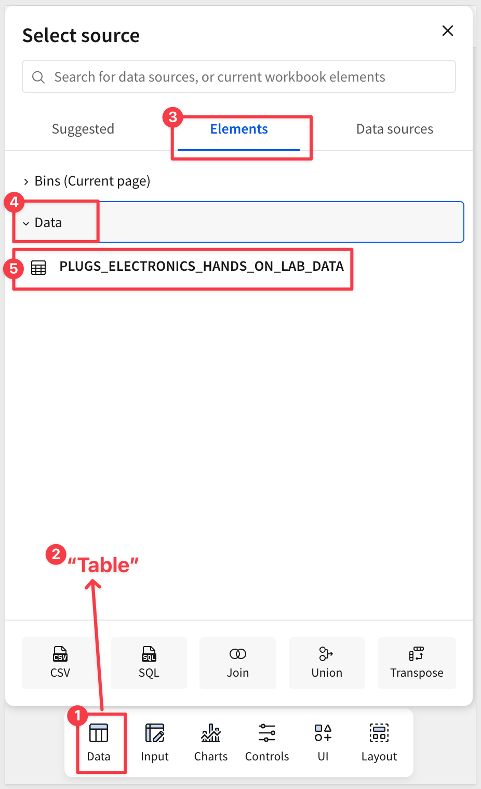

Rename the table to `Order_Size_Analysis`.

Notice that the `Order_Value` column is now available in this child table.

### BinFixed
`BinFixed` creates equal-width bins by dividing a range into a specified number of bins. This is useful when you want consistent bin sizes.

Let's group orders from $0 to $1000 into 10 equal bins. Add a new column:
```code
Column Name:     Formula:
Order_Size_Fixed BinFixed([Order_Value], 0, 5000, 10)
```

This creates 10 equal bins of $100 each: "0-100", "100-200", "200-300", etc.

Format the column as `Number` and remove the decimal places.

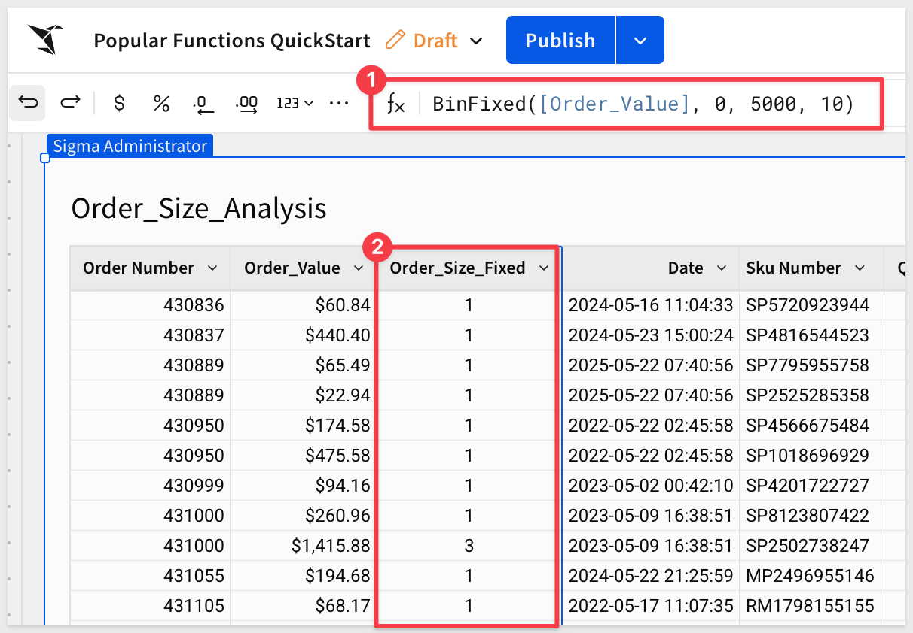

### BinRange
`BinRange` allows you to define custom ranges that make business sense. This is useful when bin sizes should vary based on your analysis needs.

Add another new column:
```code
Column Name:     Formula:
Order_Size_Range BinRange([Order_Value], 0, 100, 250, 500, 1000)
```

This creates bins:
- Small: $0-$100
- Medium: $100-$250
- Large: $250-$500
- Extra Large: $500-$1000
- Premium: $1000+

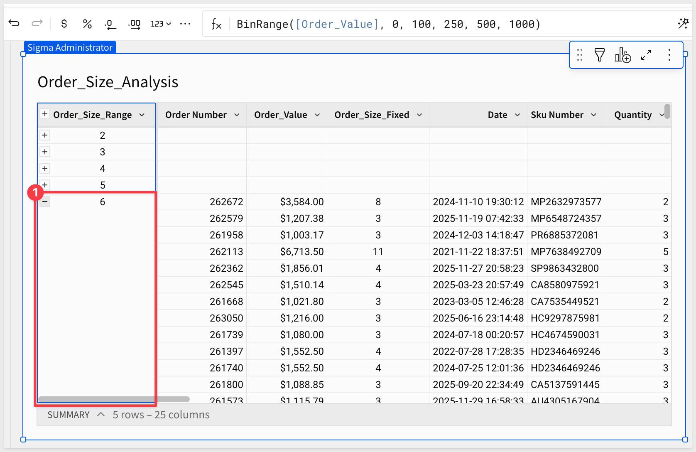

Now let's see the distribution. Group by `Order_Size_Range` and add a count:


This shows most orders fall in the Small to Medium range, which could inform decisions about:
- Free shipping thresholds
- Volume discount tiers
- Inventory planning

<aside class="positive">
<strong>BEST PRACTICE:</strong><br> Use BinFixed for consistent intervals (time periods, age groups) and BinRange for business-specific categories (pricing tiers, customer segments).
</aside>

For more information, see [BinFixed](https://help.sigmacomputing.com/docs/binfixed) and [BinRange](https://help.sigmacomputing.com/docs/binrange)

Click `Publish`.


<!-- END OF SECTION-->

## Coalesce() / Zn()
Duration: 10

The `Zn` and `Coalesce` functions help handle null values in your data, which is essential for accurate calculations and clean reporting.

**Use case**: Calculate accurate commission rates and sales metrics even when some fields contain null values.

Create a new page and rename it to `Null_Handling`.

Add a child table from the `Data` page's `PLUGS_ELECTRONICS_HANDS_ON_LAB_DATA` table.

Rename the table to `Sales_With_Nulls`.

Notice that the `Order_Value` column is now available in this child table without needing to recalculate it.

### Zn()
`Zn` (Zero if Null) replaces null values with 0. This is the most common use case for handling nulls in numeric calculations.

Let's simulate a discount column that might have nulls. Add a new column:
```code
Column Name:     Formula:
Discount_Rate    If([Order_Value] > 500, 0.10, null)
```

This gives a 10% discount only for orders over $500, otherwise null.

Now create a column that handles the null values:
```code
Column Name:           Formula:
Discount_Rate_Clean    Zn([Discount_Rate])
```

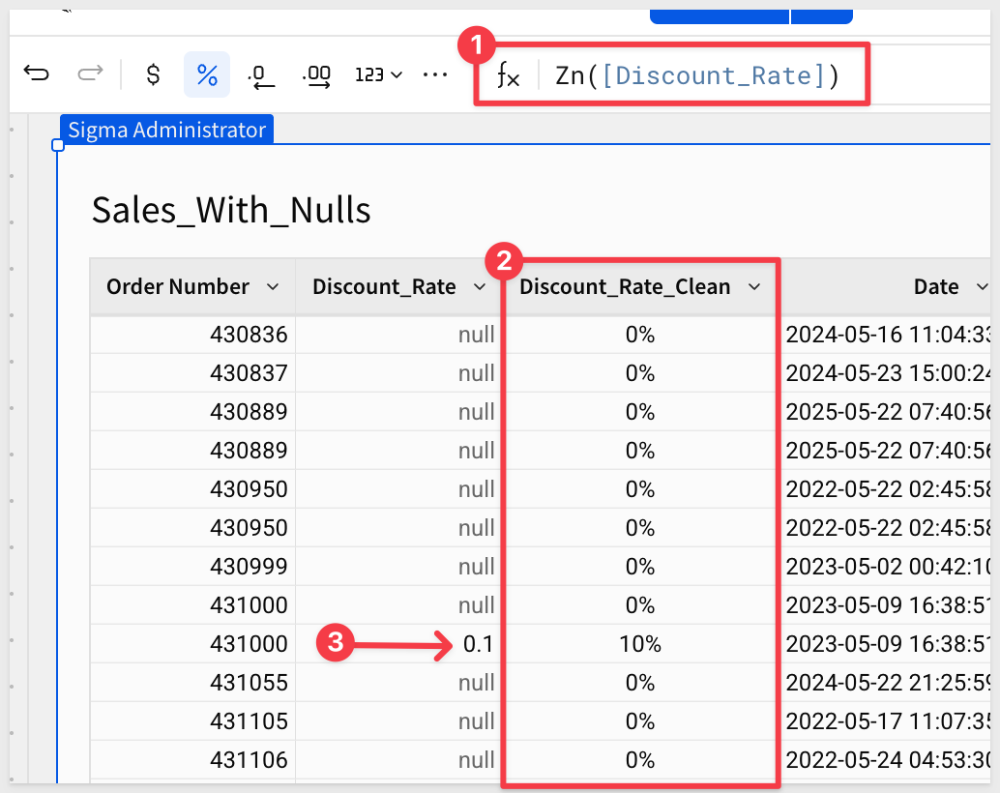

Now you can safely calculate discounted prices without worrying about null errors:
```code
Column Name:         Formula:
Discounted_Price     [Order_Value] * (1 - [Discount_Rate_Clean])
```

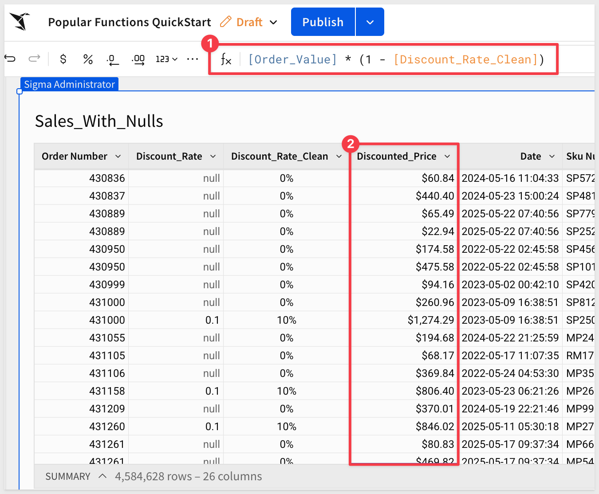

### Coalesce()
`Coalesce` returns the first non-null value from a list of arguments. This is useful when you have multiple potential sources for a value.

For example, let's create a commission structure with fallback values. Add a new column:
```code
Column Name:     Formula:
Commission_Rate  Coalesce([Discount_Rate], 0.05)
```

This will:
- Use the discount rate if it exists
- Otherwise default to 5% commission

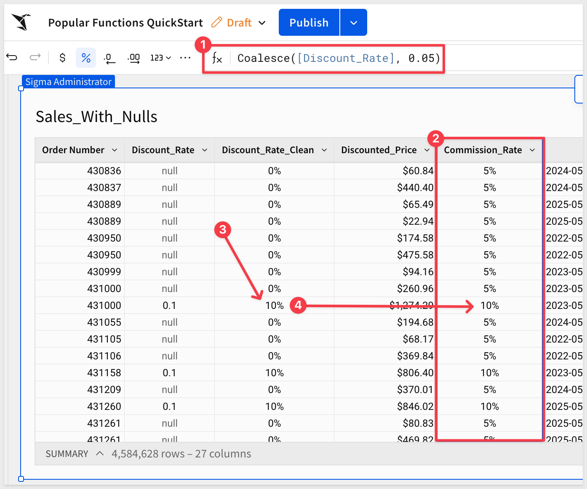

You can also use Coalesce with multiple fallback values. For example:
```code
Coalesce([PrimaryRate], [SecondaryRate], [DefaultRate], 0)
```

Click `Publish`.

<aside class="positive">
<strong>BEST PRACTICE:</strong><br> Use Zn() when you always want 0 for nulls. Use Coalesce() when you need more flexible fallback logic with multiple alternatives.
</aside>

For more information, see [Zn](https://help.sigmacomputing.com/docs/zn) and [Coalesce](https://help.sigmacomputing.com/docs/coalesce)


<!-- END OF SECTION-->

## Contains
Duration: 10

The `Contains` function checks if a text string contains a specific substring. This is useful for filtering, categorizing, or flagging records based on partial text matches.

**Use case**: Identify and categorize products by type (cables, chargers, adapters) to analyze sales by product category.

Create a new page and rename it to `Contains`.

Add a child table from the `Data` page's `PLUGS_ELECTRONICS_HANDS_ON_LAB_DATA` table.

Rename the table to `Product_Categories`.

Let's create columns that identify different product types. Add a new column:
```code
Column Name:     Formula:
Is_Cable         Contains([Product Name], "Cable")
```

This returns `True` if the product name contains "Cable", otherwise `False`.

Now add a few more category columns:
```code
Column Name:     Formula:
Is_Charger       Contains([Product Name], "Charger")
Is_Adapter       Contains([Product Name], "Adapter")
Is_USB           Contains([Product Name], "USB")
```

<aside class="negative">
<strong>NOTE:</strong><br> Contains is case-sensitive by default. "Cable" will not match "cable". Use ContainsIgnoreCase() if you need case-insensitive matching.
</aside>

Now we can create a more readable product category column using these flags. Add a new column:
```code
Column Name:      Formula:
Product_Category  If([Is_Cable], "Cables", [Is_Charger], "Chargers", [Is_Adapter], "Adapters", "Other")
```

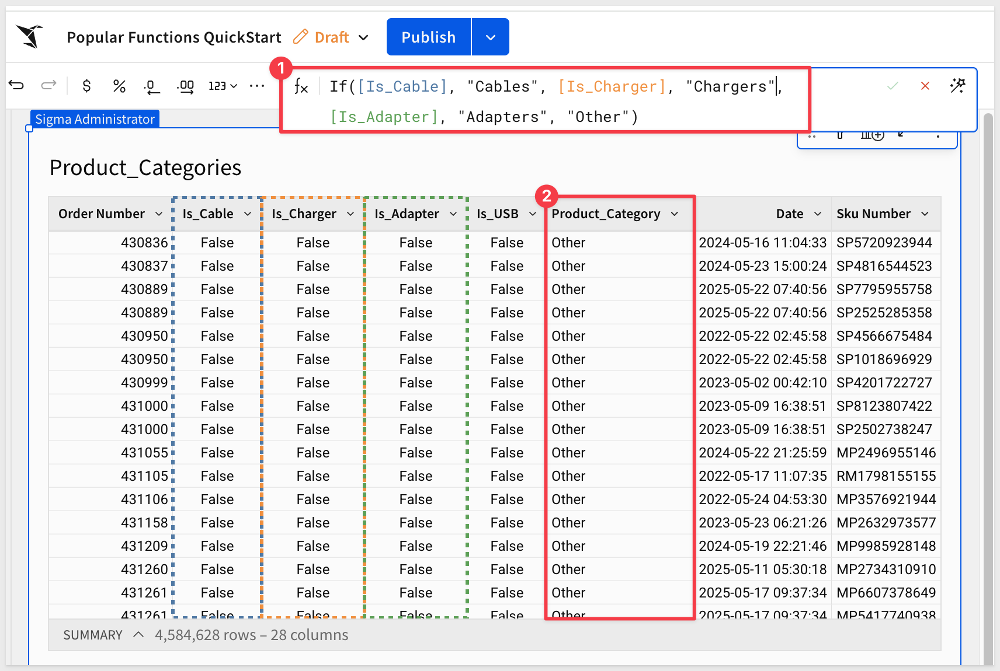

With over 4 million rows, it can be hard to see the distribution. To do that quickly, we can look at column details:


This shows lots of useful information about the selected column, including the distribution of values:

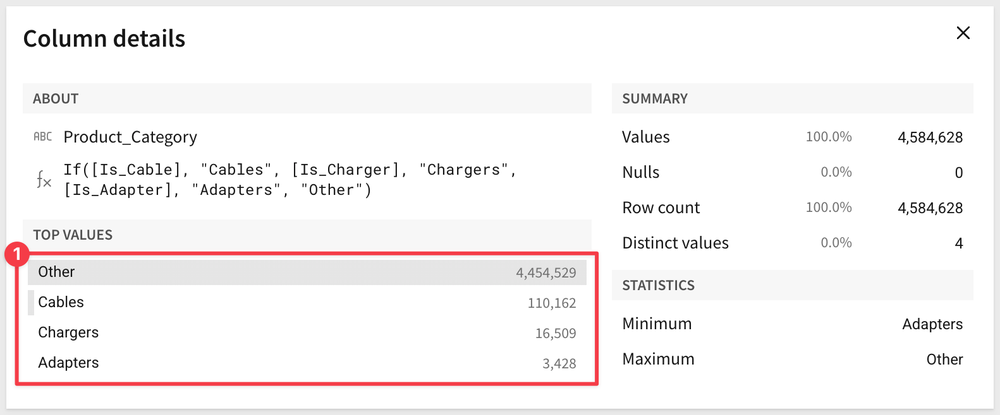

To make that visible in the table, we can group by `Product_Category` and add calculations to see sales by category.

Drag the `Product_Category` column to the `GROUPINGS` section.

Add a new calculation column:
```code
Column Name:     Formula:
Order_Count      CountDistinct([Order Number])
```

You can also add other useful metrics:
```code
Column Name:        Formula:
Total_Revenue       Sum([Order_Value])
Avg_Order_Value     Avg([Order_Value])
```

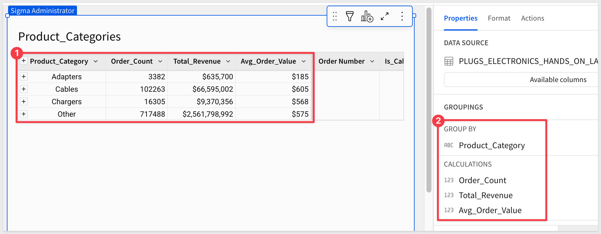

This analysis helps answer questions like:
- Which product categories generate the most revenue?
- What's the average order value by category?
- Which categories should we stock more inventory for?

Click `Publish`.

<aside class="positive">
<strong>BEST PRACTICE:</strong><br> Contains is great for simple text matching. For more complex pattern matching (like extracting parts of text), use RegexpExtract which we'll cover in a later section.
</aside>

For more information, see [Contains](https://help.sigmacomputing.com/docs/contains)


<!-- END OF SECTION-->

## In()
Duration: 10

The `In` function checks if a value matches any item in a list. This simplifies formulas that would otherwise require multiple OR conditions.

**Use case**: Analyze performance of specific high-value store regions to understand their contribution to overall sales.

Create a new page and rename it to `In_Function`.

Add a child table from the `Data` page's `PLUGS_ELECTRONICS_HANDS_ON_LAB_DATA` table.

Rename the table to `Regional_Analysis`.

Let's say leadership wants to focus on three key regions: West, South, and East. We can create a flag to identify orders from these regions.

Add a new column:
```code
Column Name:      Formula:
Is_Key_Region     In([Store Region], "West", "South", "East")
```

This returns `True` for orders from these three regions, `False` for all others.

Without the `In` function, you would need to write:
```code
[Store Region] = "West" Or [Store Region] = "South" Or [Store Region] = "East"
```

The `In` function is much cleaner and easier to maintain.

Now let's create a more readable column using this flag:
```code
Column Name:          Formula:
Regional_Priority     If([Is_Key_Region], "Key Region", "Other Region")
```

Group by `Regional_Priority` and add calculations to compare performance:
```code
Column Name:        Formula:
Order_Count         CountDistinct([Order Number])
Total_Revenue       Sum([Order_Value])
Avg_Order_Value     Avg([Order_Value])
```

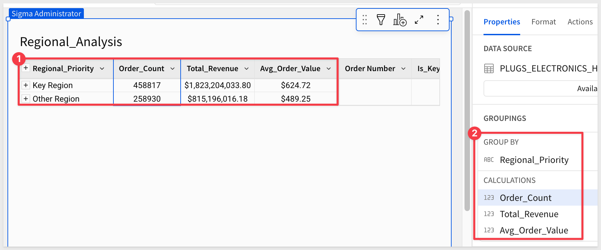

This helps answer questions like:
- What percentage of revenue comes from key regions?
- Do key regions have higher average order values?
- Should we allocate more resources to key regions?

<aside class="positive">
<strong>BEST PRACTICE:</strong><br> Use In() whenever you need to check for multiple possible values. It's more efficient and readable than chaining multiple OR conditions.
</aside>

For more information, see [In](https://help.sigmacomputing.com/docs/in)

Click `Publish`.


<!-- END OF SECTION-->

## IsNull() / IsNotNull()
Duration: 10

The `IsNull` and `IsNotNull` functions check whether a value is null or not. These are essential for data quality checks, conditional logic, and identifying incomplete records.

**Use case**: Identify data quality issues by flagging records with missing or incomplete information to ensure data integrity.

Create a new page and rename it to `Null_Checks`.

Add a child table from the `Data` page's `PLUGS_ELECTRONICS_HANDS_ON_LAB_DATA` table.

Rename the table to `Data_Quality_Check`.

Let's create a simulated scenario where some discount values might be missing. Add a new column:
```code
Column Name:       Formula:
Sample_Discount    If([Order_Value] > 1000, 0.15, If([Order_Value] > 500, 0.10, null))
```

This creates discounts only for orders over $500, leaving smaller orders with null values.

Now let's use `IsNull` to identify records without discounts:
```code
Column Name:         Formula:
Missing_Discount     IsNull([Sample_Discount])
```

This returns `True` for records where the discount is null.

We can also use `IsNotNull` to identify complete records:
```code
Column Name:         Formula:
Has_Discount         IsNotNull([Sample_Discount])
```

These functions are commonly used in conditional logic. For example, create a status column:
```code
Column Name:        Formula:
Discount_Status     If(IsNull([Sample_Discount]), "No Discount", "Discounted")
```

Group by `Discount_Status` to see the distribution:
```code
Column Name:        Formula:
Order_Count         CountDistinct([Order Number])
Total_Revenue       Sum([Order_Value])
```

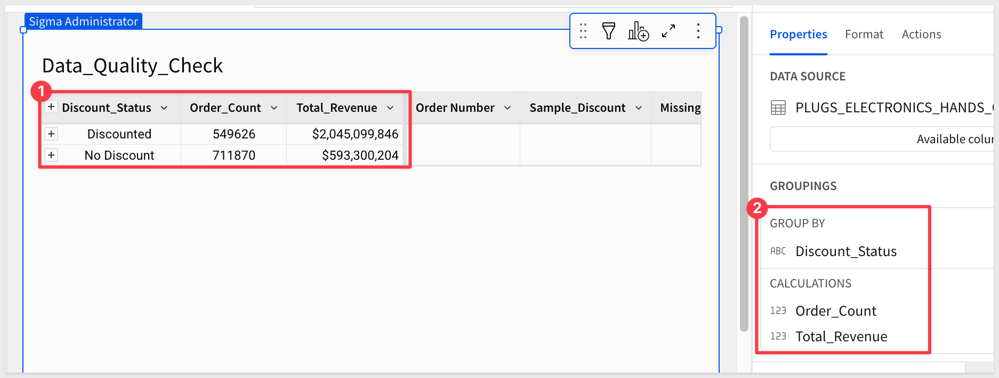

This helps answer questions like:
- What percentage of orders are missing discount information?
- How does revenue compare between discounted and non-discounted orders?
- Which records need follow-up for data completion?

<aside class="positive">
<strong>BEST PRACTICE:</strong><br> Use IsNull() and IsNotNull() for data quality checks and conditional logic. They're clearer than using = null or != null, which don't work reliably in SQL-based systems.
</aside>

For more information, see [IsNull](https://help.sigmacomputing.com/docs/isnull) and [IsNotNull](https://help.sigmacomputing.com/docs/isnotnull)

Click `Publish`.


<!-- END OF SECTION-->

## Lookups
Duration: 10

Lookups allow you to enrich data in one table by pulling in columns from another table based on matching values (join keys).

**Use case**: Compare this year's sales performance against last year's sales by store region using lookup columns.

Lookups work by matching rows based on shared values between two columns—one from each table. Let's see how this works.

Create a new page and rename it to `Lookups`.

Add a child table from the `Data` page.

Rename the table to `Regional_Sales_Performance`.

Group by `Store Region`.

Now we'll create two additional tables to summarize sales by year. Add another child table from the `Data` page.

Rename this child table `Sales_This_Year`.

Group by `Store Region`.

Add another child table from the `Data` page and rename it `Sales_Last_Year`.

Group by `Store Region` as well.

On the `Sales_This_Year` table, add a new column:
```code
Column Name:     Formula:
Total_Sale       [Order_Value]
```

Add a filter on the `Date` column to show only this year's data.


On the `Sales_Last_Year` table, add the same `Total_Sale` column and filter to show only last year's data.

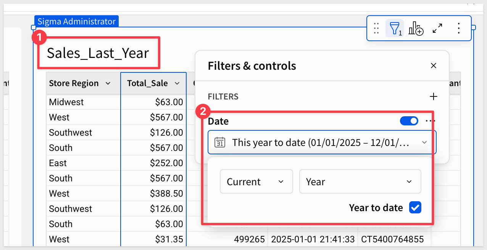

We have the two tables:

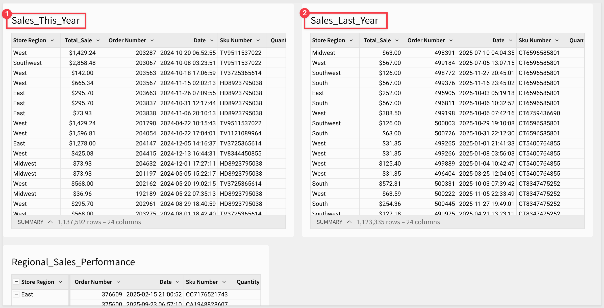

Now let's use lookups to bring both years' sales into the `Regional_Sales_Performance` table.

On the `Regional_Sales_Performance` table, open the menu for `Store Region` and select `New column via lookup`.

Configure the lookup:
- **Select element**: Choose `Sales_This_Year`
- **Column to add**: Select `Total_Sale`
- **Aggregate**: Select `Sum` (this sums all sales for each region)
- **Map two elements**: Match `Store Region` from both tables


Click `Done`.

Rename the lookup column to `This_Year_Sales` and drag it to the `CALCULATIONS` section.

Repeat the process to add a lookup from `Sales_Last_Year`, rename it to `Last_Year_Sales`, and drag it to `CALCULATIONS`.

Now add a new column to see the year-over-year change:
```code
Column Name:     Formula:
YoY_Change       ([This_Year_Sales] - [Last_Year_Sales]) / [Last_Year_Sales]
```

Format as percentage.

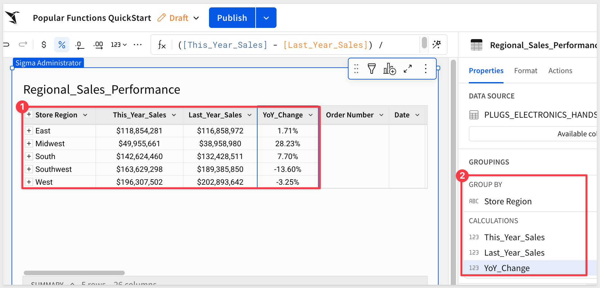

You now have a comparison table showing this year vs last year sales by region, with growth rates—all powered by lookups.

<aside class="positive">
<strong>BEST PRACTICE:</strong><br> Lookups are powerful for enriching detail-level data with summary metrics without needing complex SQL joins. The lookup table automatically updates when source data changes.
</aside>

For more information, see [Add columns through Lookup](https://help.sigmacomputing.com/docs/add-columns-through-lookup)

Click `Publish`.


<!-- END OF SECTION-->

## PercentOfTotal
Duration: 10

The `PercentOfTotal` function calculates what percentage each value represents of the total. This is essential for understanding relative contribution and distribution.

**Use case**: Analyze which stores contribute the most to their region's revenue to identify top performers and underperformers.

Create a new page and rename it to `PercentOfTotal`.

Add a child table from the `Data` page.

Rename the table to `Store_Performance`.

Group by `Store Region`, then add a nested grouping by `Store Name`.

Add a calculation for total sales by store:
```code
Column Name:        Formula:
Store_Sales         Sum([Order_Value])
```

Format as currency.

Now add another calculation using `PercentOfTotal`:
```code
Column Name:                    Formula:
Percent_of_Regional_Sales       PercentOfTotal(Sum([Store_Sales]))
```

Format as percentage.

The `PercentOfTotal` function automatically calculates each store's percentage **within its region**. Because of the grouping hierarchy, it calculates percentages at the `Store Name` level relative to the `Store Region` total.

Filter to show just one region to see the distribution more clearly. For example, filter to `Store Region = "West"`:

Sort by `Percent_of_Regional_Sales` descending to see the ranking:

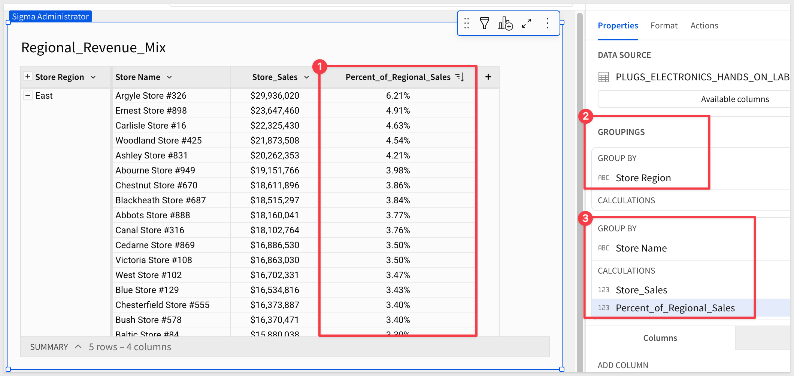

This helps answer questions like:
- Which stores are the top performers in each region?
- Are sales concentrated in a few stores or evenly distributed?
- Which underperforming stores need additional support?

You can remove the filter to see all regions and compare store performance across the entire company.

<aside class="positive">
<strong>BEST PRACTICE:</strong><br> PercentOfTotal respects grouping levels, so you can calculate percentages at different hierarchies (overall total vs. group total) in the same table.
</aside>

For more information, see [PercentOfTotal](https://help.sigmacomputing.com/docs/percentoftotal)

Click `Publish`.


<!-- END OF SECTION-->

## RegexpExtract
Duration: 10

The `RegexpExtract` function uses regular expressions (regex) to extract specific patterns from text strings. This is powerful for parsing structured data from unstructured text.

**Use case**: Extract product information from SKU numbers that follow a pattern to analyze sales by product type and model.

Create a new page and rename it to `RegexpExtract`.

Add a child table from the `Data` page's `PLUGS_ELECTRONICS_HANDS_ON_LAB_DATA` table.

Rename the table to `SKU_Analysis`.

Looking at the `Sku Number` column, we can see patterns like "SP5720923942", "MP2496955145", "CT6607378640", etc.

Let's say the pattern is: First 2 letters = Product Type, Next 4 digits = Model Number, Remaining digits = Serial Number.

Extract the product type (first 2 characters):
```code
Column Name:     Formula:
Product_Type     RegexpExtract([Sku Number], "^([A-Z]{2})")
```

The pattern `^([A-Z]{2})` means:
- `^` = Start of string
- `([A-Z]{2})` = Capture exactly 2 uppercase letters
- Parentheses capture the match for extraction

Extract the model number (characters 3-6):
```code
Column Name:     Formula:
Model_Number     RegexpExtract([Sku Number], "^[A-Z]{2}([0-9]{4})")
```

The pattern `^[A-Z]{2}([0-9]{4})` means:
- Skip first 2 letters (not captured)
- `([0-9]{4})` = Capture exactly 4 digits

Extract the serial number (remaining digits):
```code
Column Name:       Formula:
Serial_Number      RegexpExtract([Sku Number], "([0-9]{6,})$")
```

The pattern `([0-9]{6,})$` means:
- `([0-9]{6,})` = Capture 6 or more digits
- `$` = End of string

Now group by `Product_Type` to analyze sales by product category:
```code
Column Name:        Formula:
Order_Count         CountDistinct([Order Number])
Total_Revenue       Sum([Order_Value])
```


This helps answer questions like:
- Which product types (SP, MP, CT, etc.) are most popular?
- What's the revenue distribution by product type?
- Are certain model numbers performing better than others?

<aside class="positive">
<strong>BEST PRACTICE:</strong><br> RegexpExtract is powerful for parsing structured data from text fields. For simple text matching, use Contains. For complex patterns, regex is your tool. Test patterns at regex101.com before implementing.
</aside>

<aside class="negative">
<strong>NOTE:</strong><br> Regular expressions can be complex. Common patterns: ^ (start), $ (end), [A-Z] (uppercase letters), [0-9] (digits), {n} (exactly n), {n,} (n or more), () (capture group).
</aside>

For more information, see [RegexpExtract](https://help.sigmacomputing.com/docs/regexpextract)

Click `Publish`.


<!-- END OF SECTION-->

## Subtotal
Duration: 5

The **Subtotal()** function calculates aggregations at different levels within your data hierarchy. It's particularly useful for creating subtotals in pivot tables and calculating values at specific grouping levels.

**Use Case:** Analyze regional sales performance by calculating both store-level sales and regional subtotals to understand each store's contribution to its region's total.

### Create Analysis Page
Create a new page and rename it to `Subtotal`.

Add a child table from the `Data` page's `PLUGS_ELECTRONICS_HANDS_ON_LAB_DATA` table.

Rename the table to `Regional_Analysis`.

### Add Regional Grouping
In the **Regional_Analysis** table, click the **Grouping** icon and add two levels:

```code
Store Region
Store Name
```

This creates a hierarchical view showing stores grouped by their region.

### Calculate Store Sales
Click the **+** icon in the table header to add a new column:

```code
Column Name:     Formula:
Store_Sales      Sum([Order_Value])
```

This shows total sales for each store.

### Add Regional Subtotal
Click the **+** icon to add another calculated column:

```code
Column Name:       Formula:
Regional_Total     Subtotal(Sum([Order_Value]), "parent_grouping", 0)
```

The **Subtotal()** function with `"parent_grouping"` mode and parameter `0` calculates the total at the immediate parent grouping level. This displays the regional total on each store row, making it easy to compare individual store performance against the regional total.

Notice that each store in the East region shows the same Regional_Total value (for example, $2,638,400,049.98). This is expected behavior - it's showing the total for all East region stores combined. Each store row displays its own Store_Sales alongside the complete regional total, enabling easy comparison.

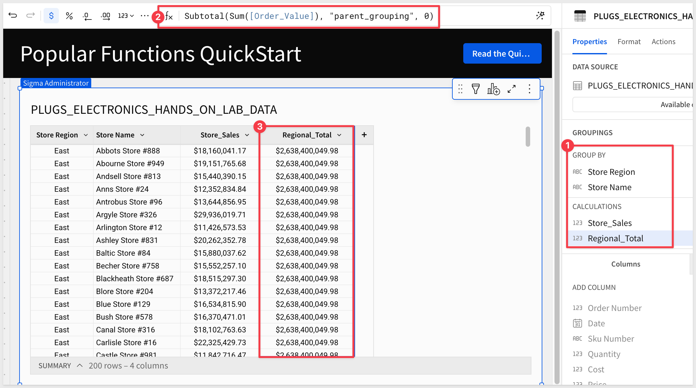

### Calculate Store Contribution
Click the **+** icon in the groups calculations to add one more column:

```code
Column Name:           Formula:
Percent_of_Region      [Store_Sales] / [Regional_Total]
```

Format this column as **Percentage** to show what portion of regional sales each store represents.

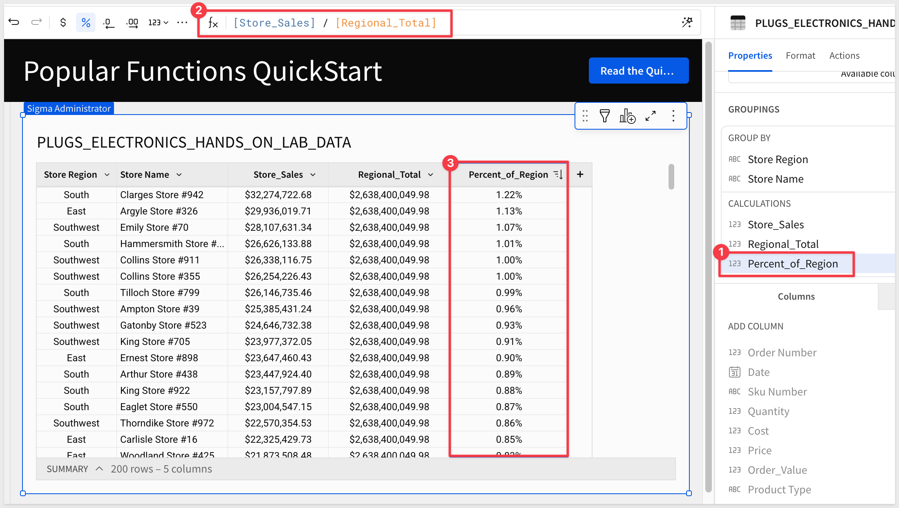

**Business Insight:** This analysis reveals which stores are the strongest performers within their regions. For example, you might discover that certain stores contribute much less of their region's total sales, indicating low-performing locations worth investigating.

This helps answer questions like:
- Which stores are the top performers in each region?
- Are regional sales concentrated in a few stores or evenly distributed?
- Which regions have the most balanced store performance?

<aside class="positive">
<strong>IMPORTANT:</strong><br> The Subtotal() function works with grouping hierarchies. The "parent_grouping" mode returns the aggregate value at the parent level, while "grand_total" returns the overall total across all data. This makes it powerful for comparative analysis within hierarchical data.
</aside>

For more information on the Subtotal function, [click here.](https://help.sigmacomputing.com/docs/subtotal)

Click **Publish**.


<!-- END OF SECTION-->

## Switch
Duration: 5

The **Switch()** function evaluates multiple conditions and returns different values based on which condition is true. It's a cleaner alternative to nested If statements when you have multiple scenarios to handle.

**Use Case:** Categorize stores into performance tiers based on their sales volume to identify high, medium, and low performers for targeted management strategies.

### Create Analysis Page
Create a new page and rename it to `Switch`.

Add a child table from the `Data` page's `PLUGS_ELECTRONICS_HANDS_ON_LAB_DATA` table.

Rename the table to `Store_Performance`.

### Group by Store
In the **Store_Performance** table, click the **Grouping** icon and add:

```code
Store Name
```

This groups all orders by store.

### Calculate Store Revenue
Click the **+** icon in the table header to add a new column:

```code
Column Name:       Formula:
Store_Revenue      Sum([Order_Value])
```

This calculates total revenue for each store.

### Add Performance Tier
Click the **+** icon to add another calculated column:

```code
Column Name:         Formula:
Performance_Tier     Switch(True, [Store_Revenue] >= 20000000, "High Performer", [Store_Revenue] >= 15000000, "Medium Performer", [Store_Revenue] >= 10000000, "Low Performer", "Underperforming")
```

The **Switch()** function starts with `True` as the first parameter, then evaluates condition-result pairs in order, returning the first matching result:
- Stores with $20M+ revenue are "High Performers"
- Stores with $15M-$20M are "Medium Performers"
- Stores with $10M-$15M are "Low Performers"
- All others (less than $10M) are "Underperforming"

The final value `"Underperforming"` acts as a default, catching any stores that don't meet the previous criteria.

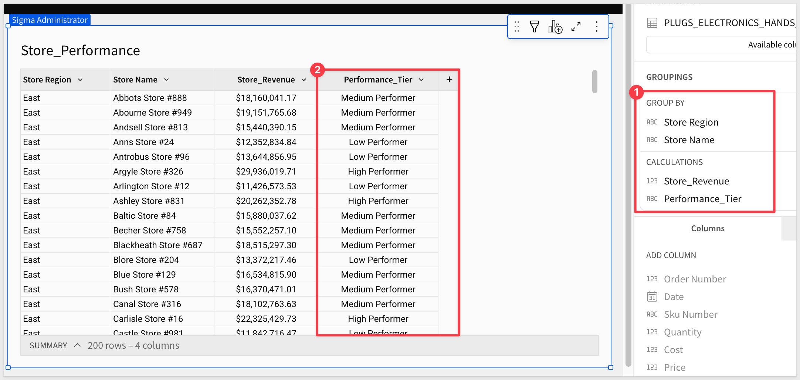

### Visualize Performance Distribution
To better see the distribution of stores across performance tiers, add a bar chart.

Add a **Child** > **Chart** from the `Store_Performance` table.

Configure the chart:
- **X-Axis:** Performance_Tier
- **Y-Axis:** Store_Revenue (Aggregation: Sum)

Now we can easily see the underperforming stores; right-click and **Drill down** to explore the underlying data:

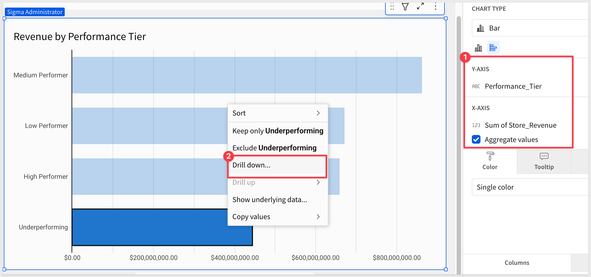

Drill by `Store_Name` and tap the spacebar to see a chart and table data:

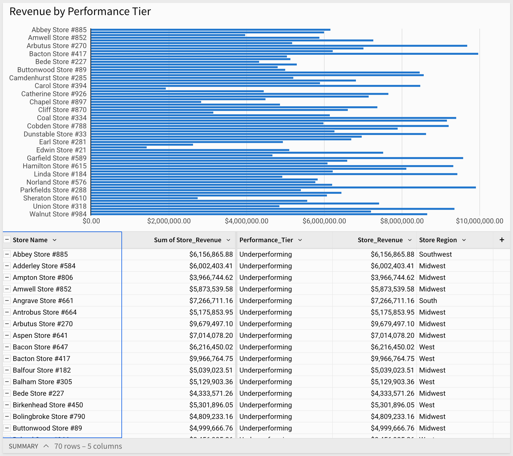

**Business Insight:** The bar chart reveals your store portfolio's performance distribution at a glance. You can quickly see the total revenue contribution from each tier and identify how many stores fall into each category. This segmentation enables targeted strategies - high performers can be studied for best practices, medium performers can be pushed toward high performance, and underperformers require intervention or evaluation.

<aside class="positive">
<strong>BEST PRACTICE:</strong><br> Switch() begins with True as the first parameter, followed by condition-result pairs. It evaluates conditions sequentially and returns the first match. Order your conditions from most specific to least specific (or highest to lowest thresholds). Always include a final default value to ensure every row gets a result.
</aside>

For more information on the Switch function, [click here.](https://help.sigmacomputing.com/docs/switch)

Click **Publish**.


<!-- END OF SECTION-->


## What we've covered
Duration: 5

In this QuickStart, we explored some of Sigma's most frequently used functions through practical business scenarios. 

Sigma supports over 200 functions that enable you to perform simple and complex calculations, transformations, and extractions to get the most out of your data.

For the full listing see our [Function index](https://help.sigmacomputing.com/docs/function-index)

**Additional Resource Links**

[Blog](https://www.sigmacomputing.com/blog/)<br>
[Community](https://community.sigmacomputing.com/)<br>
[Help Center](https://help.sigmacomputing.com/hc/en-us)<br>
[QuickStarts](https://quickstarts.sigmacomputing.com/)<br>

Be sure to check out all the latest developments at [Sigma's First Friday Feature page!](https://quickstarts.sigmacomputing.com/firstfridayfeatures/)
<br>

[](https://twitter.com/sigmacomputing)&emsp;
[](https://www.linkedin.com/company/sigmacomputing)&emsp;
[](https://www.facebook.com/sigmacomputing)


<!-- END OF WHAT WE COVERED -->
<!-- END OF QUICKSTART -->
