author: pballai
id: fundamentals_6_administration
summary: fundamentals_6_administration
categories: Fundamentals
environments: web
status: Published
feedback link: https://github.com/sigmacomputing/sigmaquickstarts/issues
tags: default
lastUpdated: 2023-09-18

# Fundamentals 6: Administration

## Overview 
Duration: 5

This QuickStart introduces the essential administrative features and considerations within Sigma. Whether you're managing your instance, setting up connections, configuring data governance rules, or customizing user interactions, this will provide you with a foundational overview.

<aside class="positive">
<strong>IMPORTANT:</strong><br> Some features may carry the "Beta" tag. Beta features are subject to quick, iterative changes. As a result, the latest product version may differ from the contents of this document.
</aside>

 ### Target Audience
Administrators (admin) who are new to Sigma and want a quick overview of the available features common to their role. 

### Prerequisites

<ul>
  <li>A computer with a current browser. It does not matter which browser you want to use.</li>
  <li>Access to your Sigma environment.</li>
  <li>Some familiarity with Sigma is assumed. Not all steps will be shown as the basics are assumed to be understood.</li>
</ul>

<aside class="postive">
<strong>IMPORTANT:</strong><br> Sigma recommends that you use non-production resources when doing QuickStarts.
</aside>

<button>[Sigma Free Trial](https://www.sigmacomputing.com/free-trial/)</button>
  
### What You’ll Learn
How to leverage the available administrative functions in Sigma to get things done efficiently and effectively.


<!-- END OF OVERVIEW -->

## Accessing administration
Duration: 20

We will first cover how to access the administrative ("admin") areas of Sigma and then list and describe each of the available options.

<aside class="negative">
<strong>NOTE:</strong><br> The admin area of Sigma requires a user to have an account type permission of "Admin". Users who do not have this permission will not be able to access any administrative function and the option is not displayed on the interface either.
</aside>

Admin users can access the admin page one of two ways as shown:

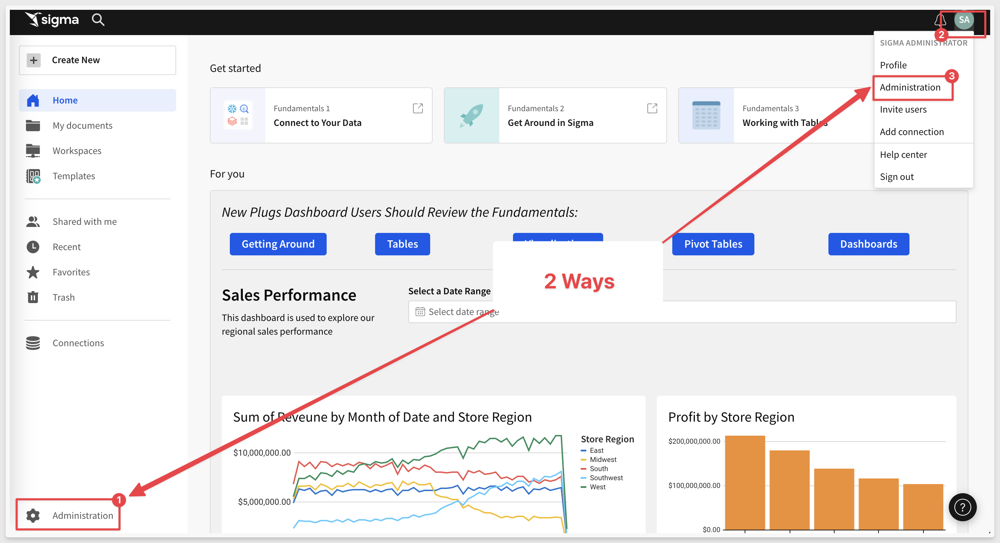

We have centralized all the admin options on this one page as shown:

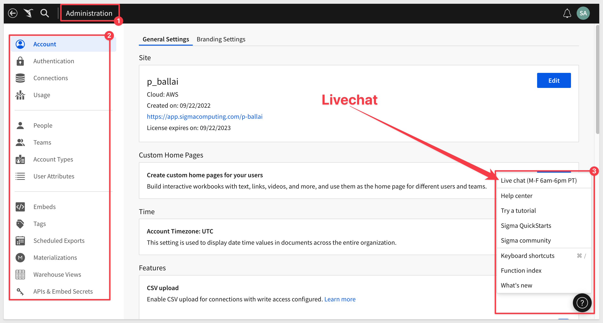

<aside class="positive">
<strong>IMPORTANT:</strong><br> Sigma provides each client with access to our live technical support team via the ? widget. You can come here to ask any questions. For instance, how do I do a moving average for the last 3 days or why am I getting this error message? Live chat is equipped to handle even the most complex questions from 6am PST - 6PM PST M-F.

Furthermore, you can even schedule a 30min meeting with this team to easily show what you are trying to solve and troubleshoot live on a call.
</aside>

In addition to Live chat, there are many other options exposed by clicking on the  icon:

<ul>
    <li><strong>Help Center:</strong> Explore Sigma's self-service resource library for documentation.</li>
</ul>

<ul>
    <li><strong>Try a tutorial:</strong> Access commonly used features via in-product tutorials.</li>
</ul>

<ul>
    <li><strong>Sigma QuickStarts:</strong> Step-by-step tutorials for learning Sigma's features and fundamentals.</li>
</ul>

<ul>
    <li><strong>Sigma community:</strong> Interact with other Sigma users, share knowledge, and get answers.</li>
</ul>

<ul>
    <li><strong>Keyboard shortcuts:</strong> Learn shortcuts for efficient navigation and actions.</li>
</ul>

<ul>
    <li><strong>Function index:</strong> Browse all Sigma functions with explanations and examples.</li>
</ul>

<ul>
    <li><strong>What's new:</strong> Stay updated on new feature releases in weekly release notes.</li>
</ul>

In addition, [Sigma publishes new feature announcements in QuickStart format, once per month.](https://quickstarts.sigmacomputing.com/firstfridayfeatures/)

Next, we will cover each area inside administration, at a high-level.


<!-- END OF SECTION-->

## Account - General Settings
Duration: 20

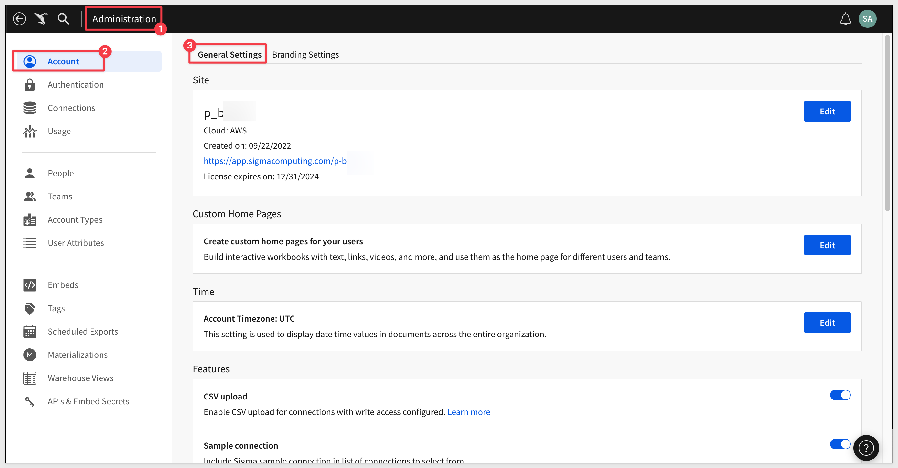

#### Site
Identifies your user account name, cloud provider, data of creation, URL and when the product license will expire. 

Admin users are able to edit `Organization Name` and `Company Login URL` values by clicking the `Edit` button.

<aside class="positive">
<strong>Caution!</strong><br> Changing these settings will break existing document links.
</aside>


#### Custom Home Pages
Sigma Admins can designate a workbook to use as a custom homepage for an organization or team. The first page of the workbook becomes the custom homepage.

A custom homepage functions as a landing page for its viewers..

For example, embedding specific visualizations along with buttons linking to new user QuickStarts:


[Documentation Link](https://help.sigmacomputing.com/docs/enable-a-custom-homepage)


#### Time
Allows portal-wide timezone preference setting. The default is `UTC`.


#### Features
This is a grouping of small features that do not necessitate their own group.

***CSV upload:***<br>
Enable CSV upload for connections with write access configured. [Learn more...](https://help.sigmacomputing.com/docs/upload-csvs)

***Sample connection:***<br>
Include Sigma's sample connection in list of connections to select from. [Learn more...](https://help.sigmacomputing.com/docs/sigmas-sample-connection)

***Public embeds:***<br>
Allow public embedding of Sigma documents. [Learn more...](https://help.sigmacomputing.com/docs/public-embedding)

***License upgrade request:***<br>
Allow users to request a license with more permission from admin (e.g. from Viewer to Creator license for explore workbook permission). [Learn more...](https://help.sigmacomputing.com/docs/license-upgrade-requests#upgrade-requests)

***Comments:***<br>
Allow commenting on Sigma documents. [Learn more...](https://help.sigmacomputing.com/docs/workbook-comments)

***Annotations:***<br>
Capture elements as images to annotate as comments in Sigma documents. Captured images will be stored in a Sigma managed cloud for a period of your choosing. The default is for 3 months. [Learn more...](https://help.sigmacomputing.com/docs/annotate-element-images-as-comments)


#### Integrations
Sigma supports integrations with Slack and dbt.

[Learn more about Sigma with Slack](https://help.sigmacomputing.com/docs/integration-for-slack)

[Learn more about Sigma with dbt](https://help.sigmacomputing.com/docs/configure-dbt-integration)


#### Embedding
For customers who want to include (embed) Sigma content into their own applications, Sigma provides an embedding method. 

[There is a QuickStart series for those wanting detailed information and instruction.](https://quickstarts.sigmacomputing.com/?cat=embedding)


#### Custom Plugins
Sigma supports plugin elements in workbooks. Plugins are third-party applications built to add additional functionality into Sigma.

[Learn more...](https://help.sigmacomputing.com/docs/register-a-plugin-with-your-sigma-organization)


#### Custom Functions
Admins can define custom functions to represent frequently used complex calculations that combine logic, aggregates, and other type of operations. There are many advantages to adding custom functions to your Sigma practice:

 <ul>
      <li>Use custom functions to encode business logic instead of repeating it. </li>
      <li>Encapsulate complex calculations that are common business use cases, for easier use.</li>
      <li>Expose your proprietary warehouse functions, making them consumable</li>
</ul>

[Learn more...](https://help.sigmacomputing.com/docs/custom-functions)


<!-- END OF SECTION-->

## Account - Branding Settings
Duration: 20

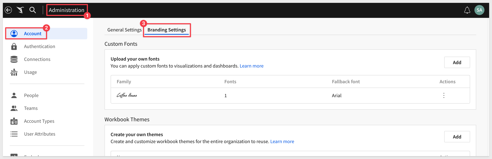

#### Custom Fonts
Sigma supports custom fonts for workbooks, worksheet visualizations, and dashboards. 

Custom fonts can be uploaded at the organization level and used on any workbooks, worksheet visualizations, and dashboards in that organization.

Organizations are not limited to one custom font.

Accepted formats: .ttf, .otf, .woff, .woff2

For example, we can easily add a new font, "Coffee House" in this case:

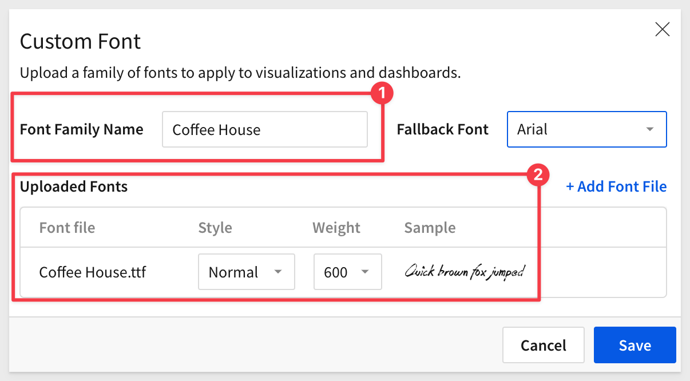

[Learn more...](https://help.sigmacomputing.com/docs/custom-fonts)


#### Workbook Themes
Sigma supports creation of workbook themes. Admin can customize sets of colors, fonts, spacing, and more.

For example, we can easily add a new theme, use the "Coffee House" font we added, and also set it as the `Organizations Default` so that it is the first choice for all content:

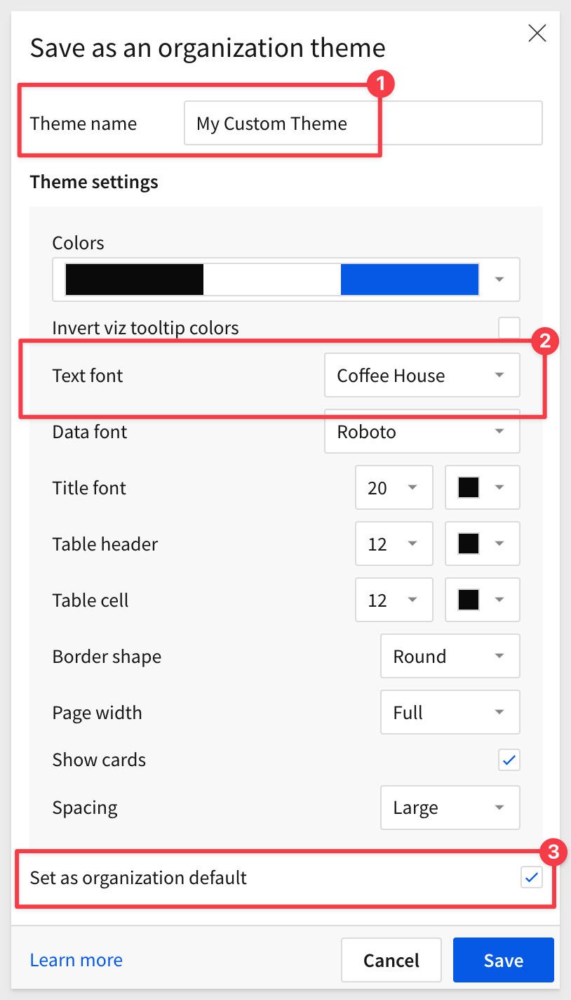

[Learn more...](https://help.sigmacomputing.com/docs/create-and-manage-workbook-themes)


#### Customize Email
Custom email branding allows you to apply your company's brand to all export emails sent from your Sigma organization.

By default, all emails include Sigma branding. However, applying any subset of custom branding options will automatically remove all Sigma branding.

For example, a custom email configuration might look like this:

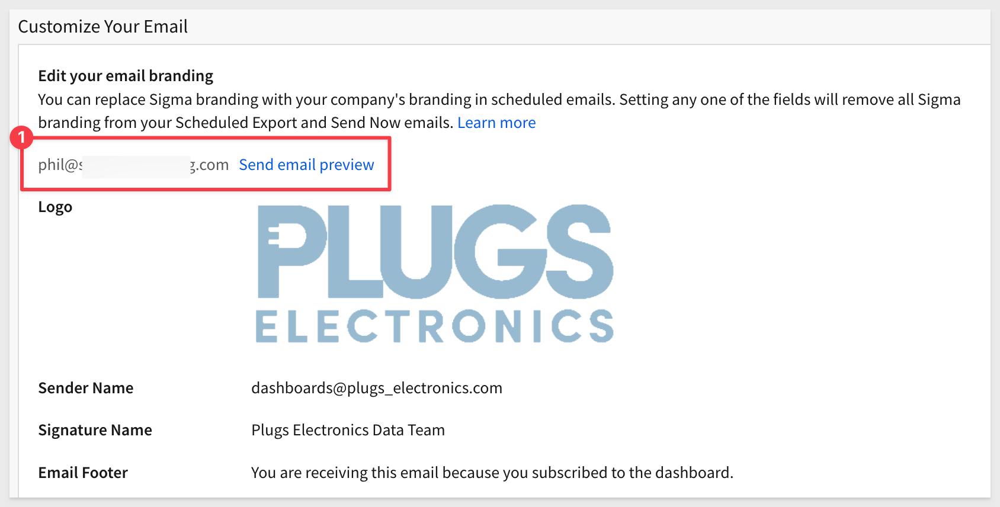

There is also an option to send a test email to yourself (#1).

[Learn more...](https://help.sigmacomputing.com/docs/custom-email-branding#test-your-email-branding)


#### Custom SMTP Server
Custom SMTP Server allows you to send Sigma emails from your own SMTP server. Sigma generated emails will be sent from an email address from within your domain.

<aside class="positive">
<strong>IMPORTANT:</strong><br> Sigma can't monitor email deliverability if you set your own SMTP server.
</aside>

[Learn more...](https://help.sigmacomputing.com/docs/customize-welcome-and-invite-emails#custom-smtp-server)


<!-- END OF SECTION-->

## Authentication
Duration: 20

Sigma supports multiple authentication methods including:

 <ul>
      <li><strong>Password:</strong> Sigma prompts new organization members to create a unique password for their Sigma account and login.</li>
      <li><strong>SAML:</strong> Sigma authenticates organization member accounts through the Single Sign-On (SSO) protocol you provide.</li>
      <li><strong>SAML or Password:</strong> Organization members authenticate with either SSO or a unique password.</li>
      <li><strong>SAML and Password:</strong> Organization members authenticate with SSO and a unique password. The primary use case for this is to ensure the admin isn't logged out while configuring SAML. Once the configuration is complete, the org should use just SAML.</li>
      <li><strong>OAuth:</strong> Sigma authenticates organization member accounts through OAuth Single Sign On (SSO). This option supports OAuth with Snowflake.</li>
      <li><strong>OAuth or Password:</strong> Sigma authenticates organization member accounts through OAuth Single Sign-On (SSO) or a unique password. This option supports OAuth with Snowflake.</li>
</ul>

[Learn more...](https://help.sigmacomputing.com/docs/manage-authentication)

### Authentication Methods & Options:
All configuration is accessed by clicking the `Edit` button. 

The current values for Guest Account and 2-Factor Authentication are shown on the main page for your convenience. 

In the example below, we are allowing SAML or a Sigma password to be used to log in. 

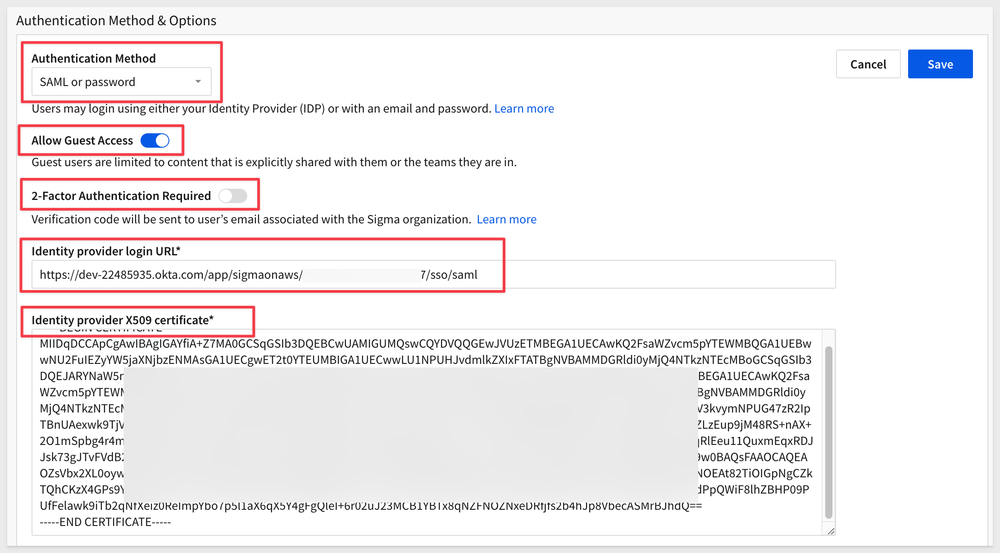

Guest Access is enabled (off by default). Guest user accounts are recommended when working with external vendors.

Guest users cannot view or request access to content outside of their Admin-assigned team(s). 

This feature is opt-in and must be enabled by an organization admin before guest users can be invited to your organization. 

[Learn more about Guest Accounts.](https://help.sigmacomputing.com/docs/guest-user-accounts)

We are not using 2-Factor authentication, but is supported.

[Learn more about 2-Factor authentication with Sigma.](https://help.sigmacomputing.com/docs/two-factor-email-authentication#enable-two-factor-authentication)

We have provided an `Identity provider login URL`. In this case, the url was provided by Okta, but any IdP provider can be used.

[Learn more about how to configure your IdP.](https://help.sigmacomputing.com/docs/use-custom-account-types-with-your-idp)

Okta also provided the `X509 certificate` as well.


### Export Authentication:
#### Authorized Domains
Sigma Admins may choose to control which domains can receive emails, Google Sheets or Google Drive exports from Sigma. 

**If no domains are declared authorized, users can export reports to any email address.**

[Learn more...](https://help.sigmacomputing.com/docs/restrict-export-recipients#restrict-domains)


<!-- END OF SECTION-->

## Connections
Duration: 20

The `Connections` page provides configuration information so that Sigma is able to connect to your cloud data warehouse. 

At the time of this QuickStart, seven vendors are supported. Clicking on the desired icon will bring up the configuration dialogue specific to that vendor:

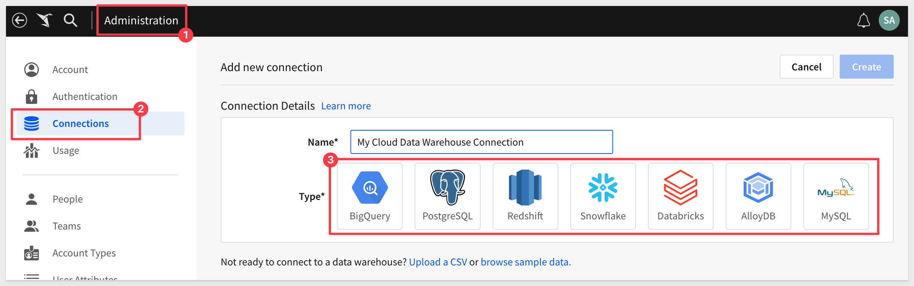

[Learn more...](https://help.sigmacomputing.com/docs/connect-to-data-sources)

Depending on the security parameters of your oganization, it may be necessary to add Sigma's IP addresses to your allowed list of IPs (whitelist).

Sigma's egress IP addresses are listed on all individual connection pages in your Sigma Admin Portal:

For example, selecting Snowflake displays the egress IP addresses:

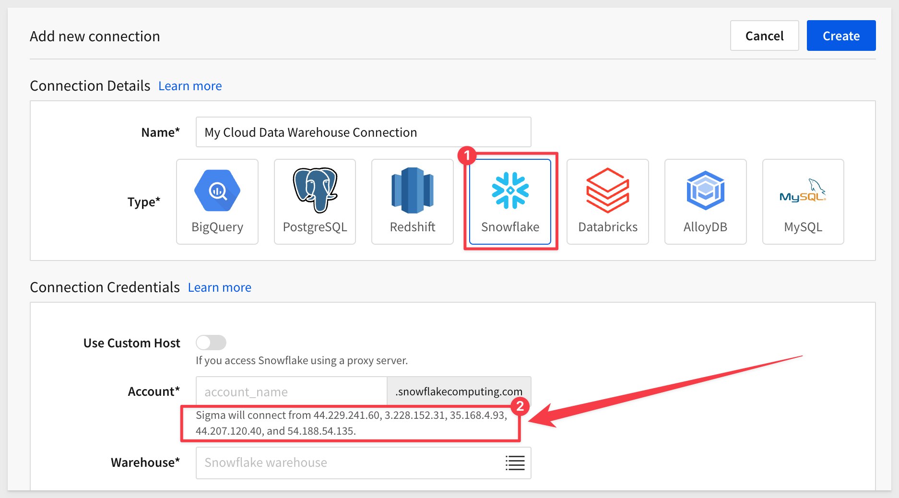

Another important configuration is warehouse write access. This is only required for specific Sigma features. If you are not using these features, it is not required.

Granting write access to a database enables the use of several Sigma features:

[CSV upload](https://help.sigmacomputing.com/docs/upload-csvs)<br>
[Materialization](https://help.sigmacomputing.com/docs/materialization)<br>
[Dataset warehouse views](https://help.sigmacomputing.com/docs/materialization)<br>
[Input tables](https://help.sigmacomputing.com/docs/intro-to-input-tables)

<aside class="negative">
<strong>NOTE:</strong><br> Not all features are available for each connection type. Refer to Sigma's documentation for the current list of supported vendors.
</aside>

<aside class="positive">
<strong>IMPORTANT:</strong><br> By design, the database destination that you configure for write access is not visible in the Sigma connection explorer pane. We recommend that you configure a separate database or a database and schema combination for write-access purposes.
</aside>

Sigma provides a set of sample data, at no cost, to all customers. The sample database is a great way to let new users become familiar with Sigma, without having to connect to corporate data. The connection is not editable and it can be hidden if desired.

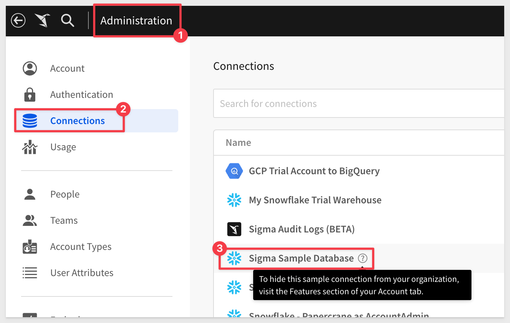


<!-- END OF SECTION-->

## Usage
Duration: 20

Sigma provides all customers with extensive reporting on various aspects of user activity. All the reports are built using Sigma and are provided at no-cost to customers. Admins can use this area to get a quick visibility to important KPIs but also leverage Sigmas "drill anywhere" capability to get to the lowest level of detail required.

<aside class="positive">
<strong>IMPORTANT:</strong><br> The usage section does not required customers to do anything, it just starts working as soon as users start using Sigma. Sigma also provides access to logs for customers that are interested in creating their own analysis of user activity.
</aside>

[To learn more about external logging, please review this QuickStart](https://quickstarts.sigmacomputing.com/guide/administration_audit_logging/index.html?index=..%2F..index#0)

At the time of this QuickStart, the following usage catagories are provided. Each category has many KPI, charts, tables and filters, formatted based on the available data.

**Users:**<br>
Explore user status, activity and licensing. Filter by date range and/or query text.


**Document Activity:**<br>
Discover your organization’s most commonly used documents and your top documents users. Filter by date range, Top N, and the number of days since the dashboards were last opened. These insights can assist organizations to audit unused documents and identify documents that drive the most user engagement.

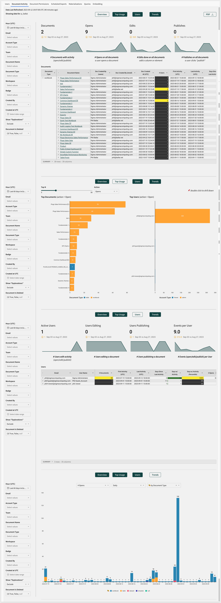

**Document Permissions:**<br>
Discover who has permissions for a document, the origin of the permissions, access ype, and who granted permission. These insights can help organizations to improvevsecurity.

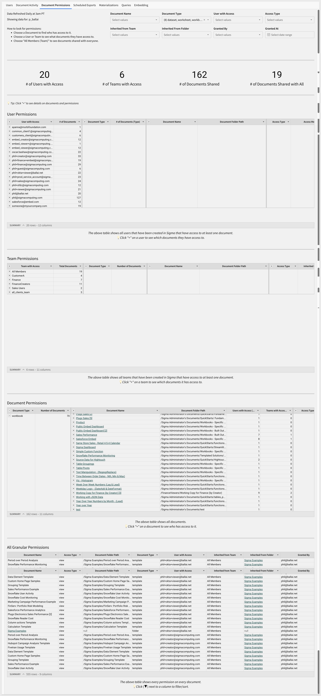

**Scheduled Exports:**<br>
View data on your organization's export tasks and Sendgrid email events.

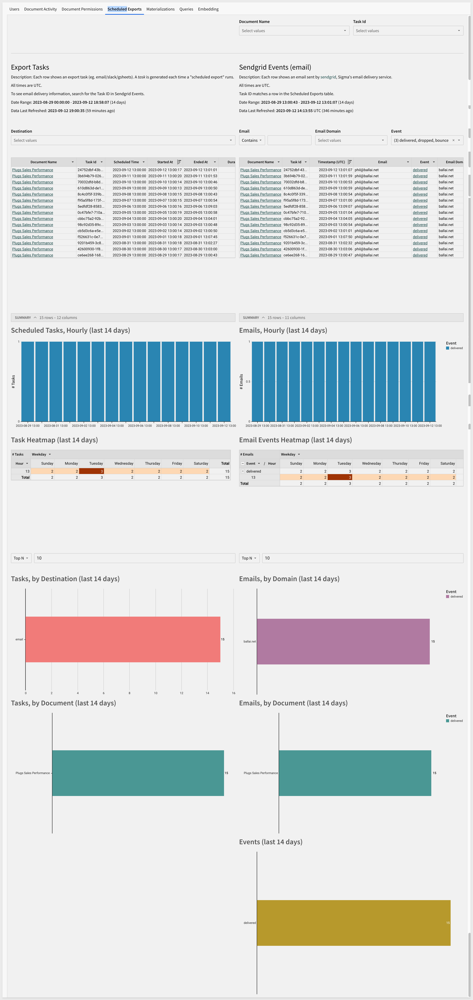

**Materializations:**<br>
Metrics and status of materialization runs with run-times.

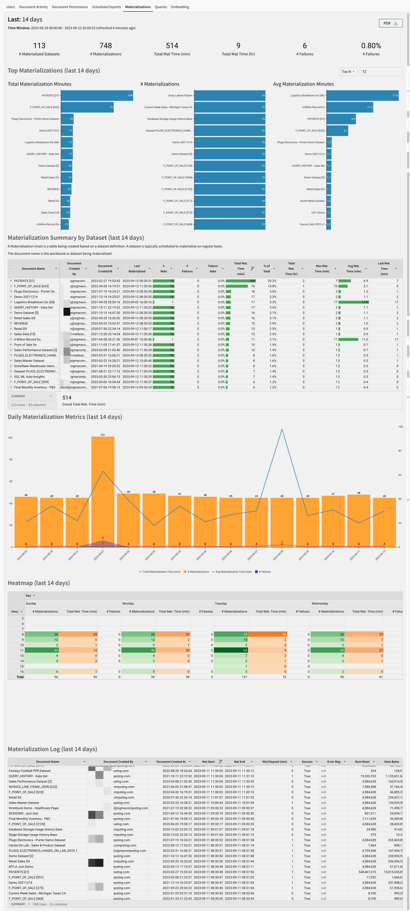

**Query Summary:**<br>
View a summary of your queries. Available data includes total queries run, queries over 10s, median query time, average query duration, queries by user type, query status, and timeouts. Filter by date range and/or query text.


**Embedding:**<br>
View application embedding usage for your organization. Private and Public embeds are not tracked. Each embed URL must include an external_user_id for tracking purposes.

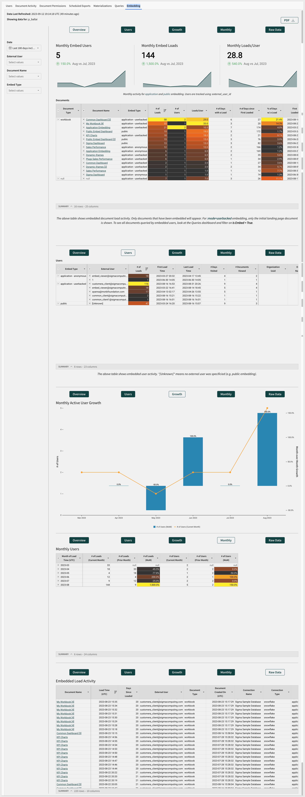


<!-- END OF SECTION-->

## People
Duration: 20

In Sigma, users are called `People`. 

People can be added manually to Sigma (and in bulk) or they can be added automatically the first time they login to Sigma with SSO or an embedded application. 

When added manually, people receive an email invitation. Once invited, their Sigma account is listed on the `Pending Invitations` section of the `People` page. 

Email invitations and welcome emails can be customized if desired.

[Learn more...](https://help.sigmacomputing.com/docs/manage-people)

<aside class="positive">
<strong>IMPORTANT:</strong><br> Sigma uses email address for each person and the email must be unique. 
</aside>

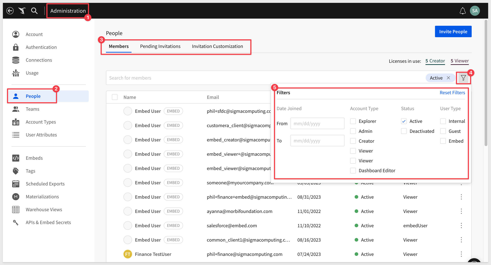

People in Sigma can be deactivated. After you click Deactivate, the user's documents are automatically migrated to the selected persons's `My Documents` folder. The deactivated user's documents will be located in `My Documents` > `Archived Users` > `Folder` (folder title is the deactivated user's name). There is no need to manually transfer all the worksheets/dashboards created by the user, **Sigma does this for you.**

[Learn more...](https://help.sigmacomputing.com/docs/deactivate-users)


<!-- END OF SECTION-->

## Teams
Duration: 20

Sigma uses teams to organize and manage users in groups.

You can use Sigma to manage user group membership or leverage your organizations Identity Provider (IdP).

Teams can be `Public` or `Private`.

Public teams are seen and searchable by all members of your Sigma org. Anyone will be able to share documents with public teams.

Private teams will only be visible to members of the team.

For example, in this "Finance Team" there are four users, two accessed Sigma via an embedded application and another logged into Sigma directly. The last user is an admin.

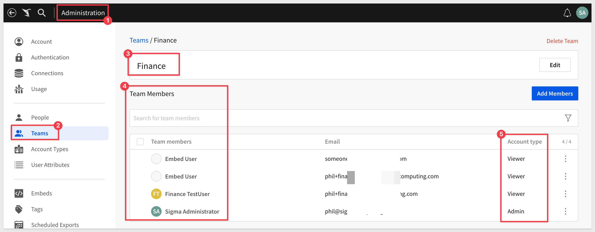

<aside class="negative">
<strong>NOTE:</strong><br> You can name a team anything you want but when embedding it is advisable to avoid special characters in names. 
</aside>

[Learn more...](https://help.sigmacomputing.com/docs/manage-teams)

When creating a new team, you are prompted to also create a new workspace (optional). You can use workspaces help organize content, to categorize and share folders and documents. Workspaces can be shared with other users and teams using permission grants.

[Learn more...](https://help.sigmacomputing.com/docs/manage-workspaces)


<!-- END OF SECTION-->

## Account Types
Duration: 20

Account Types allow different users different rights, and is Sigma's RBAC (role-base access control) system.

A user's account type determines their highest level of interaction with data and content in Sigma. 

Each user is assigned a single account type; they can only be assigned one account type at any time.

Sigma provides default account types and you can create your own as needed (custom account type). 

Custom account types in Sigma provides a way to restrict users to specific Sigma functionality. For example, a `Creator` role that does not allow exporting data would look like this:

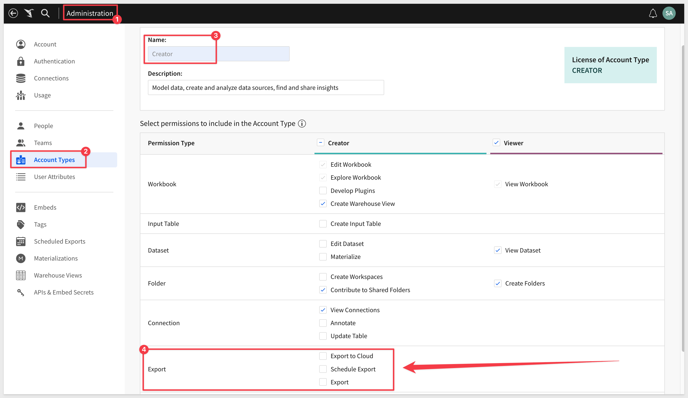

[Learn more...](https://help.sigmacomputing.com/docs/user-account-types)


<!-- END OF SECTION-->

## User Attributes
Duration: 20

User Attributes can be used to provide a customized experience for your Sigma teams, org members, and embedded users. They can be assigned as a function in a dataset to provide row-level security.

Once you create and assign a user attribute to teams, you can use this functionality in a dataset to enforce row-level security using the function CurrentUserAttributeText in a formula.  

For example, if we want to restrict a user `Finance TestUser` to only the rows that are in the `East` region, we create a user attribute like this:

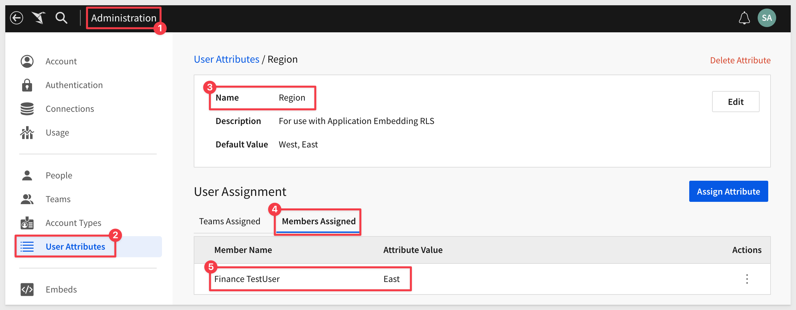

Then we use a formula on a dataset (that has a column called "Store Region") like this:

```plaintext
Contains(CurrentUserAttributeText("Region"), [Store Region])
```

The user would not be aware of the restriction and the data would be limited to the `East` region rows automatically.

For a step-by-step look at using user attributes, there is a [QuickStart here.](https://quickstarts.sigmacomputing.com/guide/embedding_4_row_level_security/index.html?index=..%2F..index#0)

[Learn more...](https://help.sigmacomputing.com/docs/user-attributes)


<!-- END OF SECTION-->

## Embeds
Duration: 20

The Embeds page lists all of the workbooks or dashboards that are active. 

It is common when using Sigma to embed content into another application(s), that many "embeds" are created. This page provides a simple way to manage them all in one place. 

It also alerts if there are basic configuration issues with an embed. For example, number three shows the `alert` symbol, indicating that the workbook no longer exists, although the embed configuration still does. We are able to either `Reassign embed` or simply delete it:

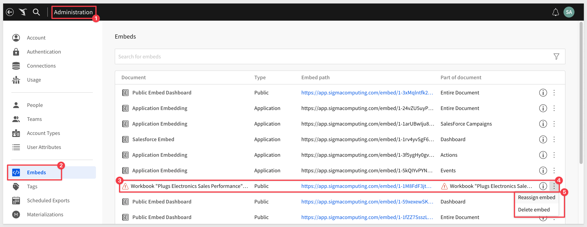

For those interested in embedding, there is an entire [series of QuickStarts dedicated to getting you going.](https://quickstarts.sigmacomputing.com/?cat=embedding)


<!-- END OF SECTION-->

## Tags
Duration: 20

Version tagging allows you to employ a software development lifecycle to control Workbook versions, using tags. For example, Sigma can have a development, staging, and production versions of a workbook and migrate changes as needed. This allows you to control which workbook versions are available to your users.

For example, the `QA-Check` tag below is we would tag a new workbook to, that we want only the `QA_Team` to have access to for testing. Once testing is complete, a member of that team might tag the workbook as "production" so that other users could access it.

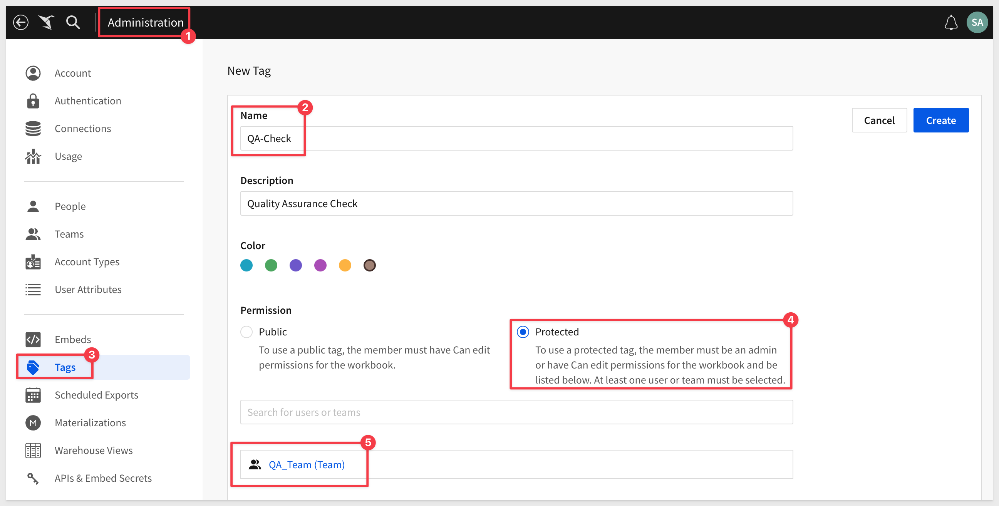

All documents that are tagged will appear in the corresponding tag page:

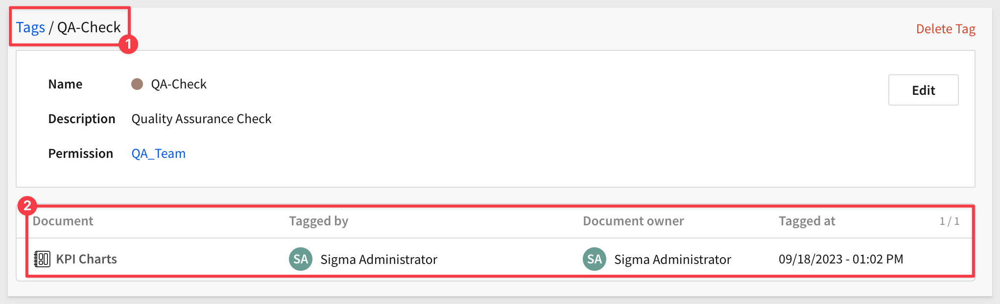

[Learn more...](https://help.sigmacomputing.com/docs/version-tagging)

For a step-by-step look at using tags in embedded applications, there is a [QuickStart here.](https://quickstarts.sigmacomputing.com/guide/embedding_8_version_tagging/index.html?index=..%2F..index#0)


<!-- END OF SECTION-->

## Scheduled Exports
Duration: 20

The scheduled exports page shows a summary of all exports that have been set to run a schedule; across all users. 

Admin are able to filter this list and delete scheduled jobs.

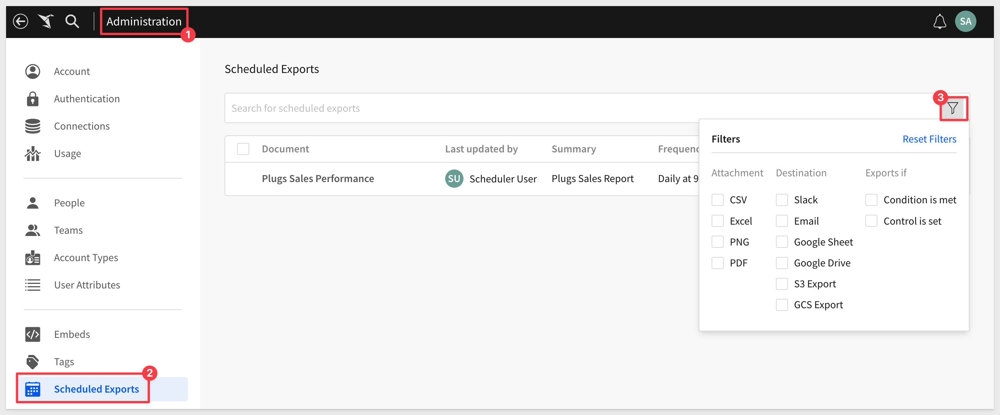

Sigma also provides extensive reporting on scheduled report usage:

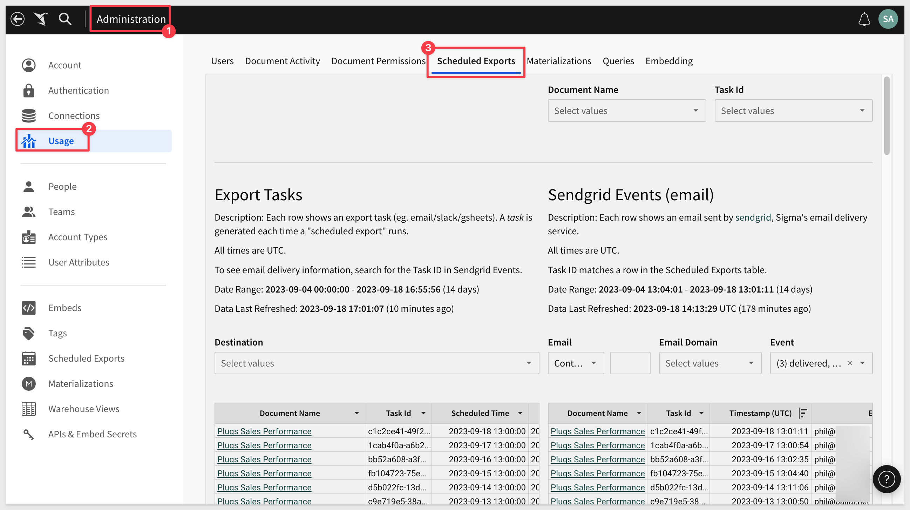

[Learn more...](https://help.sigmacomputing.com/docs/manage-organization-schedules)


<!-- END OF SECTION-->

## Materializations
Duration: 20

The materializations page summarizes all schedule materialization jobs, last run date, next run date, status, running time and when the data was last used. 

This can be very useful to admin wanting to ensure that jobs are not only running properly, but also that the result sets are being used. **There is no value (but is some cost!) in materializing data that is not being used by the business.** 

Sigma also provides an option to pause jobs that are not being used as shown (number three):

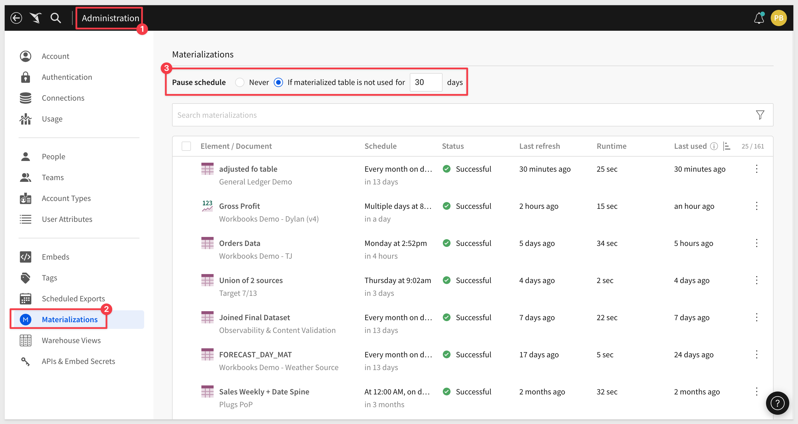

Admin are able to jump directly to the object being materialized, or perform other functions as shown:

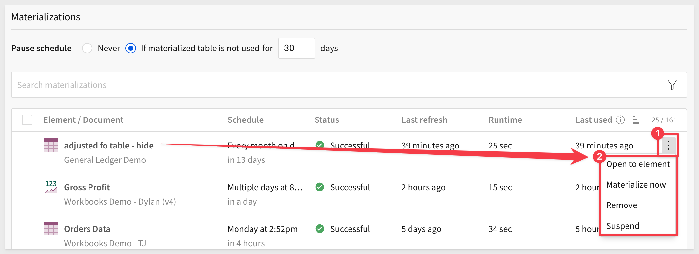

[Learn more...](https://help.sigmacomputing.com/docs/materialization)

[Materialization QuickStart](https://quickstarts.sigmacomputing.com/guide/administration_materialization/index.html?index=..%2F..index#0)


<!-- END OF SECTION-->

## Warehouse Views
Duration: 20

The Warehouse views page summarizes all views, their status, when they were created, last updated and the owner.

Warehouse views are virtual tables in Snowflake that can be queried using Sigma or any other application in your data ecosystem. Instead of storing data in a Snowflake database table, a view saves a SQL statement that expresses specific query logic defined by the data element or input table in Sigma.

When a warehouse view is created, a live link is established between Snowflake and Sigma. The view references the data element (or input table) as the source of truth and automatically updates to reflect the most recent version of the element’s underlying data. Warehouse views can be especially useful to present the data in a way that's optimized for analysis, without altering the base tables.


[Learn more...](https://help.sigmacomputing.com/docs/review-warehouse-view-details)


<!-- END OF SECTION-->

## APIs & Embed Secrets
Duration: 20

To access Sigma via API or leverage it for secure embedding, we require a token/secret be generated and used. This ensures that all communication between the browser and Sigma is secure.

<aside class="positive">
<strong>IMPORTANT:</strong><br> It is recommended that when generating a new token or secret that a "service account" user be used to assign the new key to.
</aside>

[To learn how to access Sigma via API, there is a QuickStart.](https://quickstarts.sigmacomputing.com/guide/sigma_api_with_postman/index.html?index=..%2F..index#0)

[There is also an API Swagger page.](https://docs.sigmacomputing.com/api/v2/)

[To learn how to access Sigma via embedding, there is a QuickStart.](https://quickstarts.sigmacomputing.com/guide/embedding_3_application_embedding/index.html?index=..%2F..index#0)


<!-- END OF SECTION-->

## What we've covered
Duration: 5

In this QuickStart we provided a very high-level overview of all the administrative features of the Sigma platform. Please be sure to check out the additional resources list below.

**Additional Resource Links**

[Help Center Home](https://help.sigmacomputing.com)<br>
[Sigma Community](https://community.sigmacomputing.com/)<br>
[Sigma Blog](https://www.sigmacomputing.com/blog/)<br>
<br>

Be sure to check out all the latest developments at [Sigma's First Friday Feature page!](https://quickstarts.sigmacomputing.com/firstfridayfeatures/)<br>

[](https://twitter.com/sigmacomputing)&emsp;
[](https://www.linkedin.com/company/sigmacomputing)&emsp;
[](https://www.facebook.com/sigmacomputing)


<!-- END OF WHAT WE COVERED -->
<!-- END OF QUICKSTART -->