summary: Hand-on Lab for new users and Sigma Pivot Tables
id: getting_started_working_with_pivot_tables_hol
categories: Getting-Started
status: Published
feedback link: https://github.com/sigmacomputing/sigmaquickstarts/issues
tags: Getting Started, Analytics, Data Engineering, BI, Business Intelligence, Sigma, Sigma Computing, Snowflake, Dashboarding, Visualization, Analysis, Excel, Spreadsheet
authors: Phil Ballai - Sigma Computing

# 4 - Working with Pivot Tables Hands-on Lab
<!-- ------------------------ -->

## Overview 
Duration: 5

 ### Target Audience
Sigma combines with the unlimited power of the cloud data warehouse and the familiar feel of a spreadsheet; no limit on the amount of data you wish to analyze. Sigma is awesome for users of Excel and even better for customers who have millions of rows of data.

Typical audience for this lab is users of Excel, common Business Intelligence or Reporting tools and semi-technical users who want to try out or learn Sigma. Everything is done in a browser so you already know how to use that. No SQL or technical skills are needed to do this lab.

### Prerequisites
<ul>
  <li>A computer with a current browser. It does not matter which browser you want to use.</li>
  <li>Completion of the QuickStart “Learning Sigma Series - Getting Around”</li>
  <li>Access to your Sigma environment. A Sigma trial environment is acceptable and preferred.</li>
  <li>If have not already, you can sign up for a Sigma Trial here:</li>
</ul>

<button>[Free Trial](https://www.sigmacomputing.com/free-trial/)</button>

### What You’ll Learn
Through this lab we will walk through why use a Pivot Table, how to use Sigma to create one adding conditional formatting and drilling down on table data.

### What You’ll Build
We will be working with some common sales data from our fictitious company ‘Plugs Electronics’. This data is provided to you automatically. 

We will build a Workbook that looks like this:

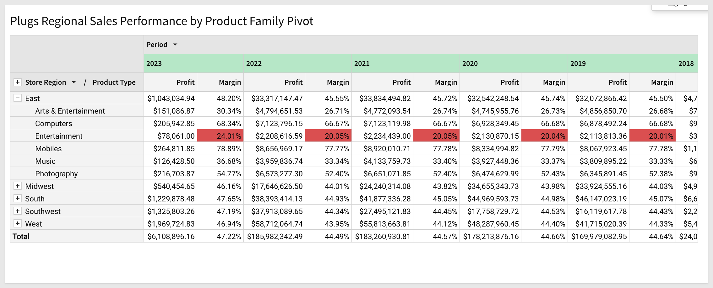

<!-- END OF OVERVIEW -->

## **Pivot Table Defined**
Duration: 10

It is important to understand what a Pivot Table **(Pivot)** is and how it is different from a typical table that might use grouping to provide the desired result set.

A Pivot Table is an interactive way to quickly summarize large amounts of data. You can use a Pivot Table to analyze numerical data in detail, and answer unanticipated questions about your data. A Pivot Table is especially designed for:

 <ul>
      <li>Querying large amounts of data in many user-friendly ways.</li>
      <li>Subtotaling and aggregating numeric data, summarizing data by categories and subcategories, and creating custom calculations and formulas.</li>
      <li>Expanding and collapsing levels of data to focus your results, and drilling down to details from the summary data for areas of interest to you.</li>
      <li>Moving rows to columns or columns to rows (or "pivoting") to see different summaries of the source data.</li>
      <li>Presenting concise, attractive, and annotated online or printed reports.</li>
</ul>

Tables tend to provide a flat organization of the data, although grouping and other features can make less obvious to users who are unfamiliar with the differences. 

For example, let's assume we want to look at Profit and Profit Margin by Regions and Product Type over time. We have the required columns in our source data as shown below and could **possibly** satisfy the requirement by grouping the data but the end result will not be easy for the viewer to interpret and they may have to make multiple clicks to orient the table to suit their interests. 

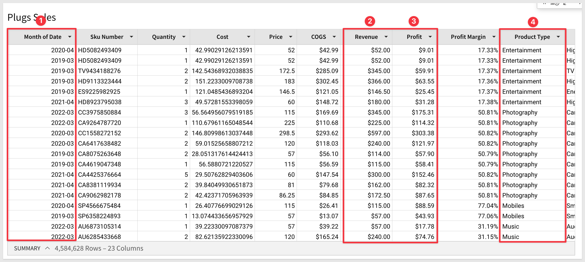

The grouped output of this may look something like this and you can easily see how the consumer may be frustrated:

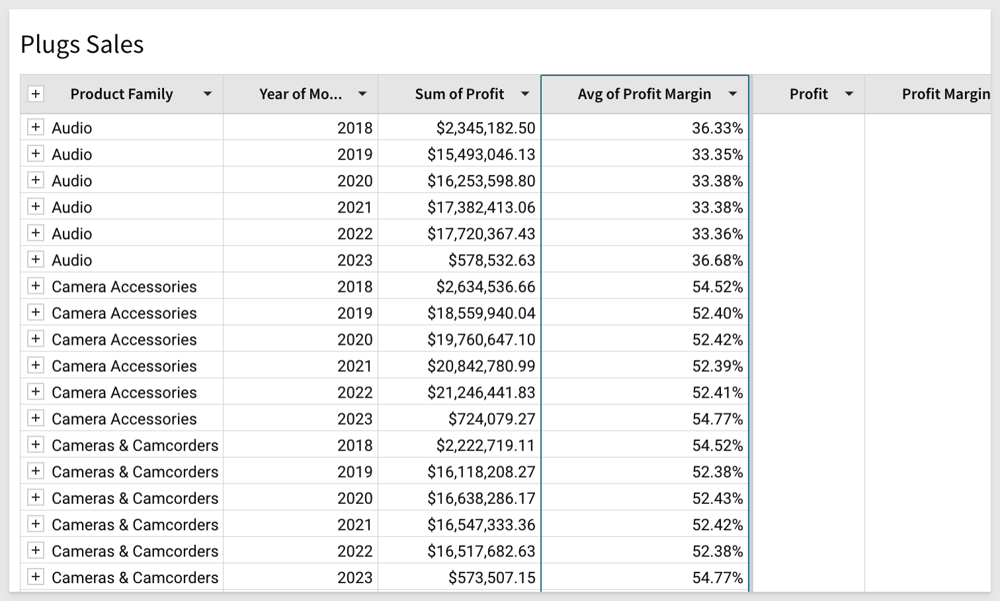

Let's create a Pivot instead.

<!-- END OF PIVOT TABLE BASICS -->

## **Creating a Pivot Table**
Duration: 10

In Sigma, open the Workbook `Plugs Sales` and place it in edit mode. We should still have the Page tab called `Data` that has the “Plugs Sales” Table on it. 

Add a `new Page` and name it `Pivot Table`. 

Click the `+ icon` to open the Editor Panel. This panel gives you access to all the objects possible to add to a Page. 
Select `Pivot Table` and for the source of data; we will use the Table on the Data page

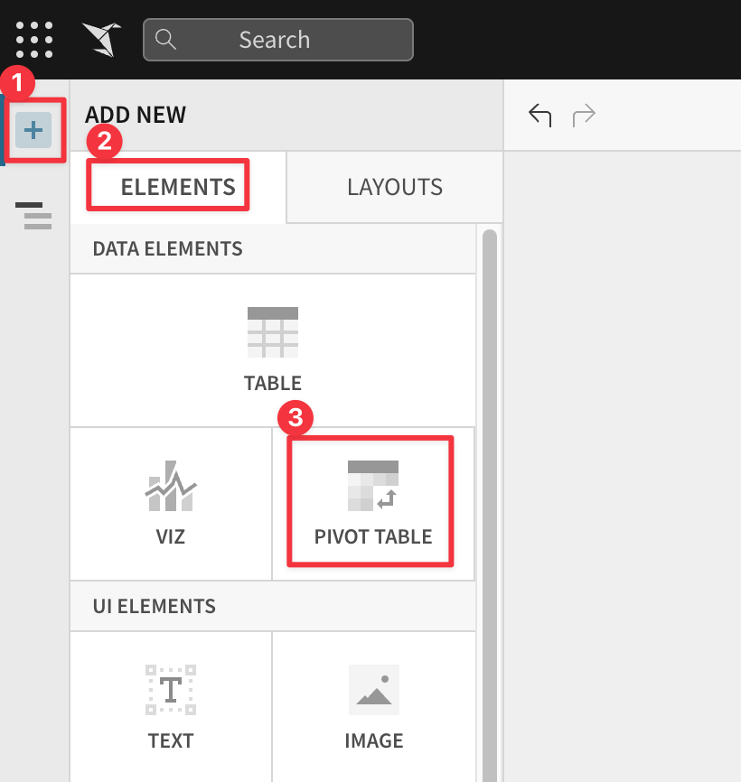&ensp;&ensp;&ensp; 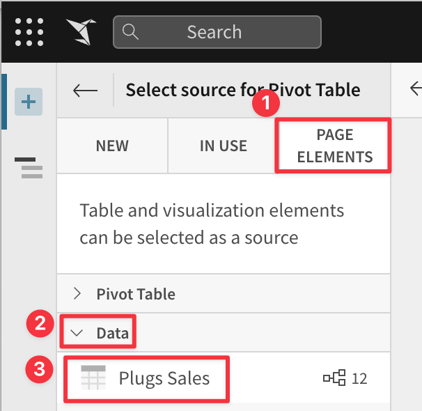

Notice that there are a few options for the source data. Reusing data that has already been queried from the Connection can help improve performance by limiting the number of queries sent to the Cloud Data Warehouse (CDW).

<aside class="positive">
<strong>Browser Query:</strong> 
While Sigma does push queries to the CDW to take advantage of its scale and speed, Sigma is unique in that it first does an evaluation to see if the query or operation can be done in the end user’s browser using the data in the browser cache. This functionality is called Browser Query and leads to near-instant results and a faster, better user experience. 

Browser Query can perform operations like queries, filters, and sorts. And it is important to note that it is NOT a desktop data extract or summary as is the case with many other BI tools. Browser Query uses fresh data from the CDW and as soon as the browser is closed, the cache is flushed and the data does not persist, eliminating security or governance risk.
</aside>

<ul>
  <li><strong>New:</strong> Allows you to obtain data from any of your Connections.</li>
  <li><strong>In Use:</strong> Allow you use source data that is already in use on another Page in this Workbook</li>
  <li><strong>Page Elements:</strong> Table and visualization elements can be selected as a source from the open Workbook</li>
</ul>

We now have our Pivot Table and can begin working just like a normal spreadsheet. Get ready, you may be pleasantly surprised by how easy this is in Sigma.

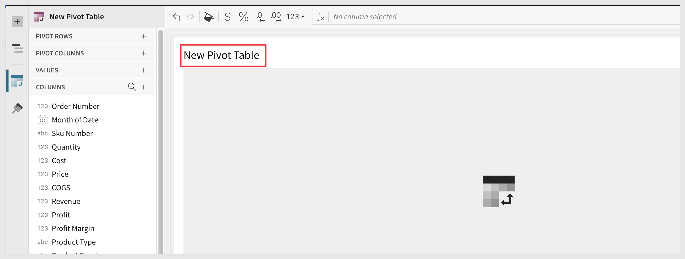

First we will want to drag `Store Region` and `Product Type` to our `Pivot row`. Notice that the Pivot table appears as we build? Already the resultant table is making more sense than our grouping example earlier:

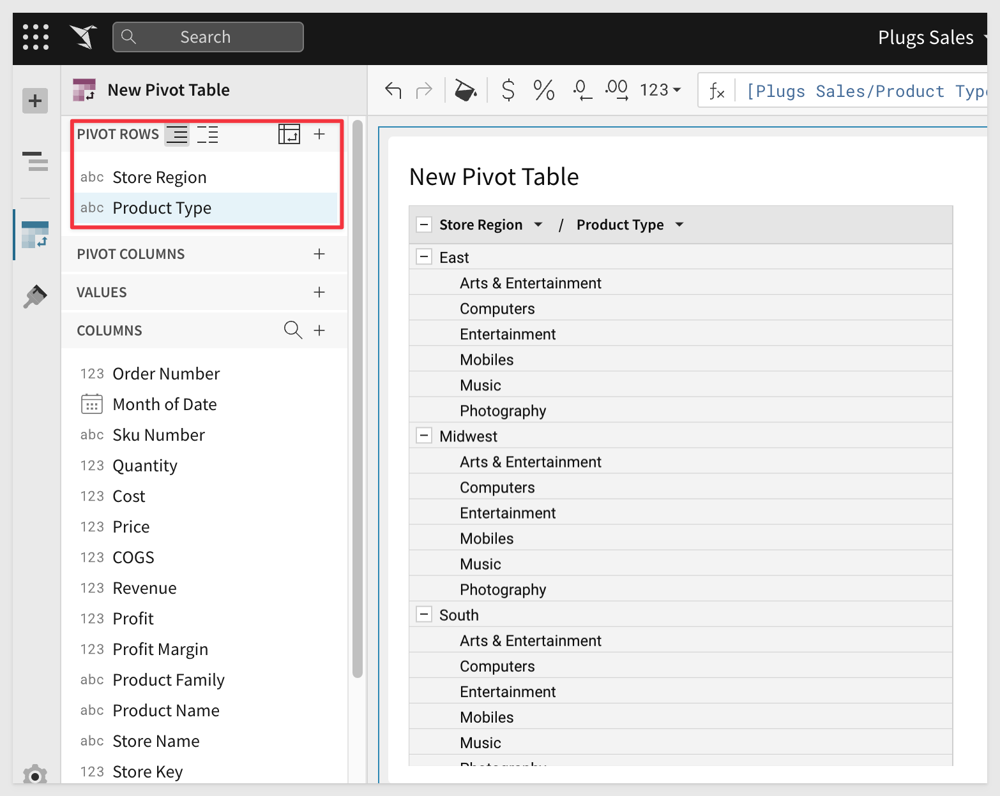

Next we will want to drag `Date` to the `Pivot column`. We also want to `truncate` the date to `Year`:

Depending on if you sorted your source data the most current year may not be shown first. Lets change to sort order to have our most recent year at the far left. You can either do this from the Pivot Column panel using the `dropdown` next to the `Year of Date` field, or we can do it directly in the Pivot Table itself by selecting the dropdown next to ‘Year of Date’ column header and clicking sort ‘Year of Date’:

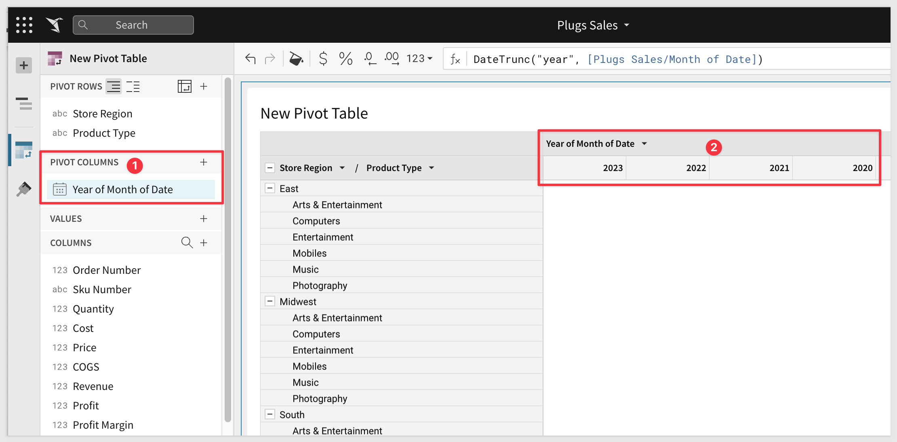

Lastly, we will want to add our values which we want to look at. Drag the `Profit` and `ProfitMargin` fields into the `Value` shelf.

Our `Profit Margin` is a little off, so let’s change it to be an Average instead of a Sum by clicking
the dropdown menu next to `Sum of Profit Margin` and selecting an `aggregation of AVG`:

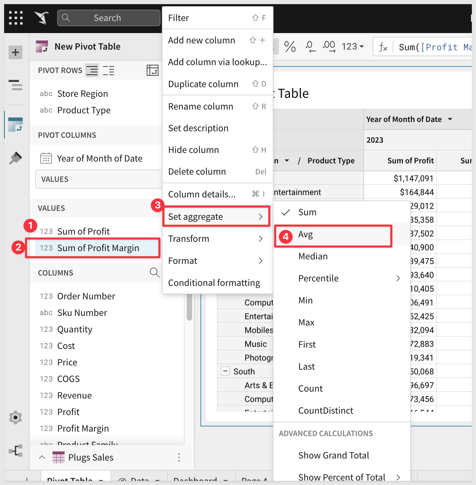

You also may want to change the Pivot Row and Column names to suit your needs.

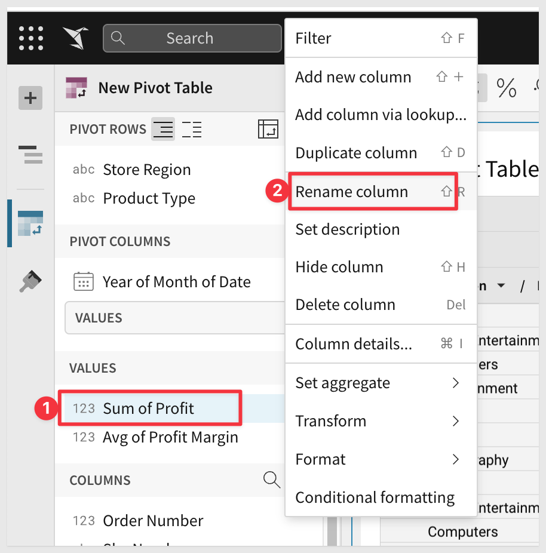

Let's say we only want to see the current and last year's data along with Totals. Just `enable the filter` the Pivot as shown below:

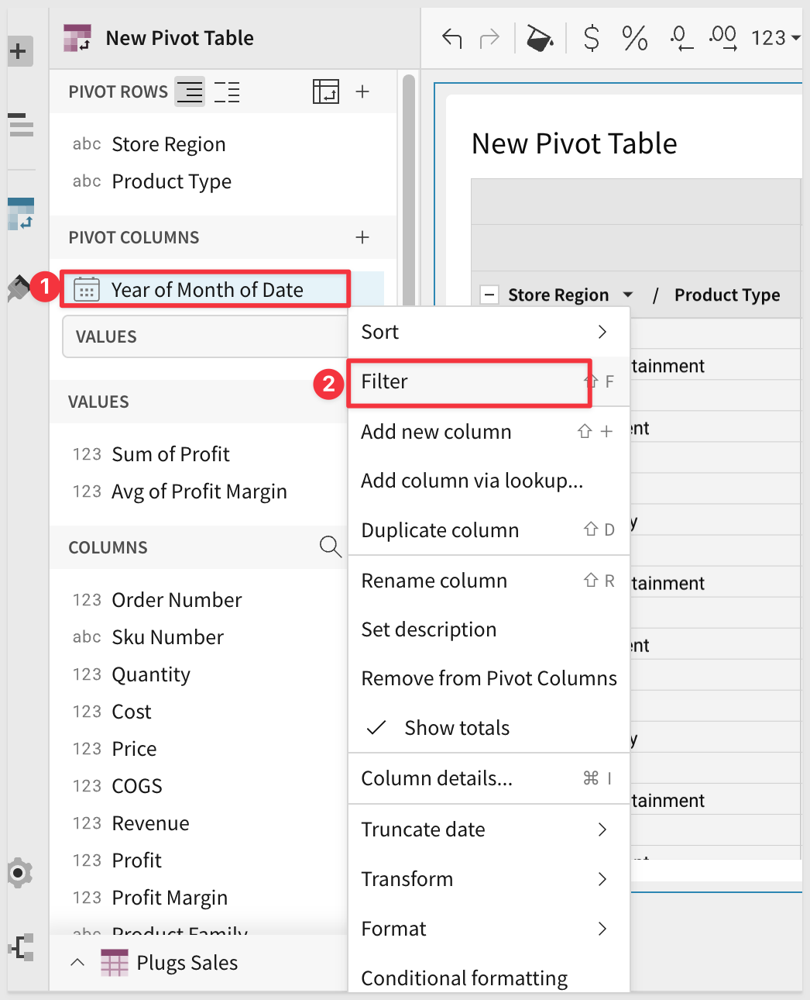

Set the desired Date range:

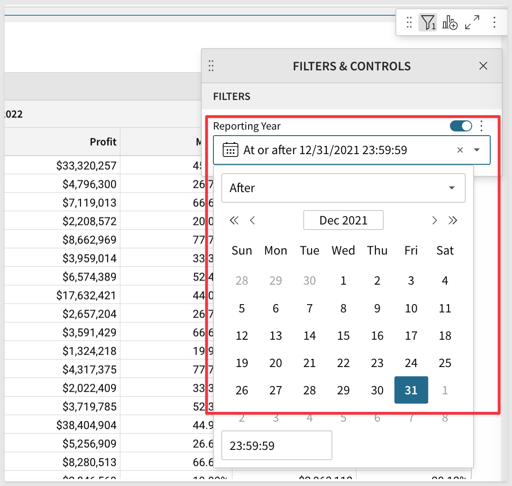

Apply Conditional Formatting to make the potential problems stand stand out. `Enable Conditional Formatting`:

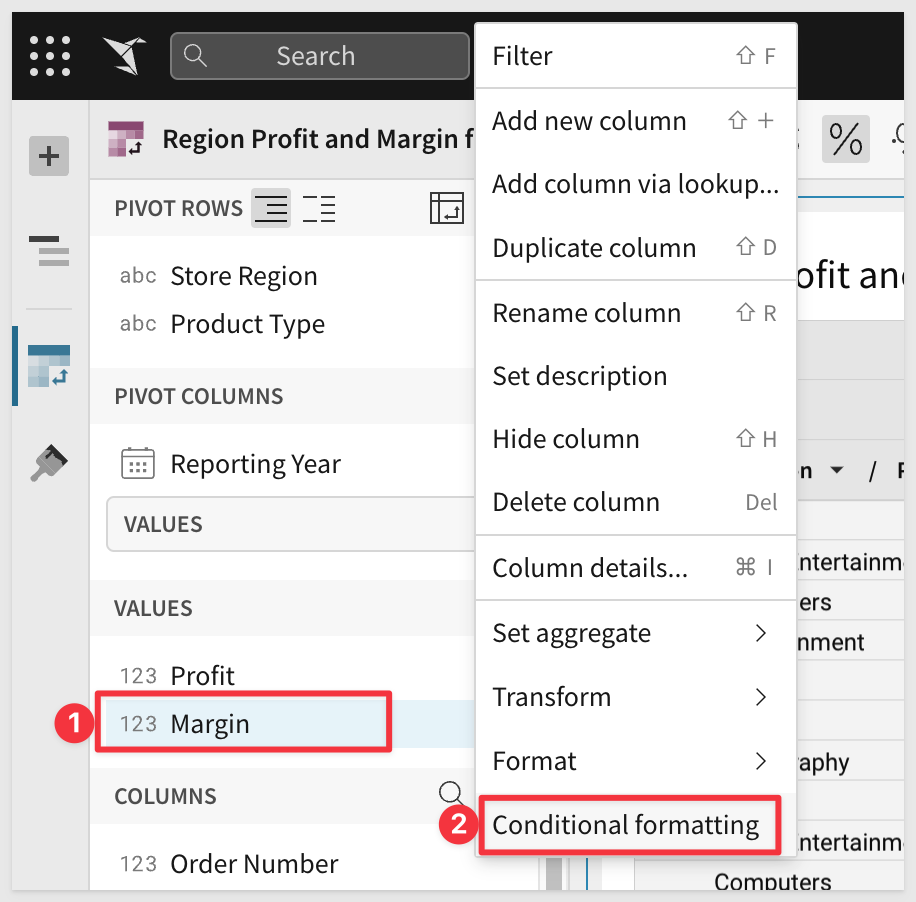

Se the Conditional Format rule as shown to high-light the Margin less than or equal to 25 percent in red:

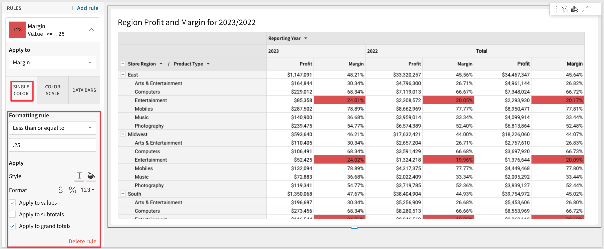

That's it; we now have a beautiful Pivot Table we can explore:

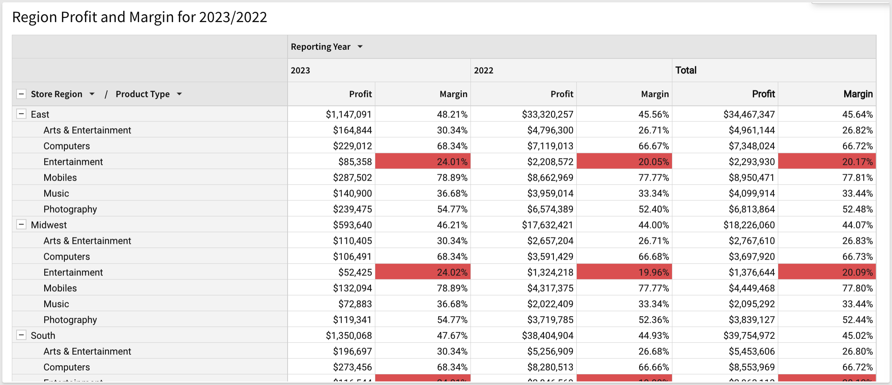

<!-- END OF CREATE A PIVOT TABLE  -->

## **Drill Anywhere**
Duration: 10

The presentation of the Pivot is just the starting point for the user who most likely cares about spotting problems or trends and taking action. From the last exercise we can see that the **East Region / Entertainment category is selling below margin guidelines**. We want more details!

`Right click` on the `Entertainment` product type in the Pivot and select `Keep only Entertainment`:

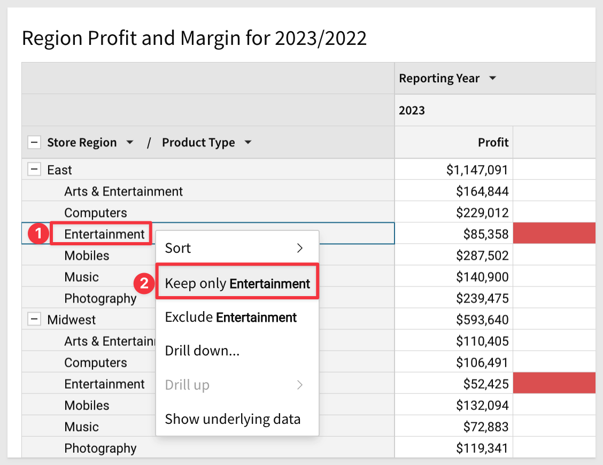

Next , `right click` on the `Entertainment` product type in the Pivot and select `Show underlying data`. You could also just click the `expand` icon as shown below with the red arrow:

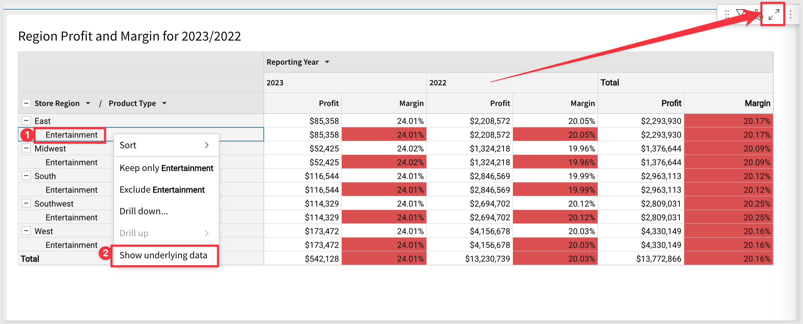

We are shown only the subset of data specified and can easily work with all the row level detail to see which transactions are being sold at lower than desired margins; in this case, televisions.

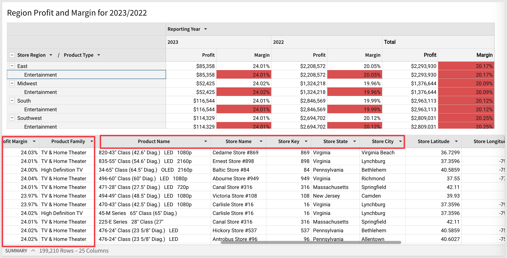

You can get back to the original Pivot by either clicking the `Back` icon or deleting any active filters you set (either click the x or use the 3-vertical-dot menu) as shown below:

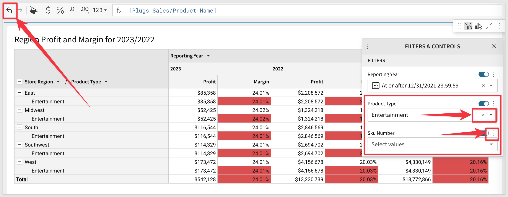

<!-- END OF DRILL ANYWHERE  -->

## What we've covered
Duration: 5

In this lab we covered why you might use a Pivot Table, how to use Sigma to create one adding conditional formatting and drilling down on table data.

**Additional Resource Links**

[Help Center Home](https://help.sigmacomputing.com/hc/en-us) 
[Sigma Community](https://community.sigmacomputing.com/) 
[Sigma Blog](https://www.sigmacomputing.com/blog/) 
 

&emsp;

<!-- END OF WHAT WE COVERED -->
<!-- END OF QUICKSTART -->
