author: pballai
id: internal_new_quickstarts
summary: This is a sample Sigma Guide
categories: PLEASE PROVIDE FROM LIST BELOW
environments: web
status: Hidden
feedback link: https://github.com/sigmacomputing/sigmaquickstarts/issues
tags: internal

# Setup a Local Environment for QuickStart Content Creation

## Overview 
Duration: 5 

Snowflake Quickstarts are interactive tutorials and self-serve demos written in markdown syntax. Quickstarts provide a unique step-by-step reading experience and automatically saves tutorial progress for readers. These tutorials are published at quickstarts.snowflake.com

You can submit your own Quickstarts to be published on Snowflake's website by submitting a pull request to this repo. This repository contains all the tools and documentation you’ll need for building, writing, and submitting your own Quickstart!

 ### Target Audience
Content creators interested in publishing to Sigma QuickStarts.


<!-- END OF OVERVIEW -->

## HomeBrew
Duration: 20

First we will install HomeBrew, which will provide easier installation of additional packages later. 

Go to the HomeBrew website and click the "clipboard" icon to copy the script: 

[Install HomeBrew](https://brew.sh)

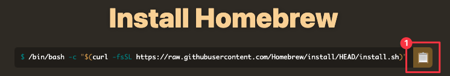

In your Mac, open `Spotlight search` and type `terminal`. Then click to select the `Terminal.app` as shown:

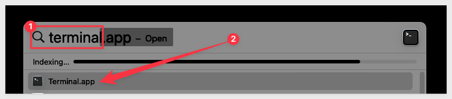

From the Terminal command prompt, paste the clipboard we copied from HomeBrew:

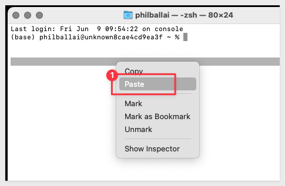

Hit enter:

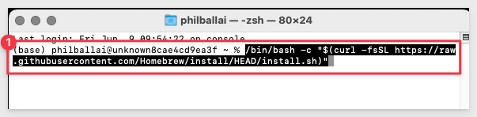

You will be prompted to enter your Mac password:

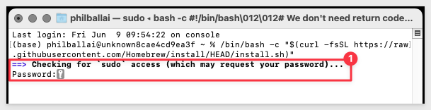

The script will run and you will be prompted to hit "Enter" to proceed:

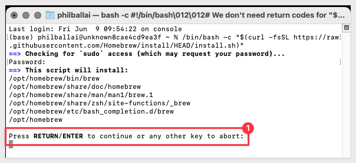

When the script is done, the command prompt will appear as shown:

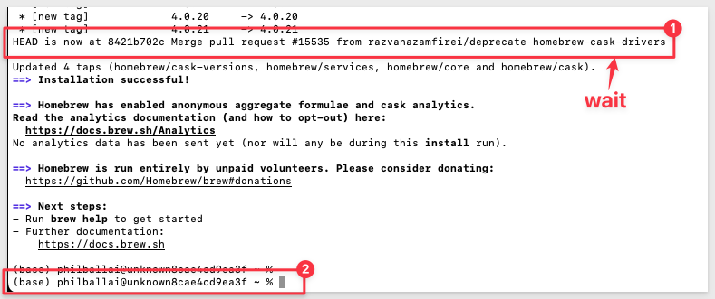

<aside class="negative">
<strong>NOTE:</strong><br> This script may take a few minutes depending on the speed of your computer.
</aside>

HomeBrew is now installed.


<!-- END OF NEXT SECTION-->

## Node.js (Node)
Duration: 20

We will now install Node.js.

Node.js is an open-source, server-side runtime environment that allows developers to build scalable and high-performance web applications, in this case, QuickStarts.

Return to our open Terminal and execute the command:
```plaintext
brew install node
```

Now install Node Package Manager::
```plaintext
npm install -g grunt-cli
```

Verify node is installed correctly:
```plaintext
node -v
```

and 
```plaintext
npm -v
```

You should see a version number (version should not matter) returned for each command. This means Node and the Node Package Manager are installed and working:

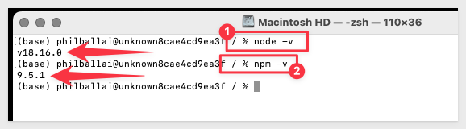


<!-- END OF NEXT SECTION-->

## Gulp-CLI
Duration: 20

Gulp is a popular task runner for JavaScript. The Gulp CLI (Command Line Interface), also known as gulp-cli, is a separate package that provides the command-line interface for running Gulp tasks.

Using Terminal, run the following command to install Gulp-cli:
``` plaintext
sudo npm i -g gulp-cli
```

You will be prompted for your Mac password:

When done, the Terminal cursor will appear on a blank line.

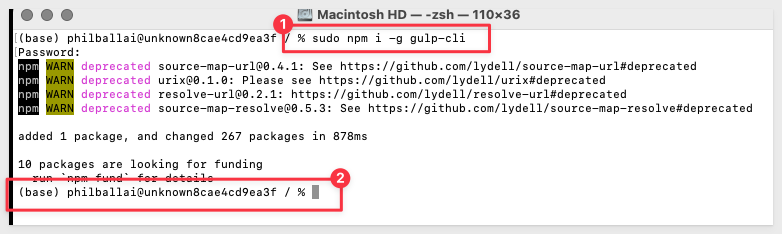


<!-- END OF NEXT SECTION-->

## Go
Duration: 20

In Terminal, execute the following command:
```plaintext
brew install golang
```

When done, the Terminal cursor will appear on a blank line.

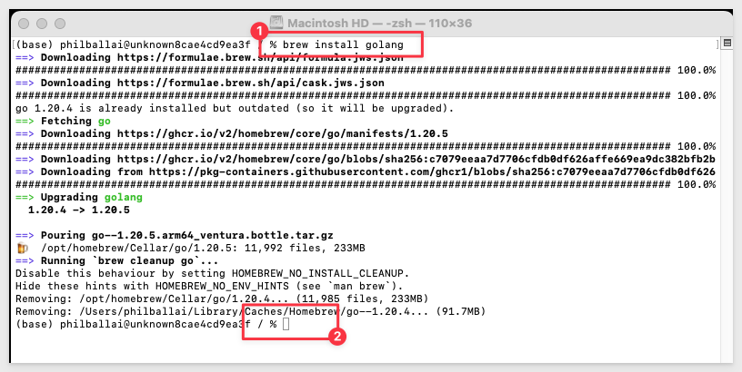

In Terminal, execute the following command:
```plaintext
touch~/.bash_profile; open ~/.bash_profile
```

<aside class="negative">
<strong>NOTE:</strong><br> On some computers, the file ~/.bash_profile may not exist so we will have to create it manually. If you receive an error message when running the touch command, please scroll down to the section on manually creating the file.
</aside>

If the file is found, this will open your Mac profile configuration file where we can verify that the first 4 lines exist.

If they do not, please add them and save the file. 

Here is the codeblock to copy and paste:
```plaintext
#adding Golang to path
export PATH=$PATH:/$HOME/go/bin

#adding node and brew to path
export PATH="/usr/local/bin:$PATH"
```

You can now go to the section 6 of the QuickStart.

### Manually creating .bash_profile
In the case of the file not existing, we need to create it. 

In terminal, execute the following command:
```plaintext
vi ~/.bash_profile
```

Here is the codeblock to copy and paste:
```plaintext
#adding Golang to path
export PATH=$PATH:/$HOME/go/bin

#adding node and brew to path
export PATH="/usr/local/bin:$PATH"
```

In the "vi" editor, you need to press the `:` key to exit edit mode. 

After pressing `:`, press `w` to save the file and then `q` to quit back to the terminal prompt.

You can now go to the section 6 of the QuickStart.


<!-- END OF NEXT SECTION-->

## claat
Duration: 20

In Terminal, execute the following command:
```plaintext
go install github.com/googlecodelabs/tools/claat@latest
```

When done, the Terminal cursor will appear on a blank line.

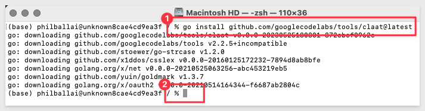


<!-- END OF NEXT SECTION-->

## VSCode
Duration: 20

[Download and install VSCode for Mac from the Microsoft website.](https://code.visualstudio.com/download)

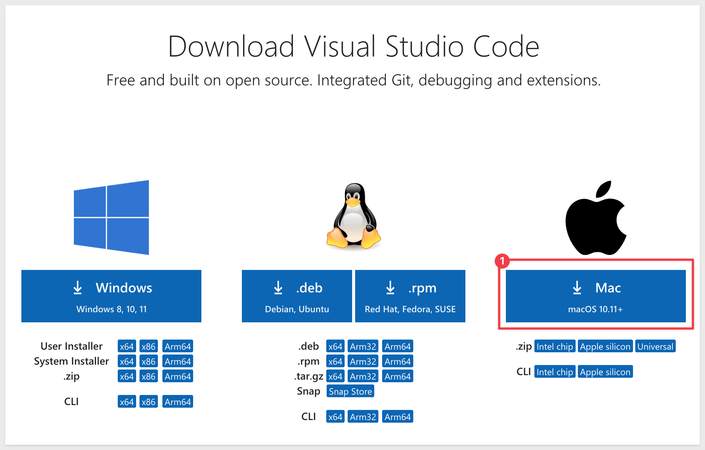

When the download completes, open the zip file:

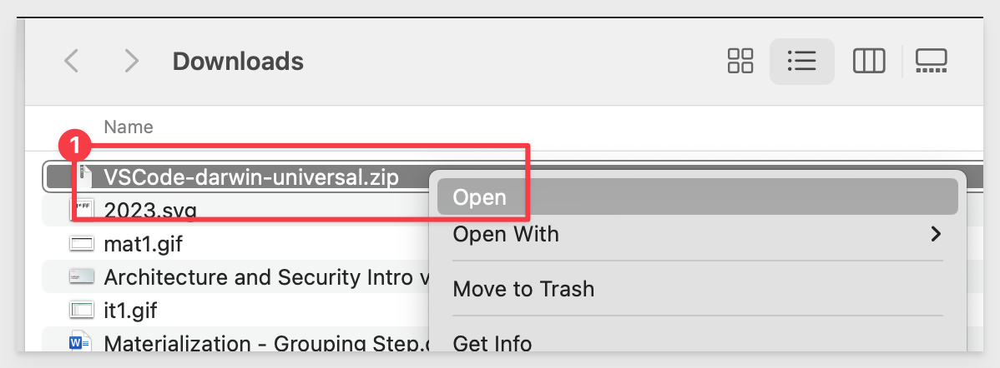

For convenience, we will move the extracted `app` file to `Applications`.

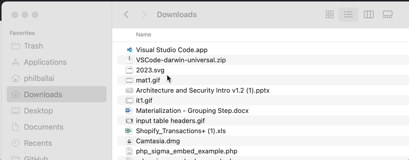

Now you can access VSCode from the Mac "Applications" list. 

**We don't need to open it just yet.**


<!-- END OF NEXT SECTION-->

## GitHub Desktop
Duration: 20

[Download and install GitHub Desktop from the website.](https://desktop.github.com/)

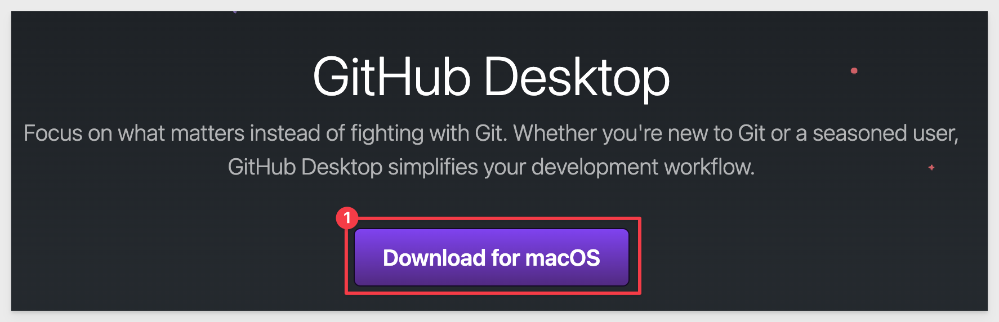

In Mac Finder, open the zip file:

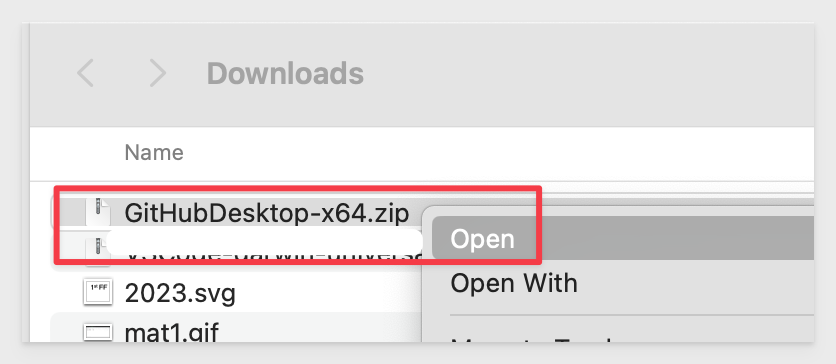

For convenience, we will move the extracted `app` file to `Applications`.

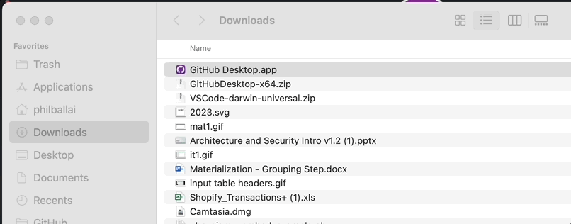

Now you can access GitDesktop from the Mac application view. Go ahead and do that.

On the "Let's get started!" screen, click as shown to clone a repository:

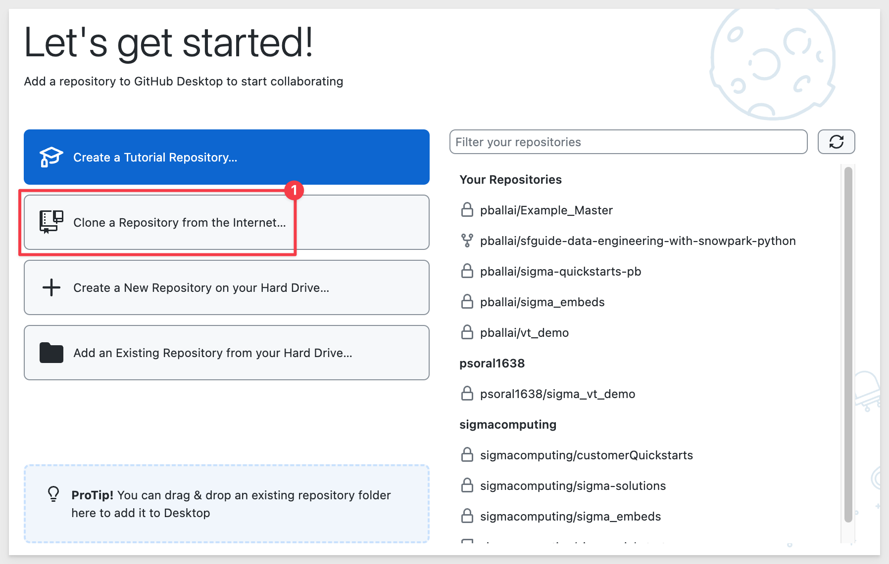

We need to provide GitHub Desktop with the URL of our repository. 

[Using a browser, navigate to the Sigma QuickStarts GitHub page:](https://github.com/Sigmacomputing/sigmaquickstarts)

<aside class="negative">
<strong>NOTE:</strong><br> You will need to create a GitHub account (free). If you have not done that, please set one up as it is required as we interact with GitHub later.
</aside>

Click to copy the **HTTPS** URL as shown:

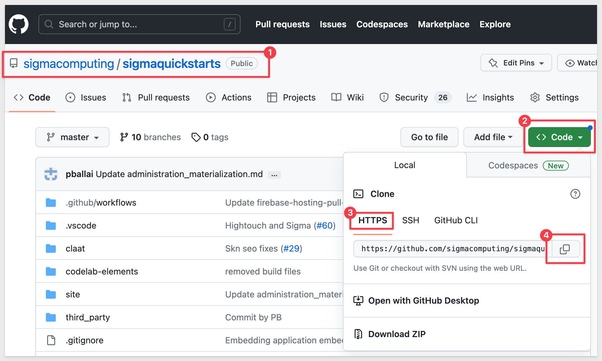

Paste the URL in GitHub Desktop under the `URL` tab:

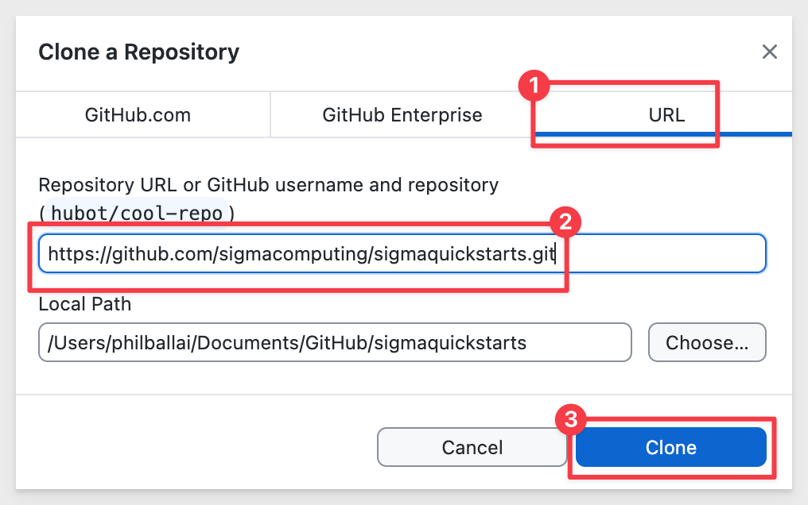

<aside class="negative">
<strong>NOTE:</strong><br> The value for "Local path" is where the QuickStart files will be stored on your Mac
</aside>

Click `Clone`.

The cloning operation will start. This is copying the current QuickStarts content to your Mac. It will take a few minutes.

GitHub Desktop will (when clone is completed) the current repository (#1), the current branch (#2) and give you the option to open this local repository in VSCode:

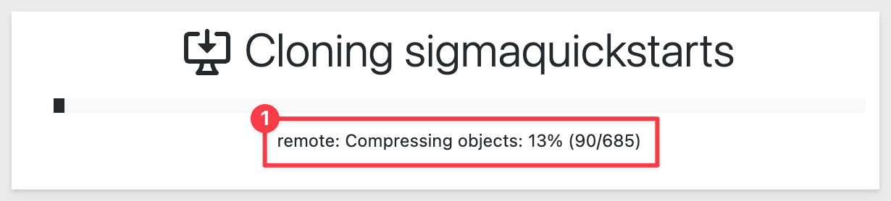

Click to open in VSCode.

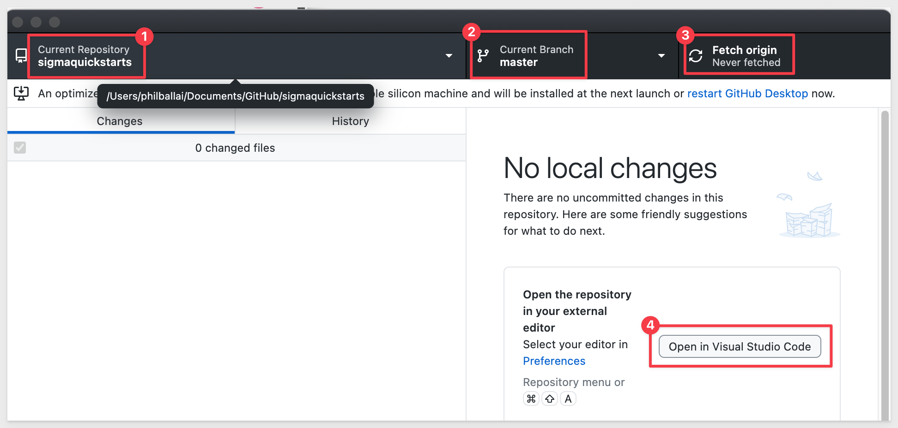


<!-- END OF NEXT SECTION-->


## Site Overview
Duration: 20

With the QuickStarts project open in VSCode, we can see all the files and folders. We will not be using the vast majority of these when creating content but they are required to make the site work locally. 

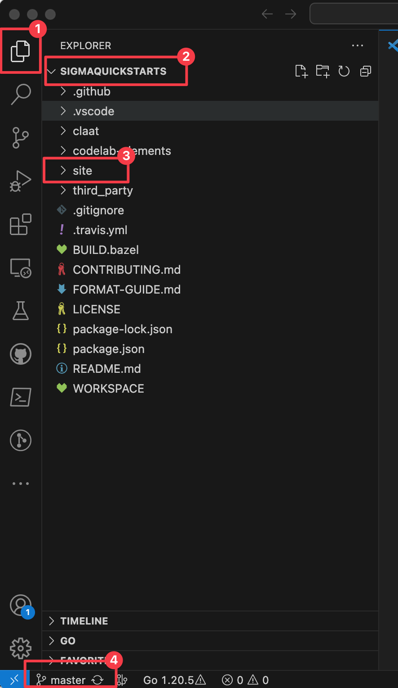

Expand the `site` and `sigmaguides/src` folder:

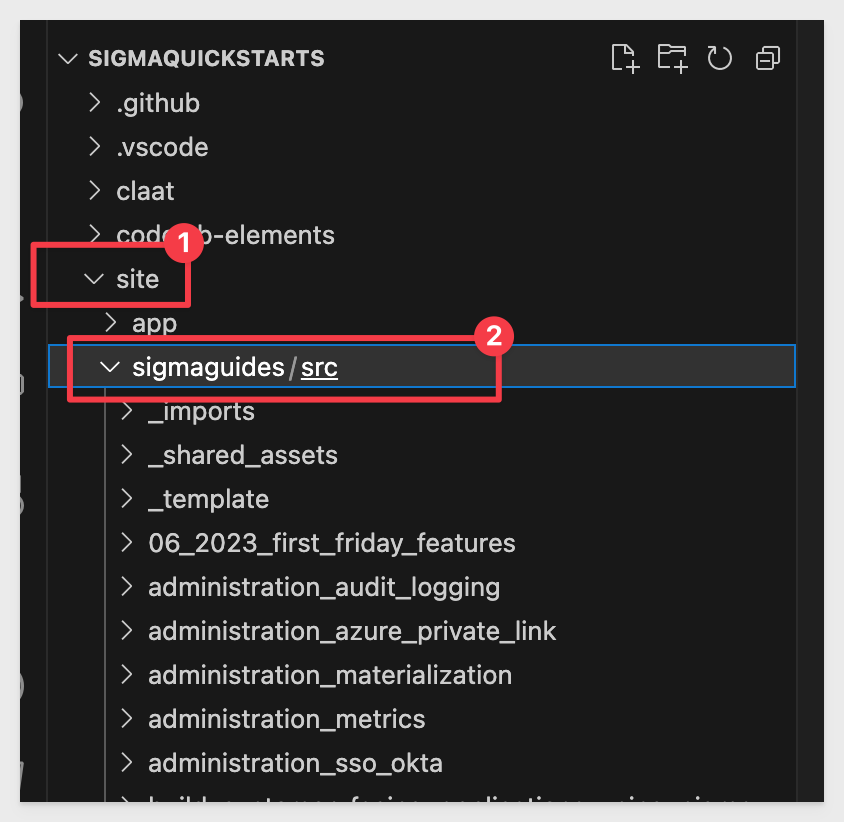

This is the primary folder where content creators will work with QuickStart content.

Before we start working with QuickStarts (first time only), we need to complete the site configuration using Terminal. 

VSCode provides an integrated Terminal to make this easy. 

Using the VSCode menu, click the `Terminal` menu and select `New Terminal`:

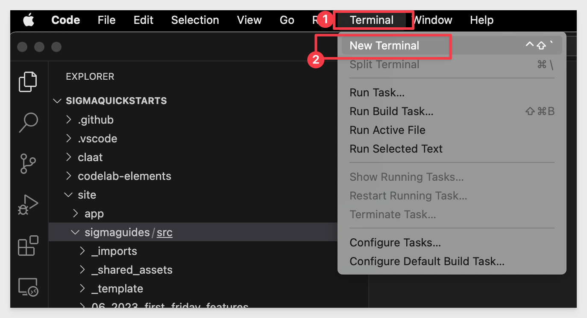

A Terminal window appears inside VSCode.

From the Terminal command line, change the directory to site:
```plaintext
cd site
```

Execute the command to set the correct filepath:
```plaintext
source ~/.bash_profile
```

<aside class="positive">
<strong>IMPORTANT:</strong><br> The previous command needs to be executed anytime VSCode is exited completely. In Step 12, we show how to configure VSCode to eliminate this requirement.
</aside>

Next, execute the command (to install the npm packages inside QuickStarts):
```plaintext
npm install
```

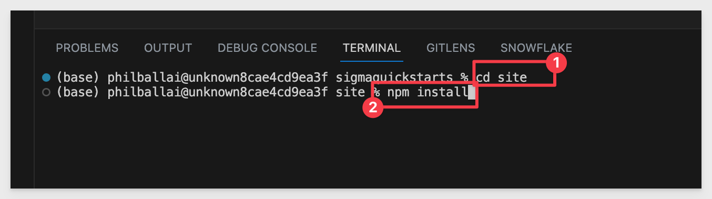

When completed, a command prompt will appear, and information about how many packages were added"

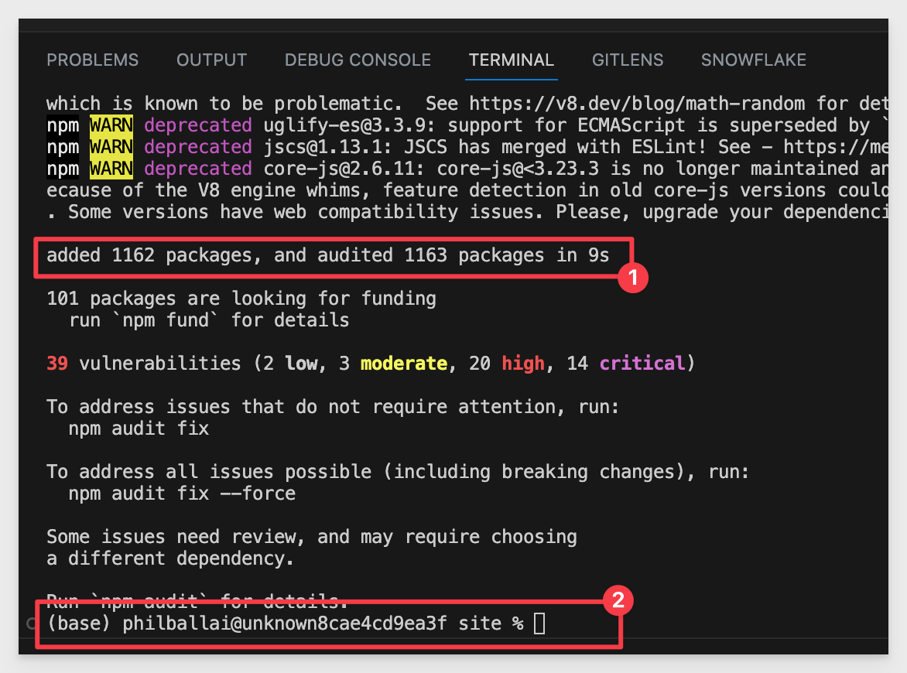

Next execute (in Terminal):
```
npm run serve
```

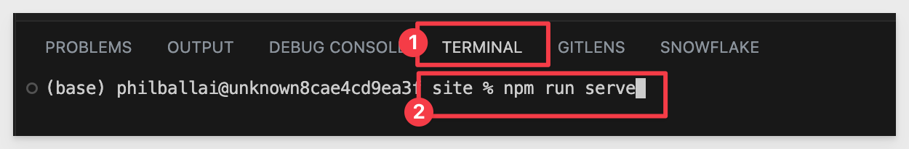

This compiles the QuickStart web application and makes it available on `http:\\localhost:8000`

There is no "ready" message but if there are no errors, the last line looks like this:

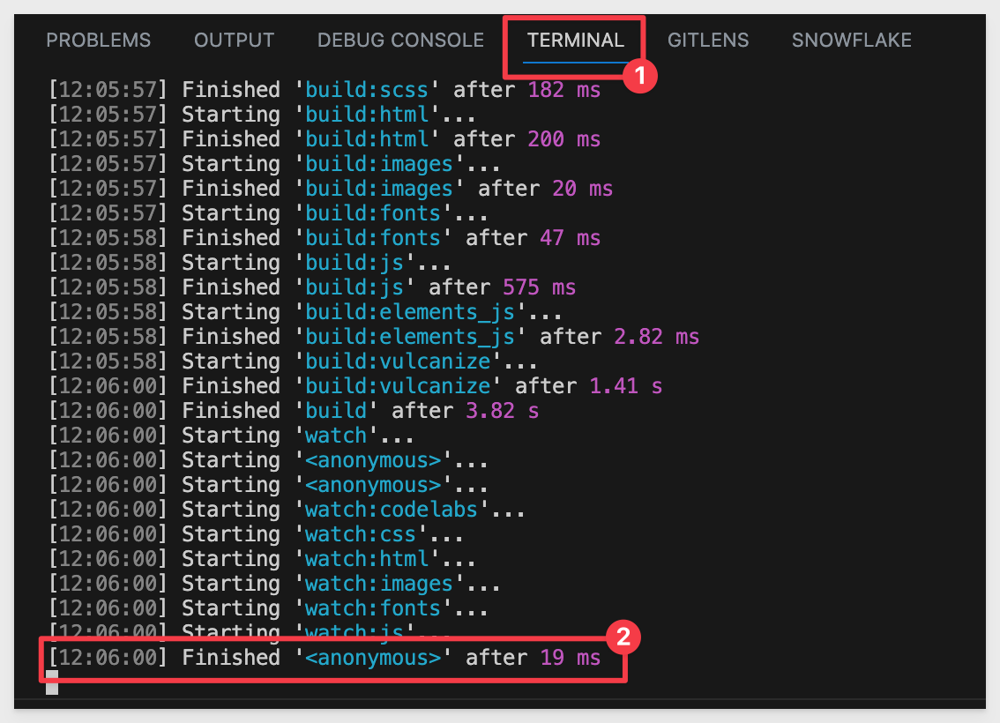

Using a browser, navigate to `http:\\localhost:8000`. The website should load:

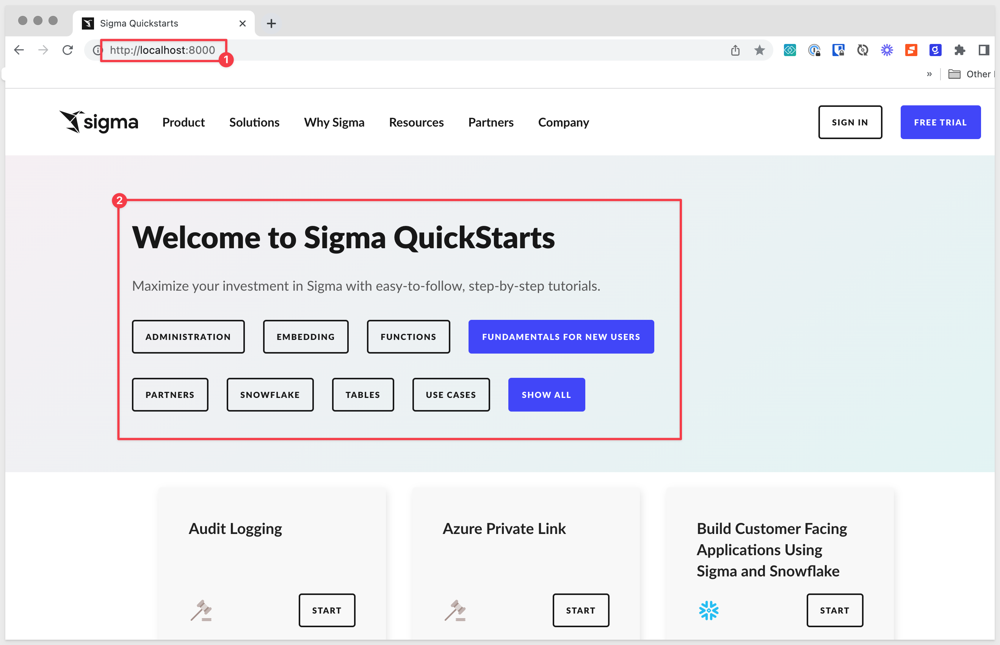


<!-- END OF NEXT SECTION-->

## Content Creation
Duration: 20

When creating a new QuickStart, or modifying an existing one, **ALWAYS** create a new branch. 

Before you create a new branch, also **ALWAYS** use GitHub Desktop to "pull" the latest changes for the master branch. This ensures that you are always building off the most recent production code from our Git repository. 

<aside class="positive">
<strong>IMPORTANT:</strong><br> NEVER work in the "master" branch. Your changes will be rejected on publication to GitHub
</aside>

Using GitHub Desktop, click to create a `New Branch`:

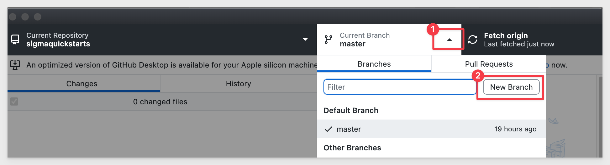

Give your branch a name and click `Create Branch`:

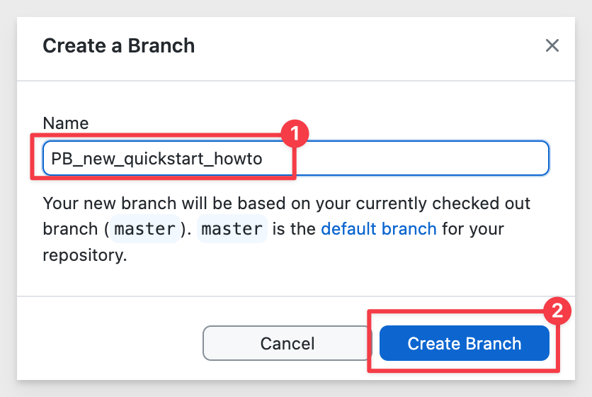

<aside class="negative">
<strong>NOTE:</strong><br>  The branch name is only related to Git and not in any way something a QuickStart user will ever know about. It is used to isolate "sections" of work from one another and makes the code more resilient when problems occur.
</aside>

GitHub Desktop automatically switches to your new branch which means you are now using that branch which is isolated from all other branches.

There is also a "Publish" button, which will push the new branch to GitHub but we have not made any code changes so no need to do that now.

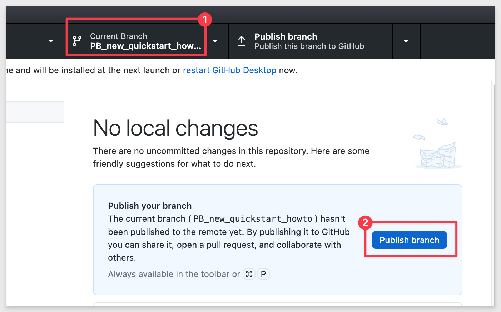

Go back to VSCode and see that the branch has already been switched here too:

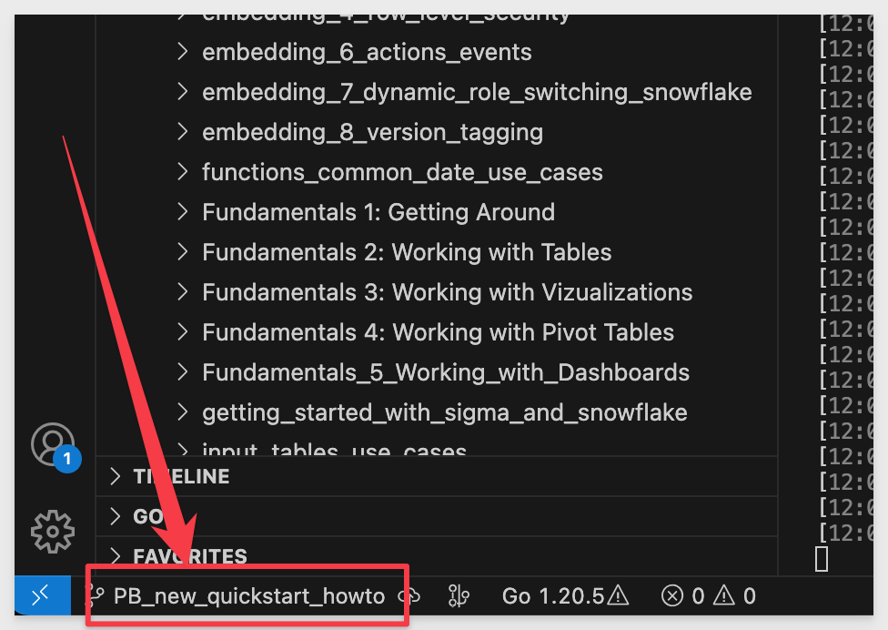

We can create a new QuickStart automatically (based on a template) using VSCode Terminal

In VSCode Terminal, we left off with the site running so we need to terminate that. 

Press `CTL + C` to terminate and return to the command prompt.

Execute the following two commands to create a new QuickStart in our new branch:

First change to the src folder
```plaintext
cd sigmaguides/src
```

Then execute this command to create a new QuickStart:
```
npm run template {YOUR QUICKSTART NAME}
```

<aside class="positive">
<strong>IMPORTANT:</strong><br> The name you specify will be the name of the folder in the project but not the name that is shown on the QuickStart card later. That is configured in the markdown inside this new folder.
</aside>

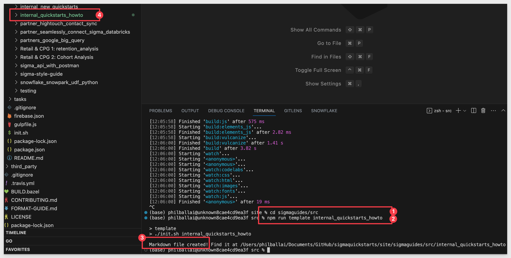

VSCode notices that changes have been made in the new branch and shows you them on the `Source control` icon of VSCode. 

Clicking on that icon we can see the list of changed items.

As we make ongoing changes to our new branch we can make "local commits". This allows us to revert changes locally at any time. Consider this "local source control". 

When ready to commit (ie: at end of day), enter a commit message and click `Commit`:

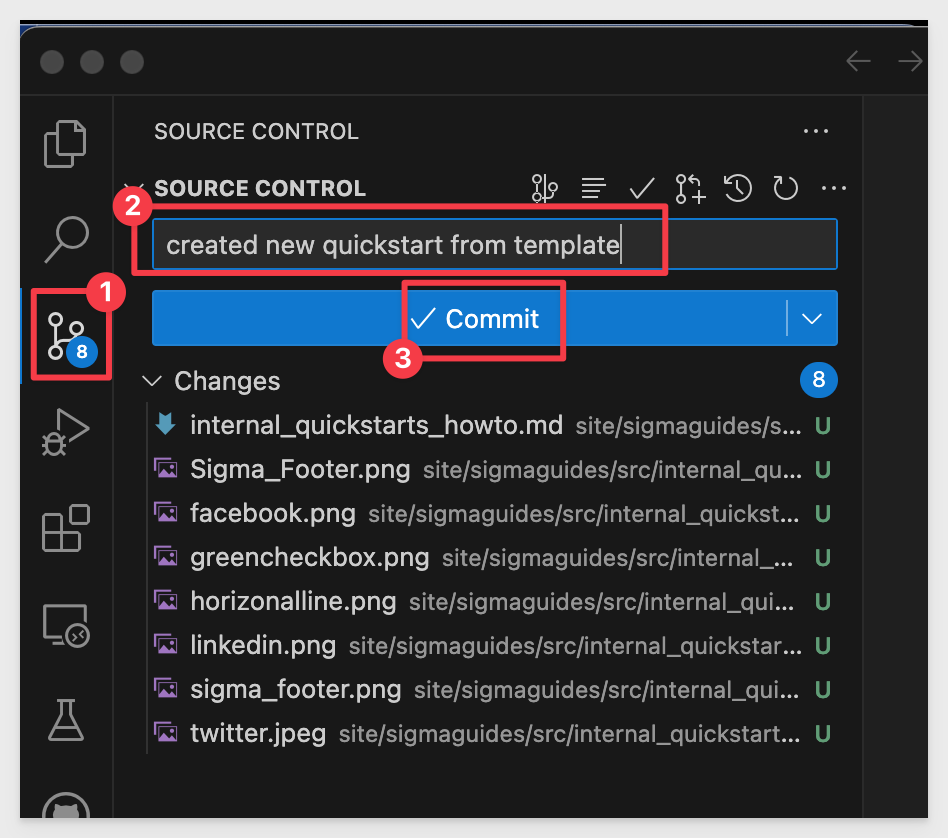

<aside class="negative">
<strong>NOTE:</strong><br> VSCode may throw an error on your first local commit (asking for username and email address to be configured). If so, please execute the instructions below the image.
</aside>

Execute to following commands in VSCode Terminal (replace the username and email with the values used in your GitHub web account):
```plaintext
git config --global user.name "John Doe"
```
...and then:
```plaintext
git config --global user.email johndoe@example.com
```
<br>
VSCode provides a "Publish Branch" button but we will use GitHub Desktop for publishing branches to Git as well as creating "Pull Requests". 

A Pull Request notifies the Git Administrator that there is something to review and approve.

Lastly, open the new QuickStart.md file (this is the markdown file that defines a QuickStart).

The template has comments in green (you can delete them if you want) to assist you in the important items that require consideration.

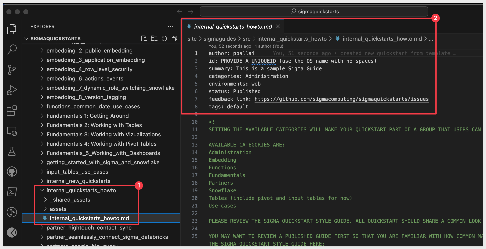

These are the critical items:

 <ul>
      <li><strong>id:</strong> a unique value; use the folder name with no spaces in it is fine</li>
      <li><strong>categories:</strong> The category must exist and the list is provided in the template</li>
      <li><strong>status:</strong> Published or Hidden.</li>
      <li><strong>tags:</strong> must be default unless otherwise specified by QuickStart team</li>
</ul>

Please review the [QuickStart Style Guide](https://quickstarts.sigmacomputing.com/guide/sigma-style-guide/#0). 

This guide provides all the available and supported markdown methods.


<!-- END OF SECTION-->

## Publication
Duration: 5

1. Make a new branch in GitHub Desktop
2. Make your changes in VSCode and save/commit them
3. Publish your branch to GitHub using GitHub Desktop
4. Create a Pull Request (PR) in GitHub Desktop
5. Open this repository on GitHub.com
6. Open the Pull Request and set an approver to Namdar
7. Sigma will review and approve the submission
8. Verify the QuickStart is live once you get an email that the Pull Request was approved

Once approved, the QuickStart will be live in under 5 min.


<!-- END OF SECTION -->

## VSCode - Extra Configuration
Duration: 5

### Eliminate the requirement to run source ~/.bash_profile each time∏

We can live with this or do some extra configuration to eliminate the extra step in VSCode. 

In VSCode, press `cmd` + `shift` + `p` to access the settings search bar.

Type in `preferences: open` and then click to select `Preferences: Open User Settings`:

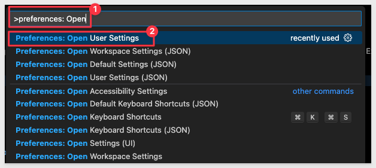


Type in `@feature:terminal` and then scroll down to find `Edit in settings.json`. Click that link for the one that corresponds to `Osx`:

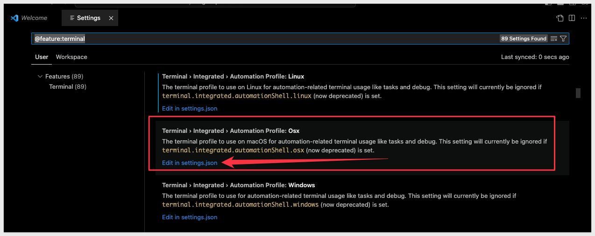

This will open a `settings.json` file. We will add the following code that will instruct VSCode to always use the .bash_profile file we created in Step 5.

Copy and paste the following code as shown in the image (make sure you also add the leading comma shown in the image)
```plaintext
    "terminal.integrated.env.osx": {
        "BASH_ENV": "${HOME}/.bashrc"
    },
```

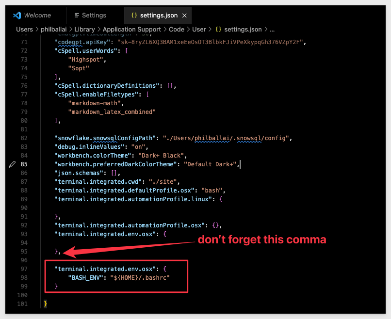

<aside class="negative">
<strong>NOTE:</strong><br> The other lines shown in the above image (not related to our new codeblock) will likely vary depending on what is installed on your VSCode instance. We can ignore those.
</aside>

Save `settings.json`. 

Quit and restart VSCode.

Now new terminal sessions will not require running the command `source ~/.bash_profile`.

### Make Terminal open in "site" directory
While this is minor, less typing is better. 

In VSCode, press `cmd` + `shift` + `p` to access the settings search bar.

Type `terminal.integrated.cwd`. 

Enter the desired folded that new Terminal sessions should open in:
```
./site
```

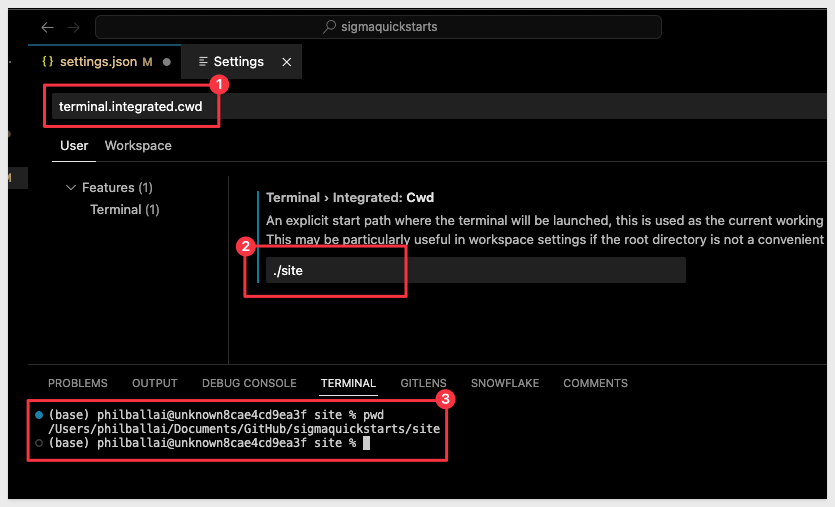

Now new Terminals will always open in the quickstarts\site directory so that we can then directly execute `npm run serve` to start the web-server.


<!-- END OF SECTION -->

## Common Errors
Duration: 5

### 1. Claat related errors
   - Make sure Go is properly in your `PATH`. Add the following lines to your profile (`~/.bash_profile`):
````plaintext
#adding Golang to path
export PATH=$PATH:/$HOME/go/bin

#adding node and brew to path
export PATH="/usr/local/bin:$PATH"
````
  ***Note:** After adding Go to your `PATH`, be sure to apply your new profile: `source ~/.profile` in VSCode Terminal or review Step 12*

### 2. You get a `EACCES` error when installing `gulp-cli`
   - This means that your npm location needs to be updated. Follow the steps here: [Resolve EACCESS permissions](https://docs.npmjs.com/resolving-eacces-permissions-errors-when-installing-packages-globally#manually-change-npms-default-directory)

### 3. You get `Error: Cannot find module 'postcss'` when running `npm run serve` 
   - The module may not have been installed for some reason so run `npm install --save-dev postcss gulp-postcss` and then rerun `npm run serve` 


<!-- END OF SECTION -->
<!-- END OF QUICKSTART -->
