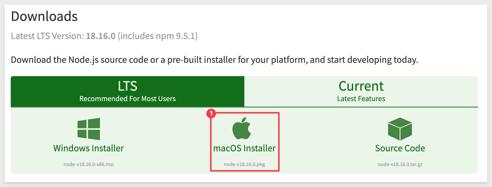
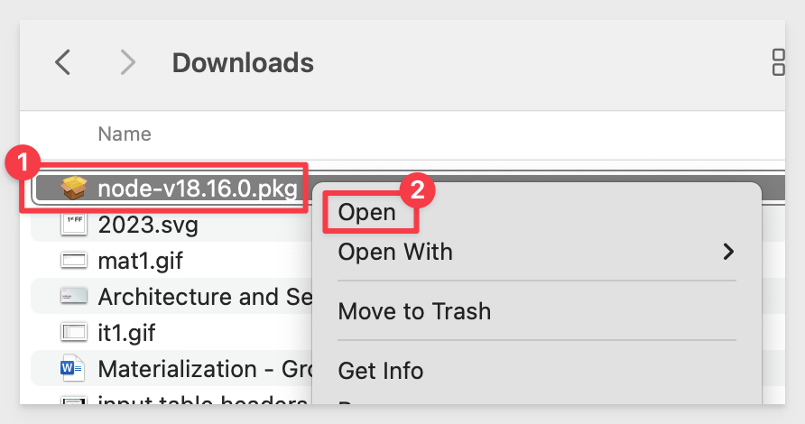
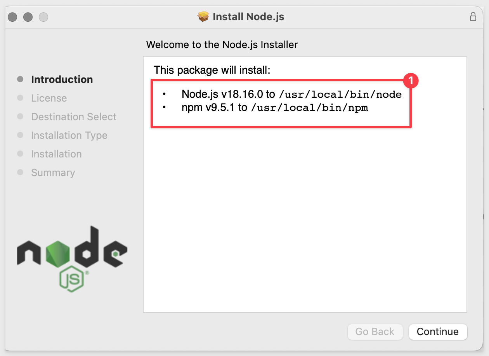
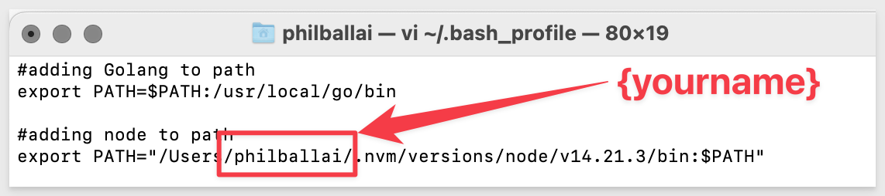

author: pballai
id: internal_new_quickstarts
summary: This is a sample Sigma Guide
categories: PLEASE PROVIDE FROM LIST BELOW
environments: web
status: Hidden
feedback link: https://github.com/sigmacomputing/sigmaquickstarts/issues
tags: internal

# Setup Local Development

## Overview 
Duration: 5 


Snowflake Quickstarts are interactive tutorials and self-serve demos written in markdown syntax. Quickstarts provide a unique step-by-step reading experience and automatically saves tutorial progress for readers. These tutorials are published at quickstarts.snowflake.com

You can submit your own Quickstarts to be published on Snowflake's website by submitting a pull request to this repo. This repository contains all the tools and documentation you’ll need for building, writing, and submitting your own Quickstart!

 ### Target Audience
Content creators interested in publishing to Sigma QuickStarts.

### Prerequisites

9. **Recommended**: install the live-reload plugin for Chrome: 
      -  [LiveReload](https://chrome.google.com/webstore/detail/livereload/jnihajbhpnppcggbcgedagnkighmdlei)


<!-- END OF OVERVIEW -->

## HomeBrew
Duration: 20

First we will install HomeBrew, which will provide easier installation of additional packages later. 

Go to the HomeBrew website and click the "clipboard" icon to copy the script: 

[Install HomeBrew](https://brew.sh)


In your Mac, open `Spotlight search` and type `terminal`. Then click to select the `Terminal.app` as shown:


From the Terminal command prompt, paste the clipboard we copied from HomeBrew:


Hit enter:


You will be prompted to enter your Mac password:


The script will run and you will be prompted to hit "Enter" to proceed:


When the script is done, the command prompt will appear as shown:


<aside class="negative">
<strong>NOTE:</strong><br> This script may take a few minutes depending on the speed of your computer.
</aside>

HomeBrew is now installed.


<!-- END OF NEXT SECTION-->

## Node.js (Node)
Duration: 20

We will now install Node.js.

Node.js is an open-source, server-side runtime environment that allows developers to build scalable and high-performance web applications, in this case, QuickStarts.

[Download the Node package for Mac](https://nodejs.org/en/download/)



One the download is complete, open it:



Step through the installation, taking all the defaults:



It is ok to delete the downloaded file when done.

Return to our open Terminal and execute the commands, one at a time:
```plaintext
node -v
```

and 
```plaintext
npm -v
```

You should see a version number returned for each command. This means Node and the Node Package Manager are installed and working:


<!-- END OF NEXT SECTION-->

## Gulp-CLI
Duration: 20

Gulp is a popular task runner for JavaScript. The Gulp CLI (Command Line Interface), also known as gulp-cli, is a separate package that provides the command-line interface for running Gulp tasks.

Using Terminal, run the following command to install Gulp-cli:
``` plaintext
sudo npm i -g gulp-cli
```

You will be prompted for your Mac password:

When done, the Terminal cursor will appear on a blank line.


<!-- END OF NEXT SECTION-->

## Go
Duration: 20

In Terminal, execute the following command:
```plaintext
brew install golang
```

When done, the Terminal cursor will appear on a blank line.


<!-- END OF NEXT SECTION-->

## claat
Duration: 20


In Terminal, execute the following command:
```plaintext
go install github.com/googlecodelabs/tools/claat@latest
```

When done, the Terminal cursor will appear on a blank line.


In Terminal, execute the following command:
```plaintext
touch~/.bash_profile; open ~/.bash_profile
```

This will open your Mac profile configuration file where we can verify that the first two lines (#2) exist.




<!-- END OF NEXT SECTION-->

## VSCode
Duration: 20

[Download and install VSCode for Mac from the Microsoft website.](https://code.visualstudio.com/download)


When the download completes, open the zip file:


For convenience, we will move the extracted `app` file to `Applications`.


Now you can access VSCode from the Mac application view. 

We don't need to open it just yet.


<!-- END OF NEXT SECTION-->

## GitHub Desktop
Duration: 20

[Download and install GitHub Desktop from the website.](https://desktop.github.com/)


In Mac Finder, open the zip file:


For convenience, we will move the extracted `app` file to `Applications`.


Now you can access GitDesktop from the Mac application view. Go ahead and do that.

On the "Let's get started!" screen, click as shown to clone a repository:


We need to provide GitHub Desktop with the URL of our repository. 

[Using a browser, navigate to the Sigma QuickStarts GitHub page:](https://github.com/Sigmacomputing/sigmaquickstarts)

<aside class="negative">
<strong>NOTE:</strong><br> You will need to create a GitHub account (free). If you have not done that, please set one up as it is required as we interact with GitHub later.
</aside>

Click to copy the **HTTPS** URL as shown:


Paste the URL in GitHub Desktop under the `URL` tab:


<aside class="negative">
<strong>NOTE:</strong><br> The value for "Local path" is where the QuickStart files will be stored on your Mac
</aside>

Click `Clone`.


The cloning operation will start. This is copying the current QuickStarts content to your Mac. It will take a few minutes.

GitHub Desktop will (when clone is completed) the current repository (#1), the current branch (#2) and give you the option to open this local repository in VSCode:


Click to open in VSCode.


<!-- END OF NEXT SECTION-->


## Site Overview
Duration: 20


<!-- END OF NEXT SECTION-->

## 1
Duration: 20


<!-- END OF NEXT SECTION-->


## **Deploy Locally**
Duration: 20

Once the pre-requisites have been installed, we can make a local copy of the QuickStarts GitHub repo.

  1. Fork this repository to your personal github account (top right of webpage, `fork` button)
  2. Clone your new fork `git clone https://github.com/<YOUR-USERNAME>/sigmaquickstarts.git sigmaquickstarts`
  3. Navigate to the site directory `cd sigmaquickstarts/site`
  4. Install node dependencies `npm install`
  5. Run the site `npm run serve`


<!-- END OF NEXT SECTION-->

## Write Your First Quickstart
Duration: 5
**Before you write your first QuickStart, we recommend you:**

1: Review the [QuickStart Style Guide](https://quickstarts.sigmacomputing.com/guide/sigma-style-guide/#0). 

We want to try and give the consumer a uniform look and feel for QuickStarts and the Style Guide will give you everything you need to deliver on that.

2: Please only use the "new Template" method described later when creating a QuickStart.<br>

**Steps:**<br>
  1. Terminate the running server with `ctrl C` and and navigate to the `sigmaguides` source directory `cd sigmaguides/src`
     - In this directory, you will see all existing guides and their markdown files.
  2. Generate a new guide from the guide template `npm run template <GUIDE_NAME>` 
      - Don't use spaces in the name of your guide, instead use underscores.
      - For Standalone QuickStarts just create a simple name that describes it.
      - For Series QuickStarts use the format {SeriesName} #: {Name}
          - for example, Fundamentals 2: Working with Tables<br>
NOTE: The file name is not what appears in the portal; that is defined in the QuickStart itself.

  3. Navigate to the newly generated guide (`cd sigmaguides/src/<GUIDE_NAME>`) and edit your guide in VSCode.
  4. Run the website again `npm run serve`
  5. As you edit and save changes, your changes will automatically load in the browser.
  
To see QuickStarts in your local browser, navigate to:
http://localhost:8000/


<!-- END OF SECTION -->

## GitHub
Duration: 5

1. Make a new branch in GitHub Desktop
2. Make your changes in VSCode and save/commit them
3. Publish your branch to GitHub using GitHub Desktop
4. Create a Pull Request (PR) in GitHub Desktop
5. Open this repository on GitHub.com
6. Open the Pull Request and set an approver to Namdar
7. Sigma will review and approve the submission
8. Verify the QuickStart is live once you get an email that the Pull Request was approved

Once approved, the QuickStart will be live in under 5 min.


<!-- END OF SECTION -->

## Common Errors
Duration: 5

### 1. Claat related errors
   - Make sure Go is properly in your `PATH`. Add the following lines to your profile (`~/.profile`, or `~/.zshrc`):
````bash
#adding Golang to path
export PATH=$PATH:/usr/local/go/bin
export PATH=$PATH:$HOME/go/bin
````
  ***Note:** After adding Go to your `PATH`, be sure to apply your new profile: `source ~/.profile` or `source ~/.zshrc`*

### 2. You get a `EACCES` error when installing `gulp-cli`
   - This means that your npm location needs to be updated. Follow the steps here: [Resolve EACCESS permissions](https://docs.npmjs.com/resolving-eacces-permissions-errors-when-installing-packages-globally#manually-change-npms-default-directory)

### 3. You get `Error: Cannot find module 'postcss'` when running `npm run serve` 
   - The module may not have been installed for some reason so run `npm install --save-dev postcss gulp-postcss` and then rerun `npm run serve` 


<!-- END OF SECTION -->
<!-- END OF QUICKSTART -->