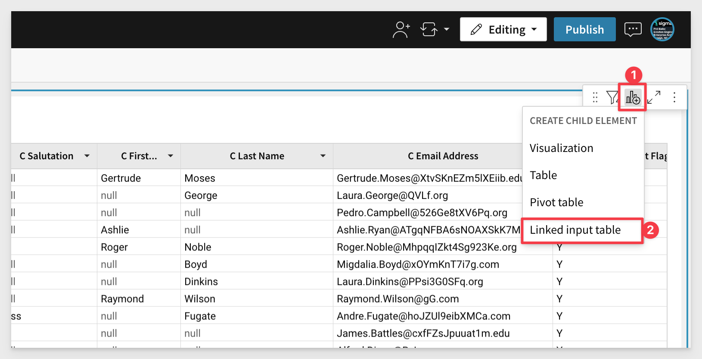
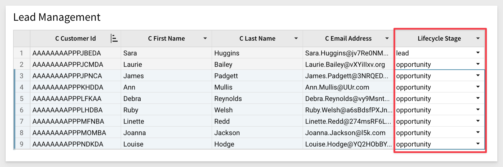

author: pballai
id: partner_hightouch_contact sync
summary: partner_hightouch_contact sync
categories: PLEASE PROVIDE FROM LIST BELOW
environments: web
status: Published
feedback link: https://github.com/sigmacomputing/sigmaquickstarts/issues
tags:  B2B, General, Retail, eCommerce

# Sync Leads to Hubspot with Hightouch’s Sigma Integration
<!-- The above name is what appears on the website and is searchable. -->

## Overview 
Duration: 5 

Keeping HubSpot contact lists up to date is essential for effective marketing and sales processes and accurate reporting and analytics. High quality data leads to a better experience for both your organization and your contacts.

Traditionally, data teams export contact lists as CSVs and send them to marketing teams, who upload them into tools like HubSpot.The downside is that the data in those CSVs quickly become outdated whenever a new user enters the contact list or if a customer gets removed from the list. With each update, the CSV has to be re-exported by the data team and re-uploaded by the marketing team.

If you're leveraging a BI tool like Sigma to define lists of target users, you can rely on those definitions to sync contact lists to marketing tools like HubSpot or Marketo dynamically using Hightouch.

This playbook walks through using a Sigma workbook and Hightouch to sync a contact list of at-risk customers into Marketo, but you could apply the same general steps for syncing any contact list into any other marketing tool.

### Target Audience


<aside class="postive">
<strong>IMPORTANT:</strong><br> This QuickStart assumes users are familiar with basic software installation and configuration. Not all steps will be shown as they are commonly used methods. 
</aside>

### Prerequisites

<ul>
  <li>A computer with a current browser. It does not matter which browser you want to use.</li>
  <li>Access to your Sigma environment. A Sigma trial environment is acceptable and preferred.</li>
  <li>A Snowflake account with the proper administrative and security admin access. A trial environment is acceptable</li>
  <li>A Highspot account. A trial environment is acceptable.</li>
  <li>A HubSopt account. A trial environment is acceptable.</li>
</ul>

<aside class="postive">
<strong>IMPORTANT:</strong><br> Sigma recommends that you use non-production resources when doing QuickStarts.
</aside>

<button>[Sigma Free Trial](https://www.sigmacomputing.com/free-trial/)</button> <button>[Snowflake Free Trial](https://signup.snowflake.com/)</button><button>[Hightouch Free Trial](https://app.hightouch.com/signup)</button><button>[Hubspot Free Trial](https://app.hubspot.com/signup-hubspot/marketing?utm_id=430314580470&utm_content=&utm_source=google&utm_medium=paid&utm_term=crm_%252Bhubspot%2520%252Bfree_EN&utm_campaign=AllProducts_Portals_EN_NAM_NAM_Brand-Free_p_c_campaignid9817582458_agid103055913794_google&hsa_acc=9694350438&hsa_cam=9817582458&hsa_grp=103055913794&hsa_ad=430314580470&hsa_src=g&hsa_tgt=kwd-2008352218505&hsa_kw=%252Bhubspot%2520%252Bfree&hsa_mt=p&hsa_net=adwords&hsa_ver=3&gad=1&gclid=CjwKCAjwov6hBhBsEiwAvrvN6J1A3OxMCh9oGiuuy5jYNQgb00hXztG9vf_XyPjAx650K5sTZ3leThoCU8UQAvD_BwE&hubs_signup-url=www.hubspot.com%2Fproducts%2Fget-started-f047&hubs_signup-cta=getstarted-marketingfree&_ga=2.165617663.1534244571.1681925664-821138832.1680805072&_gac=1.254944122.1681925664.CjwKCAjwov6hBhBsEiwAvrvN6J1A3OxMCh9oGiuuy5jYNQgb00hXztG9vf_XyPjAx650K5sTZ3leThoCU8UQAvD_BwE&_gl=1*efo704*_ga*ODIxMTM4ODMyLjE2ODA4MDUwNzI.*_ga_LXTM6CQ0XK*MTY4MTkyNTY2My4xLjAuMTY4MTkyNTY2NC4wLjAuMA..&step=email_only_landing_page)</button>

<aside class="postive">
<strong>IMPORTANT:</strong><br> We will assume you have access to (or setup trials) as outlined above. We will not cover the steps to access the base sites as the vendors have made the process very straight-forward.
</aside>

### What You’ll Learn

### What You’ll Build

LUCID CHART HERE.....


<!-- END OF OVERVIEW -->

## Define Source Data in Sigma
Duration: 20

We will start by connecting Sigma to Snowflake and use the Snowflake sample database. 

Login into Sigma (as Administrator).

Navigate to `Administration` > `Connections`:


Click `Create Connection`

Select type as `Snowflake`, provide a user-friendly name and then the `Connection Credentials` required to log into the Snowflake account. We will use the Snowflake `Role` of `ACCOUNTADMIN` to keep things simple.


`Save` the connection and if everything is correct, the connection will be added. 

Before we move on, we also need to enable `write access` so that Sigma can write data back to Snowflake. We will use this to allow Sigma uses add small amounts of data to a table. This table is held seperate from other Snowflake data but can be used to augment existing data. We will discuss this more as we go but for now, let's enable that.

Before we can enable write access, we need to give the data a place to live in Snowflake and "allow" a Snowflake role to use it. This is straight forward and here are the steps.

Log onto your Snowflake trail account and open a new `Worksheet`:

<aside class="negative">
<strong>NOTE:</strong><br> Make sure that your use is set to `ACCOUNTADMIN` as shown by the arrow.
</aside>


Copy and paste the following code into the new `Worksheet`:
```plaintext
// Enable Sigma Write Functionality by creating new shema and database and granting permission
use WAREHOUSE COMPUTE_WH;
CREATE DATABASE SIGMA_WRITEDB;
CREATE SCHEMA SIGMA_QS;
grant usage on database SIGMA_WRITEDB to role ACCOUNTADMIN;
grant usage, create table, create view, create stage on schema SIGMA_QS to role ACCOUNTADMIN;
```

This uses the Snowflake default `Compute_WH` and then creates a schema, database and grants require persmission to the `ACCOUNTADMIN` role. Recall that in the Sigma connection, we are using this role already. 

After pasting the code, use the mouse and select it all and click the arrow to run it. You should see a success message:


Return to Sigma, `Administration` > `Connections` and open the Snowflake connection we created earlier. 

Click the `Manage` button and then `Edit`. Scroll down till you see `Write Access`. 

Enable it and provide the values:


Before clicking `Save` you are required to reenter your Snowflake password. Do that and then click `Save`. 

If all is correct, the connection will be tested and you return to the `Connections` page.

Now that we have a connection (with write access) to data, click `+ Create new` and select `Workbook`:


Click to add a new `Table`:


Next click `Tables and Datasets`.

Navigate to the Snowflake Trial `connection` that we created and then select the table `Customer` and click the `Select` button:


Now is a good time to save our Workbook. Click the `Save As` button in the upper right corner and name it `Source Data for Hightouch`:

<aside class="negative">
<strong>NOTE:</strong><br> It is easy to create folders to organize work in Sigma.
</aside>


The `Customers` table we are using is very large (65,000,000 Rows – 18 Columns) and we don't want to use that much data to demonstrate this workflow so let's limit the size with a few filters.

For the first filter (with Workbook in `Edit`), click on the column `C Preferred Cust Flag` and select `Filter`:


Select `Y`. That brings our row count down quite a bit:


Now add filters for the columns, `C Birth Country`, `C Birth Year` and `C Email Address`. Configure them as shown:

<aside class="negative">
<strong>NOTE:</strong><br> In the case where there is no email address, we want to exlcude those from the data so use the "3-dot" to access the option to exclude them after you have selected to display only nulls. 
</aside>


We now have a much smaller dataset for our demonstration, 614 rows. We will use this data as our source, but we want the user to be able to add values to each row for `Lifecycle Stage` and `Sync to Hubspot` using Sigma. 

We will use a Sigma Input Table for this task.

<aside class="positive">
<strong>IMPORTANT:</strong><br> Input tables are dynamic workbook elements that support structured data entry. They allow you to integrate new data points into your analysis and augment existing data from Snowflake to facilitate rapid prototyping, advanced modeling, forecasting, what-if analysis, and more—without overwriting source data.
</aside>

[Learn more about Sigma Input Tables here](https://help.sigmacomputing.com/hc/en-us/articles/15802499663507-Intro-to-Input-Tables#h_01GY3EEP9AX8RW2WKVSAAEEZNB)

On the `Customer` table click to add a `Child Element` and `Linked Input Table`:



We are prompted to select how we want to join the new input table to the source and which additional columns we want to include.

Configure as: shown and click `Create Input Table`:


Rename the new Input Table (by 2x-clicking on it's default title) to `Lead Management`. 

Now we can also see there are still some nulls in `C First Name` and `C Last Name`. Filter them out the same way as before. This will leave us with 164 clean rows. 

### Input Table Data Validation

We want the Marketing team to triage these rows before we send to HubSpot and Input Tables allows us to do that.

Click to add a `New Column` > `Text`:


Reanme the column (by 2x-clicking it's name in the header) to `Lifecycle Stage`:

We want users to select from a list of allowed values. This is called data validation.

Click the new column and select `Data Validation`:


The `Value Source` will be `Create manual list` and we want that.

For list values, enter `lead` and hit enter and then add another called `opportunity`. 

Click `Save` when done:


Now users can select from the allowed list for each row as they triage the list:



<aside class="negative">
<strong>NOTE:</strong><br> Copy and paste is supported so that rows do not necessarily be completed one at a time.
</aside>


This will allow us to leverage a subset of the filtered Customer table and add some data to it, using new columns with data validation enabled. 


## Highspot R-ELT
Duration: 20

### Create Data Model


### Create Target Destination


### Define Data Sync


### Schedule Sync


### Run Sync Manually


<!-- END OF SECTION-->

## HubSpot
Duration: 20

### Verify data landed


<!-- END OF SECTION-->

## What we've covered
Duration: 5

In this lab we learned how to.........

INSERT FINAL IMAGE OF BUILD IF APPROPRIATE

<!-- THE FOLLOWING ADDITIONAL RESOURCES IS REQUIRED AS IS FOR ALL QUICKSTARTS -->
**Additional Resource Links**

[Help Center Home](https://help.sigmacomputing.com/hc/en-us)<br>
[Sigma Community](https://community.sigmacomputing.com/)<br>
[Sigma Blog](https://www.sigmacomputing.com/blog/)<br>
<br>

[](https://twitter.com/sigmacomputing)&emsp;
[](https://www.linkedin.com/company/sigmacomputing)
[](https://www.facebook.com/sigmacomputing)


<!-- END OF WHAT WE COVERED -->
<!-- END OF QUICKSTART -->