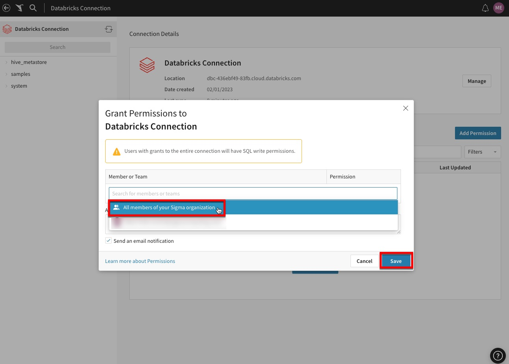

author: pballai
id: partner_seamlessly_connect_sigma_databricks
summary: partner_seamlessly_connect_sigma_databricks
categories: Partners
environments: web
status: Published
feedback link: https://github.com/sigmacomputing/sigmaquickstarts/issues
tags: Partner, Databricks, Sigma

# Unlock the Power of Your Data: Seamlessly Connect Sigma to Databricks via Partner Connect

## Overview 
Duration: 5 

Sigma is a cloud-native analytics platform that provides a familiar front-end user
interface enabling you to query, profile, visualize, and explore massive datasets stored
and shared in leading data platforms like Databricks. Sigma directly connects to Databricks and a proprietary SQL-generation engine that translates user interactions on a familiar spreadsheet interface into machine-optimized SQL. 

Sigma unlocks the power of the [Databricks Lakehouse](https://www.databricks.com/product/data-lakehouse) Platform by providing speed, scalability and security with the flexibility to pivot billions of rows of data.

 ### Getting Started

This is an entry-level lab that will show you how to create a Sigma account through Databricks’ Partner Connect. This lab is specifically designed for those users who already have a Databricks’ account and would like to create a trial of Sigma to test and understand its functionality. 

### Prerequisites

1: A computer with a current browser. It does not matter which browser you want to use. 
2: Access to a Databricks workspace 
3: Ability to create tokens within your Databricks workspace 
4: Access to data within your Databricks workspace to visualize within Sigma 
5: The Sigma instance will be provided via Databricks Partner Connect. No need to create an Independent Sigma trial account.
  
### What You’ll Learn

The steps in this lab will guide you through the following:

 <ul>
      <li>Accessing Partner Connect within the Databricks user-interface.</li>
      <li>Establishing a connection between Sigma and Databricks</li>
      <li>Creating a Sigma trial to analyze your Databricks data<li>
</ul>

<!-- END OF OVERVIEW -->

## Getting Started
Duration: 20

Getting started is simple, first navigate to your Databricks workspace through your preferred web browsing client. The URLs look like this, depending on your cloud provider:

AWS:  https://dbc-xxxxx.cloud.databricks.com
Azure: https://adb-xxxx.x.azuredatabricks.net
GCP:  https://xxxxxxxx.x.gcp.databricks.com

<!-- END OF SECTION-->

## Partner Connection
Duration: 20

Once, you have navigated to your instance of Databricks and follow these steps:

Select “Partner Connect” within the menu bar
Search for “Sigma Computing” in the search bar

### Creating the Connection between Sigma and Databricks

Navigate through the Partner Connect UI

Navigate to the sub-window and “Add” what SQL Warehouse, catalog, schema and tables Sigma will have access to then click “Next”

### Creating your Sigma trial instance
Generating your trial instance

This takes you to a screen showing the name of the user, privileges and the autogenerated personal access token. After reviewing these items, click “Next” and “Connect to Sigma Computing”.
 From here, you create your Sigma trial instance connected to your Databricks account.

### Accessing Sigma, Creating a Connection and Assigning Permissions

Starting Work with Sigma

Now that we have your Databricks workspace connected and Sigma trial instance created, the first step is getting oriented in the Sigma UI.

Within your browser, you should see the Sigma home page. In the navigation panel on the left, you will see the newly created Databricks Connection. Click on the connection.

On the resulting page, click one of the two blue "Add Permission" buttons.

Click into the bar that says "Search for members or teams" and a drop down appears. Select "All Members (Team)" so all users of Sigma have write access to this database. Then click the blue "Save" button.

If you expand the `samples` database you will be able to see the sample data preloaded from Databricks. 

<!-- END OF SECTION-->

## Creating a Sigma Workbook
Duration: 20

Create New Workbook

After configuring the permissions and looking at the available sample data from Databricks, we are going to create a workbook. 

Navigate back to the Home page by clicking the crane logo located near the top left corner of the webpage.

Now that we are back at the Home page, we are going to create a new workbook by using the Create New drop-down. Click “Create New” at the near the top left of the page then select “Workbook”.

Once the New Workbook is opened, we will need to select a data source for our new workbook. On the left hand side first select the "Table" option, then select "Tables and Datasets".

On the resulting page select "Connections" then click the “Databricks Connection”. On the next page, select the “Samples” database to show the underlying schemas. 

Now click, the “nyctaxi” schema then finally select the “trips” table. This will create a preview of the data. Next click “Select” in the bottom right corner of the page. 

The trips data is now displayed in a familiar spreadsheet UI, this allows business users to begin to explore the data and do ad hoc analysis. 

<!-- END OF SECTION-->

## Creating a Visualization
Duration: 20

Now that we have our dataset, we are ready to build our first visualization. 

Start the creation of a visualization by selecting the table that we just built, then click the "Create child element" icon on its top right corner and select "Visualization" to start creating a new chart.

This will add a Visualization below our table. On the X-Axis click the plus button to add the "Tpep Dropoff Datetime'' column. Notice you can search here for the column you wish to add.

We can also drag values onto the Axes instead of using the add button. If we look at our columns on the bottom, find the "Fare Amount" column and drag it under the Y-Axis. The value will automatically aggregate and become "Sum of Fare Amount".

This visualization shows the fare totals for each day from the provided dataset. As a data practitioner, you may want to look at this in a different context. This can be done by changing the X and Y-axis.

For the X-axis, let’s truncate the value by Week. This is performed by clicking on the drop-down to the right of the “Tpep Dropoff Datetime” then selecting “Truncate date” and finally selecting “Week”.

For the Y-axis, let's update the aggregation to “Avg of Fare Amount”. This is performed by clicking on the drop-down to the right of the “Sum of Fare Amount” then selecting “Set Aggregate” and finally selecting “Avg”.

Thus creating a visualization showing the Average Fare by Week for the given dataset. This creates a very powerful ad-hoc analysis, where a business user can now understand how the average fare is trending weekly during this time period.

<!-- END OF SECTION-->

## Conclusion
Duration: 20

Start Exploring and Analyzing your Data
Once your Databricks Lakehouse is connected, it’s time to start exploring & analyzing your data. Here are some of the ways Sigma makes it easy:

Drag-and-drop interface: The user interface is designed to be intuitive and user-friendly. Users can drag and drop data fields to create charts, tables, and graphs, without needing to write complex code or queries.
Real-time data analysis: Users can analyze data in real-time. This means that as they make changes to their analysis, the results are reflected in real-time, this allows for quick and agile decision-making.
Collaboration features: Users can now collaborate across teams  in real time sharing worksheets, dashboards, comments and chats.
Visualizations: Users can create a range of visualizations with just a few clicks, making it easy to communicate insights to stakeholders.

<!-- END OF SECTION-->

## What we've covered
Duration: 5

In this lab, we guided you through accessing Partner Connect in the Databricks user-interface, establishing a connection between Sigma and Databricks, creating a Sigma trial, accessing your Sigma instance, setting permissions for your Databricks connection and finally importing and analyzing your Databricks data in a Sigma workbook. 

### In Summary

We’re excited to be offering the best of both Sigma and Databricks Lakehouse with this easy to use integration!

Integrating Sigma with Databricks through Partner Connect takes this one step further by providing users with a powerful data analytics workflow. Users leverage Databricks' data engineering and machine learning tools to prepare data and train models for Sigma to visualize and analyze. The ability to have Sigma read directly from the Databricks Lakehouse eliminates the need for manual data extracts, reducing the risk of errors and saving time. 

To learn more about Sigma on Databricks, please download the 9Sigma on Databricks Best Practices Guide](https://www.sigmacomputing.com/ebook/sigma-on-databricks-end-to-end-best-practices-guide?utm_source=partner&utm_medium=referral&utm_campaign=databricks_blog_03_2023&utm_content=unify_data_business_teams) or visit our [Sigma+Databricks page](https://www.sigmacomputing.com/partners/partners-databricks?utm_source=partner&utm_medium=referral&utm_campaign=databricks_blog_03_2023&utm_content=unify_data_business_teams). 

<!-- THE FOLLOWING ADDITIONAL RESOURCES IS REQUIRED AS IS FOR ALL QUICKSTARTS -->
**Additional Resource Links**

[Help Center Home](https://help.sigmacomputing.com/hc/en-us) 
[Sigma Community](https://community.sigmacomputing.com/) 
[Sigma Blog](https://www.sigmacomputing.com/blog/) 
 

&emsp;

<!-- END OF WHAT WE COVERED -->
<!-- END OF QUICKSTART -->