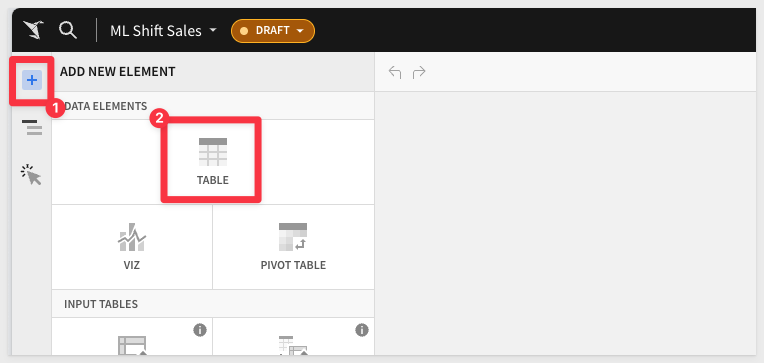
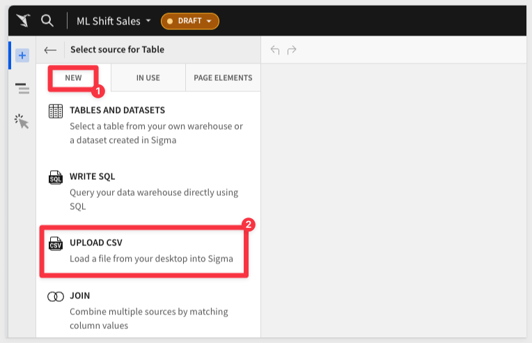

author: pballai
id: partner_snowflake_predictive_model_using_sigma
summary: partner_snowflake_predictive_model_using_sigma
categories: partners
environments: web
status: hidden
feedback link: https://github.com/sigmacomputing/sigmaquickstarts/issues
tags: 
lastUpdated: 2024-03-15

# Develop a Predictive Model using Snowflake and Sigma
<!-- The above name is what appears on the website and is searchable. -->

## Overview 
Duration: 5 

This QuickStart will guide you through an end-to-end example of utilizing Snowflake's new machine learning features. 

Our focus will be on creating a machine learning-driven price prediction tool, integrating the perspectives of both a business analyst and a data scientist using Snowflake and Sigma.

We will demonstrate how Sigma enables the execution of complex commands in Snowflake, and displays results in a format similar to a spreadsheet interface. 

This approach not only maintains data security within Snowflake, but also broadens accessibility to users without SQL expertise.

In our example, we'll analyze historic food truck sales data. We aim to develop a model identifying key drivers of high sales in the past and explore how a business analyst can leverage this model for informed decision-making. The analyst will be able to collaborate with the data scientist all from a sigma workbook.

### Target Audience
Anyone who is interested in learning how to easily leverage the power of Snowflakes machine learning features, by using Sigma.

### Prerequisites

<ul>
  <li>A computer with a current browser. It does not matter which browser you want to use.</li>
  <li>A Sigma instance that has a connection established to your own Snowflake instance.</li>
  <li>Some familiarity with Sigma is assumed. Not all steps will be shown as the basics are assumed to be understood.</li>
  <li>Sigma Write back is enabled to your Snowflake environment.</li>
  <li>A snowflake role with Usage rights on a Snowflake schema that the Sigma Service Role has access to, as well as to the writeback location.</li>
  <li>A code editor (IDE) with a python interpreter defined with the package requirements from [this yaml file.](https://github.com/Snowflake-Labs/sfguide-intro-to-machine-learning-with-snowpark-ml-for-python/blob/main/conda_env.yml) You can download this file and then create the env using the following terminal code:</li>
</ul>

...code
conda env create -f /Users/[USER_NAME]/Downloads/conda_env.yml
...

<aside class="negative">
<strong>NOTE:</strong>  This will create a conda env named snowpark-ml-hol that you can then connect to from your IDE.
</aside>

## Setup
Duration: 20

We're starting from scratch with a blank Sigma workbook. I'll first load our sales data from Snowflake. 

If you have sales data in Snowflake, we can directly connect to it from Sigma.  

In this case, we don’t have that data in Snowflake, so we’ll need to upload it. Fortunately, that’s easy to do in Sigma. 

Let's upload a CSV file of shift sales from the city of Seattle.

[Click to download the CSV file:](https://sigma-quickstarts-main.s3.us-west-1.amazonaws.com/csv/SHIFT_SALES.csv)

Log into Sigma.

From the Sigma home page, click the `Create New` button in the top left corner and select `Workbook.`:

Now that you are in the Workbook, let's start by saving it with the name `ML Shift Sales` by clicking `Save As` in the top right. 

Add a `new table`:

Select `Upload CSV` as an option:

Make sure your instance is selected in the connection dropdown (NOT the Sigma Sample Database), and then Drag your downloaded file into the upload area and then press save in the upper right to upload the table to your Snowflake instance and view the table in your sigma workbook. ml5.png

<!-- END OF SECTION-->

## Setup
Duration: 20

<!-- END OF SECTION-->

## Setup
Duration: 20

<!-- END OF SECTION-->

## Setup
Duration: 20

<!-- END OF SECTION-->

## What we've covered
Duration: 5

In this lab we learned how to.........

INSERT FINAL IMAGE OF BUILD IF APPROPRIATE

<!-- THE FOLLOWING ADDITIONAL RESOURCES IS REQUIRED AS IS FOR ALL QUICKSTARTS -->
**Additional Resource Links**

[Blog](https://www.sigmacomputing.com/blog/) 
[Community](https://community.sigmacomputing.com/) 
[Help Center](https://help.sigmacomputing.com/hc/en-us) 
[QuickStarts](https://quickstarts.sigmacomputing.com/) 
=======
Be sure to check out all the latest developments at [Sigma's First Friday Feature page!](https://quickstarts.sigmacomputing.com/firstfridayfeatures/)
 

&emsp;
&emsp;

<!-- END OF WHAT WE COVERED -->
<!-- END OF QUICKSTART -->