author: pballai
id: partner_snowflake_predictive_model_using_sigma
summary: partner_snowflake_predictive_model_using_sigma
categories: partners
environments: web
status: hidden
feedback link: https://github.com/sigmacomputing/sigmaquickstarts/issues
tags: 
lastUpdated: 2024-03-15

# Develop a Predictive Model using Snowflake and Sigma
<!-- The above name is what appears on the website and is searchable. -->

## Overview 
Duration: 5 

This QuickStart will guide you through an end-to-end example of utilizing Snowflake's new machine learning features. 

Our focus will be on creating a machine learning-driven price prediction tool, integrating the perspectives of both a business analyst and a data scientist using Snowflake and Sigma.

We will demonstrate how Sigma enables the execution of complex commands in Snowflake, and displays results in a format similar to a spreadsheet interface. 

This approach not only maintains data security within Snowflake, but also broadens accessibility to users without SQL expertise.

In our example, we'll analyze historic food truck sales data. We aim to develop a model identifying key drivers of high sales in the past and explore how a business analyst can leverage this model for informed decision-making. The analyst will be able to collaborate with the data scientist all from a sigma workbook.

Note: If you are coming to this quickstart to learn how to build a model on top of a data asset you have already created, you can skip to [step 5.](https://quickstarts.sigmacomputing.com/guide/partner_snowflake_predictive_model_using_sigma/index.html?index=..%2F..index#4)

### Target Audience
Anyone who is interested in learning how to easily leverage the power of Snowflakes machine learning features, by using Sigma.

### Prerequisites

<ul>
  <li>A computer with a current browser. It does not matter which browser you want to use.</li>
  <li>A Sigma instance that has a connection established to your own Snowflake instance.</li>
  <li>Some familiarity with Sigma is assumed. Not all steps will be shown as the basics are assumed to be understood.</li>
  <li>Sigma Write back is enabled to your Snowflake environment.</li>
  <li>A snowflake role with Usage rights on a Snowflake schema that the Sigma Service Role has access to, as well as to the writeback location.</li>
  <li>A code editor (IDE) with a python interpreter defined with the package requirements from [this yaml file.](https://github.com/Snowflake-Labs/sfguide-intro-to-machine-learning-with-snowpark-ml-for-python/blob/main/conda_env.yml) You can download this file and then create the env using the following terminal code:</li>
</ul>

...code
conda env create -f /Users/[USER_NAME]/Downloads/conda_env.yml
...

<aside class="negative">
<strong>NOTE:</strong><br> This will create a conda env named snowpark-ml-hol that you can then connect to from your IDE.
</aside>

## Setup
Duration: 20

We're starting from scratch with a blank Sigma workbook. I'll first load our sales data from Snowflake. 

If you have sales data in Snowflake, we can directly connect to it from Sigma.  

In this case, we don’t have that data in Snowflake, so we’ll need to upload it. Fortunately, that’s easy to do in Sigma. 

Let's upload a CSV file of shift sales from the city of Seattle.

[Click to download the CSV file:](https://sigma-quickstarts-main.s3.us-west-1.amazonaws.com/csv/SHIFT_SALES.csv)

Log into Sigma.

From the Sigma home page, click the `Create New` button in the top left corner and select `Workbook.`:


Now that you are in the Workbook, let's start by saving it with the name `ML Shift Sales` by clicking `Save As` in the top right. 


Add a `new table`:


Select `Upload CSV` as an option:


Make sure your instance is selected in the connection dropdown (**NOT the Sigma Sample Database**), and then drag your the downloaded csv file into the upload area. 

Then click `Save` in the upper right to upload the table to your Snowflake instance and view the table in your sigma workbook:

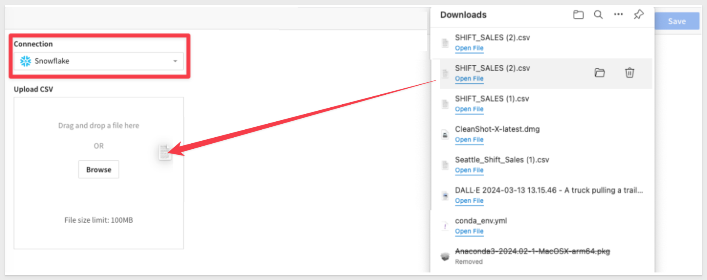


<!-- END OF SECTION-->

## Sigma Data Exploration
Duration: 20

Shift sales will be of primary importance for this QuickStart, so let’s adjust adjust its format to `currency` at the start of our analysis. 

Select the `Shift Sales` column, and use the buttons next to the formula bar to adjust the format:

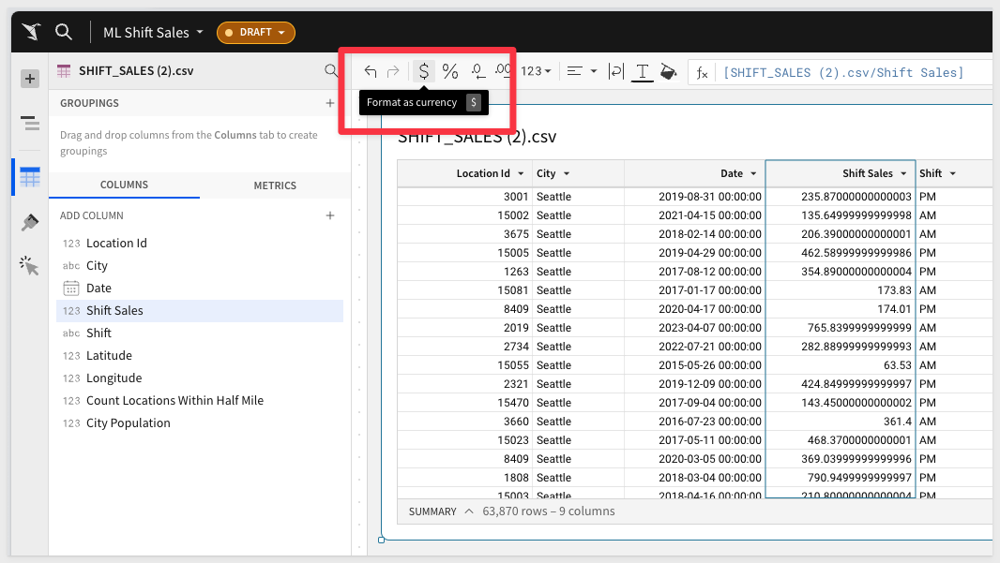

We don’t know what variables impact sales, but it’s a safe bet to start with time having some kind of impact. 

Let’s make a visual to explore this. 

Create a `Child element` visual: 

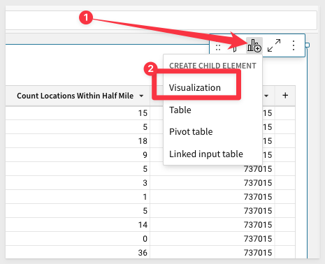

Drag `Date` and `Shift Sales` columns to the `X` and `Y axis`, respectively:

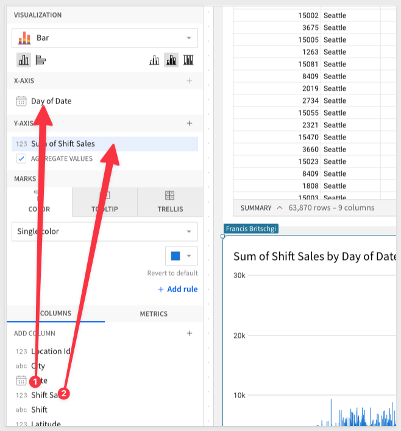

We can see that Sigma automatically aggregates our data to the `Day level` and applies a `Sum`. 

Lets adjust this to a monthly aggregation to "quiet out" some of the noise. 

You can adjust the formula directly in the formula bar:

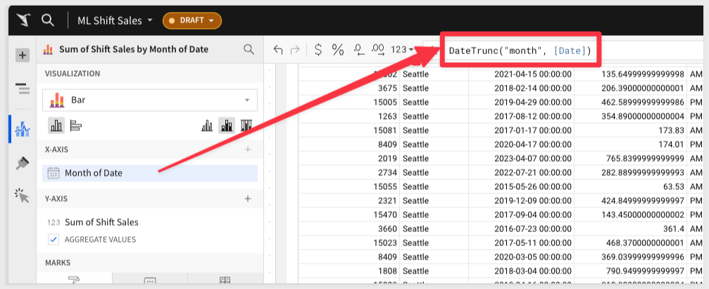

We can see the seasonality of the sales around each January, and we can isolate this further to confirm that suspicion. 

We will switch the formula to a [datepart() function](https://help.sigmacomputing.com/docs/datepart), and see that the first 3 months do indeed have the highest sales:

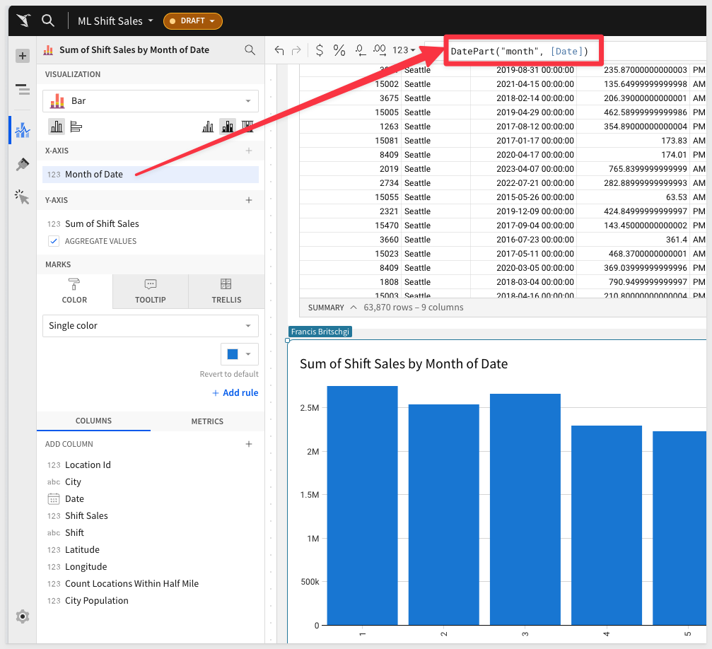

The second factor that we think may play a role in the sales is the shift that the sales took place in. 

We can easily add that to our visual, and then switch to a “No Stacking” bar chart, to see the differences between AM and PM shifts:

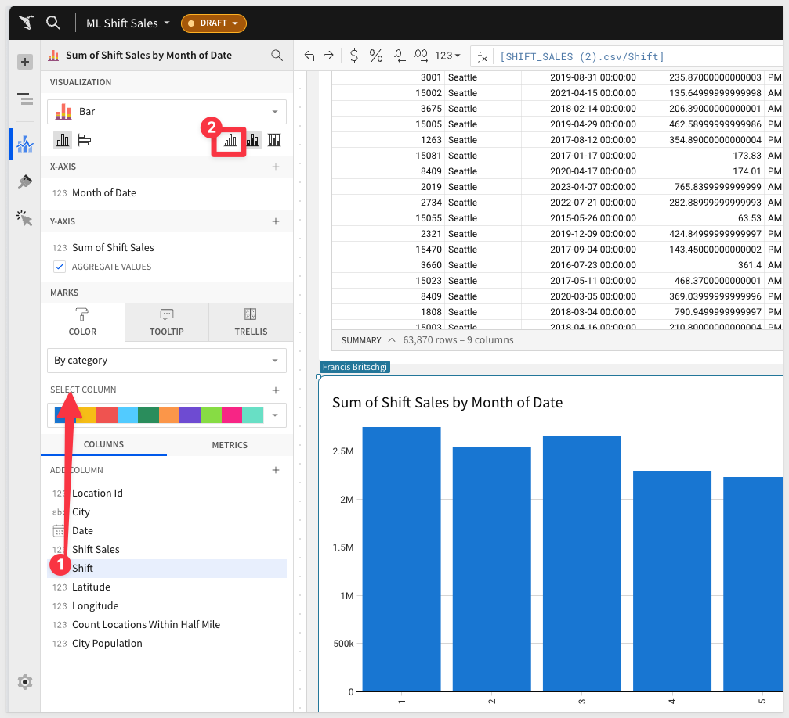

The third factor that we think may play a role is the weekday that the sales took place on. This is a very similar question to our monthly analysis. 

We can duplicate the table:

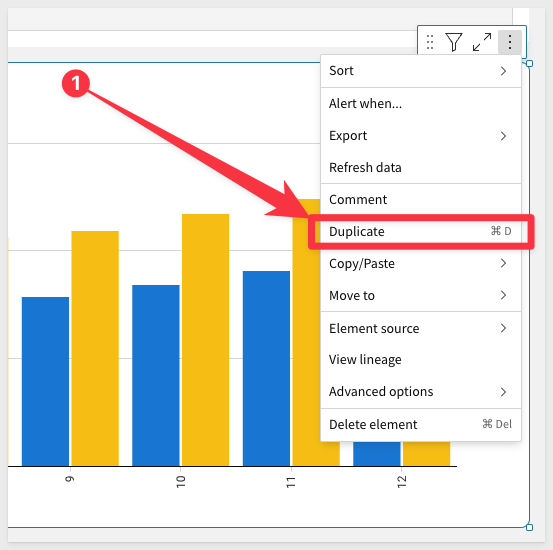

Drag it next to our first chart: 
 
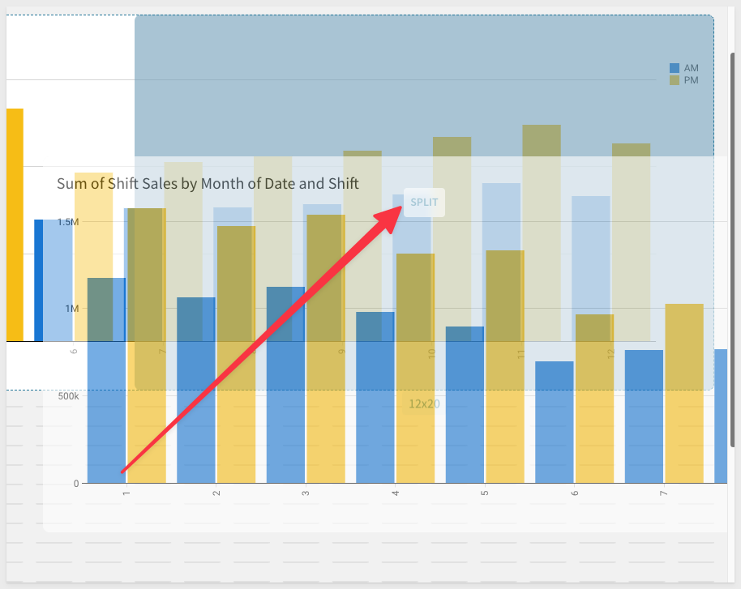

And then adjust the `DatePart() function` to use `weekday`.

Just like in the months, we can see that certain weekdays definitely return greater sales:

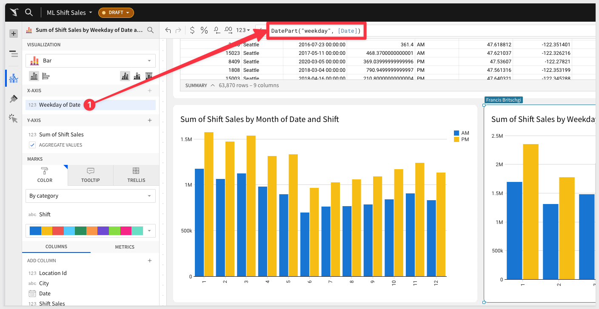


<!-- END OF SECTION-->

## Create a Dataset for Modeling
Duration: 20

Now that we have identified Month Number, Weekday, and Shift as potential predictors for shift sales, let’s prepare a dataset with these variables for our data scientist. 

In Sigma, this may be something that a data scientist does in the existing workbook, or the analyst can prepare it with guidance. 

There is lots of room for collaboration through [live edit](https://help.sigmacomputing.com/docs/workbook-collaboration-with-live-edit) and our [comment feature.](https://help.sigmacomputing.com/docs/workbook-comments)

Create a child table of our shift sales table and drag it to the bottom of our workbook:

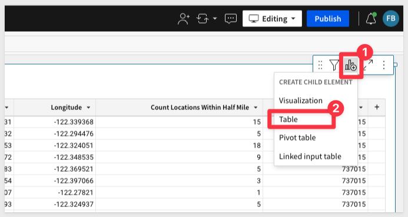

For our training set, we want the data to be filtered before a certain date so that we can then assess shifts after that date in the test set. 

We right click the `Date` column, and then `filter`:

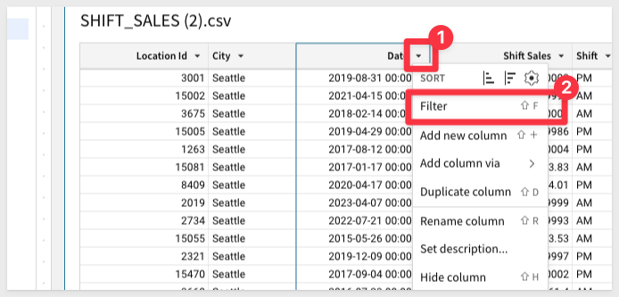

Set the filter to `Between` the dates `1/1/2020 and 12/31/2022`, to get 3 years of training data:

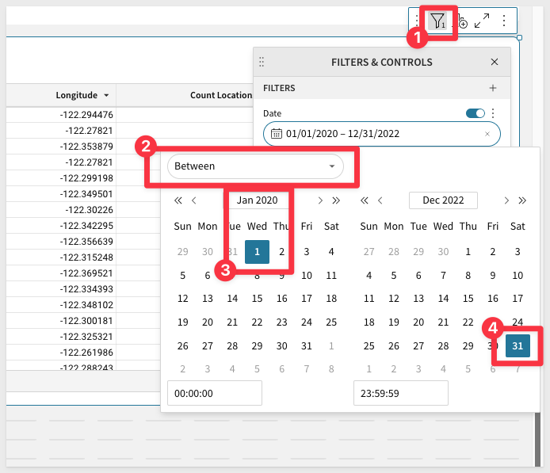

Then, rename this table to `Train` by double-clicking the title, to edit it.

Now we need to create the columns that we found to drive Sales. 

Add a column: 

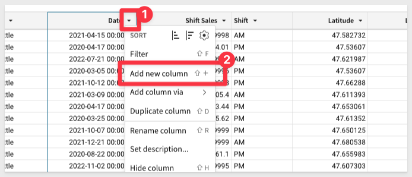

Define it as `DatePart(“month”, [Date])`, so that we get the month number.

We can easily duplicate this column to make a weekday column as well. 

`Duplicate` the column and then change `month` to `weekday` in the formula:

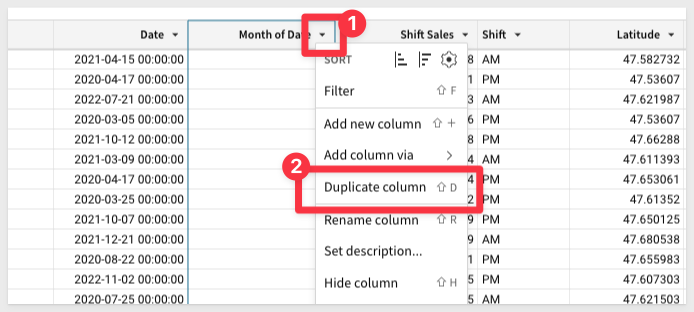

Finally, your data scientist may want you to encode categorical data into numerical values. 

We can easily do this with sigma using a formula definition. 

Add a new column, define it's function as `If([Shift] = "AM", 1, 0)`, and then rename it to `Encoded Shift`.: 

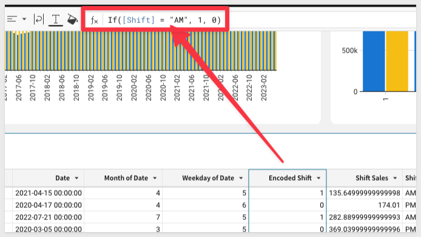

Now, we need to repeat all the steps to make a Test table....**Just kidding!!**

All we need to do is `duplicate` the table: 

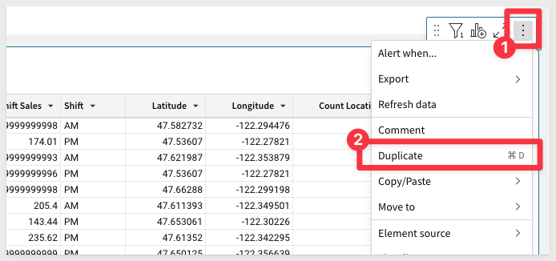

Adjust the `date filter` so that it gives us values `on or after 1/1/2023`, and then rename the new table to `Test`:

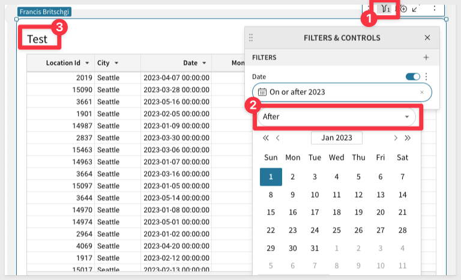

Finally, we can make all this work available in your Snowflake writeback schema by creating a warehouse view from the Train table. 

We recommend calling it `Train`, but you can name it anything you’d like:

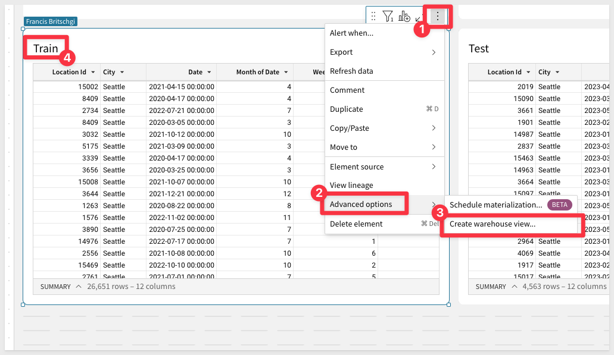

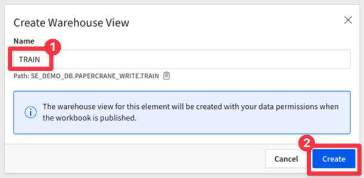
 
<aside class="negative">
<strong>NOTE:</strong><br> Note that this will get us a fully qualified name that our data scientist can use in their programming.
</aside>

Repeat this for `Test` to create a warehouse view for the Test table.

<aside class="positive">
<strong>IMPORTANT:</strong><br> Publish the workbook to create the warehouse views!
</aside>


<!-- END OF SECTION-->

## Visual Studio Code Programming
Duration: 20

We can now let our data scientist know that `TASTY_BITES_TRAIN` is ready for them to train their model on Month, Weekday, and Shift. 

The data scientist can now begin their work in their code editor (VSCode in this case).

<aside class="negative">
<strong>NOTE:</strong><br> We will give these steps as code chunks in a notebook style, but you can feel free to compile this into a single python script if desired.
</aside>

### Authenticate using the Snowflake module
```python
# Authenticate

from snowflake.snowpark import Session
import snowflake.snowpark.functions as F
import snowflake.snowpark.types as T

# Auth Method: Hard Code Parameters
connection_parameters = {
   "account": "cxa#####",
   "user": "fran",
   "password": "########",
   "role": "sigma_dev",
   "warehouse": "PAPERCRANE",
   "database": "SE_DEMO_DB",
   "schema": "SNOWPARK_UDF",
}

session = Session.builder.configs(connection_parameters).create()
```

### Create a Model Registry in your database that you will use to store this and future models 
```python
from snowflake.ml.registry import Registry

session.sql("CREATE SCHEMA IF NOT EXISTS ML_REGISTRY").collect()

reg = Registry(session, database_name="SE_DEMO_DB", schema_name="ML_REGISTRY")
```

### 

The new Snowpark ML functions make it super easy to train open-source models on optimized and scalable Snowflake compute.

We can set up a code block that allows us to easily train a linear regression model with just a few lines. 

You will use the warehouse view locations that you generated in your sigma workbook in the session table calls below:
```python
from snowflake.ml.modeling.linear_model import LinearRegression

# Specify inputs
training_table = session.table("[USE WAREHOUSE VIEW LOCATION FOR TRAIN]")
testing_table = session.table("[USE WAREHOUSE VIEW LOCATION FOR TEST]")

# Input my Analyst's ideas for features
feature_cols = [
    "MONTH_OF_DATE",
    "WEEKDAY_OF_DATE",
    "ENCODED_SHIFT",
]
target_col = "SHIFT_SALES"

my_model = LinearRegression()
my_model.set_input_cols(feature_cols)
my_model.set_label_cols(target_col)
my_model.set_output_cols("PRED_" + target_col)

my_model.fit(training_table)

```


### 
```python

```


### 
```python

```


### 
```python

```


### 
```python

```


### 
```python

```


<!-- END OF SECTION-->


## What we've covered
Duration: 5

In this lab we learned how to.........

INSERT FINAL IMAGE OF BUILD IF APPROPRIATE

<!-- THE FOLLOWING ADDITIONAL RESOURCES IS REQUIRED AS IS FOR ALL QUICKSTARTS -->
**Additional Resource Links**

[Blog](https://www.sigmacomputing.com/blog/)<br>
[Community](https://community.sigmacomputing.com/)<br>
[Help Center](https://help.sigmacomputing.com/hc/en-us)<br>
[QuickStarts](https://quickstarts.sigmacomputing.com/)<br>
=======
Be sure to check out all the latest developments at [Sigma's First Friday Feature page!](https://quickstarts.sigmacomputing.com/firstfridayfeatures/)
<br>

[](https://twitter.com/sigmacomputing)&emsp;
[](https://www.linkedin.com/company/sigmacomputing)&emsp;
[](https://www.facebook.com/sigmacomputing)


<!-- END OF WHAT WE COVERED -->
<!-- END OF QUICKSTART -->