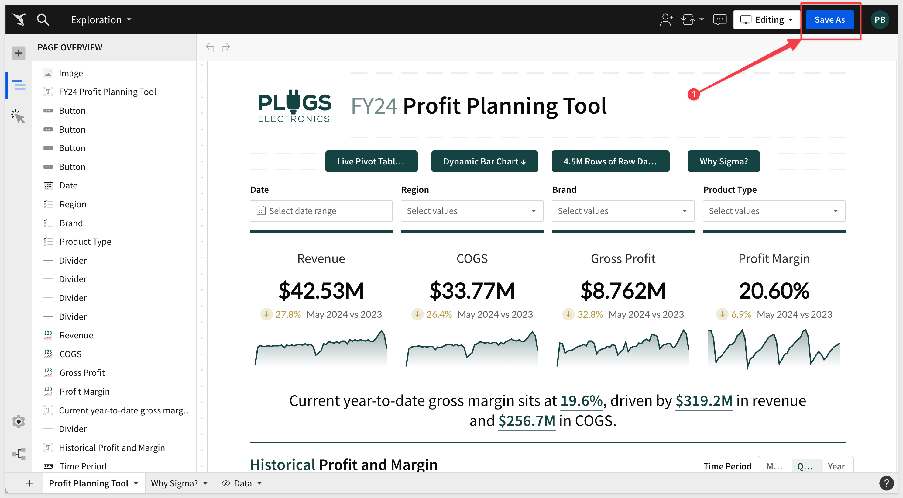

author: pballai
id: partner_snowflake_summit_hackathon_2024
summary: partner_snowflake_summit_hackathon_2024
categories: partners
environments: web
status: Published
feedback link: https://github.com/sigmacomputing/sigmaquickstarts/issues
tags: default
lastUpdated: 1024-05-24

# HACKATHON: DIGNITY FROM DATA
<!-- The above name is what appears on the website and is searchable. -->

## Overview 
Duration: 5 

This QuickStart provides instructions on setting up a Sigma trial instance, using Snowflake Partner Connect and an introductory overview of how to use Sigma.

 ### Target Audience
Participants of Snowflake Summit's Hackathon 2024 who are attending the session "DIGNITY FROM DATA — USING SNOWFLAKE TO SOLVE CALIFORNIA'S HOMELESSNESS CRISIS, ACT101"

No SQL or technical data skills are required for using Sigma.

### Prerequisites

<ul>
  <li>A computer with a current browser. It does not matter which browser you want to use.</li>
  <li>Access to your Sigma environment.</li>
  <li>A Snowflake free 30-day trial environment.</li>
</ul>

<aside class="postive">
<strong>IMPORTANT:</strong><br> Sigma recommends that you use non-production resources when doing QuickStarts.
</aside>

<button>[Sigma Free Trial](https://www.sigmacomputing.com/free-trial/)</button>

<button>[Snowflake Free Trial](https://trial.snowflake.com](https://trial.snowflake.com))</button>
  

<!-- END OF OVERVIEW -->

## Snowflake Preparation
Duration: 20

Before we provision a new Sigma instance, we need to create a database in Snowflake where we will store data that will be created during the hackathon session.

Log into your Snowflake trial account. 

Using the sidebar, open a new `SQL Worksheet` and paste the following code into it:
```code
-- Use the appropriate warehouse
USE WAREHOUSE COMPUTE_WH;

-- Create the database Sigma
CREATE DATABASE Sigma;

-- Switch to using the Sigma database
USE DATABASE SIGMA;

-- Create the WRITE schema within the Sigma database
CREATE SCHEMA WRITE;

-- Grant usage on the database to the ACCOUNTADMIN role
GRANT USAGE ON DATABASE SIGMA TO ROLE ACCOUNTADMIN;

-- Grant various permissions on the WRITE schema to the ACCOUNTADMIN role
GRANT USAGE, 
      CREATE TABLE, 
      CREATE VIEW, 
      CREATE STAGE 
ON SCHEMA WRITE 
TO ROLE ACCOUNTADMIN;
```

Highlight the codeblock (item number 3) and click the run arrow:


This creates the table, schema and permission required for Sigma to write data back to Snowflake, when required.


<!-- END OF OVERVIEW -->


## Provisioning Sigma
Duration: 20

### Provisioning Sigma via Snowflake Partner Connect

Snowflake and Sigma have made it really simple to spin up a Sigma trial in just a few minutes, via Snowflake Partner Connect.

Partner Connect is an integral part of the Snowflake console. 

On the left hand side of the Snowflake UI, navigate to `Data Products`, then select `Partner Connect.` 

Click the icon for `Sigma.`


You will see a dialog box that will show the objects that will be created in your Snowflake account by Sigma. 

We will be using the `PC_SIGMA_WH` warehouse, `PC_SIGMA_DB` database, and the `PC_SIGMA_ROLE`, which are automatically created for you when you click `Connect`: 


Click `Connect` then `Activate`.

<aside class="positive">
<strong>IMPORTANT:</strong><br> If you receive a warning that the email address you are using in Snowflake is not verified, you will need verify it first. This is in your Snowflake "My Profile" page.
</aside>

A message will appear that indicates "Your partner account has been created":


Click `Activate`.

Sigma will open in a new browser tab and prompt you to choose a name for the new Sigma Organization.

<aside class="negative">
<strong>NOTE:</strong><br> The organization name you choose must be unique.
</aside>


Once you have chosen a name, click `Continue.` 

Provide your `first name` and `last name` and `password` and click `Create`:


You can ignore the IP whitelisting screen; click `Get Started Using Sigma.` 

This will open Sigma in a new tab, and you are ready to start exploring.


<!-- END OF SECTION-->

## Getting around in the UI
Duration: 5

The home page is organized logically to make it easy to get to things quickly. That said, it is also packed full of useful functionality too.

The main functions are numbered and described below:


**1 - Papercrane:** If you want to get back to the home page from anywhere in the portal, just click the Sigma `Papercrane` logo in the upper left corner.

Once you open a different page, you may notice the back arrow next to the Sigma logo. This allows you to go back one level:


**2 - Search:** You can click in the search bar at any point to search for content within Sigma.

**3 - Create New:** Use this anytime you want to create new content.
    <ul>
      <li><strong>Workbook:</strong> our spreadsheet UI for analyzing data</li>
      <li><strong>Data Model:</strong> enables the curation of data objects to then be shared with others.</li>
      <li><strong>Dataset:</strong> provides data modelling.</li>
      <li><strong>Write SQL:</strong> allows you to write SQL to run against the data warehouse.</li>
      <li><strong>Upload CSV:</strong> allows you to upload a csv to the warehouse in order to perform analysis.</li>
    </ul>
  
**4 - My Content:**
 <ul>
      <li><strong>Home:</strong> will bring back to home screen.</Li>
      <li><strong>My Documents</strong> is a personal folder for you to save content you have created.</Li>
      <li><strong>Workspaces</strong> are a way to organize and share content with specific members or teams within your organization. Items placed in workspaces can be accessed by anyone who has permission to that workspace.</Li>
      <li><strong>Templates</strong> allow users to standardize and share workbook structures for quick and consistent reuse.</Li>
      <li><strong>Shared with Me:</strong> will show a list of items others have shared directly with you.</Li>
      <li><strong>Recent:</strong> will bring up items you have accessed recently.</Li>
      <li><strong>Favorites:</strong> will show a list of items that you have favorite or quicker access.</Li>
      <li><strong>Trash:</strong> the typical recycle bin functionality.</Li>
      <li><strong>Connections</strong> (visible to Administrators and Creators by default): Connections list the data warehouses you have connections to. Clicking on one of them shows the tables in that warehouse you can access. There can be many connections for a single Sigma account, each configured with different levels of access to the warehouse, to be shared with members or teams.<br>
 </ul>

<aside class="negative">
<strong>NOTE:</strong><br> In this QuickStart you can only see and access the “Sigma Sample Database” and Snowflake PC_SIGMA_WH databases used for this QuickStart.
</aside>

**5 - Top viewed:** Empty at the start, as teams start to create and use content, the most popular will float to the top of this listing.

**6 - Administration:** Dedicated area for user management and other common configuration settings. Only shown to users in the Admin role.</li>

**7 - Help:** has lots of useful information for you to explore later.

**8 - User Profile:** 
On the top right corner is a box with your username initial. Clicking on it reveals your profile where you can make changes to your preferences and sign out.  Other UI options may or may not be visible to you depending on your permissions. 


<!-- END OF SECTION-->

## Basic Terminology
Duration: 5

Let’s begin by establishing some basic terminology Sigma uses. 

A workbook is akin to an Excel file or Google Sheet.

Each workbook can have many pages, which are akin to Excel worksheets.

Each page can have anything from a simple table to a complete dashboard or data application.

Analysis and presentation are now seamlessly integrated in a spreadsheet-like experience. 

This is useful to know because if you want to build something in Sigma (ie: dashboard, report etc...) you need a workbook, at least one page and some data. Data can come from the cloud data warehouse or end user input, but will talk more about that later.

The last feature we will mention now (there are SO MANY FEATURES) called controls. 

A Sigma control is typically a drop list that filters the Page data (or individual item). There are many variations of controls, and all are really easy to use.

Of course, this is all baseline terminology, and pretty easy to understand.

The last point we will make on this topic is that there are different icons for different objects in Sigma. 

For example here are the most common ones that you will see:


<!-- END OF SECTION-->

## High Level Stuff

Click on `Templates` and then click the `Plugs Electronics Profit Planning Tool`. 

[Workbook templates](https://help.sigmacomputing.com/docs/get-started-with-workbook-templates) allow users to create and share workbook structures for quick and consistent reuse and further customization.


Click `Dismiss` when asked about swapping to use your data.

The `Plugs Profit Planning Tool` is a live data application the (fictitious) business uses to collaborate on price modeling and forecasting. 



This sample Workbook gives you an idea of what a dashboard could look like in Sigma.

Use `Save As` to store a copy if this workbook as you see fit. 

For example, you may want to have a copy just for yourself stored in `My Documents` or you may want to have a folder where you store workbooks that you intend to share with others. 

Sigma has a full [role-based-access system](https://help.sigmacomputing.com/docs/create-and-manage-account-types) that allows for granular control over who can do and see information. 

Would you like more information about Sigma? Navigate to the `Why Sigma?` workbook page at the bottom of the screen.


Notice that there another page that has the icon called `Data`?. This page has data that the main page uses to drive tables, visualization and controls, but will be hidden from users who do not have the elevated permission. 

<aside class="negative">
<strong>NOTE:</strong><br> Using hidden data pages to drive workbook content is a great way to stay organized and is considered a best practice. 
</aside>

### Drill Anywhere
Scroll down to the `Historical Profit and Margin` chart and right-click on one of the bars.

Sigma lets you filter, drill-down, sort and access the underlying data in a single click:


This is built-in and automatic so that you you don't have to waste time configuring things over and over again.

Want to see all the data?, click the `expand` arrows in the corner of any page element:


Now we can see all the table data that is driving the chart and manipulate at the lowest level of granularity.

### Massive Data Scale 
You might also notice that his table is over 2.3 million rows but even with a Snowflake X-small compute tier serving the data, performance is a non-issue. 

Sigma has customers that routinely build dashboards against billions of rows of data.

### Version History
You may have noticed the `Publish` button in the upper right corner. Users can `edit` content and it is not shown to anyone else until it is published. 

In addition to that, Sigma maintains a version history of all edits and published workbook versions so that you can easily revert anytime:


That is a VERY small preview of what is possible. 

Now click the Sigma papercrane  to return to the homepage where we will create some content of our own.


<!-- END OF SECTION-->

## Creating Some Content
Duration: 5


<!-- END OF SECTION-->


## What we've covered
Duration: 5

In this lab we learned how to.........

INSERT FINAL IMAGE OF BUILD IF APPROPRIATE

<!-- THE FOLLOWING ADDITIONAL RESOURCES IS REQUIRED AS IS FOR ALL QUICKSTARTS -->
**Additional Resource Links**

[Blog](https://www.sigmacomputing.com/blog/)<br>
[Community](https://community.sigmacomputing.com/)<br>
[Help Center](https://help.sigmacomputing.com/hc/en-us)<br>
[QuickStarts](https://quickstarts.sigmacomputing.com/)<br>

Be sure to check out all the latest developments at [Sigma's First Friday Feature page!](https://quickstarts.sigmacomputing.com/firstfridayfeatures/)
<br>

[](https://twitter.com/sigmacomputing)&emsp;
[](https://www.linkedin.com/company/sigmacomputing)&emsp;
[](https://www.facebook.com/sigmacomputing)


<!-- END OF WHAT WE COVERED -->
<!-- END OF QUICKSTART -->