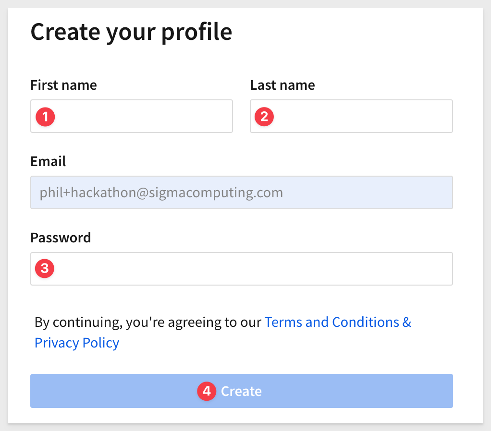
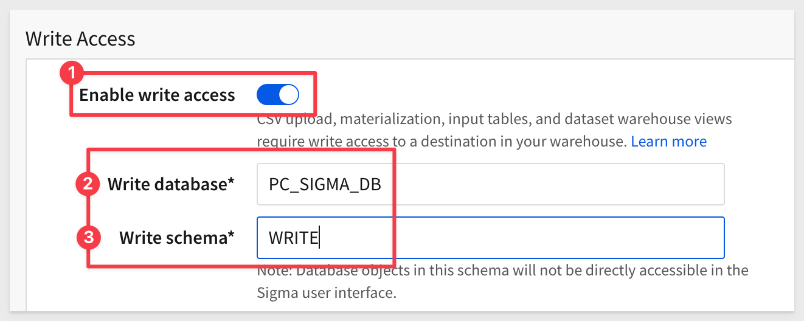
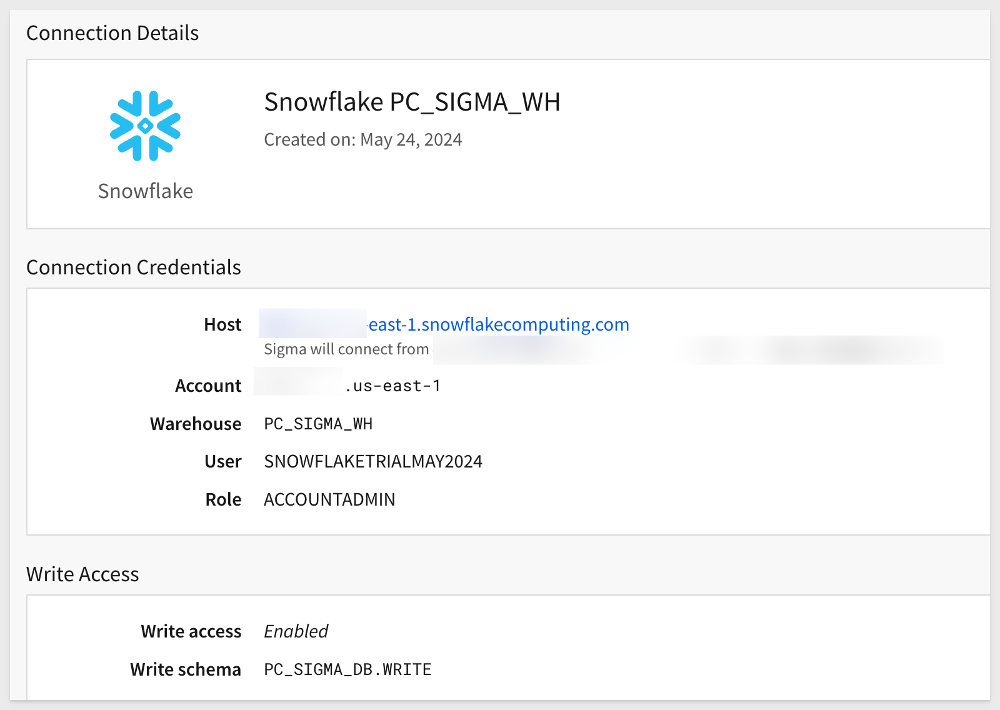
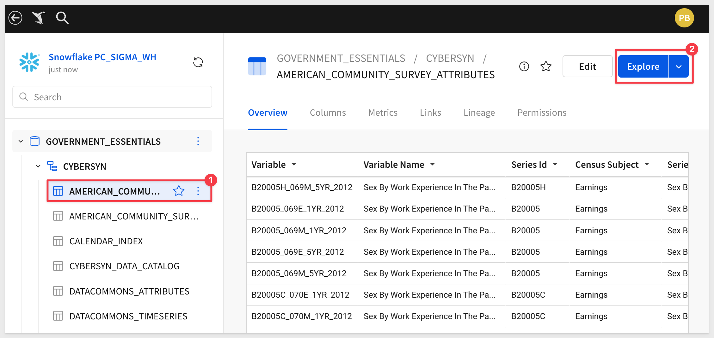

author: pballai
id: partner_snowflake_summit_hackathon_2024
summary: partner_snowflake_summit_hackathon_2024
categories: partners
environments: web
status: Hidden
feedback link: https://github.com/sigmacomputing/sigmaquickstarts/issues
tags: 
lastUpdated: 1024-05-24

# HACKATHON: DIGNITY FROM DATA
<!-- The above name is what appears on the website and is searchable. -->

## Overview 
Duration: 5 

This QuickStart provides instructions on setting up a Sigma trial instance, using Snowflake Partner Connect and an introductory overview of how to use Sigma.

 ### Target Audience
Participants of Snowflake Summit's Hackathon 2024 who are attending the session "DIGNITY FROM DATA — USING SNOWFLAKE TO SOLVE CALIFORNIA'S HOMELESSNESS CRISIS, ACT101"

No SQL or technical data skills are required for using Sigma.

### Prerequisites

<ul>
  <li>A computer with a current browser. It does not matter which browser you want to use.</li>
  <li>Access to your Sigma environment.</li>
  <li>A Snowflake free 30-day trial environment.</li>
</ul>

<aside class="postive">
<strong>IMPORTANT:</strong><br> Sigma recommends that you use non-production resources when doing QuickStarts.
</aside>

<button>[Sigma Free Trial](https://www.sigmacomputing.com/free-trial/)</button>

<button>[Snowflake Free Trial](https://trial.snowflake.com](https://trial.snowflake.com))</button>
  

<!-- END OF OVERVIEW -->


## Provisioning Sigma
Duration: 20

**Note:**<br>
If you have previously use Snowflake Partner Connect to establish a Sigma instance and you are still using that instance to do additional QuickStarts, you will need to [resync the connection to Snowflake in Sigma.](https://help.sigmacomputing.com/docs/troubleshoot-your-connection#sync-your-data)

### Provisioning Sigma via Snowflake Partner Connect

Snowflake and Sigma have made it really simple to spin up a Sigma trial in just a few minutes, via Snowflake Partner Connect.

Log into your Snowflake trial account.

Partner Connect is an integral part of the Snowflake console. 

On the left hand side of the Snowflake UI, navigate to `Data Products`, then select `Partner Connect.` 

Click the icon for `Sigma.`


You will see a dialog box that will show the objects that will be created in your Snowflake account by Sigma. 

We will be using the `PC_SIGMA_WH` warehouse, `PC_SIGMA_DB` database, and the `PC_SIGMA_ROLE`, which are automatically created for you when you click `Connect`: 


Click `Connect` then `Activate`.

<aside class="positive">
<strong>IMPORTANT:</strong><br> If you receive a warning that the email address you are using in Snowflake is not verified, you will need verify it first. This is in your Snowflake "My Profile" page.
</aside>

A message will appear that indicates "Your partner account has been created":


Click `Activate`.

Sigma will open in a new browser tab and prompt you to choose a name for the new Sigma Organization.

<aside class="negative">
<strong>NOTE:</strong><br> The organization name you choose must be unique.
</aside>


Once you have chosen a name, click `Continue.` 

Provide your `first name` and `last name` and `password` and click `Create`:



You can ignore the IP whitelisting screen; click `Get Started Using Sigma.` 

This will open Sigma in a new tab, and you are ready to start exploring.


<!-- END OF SECTION-->

## Snowflake Preparation
Duration: 20

Before we provision a new Sigma instance, we need to create a database in Snowflake where we will store data that will be created during the Hackathon session.

Log into your Snowflake trial account. 

Using the sidebar, open a new `SQL Worksheet` and paste the following code into it:
```code
-- Use the appropriate warehouse
USE WAREHOUSE COMPUTE_WH;

-- Switch to using the Sigma database
USE DATABASE PC_SIGMA_DB;

-- Create the WRITE schema within the Sigma database
CREATE SCHEMA WRITE;

-- Grant usage on the database to the ACCOUNTADMIN role
GRANT USAGE ON DATABASE PC_SIGMA_DB TO ROLE ACCOUNTADMIN;

-- Grant various permissions on the WRITE schema to the ACCOUNTADMIN role
GRANT USAGE, 
      CREATE TABLE, 
      CREATE VIEW, 
      CREATE STAGE 
ON SCHEMA WRITE 
TO ROLE ACCOUNTADMIN;
```

Highlight the codeblock (item number 3) and click the run arrow:


This creates the table, schema and permission required for Sigma to write data back to Snowflake, when required.

We will configure write access in Sigma later on.


<!-- END OF OVERVIEW -->


## Getting around in the UI
Duration: 5

The home page is organized logically to make it easy to get to things quickly. That said, it is also packed full of useful functionality too.

The main functions are numbered and described below:


**1 - Papercrane:** If you want to get back to the home page from anywhere in the portal, just click the Sigma `Papercrane` logo in the upper left corner.

Once you open a different page, you may notice the back arrow next to the Sigma logo. This allows you to go back one level:


**2 - Search:** You can click in the search bar at any point to search for content within Sigma.

**3 - Create New:** Use this anytime you want to create new content.
    <ul>
      <li><strong>Workbook:</strong> our spreadsheet UI for analyzing data</li>
      <li><strong>Data Model:</strong> enables the curation of data objects to then be shared with others.</li>
      <li><strong>Dataset:</strong> provides data modelling.</li>
      <li><strong>Write SQL:</strong> allows you to write SQL to run against the data warehouse.</li>
      <li><strong>Upload CSV:</strong> allows you to upload a csv to the warehouse in order to perform analysis.</li>
    </ul>
  
**4 - My Content:**
 <ul>
      <li><strong>Home:</strong> will bring back to home screen.</Li>
      <li><strong>My Documents</strong> is a personal folder for you to save content you have created.</Li>
      <li><strong>Workspaces</strong> are a way to organize and share content with specific members or teams within your organization. Items placed in workspaces can be accessed by anyone who has permission to that workspace.</Li>
      <li><strong>Templates</strong> allow users to standardize and share workbook structures for quick and consistent reuse.</Li>
      <li><strong>Shared with Me:</strong> will show a list of items others have shared directly with you.</Li>
      <li><strong>Recent:</strong> will bring up items you have accessed recently.</Li>
      <li><strong>Favorites:</strong> will show a list of items that you have favorite or quicker access.</Li>
      <li><strong>Trash:</strong> the typical recycle bin functionality.</Li>
      <li><strong>Connections</strong> (visible to Administrators and Creators by default): Connections list the data warehouses you have connections to. Clicking on one of them shows the tables in that warehouse you can access. There can be many connections for a single Sigma account, each configured with different levels of access to the warehouse, to be shared with members or teams.<br>
 </ul>

<aside class="negative">
<strong>NOTE:</strong><br> In this QuickStart you can only see and access the “Sigma Sample Database” and Snowflake PC_SIGMA_WH databases used for this QuickStart.
</aside>

**5 - Top viewed:** Empty at the start, as teams start to create and use content, the most popular will float to the top of this listing.

**6 - Administration:** Dedicated area for user management and other common configuration settings. Only shown to users in the Admin role.</li>

**7 - Help:** has lots of useful information for you to explore later.

**8 - User Profile:** 
On the top right corner is a box with your username initial. Clicking on it reveals your profile where you can make changes to your preferences and sign out.  Other UI options may or may not be visible to you depending on your permissions. 


<!-- END OF SECTION-->

## Basic Terminology
Duration: 5

Let’s begin by establishing some basic terminology Sigma uses. 

A workbook is akin to an Excel file or Google Sheet.

Each workbook can have many pages, which are akin to Excel worksheets.

Each page can have anything from a simple table to a complete dashboard or data application.

Analysis and presentation are now seamlessly integrated in a spreadsheet-like experience. 

This is useful to know because if you want to build something in Sigma (ie: dashboard, report etc...) you need a workbook, at least one page and some data. Data can come from the cloud data warehouse or end user input, but will talk more about that later.

One particular may be new to users of traditional BI products. This feature, called `Input Tables` allow data to be captured from the user, and stored in the warehouse. In addition, data in an Input Table can be joined (via a [lookup](https://help.sigmacomputing.com/docs/add-columns-through-lookup)) to other warehouse tables. This enables many powerful use cases, a few are covered in this ]QuickStart.](https://quickstarts.sigmacomputing.com/guide/input_tables_use_cases/index.html?index=..%2F..index#0)

The last feature we will mention now (there are **SO MANY FEATURES**) called `Controls`. 

A Sigma control is typically a drop list that filters the Page data (or individual item). There are many variations of controls, and all are really easy to use.

Of course, this is all baseline terminology, and pretty easy to understand.

The last point we will make on this topic is that there are different icons for different objects in Sigma. 

For example here are the most common ones that you will see:


<!-- END OF SECTION-->

## High Level Stuff

Click on `Templates` and then click the `Plugs Electronics Profit Planning Tool`. 

[Workbook templates](https://help.sigmacomputing.com/docs/get-started-with-workbook-templates) allow users to create and share workbook structures for quick and consistent reuse and further customization.


Click `Dismiss` when asked about swapping to use your data.

The `Plugs Profit Planning Tool` is a live data application the (fictitious) business uses to collaborate on price modeling and forecasting. 


This sample Workbook gives you an idea of what a dashboard could look like in Sigma.

Use `Save As` to store a copy if this workbook as you see fit. 

For example, you may want to have a copy just for yourself stored in `My Documents` or you may want to have a folder where you store workbooks that you intend to share with others. 

Sigma has a full [role-based-access system](https://help.sigmacomputing.com/docs/create-and-manage-account-types) that allows for granular control over who can do and see information. 

Would you like more information about Sigma? Navigate to the `Why Sigma?` workbook page at the bottom of the screen.


Notice that there another page that has the icon called `Data`?. This page has data that the main page uses to drive tables, visualization and controls, but will be hidden from users who do not have the elevated permission. 

<aside class="negative">
<strong>NOTE:</strong><br> Using hidden data pages to drive workbook content is a great way to stay organized and is considered a best practice. 
</aside>

### Drill Anywhere
Scroll down to the `Historical Profit and Margin` chart and right-click on one of the bars.

Sigma lets you filter, drill-down, sort and access the underlying data in a single click:


This is built-in and automatic so that you you don't have to waste time configuring things over and over again.

Want to see all the data?, click the `expand` arrows in the corner of any page element:


Now we can see all the table data that is driving the chart and manipulate at the lowest level of granularity.

### Massive Data Scale 
You might also notice that his table is over 2.3 million rows but even with a Snowflake X-small compute tier serving the data, performance is a non-issue. 

Sigma has customers that routinely build dashboards against billions of rows of data.

### Version History
You may have noticed the `Publish` button in the upper right corner. Users can `edit` content and it is not shown to anyone else until it is published. 

In addition to that, Sigma maintains a version history of all edits and published workbook versions so that you can easily revert anytime:


That is a **VERY** small preview of what is possible. 

Now click the Sigma papercrane  to return to the homepage where we will create some content of our own.


<!-- END OF SECTION-->

## Creating Some Content
Duration: 5

After returning to the homepage, click the `+ Create New` icon and click `Workbook`:


On the left side we are presented the `Element panel`. This is where various types of objects can be added to a workbook live. It is also where elements that have been added can be configured, upon selection of any workbook element on a page. 

Click `Table`.

Type `Plugs` into the `Select source` search and click the `PLUGS_ELECTRONICS_HANDS_ON_LAB_DATA`:


The new workbook opens with the `PLUGS_ELECTRONICS_HANDS_ON_LAB_DATA` tables added to it. 

Notice that the workbook is not yet saved and is open in `Edit` mode so that we can modify it as needed.

In the image below, we have highlighted areas of functionality that are most often used and frankly, they are pretty self-explanatory. 

Click on any of them to discover what they do and additional content menus.

Simple things like drag and dropping columns for reordering can be done on either the table, or the `COLUMNS` listing in the sidebar. 

There is a **TON** of functionality in this simple interface, and we won't cover much of it now, but definitely explore. If you make some change you don't like, click the back arrow (numbered item 8) to undo the last action(s).


Let's use this table as the basis for other content.

Rename the Page to `Data` and click the `+` to add a new page:


### Add a column
Click the `Price` column's down-arrow and select `Add new column`:


In the `Function bar`, type the formula:
```code
Price-Cost
```


and hit `Enter`. 

<aside class="positive">
<strong>IMPORTANT:</strong><br> Did you notice while you were typing Sigma's formula bar was constantly providing you with valid, content-based assistance? This is really useful as you begin to use more complex formulas. 
</aside>

The new column is added, but we need to click to format the data in two decimal and currency:

Renaming columns is just a double-click on the name and type `Profit`:


### Grouping

Click to the new page and create a new table, but this time, we will base it off the table that is on the `Data` page instead of getting it from the warehouse:


Maybe we want to group the data by `Region`. Simply drag the `Store Region` column (in the element panel) to the `GROUPINGS` section:


Add a new column as before, but this time, click on the `Store Region` column and use the formula:
```code
sum(Profit)
```


Now we have profit for each region:


### Visualization

Let's add a bar chart:


Sigma supports all the common chart types and you can [read more about that here.](https://help.sigmacomputing.com/docs/intro-to-visualizations)

### Pivot Table

This time, let's add a new `Pivot Table` and base it off our table in the `Data` page as before:


Configuring the new pivot is not much different that we have already done with groupings, using drag and drop to select columns.

We can easily get the count of items sold for each brand by using these columns:


Click the `Save As` button and give your workbook a useful name.


<!-- END OF SECTION-->

## Enable Write Access
Duration: 5

Earlier on in this QuickStart we covered setting up write access to Snowflake.

We now can configure Sigma's connection to Snowflake to use that configuration.

In Sigma, navigate to `Administration` > `Connections` and click the `Edit` button:


Scroll down to `Write Access` and enable it. 

Add the values for `Write database` and `Write schema` as shown:



Enter your password that you use to login into your Snowflake trial account.

Click the `Save` button in the upper right corner.

If everything is correct, the page will return with no errors and your will see `Write access` in enabled:




<!-- END OF SECTION-->

## Input Tables
Duration: 5

Now that you have had some time wih Sigma, lets press that knowledge forward further while we also learn the power of Input Tables.

### Forecast Adjustment

In this use-case, Paula, the VP of EMEA sales, is running her End-of-Year forecast call where her country managers each call out the final numbers for the year. 

She enters these into an Input Table which already has the targets for the year. 

A map visualizes which countries are way off their targets.  

She's also planning out the next year and adds growth numbers for each country. 

This gets combined with a parameter that adjusts for inflation to show FY 23 vs 24 on a bar chart.

The final version looks like this:


### How to build it:

Open Sigma and create a new Workbook.

Click `Save As` and name of the Workbook to `Input Table Use Cases`.

Rename the default `Page 1` to `Forecast Adjustment`.

<button>[Download the sample Country Manager data](https://sigma-quickstarts-main.s3.us-west-1.amazonaws.com/input_tables/Forecasts+from+Country+Managers.xls)</button>

Open the downloaded file in Excel (or Google Sheets). There should be 3 columns and 13 rows.

Click the `+` and `Input Table` > `EMPTY` to the Page and rename it `Forecasts from Country Managers`.

<aside class="negative">
<strong>NOTE:</strong><br> Input Tables store data back to the selected Warehouse. Write Access is required to support this functionality. Sigma is storing Input Table data separately and only using the Warehouse Connection you specify. Other warehouse data is unaffected. 
</aside>

Copy all rows and columns from the downloaded Excel file and paste them into the new Input Table. 

<aside class="negative">
<strong>NOTE:</strong><br> Once you have the Excel data copied, just click the Input Table and press `ctl+v` or `command+v` (for Macs) to paste the data.
</aside>

Notice that Sigma automatically identified the data types for you, saving time.


<aside class="negative">
<strong>NOTE:</strong><br> Change the `F23 Targets` and F23 Forecasts` columns to currency.
</aside>

Add a new Visualization to the Page, use the Input Table as it data source, set it to `Map - Region` and drag the `Country` column up the Regions.

We want this Map to show different colors for FY23 Targets vs FY23 Forecasts so we need to add a new Column to the data that represents this calculated value.

In the Element Panel / Columns click the `+` icon and select `new column`.


Set the formula for this column to:
```plaintext
([FY23 Forecasts] - [FY23 Targets]) / [FY23 Targets]
```

Rename the new column to `Forecast vs Target`.

Your map configuration should look like this now:


The manager in France tells you she's cutting her forecast down to $200k because there was a strike at one of the factories.

Update the input table and see the map change. Wait, we are not able to enter new values into the Input Table?

<aside class="postive">
<strong>IMPORTANT:</strong><br> Changes to Input Table data requires the Workbook be in Edit mode
</aside>
Edit the Workbook.

Now change the FY23 Forecast value for France down to $200K and hit `Enter`.

The Map changes automatically to reflect this revision.

Lower the map opacity as shown in the image below to reveal the country names:


This is just a simple example of what is possible with Sigma Input Tables. 

If you are interested in seeing other user cases, [see this QuickStart.](https://quickstarts.sigmacomputing.com/guide/input_tables_use_cases/index.html?index=..%2F..index#0)

To learn more about Input Tables, [see the documentation.](https://help.sigmacomputing.com/docs/intro-to-input-tables)


<!-- END OF SECTION-->

## Add Cybersyn datasets from Snowflake Marketplace
Duration: 5

If you have not already added the Cybersyn datasets to your Snowflake account, add them from the Snowflake Marketplace. 

There are two datasets we want to add:

[Government Essentials](https://app.snowflake.com/marketplace/listing/GZTSZAS2KGK/cybersyn-government-essentials)

[Financial & Economic Essentials](https://app.snowflake.com/marketplace/listing/GZTSZAS2KF7/cybersyn-financial-economic-essentials)

Click each link above and then click the `Get` button:


Select the `Government_Essentials` database and `PC_SIGMA_ROLE` and click `Get`:


The data will be added to your Snowflake account:


The data will appear in Sigma once you refresh the Snowflake connection:


Select a table and click `Explore`. Now your off to the races:




<!-- END OF SECTION-->


## What we've covered
Duration: 5

In this QuickStart we have learned about the power of Sigma and Snowflake and just how easy it is anyone with basic spreadsheet skills to accomplish more in less time and at any scale.

<!-- THE FOLLOWING ADDITIONAL RESOURCES IS REQUIRED AS IS FOR ALL QUICKSTARTS -->
**Additional Resource Links**

[Other Snowflake Summit sessions.](https://reg.summit.snowflake.com/flow/snowflake/summit24/sessions/page/catalog/session/1710875911333001BsCF)

**Sigma Resources:**<br>
[Blog](https://www.sigmacomputing.com/blog/)<br>
[Community](https://community.sigmacomputing.com/)<br>
[Help Center](https://help.sigmacomputing.com/hc/en-us)<br>
[QuickStarts](https://quickstarts.sigmacomputing.com/)<br>

Be sure to check out all the latest developments at [Sigma's First Friday Feature page!](https://quickstarts.sigmacomputing.com/firstfridayfeatures/)
<br>

[](https://twitter.com/sigmacomputing)&emsp;
[](https://www.linkedin.com/company/sigmacomputing)&emsp;
[](https://www.facebook.com/sigmacomputing)


<!-- END OF WHAT WE COVERED -->
<!-- END OF QUICKSTART -->