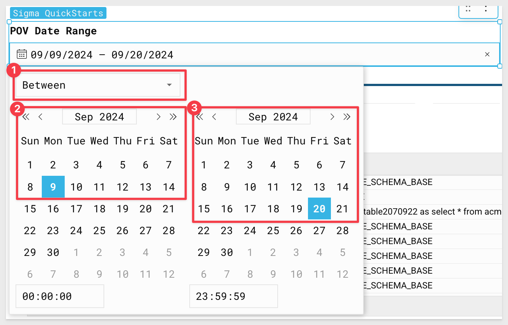
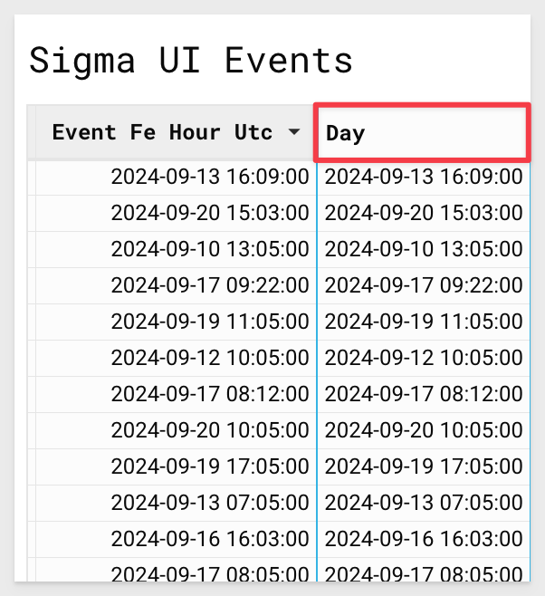
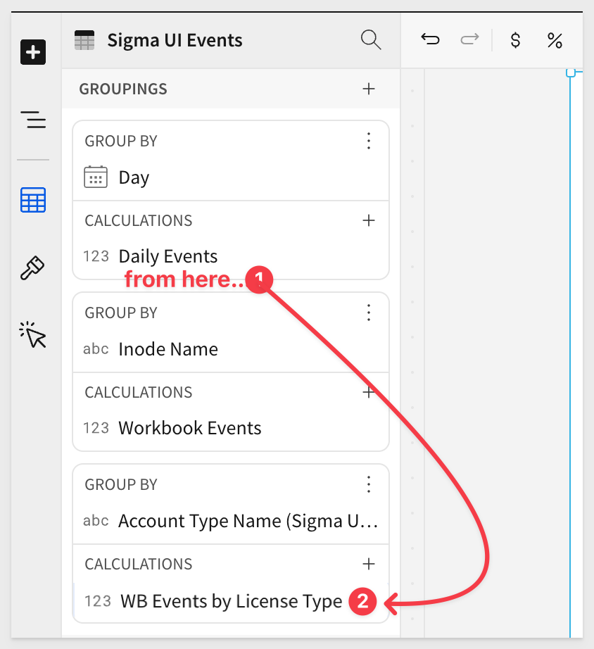
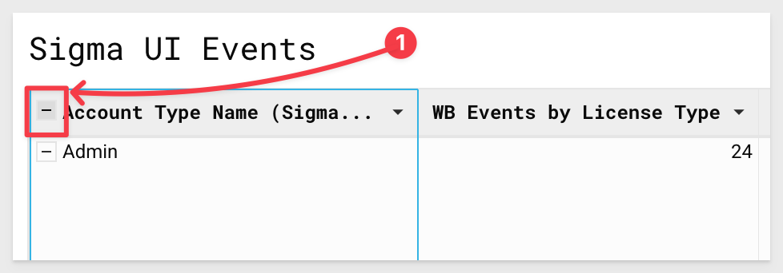
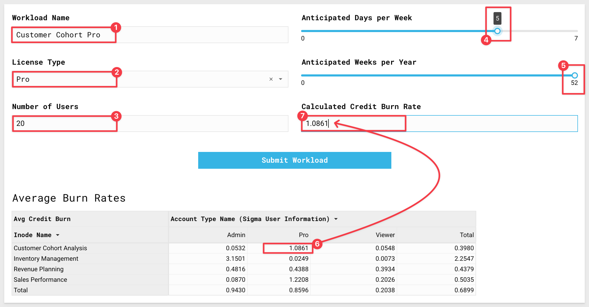

author: kelseyh-pballai
id: partners-nasa_hol-guide-snowflake-sko-2025
summary: partners-nasa_hol-guide-snowflake-sko-2025
categories: Partners
environments: web
status: Hidden
feedback link: https://github.com/sigmacomputing/sigmaquickstarts/issues
tags:
lastUpdated: 2024-02-04

# NASA HoL Guide- Snowflake SKO

## Overview 
Duration: 5 

**Houston, We Solved the Consumption Estimate Problem: A Hands-On Lab with Sigma’s New Activity Sizing Application (NASA)**

Welcome to NASA, Sigma’s New Activity Sizing Application! In this hands-on-lab you will be taking on the role of a Snowflake Sales Engineer. 

***Your mission:***<br>
Provide a detailed readout of POV activity and a data-backed prediction of future usage as your customer, Papercrane Inc., prepares to sign their Cap 2 Deal with Snowflake.

In this hands-on lab, you will take on the role of a Snowflake Sales Engineer.

***Background:***<br> 
Papercrane recently completed a two-week POV with Sigma and hopes to understand how onboarding this new workload could impact their overall Snowflake credit consumption. 

As you work together to scope their new Snowflake contract, you will leverage the Sigma platform—and the Sigma partnership—to analyze usage data, identify trends, and build a consumption estimate, culminating in a POV readout for Papercrane Inc.

### Target Audience
Participants of Snowflake SKO 2025 who are interested in getting some hands-on with Sigma.

No SQL or technical data skills are required for this hands-on-lab.

### Prerequisites

<ul>
  <li>A computer with a current browser. It does not matter which browser you want to use.</li>
  <li>Access to a Sigma environment, using the Sigma tile in Okta.</li>
  <li>A Snowflake demo environment.</li>
</ul>

<aside class="postive">
<strong>IMPORTANT:</strong><br> Sigma recommends that you use non-production resources when doing QuickStarts.
</aside>

<aside class="positive">
<strong>IMPORTANT:</strong><br> Some screens in Sigma may appear slightly different from those shown in QuickStarts. This is because Sigma is continuously adding and enhancing functionality. Rest assured, Sigma’s intuitive interface ensures that any differences will not prevent you from successfully completing any QuickStart.
</aside>


<!-- END OF OVERVIEW -->

## Configuring Your Environment 
Duration: 5

2.1: Find **"Sigma - New Activity Sizing Application"** in DataOpps.Live and follow the `Set up new solution` steps to deploy the data and workbook. 


<!-- END OF SECTION-->

## Setting up the Workbook
Duration: 5

3.1 Once the workbook is open, click the  by the template title and select `Save As.`:


3.2 Rename the workbook `NASA - {YOUR NAME HERE}` and click `Save.`:


We also need to download a zip file that contains two CSV files and one text file of a POV readout via Gong. 

We will use these later in the lab. 

<button>[Download the Lab Files](https://sigma-quickstarts-main.s3.us-west-1.amazonaws.com/csv/SnowSkoHoL+Docs.zip)</button>

Extract these somewhere on your local computer where you can find them later.


<!-- END OF SECTION-->

## Analyzing Usage
Duration: 5

4.1. Using the buttons on the home page, navigate to the `Analysis` tab:


On this tab, you should see the Snowflake query history and warehouse metering tables, as well as high level visualizations of the number of queries run by each warehouse and credits consumed.

4.2 You will notice the trend in usage has increased in the last two weeks as the result of your customer’s active POV with Sigma, and that two warehouses seem to be driving this trend: `SIGMA_ADHOC_WH` and `SIGMA_WORKBOOK_WH`:


Lets narrow this data down to just the new workload.

4.3 Using the `Select POV Date Range` filter, select the dates `9/9/24 - 9/20/2024`:



4.4 Using the Warehouse Name Filter, select `SIGMA_ADHOC_WH` and `SIGMA_WORKBOOK_WH` from the drop down. 

We can now see usage data related only to the new workload the customer is trying to scope. 


4.5 Click on the `Queries by Day & Warehouse` bar chart. Under X-Axis you will see `Day of Start Time`. 

Click the down arrow to the right of `Day of Start Time` and select `Truncate Date` > `Hour` to get a sense of the usage trends throughout the day:


4.6 Lets adjust the scale of the X-Axis to be more reflective of timeline. 

Click the `Paintbrush` on the lefthand side, then select `X-Axis`. 

Under `Scale type`, select `Time`:


This view can help us see the way warehouse usage peaks throughout the day, with a large number of queries being fired by the new Sigma workload during peak usage times:


4.7 One of the more complicated aspects of a consumption estimate is trying to determine how the number of users translates to actual warehouse usage. 

Luckily, our partners at Sigma have provided us Sigma telemetry and user data from the POV that we can add into our analysis. 

In the top left click the large plus sign to add a new element, then select `CSV`:


4.8 Select your Snowflake connection. Then browse for the file called `UI_EVENTS.CSV` or drag it and drop it to upload:


The CSV contains `192,147 rows and 20 columns.` Click `Save` in the top right corner:


4.9 Double click the header for your new input table and rename it `Sigma UI Events`:


4.10 Once again, click the `+` sign in the top left corner, select `CSV` > `your connection`, this time uploading the file `Users.CSV`, and clicking `Save` in the top right corner when the upload is ready:


4.11 Double click the header of this new table and rename it `Sigma User Information`. 

We now have two tables displaying information on Sigma usage, including the number of users who participated in the POC and their associated license types.

This information will help us extrapolate potential warehouse usage once the larger team onboards to Sigma and transitions into production: 

4.12 On the `Sigma UI Event`s table, scroll through the columns until you find a column called `Event Fe User Uuid`. 

Select the drop down next to this column, and select `Add new column` > `via Lookup`:


4.13 For Source, select the `Sigma User Information` table. 

Under columns to add, select `Account Type Name`. 

Finally, map the two elements on `Event Fe User Uuid = “Org Member User Uuid`. 

Click the blue `Done` button in the bottom right. 

We can now see the `Sigma license type` each associated event was run by:


4.14 Hover over the upper righthand side of the `Sigma UI Events Table` object, and select `Create a Child Element` > `Chart`:


4.15 Drag `Event Fe Hour UTC` to the `X-Axis`. 

Sigma automatically aggregates this timestamp at the day level. 

Click the drop down to the right of this column name and select `Truncate Date` > `Hour`:


4.16  Drag `Hourly Fe Event Key` to `Y-Axis`. 

Sigma will automatically make this a count of events by hour:


4.17 Next, change the drop list under `Color` and drag the `Account Type Name (Sigma User Information)` to the category grouping:


4.18 Click the paint brush icon in the lefthand panel. Select `X-Axis` and change scale type to `Time`:


4.19 Finally, Double click the chart title and rename it `Sigma Events by License Type`:


4.20 Drag the new chart directly below `Snowflake Queries by Day & Warehouse`:


You will notice that the number of Snowflake queries from the Sigma Warehouse sometimes exceeds the number of Sigma UI Events. 

This is due to the fact that Sigma fires queries against the metadata in the cloud services layer to index catalogs, schemas, tables, and views.

4.21 To narrow the data down to only show queries where an active warehouse was leveraged, navigate to the `Query History` table. 

Scroll through the query history table until you see the column `Warehouse Size`. 

Select the down arrow next to this column and select `Filter`:


4.22 Select the `three dots` next to the filter, and select `Exclude Values`:

This filter will now exclude any values selected:


4.23 Using the filter, select `Null` to remove any queries from the dataset that did not require a running warehouse. 

We can now see that the UI Events exceed queries where the warehouse was active. 

This is because Sigma has built in optimizations that allow it to leverage the results cache in Snowflake, as well as execute some operations in browser to avoid unnecessary compute on the warehouse:


4.24 Now that we have a sense of usage trends, we want to start exploring how user count is impacting credit consumption. 

On the `Warehouse Metering History` table, find the column `Start Time`. 

Click the down arrow, and select `Truncate Date` > `Day`: 


4.25 Select the drop down next to the new `Day of Start Time` column and click `Group Column`:


4.26 Now that the data is grouped based on the day, click the `+` in the `Day of Start Time` group, search for `Credits Used` and select that:


4.27 Sigma automatically summed the `Credits Used` for us:

Rename this column to `Daily Sigma Driven Credits`:


4.28 Next, scroll down to the `Sigma UI Events` table. 

We are going to create a "stable table" off of this input table for analysis, as some functionality is not currently available on input tables directly. 

Hover over the top right, select `Create Child Element`, then select `table`.

<aside class="negative">
<strong>NOTE:</strong><br> "Sigma UI Events" was created as an input table back in step 4.7 but we can still create different child elements from it.
</aside>


4.29 To keep our workspace clear, move the input table version (the table with pencils in each column header) to the data page by selecting the three dots in the top right hand and selecting `Move to` > `Data`:


4.30 Navigate back to the analysis page using the tabs on the bottom:


4.31 Return to the Sigma UI Events stable table.

We are going to leverage this table to understand the portion of events driven by each user of each license type at the workbook level, and tie that back to credit burn. 

Find the column labeled `Event Fe Hour UTC`, select the drop down and click `Duplicate Column`: 


4.32 Rename this new column `Day`:



4.33 Select the down arrow next to the new `Day` column and select `Truncate Date` > `Day`: 


4.34 Finally, select the drop down next to `Day` once more and select `Group Column`:


4.35 Next, find the column labeled `Inode Name` and group on this column:


4.36 Finally, create a third level of grouping using the column `Account Type Name (Sigma User Information)` that was added to the table previously, via look up. 

Selecting the drop down and click `Group Column`: 


4.37 Now that we have the data aggregated at several levels, we are going to start calculating usage at these aggregates. 

Select the drop down next to the first grouping on `Day`, and select `Add New Column`:


4.38 In the formula bar, type:
```code
CountDistinct([Hourly Fe Event Key])
``` 

Rename this column `Daily Events`:


4.39 Click the drop down next to the new `Daily Events` column and select `Duplicate Column`:


4.40 Once again click the drop down and duplicate the column two more times, so that you have three columns, `Daily Events`, `Daily Events (1)`, and `Daily Events (2)`: 


4.41 Using the UI menu on the lefthand side, drag `Daily Events (1)` under the `Innode Name` grouping.

Double click `Daily Events(1)` and rename the column `Workbook Events`: 


4.42 Next, drag `Daily Events(2)` from the `Day` grouping to the grouping under `Account Type Name` in the lefthand panel.

Rename `Daily Events (2)` to `WB Events by License Type`:



4.43 Click the drop down next to the new `Daily Events` column and select `Add new column Via Lookup`:


4.44 We want to look up to the `WH Metering History` table. 

For columns to add, select `Daily Sigma Driven Credits`. 

Finally, map the columns on `Day = Day of Start Time` and click `Done`: 


4.45 Rename this new column `Daily Credits`:


4.46 At the next grouping on `Inode Name`, click the down arrow by `Workbook Events` and click `Add new Column`. 

In the formula bar, enter 
```code
[Workbook Events]/[Daily Events]
```


Rename this new column `Portion of Daily Usage`:


4.47 Finally, add one more column off of `Portion of Daily Usage`. 

In the formula bar, type:
```code
[Portion of Daily Usage] * [Daily Credits] 
```

Rename this column `Workbook Daily Credits`:


4.48 At the `Account Type Name` grouping, add a new column off of `WB Events by License Type`: 


In the formula bar enter:
```code
[WB Events by License Type]/[Workbook Events] 
```

Rename this new column `Portion of WB Usage`:


4.49 Next, add a new column off of `Portion of WB Usage` and set the formula to:
```code
CountDistinct([Event Fe User Uuid]).
```

Rename this column `Active Licensed Users`:


<aside class="negative">
<strong>NOTE:</strong><br> This column represents the number of users by each license type who generated events for each workbook each day.
</aside>

4.50 Finally, add one last column to the right of `Active Licensed Users`. 

Set the formula bar to:
```code 
([WorkBook Daily Credits]*[Portion of WB Usage]) / [Active Licensed Users] 
```

Rename this new column `Daily Credits per Licensed User`:


4.51 Using the buttons next to the formula bar, adjust the decimal places so that the value is four characters past the zero:


4.52 Click the minus symbol next to the `Account Type Name` grouping to collapse the table at this level:



4.53 On the `Sigma UI Events` table, in the upper righthand side, click and select `Create Child Element`, then `Pivot Table`: 


4.54 For pivot rows, select `Inode Name`. 

For columns, select `Account Type Name`, and for values, use `Daily Credits Per Licensed User`: 


4.55 You will notice Sigma automatically `Sums the Daily Credits` column. 

Change the aggregate for this value to `Average`, by clicking the drop down, `Set Aggregate`, then `AVG`:


4.56 Rename the average value to `Avg Credit Burn`. 

Also rename the pivot table `Average Burn Rates` by double clicking the title. 

We can now see the average daily credit burn against the different workloads by users of the different license types. 

We can take this information and leverage the `Consumption Calculator` within the workload to extrapolate the yearly credit burn for the customers anticipated workloads and user counts:


4.57 Click on your pivot table, then select the `three dots`.

From the menu, select `Move to` and then `Consumption Calculator`:


4.58  Drag the pivot table so that it sits directly below the `Submit Workload` button:


<aside class="negative">
<strong>NOTE:</strong><br> You may have to re-adjust the pivot table after dragging/dropping. Sigma provides "handles" at the borders of selected elements that allow easy re-sizing. When there is extra space between elements, a "Trim space" button will appear to make removing the extra space simple.
</aside>

4.59 At the top of the page, click the blue `Publish` button to save your work:


<!-- END OF SECTION-->

## Using the Calculator
Duration: 5

5.1 Click the drop down next to the white `Editing` button and click `Go to Published Version`:


5.2 Click the blue `Launch Calculator` button in the workbook header:


5.3 For workload name, type `Sigma Admins`. 

For License type, select `Admin` from the drop down. 

For number of users, enter `9`. 

For days per week, slide the selection bar to `5`. 

For weeks per year, slide the selection bar to `52`. 

For `Calculated Workload Credit Burn for License Type` enter the value you see under `Admin` in the `Total` at the bottom (see screenshot below...).

We are leveraging the daily average across all workloads for the admin users, as their work is not typically tied to a single workbook. 

Click `Submit Workload`:


5.4 Prepare another workload by entering `Customer Cohort Pro` as the workload name. 

For License type select `Pro`. 

For number of users enter `20`. 

Anticipated Days per Week will be `5`.

Weeks per Year being `52`. 

Finally, for Calculated Credit Burn Rate, enter the value you see for `Customer Cohort Analysis` under `Pro` in the pivot table:



Click `Submit Workload`.

5.5 Finally, enter `Customer Cohort Viewer` as the workload name. 

For license type, select `Viewer`. 

For anticipated number of users, enter `50`. 

Assume `5` days a week, `52` weeks per year. 

Finally, for `Calculated Credit Burn` value enter the value you see for `Customer Cohort Analysis` under `Viewer`:


Click `Submit Workload`. 

5.6 We have used the calculator to create three workloads.

Scroll to the bottom of the calculator. 

You will see a table holding the submitted workloads, as well as the final credit consumption number associated with the inputs:


5.7 Click the `Close Calculator` button. 


<!-- END OF SECTION-->

## Configuring the POV Readout (Optional)
Duration: 5

6.1 From the `Homepage` click the `Input POV Details` button to open the `POV Detail Form`: 


6.2 For Customer Company, type `Papercrane Inc`. 

In Stakeholders, enter `David Chen, Director of Data Analytics`. 

You may enter any combination of names for Snowflake AE and Snowflake SE. 

For Partner Involved type `Sigma`. 

For Partner Rep, type `Alex Johnson`. 

Finally, for POV Goals, copy and paste the following: 
```plaintext
Improve time to insight, reduce data extracts, provide self-service capabilities to broader BI team
```


6.3 Click `Submit` on the `POV Detail Form`.

Click `Close` on the `Thank you!` modal:


6.4 Finally, copy the text from the `POV_Readout_Gong_call.txt` file that was included in the zip file we downloaded earlier.

Paste the text into the `Additional Information` box on the screen and click `Summarize`. 

This will call `Snowflake Cortex` to summarize the Gong transcript and return highlights from Papercrane’s Sigma POV:


<!-- END OF SECTION-->

## What we've covered
Duration: 5

In this QuickStart, we used Sigma to provide a detailed readout of POV activity and a data-backed prediction of future usage for your customer.

**Additional Resource Links**

[Blog](https://www.sigmacomputing.com/blog/)<br>
[Community](https://community.sigmacomputing.com/)<br>
[Help Center](https://help.sigmacomputing.com/hc/en-us)<br>
[QuickStarts](https://quickstarts.sigmacomputing.com/)<br>

Be sure to check out all the latest developments at [Sigma's First Friday Feature page!](https://quickstarts.sigmacomputing.com/firstfridayfeatures/)
<br>

[](https://twitter.com/sigmacomputing)&emsp;
[](https://www.linkedin.com/company/sigmacomputing)&emsp;
[](https://www.facebook.com/sigmacomputing)


<!-- END OF WHAT WE COVERED -->
<!-- END OF QUICKSTART -->
