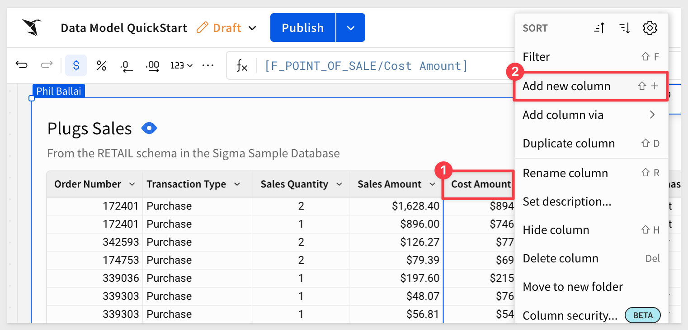

author: Phil Ballai
id: getting_started_with_sigma_and_snowflake
summary: getting_started_with_sigma_and_snowflake
categories: partners
environments: web
status: Published 
feedback link: https://github.com/sigmacomputing/sigmaguides/issues
tags: default
lastUpdated: 2025-05-29

# Getting Started with Sigma and Snowflake

## Overview 
Duration: 3

This entry-level lab introduces you to the core user interface and foundational capabilities of both Snowflake and Sigma. You’ll learn how to use them together to build simple yet powerful analytics solutions.

The lab is designed to be used with the free Snowflake and Sigma trials, which you can access directly through Snowflake’s Partner Connect.

### In this QuickStart, you’ll:
- Create Snowflake trial
- Launch a free Sigma trial using Snowflake Partner Connect
- Model, explore and analyze sample data, and build visualizations
- Create a Sigma workbook from a data model

<aside class="positive">
<strong>IMPORTANT:</strong><br> Some screens in Sigma may appear slightly different from those shown in QuickStarts. This is because Sigma is continuously adding and enhancing functionality. Rest assured, Sigma’s intuitive interface ensures that any differences will not prevent you from successfully completing any QuickStart.
</aside>

For more information on Sigma's product release strategy, see [Sigma product releases](https://help.sigmacomputing.com/docs/sigma-product-releases)

If something isn’t working as expected, here is how to [contact Sigma support](https://help.sigmacomputing.com/docs/sigma-support)

### Prerequisites
<ul>
  <li>Any modern browser.</li>
  <li>A Snowflake free 30-day trial environment.</li>
  <li>Sigma instance from Snowflake Parter Connect.</li>
</ul>

<aside class="postive">
<strong>IMPORTANT:</strong><br> Sigma recommends that you use non-production resources when doing QuickStarts.
</aside>

<button>[Snowflake Free Trial](https://trial.snowflake.com)</button>


<!-- END OF SECTION -->

## Prepare Your Snowflake Environment
Duration: 3

If not yet done, register for a [Snowflake free 30-day trial](https://trial.snowflake.com) 

You will have different Snowflake editions (Standard, Enterprise, e.g.), cloud providers (GCP, AWS, or Azure), and Regions (US Central, Europe West, e.g.) Available to you. 

We suggest you select the cloud provider and region which is physically closest to you and your data, and select the Enterprise edition so you can leverage advanced capabilities that are not available in the Standard Edition.

After registering, you will receive an email with an activation link and your Snowflake account URL. Bookmark this URL for easy, future access. After activation, you will create a username and password. Write down these credentials.


<!-- END OF SECTION -->

## The Snowflake User Interface
Duration: 10

Open a browser window and enter the URL of your Snowflake 30-day trial environment. You should see the login screen below. Enter your unique credentials to log in.


### Navigating the Snowflake Snowsight UI
For those not familiar, let’s get you acquainted with Snowflake! 

This section covers the basic components of the user interface to help you orient yourself. We will move top to bottom on the left panel of the UI.


**Create:**<br>
Launches options to create new objects such as databases, tables, warehouses, or worksheets.

**Home:**<br>
Returns you to the main Snowflake landing page with quick access to recent items and resources.

**Search:**<br>
Allows you to quickly find objects, queries, or metadata across your Snowflake environment.

**Projects:**<br>
Provides access to Snowflake projects, including worksheets, scripts, and development tools.

**Data:**<br>
Opens a view to browse and manage databases, schemas, tables, views, and other data objects.

**Data Products:**<br>
Central location to discover, manage, and publish data listings and shares (e.g., Snowflake Marketplace).

**AI & ML:**<br>
Access AI and machine learning capabilities such as Snowpark ML, Cortex functions, and model deployment tools.

**Monitoring:**<br>
View dashboards and logs related to query performance, usage metrics, and system health.

**Admin:**<br>
Manage users, roles, account settings, and security configurations for your Snowflake environment.


<!-- END OF SECTION -->

## Provisioning Sigma
Duration: 5

In the top ribbon of the Snowflake UI, click on the Partner Connect icon. Search for `Sigma` and click on the Sigma tile to start our new Sigma free trial.


- Sigma is the only cloud analytics and BI platform purpose-built as software-as-a service for Snowflake. Sigma offers a spreadsheet-like interface anyone can use to explore, analyze, and visualize data at unlimited scale.

- In this section we will provision a Sigma account (called an organization). Sigma is an Elite Snowflake BI Partner and a free trial of Sigma is available via the Snowflake PartnerConnect which is within the Snowflake UI.

### Direct Connection to Snowflake
Sigma is unique versus many other BI products in that Sigma is fully-managed SaaS, offers a direct connection to Snowflake , and pushes all queries to Snowflake for execution. Benefits of this include:

- Data accessed by Sigma is always live and accurate
- Unlimited query speed and scale as Sigma leverages the compute resources of Snowflake. Queries across up to hundreds of billions of rows are performant.
- Stronger security and governance as data never leaves Snowflake and it is easy to control permissions via a single point of access. 
- With many other BI products, data is extracted out of Snowflake to local desktops/servers for analysis which leads to stale data, limited scale and speed, and security issues with extracts scattered across many desktops and file shares.

- You will see a dialog box that will show you the objects that will be created in your account.  We will be using the `PC_SIGMA_WH` warehouse and the `PC_SIGMA_ROLE` for this lab.  These are automatically created for you as part of the LAUNCH.

Click `Connect`:


Now click `Activate` which will open a new tab:


A new tab for connecting to Sigma will pop-up in your web browser.

Provide a company name and click `Continue`:


Create your profile:


When ready, Sigma will display some additional information and we can click `Get started using Sigma`:


<!-- END OF SECTION -->

## Getting Around In Sigma
Duration: 6

Once on the homepage click the `Hide` link to close the trial guide:


The home page is logically organized for quick access to key features.

<aside class="negative">
<strong>NOTE:</strong> Other users will only see content/features as configured by their assigned "Account Type". 
</aside>

The main functions are numbered and described below:


 **Papercrane:** If you want to get back to the home page from anywhere in the portal, just click the Sigma `Papercrane` logo in the upper left corner.

 **Search:** You can click in the search bar at any point to search for content within Sigma.

 **Create New:** Use this anytime you want to create new content.
    <ul>
      <li><strong>Workbook:</strong> our spreadsheet-like UI for analyzing data</li>
      <li><strong>Data Model:</strong> A data model is a type of Sigma document that provides the framework for creating and managing a collection of reusable elements.</li>
      <li><strong>Write SQL:</strong> allows you to write SQL to run against the data warehouse.</li>
      <li><strong>Upload CSV:</strong> allows you to upload a CSV to the warehouse in order to perform analysis.</li>
    </ul>
     
If at any time you notice an item labeled **BETA**, it means the feature is mature enough for all customers to evaluate while we finalize its release.

If you ever need to know what is new in Sigma, there are two resources for that:

[Release Notes](https://help.sigmacomputing.com/changelog)

We also provide a summary on the "First Friday" of each month, which includes everything released in the prior month, including bug fixes.

[First Friday Features can be found here](https://quickstarts.sigmacomputing.com/firstfridayfeatures/)
 
 **My Content:**
 <ul>
      <li><strong>Home:</strong> will bring you back to home screen.</Li>
      <li><strong>My Documents:</strong> is a personal folder for you to save content you have created.</Li>
      <li><strong>Workspaces:</strong> are a way to organize and share content with specific members or teams within your organization. Items placed in workspaces can be accessed by anyone who has permission to that workspace.</Li>
      <li><strong>Templates:</strong> provides a way to standardize and share workbook structures, for quick and consistent reuse.</Li>
      <li><strong>Shared with Me:</strong> will show a list of items others have shared directly with you.</Li>
      <li><strong>Recent:</strong> will bring up items you have accessed recently.</Li>
      <li><strong>Favorites:</strong> will show a list of items that you have marked "favorite", for quicker access.</Li>
      <li><strong>Trash:</strong> the typical recycle bin functionality.</Li>
 </ul>

 **Connections Section:**
Visible to administrators and content creators by default, lists the data warehouses available. 

Clicking on one of them shows the tables in that warehouse you can access. There can be many connections for a single Sigma account, each configured with different levels of access to the warehouse, to be shared with members or teams. The actual connection configuration is done in the administration section.

<aside class="negative">
<strong>NOTE:</strong><br> Trials created from the Sigma website show the "Sigma Sample Database", which uses a Sigma provided Snowflake account. Trials created from cloud provider marketplaces may have additional connections.
</aside>

 **Top viewed:** Empty at the start, as teams start to create and use content, the most popular will float to the top of this listing.

 **Invite your colleagues:** Provides a quick method for adding users to your account. This is a configurable convenience; users in Sigma can be managed in the administration section or externally via any SAML 2.0 compatible identity management provider (ie: Okta, Auth0 ect...).

 **User Profile:**
In the top right corner, there is a box with your username initial. Clicking on it reveals your profile, where you can make changes to your preferences and sign out. Other UI options may or may not be visible to you depending on your permissions.

 **Help:** has lots of useful information for you to explore, to help you get the most out of Sigma.

<aside class="positive">
<strong>IMPORTANT:</strong><br> There is a link to "Live Chat" in this menu. Use it! Sigma is fanatical about supporting our customers. 
</aside>

 **Administration:** Dedicated area for user management and other common configuration settings. Only shown to users in the Admin role.</li>

Now that we have our initial orientation done, we can move on to the next section.


<!-- END OF GETTING AROUND IN THE UI -->

## Create a Data Model
Duration: 5

### Use case
For this demonstration, let’s assume we are a data analyst at a retailer called Plugs Electronics. Marketing wants to do some ad-hoc analysis against sales transactions and wants to work from trusted data without making mistakes. 

Corporate policy dictates that marketing should not have access to actual customer names and addresses but city/state information is fine. 

The CFO wants to make sure that any calculations that are performed meet the published standard.

### Set up the data model
Let's use Sigma's data modeling tools to create a reusable model to serve as the foundation for a workbook.

To create or manage a data model, the following is required:

- Users must be assigned an account type with the Create, Edit, and Publish datasets permissions enabled.

- Users must be the data model owner or be granted Can edit access to the data model.

By default, Sigma account types provide the following data modeling permissions:


Access to individual data models and workbooks are determined by [folder and document permissions](https://help.sigmacomputing.com/docs/folder-and-document-permissions)

From the Sigma homepage, click `Create new` > `Datamodel`:


The data modeling page looks and behaves a lot like a standard Sigma workbook by design.

The more we work with Sigma, the more metadata becomes available, which helps drive Sigma’s suggestions.

We can add elements to the page using the element bar. For example, we want to add a table:


In our case, we want to use tables from the `Sigma Sample Database` > `Retail` database and `PLUGS_ELECTRONICS` schema:


There are five tables that can provide the requested information for marketing.


### Base table
To satisfy marketing's main request, we are going to create a "base table" by joining three tables together, culling the column list manually and creating a calculated column.

Much of the data model interface follows the familiar Sigma workflow to make things as easy as possible. 

From the `Element bar`, select `Data` and drag a `Table` element onto the page:


Click `Select source`.

We could navigate to the table but it is easier to just search for `F_SALES` and select the table from the `RETAIL` schema:


The table is added to the page and we can work with it just as we would in a Sigma workbook. 

Rename the table to `Plugs Sales`.

### Join more tables
Since we know that marketing will always need columns from the `D_CUSTOMER` and `F_POINT_OF_SALE` tables, we can join them directly. 

Using joins, we’ll connect these two tables. Combined with the base table, this satisfies marketing’s initial request.

From `Plugs Sales`, select `Element source` > `Join` from the table menu:


Search for `D_CUSTOMER` and select the one from the `RETAIL` schema.

Accept all columns and set the `Join keys` to `Cust Key`. There are 105 customers who have never made a purchase:


Click the `+` icon to add another table to the join, this time selecting the `F_POINT_OF_SALE` table (from the RETAIL schema!) and joining on `Order Number`:


Click `Preview output`.

Sigma shows us the lineage of the joins and gives us an opportunity to deselect columns as needed:


<aside class="negative">
<strong>NOTE:</strong><br> Deselecting a column while in the lineage view does not prevent the column from being reselected in the data model later. If the column is not needed at all, delete the column prior to publishing the data model.
</aside>

Since this is our "base table" it is a good idea to delete columns that users will never need. For example, columns with duplicate information or key columns that won’t be used to create relationships later.

Click `Done`.

### Calculated columns
Since our base table does not have columns for `Revenue` or `Profit`, we can add them easily:



Add a new column ,and rename it to `Revenue`. Set the formula to:
```code
[Sales Amount] * [Sales Quantity]
```

Add another column, and rename it to `Profit`, and set the formula to:
```code
[Revenue] - ([Cost Amount] * [Sales Quantity])
```

The results look like this:


This are simple functions, but if you click on the "ƒx" icon to the left of the formula bar, you can see a full list of all the [functions Sigma supports](https://help.sigmacomputing.com/docs/function-index?_gl=1*1yvoh6x*_gcl_au*NjE1OTY4MDkwLjE3NDIyMzg4NDA.*_ga*MTAzMjQzMDMwNC4xNzQyMjI4NzA5*_ga_PMMQG4DCHC*czE3NDg2MTM3NTgkbzE2MSRnMSR0MTc0ODYyMjU4NiRqNTckbDAkaDA.). Sigma also provides helpful tooltips and autocomplete within the formula bar to help guide users how to use the functions.

### Machine-generated SQL
Every action we take in Sigma produces machine generated ANSI compliant SQL that is pushed down to Snowflake ensuring the data is secure and up to date at all times. Sigma never extracts from, or modifies data in, the cloud data source. 

You can see the queries we are generating by clicking the dropdown next to the refresh button on the top right and selecting `Query History`:


For more information, see [Query history reference](https://help.sigmacomputing.com/docs/examine-workbook-queries#query-history-reference)

There is also a QuickStart on [Sigma's Query Engine](https://quickstarts.sigmacomputing.com/guide/developers_sigma_calculations/index.html?index=..%2F..index#0)

Click `Publish`.

<aside class="negative">
<strong>NOTE:</strong><br> Sigma may warn you that dependent documents may be impacted by our changes. This is fine as we have not created any content based on this data model yet.
</aside>

### Corporate policy
In our use case, marketing is not allow to see customer names and addresses. We need to make sure that is enforced.

It is simple to just delete the `Cust Name` and `Cust Address` from the base table and we are done.

However, closer inspection shows that the `Cust Json Field` column has variant data that includes names and addresses as well. 

Since Sigma makes extracting Json data so simple, we need to be sure to delete that column as well.

For more information on extracting Json data in Sigma, see the QuickStart [Parsing JSON Data in Seconds](https://quickstarts.sigmacomputing.com/guide/tables_json_parsing/index.html?index=..%2F..index#0)

Go ahead and delete these columns:


<aside class="positive">
<strong>IMPORTANT:</strong><br> Hiding columns does not prevent downstream workbook builders from accessing them.
</aside>

Save the data model as `Data Model QuickStart`:


Click `Publish`.


<!-- END OF SECTION-->

## The Workbook
Duration: 5

We can see the data model as users with permission will see it by clicking `Go to published version`:


Here we see the very basic information about the data model:


When a data model is fully built out, they can provide a ton of useful information to workbook builders. For example:


For more information, see [Get started with data modeling](https://help.sigmacomputing.com/docs/get-started-with-data-modeling)

Click `Explore` and we are launched into a workbook with the `Plugs Sales` table loaded for us. Since this data comes from a model, we know that it meets corporate guidelines and the data is trusted.

<aside class="positive">
<strong>IMPORTANT:</strong><br> Spreadsheet-like Interface Sigma is unique in empowering users to do analysis in an interface they already know and love: the spreadsheet. It also uses familiar functions found in spreadsheets. No need for SQL knowledge as the Sigma interface automatically, and behind the scenes, converts all user actions into optimized SQL. This interface helps speed up user adoption and success, especially with non-technical business users.
</aside>

### Create Visualizations
It is often easier to spot trends, outliers, or insights which lead to further questions when viewing data in a visualization. Sigma makes it easy to create visualizations of your data while also enabling you to dig into the data that makes up that visualization.

Start the creation of a visualization by selecting the `Plugs Sales` table and then click the `Create child element` icon on its top right corner and select `Chart` to start creating a new chart.


This will add a chart below our table. 

In the right-hand `Element panel` you will see a dropdown that lists all of the supported chart types:


For more information, see [Chart Types](https://help.sigmacomputing.com/docs/intro-to-visualizations#chart-types)

Select the bar chart. On the X-Axis click the plus button and add our `Cust State` column.

<aside class="negative">
<strong>NOTE:</strong><br> Notice you can search here for the column you wish to add.
</aside>

We can also drag values onto the Axes instead of using the add button. 

If we look at our columns on the bottom, find the `Profit` column and drag it under the `Y-Axis`. 

The value will automatically aggregate and become `Sum of Profit`:


Under the `X-Axis` header, click the dropdown next to `Cust State` and go to `Sort` then `Sum of Profit`. This will put the x-axis in ascending order. 


Now let's look at our sales over time to get an understanding of how we are trending. Another way to create a new chart is by using the `Element bar` and selecting the chart type we want:


Select a `Line` chart. Sigma prompts for a source. We can reuse the `Plugs Sales` table, or the other chart or something from some other data source too.

Select `Plugs Sales`.

Next, drag the `Date` column into the `X-Axis`.

Notice that Sigma has defaulted to change the aggregation to `Day` as the title now reads `Day of Date`. 

We can change this aggregation at any time using the dropdown next to the field name, and selecting a new aggregation level under the `Truncate date` submenu. Let's change the aggregation level to be `Month`:


Next we can place our `Revenue` column on the `Y-Axis` to see our revenue over time. Again, Sigma has automatically summed the revenue to the monthly level:


### Pivot Table
By now the general workflow is pretty clear so adding a pivot table is not much different. Add one from the `Element bar` and configure it as shown:


There are many more things we can do with pivot tables in Sigma. For more information, see [Working with pivot tables](https://help.sigmacomputing.com/docs/working-with-pivot-tables)

Click `Publish`.


<!-- END OF SECTION-->

## Filtering Data
Duration: 3

Filtering in Sigma is simple and powerful too. We can add a variety of filters using the `Element bar` but let's use a different workflow.

From the `Plugs Sales` table, open the column menu for `Cust State` and select `Filter`:


Normally, this method can be used to manually filter any page element but instead, let's convert it to page control:


This places a new list control on the page for us:


We can further configure various options of the control using the `Element panel`:


The last thing we need to do is to configure the control to "target" other page elements:


Selecting just a few states from the filter will now filter all the elements on the target list:


Lastly, click `Save As` and give your workbook a name.


<!-- END OF SECTION-->

## Conclusion
Duration: 3

In this QuickStart we went through the process of setting up up a Snowflake free trial, and a Sigma free trial through Snowflake partner connect. We did some light modeling, and an analysis resulting in a Sigma workbook.

The seamless transition from Snowflake to Sigma enables data professionals to iterate quickly and with ease. This sets Sigma up uniquely to not only provide a robust client facing tool but also a great sand box for data engineers to profile and experiment with freshly landed data in Snowflake.

We really only skimmed the surface of Sigma. Be sure to check out the other resources below to get more information.

Another great resource for learning Sigma are the [Fundamentals QuickStart series](https://quickstarts.sigmacomputing.com/?cat=fundamentals) 

### Helpful Resources

Be sure to check out all the latest developments at [Sigma's First Friday Feature page!](https://quickstarts.sigmacomputing.com/firstfridayfeatures/)

- Help Center including Documentation: [https://help.sigmacomputing.com](https://help.sigmacomputing.com)
- Sigma Blog: [https://www.sigmacomputing.com/blog/](https://www.sigmacomputing.com/blog/)
- Resources and Case Studies: [https://www.sigmacomputing.com/resources/](https://www.sigmacomputing.com/resources/)


