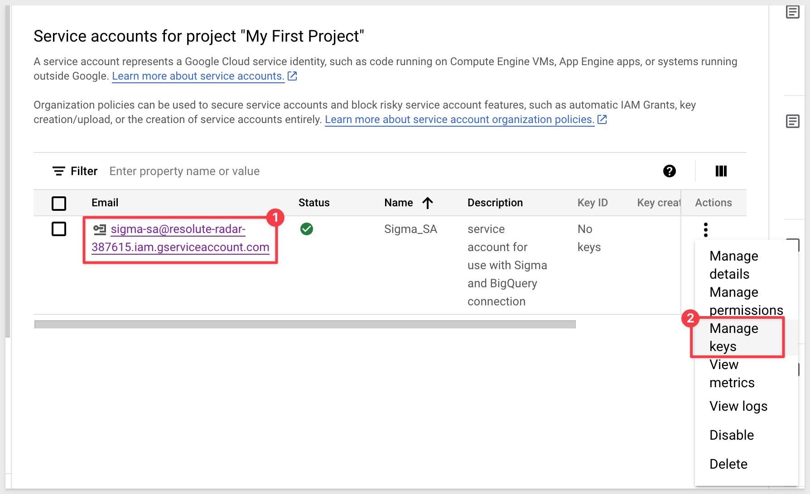
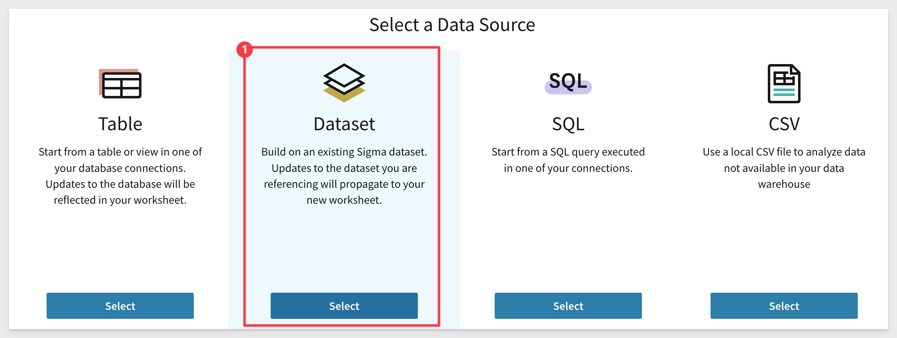
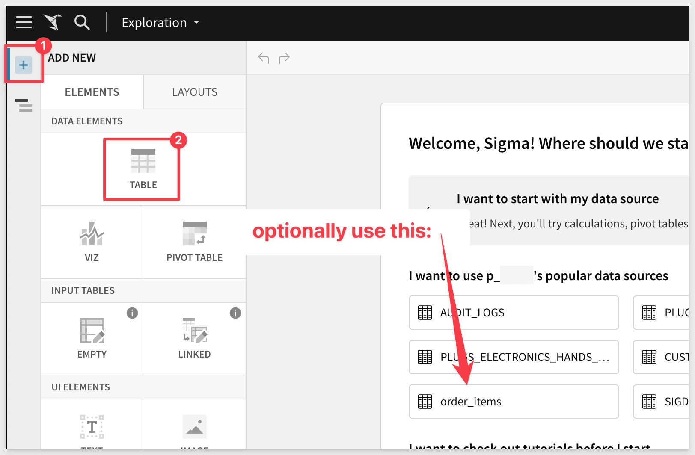
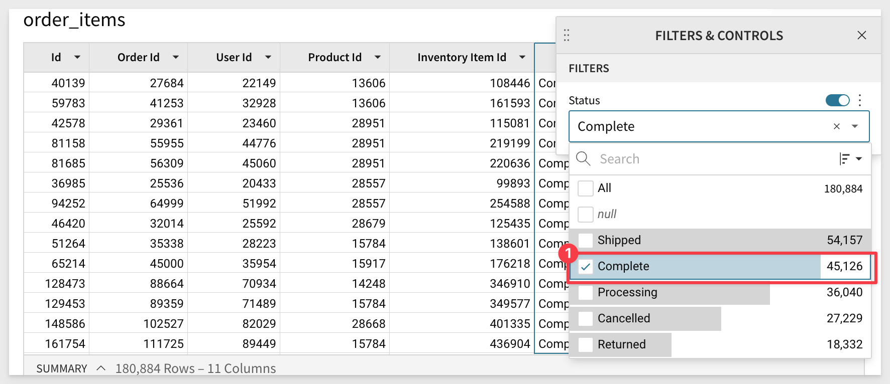
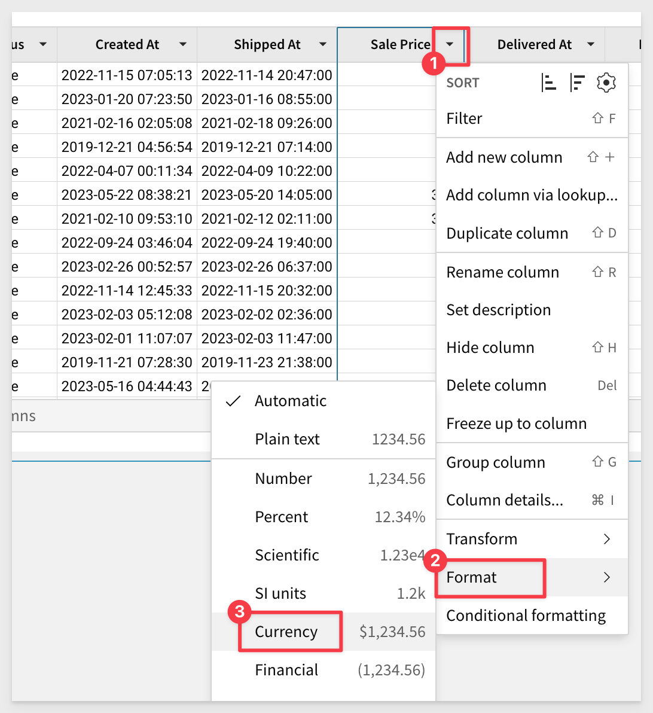
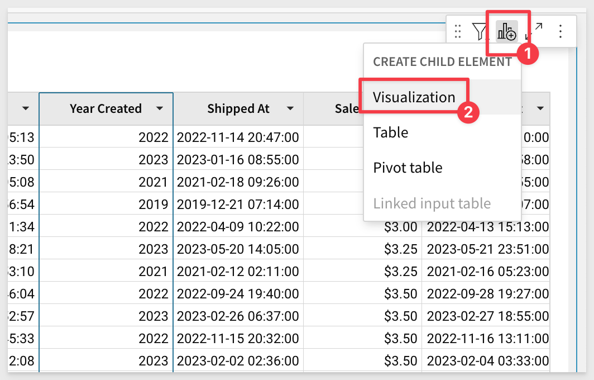
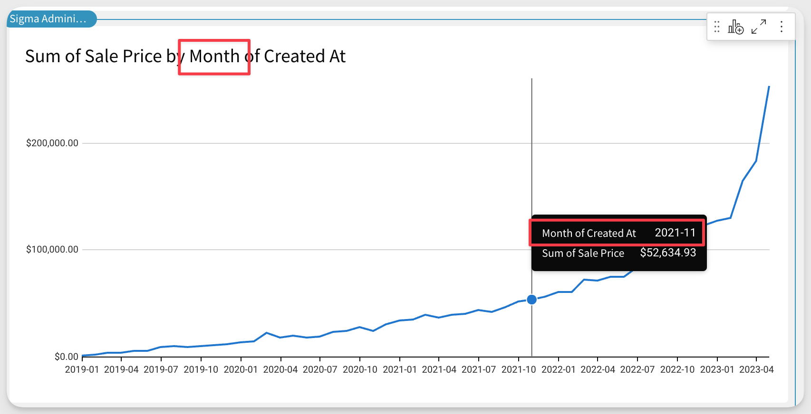

author: pballai
id: partners_google_big_query
summary: partners_google_big_query
categories: Partners
environments: web
status: Published
feedback link: https://github.com/sigmacomputing/sigmaquickstarts/issues
tags: default
lastUpdated: 2023-05-24

# Google BigQuery with Sigma
<!-- The above name is what appears on the website and is searchable. -->

## Overview 
Duration: 5 
[Google BigQuery (BigQuery)](https://cloud.google.com/bigquery/) is a fully managed enterprise data warehouse that helps you manage and analyze your data with built-in features like machine learning, geospatial analysis, and business intelligence. BigQuery's serverless architecture lets you use SQL queries to answer your organization's biggest questions with zero infrastructure management. BigQuery's scalable, distributed analysis engine lets you query terabytes in seconds and petabytes in minutes

Sigma’s cloud analytics and BI platform empowers business users to tap into BigQuery’s virtually unlimited scale and speed so any user (with permissions) can freely join, calculate, and filter through billions of rows of real-time data for the ultimate insights. 

Sigma with BigQuery eliminates BI bottlenecks by turning the data modeling process into a collaborative process. Users can collaborate on spreadsheets and create visualizations, which streamlines communication and decision-making by connecting data teams and business users. Finally, as users continue to ask questions, they’re free to explore and drill into data, ultimately reducing the load placed on analysts teams. 

In this article, we will discuss what differentiates Sigma, how you can set up Sigma to take advantage of BigQuery's capabilities, and create visualizations with Sigma

 ### Target Audience
Customers who are interested in Sigma’s cloud analytics and BI platform to tap into BigQuery’s virtually unlimited scale and speed.

### Prerequisites

<ul>
    <li>A computer with a current browser.</li>
    <li>Access to your Sigma environment as "administrator"</li>
    <li>Some familiarity with Sigma is assumed. Not all steps will be shown as the basics are assumed to be understood.</li>
    <li>A Google cloud (GCP) account with Administrative access.</li>
</ul>

<aside class="positive">
<strong>IMPORTANT:</strong><br> Make sure you can access your Google account, new or existing, before starting this guide. To set up BigQuery with the Google Cloud Platform, you can use a personal or professional account (GCP).
</aside>
 
<button>[Sigma Free Trial](https://www.sigmacomputing.com/free-trial/)</button> <button>[GCP Free Trial](https://cloud.google.com/free?utm_source=google&utm_medium=cpc&utm_campaign=na-none-all-en-dr-sitelink-all-all-trial-e-gcp-1605212&utm_content=text-ad-none-any-DEV_c-CRE_518216250706-ADGP_Desk%20%7C%20BKWS%20-%20EXA%20%7C%20Txt%20_%20GCP%20_%20Pricing_Pricing_Free-KWID_43700061498279636-kwd-1180531793249-userloc_9009736&utm_term=KW_gcp%20free%20tier%20product-ST_gcp%20free%20tier%20product-NET_g-&gclid=Cj0KCQjwyLGjBhDKARIsAFRNgW88NLYtmnlL8KmSTEZ0xLxNy7rniYIRrdk-UNP0v68jLPKCSEY3qkIaAlSwEALw_wcB&gclsrc=aw.ds)</button>

### What You’ll Learn
How to leverage BigQuery in Sigma, connecting to data, creating tables / pivots and visualizations, all using the power of the Google Cloud.

### What You’ll Build

We will use Sigma, BigQuery and Google provided sample data to build a simple dashboard similar to this one:


<!-- NOTE: SIGMA LOGO REQUIRED AT END OF EACH ## SECTION -->
<!-- END OF OVERVIEW -->

## Major Features
Duration: 20

### Spreadsheet UI:
Sigma’s self-service tooling is a league beyond other BI tools because it caters to the tool-set that almost every data worker knows, **the spreadsheet.** Google Sheets users can seamlessly transition from asking questions in Sheets to Sigma ensuring that time to implementation stays low. 

Additionally, since users can quickly iterate through their analysis on data at any scale, this reduces the overall number of requests sent back to the analytics team.

Sigma’s no-code interface creates machine-generated SQL (optimized for every database Sigma connects to) under the hood, so any database engineer can always get right into the data and even test out the results of an analysis directly in their warehouse. 

### Data Governance & Optional Modeling: 
In Sigma, our goal is to allow your analysts and users to leverage the work of your data engineers without any additional work. Whether you’re using tools like Matillion, DBT, or modeling in your warehouse, your end users can start analyzing data they’ve been permitted to access. 

Sigma features a robust suite of data governance levers from [metrics](https://help.sigmacomputing.com/docs/create-and-manage-metrics) (to govern KPIs), to [team and workspace-based sharing.](https://help.sigmacomputing.com/docs/manage-workspaces) 

Sigma also offers an incredibly flexible structure for row level security called [user attributes](https://help.sigmacomputing.com/docs/user-attributes) which allows you to define unique characteristics for users and the corresponding data they should see within a table. This ensures that data shared internally and externally is always governed by a strict rule set that scales endlessly. 

### Input tables:
With [Input Tables](https://help.sigmacomputing.com/docs/intro-to-input-tables), your teams can effortlessly incorporate human context into their analysis by bringing their own data directly into the warehouse, all without writing any code. With Input Tables, both your analytics and business teams can remove data roadblocks, reduce repetitive analytics tasks, and make more impactful decisions faster

This unique capability ensures teams can create detailed forecasts from historical data and future projections, build internal data auditing tools, perform rapid data prototyping with external sources, or build detailed models that can be managed with just a few inputs.

For most BI tools, it’s impossible to bring in the human context of data, and, because of this, users default back to tools like Google Sheets because the context they provide is crucial to the overall analysis. Sigma solves this problem by giving your analytics team a way to govern reporting while empowering individual team members to add details and context with Input Tables.


<!-- END OF SECTION-->

## GCP Setup
Duration: 20

This section will explain how to connect Sigma to BigQuery. You will learn the following things:

 <ul>
      <li>How to set up a new BigQuery instance.</li>
      <li>Access sample data from a public dataset.</li>
      <li>Connect Sigma to BigQuery.</li>
      <li>Explore and analyze data and turn it into visualizations and dashboards.</li>
</ul>

### Create Google Cloud Project
Google Cloud project is the basis for creating, managing and using Google Cloud resources including BigQuery. If you already have an [existing Google Cloud project](https://cloud.google.com/resource-manager/docs/creating-managing-projects#get_an_existing_project) then you can use the same or you can [create a new project.](https://cloud.google.com/resource-manager/docs/creating-managing-projects) 

Second step would be to enable [BigQuery](https://cloud.google.com/bigquery), which is a cloud data warehouse that companies use for running analytics on large datasets. 

The “getting-started” experience with BigQuery is smooth, instead of downloading and installing database software, sourcing data, and loading it into tables, you can login to the [BigQuery sandbox](https://cloud.google.com/bigquery/docs/sandbox) and immediately start writing SQL queries (or copying sample ones) to analyze data provided as part of the Google Cloud [public datasets program](https://cloud.google.com/bigquery/public-data).

Login to your GCP as Administrator.

If you signed up for a free trial on GCP, a `Project` will already exist for you and we will use this. If one does not exist, then you will need to create one.

We can see the list of available projects on the `My Projects` tab of the `Billing` page:


<aside class="negative">
<strong>NOTE:</strong><br> We will make use of the GCP searchbar to quickly move between GCP configuation pages. We will demonstrate once and assume its use as we go forward.
</aside>

### Create Google Cloud Service Account

**BigQuery IAM setup:**<br>
You must create a Service account with a keyfile if you want Sigma to connect to BigQuery warehouse. 

<aside class="positive">
<strong>IMPORTANT:</strong><br> A service account is a dedicated account used by applications or services to securely communicate and is not based on any single "named user". 
</aside>

Using the `Search` feature of GCP, type `IAM` and select `IAM` from the list shown:


Select [Service account](https://cloud.google.com/iam/docs/service-account-overview) from IAM & Admin section, then click [create service account](https://cloud.google.com/iam/docs/service-accounts-create):


In the Service account name area, enter service account name, then select Create and Continue:


In the Role droplist we need to add the following BigQuery roles: 

 <ul>
      <li><strong>BigQuery Data Editor:</strong> Required to enable write access to the database and use of several Sigma features such as CSV upload, Materialization.</li>
      <li><strong>BigQuery Data Viewer:</strong> To read data.</li>
      <li><strong>BigQuery Job User:</strong> To run jobs and queries in BigQuery.</li>
</ul>


Click `Continue` and `Done` (we will not need to grant any users access to this service account.)

For each of these principals, there are a number of roles listed. To learn more, see [Understanding roles](https://cloud.google.com/iam/docs/understanding-roles) and [Understanding IAM custom roles](https://cloud.google.com/iam/docs/understanding-custom-roles). Google Cloud scans the actions of these principles and makes suggestions as to those who could have fewer permissions, which generally increases the security of your project. To learn more, see [Enforce least privilege with role recommendations](https://cloud.google.com/iam/docs/recommender-overview).

Click the new service account, then Choose `Manage Keys`:



Click `Add Key` and `create a new key`:


Select `JSON` for key type and click `Create`:


The JSON file download will download automatically (download it, should it not start automatically) and is required. 

Save it locally with a distinct filename and in an easy-to-remember location. 

For example, we renamed ours to `bq-sigma-credentials.json`.

Click `Close`.


<!-- END OF SECTION-->

## Sigma Connection to BigQuery
Duration: 20

Now we will configure a connection In Sigma to BigQuery.

Login to Sigma as an Administrator.

Navigate to `Administration`:


Select `Connections` > `Create Connection`:


We need to provide the `Billing project ID` from GCP. That can be copied from this page in GCP, and clicking the `Manage` link:


Copy the `Projedct ID` and paste it into the `Billing project ID` section in the Sigma connection configuration. 


Next, open the Service Account key file in a text editor (the one we downloaded and renamed earlier from GCP) and paste the entire contents of the file into the `Service account` section in the Sigma connection configuration. Take care not to leave trailing spaces from the copy/paste operation.

When done, click `Create`. Sigma will attempt to validate the connection is working or not. A message will appear upon success or failure.

<aside class="positive">
<strong>IMPORTANT:</strong><br> The name you give this connection will be used later when we navigate to our data in BigQuery. Take note of it.
</aside>


<aside class="positive">
<strong>IMPORTANT:</strong><br> The JSON file is not visible in Sigma once it’s been uploaded to the connection, so the team creating the connection to BigQuery will need to maintain and secure the original JSON file.
</aside>


<!-- END OF SECTION-->

## Sigma Dataset Creation
Duration: 20

Sigma's Datasets are a flexible way to build centralized data definitions and guide data exploration. Sigma balances administrative control with the freedom to find, add, and trust new data. Datasets function as sources of data for Workbooks.

Sigma has the ability to join tables, other datasets, csv uploads, or your own SQL inside of datasets. 

In Sigma, we will first create a new Dataset and connect it to the `bigquery-public-data` that is provided in the GCP trial account. 

Return to the Sigma homepage. You can click the `Crane logo` in the upper left corner anytime to return to the homepage.

Click on the `Create New` at the top left of the page and then select `Dataset`:


Click `Select` under `Dataset`:



For `Source`, navigate to `Connections` > `GCP Trial Account to BigQuery` > `bigquery-puplic-data` > `thelook_ecommerce` database > `order_items` table:


When the correct table is located, click it and then select `Get Started` and then `Publish`.

We now have a defined Dataset we can use in the next section. We could join other data here but we will do that later instead.

<aside class="positive">
<strong>IMPORTANT:</strong><br> This is a simple dataset and there are a few different workflows and options customers can use to make data available in a controlled manner for others to use in Sigma. 
</aside>


<!-- END OF SECTION-->

## Sigma Workbook
Duration: 20

Sigma workbooks offer data exploration tools, including a visualization canvas, designed to enable spreadsheet-savvy users to apply formulas and charting options that are typically accessible only to Business Intelligence (BI) developers.

In Sigma, from the homepage, click on the `Create Workbook`: 


There are a two ways to add our Dataset to our new Wookbook. One is to just select it from the `popular data sources` list. The other is to use the `Element Panel` and select a new `Data Element`. We will use that route:



Select the `TABLE` option, then select `TABLES AND DATASETS`:


We can select the `order items` Dataset that is listed under `Recent`:


Click `Select` to bring the dataset into your Sigma Workbook.

<aside class="positive">
<strong>IMPORTANT:</strong><br> Sigma’s spreadsheet-like interface makes it easy for business users to use workbooks to explore data and self-serve in a governed and secure way.
</aside>


We need to join another table to our dataset.

Click the "hambuger menu" (3-dots) and select `Element Source` < `Join`:


Select the `New` tab, then `TABLES AND DATASETS`, then ``Connections` > `GCP Trial Account to BigQuery` > `bigquery-puplic-data` > `thelook_ecommerce` database > `products` table:


Click to select it. Set the `Join Keys` as shown below and click `Preview Output`:


We are shown a visual representation of the dataflow (lineage). 

Click `Done`:

Before we go forward, click the `Save As` button and give the Workbook a the name `BigQuery Orders`.


<!-- END OF SECTION-->

## Benefits of Connecting Sigma to BigQuery
Duration: 20

There are a wide range of benefits by opting for a modern data analysis and visualization stack. 

These include:
 <ul>
      <li>Faster time to value for analytics with BigQuery near unlimited scaling and processing capabilities, so decisions can be made faster.</li>
      <li>High user retention and engagement by giving users an interface they intuitively understand, the spreadsheet..</li>
      <li>Engage users in the modeling and exploratory process of data analysis. In Sigma, users can ask questions of the data just like they would in Google Sheets, but at the scale of your data. Work with millions or even billions of rows of data.</li>
      <li>Get started with Sigma in a flash! Once you’ve established a connection from BigQuery to Sigma any user can work with permission tables immediately. Ask questions, build visualizations, and create reports in a fraction of the time of other tools..</li>
      <li>Harness the power of BigQuery in Sigma by effectively working with your data at scale. Sigma issues live queries rather than working off extracts. This ensures your data is always live and up-to-date..</li>
      <li>Access BigQuery user-defined functions directly in Sigma to ensure even the most complex functions are available to your entire organization.</li>
</ul>


<!-- END OF SECTION-->

## Working with Data in Sigma
Duration: 20

### Build Sigma dashboards and analyze data
In this section, we will demonstrate some basic features of Sigma that show how easy it is to leverage our data in BigQuery while working in a familiar interface.

Using the `BigQuery Orders` Workbook we will first narrow down our data scope to complete orders.

Select the dropdown next to `Status` and select the `Filter` button:


Select `Complete` to find only the finalized orders:



Format `Sale Price` as a currency by selecting `Format`> `Currency` from dropdown:



To perform analysis on the basis of order creation year, add a duplicate column `Created At` and then `truncate` it down to `Year`:


Double click on the new column's header (name) and rename it to `Year Created`.

### Create a Visualization from Table
We can create a visualization that leverages this table's data (child element). 

Select the `Create Child Element` and the `Visualization` option:



With the new visualization selected, we’ll start by adding the `Created At` field to the x-axis. You can either use drag and drop interface or search for it, like in the  example below:


For the y-axis, add the transformed `Sale Price` field from previous steps. Try dragging a dropping the `Sale Price` column this time:


<aside class="negative">
<strong>NOTE:</strong><br> Sigma automatically applied aggregation to the Sale Price, saving you time.
</aside>

The visualization will appear showing the `sum of Sale Price by Created At` for the availble data in the table:


We’ll modify this visualization by changing it to a line chart:


To perform data aggregation at a higher order of time (for example, at the month), we have a few methods availble to the user.

We can use the drop menus (as before) to truncate the `Day of Created At` column in the `X-AXIS` to month:


**OR**

Column data can be manipulated using Sigma's `formula bar`, similar to spreadsheet formula features. 

Notice here, we just selected the `Day of Created At` column in the `X-AXIS` and altered the existing formula to `Month` instead of `Day`:


The chart is automatically updated to reflect the month instead of day:



### Create a Pivot Chart

It is easy to create a pivot table in Sigma. 

We will create another child element from our `order_items` table but this time, select `Pivot table`.

Add `Year of Created` to the `Pivot Rows` section.

Add `Department (products)` to the `Pivot Columns` section:

For data analysis, you can add aggregations in the `Values` section. Sigma enables data analysis at different cohorts. 

In this example we’ll simply add our Cost` and `Sale Price` columns to the values section. 

Create a new column within the pivot table called `Profit` by selecting the plus sign next to `Values` and clicking `New Column`:


Use the formula bar to set the formula for the new column to:
```console
Sum([Sale Price]) - Sum([Cost])
```


Double-click (or use the drop menu) to rename the new column from `Calc` to `Profit`:


This will create a Pivot Table to analyze or drill into as necessary.

You may want to experiment with moving and resizing the table, chart and pivot to create a simple dashboard. 

Don't forget to `Publish` your work when you are done. 

Lastly, you can see the final product by using the `Go to published version` link as shown. 


This is how an end-user of Sigma might see your Workbook after some rearranging and renaming:


<!-- END OF SECTION-->

## What we've covered
Duration: 5

In this article, you learned how to set up and connect Sigma to BigQuery. Connecting Sigma to BigQuery can provide significant benefits for data analysts and data teams looking to improve their data visualization and analytics capabilities. Using BigQuery as the underlying data warehouse provides a highly scalable and cost-effective solution for storing and querying large volumes of data. 

**Authored by**
 <ul>
      <li>Nancy Goyal, Strategic Cloud Engineer, Google Cloud</li>
      <li>Reed Rawlings, Solution Engineer, Sigma Computing</li>
</ul>

<!-- THE FOLLOWING ADDITIONAL RESOURCES IS REQUIRED AS IS FOR ALL QUICKSTARTS -->
**Additional Resource Links:**

Be sure to check out all the latest developments at [Sigma's First Friday Feature page!](https://quickstarts.sigmacomputing.com/firstfridayfeatures/)

[Help Center Home](https://help.sigmacomputing.com)<br>
[Sigma Community](https://community.sigmacomputing.com/)<br>
[Sigma Blog](https://www.sigmacomputing.com/blog/)<br>
<br>

[](https://twitter.com/sigmacomputing)&emsp;
[](https://www.linkedin.com/company/sigmacomputing)&emsp;
[](https://www.facebook.com/sigmacomputing)


<!-- END OF WHAT WE COVERED -->
<!-- END OF QUICKSTART -->
