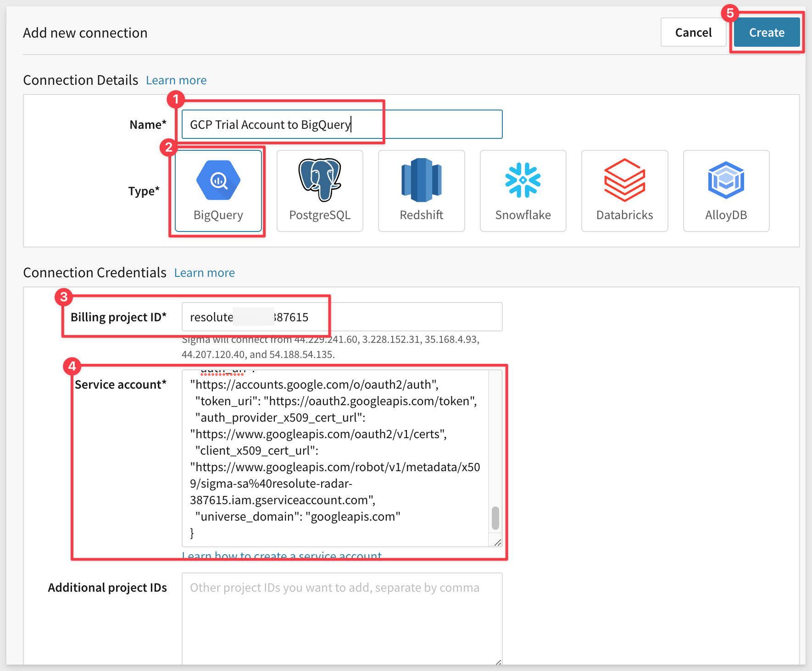
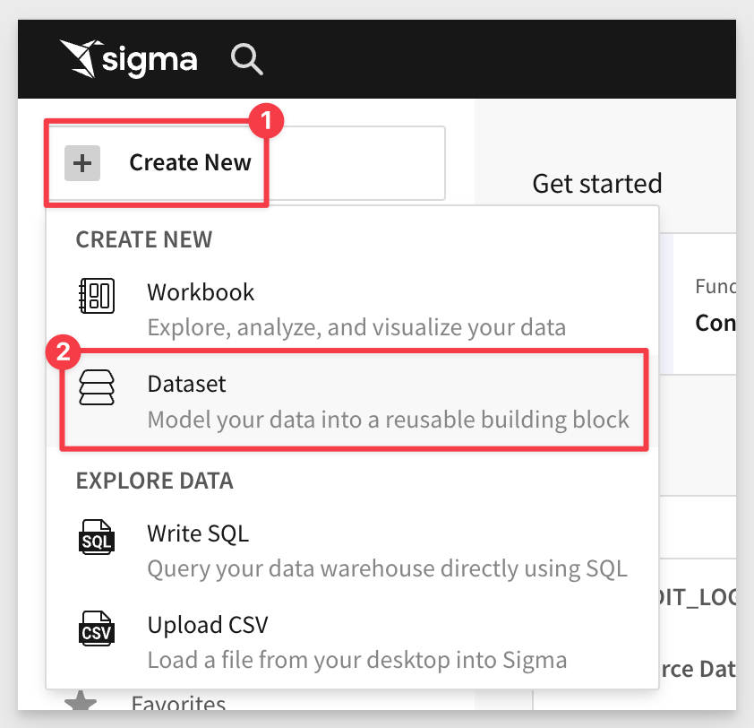

author: pballai
id: partners_google_big_query
summary: partners_google_big_query
categories: Partners
environments: web
status: Published
feedback link: https://github.com/sigmacomputing/sigmaquickstarts/issues
tags: Getting Started
lastUpdated: 2023-05-24

# Google Big Query with Sigma
<!-- The above name is what appears on the website and is searchable. -->

## Overview 
Duration: 5 
[Goggle BigQuery (BigQuery)](https://cloud.google.com/bigquery/) is a fully managed enterprise data warehouse that helps you manage and analyze your data with built-in features like machine learning, geospatial analysis, and business intelligence. BigQuery's serverless architecture lets you use SQL queries to answer your organization's biggest questions with zero infrastructure management. BigQuery's scalable, distributed analysis engine lets you query terabytes in seconds and petabytes in minutes

Sigma’s cloud analytics and BI platform empowers business users to tap into BigQuery’s virtually unlimited scale and speed so any user (with permissions) can freely join, calculate, and filter through billions of rows of real-time data for the ultimate insights. 

Sigma with BigQuery eliminates BI bottlenecks by turning the data modeling process into a collaborative process. Users can collaborate on spreadsheets and create visualizations, which streamlines communication and decision-making by connecting data teams and business users. Finally, as users continue to ask questions, they’re free to explore and drill into data, ultimately reducing the load placed on analysts teams. 

In this article, we will discuss what differentiates Sigma, how you can set up Sigma to take advantage of BigQuery's capabilities, and create visualizations with Sigma

 ### Target Audience
Customers who are interested in Sigma’s cloud analytics and BI platform to tap into BigQuery’s virtually unlimited scale and speed.

### Prerequisites

<ul>
    <li>A computer with a current browser.</li>
    <li>Access to your Sigma environment as "administrator"</li>
    <li>Some familiarity with Sigma is assumed. Not all steps will be shown as the basics are assumed to be understood.</li>
    <li>A Google cloud (GCP) account with Administrative access.</li>
</ul>

<aside class="positive">
<strong>IMPORTANT:</strong>  Make sure you can access your Google account, new or existing, before starting this guide. To set up BigQuery with the Google Cloud Platform, you can use a personal or professional account (GCP).
</aside>
 
<button>[Sigma Free Trial](https://www.sigmacomputing.com/free-trial/)</button> <button>[GCP Free Trial](https://cloud.google.com/free?utm_source=google&utm_medium=cpc&utm_campaign=na-none-all-en-dr-sitelink-all-all-trial-e-gcp-1605212&utm_content=text-ad-none-any-DEV_c-CRE_518216250706-ADGP_Desk%20%7C%20BKWS%20-%20EXA%20%7C%20Txt%20_%20GCP%20_%20Pricing_Pricing_Free-KWID_43700061498279636-kwd-1180531793249-userloc_9009736&utm_term=KW_gcp%20free%20tier%20product-ST_gcp%20free%20tier%20product-NET_g-&gclid=Cj0KCQjwyLGjBhDKARIsAFRNgW88NLYtmnlL8KmSTEZ0xLxNy7rniYIRrdk-UNP0v68jLPKCSEY3qkIaAlSwEALw_wcB&gclsrc=aw.ds)</button>

### What You’ll Learn
How to leverage BigQuery in Sigma, connecting to data, creating tables / pivots and visualizations, all using the power of the Google Cloud.

### What You’ll Build

INSERT IMAGE OF FINAL BUILD IF APPROPRIATE.........

<!-- NOTE: SIGMA LOGO REQUIRED AT END OF EACH ## SECTION -->
<!-- END OF OVERVIEW -->

## Major Features
Duration: 20

### Spreadsheet UI:
Sigma’s self-service tooling is a league beyond other BI tools because it caters to the tool-set that almost every data worker knows, the spreadsheet. Google Sheets users can seamlessly transition from asking questions in Sheets to Sigma ensuring that time to implementation stays low. 

Additionally, since users can quickly iterate through their analysis on data at any scale, this reduces the overall number of requests sent back to the analytics team.

Sigma’s no-code interface creates machine-generated SQL (optimized for every database Sigma connects to) under the hood, so any database engineer can always get right into the data and even test out the results of an analysis directly in their warehouse. 

### Data Governance & Optional Modeling: 
In Sigma, our goal is to allow your analysts and users to leverage the work of your data engineers without any additional work. Whether you’re using tools like Matillion, DBT, or modeling in your warehouse, your end users can start analyzing data they’ve been permitted to access. 

Sigma features a robust suite of data governance levers from [metrics](https://help.sigmacomputing.com/hc/en-us/articles/14427670985363-Create-and-Manage-Metrics-Beta-)(to govern KPIs), to [team and workspace-based sharing.](https://help.sigmacomputing.com/hc/en-us/articles/4402446409619-Manage-Workspaces) 

Sigma also offers an incredibly flexible structure for [row level security](https://help.sigmacomputing.com/hc/en-us/articles/4402446409619-Manage-Workspaces) called user attributes which allows you to define unique characteristics for users and the corresponding data they should see within a table. This ensures that data shared internally and externally is always governed by a strict rule set that scales endlessly. 

### Input tables:
With [Input Tables](https://help.sigmacomputing.com/hc/en-us/articles/15802499663507-Intro-to-Input-Tables), your teams can effortlessly incorporate human context into their analysis by bringing their own data directly into the warehouse, all without writing any code. With Input Tables, both your analytics and business teams can remove data roadblocks, reduce repetitive analytics tasks, and make more impactful decisions faster

This unique capability ensures teams can create detailed forecasts from historical data and future projections, build internal data auditing tools, perform rapid data prototyping with external sources, or build detailed models that can be managed with just a few inputs.

For most BI tools, it’s impossible to bring in the human context of data, and, because of this, users default back to tools like Google Sheets because the context they provide is crucial to the overall analysis. Sigma solves this problem by giving your analytics team a way to govern reporting while empowering individual team members to add details and context with Input Tables.

<!-- END OF SECTION-->

## GCP Setup
Duration: 20

This section will explain how to connect Sigma to BigQuery. You will learn the following things:

 <ul>
      <li>How to set up a new BigQuery instance.</li>
      <li>Access sample data from a public dataset.</li>
      <li>Connect Sigma to BigQuery.</li>
      <li>Explore and analyze data and turn it into visualizations and dashboards.</li>
</ul>

### Create Google Cloud Project
Google Cloud project is the basis for creating, managing and using Google Cloud resources including BigQuery. If you already have an [existing Google Cloud project](https://cloud.google.com/resource-manager/docs/creating-managing-projects#get_an_existing_project) then you can use the same or you can [create a new project.](https://cloud.google.com/resource-manager/docs/creating-managing-projects) 

Second step would be to enable [BigQuery](https://cloud.google.com/bigquery), which is a cloud data warehouse that companies use for running analytics on large datasets. 

The “getting-started” experience with BigQuery is smooth, instead of downloading and installing database software, sourcing data, and loading it into tables, you can login to the [BigQuery sandbox](https://cloud.google.com/bigquery/docs/sandbox) and immediately start writing SQL queries (or copying sample ones) to analyze data provided as part of the Google Cloud [public datasets program](https://cloud.google.com/bigquery/public-data).

Login to your GCP as Administrator.

If you signed up for a free trial on GCP, a `Project` will already exist for you and we will use this. If one does not exist, then you will need to create one.

We can see the list of available projects on the `My Projects` tab of the `Billing` page:

<aside class="negative">
<strong>NOTE:</strong>  We will make use of the GCP searchbar to quickly move between GCP configuation pages. We will demonstrate once and assume its use as we go forward.
</aside>

### Create Google Cloud Service Account
*** Bigquery IAM setup: ***
You must create a Service account with a keyfile if you want Sigma to connect to BigQuery warehouse. 

Using the `Search` feature of GCP, type `IAM` and select `IAM` from the list shown:

Select [Service account](https://cloud.google.com/iam/docs/service-account-overview) from IAM & Admin section, then click [create service account](https://cloud.google.com/iam/docs/service-accounts-create):

In the Service account name area, enter service account name, then select Create and Continue:

In the Role droplist we need to add the following BigQuery roles: 

 <ul>
      <li><strong>BigQuery Data Editor:</strong> Required to enable write access to the database and use of several Sigma features such as CSV upload, Materialization.</li>
      <li><strong>BigQuery Data Viewer:</strong> To read data.<li>
      <li><strong>BigQuery Job User:</strong> To run jobs and queries in BigQuery.</li>
</ul>

Click `Continue` and `Done` (we will not need to grant any users access to this service account.)

For each of these principals, there are a number of roles listed. To learn more, see [Understanding roles](https://cloud.google.com/iam/docs/understanding-roles) and [Understanding IAM custom roles](https://cloud.google.com/iam/docs/understanding-custom-roles). Google Cloud scans the actions of these principles and makes suggestions as to those who could have fewer permissions, which generally increases the security of your project. To learn more, see [Enforce least privilege with role recommendations](https://cloud.google.com/iam/docs/recommender-overview).

Cliock the new service account, then Choose `Manage Keys`:

Click `Add Key` and `create a new key`:

Select `JSON` for key type and click `Create`:

The JSON file download will download automatically (download it, shoold it not) and is required. 

Save it locally with a distinct filename and in an easy-to-remember location like bq-sigma-credentials.json.

Click `Close`.

<!-- END OF SECTION-->

## Sigma Connection to BigQuery
Duration: 20

Now we will configure a connection In Sigma to BigQuery.

Login to Sigma as an Administrator.

Navigate to `Administration`:

Select `Connections` > `Create Connection`:

Select `BigQuery`.

We need to provide the `Billing project ID` from GCP. That can be copied from this page in GCP, and clicking the `Manage` link:

Copy the `Projedct ID` and paste it into the `Billing project ID` section in the Sigma connection configuration. 

Next, open the Service Account key file in a text editor (the one we downloaded and renamed earlier from GCP) and paste the entire contents of the file into the `Service account` section in the Sigma connection configuration. Take care not to leave trailing spaces from the copy/paste operation.

When done, click `Create`. Sigma will attempt to validate the connection is working or not. A message will appear upon success or failure.

<aside class="positive">
<strong>IMPORTANT:</strong>  The JSON file is no visible in Sigma once it’s been uploaded to the connection, so the team creating the connection to BigQuery will need to maintain and secure the original JSON file.
</aside>

<!-- END OF SECTION-->

## Sigma Dataset Creation
Duration: 20

Sigma's Datasets are a flexible way to build centralized data definitions and guide data exploration. Sigma balances administrative control with the freedom to find, add, and trust new data. Datasets function as sources of data for Workbooks.

Sigma has the ability to join tables, other datasets, csv uploads, or your own SQL inside of datasets. In this section we will go over how to join tables to build a dataset as well as how to work with semi structured json data within the Sigma UI.

In Sigma, we will first create a new Dataset and connect it to the "Sigma Sample Dataset". 

Return to the Sigma homepage. You can click the `Crane logo` in the upper left corner anytime to return to the homepage.

Click on the `Create New` at the top left of the page and then select `Dataset`:

Click `Select` under `Dataset`:

For `Source`, navigate to `Connections` > `GCP Trial Account to BigQuery` > bigquery-puplic-data > order_items table.

A fast way to do this is just use the search feature as shown below:

When the correct table is located, click it and then select `Get Started` and then `Publish`.

We now have a defined Dataset we can use in the next section.

<aside class="positive">
<strong>IMPORTANT:</strong>  This is a simple dataset and there are a few different workflows and options customers can use to make data available in a controlled manner for others to use in Sigma. 
</aside>

<!-- END OF SECTION-->

## **NEXT SECTION**
Duration: 20

<!-- END OF SECTION-->

## **NEXT SECTION**
Duration: 20

<!-- END OF SECTION-->

## **NEXT SECTION**
Duration: 20

<!-- END OF SECTION-->

## What we've covered
Duration: 5

In this lab we learned how to.........

INSERT FINAL IMAGE OF BUILD IF APPROPRIATE

<!-- THE FOLLOWING ADDITIONAL RESOURCES IS REQUIRED AS IS FOR ALL QUICKSTARTS -->
**Additional Resource Links**

[Help Center Home](https://help.sigmacomputing.com/hc/en-us) 
[Sigma Community](https://community.sigmacomputing.com/) 
[Sigma Blog](https://www.sigmacomputing.com/blog/) 
 

&emsp;

<!-- END OF WHAT WE COVERED -->
<!-- END OF QUICKSTART -->