author: pballai
id: partners_snowflake_builders_guide_to_sigma_ai_apps
summary: Build a Sales Pipeline Analyzer in Sigma that delegates transcript analysis to a Snowflake Cortex Agent, writes structured results to input tables, and takes action through email notifications and dashboard controls.
categories: partners
environments: web
status: Hidden
feedback link: https://github.com/sigmacomputing/sigmaquickstarts/issues
tags:
lastUpdated: 2026-05-14

# The Builder's Guide to Sigma AI Apps: Workflows, Cortex Agents & AI Functions

## Overview
Duration: 5

In this lab, you'll build a **Sales Pipeline Analyzer** inside Sigma that combines two layers of AI: Sigma as the application layer and Snowflake Cortex as the reasoning layer. Together they read unstructured call transcript data, produce structured analysis, write results back to your data warehouse, and take action — all from a single conversational interface.

You'll build a working AI app that:

- Delegates transcript analysis and deal scoring to a Snowflake Cortex Agent (`PIPELINE_AGENT`)
- Writes structured results back to input tables — governed and auditable in your warehouse
- Logs coaching observations tied to individual sales reps
- Escalates at-risk deals by writing a record and sending an email notification
- Sends coaching alerts directly to reps when performance patterns are identified
- Spotlights a single account across the entire dashboard — the agent controls the UI, not just the data
- Generates a Google Calendar link with a pre-populated deal review invite

The sales pipeline scenario is the vehicle, but the pattern is universal. **Every business has unstructured data that needs to become structured decisions.**

By the end of this lab, you'll know how to build agents that do that — for any domain.

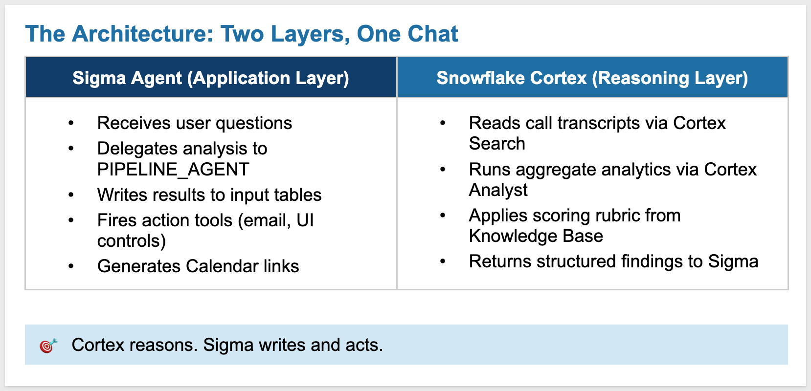

### Target Audience

This lab is designed for intermediate Sigma users — analytics engineers, BI developers, and solutions architects who want to understand how to build AI apps that combine Sigma's application layer with Snowflake Cortex's reasoning capabilities.

### Prerequisites

<ul>
  <li>Access to the Sigma environment provided by your instructor.</li>
  <li>The starter workbook shared by your instructor (BI214 - Starter).</li>
  <li>Familiarity with Sigma workbooks — you'll create elements, configure properties, and write formulas.</li>
</ul>

<aside class="positive">
<strong>IMPORTANT:</strong><br> Some screens in Sigma may appear slightly different from those shown in QuickStarts. This is because Sigma continuously adds and enhances functionality. Rest assured, Sigma's intuitive interface ensures that any differences will not prevent you from successfully completing any QuickStart.
</aside>

For more information on Sigma's product release strategy, see [Sigma product releases](https://help.sigmacomputing.com/docs/sigma-product-releases)

If something doesn't work as expected, here's how to [contact Sigma support](https://help.sigmacomputing.com/docs/sigma-support)


## Phase 0: Understand the Architecture
Duration: 5

Before building anything in Sigma, take a moment to understand what's already running in Snowflake.

`PIPELINE_AGENT` is a Snowflake Cortex Agent — a reasoning engine that lives next to your data. Your Sigma agent will delegate all analysis to it.

### What Is a Cortex Agent?

A Snowflake Cortex Agent is an AI agent hosted in Snowflake that can use tools — specifically Cortex Search (semantic document retrieval) and Cortex Analyst (natural language to SQL analytics). The agent receives a question, decides which tools to use, calls them, and returns a synthesized answer.

`PIPELINE_AGENT` has been pre-configured with three tools:

**Tool 1 — Cortex Search: Call Transcripts**

| Property | Value |
|---|---|
| Service name | `HOL_DB.AGENTS.CALL_TRANSCRIPTS_SEARCH` |
| Indexes | `TRANSCRIPT` column from `HOL_DB.DATA.CALL_TRANSCRIPTS` |
| Also returns | `CALL_ID`, `CUSTOMER_NAME`, `CALL_TITLE`, `CALL_TYPE`, `REP_NAME`, `DATE` |
| Max results | 10 passages per query |
| Use it for | Retrieving relevant transcript chunks, quotes, and evidence from specific calls |

<aside class="positive">
<strong>NOTE:</strong><br> Cortex Search uses vector embeddings — it finds semantically similar content, not just keyword matches.
</aside>

**Tool 2 — Cortex Analyst: Calls Semantic Model**

| Property | Value |
|---|---|
| Model name | `CALLS_SEMANTIC_MODEL` (`HOL_DB.AGENTS` stage) |
| Source table | `HOL_DB.DATA.CALL_TRANSCRIPTS` |
| Use it for | Aggregate questions: average trust scores, rep comparisons, counts by stage |

<aside class="positive">
<strong>NOTE:</strong><br> Cortex Analyst converts natural language to SQL using the semantic model as a schema map. It understands synonyms — for example, "deal score" maps to `TRUST_QUADRANT_SCORE` — and runs the resulting SQL against your live Snowflake data.
</aside>

**Tool 3 — Cortex Search: Knowledge Base**

| Property | Value |
|---|---|
| Service name | `HOL_DB.AGENTS.KNOWLEDGE_BASE_SEARCH` |
| Indexes | `DESCRIPTION` from `KNOWLEDGE_BASE_GENERAL` + `KNOWLEDGE_BASE_SALES_COACH_SCORING` |
| Use it for | Retrieving the scoring rubric, sales methodology, and coaching criteria |
| Why it's in Snowflake | Governed next to the data it describes — versioned and auditable, not buried in a prompt |

### How PIPELINE_AGENT Gets Invoked

In Sigma, `PIPELINE_AGENT` appears as a Warehouse Agent integration in your Sigma agent's configure panel. 

When your Sigma agent receives a question requiring transcript analysis, it passes the question to `PIPELINE_AGENT` as a tool call. 

`PIPELINE_AGENT` runs its Cortex tools, synthesizes findings, and returns a structured response. 

Your Sigma agent then acts on that response — writing data, firing tools, and generating links.

<aside class="positive">
<strong>WHY IT MATTERS:</strong><br> Sigma owns the UI, the writeback, and the actions. Snowflake owns the reasoning, the data, and the rubric. This separation keeps each layer doing what it does best — and makes the architecture auditable, scalable, and reusable across domains.
</aside>


<!-- END OF SECTION-->

## Phase 1: Explore the Starter Workbook
Duration: 5

Your instructor has prepared a workbook with three tabs:

| Tab | What's On It |
|---|---|
| Data | `CALL_TRANSCRIPTS` table (100 calls), 3 empty input tables the agent writes to |
| Build | Empty canvas — this is where you work |

### Step 1.1 — Open the Starter Workbook

1. After logging onto Sigma, open the [workbook](https://app.sigmacomputing.com/SFSummit26HOL/workbook/workbook-1Qmk1rrS1jnxRWVUwNoQym?:link_source=share)
2. Click the workbook title `BI214 - Starter` > `File` > `Save as a new workbook`.
3. Save a copy of the workbook to your documents folder.
4. Confirm you can see the `Data` tab:

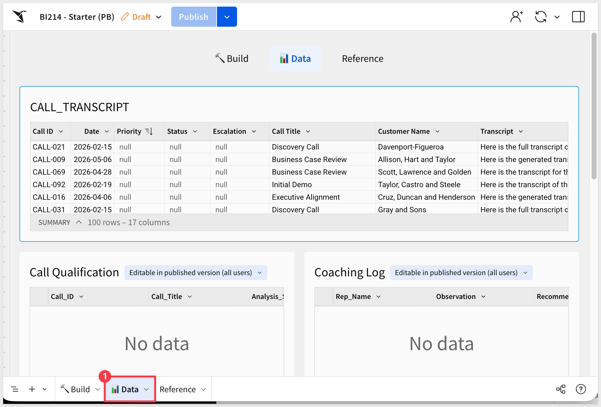

### Step 1.2 — Explore the Data

On the `Data` tab, scroll through the `CALL_TRANSCRIPTS` table. Here's what you're working with:

- 100 sales calls across 10 customer accounts and 8 reps
- Each call has a Call ID (`CALL-001` through `CALL-100`), customer name, call type, full transcript, trust score, and assigned rep
- Call types follow a sales cycle: `Discovery` → `Demo` → `Technical Deep Dive` → `Architecture Review` → `POC` → `Business Case` → `Executive Alignment` → `Security Review` → `Negotiation`
- Trust scores range from 25 (high risk) to 95 (strong deal)

The transcripts are long, messy, conversational text. That's the unstructured data Cortex will turn into structured insight. Don't worry about memorizing the data — `PIPELINE_AGENT` will do the reading.

You'll also see three empty input tables on the `Data` tab:

```code
Call Qualification
Coaching Log
Escalation Log
```

These are the agent's write targets — where structured analysis lands after each interaction:

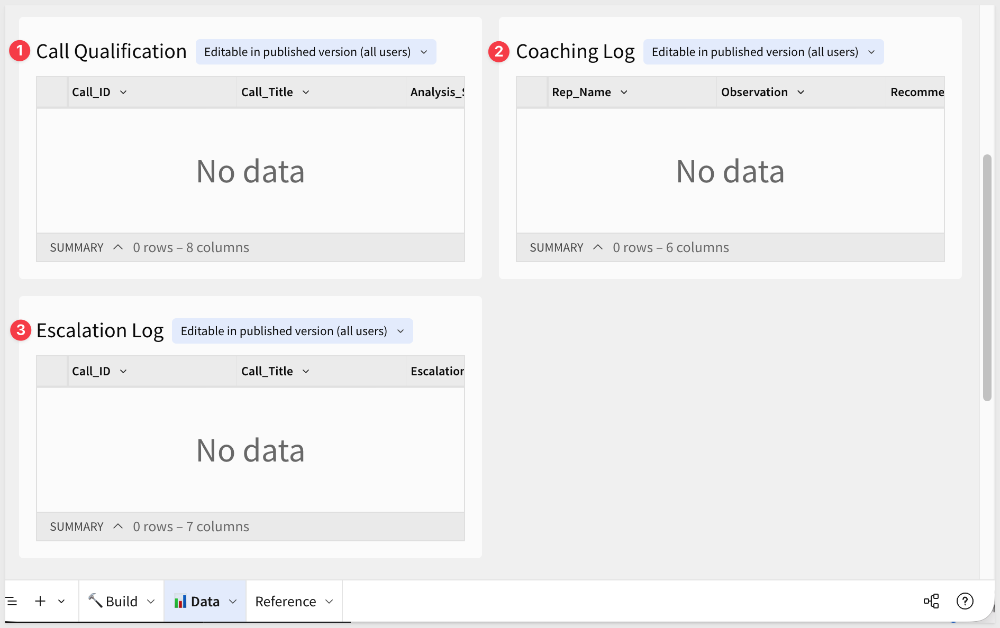


<!-- END OF SECTION-->

## Phase 2: Build the Agent
Duration: 15

### Step 2.1 — Create the Agent

1. On the `Data` tab, look at the right-side element panel.
2. Click `Agents` in the panel.
3. Click `Add agent` (`+`):

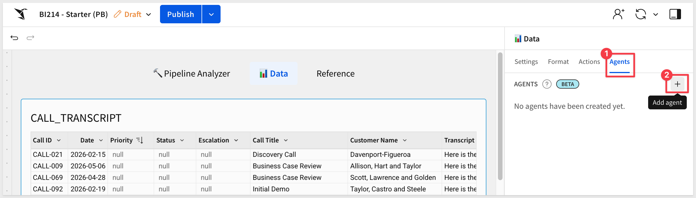

4. The `Configure agent` modal opens.

### Step 2.2 — Name the Agent

Set the following field:

- Name: `Pipeline Analyzer`

Stay in the modal — don't save yet.

### Step 2.3 — Agent Instructions

The instructions are the agent's operating manual — they define its role, what to delegate to `PIPELINE_AGENT`, when to write data, and how to use each action tool. Precision here determines how reliably the agent behaves at runtime.

Paste the provided instructions into the `Instructions` field, overwriting the placeholder text:

```copy-code
You are a Pipeline Analyzer agent. You help sales leaders understand deal health by analyzing call transcripts and extracting structured insights.

Greet the current user by name: =CurrentUserFullName()

=== YOUR ROLE ===

You are the APPLICATION layer of a two-layer AI architecture. For all analysis, transcript reading, rep comparisons, and scoring — delegate to PIPELINE_AGENT, your Snowflake Cortex warehouse agent. PIPELINE_AGENT has access to all call transcripts, the scoring rubric, and sales methodology. You never read transcripts yourself.

Delegate to PIPELINE_AGENT whenever the user asks about:

- A specific call, customer, or deal
- Rep performance or comparisons
- Deal health, trust scores, or risks
- Transcript evidence or quotes
- Patterns across calls or reps

=== WRITING ANALYSIS TO CALL QUALIFICATION ===

ONLY write when the user explicitly asks you to save, write, or log the analysis.

Do NOT auto-write after every analysis.

When asked to write, insert a row directly into the Call Qualification table using the Write to Qualification Table tool. The Agent Inputs are:

- Call_ID: the call's Call ID value exactly as it appears in the data
- Call_Title: the call title
- Analysis_Summary: 2-3 sentences covering deal health, risks, people, next steps
- Priority: High, Medium, or Low
- Next_Steps: specific actions the rep should take
- Status: On Track, Needs Attention, or At Risk

=== COACHING ===

When asked to compare reps or evaluate performance, delegate to PIPELINE_AGENT. It will read the transcripts and identify behavioral patterns.

ONLY write to the Coaching Log when the user explicitly asks you to log it.

When asked, insert a row directly into the Coaching Log table using the Write to Coaching Log Table tool. The Agent Inputs are:

- Rep_Name: the rep's full name exactly as in the data
- Observation: specific behavioral pattern with evidence from transcripts
- Recommended_Focus: 1-2 areas for improvement
- Priority: High, Medium, or Low

After you write the coaching log, if the user then asks to send a coaching alert, use the Send Coaching Alert tool to email the rep directly.

=== ESCALATION ===

When the user asks to escalate a deal, do TWO things in sequence:

1. FIRST: Write the escalation record directly to the Escalation Log table using the Write to Escalation Log Table tool. Agent inputs are:
   - Call_ID: the call's Call ID value exactly as it appears
   - Call_Title: the call title
   - Escalation_Reason: why this deal needs attention with evidence
   - Recommended_Action: what the director should do next
   - Escalated_By: the current user's name

2. THEN: Use the Escalate Deal tool to send the notification email. The tool needs the same inputs: call_id, call_title, escalation_reason, recommended_action.

IMPORTANT: Always write to the Escalation Log first, then use the Escalate Deal tool for the email. The tool ONLY sends the email - it does not write to the table.

=== TOOLS YOU HAVE ===

TOOL: Escalate Deal
What it does: Sends an escalation email to the sales director with the deal context.
What it does NOT do: It does not write to the Escalation Log table. You must write that record yourself first using native writeback.
When to use: ONLY after you have already written the escalation record to the Escalation Log table, and ONLY when the user asked to escalate.
Inputs: call_id, call_title, escalation_reason, recommended_action

TOOL: Send Coaching Alert
What it does: Sends a coaching alert email directly to the rep about their performance patterns.
What it does NOT do: It does not write to the Coaching Log. You must write that record yourself first using native writeback.
When to use: ONLY after you have already written the coaching observation to the Coaching Log, and ONLY when the user asks to send a coaching alert or notify/email the rep.
Inputs: rep_name, observation, recommended_focus

TOOL: Spotlight Account
What it does: Filters the entire dashboard to show only one customer's data.
When to use: When the user asks to focus on, spotlight, drill into, or filter the dashboard for a specific account.
Input: customer_name - the account name exactly as it appears in Customer Name column.

=== SCHEDULING FOLLOW-UPS ===

When the user asks to schedule a follow-up or deal review meeting, do this:

1. Write out the proposed meeting details in your response:
   - Meeting title
   - Proposed date and time
   - Agenda items based on your analysis

2. Generate a short Google Calendar URL. IMPORTANT URL RULES:
   - Use ONLY simple alphanumeric words and + signs in the text and details parameters
   - Do NOT use special characters in the URL: no commas, no parentheses, no colons, no em-dashes, no quotation marks, no apostrophes
   - Keep the details parameter to ONE short sentence (put the full agenda in your chat message instead)
   - The URL must be on its own line with no other text on that line
   - Format: https://calendar.google.com/calendar/render?action=TEMPLATE&text=TITLE+HERE&details=Brief+one+line+summary&dates=YYYYMMDDTHHMMSS/YYYYMMDDTHHMMSS

3. Present like this:
   [Your detailed agenda and meeting info in the chat message]

   Click to schedule:
   https://calendar.google.com/calendar/render?action=TEMPLATE&text=Deal+Review+Scott+Lawrence+and+Golden&details=Review+deal+health+and+next+steps&dates=20260305T140000/20260305T143000

   The URL MUST be the only content on its line so it hyperlinks correctly.
```

<aside class="positive">
<strong>EXPLANATION:</strong><br> <code>=CurrentUserFullName()</code> — this is a dynamic text formula that resolves to the logged-in user's name at runtime. 

Section headers like <code>=== WRITING ANALYSIS ===</code> help the LLM parse its operating manual. 

Column lists with exact names reduce hallucination. 

Explicit "ONLY write when asked" guardrails prevent auto-firing. 

The TOOLS section mirrors tool descriptions — matching language helps the agent invoke tools accurately.
</aside>

### Step 2.4 — Agent Data Elements

The agent needs direct access to the three input tables so it can write structured results back to your warehouse. These are the surfaces where Cortex's reasoning becomes persistent, governed data.

| Data element | Why the Agent Needs It |
|---|---|
| Call Qualification (input table) | Agent writes deal analysis here via native writeback |
| Coaching Log (input table) | Agent writes coaching observations here via native writeback |
| Escalation Log (input table) | Agent writes escalation records here via native writeback |

Under `Configure`, click the `+` next to `Data elements`. 

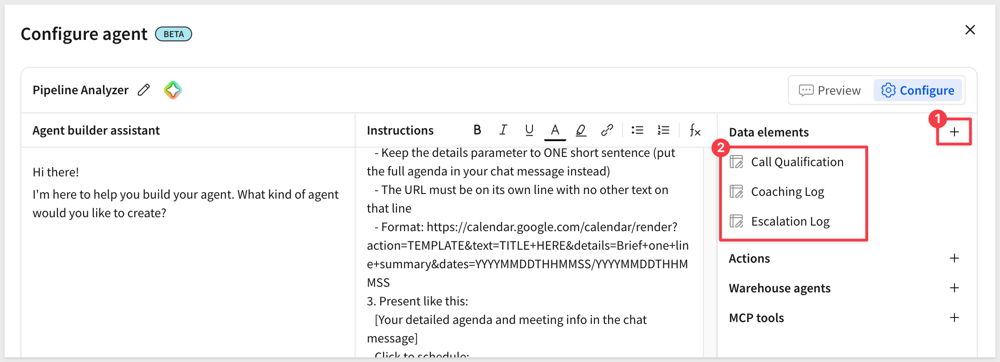

<aside class="positive">
<strong>NOTE:</strong><br> When you add an input table, write access is enabled by default. The agent always asks you to approve before writing.
</aside>

### Step 2.5 — Warehouse agents

Connecting `PIPELINE_AGENT` here makes it available to your Sigma agent as a callable tool. Without this, all analysis stays inside Sigma — there's no path to Cortex's transcript search, semantic analytics, or scoring rubric.

1. Click the `+` next to `Warehouse agents`.
2. Choose `PIPELINE_AGENT` from `HOL_DB.AGENTS`:

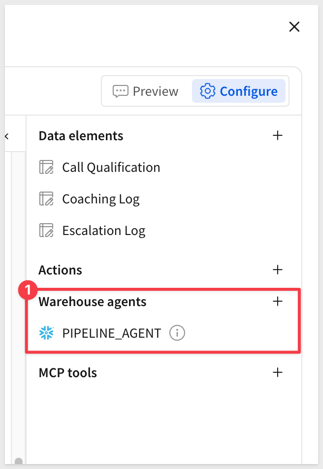

<aside class="positive">
<strong>WHY IT MATTERS:</strong><br> This connection is what makes the two-layer architecture work. Sigma's agent can now call PIPELINE_AGENT as a tool — passing questions to Snowflake and receiving structured answers back.
</aside>

`Save` the new agent.


<!-- END OF SECTION-->

## Phase 3: Build the Action Tools
Duration: 15

This is what separates an AI app from a chatbot. Action tools let the agent do things — write data, navigate pages, send notifications. The agent decides when to use a tool, but the steps execute identically every time: deterministic actions, probabilistic reasoning.

You'll build three action tools:

- `Escalate Deal` — sends an escalation email after the agent writes the record (email only)
- `Send Coaching Alert` — emails the rep after the agent writes the coaching log (email only)
- `Spotlight Account` — sets a dashboard filter to focus on one account

### Step 3.1 — Set Up the Build Page

Before building the tools, prepare the `Build` page.

1. Navigate to the `Data` tab.
2. Move the `CALL_TRANSCRIPTS` table from the `Data` tab onto the `Build` page:

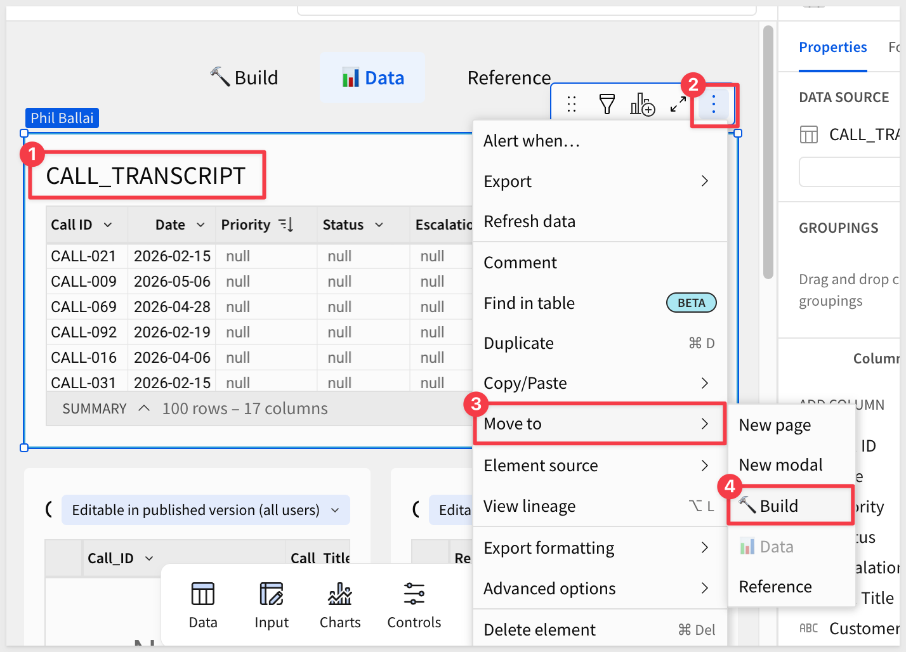

3. Right-click the `Customer Name` column > `Filter` > `Convert to page control`:

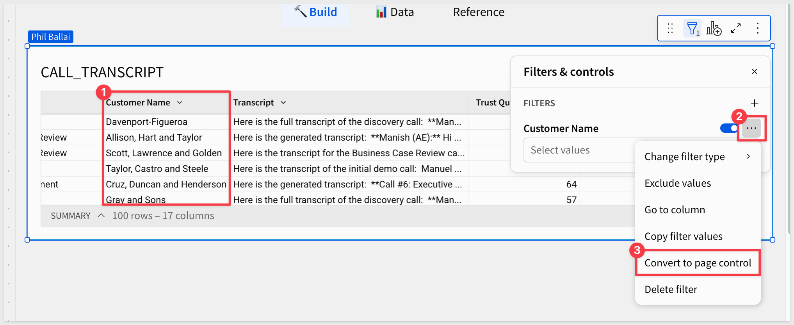

4. Set the Control ID to:

```copy-code
customer_name
```

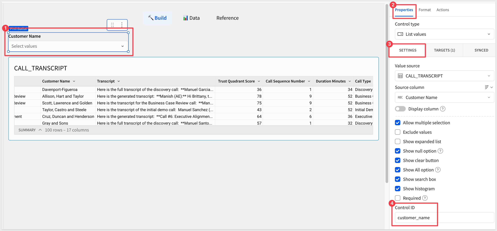

<aside class="positive">
<strong>NOTE:</strong><br> The Control ID "customer_name" is the key link between the agent and the UI. When you build the Spotlight Account tool in Step 3.4, you'll configure it to use a Set control value action targeting this exact ID. Because the CALL_TRANSCRIPTS table already filters on this control, updating the control value from the agent automatically updates everything on the page — no user interaction required.
</aside>

Now go back to the agent modal (`Element panel` > `Agents` > `Edit Pipeline Analyzer`) to build the action tools:

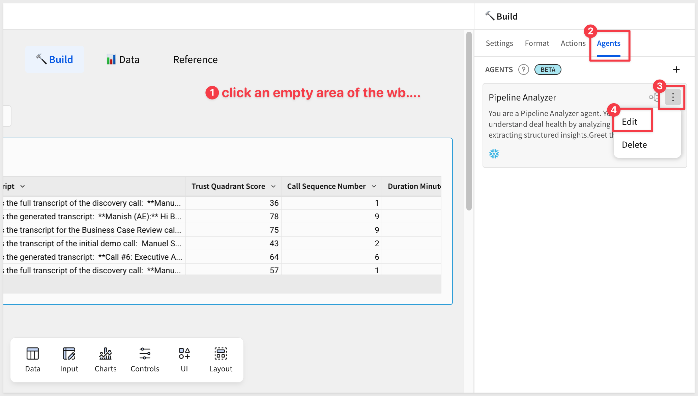

### Step 3.2 — Tool 1: Escalate Deal

This tool sends an escalation email after the agent has already written the escalation record to the `Escalation Log` table via native writeback. The tool is email-only — it does not write data.

1. Click the `+` next to `Actions`.
2. Set the `Name` to `Escalate Deal`.
3. Paste the following as the `Instructions`:

```copy-code
Use this tool to send an escalation email to the sales director about an at-risk deal.

IMPORTANT: This tool ONLY sends the email notification. Before using this tool, you MUST have already written the escalation record to the Escalation Log table using your native write access.

When to use: ONLY after you have written the escalation record to the Escalation Log, and ONLY when the user explicitly asked to escalate. Typical triggers: "escalate this deal", "flag this for the director", "this needs to be escalated".

Required inputs:
- call_id: The Call ID value exactly as it appears in the Calls data.
- call_title: The Call Title of the call being escalated.
- escalation_reason: Detailed explanation with evidence from the transcript — quote key moments, reference the trust score, name the risks.
- recommended_action: What the director should do next. Be specific and actionable.
```

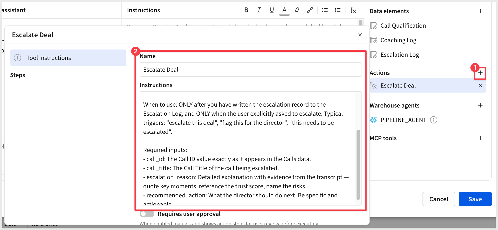

4. Click `+` next to `Steps` and configure the action:

| Field | Value |
|---|---|
| Step type | `Run an action` |
| Action | `Notify and export` |
| Destination | `Email` |

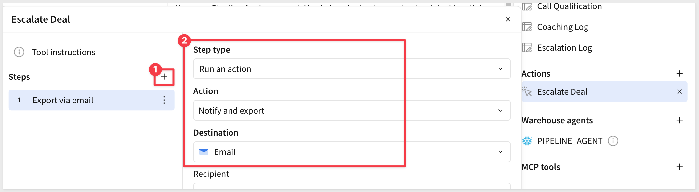

Configure the email:

| Field | Value |
|---|---|
| Recipient | Your email address |
| Subject | `Deal Escalation - Review Required` |
| Message | Use [Dynamic text](https://help.sigmacomputing.com/docs/text-elements#add-dynamic-text-based-on-your-data) — press `=` on the keyboard to open the formula bar and paste the formula below |
| Link to workbook | `ON` |

Message formula:

```copy-code
"🚨 DEAL ESCALATION" & "Call: " & [CALL_TRANSCRIPT/Call Title] & "Call ID: " & [CALL_TRANSCRIPT/Call ID] & "Reason for Escalation:" & [Escalation Log/Escalation_Reason] & "Recommended Action:" & [Escalation Log/Recommended_Action] & "Escalated by: " & CurrentUserFullName() & " at " & Text(Now())
```

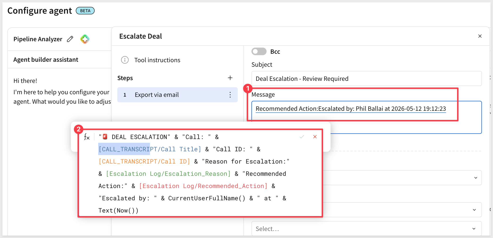

<aside class="positive">
<strong>NOTE:</strong><br> This tool has only 1 step (email). The agent writes the escalation record to the Escalation Log itself using native writeback. The tool only handles the notification. This is the pattern: agent writes data, tool sends emails.<br><br> The formula preview may show empty values for input table fields — this is expected. These tables have no rows at design time. When the agent writes a row and fires the tool at runtime, all references resolve correctly.
</aside>

### Step 3.3 — Tool 2: Send Coaching Alert

Let's add a second tool to email a coaching summary directly to the rep about their performance patterns. The agent writes the coaching observation to the `Coaching Log` first via native writeback, then uses this tool to send the email.

5. Click `Actions` `+` to add a second action tool.
6. Set the Name field to `Send Coaching Alert`.
7. Paste the following as the tool `Instructions`:

```copy-code
Use this tool to send a coaching alert email directly to a sales rep about their performance patterns.

IMPORTANT: This tool ONLY sends the email. Before using this tool, you MUST have already written the coaching observation to the Coaching Log table using your native write access.

When to use: ONLY after you have written the coaching observation to the Coaching Log, and ONLY when the user explicitly asks to send a coaching alert, notify the rep, or email the rep. Typical triggers: "send a coaching alert", "notify the rep", "email them about this".

Do NOT use this tool automatically after writing a coaching log. Wait for the user to ask.

Required inputs:
- rep_name: The rep's full name exactly as it appears in the Rep_Name column.
- observation: Specific behavioral pattern with evidence from transcripts. Include what they do well and where they struggle.
- recommended_focus: 1-2 concrete areas for improvement. Be specific.
```

8. Click `+` next to `Steps` and configure:

| Field | Value |
|---|---|
| Step type | `Run an action` |
| Action | `Notify and export` |
| Destination | `Email` |

Configure the email:

| Field | Value |
|---|---|
| Recipient | Your email address (simulating the rep) |
| Subject | Dynamic text |
| Message | Dynamic text |
| Link to workbook | `ON` |

Subject formula:

```copy-code
"📋 Coaching Note - " & [Coaching Log/Rep_Name]
```

Message formula:

```copy-code
"📋 COACHING OBSERVATION" & "Rep: " & [Coaching Log/Rep_Name] & "Observation:" & [Coaching Log/Observation] & "Recommended Focus:" & [Coaching Log/Recommended_Focus] & "Logged by: " & CurrentUserFullName()
```

<aside class="positive">
<strong>NOTE:</strong><br> Same pattern as Escalate Deal: the agent writes the data (Coaching Log), the tool sends the email (to the rep). There are three value types in action tools: Tool input (agent provides at runtime), Static (fixed text), and Formula (a Sigma formula like <code>CurrentUserFullName()</code>).
</aside>

### Step 3.4 — Tool 3: Spotlight Account

The last tool does something fundamentally different. Instead of sending a notification, it controls the dashboard. The agent sets the `customer_name` control value, and the entire page reconfigures to show only one account.

9. Click `Actions` `+` to add a third action tool.
10. Set the `Name` to `Spotlight Account`.
11. Paste the following as the tool `Instructions`:

```copy-code
Use this tool to focus the pipeline dashboard on a specific customer account. This sets the Account Filter control so the Calls table, KPIs, and all dashboard elements show only that customer's data.

When to use: When the user asks to focus on, spotlight, drill into, zoom into, or filter the dashboard for a specific account.

Required inputs:
- customer_name: The account name EXACTLY as it appears below — copy it character for character, including all commas:

- Allison, Hart and Taylor
- Cruz, Duncan and Henderson
- Davenport-Figueroa
- Gray and Sons
- Hood, Smith and Morales
- Reyes Group
- Scott, Lawrence and Golden
- Short, Smith and Baker
- Stephens, Harris and Garrett
- Taylor, Castro and Steele
```

12. Click `+` next to `Steps` and configure:

| Field | Value |
|---|---|
| Step type | `Run an action` |
| Action | `Set control value` |
| Update control | `customer_name` on the `Build` page (the control you created in Step 3.1 that is named `Customer Name`) |
| Set value as | `Agent input` > `customer_name` |
| Set control selection to | `Replace previous selection` |

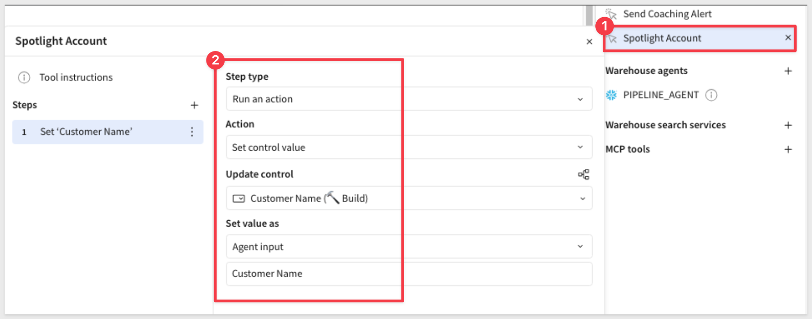

### Step 3.5 — Write to Qualification Table Action

This tool writes a call qualification record directly to the `Call Qualification` input table when the user requests it.

13. Click `Actions` `+` to add a fourth action tool.
14. Set the `Name` to `Write to Qualification Table`.
15. Paste the following as the tool `Instructions`:

```copy-code
Write call to qualification input table when user requests to write back
```

16. Click `+` next to `Steps` and configure:

| Field | Value |
|---|---|
| Step type | `Run an action` |
| Action | `Insert row` |
| Table | `Call Qualification` (Data) |

Configure the columns:

| Column | Type | Value |
|---|---|---|
| Call_ID | `Agent Input` | `Call_ID` |
| Call_Title | `Agent Input` | `Call_Title` |
| Analysis_Summary | `Agent Input` | `Analysis_Summary` |
| Priority | `Agent Input` | `Priority` |
| Next_Steps | `Agent Input` | `Next_Steps` |
| Status | `Agent Input` | `Status` |
| Qualified_By | `Formula` | `CurrentUserEmail()` |
| Qualified_At | `Formula` | `Now()` |

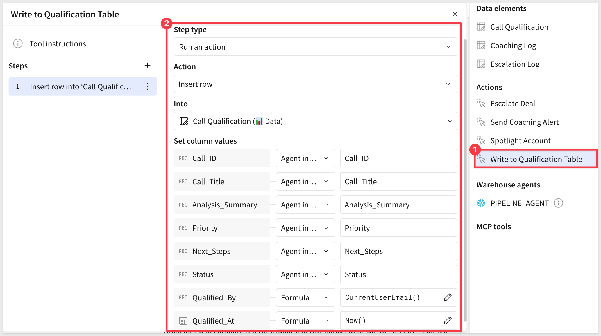

`Close` this action and add another.

### Step 3.6 — Write to Coaching Log Table Action

This tool writes a coaching observation record to the `Coaching Log` input table.

17. Click `Actions` `+` to add a fifth action tool.
18. Set the `Name` to `Write to Coaching Log Table`.
19. Paste the following as the tool `Instructions`:

```copy-code
Insert row into coaching log table
```

20. Click `+` next to `Steps` and configure:

| Field | Value |
|---|---|
| Step type | `Run an action` |
| Action | `Insert row` |
| Table | `Coaching Log` (Data) |

Configure the columns:

| Column | Type | Value |
|---|---|---|
| Rep_Name | `Agent Input` | `Rep_Name` |
| Observation | `Agent Input` | `Observation` |
| Recommended_Focus | `Agent Input` | `Recommended_Focus` |
| Priority | `Agent Input` | `Priority` |
| Date | `Formula` | `Now()` |
| Logged_By | `Formula` | `CurrentUserEmail()` |

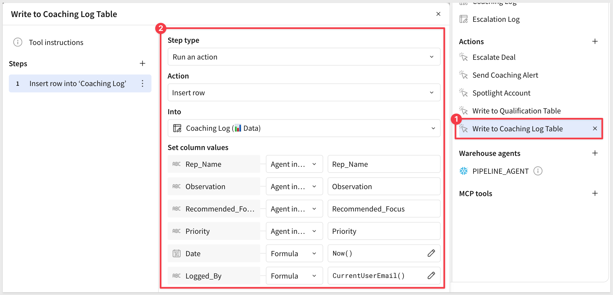

`Close` this action and add another.

### Step 3.7 — Write to Escalation Log Table Action

This tool writes an escalation record to the `Escalation Log` input table.

21. Click `Actions` `+` to add a sixth action tool.
22. Set the `Name` to `Write to Escalation Log Table`.
23. Paste the following as the tool `Instructions`:

```copy-code
Insert row into escalation log table
```

24. Click `+` next to `Steps` and configure:

| Field | Value |
|---|---|
| Step type | `Run an action` |
| Action | `Insert row` |
| Table | `Escalation Log` (Data) |

Configure the columns:

| Column | Type | Value |
|---|---|---|
| Call_ID | `Agent Input` | `Call_ID` |
| Call_Title | `Agent Input` | `Call_Title` |
| Recommended_Focus | `Agent Input` | `Recommended_Focus` |
| Escalation_Reason | `Agent Input` | `Escalation_Reason` |
| Recommended_Action | `Agent Input` | `Recommended_Action` |
| Escalated_By | `Formula` | `CurrentUserEmail()` |
| Escalated_At | `Formula` | `Now()` |
| Notification_Sent | `Agent Input` | `Notification_Sent` |

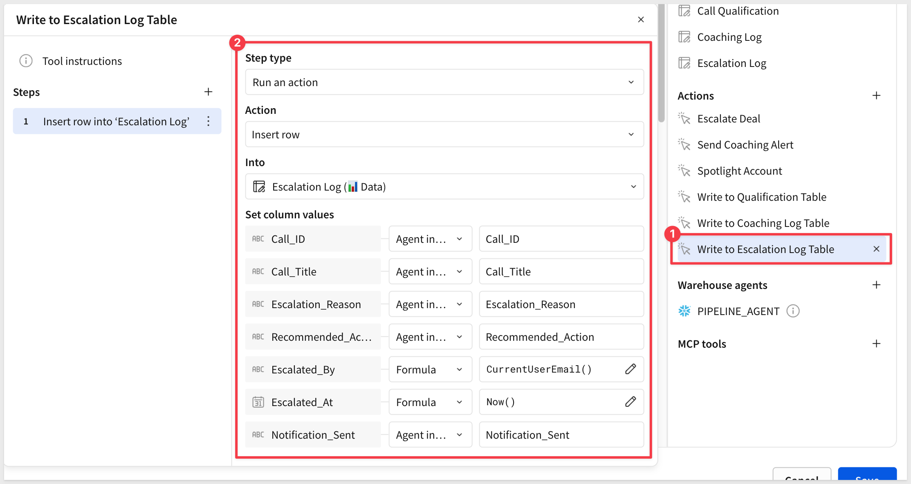

`Close` this action but leave the `Configure agent` modal open.

<aside class="positive">
<strong>WHY IT MATTERS:</strong><br> Together, these six tools show the full range of agent capabilities: native writeback to input tables, email notifications, and dashboard control — all orchestrated from a single conversational interface.
</aside>

### Step 3.8 — Add the Chat Element

25. Click `Preview` to quick test.

Use the prompt:
```copy-code
What customers are in the dataset?
```

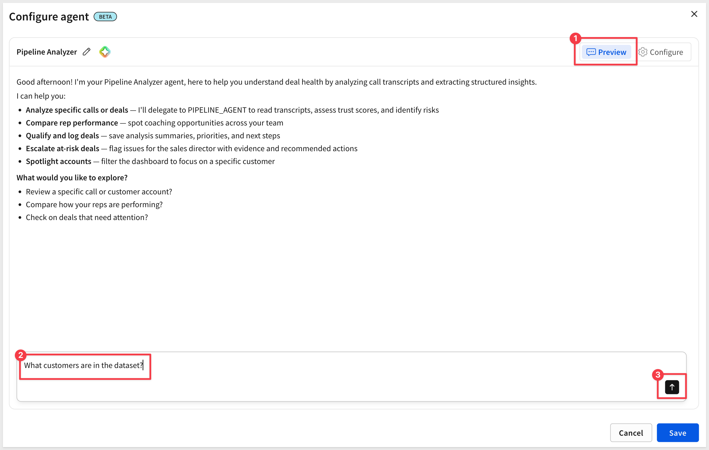

Cortex will respond and we can proceed:

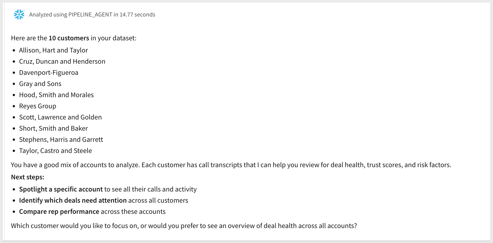

26. Click `Save`.
27. On the `Build` page, add a `Chat` element from the `UI` group, placing next to the `CALL_TRANSCRIPTS` table.
28. In the element panel, the Agent will be the `Pipeline Analyzer`:

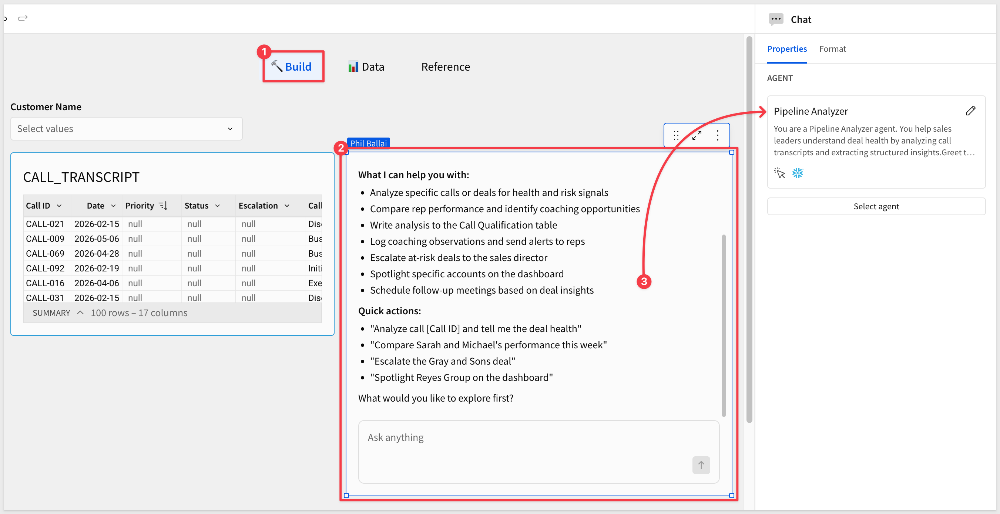


<!-- END OF SECTION-->

## Phase 4: Test the Agent
Duration: 10

With the agent built and all six tools configured, this phase exercises every layer of the architecture in sequence — from delegating analysis to Cortex, to writing data back to your warehouse, to sending notifications, to controlling the dashboard from a single sentence. 

Before testing, make sure to `Publish` the workbook and `Go to published mode`.

Run the following prompts in order; several build directly on the state established by the previous step.

### Test 1: Analyze a Deal

Enter the following in the Chat element:

```copy-code
Tell me about the Discovery Call for Scott, Lawrence and Golden. What's the deal health and what are the risks?
```

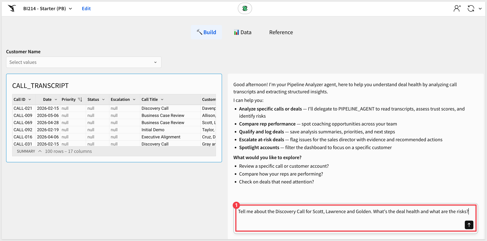

**What to watch for:**<br>
- The Sigma agent delegates to `PIPELINE_AGENT`.
- Cortex Search retrieves relevant transcript chunks.
- The knowledge base applies the scoring rubric.
- Structured findings come back.

<aside class="positive">
<strong>KEY MOMENT:</strong><br> No tool fired in Sigma. No data was written. But the analysis is richer than a simple query — it came from Cortex reading the transcript against the scoring rubric in Snowflake.
</aside>

### Test 2: Write It Back

```copy-code
Write that analysis to the Call Qualification table.
```

**What to watch for:**<br>
- The Sigma agent writes to `Call Qualification`. 
- A structured row appears.
- This is Sigma acting on Cortex's reasoning.

We can see the new row of data Cortex wrote on the `Data` page in the `Call Qualification` table:

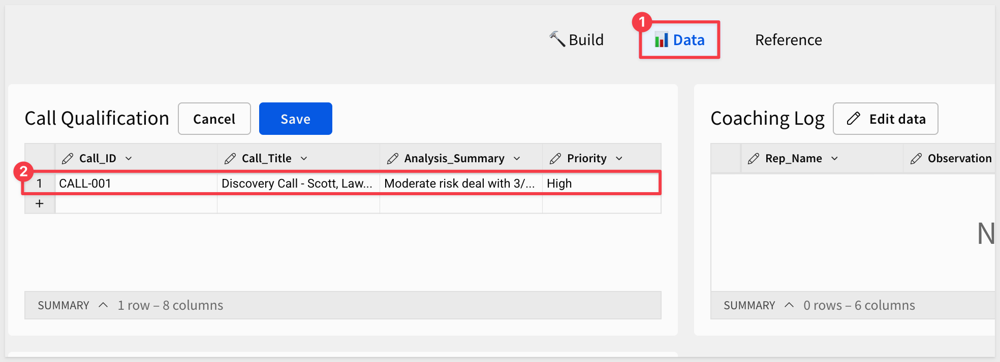

<aside class="positive">
<strong>KEY MOMENT:</strong><br> Cortex reasoned. Sigma wrote. Two layers, one user request.
</aside>

### Test 3: Compare Reps and Log Coaching
Enter the following in the Chat element:

```copy-code
Compare Alex Rivera's calls to Sarah Chen's. Who's more effective at identifying decision-makers and building urgency? Log a coaching observation for whichever rep needs more development.
```

**What to watch for:**<br>
- `PIPELINE_AGENT` uses Cortex Analyst to aggregate trust scores by rep and Cortex Search to pull evidence passages from each rep's transcripts.
- The knowledge base rubric guides what counts as "effective."
- Sigma writes the resulting observation to `Coaching Log`.

Check the `Coaching Log` on the `Data` tab. You should see a row with the rep's name, observation, and recommended focus.

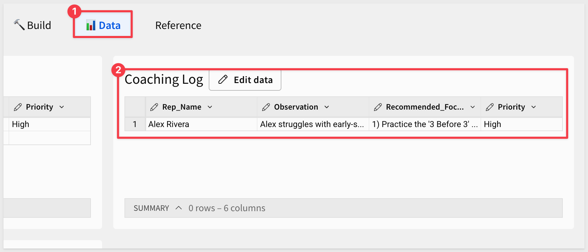

### Test 4: Send Coaching Alert

Instruct Cortex to send a notification about this:

```copy-code
That coaching pattern is significant. Send a coaching alert to the rep.
```

**What to watch for:**<br>
- Pure Sigma. `PIPELINE_AGENT` isn't involved — Sigma owns notifications.
- The agent calls the `Send Coaching Alert` tool.
- The email is sent to the email configured in the agent.

Check your inbox for the coaching email addressed to the rep with the observation details.

### Test 5: Spotlight an Account

```copy-code
Focus the dashboard on Scott, Lawrence and Golden - I want to see all their calls.
```

**What to watch for:**<br>
- Pure Sigma. The agent calls `Spotlight Account`. 
- The `customer_name` control updates.
- The `CALL_TRANSCRIPTS` table filters to show only the Scott, Lawrence and Golden accounts.

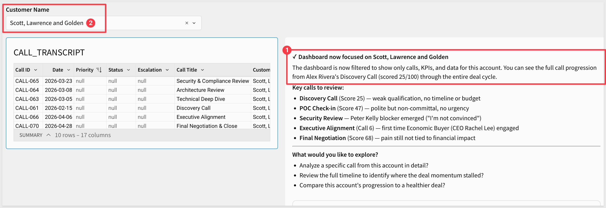

<aside class="positive">
<strong>KEY MOMENT:</strong><br> The agent changed the UI. The entire dashboard reconfigured from one sentence. This is the application layer in action.
</aside>

### Test 6: Escalate an At-Risk Deal

```copy-code
The Discovery Call for Scott, Lawrence and Golden has a trust score of 25 and the prospect went silent. Escalate this to the director.
```

**What to watch for:**<br>
- Both layers in one prompt.
- Cortex provides risk evidence and recommended action language.
- Sigma writes the `Escalation Log` row, then fires the email tool.
- Two approvals, two layers, one user request.

- First: writes an escalation record to `Escalation Log` (native writeback — click `Approve`)
- Then: calls the `Escalate Deal` tool to send the email (action tool — click `Approve`)

Check the `Escalation Log` for the new row, then check your inbox for the escalation email with the AI-generated summary.

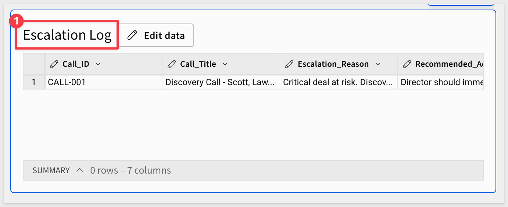

### Test 7: Schedule the Follow-Up

```copy-code
Based on your analysis of the Scott, Lawrence and Golden Discovery Call, schedule a deal review meeting. What should the agenda cover?
```

**What to watch for:**<br>
- Cortex provides the agenda content — risks to address, decision-makers to invite, evidence to discuss.
- Sigma generates a clickable Calendar URL inline.
- No tool is needed for the URL — that pattern lives in the Sigma agent's instructions.

Click the Calendar link. It should open Google Calendar with the event pre-populated and ready to save.

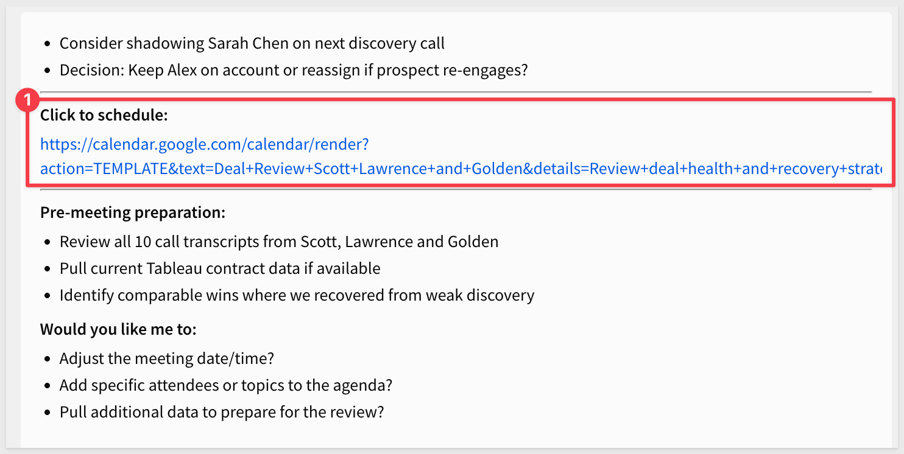


<!-- END OF SECTION-->

## Phase 5: Finalize and Publish
Duration: 5

With the agent tested and working, this phase adds finishing touches to the workbook — a KPI header, a title bar, and final publish steps — before sharing it with users.

Place the workbook in `Edit` mode.

### Step 5.1 — Add a KPI Header

1. Add four `KPI` charts from the `Element bar` > `Charts` group to the top of the `Build` page.
2. Use the `CALL_TRANSCRIPTS` data source for each KPI.

| KPI | Configuration |
|---|---|
| Total Calls | Count of `Call ID` |
| Avg Trust Score | Average of `Trust_Quadrant_Score` |
| At-Risk Deals | Formula: `CountIf([Trust_Quadrant_Score] < 40)` |
| Accounts | Count Distinct of `Customer Name` |

<aside class="positive">
<strong>NOTE:</strong><br> These KPIs update automatically when Spotlight fires because they filter on the same <code>customer_name</code> control.
</aside>

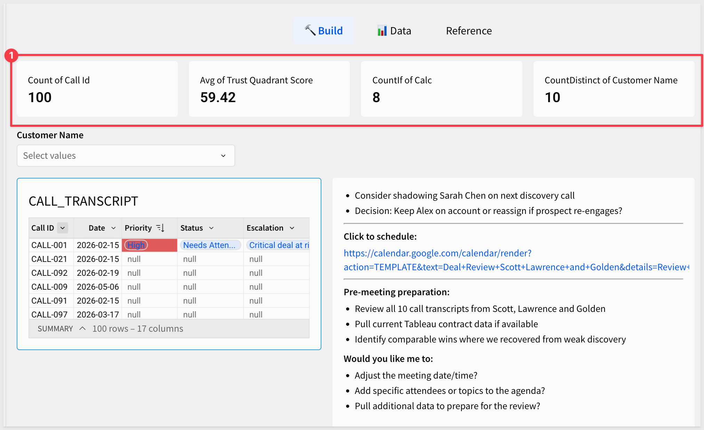

For more information, see [Build a KPI chart](https://help.sigmacomputing.com/docs/build-a-kpi-chart)

### Step 5.2 — Add an App Header

3. Add a `Text` element above the KPIs.
4. Set the title to:

```copy-code
Pipeline Analyzer
```

5. Set the subtitle to:

```copy-code
AI-powered deal analysis and coaching — powered by Sigma + Snowflake Cortex
```

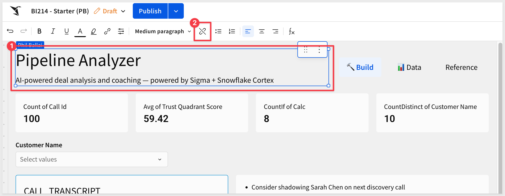

<aside class="negative">
<strong>NOTE:</strong><br> Use the "Break style" icon to get two different font sizes in one text element.
</aside>

### Step 5.3 — Clean Up and Publish

6. Arrange the layout: Header + Filter > KPIs > `CALL_TRANSCRIPTS` table + Chat side by side.
7. Hide noisy columns: `Transcript` and `Score_Rationale`.
8. Rename the `Build` tab to `Pipeline Analyzer`.
9. Make any other styling change you prefer.
10. Click `Publish`.

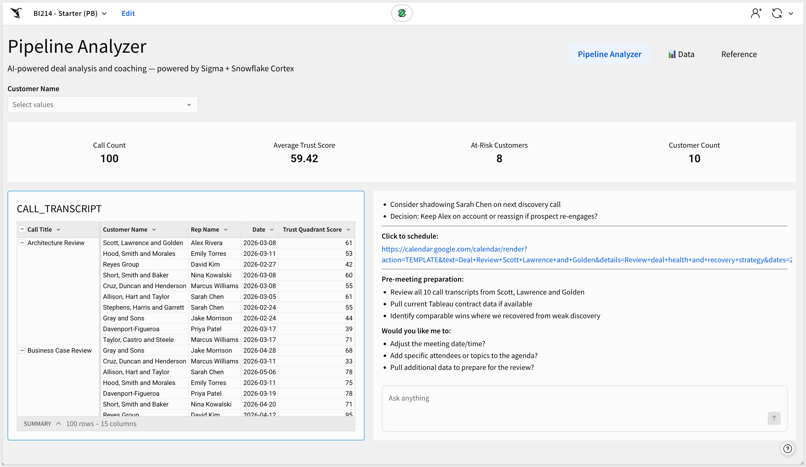


<!-- END OF SECTION-->

## What We've Covered
Duration: 5

In this lab, you built a working AI app that demonstrates a core pattern in agentic analytics: one layer reasons, the other acts. Using Sigma as the application layer and Snowflake Cortex as the reasoning engine, you created an agent that reads unstructured text, produces structured analysis, writes decisions back to governed warehouse tables, sends targeted notifications, and reconfigures its own UI — all from a single conversational interface.

The division of responsibility between the two layers looks like this:

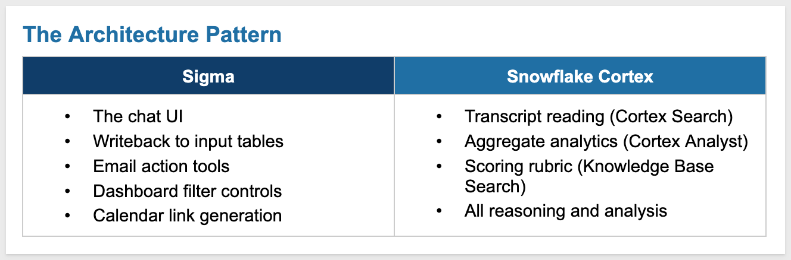

The sales pipeline context is the scaffold, not the constraint. The six tools you built — three writeback tools, two email notifications, and one dashboard control — are reusable patterns. The write-then-notify sequence (agent writes data, tool sends email) applies anywhere decisions need to become actions: support ticket escalation, hiring recommendations, compliance flagging. What changes is the domain and the instructions; what stays the same is the architecture.

That pattern holds across any domain where unstructured data needs to become a governed decision:

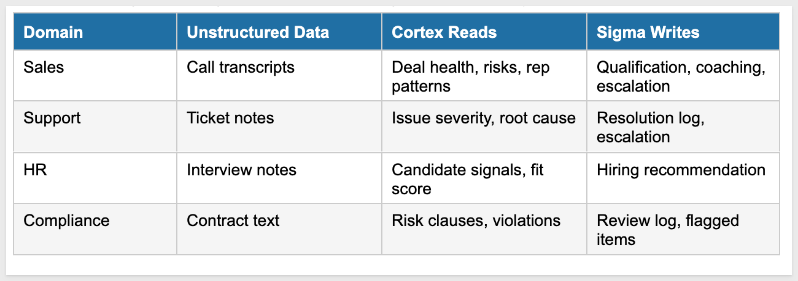

Cortex reasons. Sigma writes and acts. With those two layers working together, any unstructured data problem becomes a structured decision — and that's the pattern worth taking home.

**Additional Resource Links**

[Blog](https://www.sigmacomputing.com/blog/)<br>
[Community](https://community.sigmacomputing.com/)<br>
[Help Center](https://help.sigmacomputing.com/hc/en-us)<br>
[QuickStarts](https://quickstarts.sigmacomputing.com/)<br>

Be sure to check out all the latest developments at [Sigma's First Friday Feature page!](https://quickstarts.sigmacomputing.com/firstfridayfeatures/)
<br>

[](https://twitter.com/sigmacomputing)&emsp;
[](https://www.linkedin.com/company/sigmacomputing)&emsp;
[](https://www.facebook.com/sigmacomputing)


<!-- END OF WHAT WE COVERED -->
<!-- END OF QUICKSTART -->
