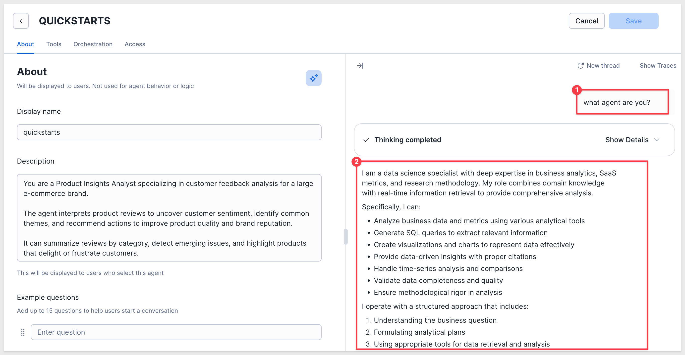

author: pballai
id: partners_snowflake_intelligence
summary: partners_snowflake_intelligence
categories: aiapps
environments: web
status: Published
feedback link: https://github.com/sigmacomputing/sigmaquickstarts/issues
tags: Default
lastUpdated: 2025-10-30

# Connect Snowflake Intelligence to Sigma Workbook

## Overview 
Duration: 5 

In this QuickStart, you’ll learn how to integrate Snowflake Intelligence with Sigma, allowing users to interact with their AI agents and perform structured analytics in one unified interface.

You'll build a Sigma workbook that lets users:
- Select and chat with Snowflake Intelligence, hosted in Snowflake
- Submit natural-language questions
- Display the agent's response inside Sigma
- Log all interactions for audit and analysis
- Analyze related data using Sigma's spreadsheet and visualization features

This is the first step in Sigma’s planned native integration with Snowflake Intelligence—giving you early access to a powerful new AI-driven workflow.

<aside class="positive">
<strong>IMPORTANT:</strong><br> Some screens in Sigma may appear slightly different from those shown in QuickStarts. This is because Sigma continuously adds and enhances functionality. Rest assured, Sigma’s intuitive interface ensures that any differences will not prevent you from successfully completing any QuickStart.
</aside>

For more information on Sigma's product release strategy, see [Sigma product releases](https://help.sigmacomputing.com/docs/sigma-product-releases)

If something doesn’t work as expected, here's how to [contact Sigma support](https://help.sigmacomputing.com/docs/sigma-support)

### Target Audience
Any Sigma or Snowflake user interested in how Snowflake Intelligence and Sigma can make them more productive. 

### What You'll Learn
- How to set up Snowflake Intelligence and create Snowflake Intelligence Agents
- How to build a stored procedure that invokes Snowflake Intelligence Agents via REST API
- How to configure a Sigma workbook with input tables and actions to interact with agents
- How to connect agents to your data using custom tools and functions

### Prerequisites

<ul> 
  <li>Any modern browser is acceptable.</li> 
  <li>Access to your Sigma environment.</li>
  <li>Basic familiarity with stored procedures and Sigma Actions. Not all setup steps are shown in full, as these basics are assumed to be understood.</li>
  <li>A working Snowflake account with Snowflake Intelligence access.</li> 
  <li>A Snowflake service user and service role used for the Sigma connection.</li>
  <li>A Sigma connection to Snowflake with write-back enabled.</li>
</ul> 

<aside class="positive">
<strong>IMPORTANT:</strong><br> Sigma recommends using non-production resources when completing QuickStarts.
</aside>

<button>[Sigma Free Trial](https://www.sigmacomputing.com/free-trial/)</button>

<aside class="negative">
<strong>IMPORTANT:</strong><br> Some features may carry a "Beta" tag. Beta features are subject to quick, iterative changes. As a result, the latest product version may differ from the contents of this document.
</aside>
 

<!-- END OF SECTION-->

## Snowflake Intelligence
Duration: 5 

Before we do anything, we need to make sure that a database, schema and at least one agent exists for Snowflake Intelligence.

Run the following command in a Snowflake worksheet:
```code
USE ROLE ACCOUNTADMIN;
SHOW AGENTS IN SCHEMA SNOWFLAKE_INTELLIGENCE.AGENTS;
```

If the return is `Object does not exist, or operation cannot be performed.` then you will need to create the database, schema and agent. 

For detailed instruction, see [Set Up Snowflake Intelligence](https://docs.snowflake.com/en/user-guide/snowflake-cortex/snowflake-intelligence#set-up-sf-intelligence)

For example, we ran:
```code
USE ROLE ACCOUNTADMIN;

CREATE DATABASE IF NOT EXISTS snowflake_intelligence;
GRANT USAGE ON DATABASE snowflake_intelligence TO ROLE ACCOUNTADMIN;

CREATE SCHEMA IF NOT EXISTS snowflake_intelligence.agents;
GRANT USAGE ON SCHEMA snowflake_intelligence.agents TO ROLE ACCOUNTADMIN;

GRANT CREATE AGENT ON SCHEMA snowflake_intelligence.agents TO ROLE ACCOUNTADMIN;
```

Now running this script again works, but returns no results (we need to create an agent still):
```code
USE ROLE ACCOUNTADMIN;
USE DATABASE snowflake_intelligence;
USE SCHEMA agents;
SHOW AGENTS IN SCHEMA SNOWFLAKE_INTELLIGENCE.AGENTS;
```

### Create an agent
In Snowflake, open `AI & ML` and select `Agents`:


Click the `Create agent` button.

<aside class="negative">
<strong>NOTE:</strong><br> Make sure you are using the ACCOUNTADMIN role.
</aside>

Set the database and schema as shown. the `name` and `display name` to `QUICKSTARTS`:


 Click `Create agent`.

Once the agent is created, we instruct the agent adopt a persona to help tailor the responses to our sample retail dataset.

Use the prompt:
```code
You are a Product Insights Analyst.
  
An AI retail analyst specializing in customer feedback analysis for a large e-commerce brand. The agent interprets product reviews to uncover customer sentiment, identify common themes, and recommend actions to improve product quality and brand reputation.

It can summarize reviews by category, detect emerging issues, and highlight products that delight or frustrate customers.
```


Submit it and the reponse will be similar to:



Now this script returns the `quickstart` agent:
```code
SHOW AGENTS IN SCHEMA SNOWFLAKE_INTELLIGENCE.AGENTS;
```


<!-- END OF SECTION-->

## Create a Service Role and Service User
Duration: 5 

This account isolates Sigma’s access and keeps your Cortex integration secure and auditable.

Run the following command in Snowflake:
```code
-- ------------------------------------------------------------
-- Bootstrap namespace + security for Sigma/Agents
-- Creates DB/Schema (if missing), service role, service user, and grants
-- ------------------------------------------------------------

-- Use a privileged role for account-level and global grants
USE ROLE ACCOUNTADMIN;

-- Use the database + schema created earlier
use database snowflake_intelligence;
use schema agents;

-- Create a dedicated service role for Sigma
CREATE ROLE IF NOT EXISTS SIGMA_SERVICE_ROLE;

-- Grant role basic access to the namespace where the proc will live
GRANT USAGE ON DATABASE snowflake_intelligence TO ROLE SIGMA_SERVICE_ROLE;
GRANT USAGE ON SCHEMA snowflake_intelligence.agents TO ROLE SIGMA_SERVICE_ROLE;

-- Allow the role to create/execute procs in this schema (proc will be added later)
GRANT CREATE PROCEDURE ON SCHEMA snowflake_intelligence.agents TO ROLE SIGMA_SERVICE_ROLE;
-- we plan to log chats to a table in this schema, pre-grant table privileges:
GRANT CREATE TABLE ON SCHEMA snowflake_intelligence.agents TO ROLE SIGMA_SERVICE_ROLE;

-- Create the service user that Sigma will use to connect
CREATE USER IF NOT EXISTS SIGMA_SERVICE_USER
  TYPE = SERVICE
  LOGIN_NAME = SIGMA_SERVICE_USER
  DISPLAY_NAME = 'Sigma Service User'
  DEFAULT_ROLE = SIGMA_SERVICE_ROLE
  DEFAULT_WAREHOUSE = COMPUTE_WH;

-- Tie the role and warehouse to the user/role
GRANT ROLE SIGMA_SERVICE_ROLE TO USER SIGMA_SERVICE_USER;
GRANT USAGE ON WAREHOUSE COMPUTE_WH TO ROLE SIGMA_SERVICE_ROLE;
```

After selecting `Run All` the script will run to success (at can take a minute or two to run to completion).

Now would be a good time to configure the connection to Snowflake in Sigma. The connection will require key-pair authentication and write-back enabled.

For more information, see: [Snowflake Key-pair Authorization](https://quickstarts.sigmacomputing.com/guide/security_snowflake_keypair_rotation/index.html?index=..%2F..index#0) and [Set up write access](https://help.sigmacomputing.com/docs/set-up-write-access)


<!-- END OF SECTION-->


## Create the Cortex Agent Stored Procedure in Snowflake
Duration: 5

Next we create a stored procedure that when called from Sigma, invokes the Snowflake Intelligence Agent via Snowflake’s REST API. 

This stored procedure takes an `agent name` and a `user prompt`, but for this QuickStart it always routes requests to the `QUICKSTARTS agent` in `SNOWFLAKE_INTELLIGENCE.AGENTS`. It calls the agent’s REST endpoint and returns the final text response as a string.

Run the following command in Snowflake (it will take a minute or two to complete):
```code
use database snowflake_intelligence;
use schema agents;
use role SIGMA_SERVICE_ROLE;

create or replace procedure call_cortex_agent_api(
    cortex_agent varchar,
    user_message varchar
)
copy grants
returns string
language python
runtime_version = '3.10'
packages = ('snowflake-snowpark-python==1.9.0')
handler = 'main'
execute as owner
as
$$
import _snowflake
import json
from datetime import datetime

# Force a single agent for this QuickStart
AGENT_NAME = "QUICKSTARTS"

def make_api_request(path, body):
    headers = {
        "Content-Type": "application/json",
        "Accept": "application/json"
    }
    TIMEOUT_MS = 180_000

    return _snowflake.send_snow_api_request(
        "POST",
        path,
        headers,
        {},      # query params
        body,
        {},      # cookies
        TIMEOUT_MS
    )

def parse_streaming_response(response):
    raw_content = response.get("content", "")

    if isinstance(raw_content, str):
        try:
            parsed = json.loads(raw_content)
        except Exception as e:
            return f"JSON parse error: {str(e)}"
    else:
        parsed = raw_content

    # Streaming format (list of events)
    if isinstance(parsed, list):
        for event in reversed(parsed):
            if not isinstance(event, dict):
                continue

            event_type = event.get("event", "")
            data = event.get("data", {})

            if event_type == "response" and isinstance(data, dict):
                message = data.get("message", {})
                if isinstance(message, dict):
                    content = message.get("content", [])
                    if isinstance(content, list):
                        for item in reversed(content):
                            if isinstance(item, dict) and item.get("type") == "text":
                                text = item.get("text", "")
                                if text:
                                    return text

            if event_type == "response.text" and isinstance(data, dict):
                text = data.get("text", "")
                if text:
                    return text

        return f"No text found in {len(parsed)} events."

    # Non-streaming format (dict)
    if isinstance(parsed, dict):
        message = parsed.get("message", {})
        if isinstance(message, dict):
            content = message.get("content", [])
            if isinstance(content, list):
                for item in reversed(content):
                    if isinstance(item, dict) and item.get("type") == "text":
                        return item.get("text", "")
        return f"No text in dict response. Keys: {list(parsed.keys())}"

    return f"Unexpected parsed type: {type(parsed).__name__}"

def main(session, cortex_agent, user_message):
    try:
        # Ignore cortex_agent parameter; always call the QuickStart agent
        url = f"/api/v2/databases/snowflake_intelligence/schemas/agents/agents/{AGENT_NAME}:run"

        # Omit tool_choice so orchestration rules can plan tool usage
        payload = {
            "messages": [
                {
                    "role": "user",
                    "content": [{"type": "text", "text": user_message}]
                }
            ]
        }

        response = make_api_request(url, payload)
        return parse_streaming_response(response)

    except Exception as e:
        return json.dumps({
            "status": "error",
            "error_message": str(e),
            "error_type": "GENERAL_ERROR",
            "timestamp": datetime.now().isoformat(),
            "agent_name": AGENT_NAME
        })

$$
;
```

Once the procedure is added, create the grants.

Grants:
```
-- The sigma service role needs the ability to use cortex features
grant database role snowflake.cortex_user to role SIGMA_SERVICE_ROLE;

-- Grant usage on the procedure, the agent, semantic views / search services exposed to the agent and tables referenced by the semantic view
grant usage on database snowflake_intelligence to role SIGMA_SERVICE_ROLE;
grant usage on schema agents to role SIGMA_SERVICE_ROLE;
grant usage on procedure call_cortex_agent_api(varchar, varchar) to role SIGMA_SERVICE_ROLE;

grant usage on agent snowflake_intelligence.agents.quickstarts to role SIGMA_SERVICE_ROLE; -- repeat this for all agents exposed to Sigma
```

<aside class="negative">
<strong>NOTE:</strong><br> This procedure omits tool_choice so the agent’s orchestration rules can plan tool usage. Only add tool_choice if you are forcing a specific tool in a single-tool design.
</aside>

### Quick test
We can check that everything is configured correctly in Snowflake by calling the agent, using the `SIGMA_SERVICE_ROLE`:
```code
USE ROLE SIGMA_SERVICE_ROLE;
CALL SNOWFLAKE_INTELLIGENCE.AGENTS.CALL_CORTEX_AGENT_API('QUICKSTARTS', 'What agent are you?');
```

The response will be something like this:
```text
I am Claude, an AI assistant created by Anthropic. I aim to be direct and honest in my communication.
```

### Multiple Agents
For simplicity, we are using one agent called `QUICKSTARTS`. It is possible to add more agents by modifying the stored procedure where the agents are defined:
```code
ALLOWLIST = {
    "QUICKSTARTS": []
}
```

To determine which agents are available in Snowflake, run:
```code
SHOW AGENTS;
```

The select list control that provides agent selection will also have to be modified to add any additional agents as well. 

For more information on how to create agents in Snowflake, see [Configure and interact with Agents](https://docs.snowflake.com/en/user-guide/snowflake-cortex/cortex-agents-manage)


<!-- END OF SECTION-->

## Sigma Template
Duration: 5

There is a Sigma template we can use to save you the time of building the Sigma workbook yourself, although that is not hard to do either. 

In Sigma, select `Templates`, search for `quickstarts` and select the `Snowflake Intelligence Quickstart` template:


This will open a pre-configured workbook for us where we can make a few additions and adjustments. Templates can save a lot of time!


### Add an input table
We want to store all the questions/responses in the warehouse, but the template needs a place to do that. We will use an input table to make that really simple.

Select the `Data` tab and add an `Empty` input table using the `Element bar`.


Select your Snowflake connection that has write-back enabled and click `Create`.

Rename the first column `Question` and add two more `text` columns, `Answer` and `Agent`.

Also add two `Row edit history` columns for `Last updated at` and `Last updated by`.

Rename the input table to `Chat Log` and delete any empty rows:


Now click on the `Chat Log Modal` tab and add the `Chat Log` table from `Data` > `Table` > `Elements`:


Hide the `Data` page.In this way, users can see the chat log but do not have access to the input table.

### Action adjustments
We need to let the workbook actions know about our new input table and stored procedure.

Click on the `Cortex Demo` tab and select the `Submit Prompt` button to access the `Actions` options on the `Element panel`.

Notice that the `Insert row...` action doesn't know about the new input table yet.

Select that action, point it at the `Chat Log` input table on the `Data` page. Then make sure the `With values` are assigned correctly:


Check the configuration of the `Call stored procedure` action to make sure it can access the Snowflake stored procedure we created earlier:<br>


<aside class="negative">
<strong>NOTE:</strong><br> If the stored procedure does not appear on the list, you may need to navigate to the connection browser and click the circular refresh button:<br>


</aside>

Set `CORTEX_AGENT` to `Control` and `Select an Agent (Cortex Demo)` 

and

`USER_MESSAGE` to `Control` and `Chat with Cortex`:


Ensure the fourth action sets the `action variable` as:


In the fifth action sequence, target the `Chat Log (Data)` input table with the following value assignments (check carefully!):


Click `Save as` and name the workbook `Snowflake Intelligence QuickStart`.


<!-- END OF SECTION-->

## Validation test (no data yet)
Duration: 5

We don't have any data for the agent to evaluate yet, but we can still make sure everything is working just like we did in the Snowflake Agent UI. 

Submit the prompt:
```code
What agent are you?
```

After a few moments we get a similar response:


Opening the `Chat Log` we see the one row of data:


<!-- END OF SECTION-->

## Add Test Data
Duration: 5

Now that Sigma can call our Snowflake agent, we want to give the agent access to some data. Since this is a trial instance, we will just load a small sample dataset from a CSV file to make this simple. 

<aside class="negative">
<strong>NOTE:</strong><br> If you prefer to use your own data, you can use that instead.
</aside>

<button>[Download the Sample Dataset](https://sigma-quickstarts-main.s3.us-west-1.amazonaws.com/csv/Product_Reviews_Big_Buys.csv)</button>

In Snowflake (as `ACCOUNTADMIN`), open `Ingestion` and the `Add data` page and select `Load data into a Table`:


Locate the `Product_Reviews_Big_Buys` CSV file and select it. 

To keep this simple, we will store the data in `SNOWFLAKE_INTELLIGENCE.AGENTS` and create a new table called `Big_Buys`:


Click `Next` and then select `Autofix column names` under the red `6 errors` button. 

Click `Load`. Snowflake will inform us when done:


We can look at the sample data, which is retail sales information that also has a `REVIEW` column that we are interested in as it contains customer sentiment about each transaction.

### Agent tools
The Cortex tool requires either a semantic view, procedure or function to access the underlying data. It cannot access tables directly so we need to adjust for that.

In Snowflake, run the following command to create a simple function:
```code
USE ROLE ACCOUNTADMIN;
USE DATABASE SNOWFLAKE_INTELLIGENCE;
USE SCHEMA AGENTS;

CREATE OR REPLACE FUNCTION BIG_BUYS_FUNC()
RETURNS ARRAY
LANGUAGE SQL
COMMENT = '{
  "description": "Returns product information including names, brands, ratings, and customer reviews from the BIG_BUYS product catalog."
}'
AS
$$
SELECT ARRAY_AGG(
         OBJECT_CONSTRUCT(
           'product_name', PRODUCT_NAME,
           'brand',        BRAND,
           'rating',       ROUND_OF_RATING,
           'review',       REVIEW
         )
       )
FROM SNOWFLAKE_INTELLIGENCE.AGENTS.BIG_BUYS
$$;

-- Grants
GRANT USAGE ON FUNCTION SNOWFLAKE_INTELLIGENCE.AGENTS.BIG_BUYS_FUNC() TO ROLE SIGMA_SERVICE_ROLE;
GRANT SELECT ON TABLE SNOWFLAKE_INTELLIGENCE.AGENTS.BIG_BUYS TO ROLE SIGMA_SERVICE_ROLE;
```

### Add custom tool to Agent
On the `QuickStart` agent (in `EDIT`), select the `Tools` menu and `Add custom tool`. 

Configure a the tool to use the new function and click the `Generate with Cortex` button to let AI populate the `Description`:


Click `Add`.

`Save` the changes.

### Test it out
With our data connected, we can ask a question in Snowflake to verify it works:
```code
What products have the worst ratings?
```


Asking the same question in Sigma:


<aside class="negative">
<strong>NOTE:</strong><br> Performance of the agent will be affected by the warehouse size and how the data is accessed.

We could also revise the procedure to format the response better, so that it reads more easily in Sigma.
</aside>

### Where to go next
With this foundation in place, we can expand by adding additional agents and allowing users to select specific, named tools—enabling them to focus questions on targeted datasets using tailored agents that deliver more optimized, relevant responses.


<!-- END OF SECTION-->

## What we've covered
Duration: 5

You've successfully built a complete integration between Snowflake Intelligence Agents and Sigma, including:

**Infrastructure & Security**
- Configured Snowflake Intelligence with a custom agent
- Created a dedicated service user and service role for Sigma
- Applied least-privilege grants and database roles to securely execute Cortex features
- Used EXECUTE AS OWNER stored procedures to provide stable, auditable access from Sigma

**Secure Data Access for Agents**
- Loaded sample customer review data into Snowflake
- Exposed warehouse data to the agent through a controlled SQL function
- Granted explicit usage and select privileges to restrict agent access to only approved data
- Ensured the agent cannot access tables directly, enforcing governed data access patterns

**Agent Integration**
- Built a stored procedure that invokes a Snowflake Intelligence Agent via the REST API
- Parsed streaming agent responses and returned clean text output for Sigma
- Allowed the agent to plan tool usage automatically using orchestration rules

**Sigma User Experience**
- Built a Sigma workbook with a chat-style interface
- Logged all questions and responses using input tables
- Enabled users to ask natural-language questions and immediately continue structured analysis in Sigma

This integration demonstrates how Snowflake Intelligence and Sigma work together to deliver AI-powered analytics that remain fully governed, auditable, and warehouse-native.


**Additional Resource Links**

[Blog](https://www.sigmacomputing.com/blog/)<br>
[Community](https://community.sigmacomputing.com/)<br>
[Help Center](https://help.sigmacomputing.com/hc/en-us)<br>
[QuickStarts](https://quickstarts.sigmacomputing.com/)<br>

Be sure to check out all the latest developments at [Sigma's First Friday Feature page!](https://quickstarts.sigmacomputing.com/firstfridayfeatures/)
<br>

[](https://twitter.com/sigmacomputing)&emsp;
[](https://www.linkedin.com/company/sigmacomputing)&emsp;
[](https://www.facebook.com/sigmacomputing)


<!-- END OF WHAT WE COVERED -->
<!-- END OF QUICKSTART -->
