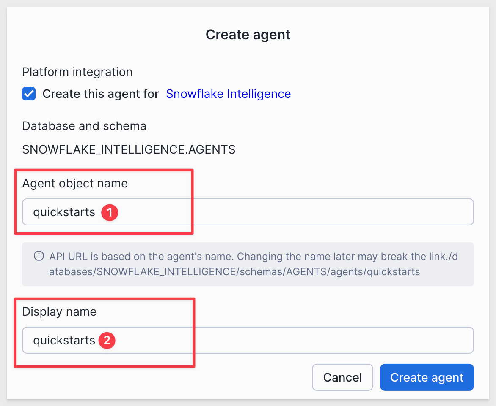

author: pballai
id: partners_snowflake_intelligence
summary: partners_snowflake_intelligence
categories: dataapps
environments: web
status: Published
feedback link: https://github.com/sigmacomputing/sigmaquickstarts/issues
tags: Default
lastUpdated: 2025-10-30

# Connect Snowflake Intelligence to Sigma Workbook

## Overview 
Duration: 5 

In this QuickStart, you’ll learn how to integrate Snowflake Intelligence with Sigma, allowing users to interact with their AI agents and perform structured analytics in one unified interface.

You'll build a Sigma workbook that lets users:
- Select and chat with Snowflake Intelligence, hosted in Snowflake
- Submit natural-language questions
- Display the agent's response inside Sigma
- Log all interactions for audit and analysis
- Analyze related data using Sigma's spreadsheet and visualization features

This is the first step in Sigma’s planned native integration with Snowflake Intelligence—giving you early access to a powerful new AI-driven workflow.

<aside class="positive">
<strong>IMPORTANT:</strong><br> Some screens in Sigma may appear slightly different from those shown in QuickStarts. This is because Sigma continuously adds and enhances functionality. Rest assured, Sigma’s intuitive interface ensures that any differences will not prevent you from successfully completing any QuickStart.
</aside>

For more information on Sigma's product release strategy, see [Sigma product releases](https://help.sigmacomputing.com/docs/sigma-product-releases)

If something doesn’t work as expected, here's how to [contact Sigma support](https://help.sigmacomputing.com/docs/sigma-support)

### Target Audience
Any Sigma or Snowflake user interested in how Snowflake Intelligence and Sigma can make them more productive. 

### What You'll Learn
- How to set up Snowflake Intelligence and create Snowflake Intelligence Agents
- How to configure service users, roles, and Programmatic Access Tokens (PAT) for secure API access
- How to create external access integrations and secrets for Snowflake Intelligence API calls
- How to build a stored procedure that invokes Snowflake Intelligence Agents via REST API
- How to configure a Sigma workbook with input tables and actions to interact with agents
- How to connect agents to your data using custom tools and functions

### Prerequisites

<ul> 
  <li>Any modern browser is acceptable.</li> 
  <li>Access to your Sigma environment.</li>
  <li>Basic familiarity with stored procedures and Sigma Actions. Not all setup steps are shown in full, as these basics are assumed to be understood.</li>
  <li>A working Snowflake account with Snowflake Intelligence access.</li> 
  <li>A Snowflake service user and service role used for the Sigma connection.</li>
  <li>A Sigma connection to Snowflake with write-back enabled.</li>
</ul> 

<aside class="positive">
<strong>IMPORTANT:</strong><br> Sigma recommends using non-production resources when completing QuickStarts.
</aside>

<button>[Sigma Free Trial](https://www.sigmacomputing.com/free-trial/)</button>

<aside class="negative">
<strong>IMPORTANT:</strong><br> Some features may carry a "Beta" tag. Beta features are subject to quick, iterative changes. As a result, the latest product version may differ from the contents of this document.
</aside>
 

<!-- END OF SECTION-->

## Snowflake Intelligence
Duration: 5 

Before we do anything, we need to make sure that a database, schema and at least one agent exists for Snowflake Intelligence.

Run the following command in a Snowflake worksheet:
```code
USE ROLE ACCOUNTADMIN;
SHOW AGENTS IN SCHEMA SNOWFLAKE_INTELLIGENCE.AGENTS;
```

If the return is `Object does not exist, or operation cannot be performed.` then you will need to create the database, schema and agent. 

For detailed instruction, see [Set Up Snowflake Intelligence](https://docs.snowflake.com/en/user-guide/snowflake-cortex/snowflake-intelligence#set-up-sf-intelligence)

For example, we ran:
```code
USE ROLE ACCOUNTADMIN;

CREATE DATABASE IF NOT EXISTS snowflake_intelligence;
GRANT USAGE ON DATABASE snowflake_intelligence TO ROLE PUBLIC;

CREATE SCHEMA IF NOT EXISTS snowflake_intelligence.agents;
GRANT USAGE ON SCHEMA snowflake_intelligence.agents TO ROLE PUBLIC;

GRANT CREATE AGENT ON SCHEMA snowflake_intelligence.agents TO ROLE ACCOUNTADMIN;
```

Now running this script again works, but returns no results (we need to create an agent still):
```code
USE ROLE ACCOUNTADMIN;
SHOW AGENTS IN SCHEMA SNOWFLAKE_INTELLIGENCE.AGENTS;
```

### Create an agent
In Snowflake, open `AI & ML` and select `Agents`:


Click the `Create agent` button.

<aside class="negative">
<strong>NOTE:</strong><br> Make sure you are using the ACCOUNTADMIN role.
</aside>

Set the `name` and `display name` to `quickstarts` and click `Create agent`:



Once the agent is created, we can `edit` it and add a description to help tailor the responses to our sample retail dataset.

Set the `Description` to:
```code
You are a Product Insights Analyst.
  
An AI retail analyst specializing in customer feedback analysis for a large e-commerce brand. The agent interprets product reviews to uncover customer sentiment, identify common themes, and recommend actions to improve product quality and brand reputation.

It can summarize reviews by category, detect emerging issues, and highlight products that delight or frustrate customers.
```

Click `Save`.

Now we can verify it works by asking a question like `what agent are you?`:


Now this script returns the `quickstart` agent:
```code
SHOW AGENTS IN SCHEMA SNOWFLAKE_INTELLIGENCE.AGENTS;
```


<!-- END OF SECTION-->

## Create a Service Role and Service User
Duration: 5 

This account isolates Sigma’s access and keeps your Cortex integration secure and auditable.

Run the following command in Snowflake:
```code
-- ------------------------------------------------------------
-- Bootstrap namespace + security for Sigma/Agents
-- Creates DB/Schema (if missing), service role, service user, and grants
-- ------------------------------------------------------------

-- Use a privileged role for account-level and global grants
USE ROLE ACCOUNTADMIN;

-- Create the database + schema if they don't exist yet
CREATE DATABASE IF NOT EXISTS QUICKSTARTS
  COMMENT = 'QS sandboxes and examples';
CREATE SCHEMA IF NOT EXISTS QUICKSTARTS.AGENTS
  COMMENT = 'Agent QuickStart assets (procs, logs, etc.)';

-- Create a dedicated service role for Sigma
CREATE ROLE IF NOT EXISTS SIGMA_SERVICE_ROLE;

-- Grant role basic access to the namespace where the proc will live
GRANT USAGE ON DATABASE QUICKSTARTS TO ROLE SIGMA_SERVICE_ROLE;
GRANT USAGE ON SCHEMA QUICKSTARTS.AGENTS TO ROLE SIGMA_SERVICE_ROLE;

-- Allow the role to create/execute procs in this schema (proc will be added later)
GRANT CREATE PROCEDURE ON SCHEMA QUICKSTARTS.AGENTS TO ROLE SIGMA_SERVICE_ROLE;
-- we plan to log chats to a table in this schema, pre-grant table privileges:
GRANT CREATE TABLE ON SCHEMA QUICKSTARTS.AGENTS TO ROLE SIGMA_SERVICE_ROLE;

-- Create the service user that Sigma will use to connect
CREATE USER IF NOT EXISTS SIGMA_SERVICE_USER
  TYPE = SERVICE
  LOGIN_NAME = SIGMA_SERVICE_USER
  DISPLAY_NAME = 'Sigma Service User'
  DEFAULT_ROLE = SIGMA_SERVICE_ROLE
  DEFAULT_WAREHOUSE = COMPUTE_WH;

-- Tie the role and warehouse to the user/role
GRANT ROLE SIGMA_SERVICE_ROLE TO USER SIGMA_SERVICE_USER;
GRANT USAGE ON WAREHOUSE COMPUTE_WH TO ROLE SIGMA_SERVICE_ROLE;
```

After selecting `Run All` the script will run to success:


Now would be a good time to configure the connection to Snowflake in Sigma. The connection will require key-pair authentication and write-back enabled.

For more information, see: [Snowflake Key-pair Authorization](https://quickstarts.sigmacomputing.com/guide/security_snowflake_keypair_rotation/index.html?index=..%2F..index#0) and [Set up write access](https://help.sigmacomputing.com/docs/set-up-write-access)

## Create a Programmatic Access Token (PAT) 
Duration: 5 

Now that we have a service account, we need to create a `Programmatic Access Token` ("PAT) for the service user.

Before Snowflake can call the Cortex API on behalf of your Sigma service user, you’ll need to create a Programmatic Access Token (PAT).

This token authorizes Snowflake to make REST API calls (to the Cortex Agent endpoint) on behalf of that user—without requiring interactive login.

To create a PAT, we also need a service account user and role.

Service users must have a network policy restricting the IPs allowed to use the token. 

### Create a network policy
For this QuickStart demonstration, we will relax that rule by applying an authentication policy that does not enforce a network policy for PAT creation, but expires the PAT after one day.

<aside class="negative">
<strong>BEST PRACTICE:</strong><br> In production, replace this with a real NETWORK POLICY listing your organization’s trusted egress IPs or CIDR ranges.

This ensures only approved systems (like Sigma’s outbound IPs) can use the service user’s token.
</aside>

Run the following command in Snowflake:
```code
USE ROLE ACCOUNTADMIN;

-- Demo-only network policy (allows all IPv4)
CREATE OR REPLACE NETWORK POLICY quickstarts
  ALLOWED_IP_LIST = ('0.0.0.0/0')
  COMMENT = 'Demo-only: permits PAT use from any IPv4 address';

-- Attach the policy to the service user
ALTER USER SIGMA_SERVICE_USER SET NETWORK_POLICY = quickstarts;

-- Create a short-lived PAT (1-day expiry)
ALTER USER SIGMA_SERVICE_USER
ADD PROGRAMMATIC ACCESS TOKEN SIGMA_CORTEX_QUICKSTARTS_PAT
  ROLE_RESTRICTION = 'SIGMA_SERVICE_ROLE'
  DAYS_TO_EXPIRY = 1
  COMMENT = 'Token for Sigma–Cortex QuickStart demo (expires in 1 day)';
```

<aside class="positive">
<strong>BEST PRACTICE:</strong><br> This token is intentionally short-lived because the demo network policy (0.0.0.0/0) is fully open.

For production:
- Use a restricted network policy listing your trusted egress IPv4 addresses or CIDR ranges.
- Increase DAYS_TO_EXPIRY only once network restrictions are in place.
- Store and rotate tokens securely using Snowflake’s CREATE SECRET integration.
</aside>

Once the script is run, copy the `token secret` to a text file as we will use it next:


<aside class="positive">
<strong>IMPORTANT:</strong><br> If you want to recreate a network policy after it is already created, a quick way to do that is to run this script:

ALTER USER SIGMA_SERVICE_USER UNSET NETWORK_POLICY;<br>
DROP NETWORK POLICY IF EXISTS quickstarts;<br>
ALTER USER SIGMA_SERVICE_USER<br>
REMOVE PROGRAMMATIC ACCESS TOKEN SIGMA_CORTEX_QUICKSTARTS_PAT;

Then just rerun the network policy creation script.
</aside>

### Generate the PAT
Run the following command in Snowflake:
```code
USE ROLE ACCOUNTADMIN;

ALTER USER SIGMA_SERVICE_USER
ADD PROGRAMMATIC ACCESS TOKEN SIGMA_CORTEX_PAT
  ROLE_RESTRICTION = SIGMA_SERVICE_ROLE
  DAYS_TO_EXPIRY = 30
  COMMENT = 'Token for Sigma–Cortex integration';
```


<!-- END OF SECTION-->

## Snowflake Objects
Duration: 5

With your Programmatic Access Token (PAT) created, the next step is to let Snowflake securely call the Cortex API using that token. We’ll:

- Store the PAT in a Snowflake Secret
- Allow outbound HTTPS to your Snowflake Intelligenceendpoint via a Network Rule
- Bind both into an External Access Integration used by the stored procedure

<aside class="negative">
<strong>BEST PRACTICE:</strong><br> For production, pair this with a restricted network policy on the service user and use a sensible PAT expiry/rotation strategy.
</aside>

Run the following command in Snowflake, replacing **<paste_your_token_secret_here>** and **<your_account_identifier>** and with your values:

```code
-- ------------------------------------------------------------
-- Setup for Sigma + Snowflake Snowflake Intelligence Integration (Account Objects)
-- ------------------------------------------------------------
-- This script:
-- 1) Uses ACCOUNTADMIN for account-level objects
-- 2) Creates a SECRET holding your already-created PAT (token_secret)
-- 3) Creates a NETWORK RULE allowing egress to your Snowflake API host
-- 4) Creates an EXTERNAL ACCESS INTEGRATION binding the rule + secret
-- 5) Switches context to QUICKSTARTS.CORTEX_QS (proc will be created later)
-- ------------------------------------------------------------

-- Use a role with privileges to create account-level objects
USE ROLE ACCOUNTADMIN;

-- Switch to the db/schema
USE DATABASE QUICKSTARTS;
USE SCHEMA AGENTS;

-- Replace with your real host from Snowsight
-- Replace <your_account_identifier> with your org/acc locator, e.g. xy12345.us-east-1
SET ACCOUNT_HOST = '<your_account_identifier>.snowflakecomputing.com';

-- (1) Store your existing PAT (paste the token_secret from Step 1)
CREATE OR REPLACE SECRET SIGMA_CORTEX_QUICKSTARTS_PAT
  TYPE = GENERIC_STRING
  SECRET_STRING = '<paste_your_token_secret_here>';

-- (2) Allow outbound HTTPS to your account's Snowflake Intelligence API host
CREATE OR REPLACE NETWORK RULE SNOWFLAKE_API_EGRESS_NETWORK_RULE
  MODE = EGRESS
  TYPE = HOST_PORT
  VALUE_LIST = ($ACCOUNT_HOST);

-- (3) Bind the secret + network rule into an external access integration
CREATE OR REPLACE EXTERNAL ACCESS INTEGRATION CORTEX_AGENT_EXTERNAL_ACCESS_INTEGRATION
  ALLOWED_NETWORK_RULES = (SNOWFLAKE_API_EGRESS_NETWORK_RULE)
  ALLOWED_AUTHENTICATION_SECRETS = (SIGMA_CORTEX_QUICKSTARTS_PAT)
  ENABLED = TRUE;
```

After running, Snowflake will return `Integration CORTEX_AGENT_EXTERNAL_ACCESS_INTEGRATION successfully created.`.


<!-- END OF SECTION-->

## Create the Cortex Agent Stored Procedure in Snowflake
Duration: 5

Next we create a stored procedure that when called from Sigma, invokes the Snowflake Intelligence Agent via Snowflake’s REST API. 

It takes two arguments, an `agent name` and a `user message`, and returns the agent’s text response.

Run the following command in Snowflake, replacing the values for **<your-snowflake-account-identifier>** with your Snowflake account identifier: 
```code
-- Create the API caller procedure
CREATE OR REPLACE PROCEDURE QUICKSTARTS.AGENTS.CALL_CORTEX_AGENT_API(
  CORTEX_AGENT VARCHAR, 
  USER_MESSAGE VARCHAR
)
RETURNS VARCHAR
LANGUAGE PYTHON
RUNTIME_VERSION = '3.9'
PACKAGES = ('requests','snowflake-snowpark-python')
HANDLER = 'call_agent_api'
EXTERNAL_ACCESS_INTEGRATIONS = (CORTEX_AGENT_EXTERNAL_ACCESS_INTEGRATION)
SECRETS = ('SIGMA_CORTEX_QUICKSTARTS_PAT' = SIGMA_CORTEX_QUICKSTARTS_PAT)
EXECUTE AS OWNER
AS
$$
import _snowflake, requests, json

def call_agent_api(session, cortex_agent, user_message):
    try:
        ALLOWLIST = {"QUICKSTARTS": []}
        
        if cortex_agent not in ALLOWLIST:
            return f"Invalid agent '{cortex_agent}'. Valid options: {', '.join(sorted(ALLOWLIST.keys()))}"
        
        account_host = "<your_account_identifier>.snowflakecomputing.com"
        url = f"https://{account_host}/api/v2/databases/snowflake_intelligence/schemas/agents/agents/{cortex_agent}:run"
        
        token = _snowflake.get_generic_secret_string('SIGMA_CORTEX_QUICKSTARTS_PAT')
        headers = {
            "Content-Type": "application/json",
            "Accept": "text/event-stream",
            "Authorization": f"Bearer {token}",
            "X-Snowflake-Authorization-Token-Type": "PROGRAMMATIC_ACCESS_TOKEN",
            "X-Snowflake-Role": "SIGMA_SERVICE_ROLE",
        }
        
        payload = {
            "messages": [
                {"role": "user", "content": [{"type": "text", "text": user_message}]}
            ],
            "tool_choice": {"type": "auto"}
        }
        
        text_chunks, current_event = [], None
        
        with requests.post(url, json=payload, headers=headers, stream=True, timeout=60) as r:
            r.raise_for_status()
            for raw in r.iter_lines(decode_unicode=True):
                if not raw: 
                    continue
                line = raw.strip()
                
                if line.startswith("event: "):
                    current_event = line[7:]
                elif line.startswith("data: "):
                    data_str = line[6:]
                    if current_event in ("response.text", "response.text.delta"):
                        try:
                            t = json.loads(data_str).get("text")
                            if isinstance(t, str): 
                                text_chunks.append(t)
                        except Exception: 
                            pass
                    elif current_event == "response.error":
                        try:
                            msg = json.loads(data_str).get("message") or data_str
                            return f"Agent error: {msg}"
                        except Exception:
                            return f"Agent error: {data_str}"
                    elif current_event == "response.completed":
                        break
        
        if text_chunks:
            return "".join(text_chunks)
        
        # Fallback: try non-streaming
        r2 = requests.post(url, json=payload, headers={**headers, "Accept":"application/json"}, timeout=60)
        r2.raise_for_status()
        try:
            body = r2.json()
            for k in ("output_text","text","message","content"):
                if isinstance(body.get(k), str) and body[k]:
                    return body[k]
        except Exception:
            pass
        
        return r2.text or "No text content returned by agent."
        
    except requests.exceptions.RequestException as e:
        return f"HTTP error: {e}"
    except Exception as e:
        return f"Error: {e}"
$$;
```

Grants:
```
GRANT USAGE ON PROCEDURE QUICKSTARTS.AGENTS.CALL_CORTEX_AGENT_API(VARCHAR, VARCHAR)
  TO ROLE SIGMA_SERVICE_ROLE;

-- Grant visibility & execute rights to Sigma’s role
GRANT USAGE ON DATABASE QUICKSTARTS TO ROLE SIGMA_SERVICE_ROLE;
GRANT USAGE ON SCHEMA QUICKSTARTS.AGENTS TO ROLE SIGMA_SERVICE_ROLE;
GRANT USAGE ON PROCEDURE QUICKSTARTS.AGENTS.CALL_CORTEX_AGENT_API(VARCHAR, VARCHAR)
  TO ROLE SIGMA_SERVICE_ROLE;
GRANT DATABASE ROLE snowflake.cortex_user TO ROLE SIGMA_SERVICE_ROLE;

-- Ensure the PAT's role can see/execute agents
GRANT USAGE ON DATABASE SNOWFLAKE_INTELLIGENCE TO ROLE SIGMA_SERVICE_ROLE;
GRANT USAGE ON SCHEMA  SNOWFLAKE_INTELLIGENCE.AGENTS TO ROLE SIGMA_SERVICE_ROLE;
GRANT USAGE ON AGENT SNOWFLAKE_INTELLIGENCE.AGENTS.QUICKSTARTS TO ROLE SIGMA_SERVICE_ROLE;
```

<aside class="negative">
<strong>NOTE:</strong><br> If your Cortex Agent is configured with orchestration rules, omit "tool_choice" from the payload and let the agent plan tool use. Use tool_choice only for single-tool agents or when you explicitly need to force a specific tool; otherwise the request may fail or the setting may be ignored.
</aside>

### Quick test
We can check that everything is configured correctly in Snowflake by calling the agent:
```code
CALL QUICKSTARTS.AGENTS.CALL_CORTEX_AGENT_API('QUICKSTARTS', 'What agent are you?');
```

The response will be something like this:
```text
I am an AI assistant created by Anthropic. I aim to be direct and honest in my interactions. I engage in conversation while being truthful about my identity and capabilities.
```

### Multiple Agents
For simplicity, we are using one agent called `QUICKSTARTS`. It is possible to add more agents by modifying the stored procedure where the agents are defined:
```code
ALLOWLIST = {
    "QUICKSTARTS": []
}
```

To determine which agents are available in Snowflake, run:
```code
SHOW AGENTS;
```

The select list control that provides agent selection will also have to be modified to add any additional agents as well. 

For more information on how to create agents in Snowflake, see [Configure and interact with Agents](https://docs.snowflake.com/en/user-guide/snowflake-cortex/cortex-agents-manage)


<!-- END OF SECTION-->

## Sigma Template
Duration: 5

There is a Sigma template we can use to save you the time of building the Sigma workbook yourself, although that is not hard to do either. 

In Sigma, select `Templates`, search for `quickstarts` and select the `Snowflake Intelligence Quickstart` template:


This will open a pre-configured workbook for us where we can make a few additions and adjustments. Templates can save a lot of time!


### Add an input table
We want to store all the questions/responses in the warehouse, but the template needs a place to do that. We will use an input table to make that really simple.

Select the `Data` tab and add an `Empty` input table using the `Element bar`.


Select your Snowflake connection that has write-back enabled and click `Create`.

Rename the first column `Question` and add two more `text` columns, `Answer` and `Agent`.

Also add two `Row edit history` columns for `Last updated at` and `Last updated by`.

Rename the input table to `Chat Log` and delete any empty rows:


Now click on the `Chat Log Modal` tab and add the `Chat Log` table from `Data` > `Elements` > `Data`:


In this way, users can see the log but do not have access to the input table.

It is really easy to customize elements using the `Element panel`:


### Action adjustments
We need to let the workbook actions know about our new input table and stored procedure.

Click on the `Cortex Demo` tab and select the `Submit Prompt` button to access the `Actions` options on the `Element panel`.

Notice that the `Insert row...` action doesn't know about the new input table yet.

Select that action, point it at the `Chat Log` input table on the `Data` page. Then make sure the `With values` are assigned correctly:


Check the configuration of the `CALL_CORTEX_AGENT_API` action to make sure it can access the Snowflake stored procedure we created earlier:


Click `Save as` and name the workbook `Snowflake Intelligence QuickStart`.


<!-- END OF SECTION-->

## Validation test (no data yet)
Duration: 5

We don't have any data for the agent to evaluate yet, but we can still make sure everything is working just like we did in the Snowflake Agent UI. 

Submit the prompt:
```code
What agent are you?
```

After a few moments we get a similar response:


Opening the `Chat Log` we see the one row of data:


<!-- END OF SECTION-->

## Add Test Data
Duration: 5

Now that Sigma can call our Snowflake agent, we want to give the agent access to some data. Since this is a trial instance, we will just load a small sample dataset from a CSV file to make this simple. 

<aside class="negative">
<strong>NOTE:</strong><br> If you prefer to use your own data, you can use that instead.
</aside>

<button>[Download the Sample Dataset](https://sigma-quickstarts-main.s3.us-west-1.amazonaws.com/csv/Product_Reviews_Big_Buys.csv)</button>

In Snowflake (as `ACCOUNTADMIN`), open the `Add data` page and select `Load data into a Table`:


Locate the `Product_Reviews_Big_Buys` CSV file and select it. 

To keep this simple, we will store the data in `QUICKSTARTS.AGENTS` and create a new table called `Big_Buys`:


Click `Next` and then select `Autofix column names` under the red `6 errors` button. 

Click `Load`. Snowflake will inform us when done:


We can look at the sample data, which is retail sales information that also has a `REVIEW` column that we are interested in as it contains customer sentiment about each transaction.

### Agent tools
The Cortex tool requires either a semantic view, procedure or function to access the underlying data. It cannot access tables directly so we need to adjust for that.

In Snowflake, run the following command to create a simple function:
```code
USE ROLE ACCOUNTADMIN;
USE DATABASE QUICKSTARTS;
USE SCHEMA AGENTS;

CREATE OR REPLACE FUNCTION BIG_BUYS_FUNC()
RETURNS ARRAY
LANGUAGE SQL
COMMENT = '{
  "description": "Returns product information including names, brands, ratings, and customer reviews from the BIG_BUYS product catalog."
}'
AS
$$
SELECT ARRAY_AGG(
         OBJECT_CONSTRUCT(
           'product_name', PRODUCT_NAME,
           'brand',        BRAND,
           'rating',       ROUND_OF_RATING,
           'review',       REVIEW
         )
       )
FROM QUICKSTARTS.AGENTS.BIG_BUYS
$$;

-- Grants
GRANT USAGE ON DATABASE QUICKSTARTS TO ROLE SIGMA_SERVICE_ROLE;
GRANT USAGE ON SCHEMA QUICKSTARTS.AGENTS TO ROLE SIGMA_SERVICE_ROLE;
GRANT USAGE ON FUNCTION QUICKSTARTS.AGENTS.BIG_BUYS_FUNC() TO ROLE SIGMA_SERVICE_ROLE;
GRANT SELECT ON TABLE QUICKSTARTS.AGENTS.BIG_BUYS TO ROLE SIGMA_SERVICE_ROLE;
GRANT USAGE ON WAREHOUSE COMPUTE_WH TO ROLE SIGMA_SERVICE_ROLE;
GRANT USAGE ON FUNCTION QUICKSTARTS.AGENTS.BIG_BUYS_FUNC() TO ROLE ACCOUNTADMIN;
```

### Add custom tool to Agent
On the `QuickStart` agent, select the `Tools` menu and `Add custom tool`. 

Configure a the tool to use the new function as:


### Test it out
With our data connected, we can ask a question in Snowflake to verify it works:


Asking the question in Sigma:


<aside class="negative">
<strong>NOTE:</strong><br> Performance of the agent will be affected by the warehouse size and how the data is accessed.

We could also revise the procedure to format the response better, so that it reads more easily in Sigma.
</aside>

### Where to go next
With this foundation in place, we can expand by adding additional agents and allowing users to select specific, named tools—enabling them to focus questions on targeted datasets using tailored agents that deliver more optimized, relevant responses.


<!-- END OF SECTION-->

## What we've covered
Duration: 5

You've successfully built a complete integration between Snowflake Cortex Agents and Sigma, including:

**Infrastructure Setup:**
- Configured Snowflake Intelligence with custom agents
- Created secure service users and roles with proper permissions
- Set up Programmatic Access Tokens with network policies
- Built external access integrations for API connectivity

**Data Integration:**
- Created a stored procedure for Cortex Agent API calls
- Connected agents to your data using custom tools and functions
- Implemented secure, auditable AI interactions

**User Experience:**
- Built a Sigma workbook with intuitive chat interface
- Added conversation logging with input tables
- Created seamless workflows between AI questions and data analysis

This integration enables AI-powered analytics directly within your data warehouse, allowing users to ask natural-language questions and immediately continue their analysis using Sigma's full visualization and computation capabilities.


**Additional Resource Links**

[Blog](https://www.sigmacomputing.com/blog/)<br>
[Community](https://community.sigmacomputing.com/)<br>
[Help Center](https://help.sigmacomputing.com/hc/en-us)<br>
[QuickStarts](https://quickstarts.sigmacomputing.com/)<br>

Be sure to check out all the latest developments at [Sigma's First Friday Feature page!](https://quickstarts.sigmacomputing.com/firstfridayfeatures/)
<br>

[](https://twitter.com/sigmacomputing)&emsp;
[](https://www.linkedin.com/company/sigmacomputing)&emsp;
[](https://www.facebook.com/sigmacomputing)


<!-- END OF WHAT WE COVERED -->
<!-- END OF QUICKSTART -->
