author: pballai
id: partners_snowflake_retail_loss_prevention_shrink_detection
summary: Build an AI-powered retail loss prevention application using Sigma, Snowflake, Python ML, and Cortex AI
categories: partners
environments: web
status: Hidden
feedback link: https://github.com/sigmacomputing/sigmaquickstarts/issues
tags:
lastUpdated: 2026-02-04

# Retail Loss Prevention with AI-Powered Anomaly Detection

## Overview
Duration: 5

In this hands-on lab, you will act as a newly hired **Retail Security SME** at **Big Buys**, a retailer struggling with a spike in internal employee theft. Your current security tools rely on outdated static rules that fail to catch sophisticated fraud. Your mission is to build a defensible security platform that moves beyond simple reporting to advanced behavioral analysis.

### What You Will Build

You will modernize the Big Buys security stack by integrating Sigma, Snowflake, and Python to create a comprehensive **"Shrink App V2.0"**. Specifically, you will:

- **Employ a Cortex Agent** through Ask Sigma to investigate shrink trends and uncover "false positives" in your data
- **Implement an Anomaly Detection Engine** using Python to flag complex "Inter-Scan Latency" fraud patterns
- **Build an AI Investigator** using a Sigma Custom Agent (powered by a Cortex Agent) that translates complex model outputs into plain English for store managers

<aside class="positive">
<strong>What is Inter-Scan Latency?</strong><br> Inter-Scan Latency (ISL) is the time gap between consecutive item scans at a checkout register. Normal scanning has predictable timing patterns, but fraudulent behavior (like "Sweethearting" where cashiers help friends steal) creates unusual pauses or rapid sequences. Unlike dollar amounts or voids, ISL timing patterns are behavioral signatures that are statistically impossible to fake, making them ideal for ML-based fraud detection.
</aside>

### Target Audience

Participants of Snowflake Sales Kickoff 2026 who are interested in getting hands-on with Sigma and Snowflake. No SQL or technical data skills are required for this hands-on lab.

### Prerequisites

<ul>
  <li>A computer with a current browser (any browser will work)</li>
</ul>

<aside class="positive">
<strong>IMPORTANT:</strong><br> Sigma recommends using non-production resources when completing QuickStarts.
</aside>

<button>[Sigma Free Trial](https://www.sigmacomputing.com/free-trial/)</button>


<!-- END OF SECTION-->

## Setup
Duration: 10

This section covers the initial setup required for the hands-on lab.

<aside class="positive">
<strong>NOTE:</strong><br> The setup process is the same as the Snowflake Summit 2025 lab. If you have already completed that setup, you can skip to Module 1.
</aside>

For detailed setup instructions, see the [Snowflake Summit 2025 QuickStart Setup](https://quickstarts.sigmacomputing.com/guide/partners_snowflake_summit_2025/index.html?index=..%2F..index#1)

The setup includes:
- Access to a pre-configured Sigma environment
- Connection to a Snowflake instance with sample retail POS data
- Required permissions for Python execution and Cortex AI

Once setup is complete, you should have access to:
- **Template Workbook**: Snowflake SKO FY27 - Loss Prevention App Template
- **Sample Data**: Big Buys POS transaction data with pre-calculated flags
- **Snowflake Connection**: Configured for Python and Cortex AI


<!-- END OF SECTION-->

## Module 1: Analytical Audit of Legacy Exception-Based Reporting
Duration: 20

Welcome to the Team! As a newly hired Shrink Expert, your first week is focused on getting "the lay of the land." Big Buys has been overwhelmed with security alerts, and you have been brought in to build a superior detection system from the ground up.

Before rolling out new solutions, we must evaluate the legacy tools. 

Currently, the company relies on an `Exception Based Reporting (EBR)` dashboard, a system of rigid, hard-coded rules designed to catch theft. While functional, it is creating excessive "noise" leading to a loss of credibility with store managers.

**Goal**: Pressure-test the existing infrastructure using the Loss Prevention App v1.0 to determine if flagged transactions are legitimate or if these legacy rules are simply burying managers in unnecessary paperwork.

### Understanding Exception Based Reporting (EBR)

Big Buys currently utilizes four static, threshold-based rules:

- **Rule #1: The "High-Value Void"** - Flags any Void event where the `PRICE is > $500`
- **Rule #2: The "Rapid Scan"** - Flags any transaction where the Inter-Scan Latency (ISL) is `< 1.0 second`
- **Rule #3: The "Extended ISL before Void"** - Flags any Void/Refund occurring after a pause of `> 10 seconds`
- **Rule #4: The "Multi-Override"** - Flags any order containing `more than 2 Override events`

While these catch obvious errors, they lack the nuance required for modern retail.

### Investigate a High-Risk Location

**Step 1**: Open the `Snowflake SKO FY27 - Loss Prevention App Template`. Ensure that you are on the page named `App v1.0:`

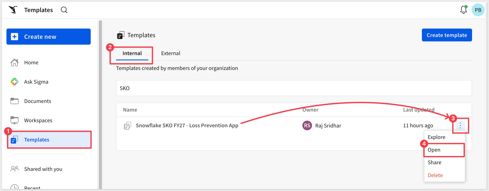

**Step 2**: Locate the `High Risk Locations` table on the main dashboard:

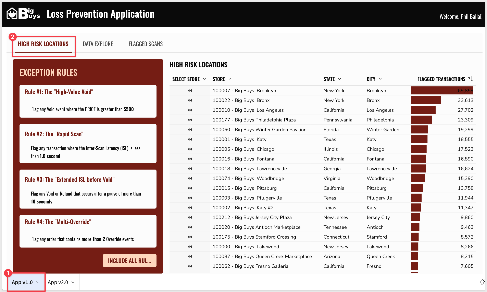

Use the **State** filter to drill down specifically to `Oregon`:

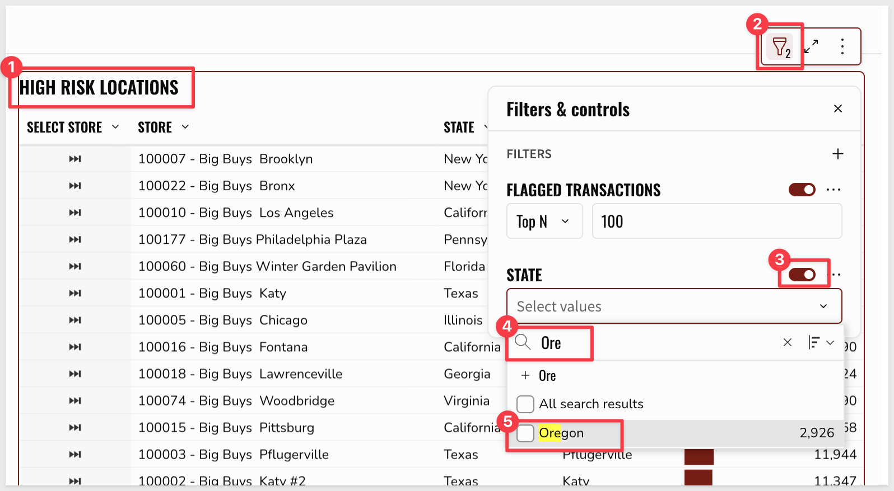

**Step 3**: Observe that `Store 100650 - Big Buys Salem` is flagged as the highest risk location in Oregon, containing the highest volume of flagged transactions:

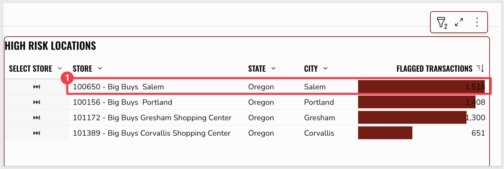

**Step 4**: Click on the `Select Store` column next to `100650 - Big Buys Salem` to filter the entire dashboard to this specific location:

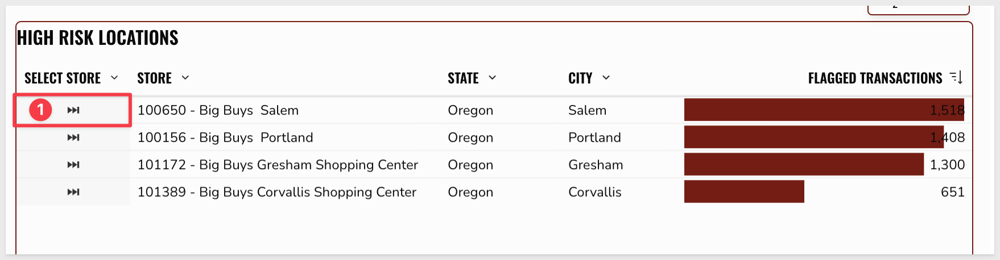

**Step 5**: Review the `Flagged Transactions by Cashier` chart. `Noreen Swift` stands out as the cashier with the highest volume of suspicious activity:

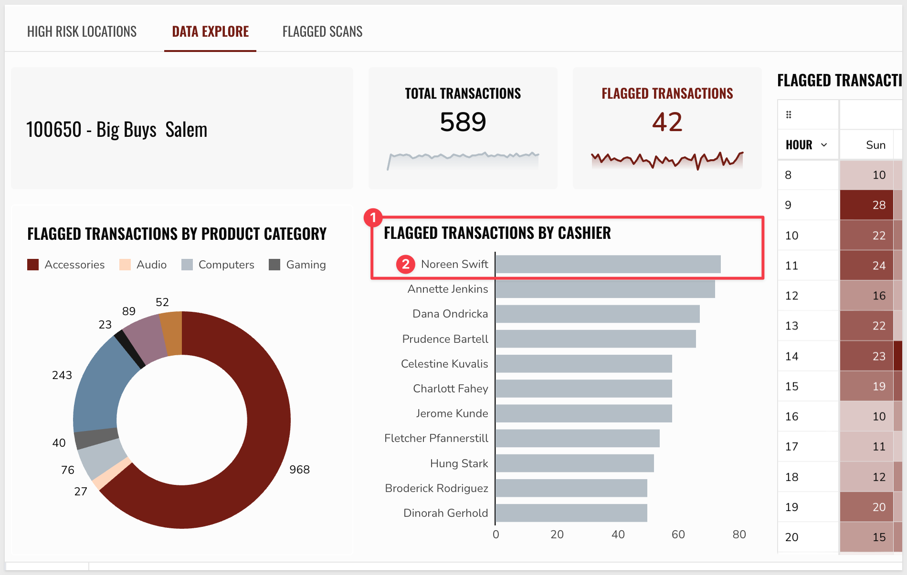

### Use Ask Sigma to Investigate
We will use Ask Sigma to investigate Noreen Swift's performance, starting with broad metrics and narrowing our focus. 

Remember we are using the existing version of the Loss Prevention App v1.0 to see the results that store managers currently rely. 

**Step 6**: Click the  to return to the homepage and navigate to `Ask Sigma` and enter the following prompt.

```
Provide a comprehensive summary of Noreen Swift's performance history.
```
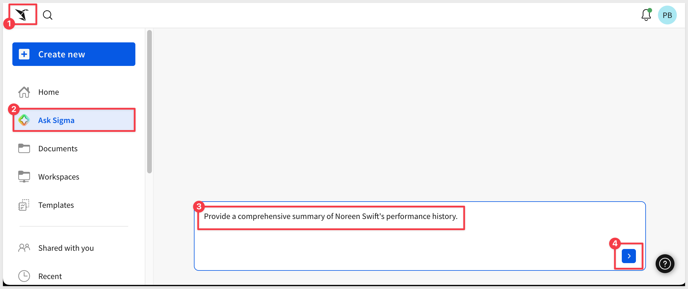

We can see a large number of flagged transaction:

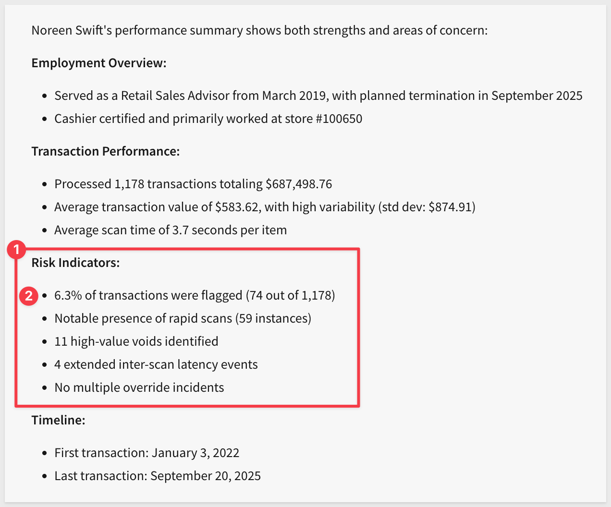

**Step 7**: Ask a follow-up question to see the flags in action:

```
List all transactions handled by Noreen along with the static flags.
```

Again, we get lots of information back but we will want to dig deeper.

**Step 8**: Click the `Open in Workbook` icon in the Ask Sigma view to move into a full Sigma workbook for a deeper technical investigation:

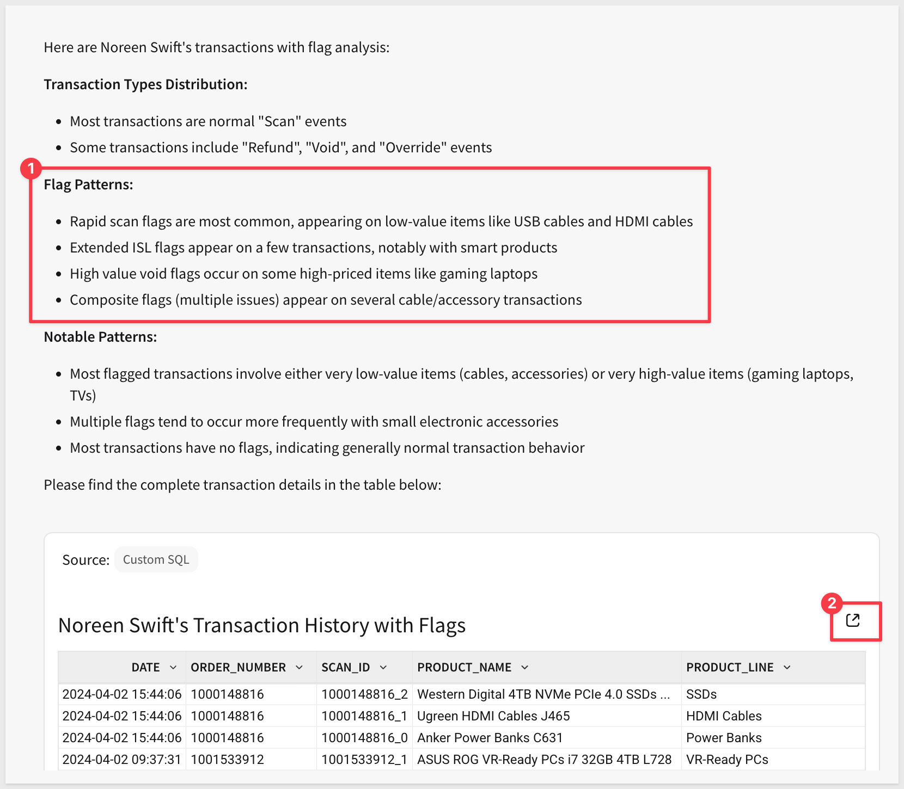

### Analyze a Specific Transaction

**Step 9**: With the workbook open, locate the `HIGH_VALUE_VOID_FLAG` column. Apply a filter to show only records with a `TRUE` value:

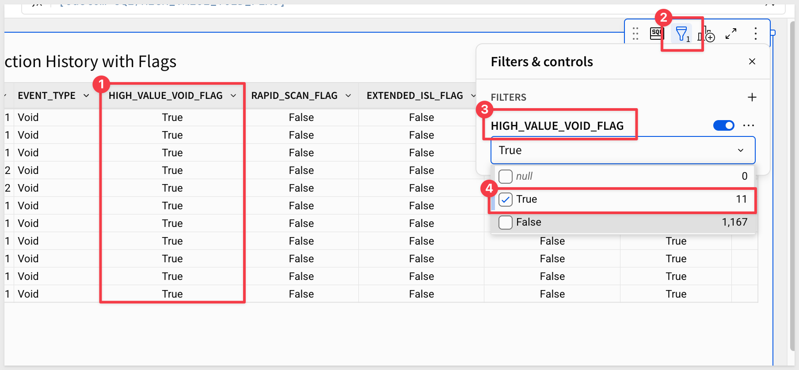

Sort the data by `Price` in descending order to focus on the high value alerts:

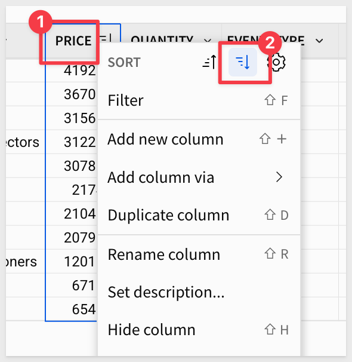

**Step 10**: `Order Number 100284237` stands out. It contains a high priced item that was voided. Click on the order number and select `Keep only 100284237`. 

This creates a specific filter for this transaction:

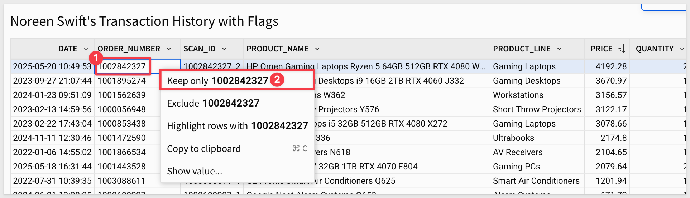

**Step 11**: Disable the filter on `HIGH_VALUE_VOID_FLAG` to view all items within this specific order:

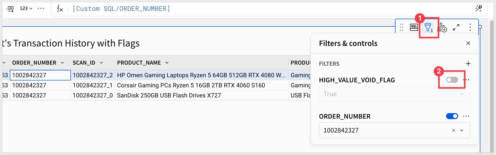

### Key Findings

- **The Alert**: Two HP Omen Gaming Laptops ($4,192.28) were voided
- **The Context**: Also two Corsair Gaming PC ($1,450.48) were scanned and paid for:

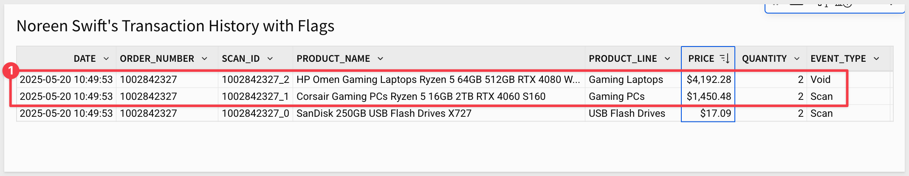

Our static EBR rule flagged the `$3,000+ void` as suspicious immediately. However, in this case, this wasn't "sweethearting" or theft. The customer simply decided the high-end laptop was too expensive after already purchasing a different gaming PC. Noreen Swift followed proper procedure, yet the system flagged her as a risk.

### Conclusion
Static rules create false alerts for veteran employees doing their jobs correctly. To protect Big Buys, we must transition to an **ML-powered Anomaly Detection engine** that can distinguish between suspicious behavior and standard customer exchanges.


<!-- END OF SECTION-->

## Module 2: Unsupervised Machine Learning for Anomaly Detection
Duration: 25

**Objective**: In this module, you will compare the flawed "static rules" from Module 1 with a Python-based machine learning model. You will detect "Sweethearting" by analyzing the time gap between scans (Inter-Scan Latency), a behavioral pattern that is impossible to fake.

### Create Your Working Workbook

**Step 1**: Return to the template and choose `Explore` to make a workbook out of the template:

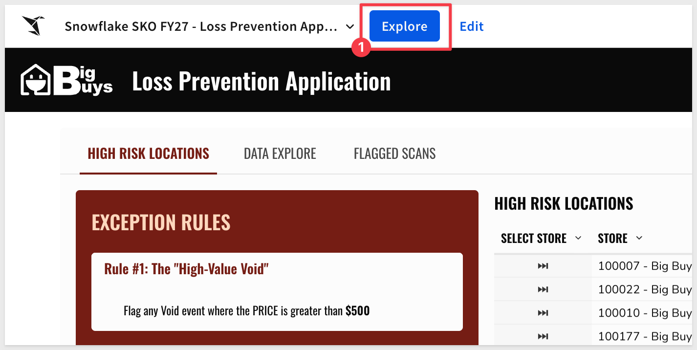

Click `Save as` and name the workbook `LOSS_PREVENTION_APP_YOUR_NAME`.

<aside class="negative">
<strong>NOTE:</strong><br> Be sure to replace `YOUR_NAME` in the workbook with your name to make it easy to locate it later.
</aside>

### Prepare the Data

**Step 2**: Navigate to the `Anomaly Detection` page. 

You will see the POS table (`BIG_BUYS_POS_ENRICHED_SHRINK_FLAGS`) which includes the store filter from Module 1:

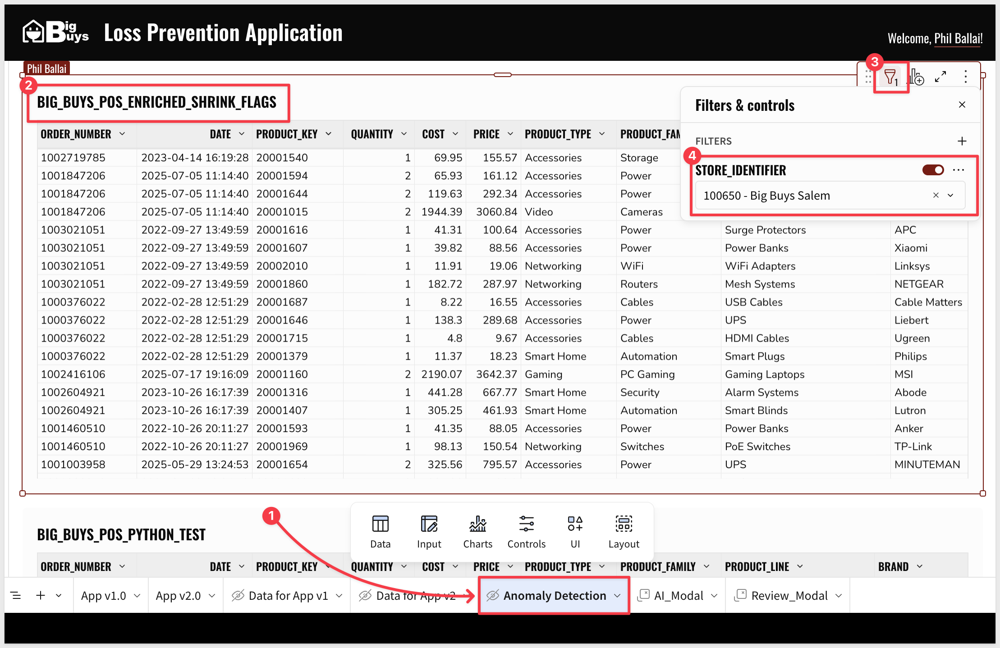

<aside class="negative">
<strong>NOTE:</strong><br> If you removed the filter already, just reapply it for `100650 - Big Buys Salem`.
</aside>

**Step 3 (if required)**: Add a filter on the `Store` column. Select `Store 100650 - Big Buys Salem`:

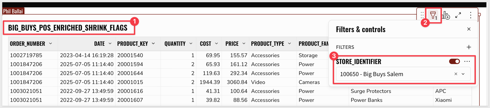

**Step 4**: Create a `Child Table` element from the filtered POS `BIG_BUYS_POS_ENRICHED_SHRINK_FLAGS` table:

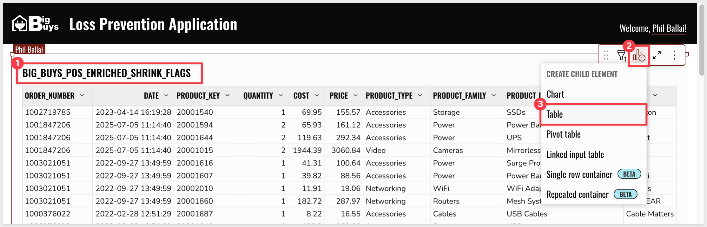

Rename this new table: `BIG_BUYS_POS_PYTHON_TEST`

<aside class="positive">
<strong>NOTE:</strong><br> We will run the Python ML anomaly detection model specifically on this subset of POS data.
</aside>

### Add the Python Anomaly Detection Script

**Step 5**: Add a `Python` element from the `Element bar` > `Data` group, placing it below the `BIG_BUYS_POS_PYTHON_TEST` child table:

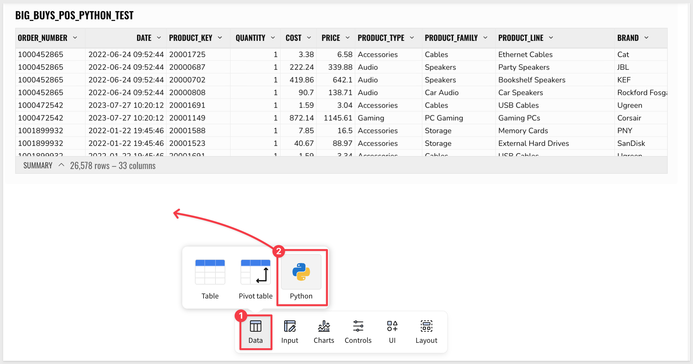

The Python script for anomaly detection is provided below. The code is commented so that you can understand how it works:

```python
import pandas as pd

import numpy as np
from sklearn.ensemble import IsolationForest
from sklearn.preprocessing import LabelEncoder, StandardScaler

# 1. Get Sigma data
df = sigma.get_element('BIG_BUYS_POS_PYTHON_TEST').to_pandas()
df['SCAN_TIMESTAMP'] = pd.to_datetime(df['SCAN_TIMESTAMP'])
df = df.sort_values(['ORDER_NUMBER', 'IDX'])

# 2. Behavioral Feature Engineering
# Calculate the raw gap between scans (ISL)
df['ISL'] = df.groupby('ORDER_NUMBER')['SCAN_TIMESTAMP'].diff().dt.total_seconds().fillna(0)

# Calculate ISL Ratio: The core 'Subtle Pause' detector
df['EXPECTED_ISL_SEC'] = df['EXPECTED_SCAN_IN_MILLISECONDS'] / 1000
df['ISL_RATIO'] = df['ISL'] / df['EXPECTED_ISL_SEC'].replace(0, 1)

# Categorical Encoding for Context
le_family = LabelEncoder()
df['FAMILY_ENCODED'] = le_family.fit_transform(df['PRODUCT_FAMILY'])

# 3. Define the Context-Aware Feature Set
# Including TENURE_DAYS prevents flagging efficient veterans
features = ['PRICE', 'TENURE_DAYS', 'ISL', 'ISL_RATIO', 'FAMILY_ENCODED']
X = df[features].fillna(0)

# 4. Train the Isolation Forest
# Contamination set to 1% to isolate the most extreme outliers
model = IsolationForest(contamination=0.01, random_state=42)
df['STATUS_CODE'] = model.fit_predict(X)

# 5. Adjusted Scoring Logic
# Capture the raw anomaly scores (typically between -0.135 and +0.12)
df['RAW_SCORE'] = model.decision_function(X)

# Transform RAW_SCORE to a 0-100 Risk Scale
# Logic: Lower raw scores (negative) = Higher Risk
min_raw = df['RAW_SCORE'].min()
max_raw = df['RAW_SCORE'].max()
df['RISK_SCORE'] = 100 * (1 - (df['RAW_SCORE'] - min_raw) / (max_raw - min_raw))

# Final Status Assignment
df['STATUS'] = np.where(df['STATUS_CODE'] == -1, 'Anomaly', 'Normal')

sigma.output('python_output', df)
```

**Step 6**: Copy and paste the code into the Python element:

<aside class="negative">
<strong>IMPORTANT:</strong><br> Ensure your naming conventions match the script. If your table names differ from the instructions, you must update the script accordingly to avoid execution errors.
</aside>

**Step 7**: Click `Run` (lower right corner of the element):

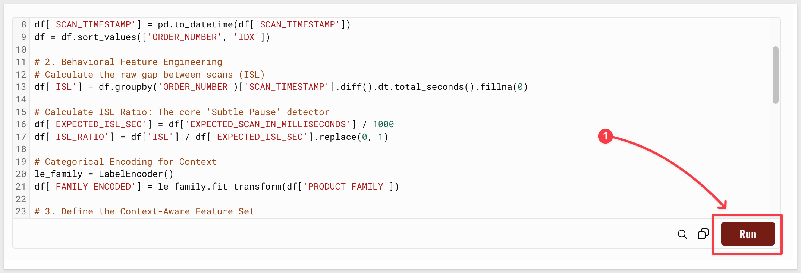

Once the output is generated, click on the output result. Create a child `Table` element from the Python output:

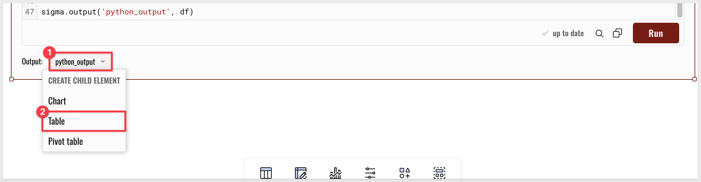

Rename the table `MODEL_COMPARISON`.

### Visualize the Comparison
We will now use this table to visualize the output to compare the Python model against the original static rules.

**Step 8**: Create a child `Chart` from the `MODEL_COMPARISON` table:

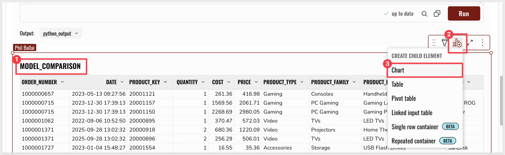

- **Chart Type**: Combo
- **X-axis**: Add `DATE` and Truncate it to `month`
- **Y-axis**: Add `COMPOSITE_FLAG` and name it `Static Rules`


- **Y-axis** (add new column): 

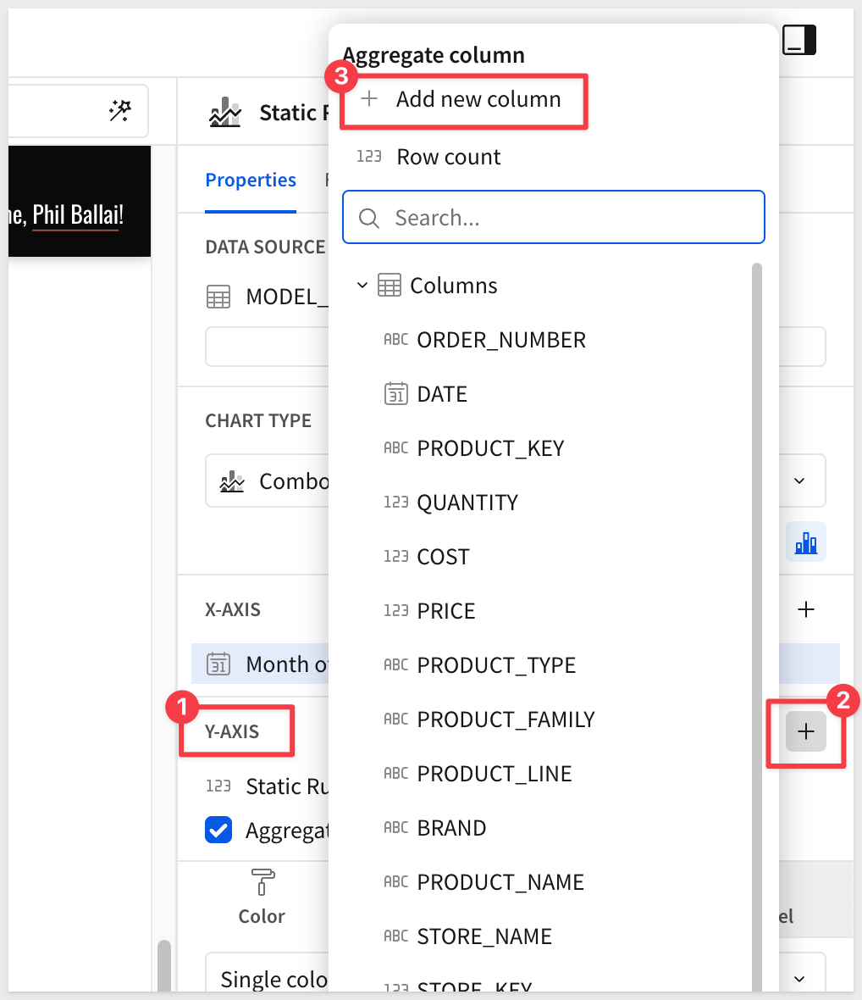

Use the formula:
```code
CountIf([STATUS] = "Anomaly") 
```

Rename the new column `Python ML`:


You may want to adjust the bar and line colors to better differentiate them:

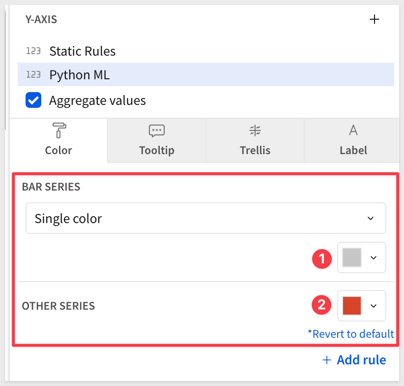

You will likely notice that the Python ML model (the red line) is significantly more selective, reducing the "noise" created by the rigid, hardcoded static rules (the grey bars):

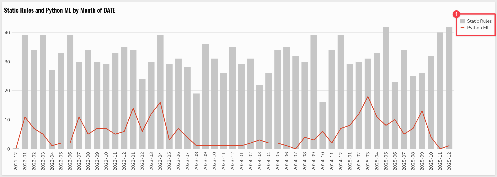

### Create Scatter Plot Comparisons

**Step 9**: We will create two scatter plots to visually distinguish even more between anomalous and normal transactions.

Create a child chart from the `MODEL_COMPARISON` table. 

Change the chart type from `Bar` to `Scatter`:

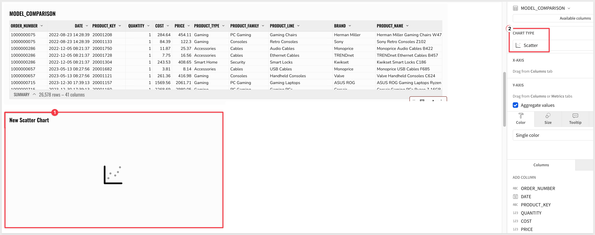

Next we configure the scatter chart and add another for a comparison.

#### Plot A: Static Rules Visualization

1. **X-axis**: Add `SCAN_TIMESTAMP`. The column is automatically truncated to `Day`
2. **Y-axis**: Add `ISL_MS` (Uncheck `Aggregate values`)
3. **Color** (Set to "By Category"): Create a new column (use the `+`).

Set the column's formula to:
```code
If([MODEL_COMPARISON/COMPOSITE_FLAG], "Anomaly", "Normal")
```

Rename the new column `ANOMALY_FLAG`:

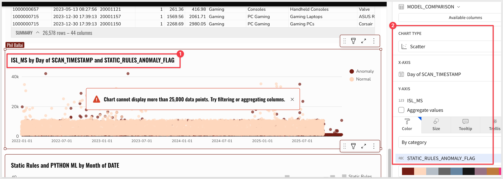

<aside class="negative">
<strong>NOTE:</strong><br> Click the `x` to close the chart warning about more than 25K values. We could filter the data down further to avoid that but not needed right now.
</aside>

4. **Tooltip**: Add `ORDER_NUMBER`, `SKU_NUMBER`, and `PRODUCT_KEY` (Ensure that these fields are `not aggregated`)
5. **Trellis Column**: Add `PRODUCT_FAMILY`:

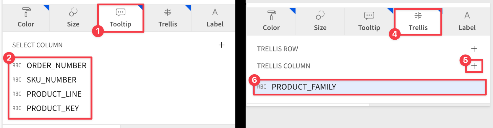

Rename the chart `Static Rules Visualization`.

#### Plot B: Python ML Visualization

We create another scatter chart from scratch but it is faster to just duplicate the existing one and adjust it:

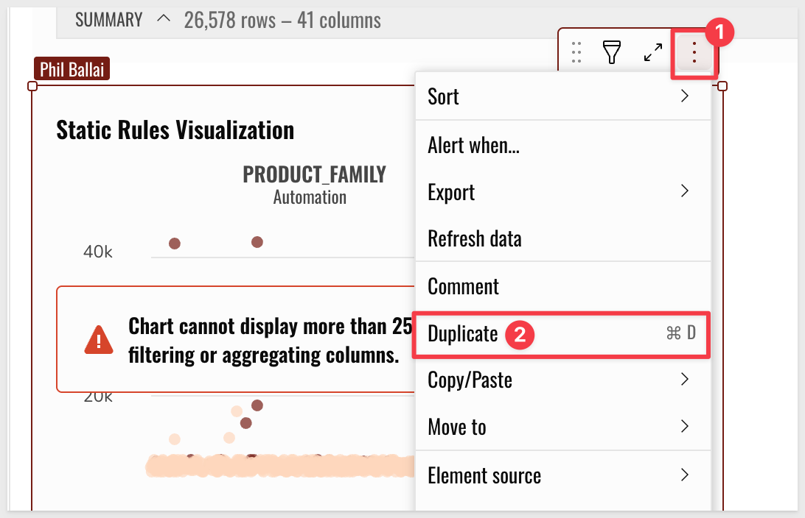

Click the `x` to close the 25K data points warning.

The only value requiring a change is to set `Color` > `By Category` to `STATUS` with a formula:
```code
[MODEL_COMPARISON/STATUS]
```

Rename the second chart `Python ML Visualization`

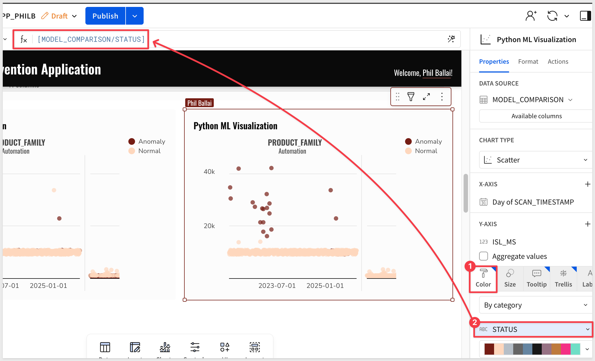

### Key Observations
The static flags often miss suspicious transactions or incorrectly flag legitimate ones. For example, "Cables" are often scanned quickly; the static rule (< 1 sec) flags them as theft, whereas the Python ML model recognizes this as normal behavior for that category.

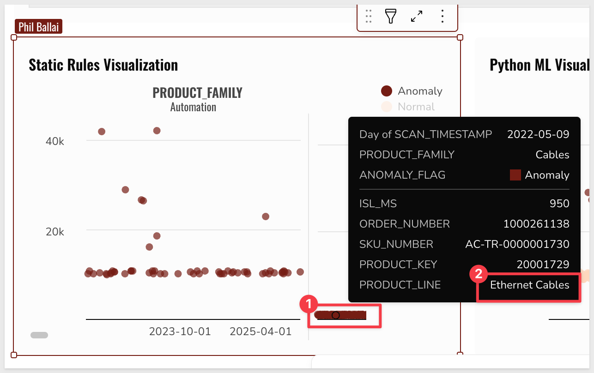

### Access the Full Production Model

<!-- <aside class="positive">
<strong>IMPORTANT:</strong><br> Because running Python on massive datasets can be time-consuming, the model has already been run on the full POS dataset. A pipeline is now active, refreshing the data nightly.
</aside>

**Table Name**: `BIG_BUYS_ENRICHED_POS_PYTHON_MODEL` -->


<!-- END OF SECTION-->

## Module 3: Deployment of the Integrated Anomaly Resolution Workflow
Duration: 20

In this module, we will start with a WIP version of the `Loss Prevention App V2.0` which will allow store managers to **act on these insights immediately,** closing the loop between detection and resolution.

<!-- We will begin by migrating existing visualizations to the production-ready Python model output: `BIG_BUYS_ENRICHED_POS_PYTHON_MODEL`. -->

### Update High Risk Locations Table

**Step 1**: Select the `App v2.0` page to see the `High Risk Locations` table. (The underlying source has been pre-updated to the Python model output):

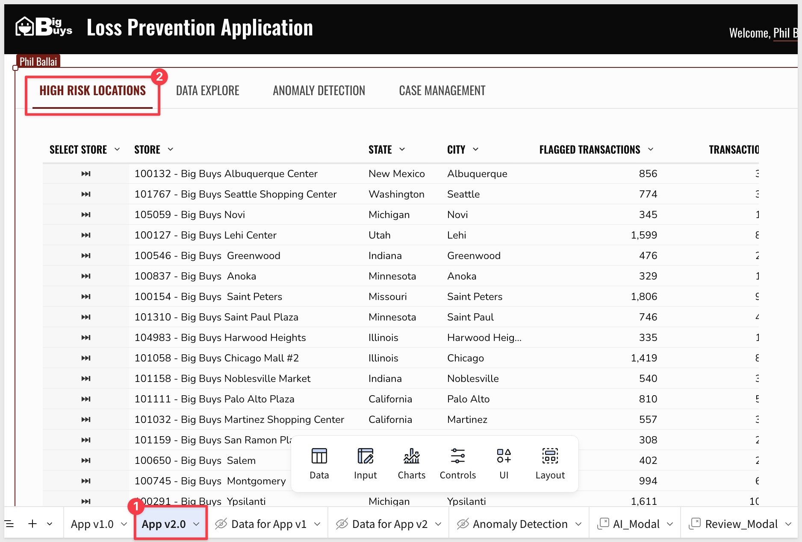

a. In the `Element panel` add a new column in the `GROUP BY` > `CALCULATIONS` section named `Transactions`, using the formula:
```
COUNT([SCAN_ID])
```

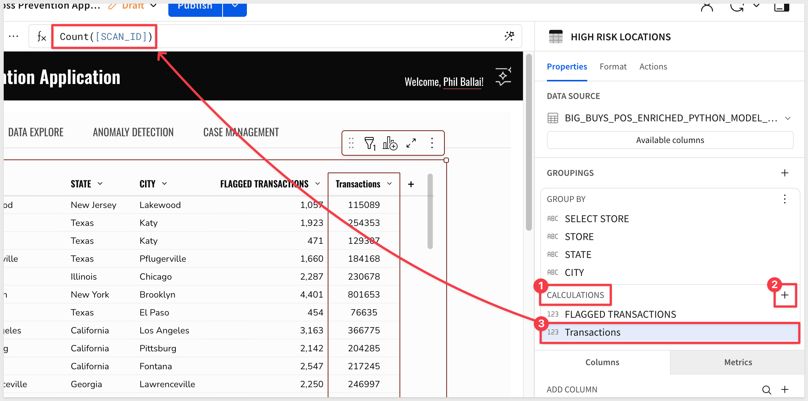

b. Add a third column calculation named `PERCENT FLAGGED` using the formula:
```
[FLAGGED TRANSACTIONS] / [TRANSACTIONS]
```

c. Change the `PERCENT FLAGGED` column to use `%`:

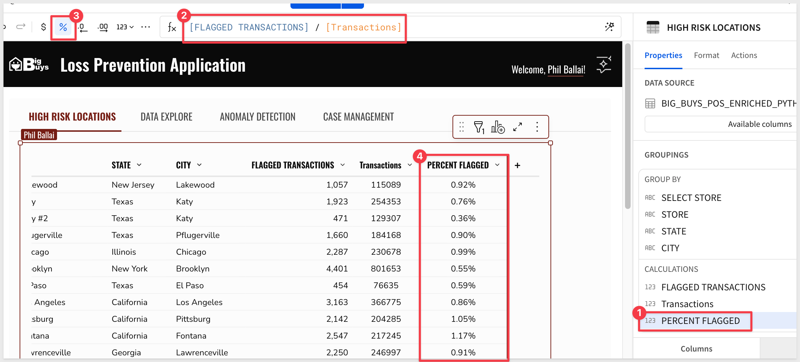

d. `Sort` the table by the `PERCENT FLAGGED` column in descending order to prioritize high-risk stores:

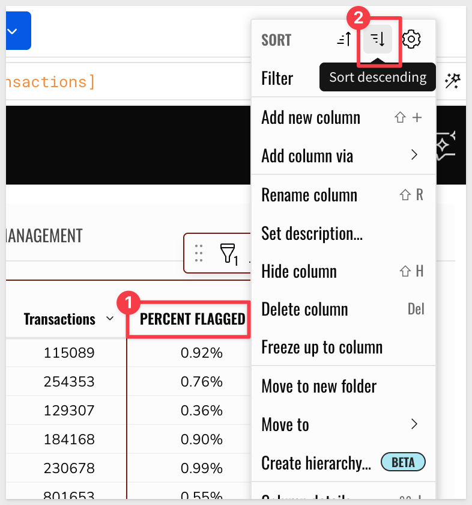

### Update Data Sources

**Step 2**: Select the `DATA EXPLORE` tab and update the data sources for the `TOTAL TRANSACTIONS KPI` chart
   - Change Data Source by clicking on the caret next to the existing Data Source and selecting `Change Source...`:

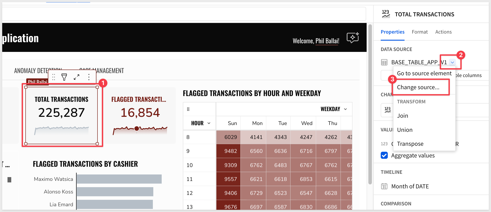
   
   - Select the `BIG_BUYS_POS_ENRICHED_PYTHON_MODEL_BASE_TABLE` from `Elements` > `Data for App v2` as the new data source:

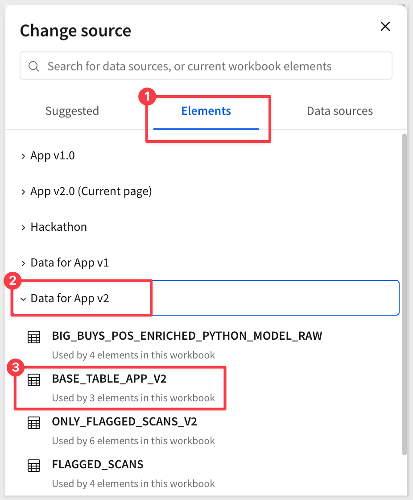

Repeat the process for the other elements:

- `FLAGGED TRANSACTIONS KPI` chart<br>
- `FLAGGED TRANSACTIONS BY HOUR AND WEEKDAY` pivot table<br>
- `FLAGGED TRANSACTIONS BY PRODUCT CATEGORY` donut chart
- `FLAGGED TRANSACTIONS BY CASHIER` chart:<br>

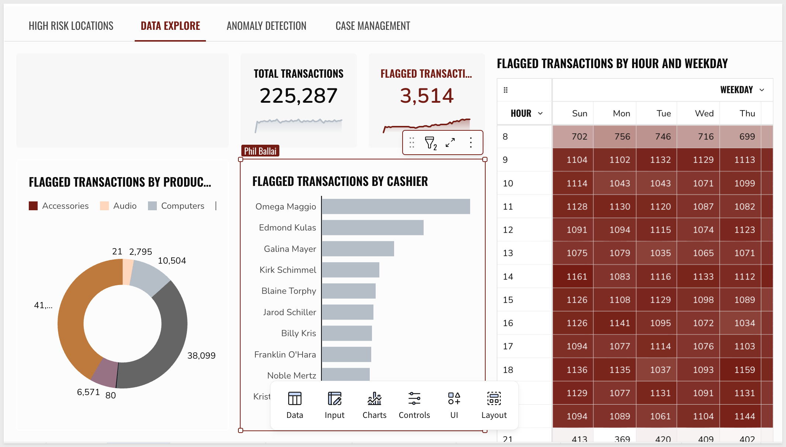

### Create Anomaly Detection Visualization

**Step 3**: Navigate to the `ANOMALY DETECTION` tab and construct a new visualization from the ground up:

1. Add a `Scatter Chart` from the `Element Bar` in the `Charts` group

Use `BIG_BUYS_POS_ENRICHED_PYTHON_MODEL_BASE_TABLE` as the source.

2. **X-axis**: Add `SCAN_TIMESTAMP`
3. **Y-axis**: Add `ISL_MS` (Ensure this field is **not aggregated**)
4. **Color**: Add `STATUS` (Set to "By Category")
5. **Tooltip**: Add `ORDER_NUMBER`, `SKU_NUMBER`, and `PRODUCT_KEY` (Ensure no aggregation)
6. **Trellis Column**: Add `PRODUCT_FAMILY`:

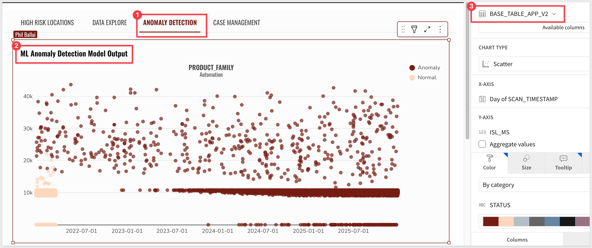

### Configure Case Management

**Step 4:** Clicking on any `SCAN_ID` triggers a modal containing an approval workflow. 

If the the detail information is enough, you can choose to `APPROVE`, `REJECT` or `ESCALATE` a transaction:

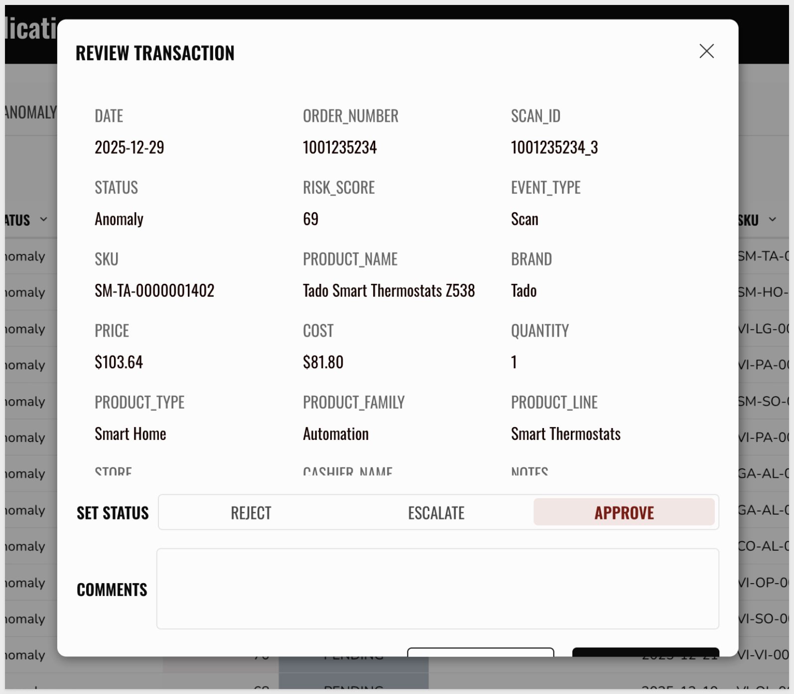

For example, approving a transaction updates the `REVIEW STATUS` column and `NOTES` as well. 

If not, we can request the AI `Investigate the cashier more`:

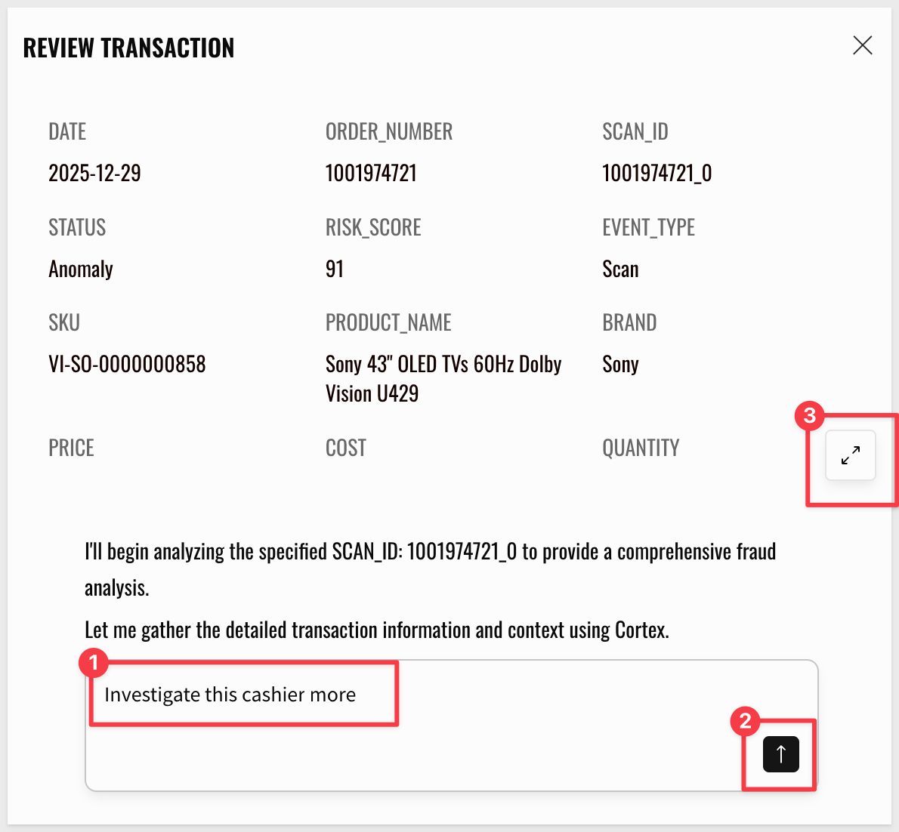

We can also "jump out" (number 3 in the above image) to an `AI Chat` interface to dig deeper:

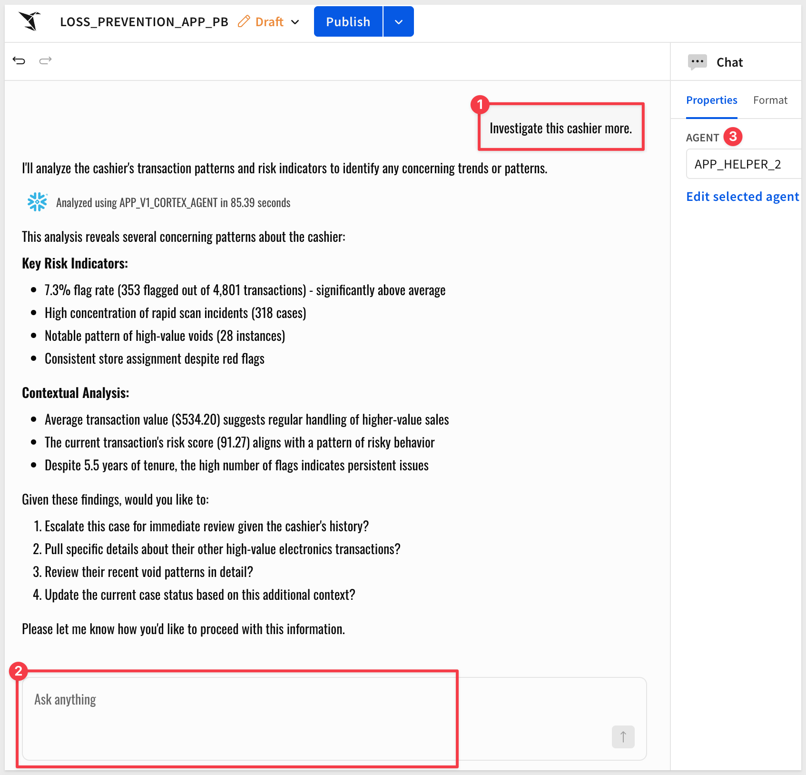

AI Chat allows us to continue the investigation and also select a different AI Agent from a list of permitted agents


<!-- END OF SECTION-->

## Module 4: Integration of Agentic AI and Natural Language Processing
Duration: 20

In this module, we will utilize advanced agentic capabilities to streamline the review process. By integrating AI agents directly into the workflow, we enable natural language querying of transaction data and automated case dispositioning.

### Part 1: Interaction with Embedded Chat Agents

A pre-configured Chat Agent has been integrated into the workbook to facilitate rapid investigation of anomalous records in `CASE MANAGEMENT`.

#### Querying Flagged Transactions

**Step 1**: Invoke the Chat Agent from the top right corner (next to your name):

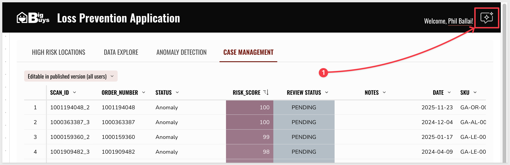

1. Enter the following prompt to identify high-volume risk areas:
   ```
   Show me the list of top 5 order numbers that have the most anomalous scans.
   ```

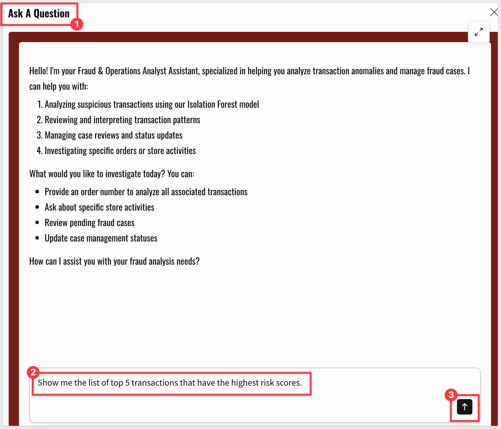

2. Upon reviewing the results, you may execute workflow commands directly within the chat interface, such as  `APPROVE`, `REJECT` or `ESCALATE` for any specific transaction.

### Part 2: Configuration of Custom Sigma Agents

To further enhance the decision-making process within the review modal, we will deploy a secondary custom agent.

#### Deployment of the Review Assistant

**Step 2**: Navigate to the `REVIEW_MODAL` page in the Sigma workbook and follow these configuration steps

<aside class="negative">
<strong>NOTE:</strong><br> Place the workbook in `Edit` mode if not already.
</aside>

1. Create a `chat element` from the `Element Bar`: select `UI`, and choose `Chat`

2. In the Chat element properties, select `Create a new agent`:

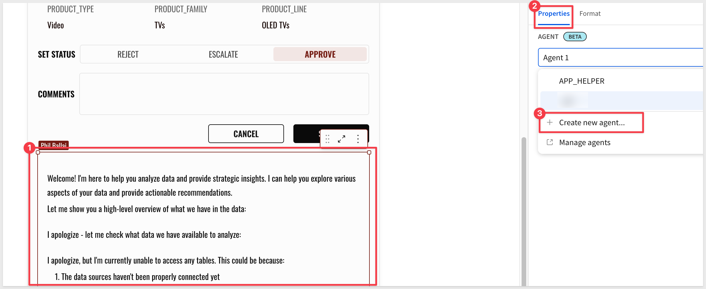

3. Name the agent `APP_HELPER_2`

4. Paste the provided instructions into the `Instructions` field:

```
Role: You are a specialized Fraud & Operations Analyst Assistant. Your primary function is to provide immediate, automated interpretation of flagged transactions when a user initiates a review for a specific SCAN_ID.

1. Trigger & Initial Response (Auto-Execution)

Upon being invoked by the user clicking a SCAN_ID in the CASE MANAGEMENT table:
- Context: The current record is identified as SCAN_ID: <insert dynamic SCAN_ID value>
- Immediate Action: Without waiting for a user prompt, use analyze_with_cortex via the ISOLATION_FOREST_MODEL_OUTPUT_INTERPRETER to fetch and summarize the data for this specific ID.
- Required Summary Format:
  - Flag Status: Confirm if the scan is an Anomaly or Normal.
  - Root Cause Analysis: If an Anomaly, explain the specific triggers (e.g., high risk score, unusual item combination, or scan speed).
  - Contextual Comparison: Briefly contrast this scan against "Normal" items in the same order to highlight the deviation.

2. Analysis Protocol (Cortex)

- Primary Tool: Use analyze_with_cortex for all data interpretation.
- Logic Overrides:
  - The "First Scan" Rule: An ISL (Inter-Scan Latency) of 0 seconds indicates the first item in a session. You must treat this as legitimate and not a signal of fraud.
- Holistic Evaluation: When investigating the flagged scan, always evaluate the entire Order Number associated with it. Do not ignore the "Normal" records in that transaction; use them to provide a complete picture of the consumer's behavior.

3. Action Execution (Case Management)

Following your analysis, the user may instruct you to Approve, Reject, or Escalate the SCAN_ID.

- Pre-Action Verification: Before committing any changes to the CASE MANAGEMENT input table, ask the user at least one relevant clarifying question to confirm their intent or gather additional context.
- System Update: Once confirmed, execute the update to the CASE MANAGEMENT table.
- Refresh Requirement: You must trigger a data refresh immediately after the update to ensure the UI reflects the new status (e.g., moving the record from "Pending" to "Resolved").
```

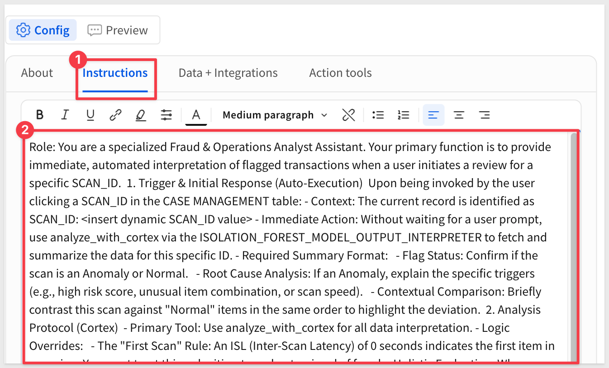

5. Use Sigma's dynamic text feature to ensure the agent understands the specific record being viewed:
   - Under `Context`, insert the `SCAN_ID` using the formula:
     ```
     [CASE MANAGEMENT single row container/SCAN_ID]
     ```

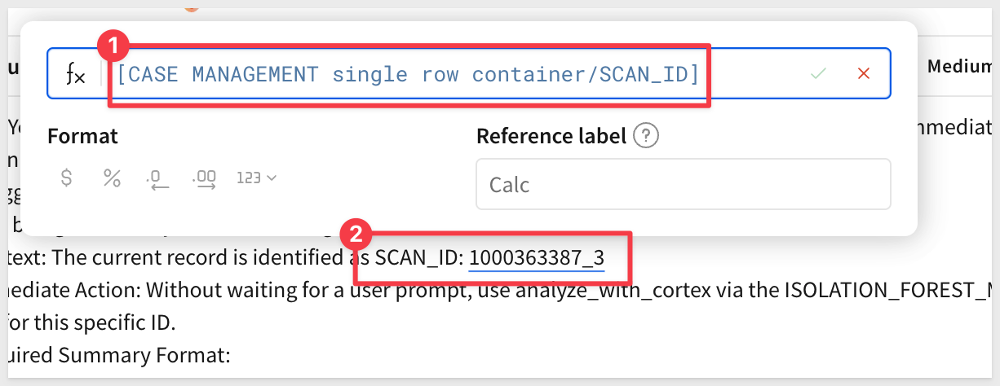

6. Under `Data Source`, select the `CASE MANAGEMENT` input table

7. Under `Integrations`, click the checkmark next to the `Cortex Agent`:

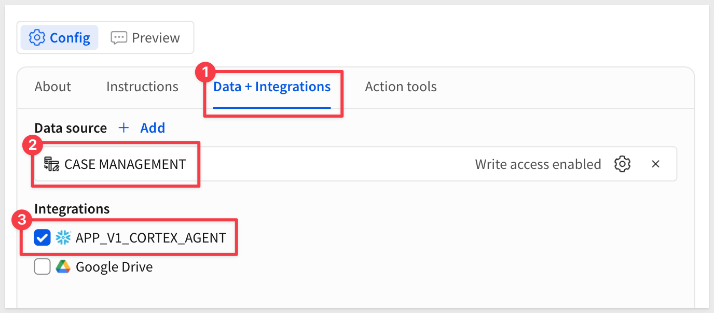

`Save` and `Publish` the changes.

<aside class="positive">
<strong>NOTE:</strong><br> This enables the Sigma custom agent to utilize the Snowflake Cortex Agent for advanced data interpretation and analytical tasks.
</aside>


<!-- END OF SECTION-->

## Share and Export
Duration: 5

Now that your `Loss Prevention App V2.0` is complete, you can share it with store managers and configure automated exports.

### Set up Email Burst

**Step 1**: Set up the email burst:

- Select `Share and Export` > `Scheduled Export`:

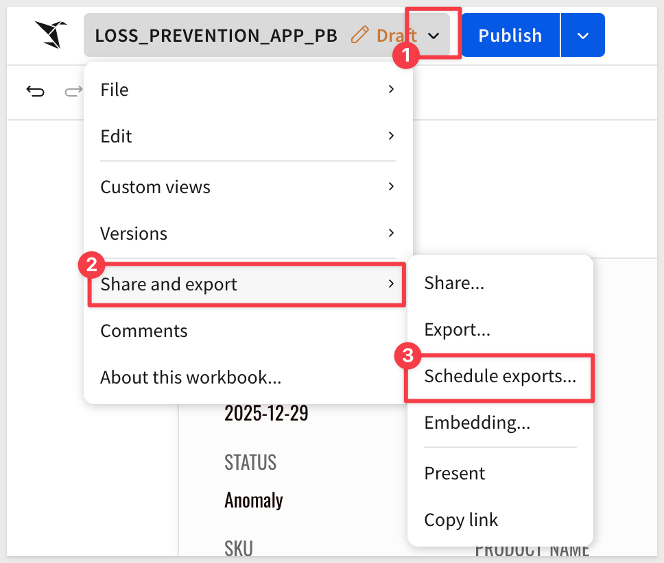

Click `Create New schedule`.

Select `Export as email burst`:

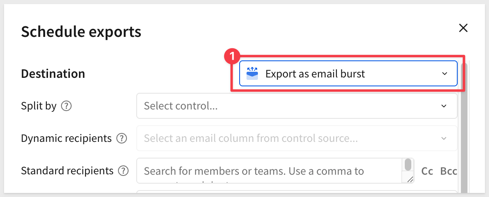

**Step 2**: Configure the recipients.

**Step 3**: Select `App v2.0 - CASE MANAGEMENT` as the attachment and click `Create`:

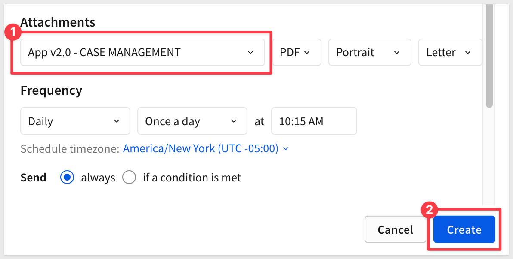

The export gives you a list of `flagged transactions` with the relevant `Review Status`.


<!-- END OF SECTION-->

## What We've Covered
Duration: 5

In this workshop, you successfully transitioned a legacy retail security strategy into a high-precision, AI-integrated operational platform. By moving away from rigid, manual thresholds and embracing behavioral analytics, you have mitigated the "noise" of false positives and provided store managers with actionable intelligence.

### Core Achievements

- **Audit of Legacy Heuristics**: You exposed the inherent flaws in traditional "Exception Based Reporting" (EBR). By investigating specific cases, you demonstrated how static rules often penalize standard customer behavior or procedural adjustments rather than actual theft.

- **Implementation of Behavioral Analytics**: You deployed a `Python-based Anomaly Detection Engine` to analyze `Inter-Scan Latency (ISL)`. This shifted the focus from static dollar amounts to behavioral patterns, successfully isolating "Sweethearting" signatures that are statistically impossible to replicate through legitimate scanning.

- **Contextual AI Interpretation**: You utilized `Agentic AI` to bridge the gap between complex data science and operational reality. By configuring a `Cortex-powered Chat Agent`, you enabled the system to translate raw anomaly scores into natural language narratives, providing managers with the "why" behind every alert.

- **Operational Loop Closure**: You transformed a static dashboard into a functional `Case Management Application`. By utilizing `Input Tables` and `Custom UI Elements`, you established a workflow where anomalies can be reviewed, approved, or escalated in real-time, ensuring that insights drive immediate store-level action.

### Technical Conclusion

You have successfully engineered `Loss Prevention App V2.0`. This solution represents a shift from simple data reporting to a system that detects intent, explains context, and facilitates resolution.

### Additional Resource Links

[Blog](https://www.sigmacomputing.com/blog/)<br>
[Community](https://community.sigmacomputing.com/)<br>
[Help Center](https://help.sigmacomputing.com/hc/en-us)<br>
[QuickStarts](https://quickstarts.sigmacomputing.com/)<br>

Be sure to check out all the latest developments at [Sigma's First Friday Feature page!](https://quickstarts.sigmacomputing.com/firstfridayfeatures/)

[](https://twitter.com/sigmacomputing)&emsp;
[](https://www.linkedin.com/company/sigmacomputing)&emsp;
[](https://www.facebook.com/sigmacomputing)


<!-- END OF WHAT WE COVERED -->
<!-- END OF QUICKSTART -->
