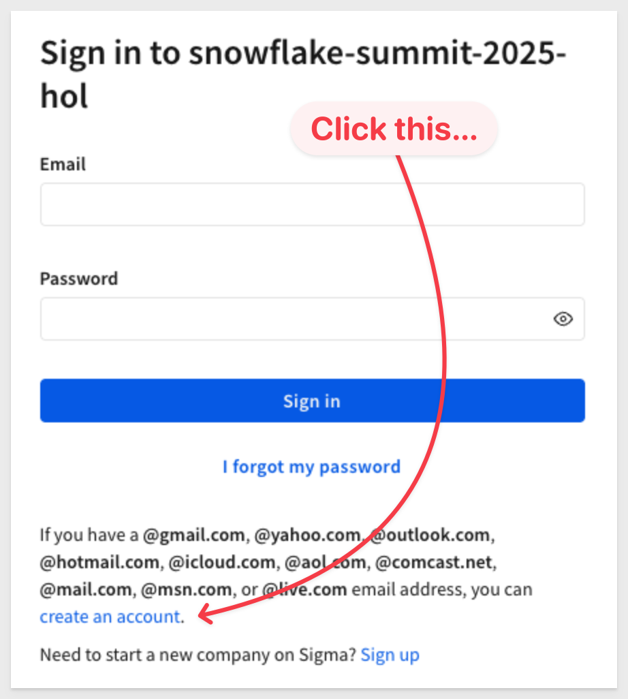
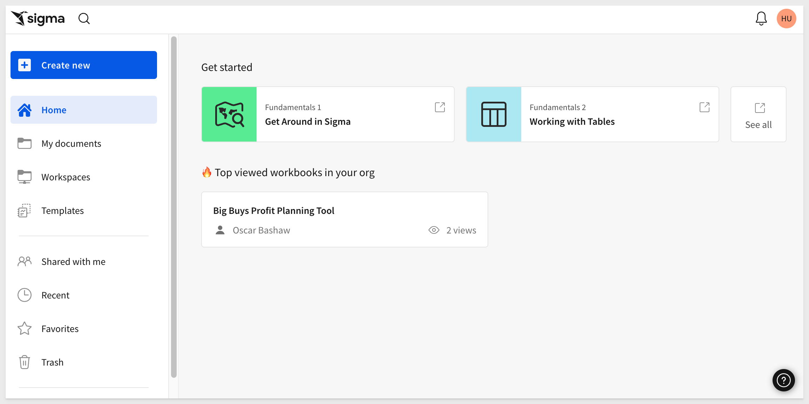
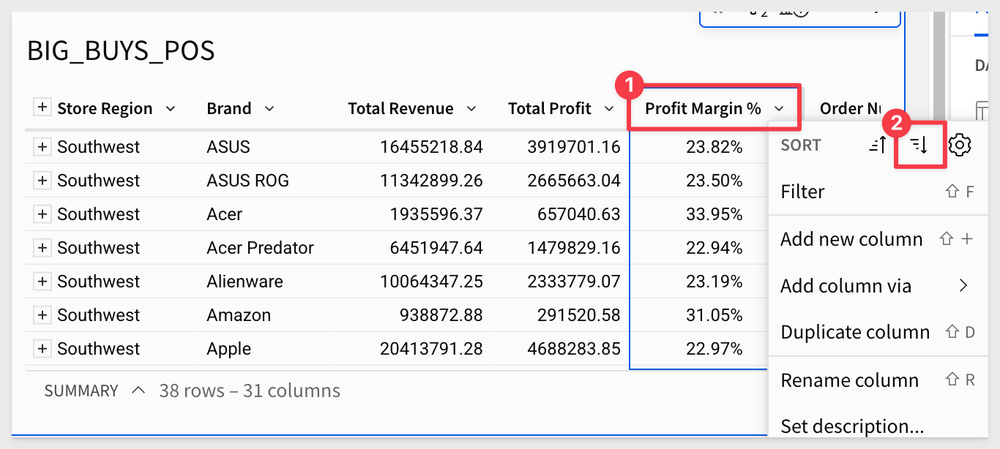
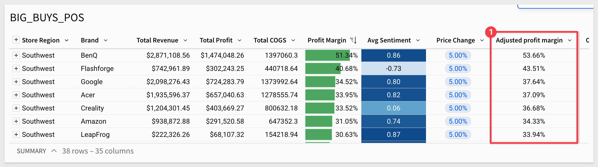
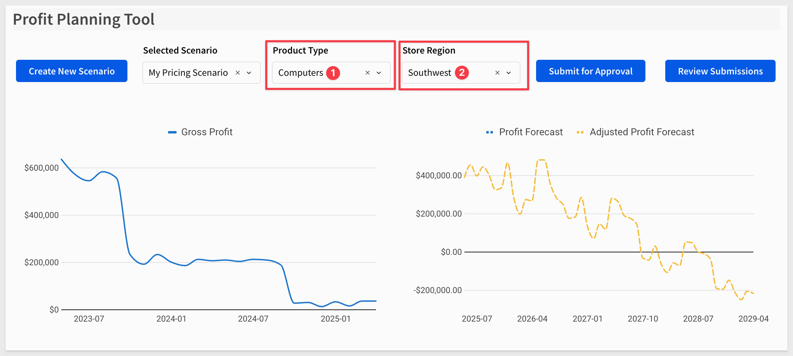
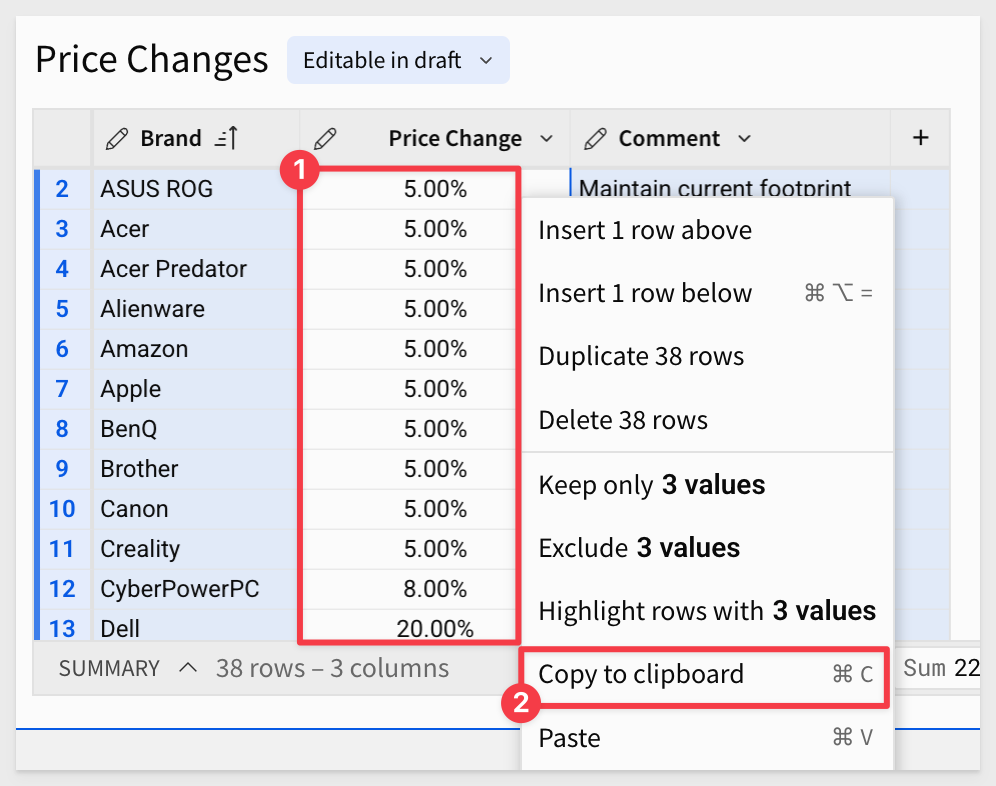
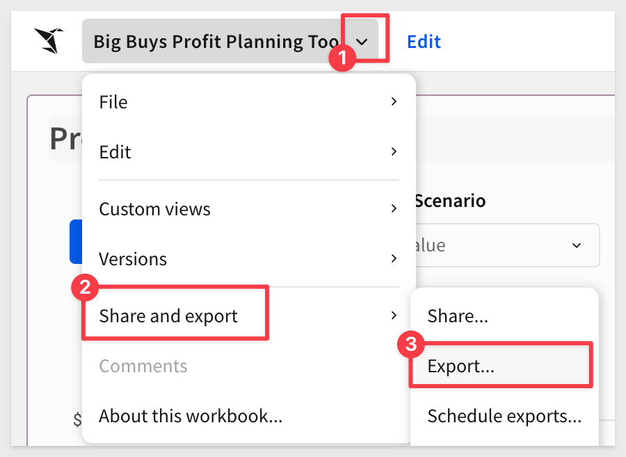

author: pballai
id: partners_snowflake_summit_2025
summary: partners_snowflake_summit_2025
categories: partners
environments: web
status: Published
feedback link: https://github.com/sigmacomputing/sigmaquickstarts/issues
tags: partners
lastUpdated: 2025-06-01

# Snowflake Summit 2025 - Hands on Lab

## Overview 
Duration: 5 

In this lab you will act as a category manager at a retail company building out an ad-hoc analysis from an AI-generated jump-off point to determine your category plan for the year.

Your new employer Big Buys Electronics ("Big Buys") is a major electronics retailer across the United States. They have seen a notable decline in computer profitability over the last two to three months. Big Buys needs to fix this since computers are a major piece of the bottom line.

That's why they hired you, a seasoned category manager to take over a struggling category and right the ship.

### What You Will Build
In this lab you will create an analysis using AI, and leverage a data application and forecast out product performance.

### Target Audience
Participants of Snowflake Summit 2025 who are interested in getting some hands-on with Sigma.

No SQL or technical data skills are required for this hands-on lab.

### Prerequisites

<ul>
  <li>A computer with a current browser. It does not matter which browser you want to use.</li>
</ul>

<aside class="negative">
<strong>NOTE:</strong><br> Sigma recommends that you use non-production resources when doing QuickStarts.
</aside>

<aside class="positive">
<strong>IMPORTANT:</strong><br> Some screens in Sigma may appear slightly different from those shown in QuickStarts. This is because Sigma is continuously adding and enhancing functionality. Rest assured, Sigma’s intuitive interface ensures that any differences will not prevent you from successfully completing any QuickStart.
</aside>
 


## Setup 
Duration: 5

**1:** Navigate to [Sigma](https://app.sigmacomputing.com/snowflake-summit-2025-hol):



<aside class="positive">
<strong>IMPORTANT:</strong><br> Do not sign up for a new Sigma trial for this lab!
</aside>

**2:** Sign up for an account using your personal email by selecting `Create an account` and entering your **personal email address**. 

<aside class="positive">
<strong>IMPORTANT:</strong><br> Be sure to have a personal email ready to go, we’d prefer to avoid accidental sign-ups for new Sigma accounts!

Whitelisted Domains:
@gmail.com, @yahoo.com, @outlook.com, @hotmail.com, @icloud.com, @aol.com, @comcast.net, @mail.com, @msn.com, or @live.com
</aside>


**3:** Check your inbox for a message from `info@send.sigmacomputing.com` and continue the sign-up process by clicking the link.

**4:** Enter your information as prompted, and click `Submit`.

**5:** Once you see the homepage, you’re ready to proceed!




<!-- END OF SECTION-->

## Ask Sigma
Duration: 5

To understand profitability for this year’s product lineup, we need insight into current performance. As new users at Big Buys, we don’t know the data’s location. Let’s use Ask Sigma to get started. 

**1:** Open `Ask Sigma` from the left sidebar to ask a question and get a decent starting point for analysis:


**2:** In the text box, type: `How are computer products performing across regions?` and click the blue arrow:


<aside class="negative">
<strong>NOTE:</strong><br> The response comes from a Cortex LLM, so your output may differ from this guide. 
</aside>

Notice that Cortex is suggesting we use the `BIG_BUYS_POS` table as a source because it has the required data for the requested prompt but also is a `Trusted` source. 


As Cortex works on the prompt, Sigma is showing each decision. For example, Cortex has decided to group the data and add some calculations too:


AI models are a great tool but we still should be careful about the results they provide too. For example, we asked for `computer products` but the filter the model used was not set correctly. Notice that it is set to `Smart Home, Video`. 

This will not get us the dataset we are after.

<aside class="negative">
<strong>NOTE:</strong><br> Your filter may be different due to the nature of LLMs.
</aside>


In Ask Sigma, we can change that easily, before we start to use the data:


Now we can select the `BIG_BUYS_POS` table. If some columns are missing, don’t worry, we’ll fix that in the next step.

**3:** With the table selected, click `Open in Workbook` in the bottom-right corner to explore the data in a spreadsheet interface and begin analysis:


<!-- END OF SECTION-->

## Find Underperforming Brands
Duration: 5

**1:** To ensure that we are at the same spot, make sure that your table has the same columns in the grouping the one pictured here. If there are any missing ones, drag them into the calculations under the store region grouping. We also used the formatting bar to set two columns to use `Currency` and `Profit Margin` to `%`:


**2:** The first thing that we noticed is the `Southwest` is the lowest performing region out of the whole Big Buys network of stores.

**3:** Let's right click and keep only the `Southwest` region:


**4:** Next, let's drag in the `Brand` column to the grouping level on the right hand side:


**5:** Now let's sort the `Profit margin` column descending so that our highest margin brands in the `Southwest` region are at the top and the lowest ones are at the bottom:



**5:** We should add in some conditional formatting to make this easier to look at. Let's go ahead and right click `Conditional formatting` on the column and add in data bars from the configuration pane on the right side:


**6:** With a little bit of color, we can easily see there are certain brands that are losing us money and others are performing great. To improve overall profitability, we could drop some brands but before we do that, let's inform our decision with some additional outside data:


**7:** Luckily we have a CSV of product reviews that we are able to load into Sigma and directly leverage in our analysis. 

Since we are using Sigma on top of Snowflake, we don't even have to wait for our data team to load the data in. We can do it right here right now. 

<button>[Download the Product Reviews CSV](https://sigma-quickstarts-main.s3.us-west-1.amazonaws.com/csv/Product_Reviews_Big_Buys.csv)</button>

Let's click on the table button on the left side of the `Element bar`:


Then select the CSV option:


From there we can drag and drop or browse to find the CSV file we downloaded:


Sigma reads the file so we can review it and then click `Save`:


**8:** With these 5000+ product reviews, we need to create a quantitative score to leverage in our analysis. So, we could either go one by one and write our own score or let's just leverage Snowflake Cortex to go through and provide us a sentiment analysis on each review.  

Right click the `Review` column and select `Add column`:


**9:** With the new column selected go to the formula bar and type in:
```code
sentiment(Review)
```

You many want to reduce the decimal places shown too:


**10:** Now we need to tie this to our `BIG_BUYS_POS` table. In Excel, you can do this with a Vlookup. Luckily Sigma has the same paradigm. On the `BIG_BUYS_POS` table right click `Brand` and select `Add column via lookup`.


**11:** In the modal, select the `Sentiment` column as the column to add, set the aggregate to `Average`, You will notice that brand has automatically been matched to `Brand` for us. 


Once you click `Done`, you'll notice that the sentiment scores have now been averaged and tied to their respective brands.

**12:** With our new looked up column selected, rename it to `Avg Sentiment` and go to the top bar and hit the decreased decimal point button twice so that we have a simpler number.

You may have also noticed that Sigma lets you see the formula that the `Add column via lookup` created for us:


Then right click the `Sentiment` column and select `Conditional formatting`. This time let's add a color scale:


**13:** Now, just a few minutes later, we have a strong understanding of which brands are our least profitable ones, and which brands are preferred by our customer base.


<!-- END OF SECTION-->


## Mock Up Price Changes
Duration: 5

The next step in our analysis is to incorporate baseline price changes provided by our market analysts.

We’ve received a second CSV file containing this information. We’ll load it using an input table so that we can make adjustments later.

<button>[Download the Price Changes CSV](https://sigma-quickstarts-main.s3.us-west-1.amazonaws.com/csv/Price_Changes.csv)</button>

**1:** From the `Element bar`, select `Input table` and drag a `CSV` input table onto the page:


**2:** From there, add the `Price Changes - Sheet1.csv` file (browse to it or drag and drop it) into the `Upload CSV` area. Click `Save`.

Rename the input table to `Price changes`:


**3:** Now on the `Brand` column on the `BIG_BUYS_POS` table, right click and select `Add column via lookup`.

Choose the `Price changes` table that we just created and set the `Column to add` to  `Price change` with Brand` set as the matching key:


**4:** Rename the new column to `Price change`.

Now we're ready to build our model:


**5:** In some cases the AI does something unexpected and we don't catch it right away. In our case we just noticed it did not group the `COGS` column to create `Total COGS` as might be expected, but that is easy to correct.

We can drag `COGS` into the grouping after the `Total Profit` column and rename it to `Total COGS`:


<aside class="negative">
<strong>NOTE:</strong><br> If "Total COGS" is present in your table, ignore the instructions to add it manually.
</aside>

**6:** We want to compare the original gross margin to the price change. 

Add a new column to the right of the `Price change` column and rename it `Adjusted profit margin`.

Set its formula to:
```code
(([Total Revenue]*(1+[Price Change])) -[Total COGS])/((1+[Price Change])*[Total Revenue])
```

Change the column format to `Percentage`:



We are ready to make a visualization.

**7:** Click the `Add child element` button in the top right of the table and select `Chart`:


**8:** Drag `Brand` to the `X axis` and the `Adjusted profit margin` to the `Y-Axis`. 

**9:** Change the chart to be vertically aligned by swapping the axes:


**10:** Add the `Profit Margin` column to the `X axis` and select `Unstacked` for the bar chart style:


Now we’re ready to begin adjusting the model to determine what values we might enter into our profit planning application.

**11:** By entering in some new price increases for a few of the brands such as HP and Dell, we can see some healthy swings in the adjusted margin in comparison to the original. 

Try entering new price increases for a few brands—for example, 7% for HP and 9% for Dell. You should see a noticeable swing in the adjusted margin compared to the original.

Once you’ve modeled a scenario you like, we’ll move on to plugging the data into our actual profit planning application.

Before leaving, click `Save As` and save the workbook with the name `Big Buys - {first name_last name}`. This naming format helps us identify your work if others need to review it.


<!-- END OF SECTION-->

## Use Big Buy’s corporate profit planning application
Duration: 5

**1:** Lets navigate to the home page and open up the `Big Buys Profit Planning Tool`, from the home page. 

**2:** This application was built by Big Buys’ central IT team as a Sigma data app. It allows team members to submit and approve distinct pricing scenarios collaboratively.

We’re going to create our own pricing scenario based on what we just learned. Let's click the `Create New Scenario` button in the top left:


**3:** Provide a name for your new scenario and type in a quick description. Then click `Create` and let's go plug in some numbers:


Since this profit planning tool is shared with all category managers at Big Buys, it’s not filtered by default to any specific product type. 

**4:** Let's go ahead and filter it to `Computers` and then set the `Store Region` to `Southwest`:


**5:** After applying the filters, you'll see the profit margin over time for that subset, along with a Snowpark forecasting model:


This is our third example of leveraging Snowflake cortex directly inside of Sigma to open up new possibilities for real time analytics. 

We are now ready to hop in and apply some of our price adjustments from our scratch pad.

**6:** Return to your` Big Buys - {your name}` workbook. Sort the `Price Changes` input table ascending by the `Brand` column, and copy all values from the `Price Change` column:



Go back to the `Big Buys Profit Planning Tool` > `Price Adjustments` table, click `Edit Data`, sort the table ascending on the `Brand` column and paste the values into the `Price Change (%)` column.

<aside class="negative">
<strong>NOTE:</strong><br> Click the first cell in the "Price Change" column, then scroll to the bottom of the table. Hold down the Shift key and click the last cell in the same column.
</aside>


<aside class="negative">
<strong>NOTE:</strong><br> To copy, press Ctrl+C on Windows and Command+C on macOS. To paste, press Ctrl+V on Windows and Command+V on macOS. 
</aside>

Click `Save` on the input table.

**7:** After entering the data, you should see a loading bar start. The machine learning model will process your changes and show real-time results based on Snowflake’s projections.


**8:** With our scenario now loaded in, we are ready to go ahead submit it for approval because Sigma data apps allow for multi step workflows. 

Once we click approve, this can go into a queue that our manager or compliance officers could go through and review but for the purpose of this lab, we can just approve our own data. 

I mean, we obviously know it's right, so first we'll click `Submit for Approval in the top right and submit our scenario.

**9:** Finally, click `Review Submission`, select your scenario, and click `Approve`.


<!-- END OF SECTION-->

## Share and Export Your Scenario
Duration: 5

Now, to close the loop on this analysis, you might want to share your scenario with a few colleagues. 

They may appreciate a brief synopsis along with a direct link to the workbook. 

To do this, click `File` > `Export` from the top toolbar: 



Set yourself as the `Recipient` and click `Export` to test it out:


The email will be from `info@send.sigmacomputing.com` and include the report attached along with a link back to the workbook:


<!-- END OF SECTION-->

## What we've covered
Duration: 5

In this QuickStart, we used Sigma to explore an ad-hoc pricing scenario, model price changes, and submit a finalized plan using a collaborative data app. 

Along the way, we joined data from multiple sources, incorporated manual inputs, and leveraged Snowflake Snowpark for predictive forecasting. We also tapped into Snowflake Cortex to apply machine learning directly within Sigma—no SQL required.

You're now equipped to build, test, and share strategic pricing scenarios powered by modern data tooling.

**Additional Resource Links**

[Blog](https://www.sigmacomputing.com/blog/)<br>
[Community](https://community.sigmacomputing.com/)<br>
[Help Center](https://help.sigmacomputing.com/hc/en-us)<br>
[QuickStarts](https://quickstarts.sigmacomputing.com/)<br>

Be sure to check out all the latest developments at [Sigma's First Friday Feature page!](https://quickstarts.sigmacomputing.com/firstfridayfeatures/)
<br>

[](https://twitter.com/sigmacomputing)&emsp;
[](https://www.linkedin.com/company/sigmacomputing)&emsp;
[](https://www.facebook.com/sigmacomputing)


<!-- END OF WHAT WE COVERED -->
<!-- END OF QUICKSTART -->
