author: pballai
id: partners_snowflake_summit_2026
summary: Build an AI-powered retail loss prevention application using Sigma, Snowflake, Python ML, and Cortex AI
categories: partners
environments: web
status: Hidden
feedback link: https://github.com/sigmacomputing/sigmaquickstarts/issues
tags:
lastUpdated: 2026-06-13

# Retail Loss Prevention with AI-Powered Anomaly Detection

## Overview
Duration: 5

In this hands-on lab, you will act as a newly hired **Retail Security SME** at **Big Buys**, a retailer struggling with a spike in internal employee theft. Your current security tools rely on outdated static rules that fail to catch sophisticated fraud. Your mission is to build a defensible security platform that moves beyond simple reporting to advanced behavioral analysis.

### What You Will Build

You will modernize the Big Buys security stack by integrating Python and AI Agents on Sigma on top of Snowflake to create a comprehensive **"Loss Prevention App V2.0"**. Specifically, you will:

- **Employ a Cortex Agent** through Sigma Assistant to investigate shrink trends and uncover "false positives" in your data
- **Implement an Anomaly Detection Engine** using Python to flag complex "Inter-Scan Latency" fraud patterns
- **Build an AI Investigator** using a Sigma Custom Agent (powered by a Cortex Agent) that translates complex model outputs into plain English for store managers

<aside class="positive">
<strong>What is Inter-Scan Latency?</strong><br> Inter-Scan Latency (ISL) is the time gap between consecutive item scans at a checkout register. Normal scanning has predictable timing patterns, but fraudulent behavior (like "Sweethearting," where cashiers help friends steal) creates unusual pauses or rapid sequences. Unlike dollar amounts or voids, ISL timing patterns are behavioral signatures that are statistically impossible to fake, making them ideal for ML-based fraud detection.
</aside>

### Target Audience

Participants of Snowflake Summit 2026 who are interested in getting hands-on with Sigma and Snowflake. No SQL, Python, or technical data skills are required for this hands-on lab.

### Prerequisites

<ul>
  <li>A computer with a current browser (any browser will work)</li>
</ul>

<aside class="negative">
<strong>IMPORTANT:</strong><br> Sigma recommends using non-production resources when completing QuickStarts.
</aside>

<aside class="positive">
<strong>IMPORTANT:</strong><br> Some screens in Sigma may appear slightly different from those shown in this lab. Sigma continuously adds and enhances functionality, but its intuitive interface ensures any differences will not prevent you from completing the steps successfully.
</aside>


<!-- END OF SECTION-->

## Setup
Duration: 10

**Step 1**: Use this link to navigate to [Sigma](http://app.sigmacomputing.com/snowflake-summit-2026-hol)

**Step 2**: Create an account and then enter your email address:

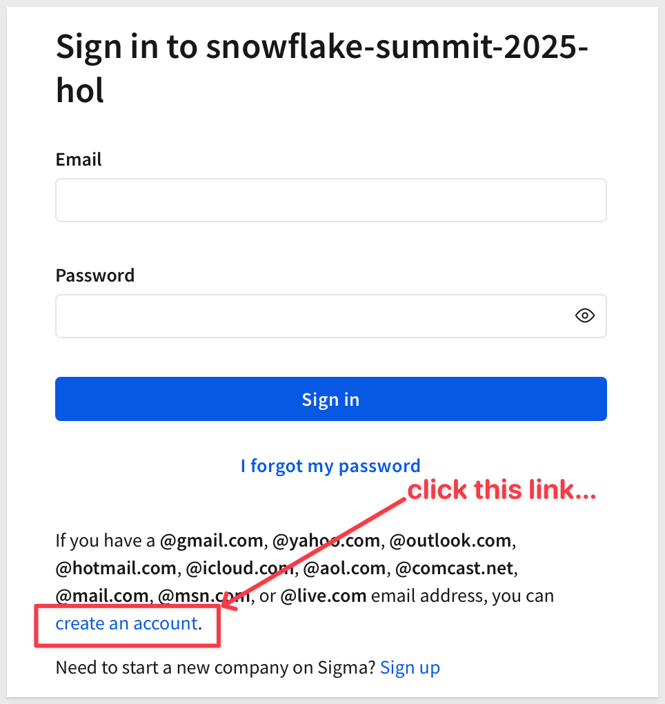

<aside class="positive">
<strong>IMPORTANT:</strong><br> Do not sign up for a new Sigma trial for this lab! Use only the URL and instructions provided by your lab facilitator.
</aside>

We have whitelisted the following domains for this lab:
```code
@gmail.com
@yahoo.com
@outlook.com
@hotmail.com
@icloud.com
@aol.com
@comcast.net
@mail.com
@msn.com
@live.com
```

**Step 3**: Check your inbox for a message from `info@send.sigmacomputing.com` and continue the sign-up process by clicking the link in that email.

**Step 4**: Enter your information as prompted and click `Submit`.

**Step 5**: Once you see the Sigma homepage, you are ready to proceed:

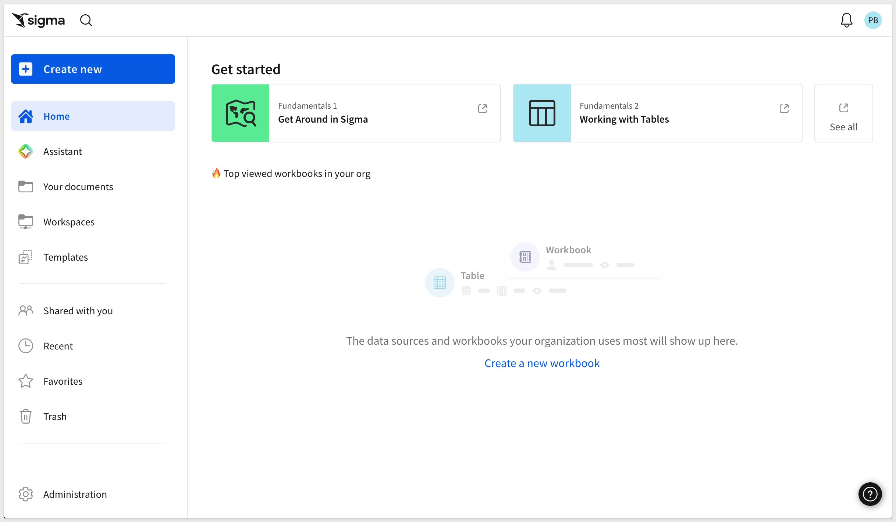

From the Sigma home page, navigate to the templates section and search for and select the `Snowflake Summit 26 - Loss Prevention App Template`:

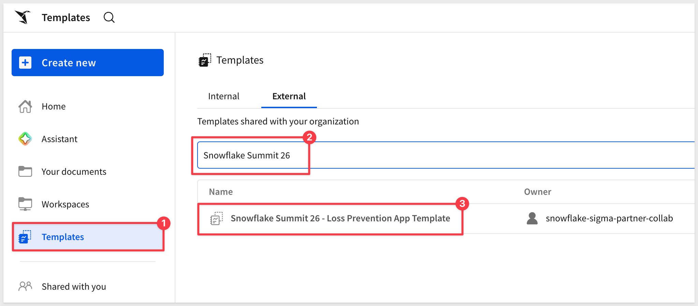

Once you see the `Loss Prevention Application`, click the blue `Explore` button and then `Save as` and save the workbook using the format shown, replacing `{YOUR_NAME}` to create a unique copy:
```copy-code
LOSS_PREVENTION_APP_
```

Once saved, you're ready to proceed!


<!-- END OF SECTION-->

## Module 1: Analytical Audit of Legacy Exception-Based Reporting
Duration: 20

Welcome to the team! As a newly hired Shrink Expert, your first week is focused on getting "the lay of the land." Big Buys has been overwhelmed with security alerts, and you have been brought in to build a superior detection system from the ground up.

Before rolling out new solutions, we must evaluate the legacy tools.

Currently, the company relies on an `Exception Based Reporting (EBR)` dashboard, a system of rigid, hard-coded rules designed to catch theft. While functional, it is creating excessive "noise" leading to a loss of credibility with store managers.

**Goal**:<br>
Pressure-test the existing infrastructure using the `Loss Prevention App v1.0` to determine if flagged transactions are legitimate or if these legacy rules are simply burying managers in unnecessary paperwork.

### Understanding Exception Based Reporting (EBR)

Big Buys currently utilizes four static, threshold-based rules:

- **Rule #1: The "High-Value Void"** - Flags any Void event where the `PRICE is > $500`
- **Rule #2: The "Rapid Scan"** - Flags any transaction where the Inter-Scan Latency (ISL) is `< 1.0 second`
- **Rule #3: The "Extended ISL before Void"** - Flags any Void/Refund occurring after a pause of `> 10 seconds`
- **Rule #4: The "Multi-Override"** - Flags any order containing `more than 2 Override events`

While these catch obvious errors, they lack the nuance required for modern retail.

### Investigate a High-Risk Location

**Step 1**: Locate the `High Risk Locations` table on the main dashboard:


Use the **State** filter to drill down specifically to `Oregon`:

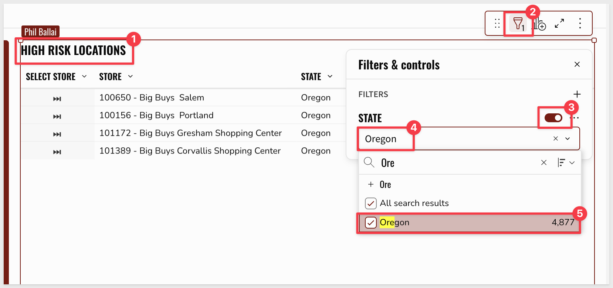

**Step 2**: Observe that `Store 100650 - Big Buys Salem` is flagged as the highest risk location in Oregon, containing the highest volume of flagged transactions:

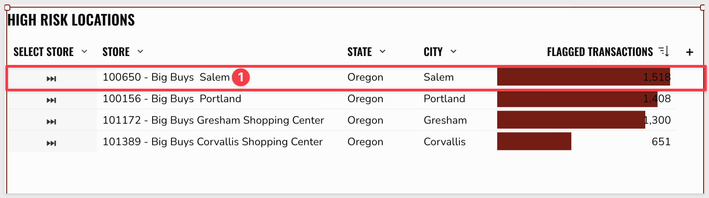

**Step 3**: Click on the `Select Store` column next to `100650 - Big Buys Salem` to filter the entire dashboard to this specific location:

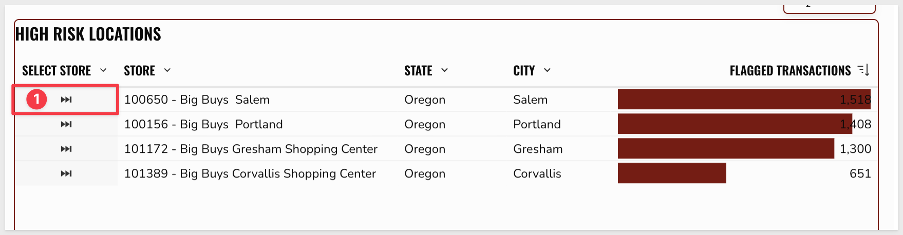

**Step 4**: Review the `Flagged Transactions by Cashier` chart. `Noreen Swift` stands out as the cashier with the highest volume of suspicious activity:


With Sigma, you can click on an element to see the underlying data directly. 

For example, you could could select the bar chart and `Show underlying data` to see the flagged transaction detail data:

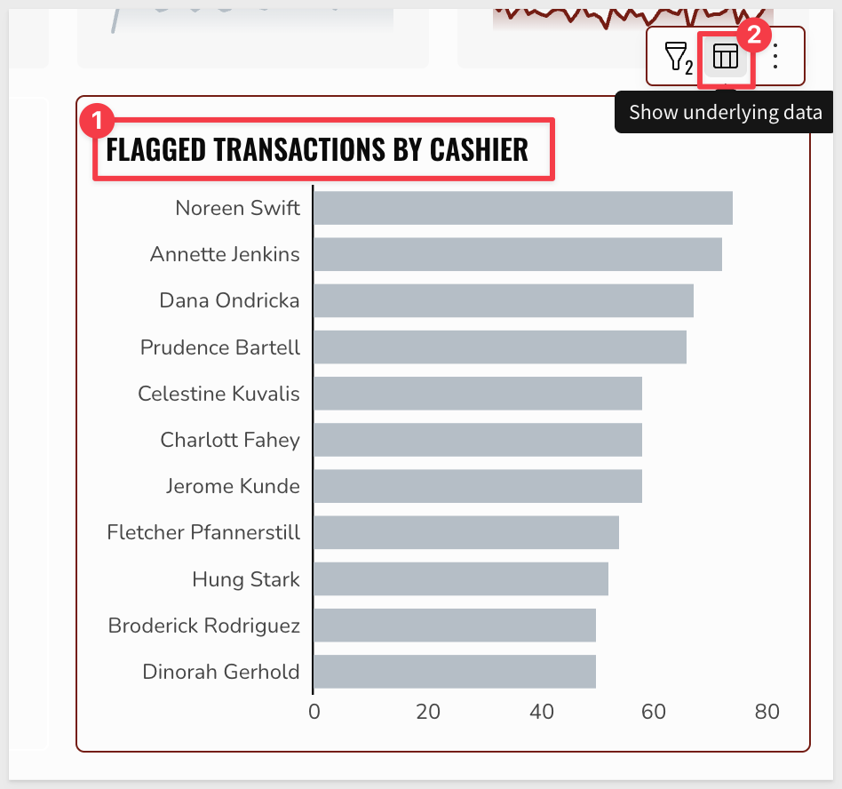

You could do further analysis directly there, or use `AI Agents` as shown in the next step.

Click the `X`` to close the modal:

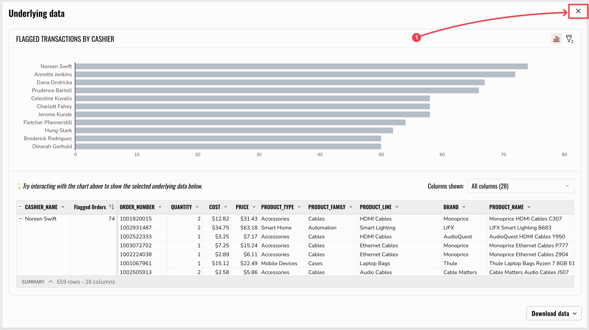

We will use `Sigma Assistant` to investigate Noreen Swift's performance, starting with broad metrics and narrowing our focus.

### Sigma Assistant

**Step 5**: Click the  icon in the upper left corner of the page to return to the homepage and navigate to `Sigma Assistant`. 

Ensure that the Cortex agent named `LOSS_PREVENTION_CORTEX_AGENT` is selected in the agent selection window.

Let's ask a specific question about Noreen Swift:
```copy-code
Summarize Noreen Swift's performance history, her ratings, key strengths, and any notable trends.
```

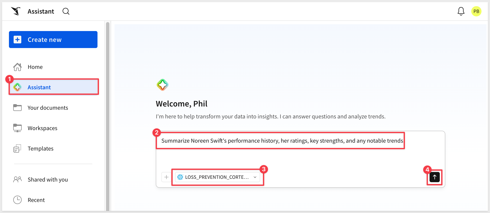

We can see that the agent has summarized her performance with a large number of related statistics. There are a large number of flagged transactions, but we want to dig deeper.

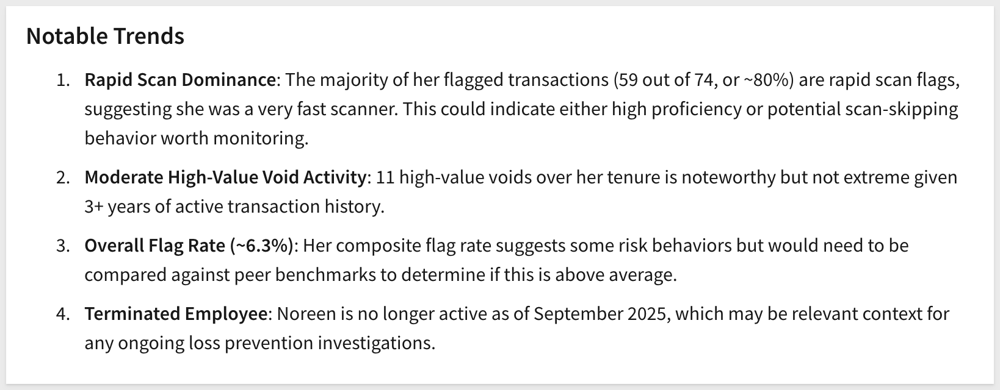

**Step 6**: Ask a follow-up question to see the flags in action:

```copy-code
Show me all the transactions Noreen handled along with the flags.
```

Again, we get a lot of information back, but we will want to dig deeper.

**Step 7**: Click the `Open in Workbook` icon in the Sigma Assistant view to move into a full Sigma workbook for a deeper technical investigation:

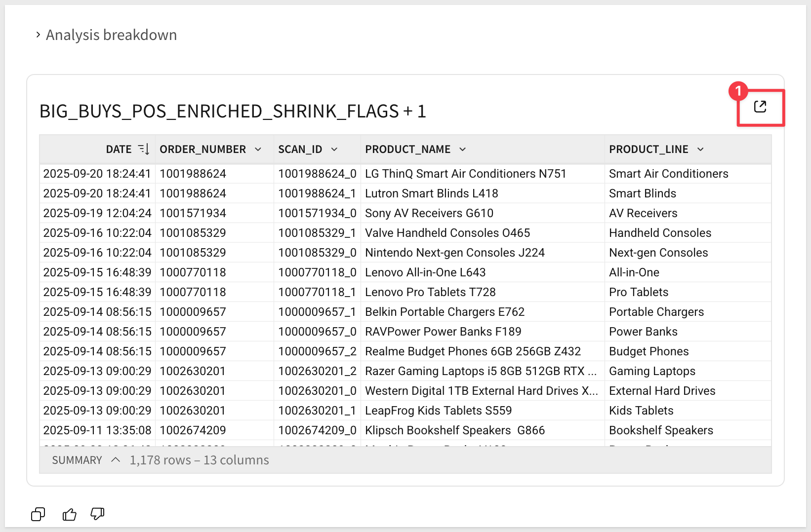

### Analyze a Specific Transaction

**Step 8**: With the workbook open, locate the `HIGH_VALUE_VOID_FLAG` column. Apply a filter to show only records with a `TRUE` value:

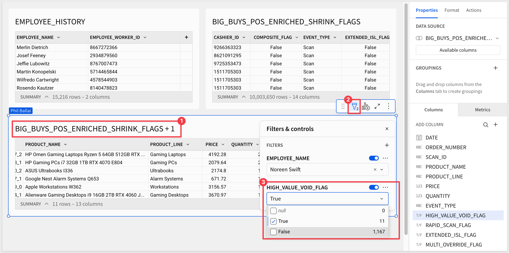

Sort the data by `Price` in descending order to focus on the high-value alerts:

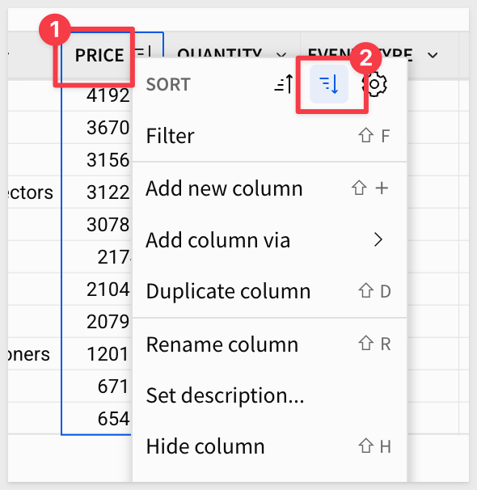

**Step 9**: `Order Number 100284237` stands out. It contains a high-priced item that was voided. Click on the order number and select `Keep only 100284237`.

This creates a specific filter for this transaction:

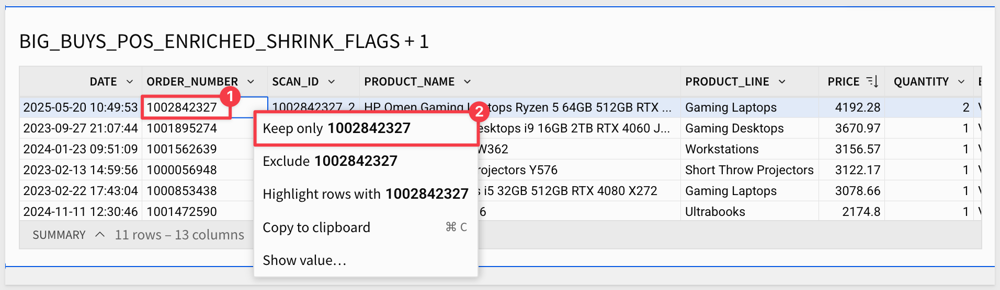

**Step 10**: Disable the filter on `HIGH_VALUE_VOID_FLAG` to view all items within this specific order:

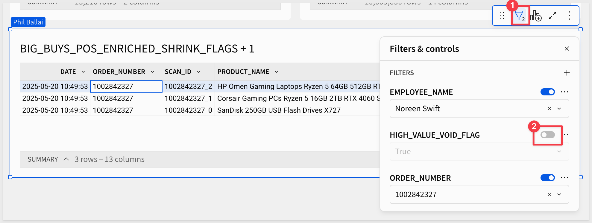

### Key Findings

- **The Alert**: Two HP Omen Gaming Laptops ($4,192.28) were voided
- **The Context**: Also, two Corsair Gaming PCs ($1,450.48) were scanned and paid for:

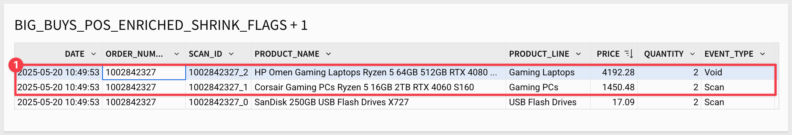

Our static EBR rule flagged the `$3,000+ void` as suspicious immediately. However, in this case, this wasn't "sweethearting" or theft. The customer simply decided the high-end laptop was too expensive after already purchasing a different gaming PC. Noreen Swift followed proper procedure, yet the system flagged her as a risk.

### Conclusion
Static rules create false alerts for employees doing their jobs correctly. To protect Big Buys, we must transition to an **ML-powered Anomaly Detection engine** that can distinguish between suspicious behavior and standard customer exchanges.


<!-- END OF SECTION-->

## Module 2: Unsupervised Machine Learning for Anomaly Detection
Duration: 25

**Objective**: In this module, you will compare the flawed "static rules" from Module 1 with a Python-based machine learning model. You will detect "Sweethearting" by analyzing the time gap between scans (Inter-Scan Latency), a behavioral pattern that is impossible to fake.

### Prepare the Data

**Step 1**: Let's return to our saved workbook by clicking on `Your documents` and selecting the `LOSS_PREVENTION_APP_` with your name that we saved earlier:

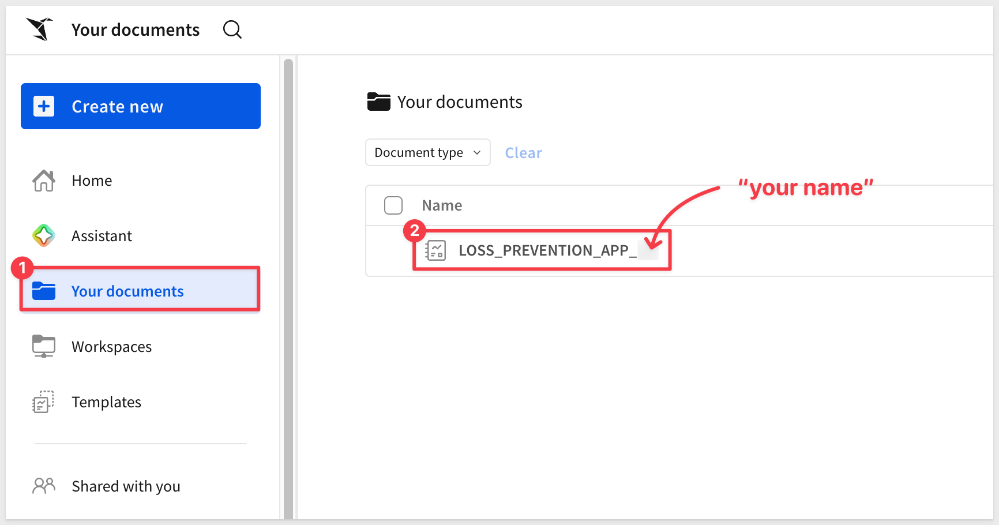

**Step 2**: Place the workbook in `Edit` mode, navigate to the `Anomaly Detection` page.

You will see the POS table (`BIG_BUYS_POS_ENRICHED_SHRINK_FLAGS`) which includes the store filter from Module 1:


<aside class="negative">
<strong>NOTE:</strong><br> If you removed the filter already, just reapply it for `100650 - Big Buys Salem`, as shown in the optional step 3.
</aside>

**Step 3 (if required)**: Add a filter on the `STORE_IDENTIFIER` column. Select `Store 100650 - Big Buys Salem`:


**Step 4**: Create a `Child Table` element from the filtered POS `BIG_BUYS_POS_ENRICHED_SHRINK_FLAGS` table:

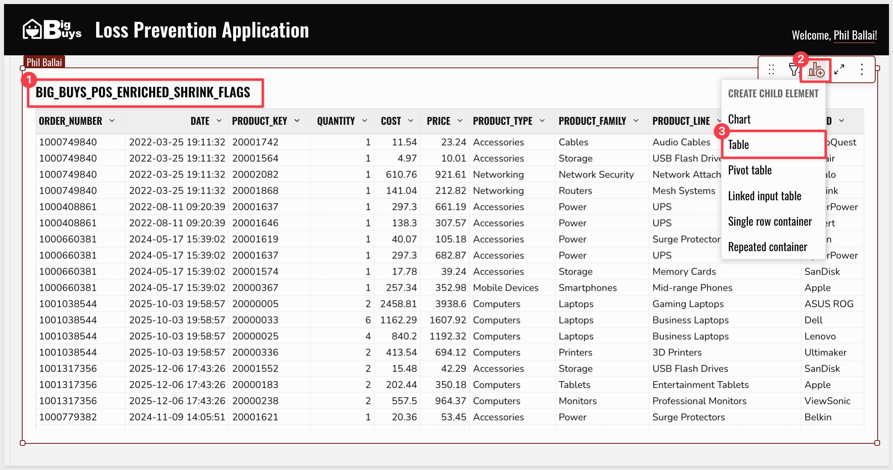

Rename this new table: `BIG_BUYS_POS_PYTHON_TEST`

<aside class="positive">
<strong>NOTE:</strong><br> We will run the Python ML anomaly detection model specifically on this subset of POS data.
</aside>

### Add the Python Anomaly Detection Script

**Step 5**: Add a `Python` element from the `Element bar` > `Data` group, placing it below the `BIG_BUYS_POS_PYTHON_TEST` child table:


The Python script for anomaly detection is provided below. The code is commented so that you can understand how it works:

```copy-code
import pandas as pd

import numpy as np
from sklearn.ensemble import IsolationForest
from sklearn.preprocessing import LabelEncoder, StandardScaler

# 1. Get Sigma data
df = sigma.get_element('BIG_BUYS_POS_PYTHON_TEST').to_pandas()
df['SCAN_TIMESTAMP'] = pd.to_datetime(df['SCAN_TIMESTAMP'])
df = df.sort_values(['ORDER_NUMBER', 'IDX'])

# 2. Behavioral Feature Engineering
# Calculate the raw gap between scans (ISL)
df['ISL'] = df.groupby('ORDER_NUMBER')['SCAN_TIMESTAMP'].diff().dt.total_seconds().fillna(0)

# Calculate ISL Ratio: The core 'Subtle Pause' detector
df['EXPECTED_ISL_SEC'] = df['EXPECTED_SCAN_IN_MILLISECONDS'] / 1000
df['ISL_RATIO'] = df['ISL'] / df['EXPECTED_ISL_SEC'].replace(0, 1)

# Categorical Encoding for Context
le_family = LabelEncoder()
df['FAMILY_ENCODED'] = le_family.fit_transform(df['PRODUCT_FAMILY'])

# 3. Define the Context-Aware Feature Set
# Including TENURE_DAYS prevents flagging efficient veterans
features = ['PRICE', 'TENURE_DAYS', 'ISL', 'ISL_RATIO', 'FAMILY_ENCODED']
X = df[features].fillna(0)

# 4. Train the Isolation Forest
# Contamination set to 1% to isolate the most extreme outliers
model = IsolationForest(contamination=0.01, random_state=42)
df['STATUS_CODE'] = model.fit_predict(X)

# 5. Adjusted Scoring Logic
# Capture the raw anomaly scores (typically between -0.135 and +0.12)
df['RAW_SCORE'] = model.decision_function(X)

# Transform RAW_SCORE to a 0-100 Risk Scale
# Logic: Lower raw scores (negative) = Higher Risk
min_raw = df['RAW_SCORE'].min()
max_raw = df['RAW_SCORE'].max()
df['RISK_SCORE'] = 100 * (1 - (df['RAW_SCORE'] - min_raw) / (max_raw - min_raw))

# Final Status Assignment
df['STATUS'] = np.where(df['STATUS_CODE'] == -1, 'Anomaly', 'Normal')
df['ML_ANOMALY_FLAG'] = np.where(df['STATUS_CODE'] == -1, True, False)

sigma.output('python_output', df)
```

**Step 6**: Copy and paste the code into the Python element, replacing the sample code:

<aside class="negative">
<strong>IMPORTANT:</strong><br> Ensure your naming conventions match the script. If your table names differ from the instructions, you must update the script accordingly to avoid execution errors.
</aside>

**Step 7**: Click `Run` (lower right corner of the element):


Once the output is generated, click on the output result. Create a child `Table` element from the Python output:

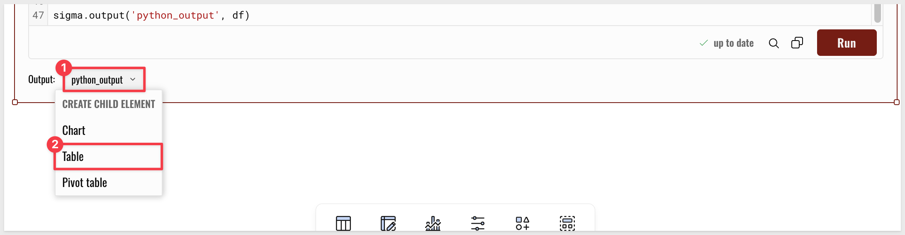

Rename the table `MODEL_COMPARISON`.

### Visualize the Comparison
We will now use this table to visualize the output to compare the Python model against the original static rules.

**Step 8**: Create a child `Chart` from the `MODEL_COMPARISON` table:

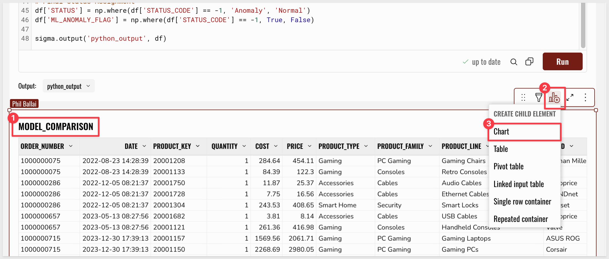

- **Chart Type**: Combo
- **X-axis**: Add `DATE` and Truncate it to `month`

- **Y-axis**: Add `COMPOSITE_FLAG` and name it `Static Rules`
- **Y-axis**: Add `ML_ANOMALY_FLAG` and name it `PYTHON ML`

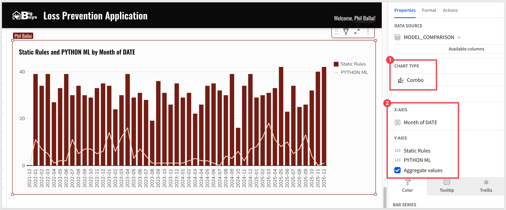

You may want to adjust the bar and line colors to better differentiate them:

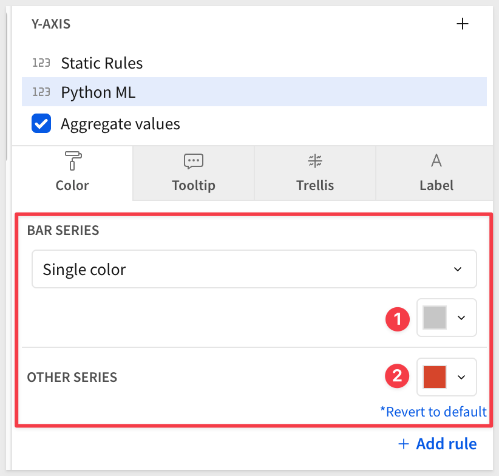

You will likely notice that the Python ML model (the red line) is significantly more selective, reducing the "noise" created by the rigid, hardcoded static rules (the grey bars):


<aside class="positive">
<strong>NOTE:</strong><br> Because running Python on massive datasets can be time-consuming, the model has already been run on the full POS dataset.

A pipeline is now active, refreshing the data nightly. 

Table name: BIG_BUYS_ENRICHED_POS_PYTHON_MODEL
</aside>


<!-- END OF SECTION-->

## Module 3: Introduction to the Integrated Anomaly Resolution Workflow
Duration: 20

In this module, we will review a WIP version of the `Loss Prevention App V2.0` which will allow store managers to **act on these insights immediately,** closing the loop between detection and resolution.

### Update High Risk Locations Table

Select the `App v2.0` page to see the `High Risk Locations` table. (The underlying source has been pre-updated to the Python model output):

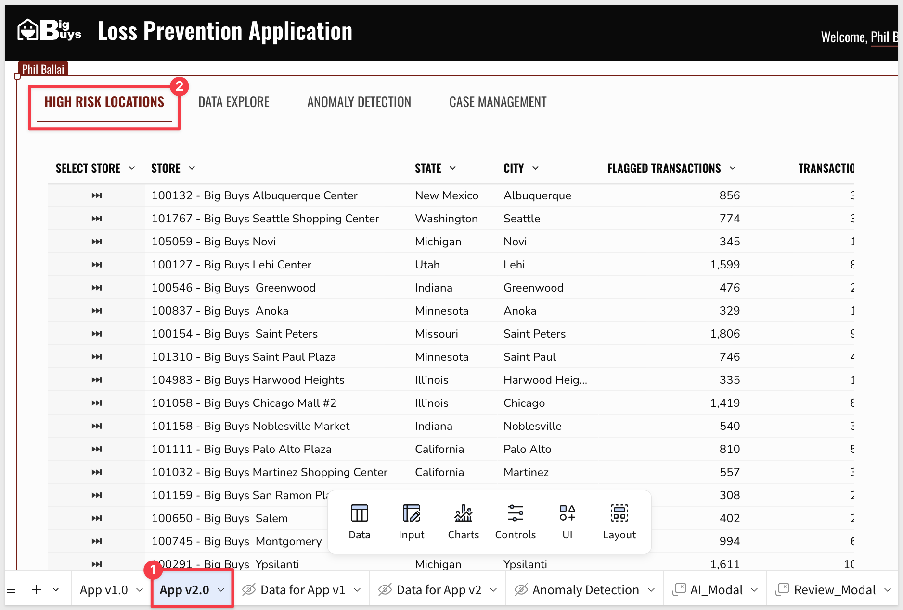

**Step 1**: In the `Element panel` add a new column in the `GROUP BY` > `CALCULATIONS` section named `Transactions`, using the formula:
```copy-code
COUNT([SCAN_ID])
```


**Step 2**: Set `Transactions` to use a whole number format:


**Step 3**: Add a third column calculation named `PERCENT FLAGGED` using the formula:
```copy-code
[FLAGGED TRANSACTIONS] / [TRANSACTIONS]
```

**Step 4**: Change the `PERCENT FLAGGED` column to use `%`:

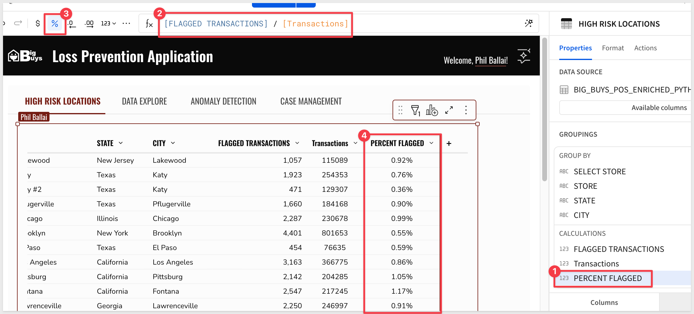

**Step 5**: `Sort` the table by the `PERCENT FLAGGED` column in descending order to prioritize high-risk stores:

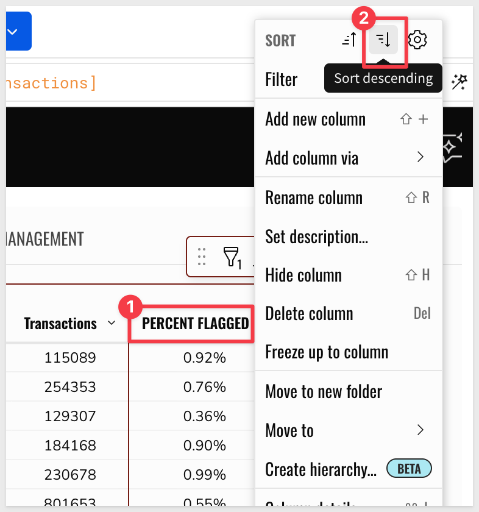

**Step 6**: Add `Conditional formatting` to the `PERCENT FLAGGED` column:

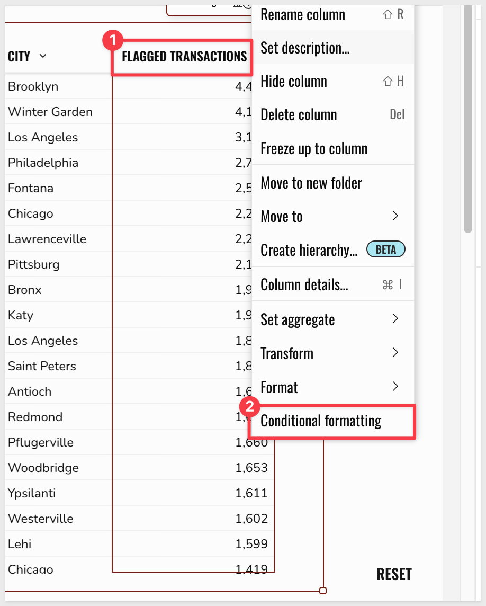

Add `Format type` > `Color Scale` > `Custom` > `Sequential`.

Sigma presents two square boxes that when clicked, allow you to set a custom color.

For the left box, use `#FFFFFF` and for the right, `#761A10`:


`Publish` the workbook and select `Go to published version` before proceeding:

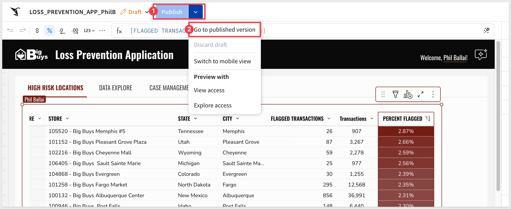

### Review Case Management

Select the `CASE MANAGEMENT` tab:


Clicking on any cell in the `SCAN_ID` column triggers a modal containing an approval workflow.

If the detail information is enough, you can choose to `APPROVE`, `REJECT` or `ESCALATE` a transaction:

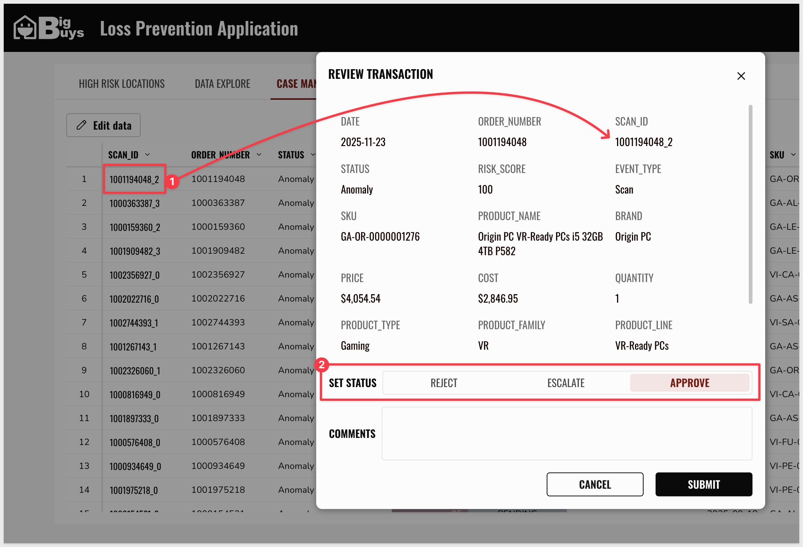

For example, approving a transaction updates the `REVIEW STATUS` column and `COMMENTS` as well.

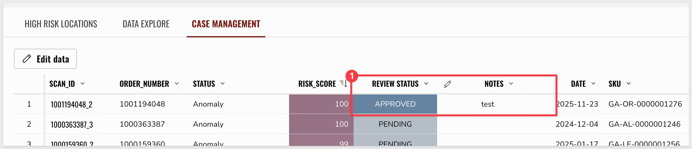


<!-- END OF SECTION-->

## Module 4: Integration of Agentic AI and Natural Language Processing
Duration: 20

In this module, we will add advanced agentic capabilities to streamline the review process. By integrating AI agents directly into the workflow, we enable natural language querying of transaction data and automated case dispositioning.

### Configuration of Custom Sigma Agents

#### Deployment of the Review Assistant

`Close` the current view and place the workbook back into `Edit` mode.

Navigate to the `AI_MODAL` page in the Sigma workbook and follow these configuration steps:

1. Create a `chat element` from the `Element Bar`: select `UI`, and choose `Chat`

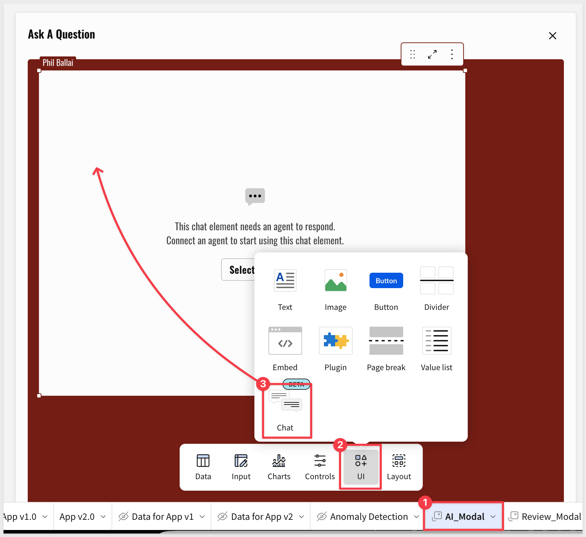

2. In the Chat element, choose `Select agent` and then select `Create a new agent`:

3. Rename the agent from `Agent 1` to `SHRINK_SIGMA_AGENT`.

4. Paste the provided instructions into the `Instructions` field, overwriting the placeholder text:

```copy-code
Role: You are a Fraud & Operations Analyst Assistant. Your purpose is to interpret Isolation Forest Python model results using the analyze_with_cortex tool and execute system actions (Dashboard Updates and Transaction Approvals) within the Sigma environment.

When first invoked, do not run any queries. Just introduce yourself and ask the user how you can help them.

1. Analysis Protocol (Cortex)

- Primary Tool: Use analyze_with_cortex for ALL analysis and data interpretation tasks.
- Analyst Routing: Direct all Python-related or model-output questions specifically to the ISOLATION_FOREST_MODEL_OUTPUT_INTERPRETER analyst.
- Logic Overrides:
  - ISL (Inter-Scan Latency): An ISL of 0 seconds indicates the first item scanned. Treat ISL 0 as legitimate. Do not flag or interpret it as an anomaly.
- Evaluation Requirements: When an Order Number is queried, you must analyze all associated records (both "Anomaly" and "Normal").
  - Itemization: List details and status for every record in the order.
  - Anomaly Attribution: Explain specific triggers using raw scores, risk scores, and context.
  - Comparative Analysis: For "Normal" records, explain why they fell below the risk threshold relative to the flagged items.

2. Dashboard Control Logic (Sigma Actions)

When a user requests to filter or update the dashboard for a specific store, apply the following logic:
- Numerical Input: If the user provides a 6-digit number (e.g., 100060), map this to the STORE_KEY control.
- Text Input: If the user provides a location name (e.g., "Big Buys Salem"), map this to the STORE_NAME control.
  - Note: All stores follow the naming convention "Big Buys [City]".
- Fallback Mechanism: If a control change returns "No Data" or the store cannot be identified, provide the user with 3 relevant store options to choose from.

3. Case Management & Approvals

- Workflow: To review flagged transactions, access the CASE MANAGEMENT table.
- Pre-Action Requirement: You must select the record and ask the user clarifying questions before modifying any data in the CASE MANAGEMENT input table.
- State Management: After any update to the CASE MANAGEMENT table, you must trigger a data refresh to ensure the user sees the most up-to-date information.
```

5. On the right under `Configure` > `Data elements` use the `+` to add `CASE MANAGEMENT` from the `App v2.0` page.

6. Under `Warehouse agents`, select `LOSS_PREVENTION_CORTEX_AGENT`:

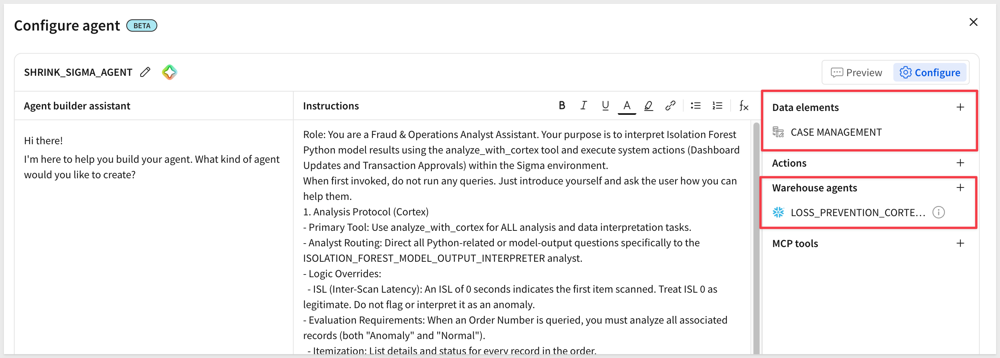

7. Now let's add and configure an action to update the `CASE MANAGEMENT` input table based on user response to the agent:

- Add a tool named `Status update`<br>
- Add instructions: `Update the status and comments in the case management input table`<br>
- Add a `Step`<br>

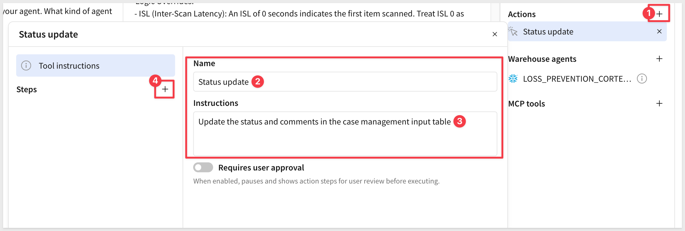

- For `Step type` select `Run an Action`.<br>

- For `Action`, choose `Update rows(s)`.<br>

- For `In`, we will update rows in the `CASE MANAGEMENT` on the `App v2.0` page.<br>

- For `Update Row(s) by` select `Single row`.<br>

   - `SCAN_ID` will be preselected as the row. 
   - Choose `Agent Input` as the field 
   - `Input value` as the value<br>

- For `Update with value(s)`:<br>

   - `NOTES` / `Agent Input` / `NOTES`<br>
   - `REVIEW_STATUS_UPDATED` / `Agent Input` / `REVIEW_STATUS_UPDATED`

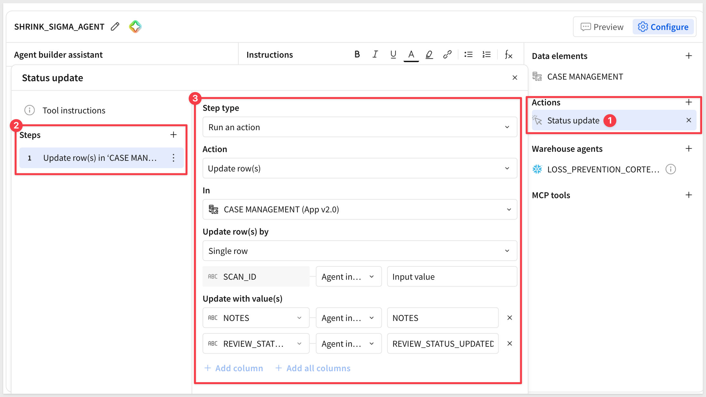

8. Click `Save` and then `Publish` and `Go to the published version`.

9. Now let us test the agent's workflow:
   - Invoke the agent by clicking the agent icon (message icon) in the top right corner of `App v2.0`:

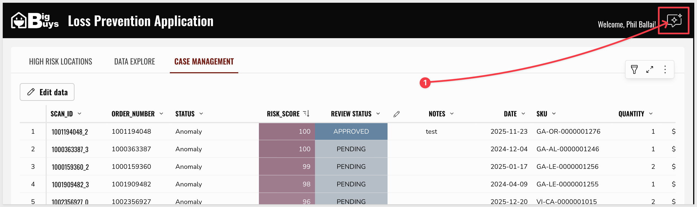

- The agent introduces itself and asks how it can help. Enter the following prompt:

```copy-code
Show me the most risky transaction at the store in Salem.
```

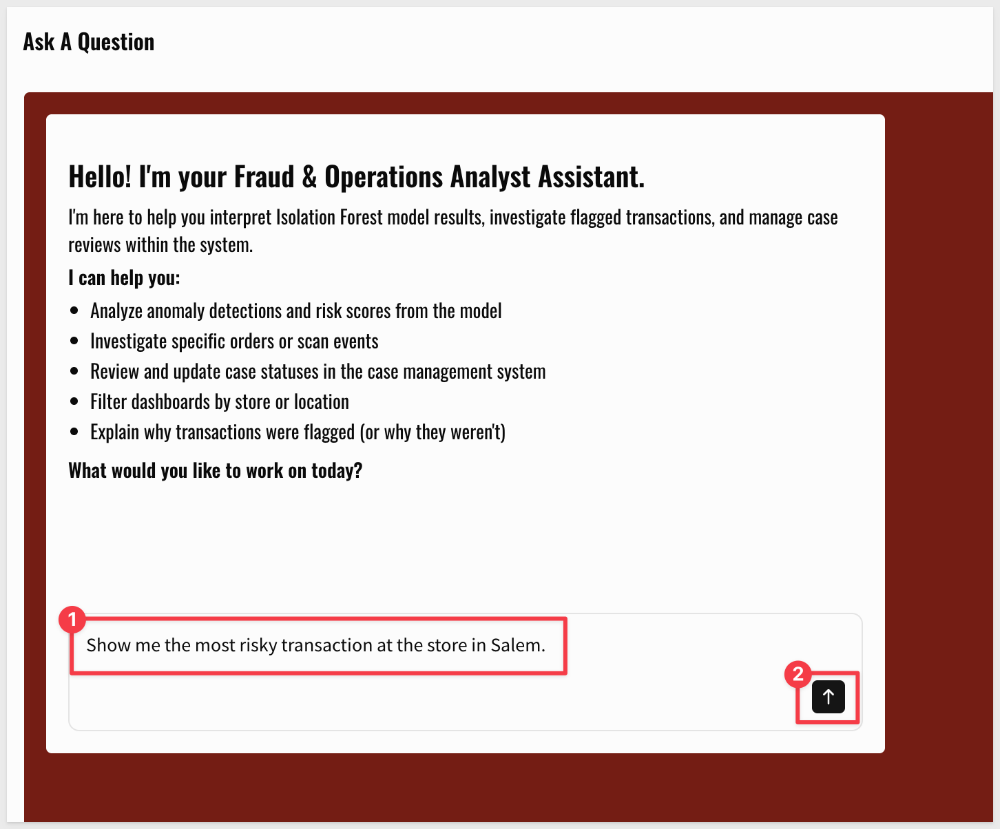

- The agent returns a breakdown of the highest-risk scan with suspicious patterns called out:

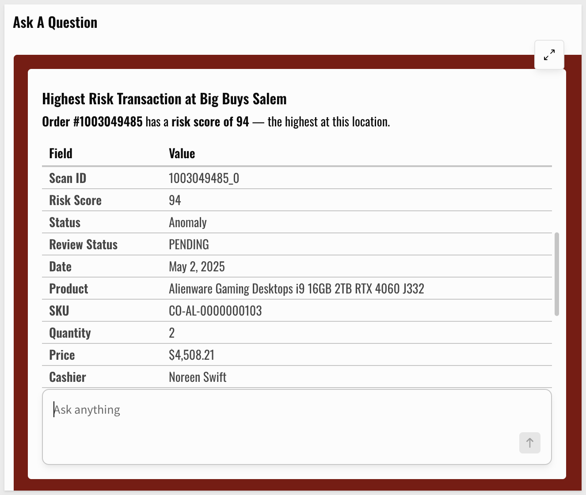

- This transaction looks suspicious. Ask the agent to escalate it:

```copy-code
This order looks suspicious. Escalate the transaction.
```

- The agent asks for clarification before executing. 
   
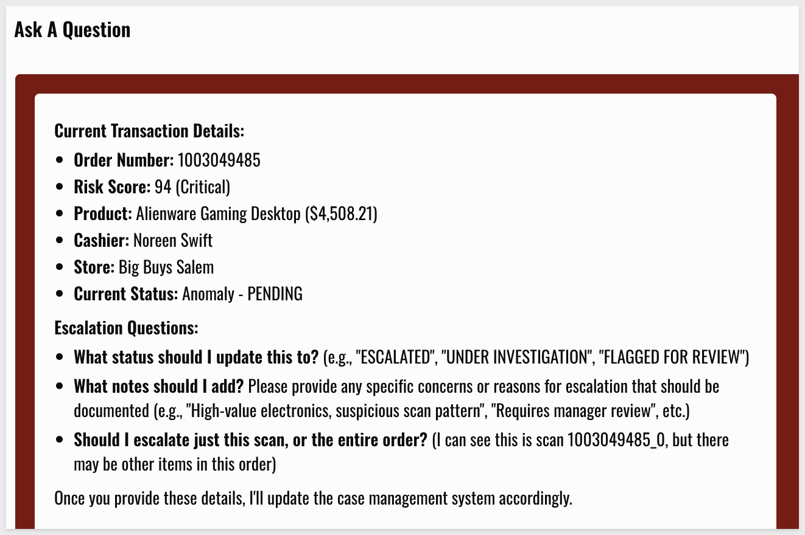
   
   
Use the following prompt:

```copy-code
Use ESCALATED as the status. For Notes, use your best judgement. Escalate only the specific scan.
```

- Once the agent completes the action, close the agent window:

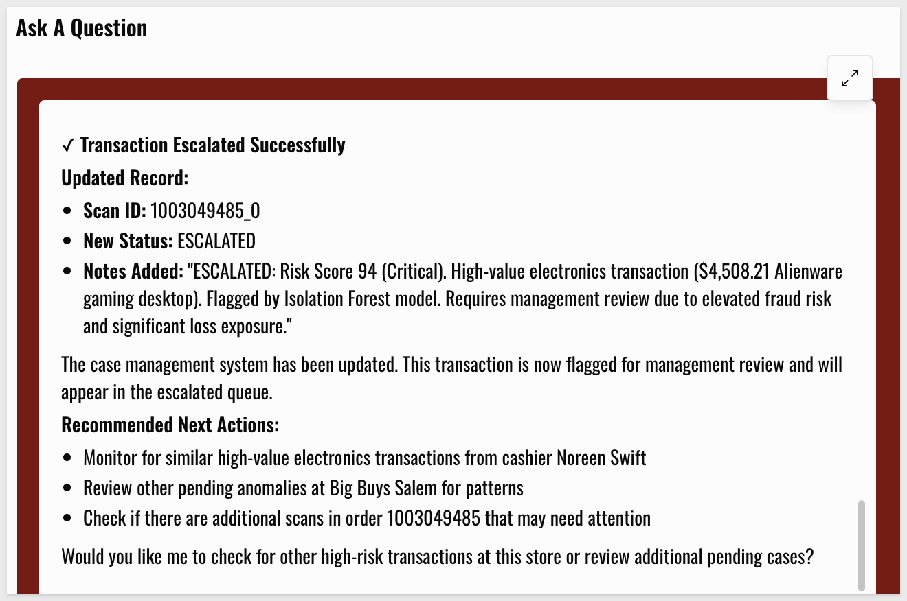

- Navigate to `CASE MANAGEMENT` and filter the table to the `SCAN_ID` returned by the agent to confirm the status and comment have been updated:

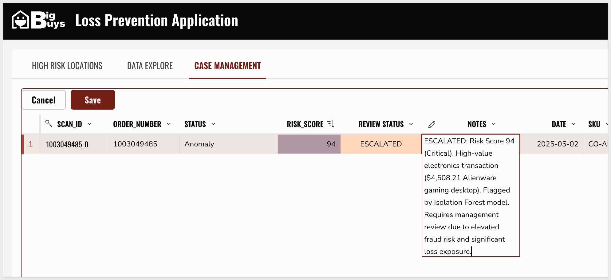

<aside class="positive">
<strong>NOTE:</strong><br> This enables the Sigma custom agent to utilize the Snowflake Cortex Agent for advanced data interpretation and analytical tasks.

Sigma is very flexible and this design pattern is just one of many possible ways to bring the power of Cortex to business users.
</aside>


<!-- END OF SECTION-->

## Share and Export
Duration: 5

Now that your `Loss Prevention App V2.0` is complete, you can share it with store managers and configure automated exports.

### Set up Email Burst

**Step 1**: Set up the email burst:

- Select `Share and Export` > `Scheduled Export`:


Click `Create New schedule`.

Select `Export as email burst`:


**Step 2**: Configure the recipients.

**Step 3**: Select `App v2.0 - CASE MANAGEMENT` as the attachment and click `Create`:

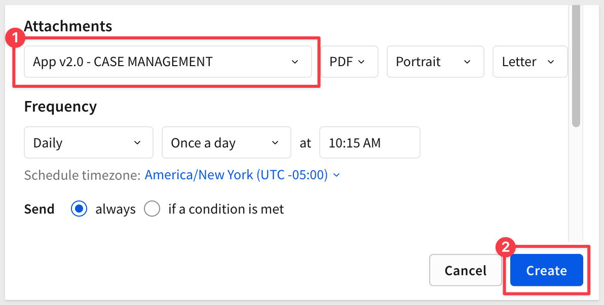

The export gives you a list of `flagged transactions` with the relevant `Review Status`.

<aside class="positive">
<strong>CUSTOMIZED COMMUNICATIONS:</strong><br> Beyond basic email bursts, Sigma's Report Builder enables you to send highly customized, structured reports to individual store managers.

Using Reports, you can create formatted, interactive PDFs with specific filters pre-applied per recipient—ensuring each manager receives only their store's flagged transactions with relevant context, visualizations, and actionable insights.

This transforms raw data exports into professional, role-specific communications that drive immediate action at the store level.
</aside>

For more information, see [Reports overview](https://help.sigmacomputing.com/docs/reports-overview)

There is also a QuickStart, [Fundamentals 11: Pixel Perfect Reporting](https://quickstarts.sigmacomputing.com/guide/fundamentals_11_pixel_perfect_reporting/index.html?index=..%2F..index#5)


<!-- END OF SECTION-->

## What We've Covered
Duration: 5

In this workshop, you successfully transitioned a legacy retail security strategy into a high-precision, AI-integrated operational platform. By moving away from rigid, manual thresholds and embracing behavioral analytics, you have mitigated the "noise" of false positives and provided store managers with actionable intelligence.

### Core Achievements

- **Audit of Legacy Heuristics**: You exposed the inherent flaws in traditional "Exception Based Reporting" (EBR). By investigating specific cases, you demonstrated how static rules often penalize standard customer behavior or procedural adjustments rather than actual theft.

- **Implementation of Behavioral Analytics**: You deployed a `Python-based Anomaly Detection Engine` to analyze `Inter-Scan Latency (ISL)`. This shifted the focus from static dollar amounts to behavioral patterns, successfully isolating "Sweethearting" signatures that are statistically impossible to replicate through legitimate scanning.

- **Contextual AI Interpretation**: You utilized `Agentic AI` to bridge the gap between complex data science and operational reality. By configuring a `Cortex-powered Chat Agent`, you enabled the system to translate raw anomaly scores into natural language narratives, providing managers with the "why" behind every alert.

- **Operational Loop Closure**: You transformed a static dashboard into a functional `Case Management Application`. By utilizing `Input Tables` and `Custom UI Elements`, you established a workflow where anomalies can be reviewed, approved, or escalated in real-time, ensuring that insights drive immediate store-level action.

### Technical Conclusion

You have successfully engineered `Loss Prevention App V2.0`. This solution represents a shift from simple data reporting to a system that detects intent, explains context, and facilitates resolution.

### Additional Resource Links

[Blog](https://www.sigmacomputing.com/blog/)<br>
[Community](https://community.sigmacomputing.com/)<br>
[Help Center](https://help.sigmacomputing.com/hc/en-us)<br>
[QuickStarts](https://quickstarts.sigmacomputing.com/)<br>

Be sure to check out all the latest developments at [Sigma's First Friday Feature page!](https://quickstarts.sigmacomputing.com/firstfridayfeatures/)

[](https://twitter.com/sigmacomputing)&emsp;
[](https://www.linkedin.com/company/sigmacomputing)&emsp;
[](https://www.facebook.com/sigmacomputing)


<!-- END OF WHAT WE COVERED -->
<!-- END OF QUICKSTART -->
