summary: simga_retail_&_cpg_series_:_retention_analysis
id: simga_retail_&_cpg_series_:_retention_analysis
categories: snowflake
status: Published
feedback link: https://github.com/sigmacomputing/sigmaquickstarts/issues
tags: Getting Started, Analytics, Data Engineering, BI, Business Intelligence, Sigma, Sigma Computing, Snowflake, Dashboarding, Visualization, Analysis, Excel, Spreadsheet
authors: Kelsey Hammock, Sigma Computing

# Sigma Retail & CPG Series: Retention Analysis
<!-- ------------------------ -->
## Overview 
Duration: 5

 This lab focuses on the end-user analytics experience in Sigma. You will be playing the role of a marketing analyst undertaking exploratory analysis on customer retention rates. Traditionally, this type of analysis requires a significant effort and advanced SQL knowledge, but Sigma empowers business users to quickly derive these insights on their own.

This lab is intended to showcase advanced features such as cross-level aggregate calculations, extracting values from JSON, Tracing lineage in Sigma, and showing different paths an analyst can take to achieve their goals. 

### Prerequisites
- This lab is designed to be stand alone, and does not require pre-modeling of data. All you will need is access to a Sigma environment.  

### What You Will Learn 
- How to build a workbook from the data source up
- How to parse JSON using Sigma's UI
- How to filter datasets & workbook pages
- How to build child tables at different levels of aggregation 
- How to track lineage
- How to build pivot tables for advanced analysis  

### What You’ll Need 
- Access to a Sigma instance with Creator priviledges

### What You’ll Build 
- In this lab you will build a retention analysis including pivot tables with custom formatting. 

<!-- ------------------------ -->
## Setting up the Workbook 
Duration: 10

1. From the Sigma home page click the “Create New” button in the top left corner and select “Workbook”

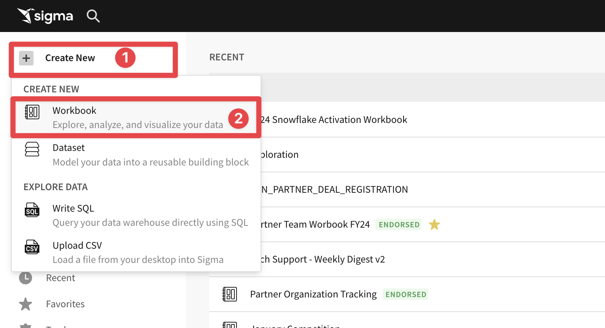

2. Now that you are in the Workbook, let’s start by saving it with the name “Retention Analysis - YOUR NAME ” by clicking “Save As” in the top right.

3. Now that the workbook is saved lets rename the page the by double clicking the page name in the bottom left corner and changing it to “Data”.

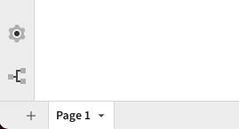

4. On the left side of the screen click on the “Table” button to add a new table element to the workbook. Then select “Tables and Datasets” from the source options.

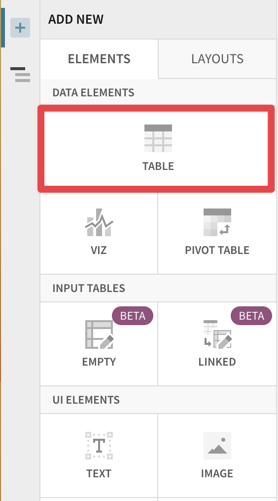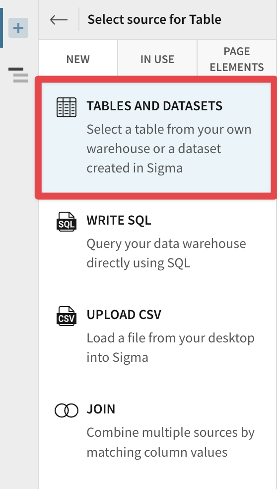

5. You will now see the data source selection page. On the left side navigate to “Sigma Sample Database” → “EXAMPLES” → “PLUGS_ELECTRONICS” → “PLUGS_ELECTRONICS_HANDS_ON_LAB_DATA” and select it. A preview of the table will show up and then click “Done” in the top right corner.

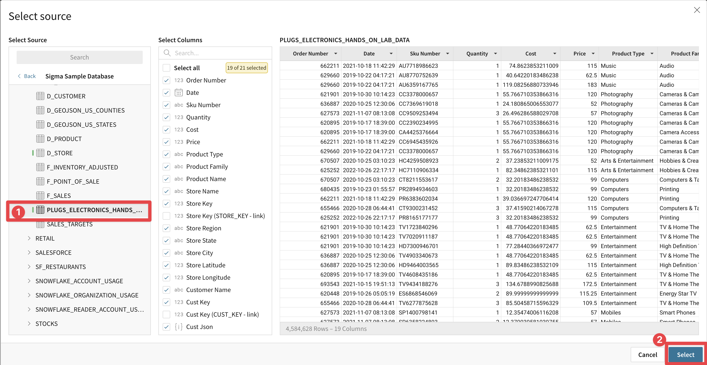

6.  You will now be back in on the Workbook with the newly created table element. Double click the table’s title and rename it to “Base Table”.

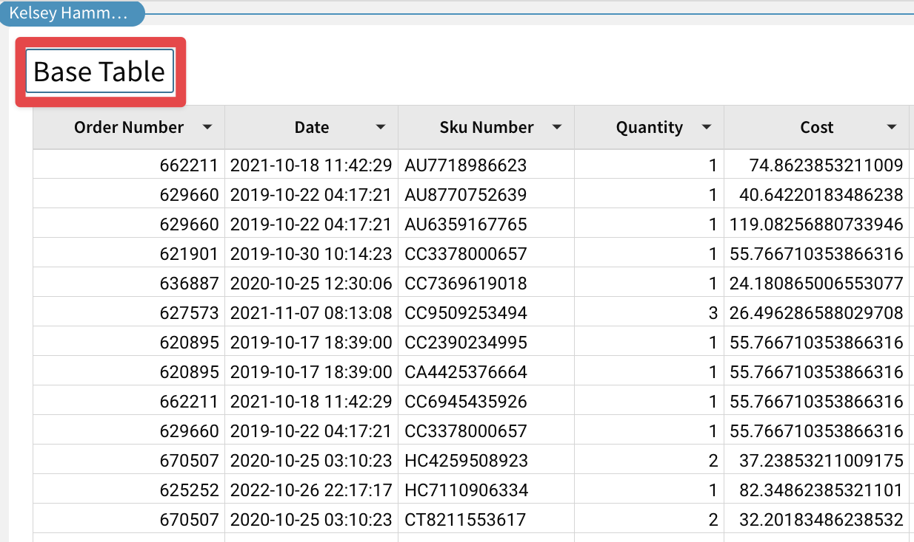

<strong>Best Practice</strong>: It is a best practice to start your analysis in your workbook with base tables, and create child elements from there. This provides maximum flexibility and control when adding filters, creating columns that are reused, or using parameters that will impact multiple elements. In the next several steps, we’ll make some small changes to the table that we want to see in all future workbook elements.

7. On the Date column right click navigate to “Truncate Date” and then select “Day”. This will remove the timestamp and leave us with just the date. Then rename this column by double clicking on the header and typing “Purchase Date”.
<strong>Pro Tip</strong>: Sigma Hot Keys can get you far. To rename a column, hit “Shift + r”. You can always see the full suite of Keyboard Shortcuts by typing “Command + /”.

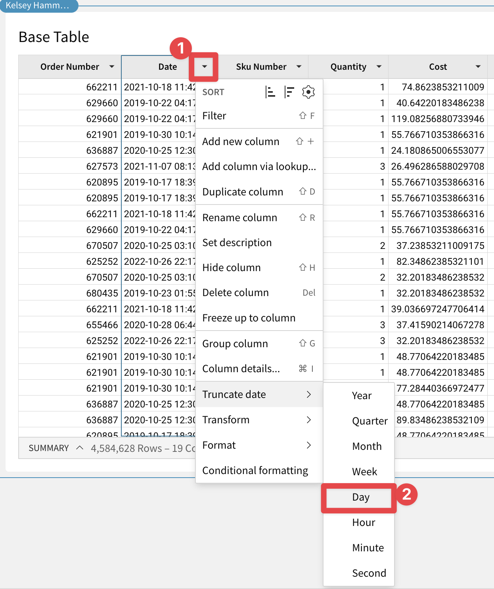

8. Select the “Cost” column and then select the currency button next to the formula bar. Repeat this step for “Price” as well.

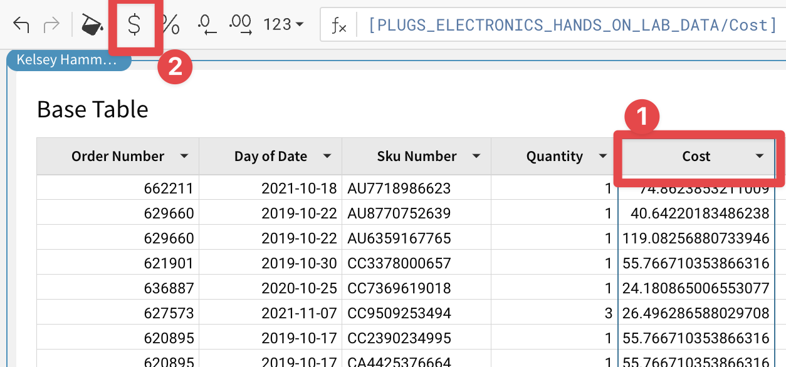

9. Click the arrow next to “Price” and select “Add Column”.

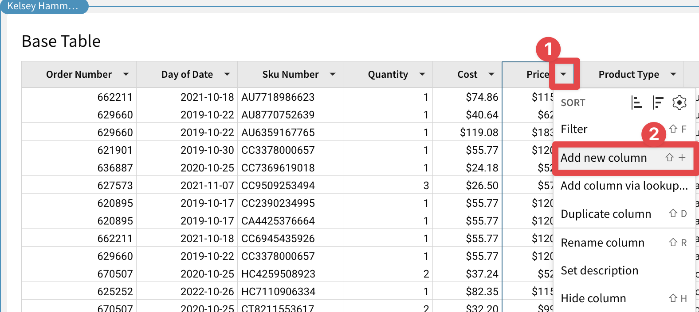

10.  In the formula bar type “[Quantity] * [Price]”. Then rename the new column to “Revenue” by double clicking on the title.

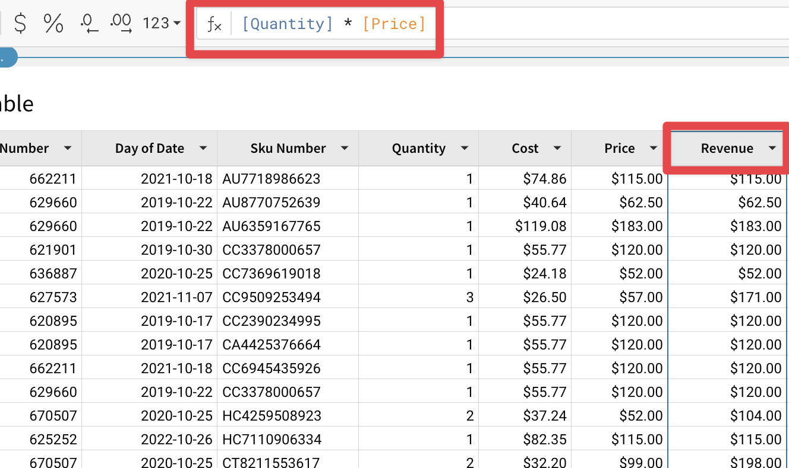

11.  Repeat the previous two steps for the following columns:

- “COGS” : “[Quantity] * [Cost]”
- “Profit” : “[Revenue] - [COGS]”

12. Now click the arrow next to “Cust Json” and select “Extract Columns”.
This will allow us to parse columns from the Json Object. Go ahead and select “Age_Group” and click confirm. You now have a column for the customers age grouping for the purchase records.

13. Now click the arrow next to “Cust Key” and select “Group Column”. This will organize the records in the table by their associated “Cust Key” and provide us a starting point to build aggregate calculations.

14. Now that the records have been grouped click the arrow next “Cust Key” and select “Add Column”. Type “Min([Purchase Date])” in the formula bar and name this column “First Purchase Date”.

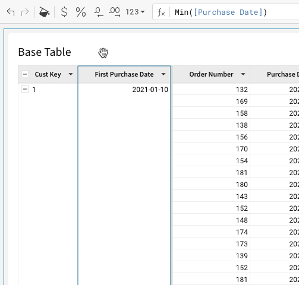

15. Add another column to the right of “Cust Key” with the formula “sum(Revenue)”. Rename this column to “Customer Revenue”.
<strong>Pro Tip</strong>: For simple aggregate functions like this, you can drag the column in the left side control panel into the “Calculations” section of the Cust Key grouping, or click the “Add Calculation” + sign.

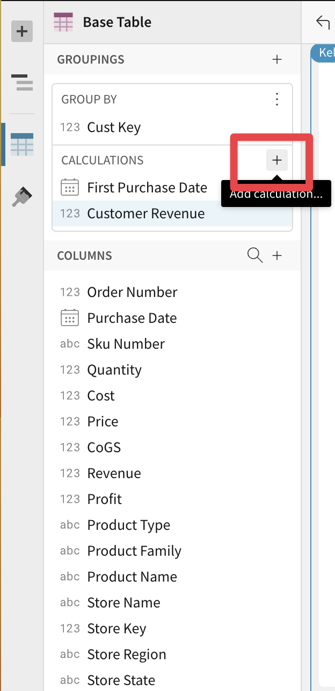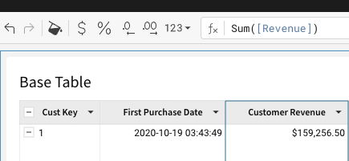

16. At this point we have performed a grouping and built two aggregate calculations. These steps are being translated into machine generated SQL which queries the CDW. The SQL that is being generated is the equivalent of “Select Cust Key, min(purchase date) as First Purchase Date, sum(revenue) as Customer Revenue from Table group by Cust Key”
<strong>Pro Tip</strong>: You can always see the SQL that Sigma is Generating by clicking the circular arrow icon in the top right corner.

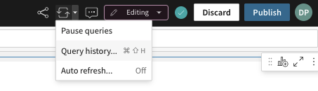

17. Click the arrow next to “Customer Revenue” and select “Column Details”. This will pop up a modal with profiled information of the dataset. You are able to view metrics such as row count, distinct count, null count as well as statistical metrics. In practice this is a very helpful tool to quickly and efficiently the data in any given column. Take note of the min and max values.

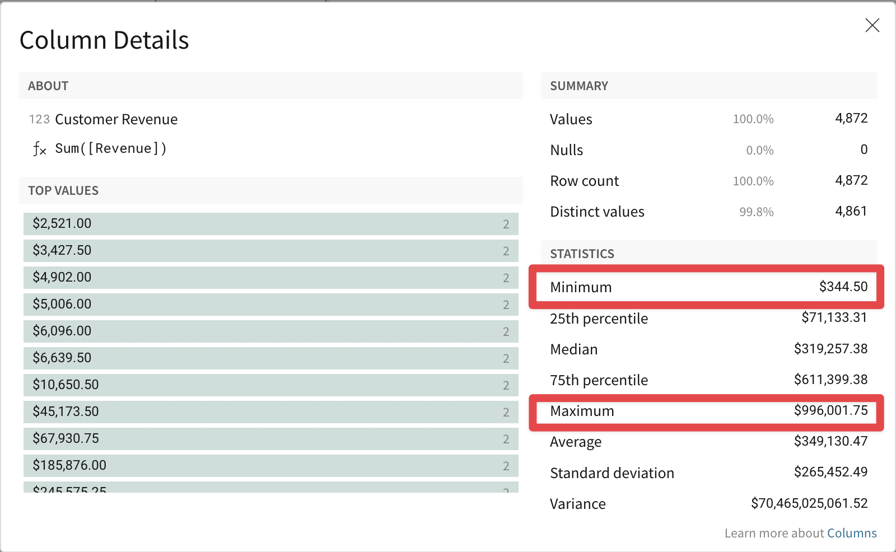

18. Now we are going to calculate a bin metric that will group values together based on their distribution into a number of specified ranges. Let’s add one more column off of “Cust Key” with a formula of “BinFixed([Customer Revenue], 300, 1000000, 10)” and name it “Customer Revenue Bin”, finally select the number icon next to the formula bar and select “Whole Number”.
  

 <strong>A quick explainer on the [BinFixed](https://help.sigmacomputing.com/hc/en-us/articles/360036945034-BinFixed) formula</strong>
This formula organizes your data into the number of “Bins” you are trying to analyze. The inputs for this formula are:

- Value (required): The value for which the bin is computed.
- Min (required): The lower bound. For any value less than this the bin will be 0.
- Max (required): The upper bound. For any value greater than this the bin will be
Bins+1.
- Bins (required): The number of bins to split the value into
In our example, for the min and max we used 300 and 1,000,000 respectively and split the values into 10 bins. We have effectively split the customers into deciles which we will leverage later on in our analysis. 

19. Finally lets collapse the “Cust Key” column to review the grouped calculations that we have created.

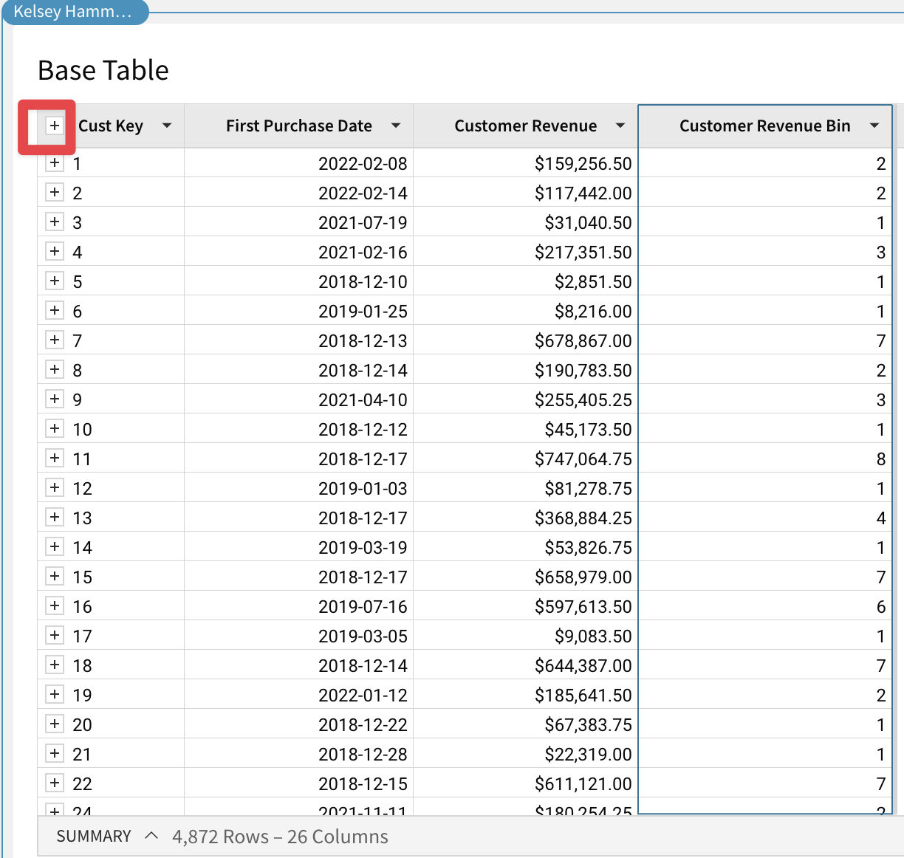

## Building the Retention Analysis    
Duration: 10

1. With our base table still collapsed, hover over the top right of the “Base Table” element, select the “Create Child Element” icon and click “Table”. Then rename the new table “Retention Analysis Base Table”.

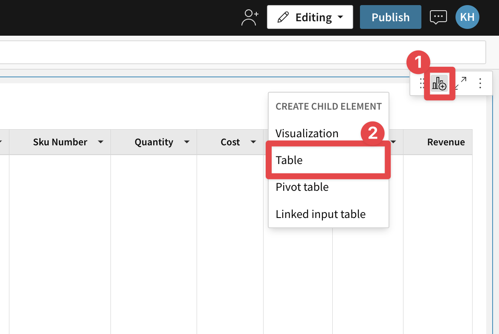

<strong> Note</strong>: A Child Element will inherit the datasource and all filters of its parent. This includes the aggregation level as well. Since the base table’s “Cust Key” grouping was collapsed when the child table was created you will notice that only the first four columns came through.

2. In the bottom left corner of the screen select the lineage icon. This will take you to the lineage view where you are able to see a visual representation of the relationship between the parent and child elements as well as the root datasource. You can exit the lineage view by either clicking the lineage icon in the bottom left again or clicking the “X” icon in the top right.

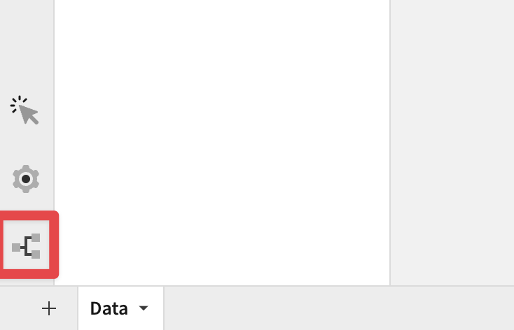
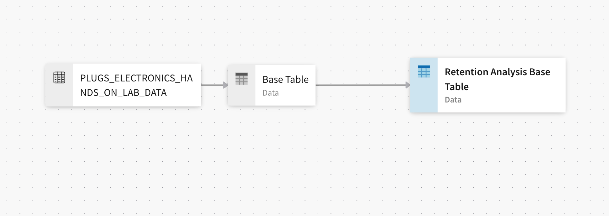

3. Now hover over the top right of the newly created table, select the “Kebab” icon and click “Move to page” → “New Page”.

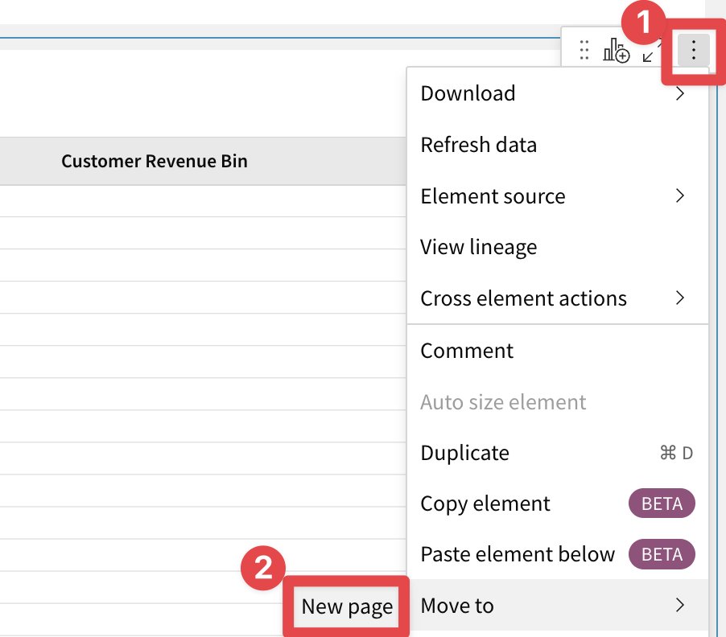

4. Let’s rename this page to “Retention”.

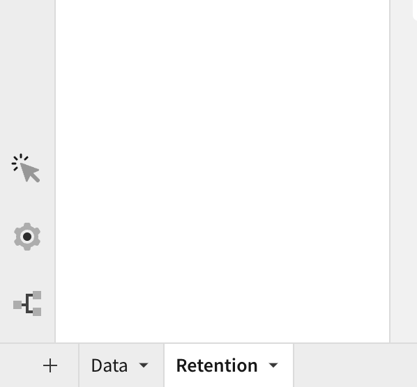

5. Click on the table and expand the data source menu in the bottom left. Change the “Aggregation Level” to “All source columns” and then add the following columns: “Order Number”, “ Purchase Date”, “Product Type”, “Product Family”, “Product Name”, and “Age Group”.

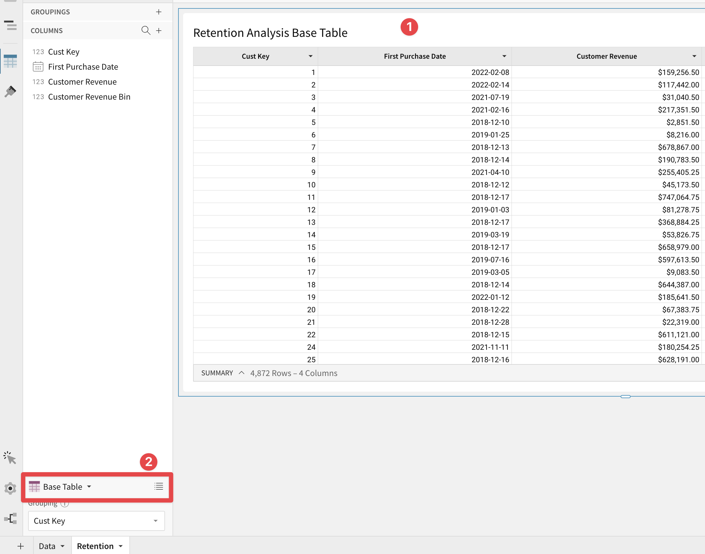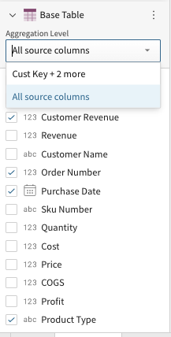

<strong>Note</strong>: The “Retention Analysis Base Table” was created when the “Cust Key” grouping of its parent was collapsed, so the our child table was created at the same level of aggregation as the Parent table. By selecting “All source columns” in the aggregation level we modified the query such that the four columns from the “Cust Key” grouping were applied to all corresponding sale records in a 1 to many relationship.

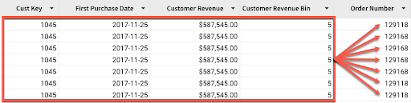

6. Add a column next to “First Purchase Date” with the name “Quarters Out” and the formula “DateDiff("quarter", [First Purchase Date], [Purchase Date])”.

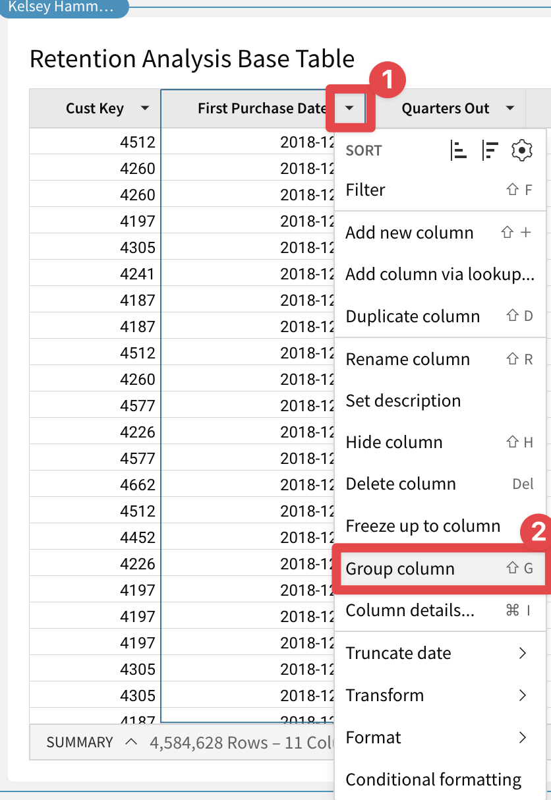

This calculation shows us how many quarters out this purchase record is from the customer’s first purchase, giving us an idea if the customer is still a customer N quarters out from the first purchase date.

7. Click the arrow next to “First Purchase Date” and select “Group Column”. Then click the arrow another time and select “Truncate date” → “Quarter”. Finally rename the column to “First Purchase Quarter".

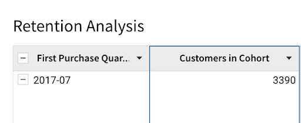

8. Now click the arrow next to “First Purchase Quarter” and add a column with the formula “CountDistinct([Cust Key])” named “Customers in Cohort”.

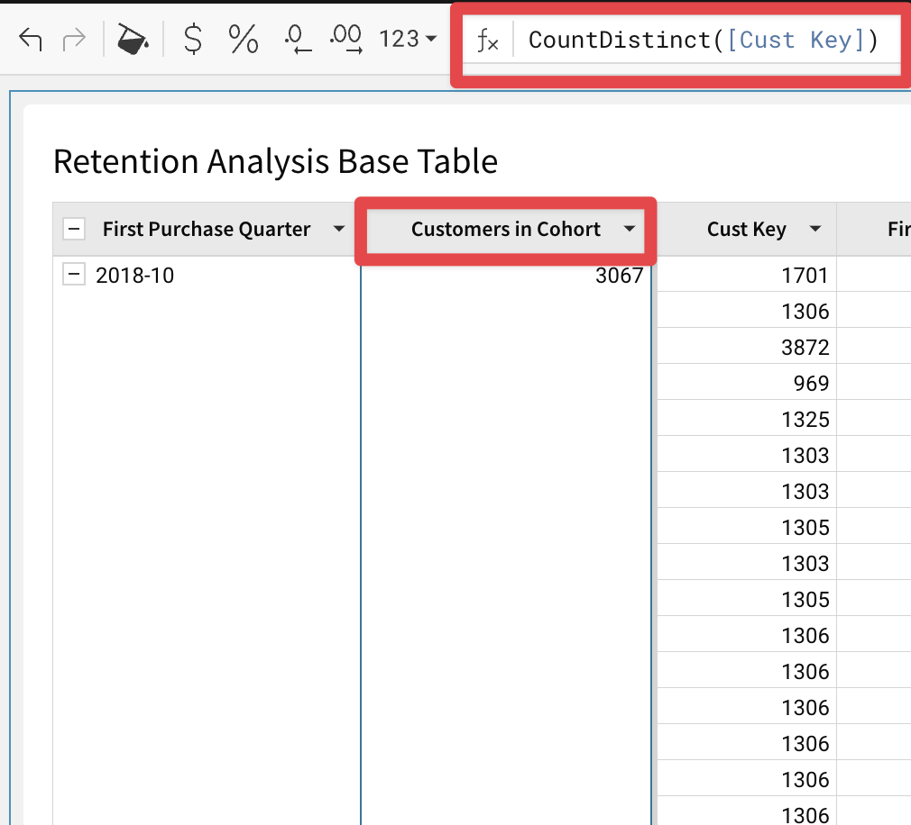

9. Click the arrow next to “Quarters Out” and click “Group Column”. Then add a new column off of it named “Number of Customers” with the formula “CountDistinct([Cust Key])”.

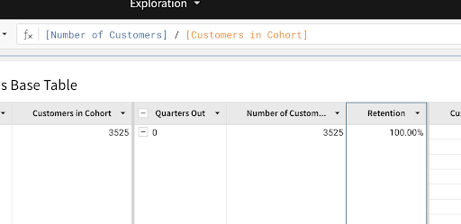

By building another grouping on “Quarters Out” we now have two aggregation levels. In Sigma you are able to create any number of groupings and then leverage aggregate calculations across those different levels.

10. Next add another column in the “Quarters Out” grouping with the formula “[Number of Customers] / [Customers in Cohort]” named “Retention” and format it as a percentage.

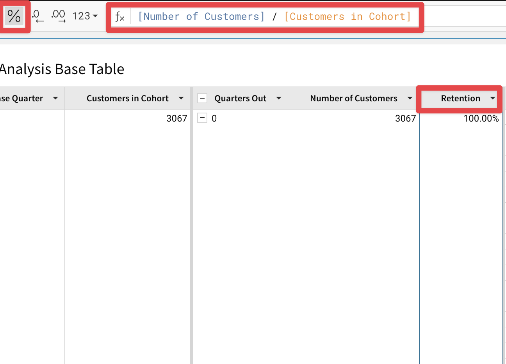

11. In Sigma you can easily add column formatting to tables as you see fit. Let's add data bars to the “Retention” column by right clicking it and selecting “Conditional formatting”. This will pop out the formatting pane on the left side of the screen, select the “DATA BARS” tab strip to apply them to the column.

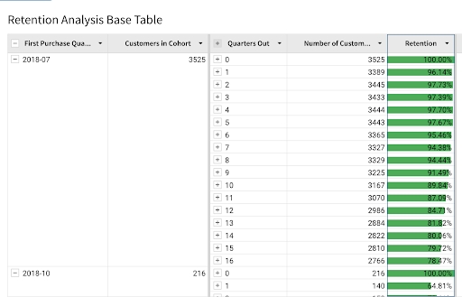

12.  Finally collapse the “Quarters Out” grouping, You will now be able to see customer retention percentages N quarters out for customers who first purchased their first items at the same time.

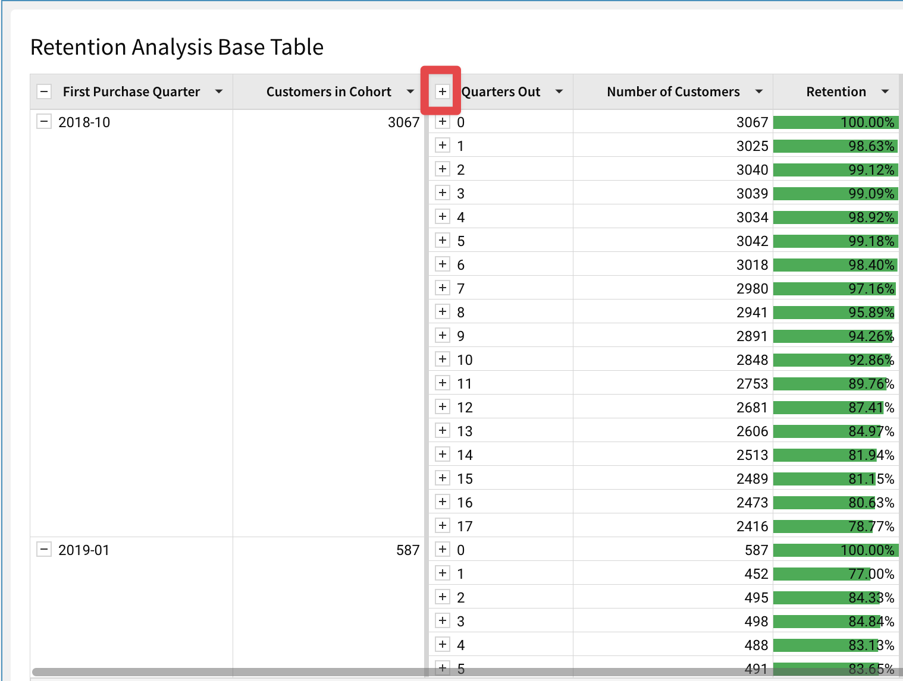

## Visualizing in a Pivot Table
Duration: 5

Let's take our analysis a little further and build out a pivot table to better visualize this data. 

1. First re-expand the “Quarters Out” grouping by clicking the plus in the column header.

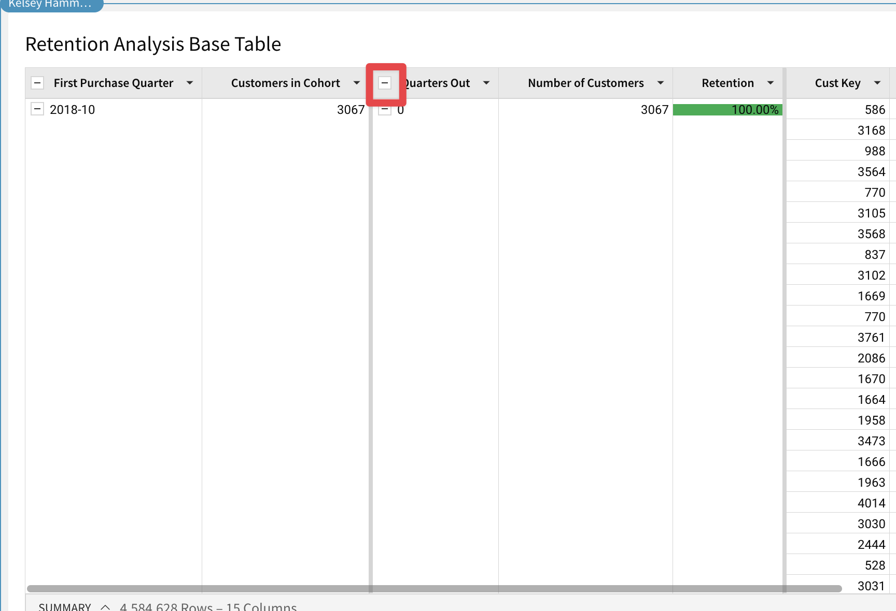

2. Hover over the top right of the “Retention Analysis” table element, select the “Create Child Element” icon and click “Pivot Table”. Then rename the new pivot table “Retention by Quarter”.

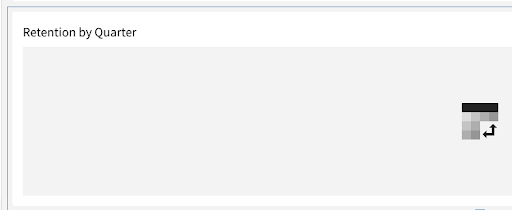

3. You will notice that since the “Quarter Out” grouping was expanded when the child table was created, the aggregation level was set such that all columns show up in the Pivot table.

4.  Drag and drop the following columns to the respective sections:
- “First Purchase Quarter” → “Pivot Rows”
- “Quarters Out” → “Pivot Columns”
- “Retention” → “Values”

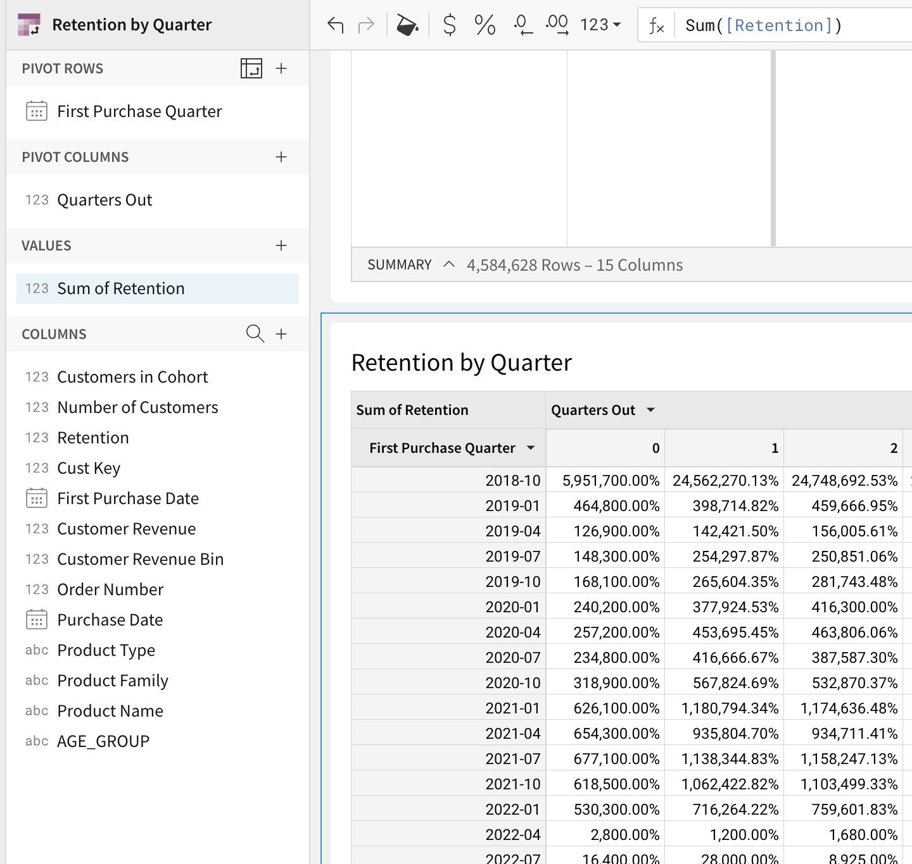

5. With “Sum of Retention” selected in the formula bar remove “Sum()“ and leave “[Retention]” and rename the column to “Retention % - Grouped Table”. We do this because “Retention” is already an aggregate calculation so summing it would lead to erroneous results.

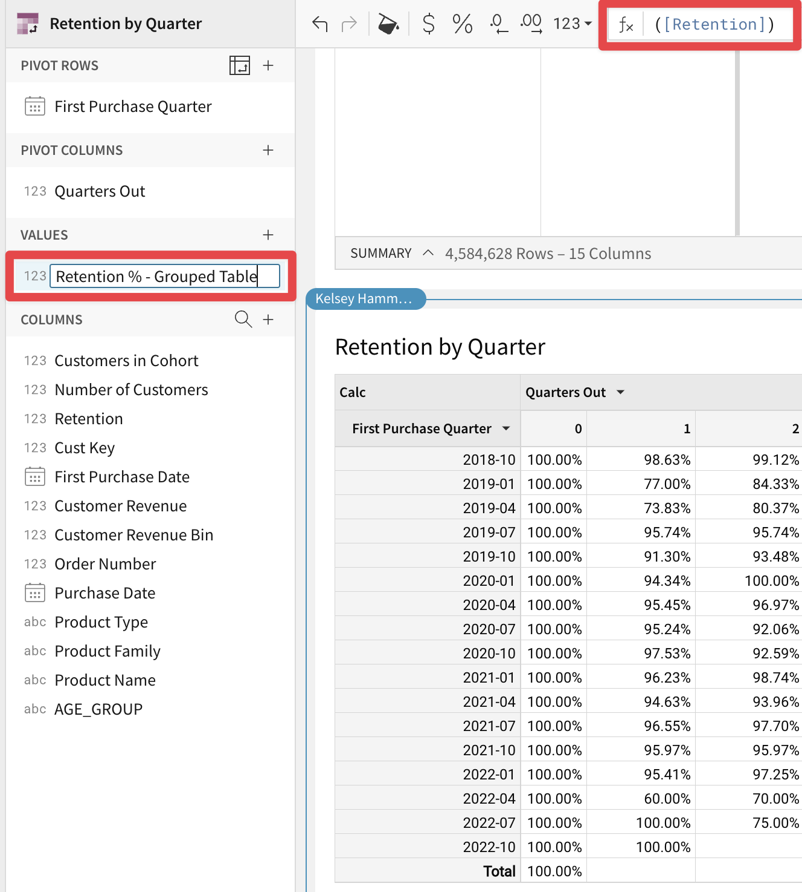

By default a column that is dragged into a Sigma pivot table value will be aggregated with a Sum(). This can be adjusted via the formula bar like we just did or by right clicking the column header in the values section and changing the aggregate type.

6.  We are also able to perform calculations in the pivot table itself. Let’s recalculate the retention percentage here. To do that click the “+” icon adjacent to the values section and select “New Column”.

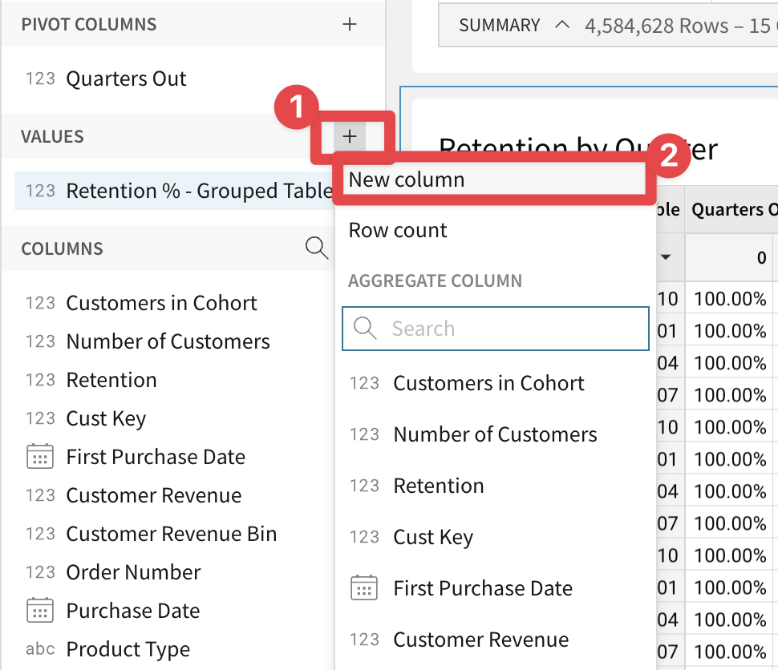

7. Set the formula for the new column to equal “[Number of Customers] / [Customers in Cohort]” , rename it “Retention % - Pivot Table” and set the formatting to percentage.

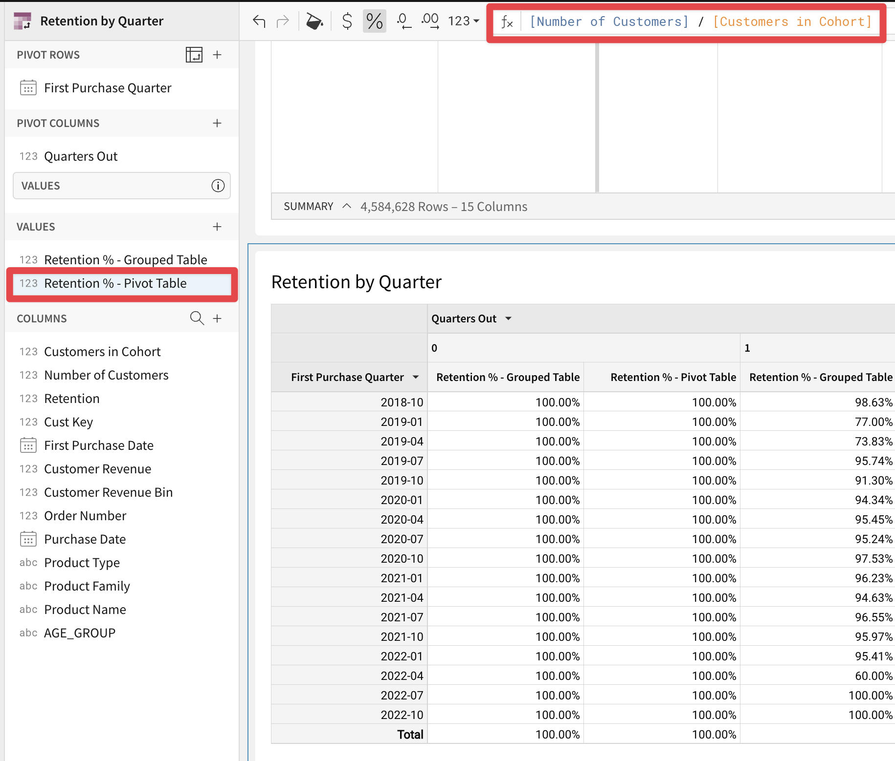

8. You will notice that regardless of where the data is calculated it matches. This is because under the hood Sigma is making a grouped table to build out this pivot table. In the case of the retention value from the grouped table it is being rolled-up to the “Quarters Out” aggregate created by the pivot table. We can see this by either double clicking the pivot table, or clicking the expand icon in the top right corner.

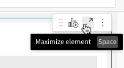

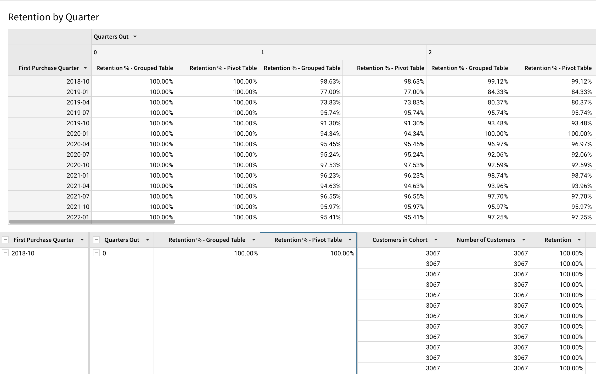

Even with pivot tables Sigma allows you to surface the underlying records with ease. In general to ensure that the underlying records are available as well as to keep the workbook easily maintainable and understandable for other users, it is recommended to perform calculations such as this in the visual or the pivot table. This makes sure that the aggregations wont obfuscate the underlying data.

9. Now let's remove the totals from the pivot table as they dont make sense in this context. Right click on the “First Purchase Quarter” column header and uncheck “show totals”.

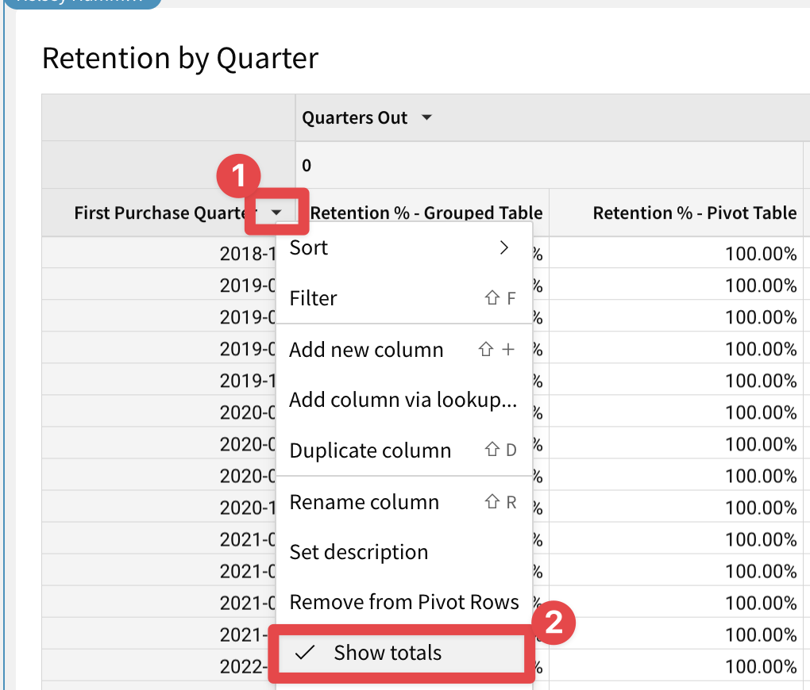

10. Finally lets remove the “Retention % - Grouped Table” and add conditional formatting to the remaining retention column. On the left side select the paint brush and click “Conditional formatting”. Change the style to “Color Scale” and Apply to “Retention % - Pivot Table”.

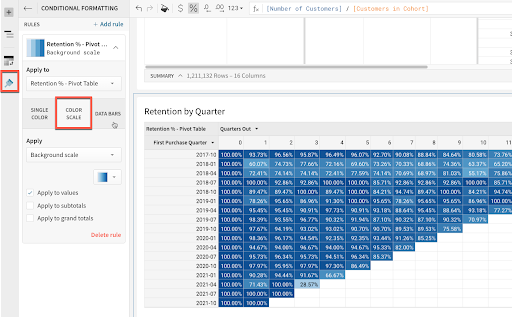

## Filtering the Workbook
Duration: 5

1. On the “Retention Analysis Base Table” click on the arrow next to “Customer Revenue Bin” and select “Filter”. Then click the “Kebab” in the filter and select “Convert to page control”.

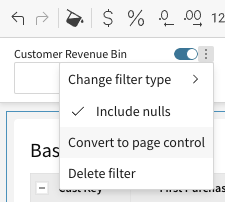
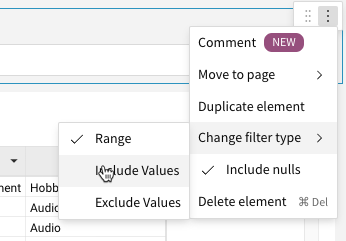
1. The filter should now show up on the workbook above the “Retention Analysis Base Table.” Click the “Kebab” one more time except this time select “Change filter type” and click “List”. Repeat this process for Age Group.

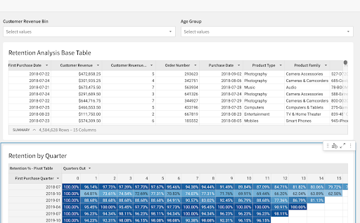

3. Now let’s filter our page by clicking the newly created “Customer Revenue Bin” filter drop down and selecting 1-3. This equates to looking at customers only in the bottom 30% of total spend. You will notice both visuals updating. This is because the pivot table is a child element of the base table. The same will be true if you select a range from the newly created “Age Group” filter as well.

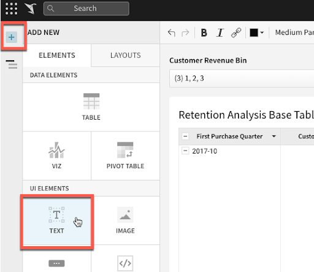

4. Finally we will add a title to our “Retention” page. Click the “+” in the top left corner and then select “Text” from the “UI Elements” section.

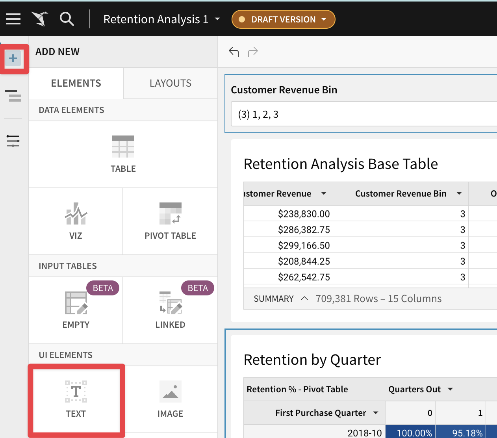

5. When the element shows up on the workbook click and drag it to the top above the filter. Next click inside, set the format to large heading and give the page a title. Sigma text boxes have rich text capabilities meaning that we have a lot of flexibility in formatting options.

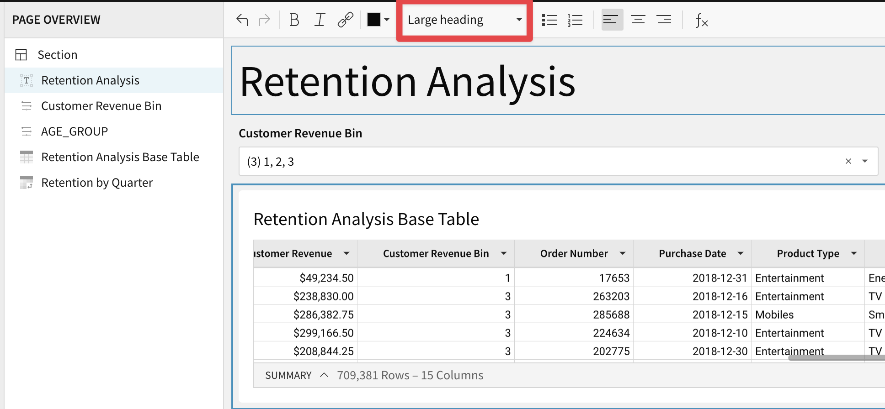

<strong>Your final retention analysis workbook page should look something like this:</Strong>

## Conclusion

In this lab, we showcased how Sigma empowers end users to create complicated, cross-level metric calculations all without writing any complex code or SQL.
Sigma enables end users to do last-mile data exploration and analysis in a familiar, spreadsheet-like UI, unlocking the power of the underlying cloud data platform for all business users.

### Helpful Resources

- [Help Center including Documentation](https://help.sigmacomputing.com/hc/en-us)
- [Sigma Blog](https://www.sigmacomputing.com/blog/)
- [Resources and Case Studies](https://www.sigmacomputing.com/resources/)

 
  