author: pballai
id: security_column_level_security
summary: security_column_level_security
categories: security
environments: web
status: Published
feedback link: https://github.com/sigmacomputing/sigmaquickstarts/issues
tags: default
lastUpdated: 2025-06-011

# Implementing Column Level Security (CLS)

## Overview 
Duration: 5 

Column level security ("CLS") in the context of analytics is a data protection feature that allows you to control access to specific columns within a database table. This is particularly important in scenarios where certain data elements are sensitive or regulated, such as personally identifiable information (PII), financial details, or health records. 

Implementing column level security requires careful planning to balance data accessibility and security, ensuring that users can perform their necessary tasks without compromising sensitive data.

These are some considerations when implementing a CLS solution. Not all of these are required, and while company needs vary, being aware of them is beneficial.

 <ul>
      <li><strong> Granular Access Control:</strong> Precisely define who can view or modify individual columns within a table. For example, while a general user may see certain basic columns, more sensitive columns like social security numbers or salary details might be restricted to privileged users.</li>
      <li><strong>Role-Based Permissions:</strong> Access to columns is often governed by user roles. Users with different roles (e.g., analyst, manager, administrator) might have different levels of access to the data.</li>
      <li><strong>Compliance and Privacy:</strong> This is crucial for adhering to various data protection laws and regulations like GDPR, HIPAA, etc., by ensuring that sensitive information is only accessible to authorized personnel.</li>
      <li><strong>Flexibility:</strong> In analytics, column level security can be implemented in various ways, depending on the tools and databases in use at your organization.. </li>
      <li><strong>Impact on Analytics:</strong> This security feature can complicate data analysis and reporting processes since analysts need to be mindful of the varying access levels across different segments of data. For example, a CLS implementation should not interfere with other critical features like collaboration.</li>
      <li><strong>Dynamic Data Masking:</strong> In some cases, column level security might involve dynamic data masking, where sensitive data is obscured or replaced with masked or placeholder data for users without access, while maintaining the real data for authorized users.</li>
</ul>

This QuickStart assumes you are generally familiar with Sigma or have taken the QuickStart Fundamentals series. **Not all steps are shown in detail.**

<aside class="positive">
<strong>IMPORTANT:</strong>  Some screens in Sigma may appear slightly different from those shown in QuickStarts. This is because Sigma is continuously adding and enhancing functionality. Rest assured, Sigma’s intuitive interface ensures that any differences will not prevent you from successfully completing any QuickStart.
</aside>

For more information on Sigma's product release strategy, see [Sigma product releases](https://help.sigmacomputing.com/docs/sigma-product-releases)

If something doesn’t work as expected, here's how to [contact Sigma support](https://help.sigmacomputing.com/docs/sigma-support)

 ### Target Audience
This QuickStart is intended for anyone looking to implement column-level security in Sigma, ensuring that each logged-in user can access only the data they are authorized to see.

### Prerequisites

<ul>
  <li>A computer with a current browser (any modern browser is fine).</li>
  <li>Access to your Sigma environment.</li>
  <li>Some familiarity with Sigma is assumed; not all basic steps are shown.</li>
</ul>

<aside class="positive">
<strong>IMPORTANT:</strong>  Sigma recommends using non-production resources when completing QuickStarts.
</aside>

<button>[Sigma Free Trial](https://www.sigmacomputing.com/free-trial/)</button>

<aside class="negative">
<strong>IMPORTANT:</strong>  Some features may carry a "Beta" tag. Beta features are subject to quick, iterative changes. As a result, the latest product version may differ from the contents of this document.
</aside>

<!-- END OF SECTION-->

## Create a Data Model
Duration: 20

In Sigma, CLS is enforced directly in the data model. Configuring CLS in data models enforces consistent security policies across all downstream analyses and workbooks. When CLS rules are updated in a data model, they automatically propagate to all downstream references.

We will create a new data model using Sigma's sample data and add a few columns that we will use to evaluate CLS.

Log into Sigma as `Administrator` and click the `Create New` button, then select `Data model`:

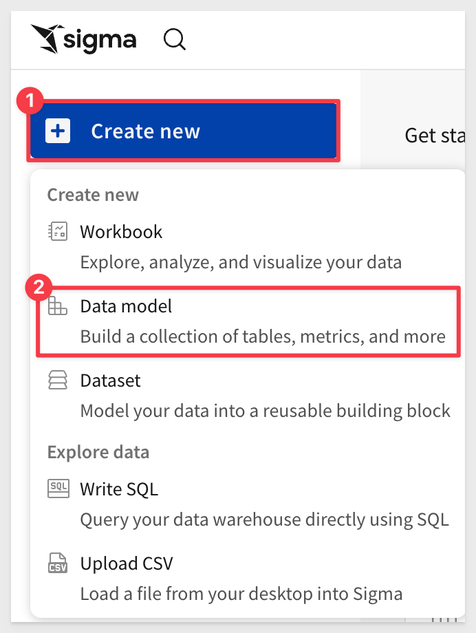

Select `Data` > `Table` from the `Element bar`:

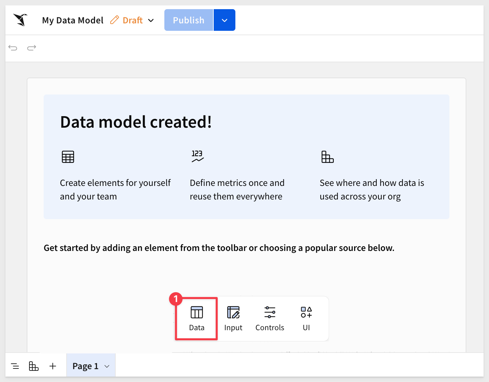

Search for `Hands` and select the `Plugs Electronics Hands On Lab` table from the `Retail` schema:

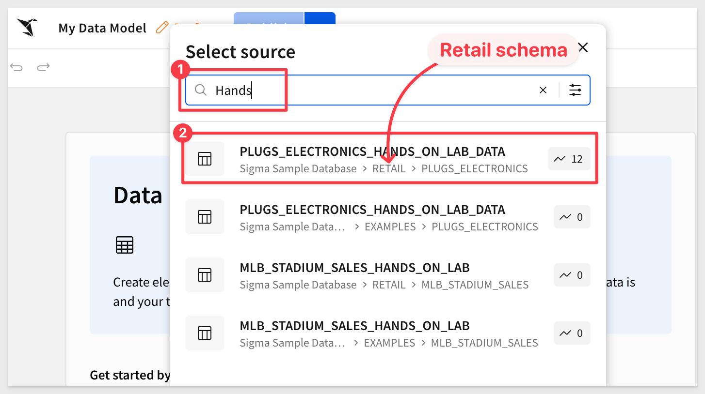

After the table loadeda, use the `Properties` tab and drag the `Customer Name` column to the first position:

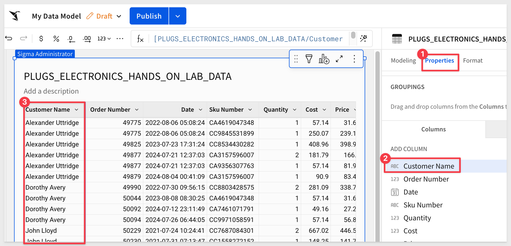

<!-- END OF SECTION-->

## Apply CLS
Duration: 20

Still in the new model, click the `Modeling` tab and select the `+` next to `COLUMN SECURITY`. 

The `Restricted columns` dropdown lets us select one or more columns to apply specific `Criteria` to. 

Select the `Customer Name` column and `No one can view`:

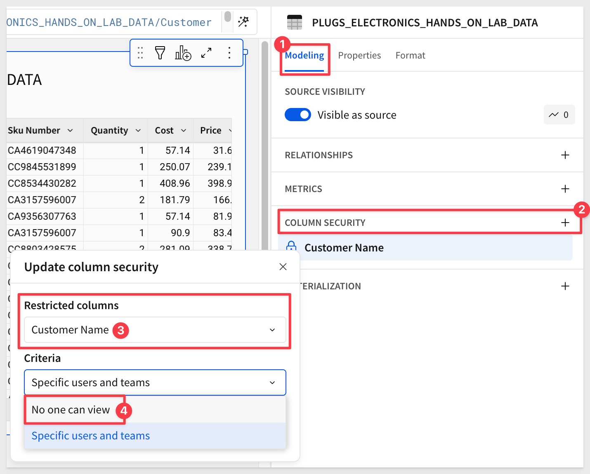

Click `Publish` and then open the `Preview`, which takes us to the data model's main page where we can see the table columns as the logged-in user (ourselves in this case).

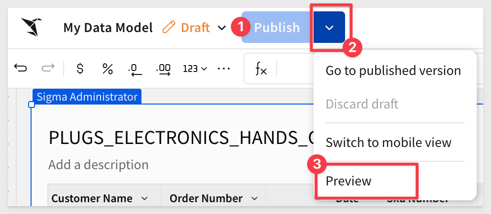

Here we can see that there are 21 columns with `Order Number` first:

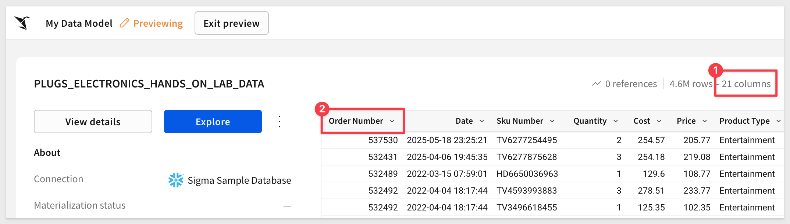

Click `Exit preview`.

There are 22 columns in the data model, so we know our column security is working:

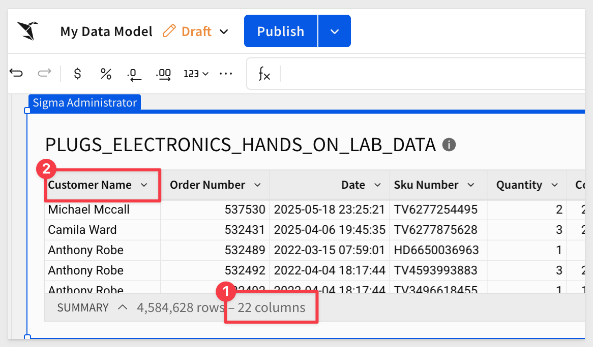

Click `Publish`.

### Specific user or team
For this section, we will demonstrate; you do not need to create the extra users as that is only distraction at this point.

<aside class="positive">
<strong>VERY IMPORTANT:</strong>  When using the "Specific users and teams" option, if a user is not granted access to a protected column, it is not visible or available to select when using the data model as a data source.

This means that the users/teams selected will be able to see the protected columns; all others will not.
</aside>

Let's assume we want to share this data model with two users (teams work in a similar fashion). One is a "Build" user, who creates content from scratch for others to use and needs to include the customer name column.

The other is a "View" user, who wants to use the data model to explore the data but should not see the `Customer Name` column. 

First we share the data model with those users:

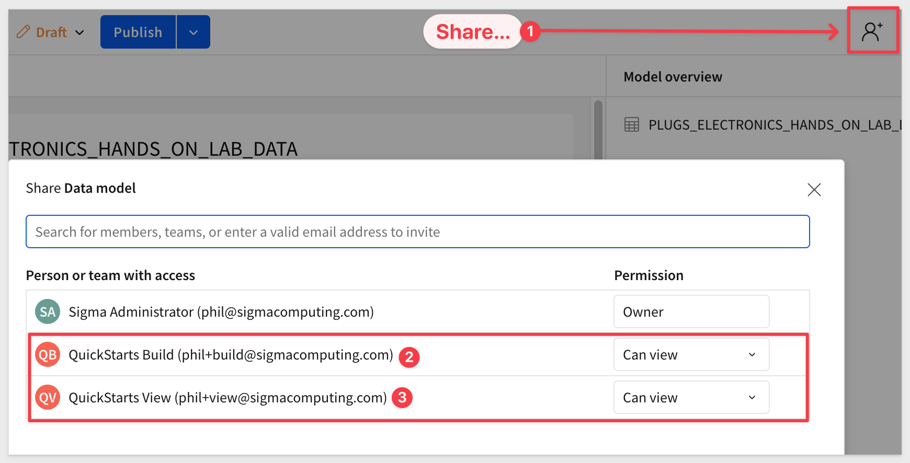

Next, update our CLS configuration to allow the build user (and ourselves) to see the `Customer Name` column:

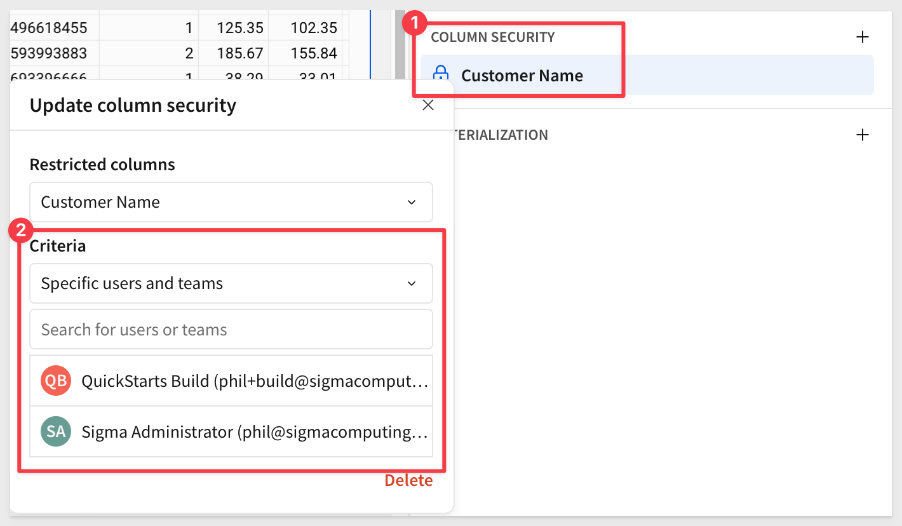

<aside class="positive">
<strong>IMPORTANT:</strong>  Sigma CLS supports multiple CLS rules in a data model. Add more rules by clicking on the "+" icon.
</aside>

Click `Publish`.

Now we can use Sigma's [Impersonation](https://help.sigmacomputing.com/docs/impersonate-users) feature to see the data model as the different users:

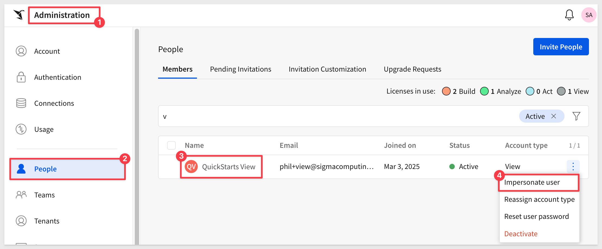

While impersonating, we can see the shared data model:

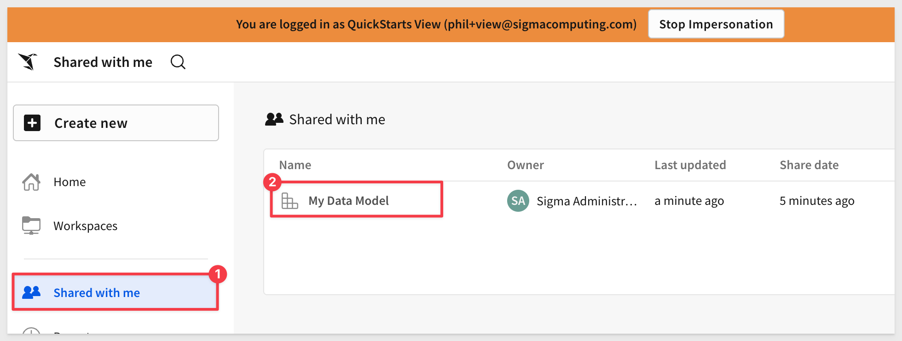

Again we can see that there are 21 columns with `Order Number` first:

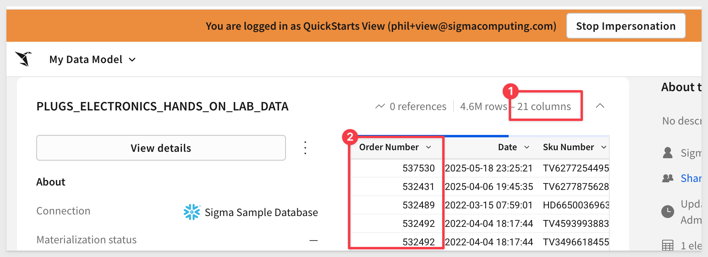

<aside class="negative">
<strong>NOTE:</strong>  In practice, a "view" user would access the data in a workbook but CLS configurations propagate to all downstream content that uses the data model. We wanted to keep this simple and avoid the extra steps as the outcome will be the same regardless.
</aside>

By impersonating the build user, we can once again see the `Customer Name` column, as expected:

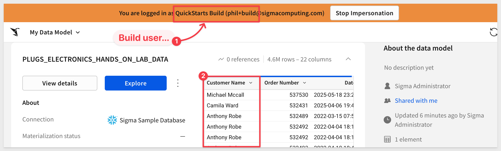

<!-- END OF SECTION-->

## What we've covered
Duration: 5

In this QuickStart, we learned how to apply column-level security (CLS) in Sigma using data models. We also explored how different configurations—such as restricting columns by default, assigning visibility to specific users or teams, and using impersonation to test downstream access.

**Additional Resource Links**

Be sure to check out all the latest developments at [Sigma's First Friday Feature page!](https://quickstarts.sigmacomputing.com/firstfridayfeatures/)

[Help Center Home](https://help.sigmacomputing.com) 
[Sigma Community](https://community.sigmacomputing.com/) 
[Sigma Blog](https://www.sigmacomputing.com/blog/) 
 

&emsp;
&emsp;

<!-- END OF WHAT WE COVERED -->
<!-- END OF QUICKSTART -->