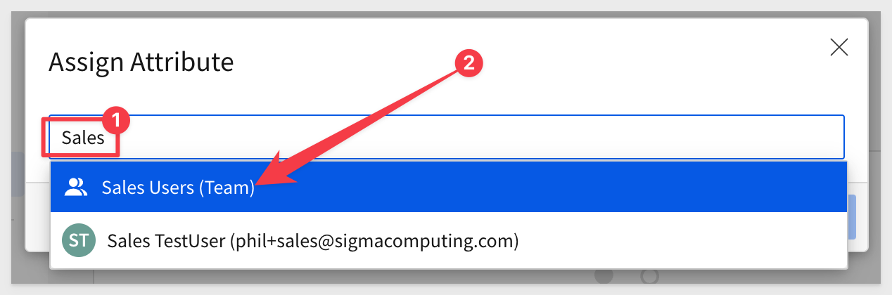
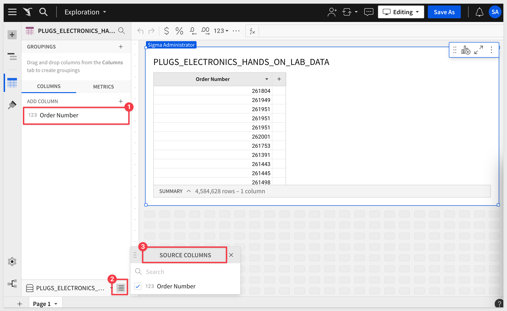

author: pballai
id: security_column_level_security
summary: security_column_level_security
categories: security
environments: web
status: Published
feedback link: https://github.com/sigmacomputing/sigmaquickstarts/issues
tags: default
lastUpdated: 2023-12-06

# Implementing Column Level Security

## Overview 
Duration: 5 

Column level security ("CLS") in the context of analytics is a data protection feature that allows you to control access to specific columns within a database table. This is particularly important in scenarios where certain data elements are sensitive or regulated, such as personal identifiable information (PII), financial details, or health records. Here's a brief overview:

Implementing column level security requires careful planning to balance data accessibility and security, ensuring that users can perform their necessary tasks without compromising sensitive data.

 <ul>
      <li><strong> Granular Access Control:</strong> It enables you to precisely define who can view or modify individual columns within a table. For example, while a general user may see certain basic columns, more sensitive columns like social security numbers or salary details might be restricted to privileged users.</li>
      <li><strong>Role-Based Permissions:</strong> Access to columns is often governed by user roles. Users with different roles (e.g., analyst, manager, administrator) might have different levels of access to the data.</li>
      <li><strong>Compliance and Privacy:</strong> This is crucial for adhering to various data protection laws and regulations like GDPR, HIPAA, etc., by ensuring that sensitive information is only accessible to authorized personnel.</li>
      <li><strong>Implementation:</strong> In analytics, column level security can be implemented in various ways, depending on the tools and databases in use. SQL-based databases might use GRANT and REVOKE statements, while business intelligence tools might have built-in features for access control.</li>
      <li><strong>Impact on Analytics:</strong> This security feature can complicate data analysis and reporting processes since analysts need to be mindful of the varying access levels across different segments of data. For example, a CLS implementation should not "break" other important features like features for collaboration.</li>
      <li><strong>Dynamic Data Masking:</strong> In some cases, column level security might involve dynamic data masking, where sensitive data is obscured or replaced with fictional data for users without access, while maintaining the real data for authorized users.</li>
</ul>

This QuickStart assumes you are generally familiar with Sigma or have taken the QuickStart Fundamentals series. **Not all steps will be shown in detail.**

 ### Target Audience
Administrators who need to ensure that protected data columns are not available to users who are not authorized to see the data contained in them.

### Prerequisites

<ul>
  <li>A computer with a current browser. It does not matter which browser you want to use.</li>
  <li>Access to your Sigma environment.</li>
  <li>Some familiarity with Sigma is assumed. Not all steps will be shown as the basics are assumed to be understood.</li>
</ul>

<aside class="postive">
<strong>IMPORTANT:</strong>  Sigma recommends that you use non-production resources when doing QuickStarts.
</aside>

<button>[Sigma Free Trial](https://www.sigmacomputing.com/free-trial/)</button>
  
### What You’ll Learn
How to apply column level security in Sigma, through the administrative user interface.

## CLS in Sigma
Duration: 20

In Sigma, CLS is managed through team membership and user attributes. 

When user attributes are used to set CLS, column visibility based (dynamically) on the attribute value set for teams, for the logged on user.   

CLS can also be used to allow access to individual columns within a table to different embed users or clients.

The benefits of CLS as implemented in Simga are:

 <ul>
      <li><strong>Secures sensitive information:</strong> For example, personal identifiers (e.g., social security numbers), financial data or medical records.</li>
      <li><strong>Data sharing and collaboration:</strong> Column-Level Security enables controlled data sharing and collaboration. Organizations can share specific columns with external parties or partners without exposing the entire dataset.</li>
      <li><strong>Data Confidentiality in Multi-Tenant Environments::</strong> In multi-tenant systems or cloud-based environments, where multiple clients or orgs share the same infrastructure, CLS ensures that each tenant's data remains isolated and protected from other tenants.</li>
      <li><strong>Data Masking and Anonymization::</strong> Column-Level Security can be combined with data masking and anonymization techniques to protect sensitive data and still allow certain authorized users to work with pseudo or obfuscated values.</li>
</ul>

In the next few sections of this QuickStart we will setup and test CLS. The basic steps are (links to help docs provided for convenience only):

1: [Create a Dataset](https://help.sigmacomputing.com/hc/en-us/articles/4408736613395#h_01FJD5840274SNM49XSFCDAJWP)

2: [Create user attributes](https://help.sigmacomputing.com/hc/en-us/articles/6709896696979-User-Attributes#caua)

3: [Assign a user attribute to teams](https://help.sigmacomputing.com/hc/en-us/articles/6709896696979-User-Attributes#assign)

4: [Set the column in a dataset to the user attribute to enforce security](https://help.sigmacomputing.com/hc/en-us/articles/18744762013843--Column-Level-Security-Beta-#h_01H6A395XSV20SH2B7TXA1C7C8)

6: [Impersonate a test user to verify CLS is being enforced](https://help.sigmacomputing.com/hc/en-us/articles/15747532813715-Impersonate-users#h_01GY9AWQFC4MS0NB18CZN5HM0B)

<!-- END OF SECTION-->

## Create User Attribute for CLS
Duration: 20

In Sigma (as an Administrator)m navigate to `Administration` > `User Attributes` and click to `Create Attribute`:

Give the new user attribute a name. For this, we will use `permit_customer_data`. 

For the description, we will use `Permit administrators and Sales Managers to access the customer details column. Restrict all others`

<aside class="positive">
<strong>IMPORTANT:</strong>  It's highly recommended that you set a default value for user attributes when configuring for CLS. If you don't set a value it defaults to (2) Restricted. Restricted = column is hidden from view.
</aside>

The new user attribute is created.

<!-- END OF SECTION-->

## Teams Assignment
Duration: 20

For our use case, we will have a few scenarios to evaluate, related to our "sensitive data" column, which contains customer detail information in a Snowflake table.

We will have three users, and control visibility to this column to each differently, based on team assignment:

**1: Administrator:** is permitted to see the column. 
**2: Sales Managers:** is permitted ***to add*** the column; the column is not automatically included by default in new datasets. 
**3: Sales Users:** is not permitted to see the column data. 

To setup this use case, we will need to add the required teams and test users. It is assumed that you understand how to add teams and users to Sigma, so we will skip demonstrating that in details. 

For information on how to add users to Sigma, [click here.](https://help.sigmacomputing.com/hc/en-us/articles/360036944454-Invite-people-to-your-organization)

For information on how to add Teams to Sigma, [click here.](https://help.sigmacomputing.com/hc/en-us/articles/360037430333-Manage-Teams#h_01F8E2E40Z95MY8HNZHJHRYEPD)

We have created two teams called `Sales Users` with `Viewer` rights and `Sales Managers` with `Creator` rights. 

Each team will have a test user as the only member. 

If you don't have suitable teams to test with, go ahead and create them and add any non-administer user to them:

Now that we have our test users assigned to our teams, we can assign the new user attribute:

In the window, search for `Sales` and select the `Sales Users` team:

Assign the two teams as follows:

The value you assign to the `Attribute Value` field maps to a preexisting value. By doing this, you're managing CLS through team membership and user attributes.

**The values have to following effect on the column visibility:**

If you assign `0` to the team, the column data is visible to the team. 

If you assign `1` to the team, the column data isn't added by default to the workbook. 

If you assign `2` to the team, the column isn't included.

As we have it configured, Sales Reps should not see the `Cust Json` column. Sales Managers are able to add the column from a table that contains it. 

<!-- END OF SECTION-->

## Assign User Attribute in Dataset
Duration: 20

Now we start to use our configuration against a new test dataset. 

Create a new dataset (click the `+` in the upper left corner of the homepage) and navigate through the available data to the `Sigma Sample Database`. We want to use the `PLUGS_ELECTRONICS_HANDS_ON_LAB_DATA` and really only need the two columns shown to keep things simple for testing:

Once the dataset is configured as shown, click `Get Started`

<aside class="negative">
<strong>NOTE:</strong>  CLS user attributes can also be applied existing datasets.
</aside>

The column we want to apply CLS to is called `Cust_Json` and contains data in JSON format.

Sigma is great at working with JSON column data and there is a [QuickStart that shows you how!](https://quickstarts.sigmacomputing.com/guide/tables_json_parsing/index.html?index=..%2F..index#0).

The dataset is presented to you; next click the `edit` button and then click `Columns` and select the `Visibility` drop list for the `Column Name` `Cust Json`.

Select our user attribute, `permit_customer_data` to drive this columns visibility:

Click `Publish`, then click `Explore`

Now that we have our dataset in a Workbook we can see that there is no column in either the list of columns or the source columns list. **Why not?**

When we created our user attribute we set the default to `2`, which means the column is not included for everyone in the organization.

When we created our teams, we did not include the administrator. This results in the administrator who just created the workbook, based on the column-restricted dataset, to not be able to see the column, `Cust Json`.

We could adjust for that by adding the administrator to the groups, or a better practice might be to create an `Administrative Team`. 

We did not do that, so that we could keep our use case as simple as possible for now.

Before we move on to test against our teams, we first need to share this workbook with them:

In the workbook, share with the `Sales Managers` and `Sales Reps` teams (uncheck the `Send email` checkbox):

and...

<!-- END OF SECTION-->

## Impersonate Test Users
Duration: 20

Instead of logging out and back in with each user to test, Sigma has a neat feature that allows an administrator to "impersonate" any other user. This saves you time in the development lifecycle. 

[To read more about user impersonation, click here:](https://help.sigmacomputing.com/hc/en-us/articles/15747532813715-Impersonate-users)

Navigate to `Administration` > `People` and click to impersonate the user who is a "Sales Rep":

The portal header changes to indicate impersonation is enabled. Navigate back to `Home` > `Shared with me` and click to select the `Column Level Security` workbook:

The workbook is displayed (as a `Viewer` role) and the user sees no reference to the restricted column `Cust Json`:

Click the page header button to `Stop Impersonation`.

Navigate back to `Administration` > `People` and this time, impersonate the `Sales Manager` user:

<!-- END OF SECTION-->

## What we've covered
Duration: 5

In this lab we learned how to apply column level security in Sigma, through the administrative user interface.

**Additional Resource Links**

[Blog](https://www.sigmacomputing.com/blog/) 
[Community](https://community.sigmacomputing.com/) 
[Help Center](https://help.sigmacomputing.com/hc/en-us) 
[QuickStarts](https://quickstarts.sigmacomputing.com/) 
=======
Be sure to check out all the latest developments at [Sigma's First Friday Feature page!](https://quickstarts.sigmacomputing.com/firstfridayfeatures/)
 

&emsp;
&emsp;

<!-- END OF WHAT WE COVERED -->
<!-- END OF QUICKSTART -->