author: pballai
id: security_column_level_security
summary: security_column_level_security
categories: security
environments: web
status: Published
feedback link: https://github.com/sigmacomputing/sigmaquickstarts/issues
tags: default
lastUpdated: 2023-12-07

# Implementing Column Level Security

## Overview 
Duration: 5 

Column level security ("CLS") in the context of analytics is a data protection feature that allows you to control access to specific columns within a database table. This is particularly important in scenarios where certain data elements are sensitive or regulated, such as personal identifiable information (PII), financial details, or health records. 

Implementing column level security requires careful planning to balance data accessibility and security, ensuring that users can perform their necessary tasks without compromising sensitive data.

These are some things to consider when implementing a CLS solution. Each of these is not always required, and companies have different requirements but being aware of them can be useful.

 <ul>
      <li><strong> Granular Access Control:</strong> Precisely define who can view or modify individual columns within a table. For example, while a general user may see certain basic columns, more sensitive columns like social security numbers or salary details might be restricted to privileged users.</li>
      <li><strong>Role-Based Permissions:</strong> Access to columns is often governed by user roles. Users with different roles (e.g., analyst, manager, administrator) might have different levels of access to the data.</li>
      <li><strong>Compliance and Privacy:</strong> This is crucial for adhering to various data protection laws and regulations like GDPR, HIPAA, etc., by ensuring that sensitive information is only accessible to authorized personnel.</li>
      <li><strong>Flexibility:</strong> In analytics, column level security can be implemented in various ways, depending on the tools and databases in use. </li>
      <li><strong>Impact on Analytics:</strong> This security feature can complicate data analysis and reporting processes since analysts need to be mindful of the varying access levels across different segments of data. For example, a CLS implementation should not "break" other important features like features for collaboration.</li>
      <li><strong>Dynamic Data Masking:</strong> In some cases, column level security might involve dynamic data masking, where sensitive data is obscured or replaced with fictional data for users without access, while maintaining the real data for authorized users.</li>
</ul>

This QuickStart assumes you are generally familiar with Sigma or have taken the QuickStart Fundamentals series. **Not all steps will be shown in detail.**

<aside class="positive">
<strong>IMPORTANT:</strong>  Some screens in Sigma may appear slightly different from those shown in QuickStarts. This is because Sigma is continuously adding and enhancing functionality. Rest assured, Sigma’s intuitive interface ensures that any differences will not prevent you from successfully completing any QuickStart.
</aside>

For more information on Sigma's product release strategy, see [Sigma product releases.](https://help.sigmacomputing.com/docs/sigma-product-releases)

 ### Target Audience
Administrators who need to ensure that protected data columns are not available to users who are not authorized to see them or the data contained in them.

### Prerequisites

<ul>
  <li>A computer with a current browser. It does not matter which browser you want to use.</li>
  <li>Access to your Sigma environment.</li>
  <li>Some familiarity with Sigma is assumed. Not all steps will be shown as the basics are assumed to be understood.</li>
</ul>

<aside class="postive">
<strong>IMPORTANT:</strong>  Sigma recommends that you use non-production resources when doing QuickStarts.
</aside>

<button>[Sigma Free Trial](https://www.sigmacomputing.com/free-trial/)</button>
  
### What You’ll Learn
How to apply column level security in Sigma, through the administrative user interface.

## CLS in Sigma
Duration: 20

In Sigma, CLS is managed through team membership and user attributes. 

When user attributes are used to set CLS, column visibility based (dynamically) on the attribute value set for each team, and applied to the logged on user (based on the users team membership)

CLS can also be used to allow access to individual columns within a table to different embed users or clients.

The benefits of CLS as implemented in Sigma are:

 <ul>
      <li><strong>Secures sensitive information:</strong> For example, personal identifiers (e.g., social security numbers), financial data or medical records.</li>
      <li><strong>Data sharing and collaboration:</strong> Column-Level Security enables controlled data sharing and collaboration. Organizations can share specific columns with external parties or partners without exposing the entire dataset.</li>
      <li><strong>Data Confidentiality in Multi-Tenant Environments:</strong> In multi-tenant systems or cloud-based environments, where multiple clients or orgs share the same infrastructure, CLS ensures that each tenant's data remains isolated and protected from other tenants.</li>
      <li><strong>Data Masking and Anonymization:</strong> Column-Level Security can be combined with data masking and anonymization techniques to protect sensitive data and still allow certain authorized users to work with pseudo or obfuscated values.</li>
</ul>

In the next few sections of this QuickStart, we will setup and test CLS. 

The basic steps are (links to help docs provided for convenience only):

1: [Create a Dataset](https://help.sigmacomputing.com/docs/configure-dataset-columns)

2: [Create user attributes](https://help.sigmacomputing.com/docs/user-attributes#create-user-attributes)

3: [Assign a user attribute to teams](https://help.sigmacomputing.com/docs/user-attributes#assign-user-attributes)

4: [Set the column in a dataset to the user attribute to enforce security](https://help.sigmacomputing.com/docs/user-attributes)

6: [Impersonate a test user to verify CLS is being enforced](https://help.sigmacomputing.com/docs/column-level-security-beta)

<!-- END OF SECTION-->

## Create User Attribute for CLS
Duration: 20

In Sigma (as an Administrator) navigate to `Administration` > `User Attributes` and click to `Create Attribute`:

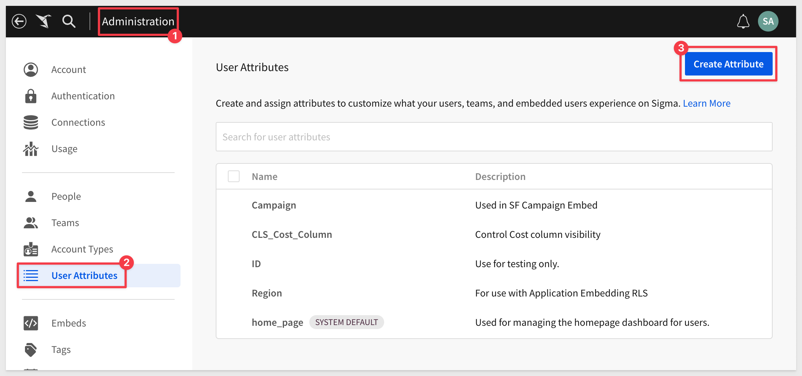

Give the new user attribute a name. For this, we will use `permit_customer_data`. 

For the description, we will use `Permit administrators and Sales Managers to access the customer details column. Restrict all others`

<aside class="positive">
<strong>IMPORTANT:</strong>  We strongly recommended that you set a default value for user attributes when configuring for CLS. If you don't set a value it defaults to (2) Restricted. Restricted means column is not accessible unless explicitly granted to a team.
</aside>

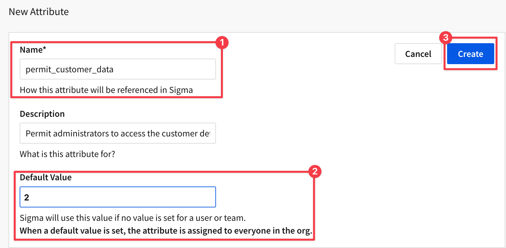

The new user attribute is created and restricted to all users in the organization (for now).

<!-- END OF SECTION-->

## Teams Assignment
Duration: 20

For our use case, we will have a few scenarios to evaluate, related to our "sensitive data" column, which contains customer detail information in a Snowflake table.

We will have three users, and control visibility to this column to each differently, based on team assignment:

**1: Administrators:** are permitted to see the column. 
**2: Sales Managers:** are permitted to add the column (or see it if the admin had already added it to a table).  
**3: Sales Users:** are not permitted to see the column data. 

<aside class="negative">
<strong>NOTE:</strong>  In this use case, we will treat "Administrator" as if it also functions as a content creator. Sigma offers considerable flexibility, with numerous configuration options to meet your security requirements.
</aside>

To setup this use case, we will need to add the required teams and test users. It is assumed that you understand how to add teams and users to Sigma, so we will skip demonstrating that in details. 

For information on [how to add users to Sigma, click here.](https://help.sigmacomputing.com/docs/manage-people)

For information on [how to add Teams to Sigma, click here.](https://help.sigmacomputing.com/docs/manage-teams)

We have created three teams:

 <ul>
      <li><strong>Administrators:</strong> Account Type: Admin (is the workbook "owner") </li>
      <li><strong>Sales Managers:</strong> Account Type: Creator (will be able to edit the workbook)</li>
      <li><strong>Sales Reps:</strong> Account Type: Viewer (will only be able to see the data in the workbook)</li>
 </ul> 

Each team will have only one user (member). 

If you don't have suitable teams to test with, go ahead and create them:

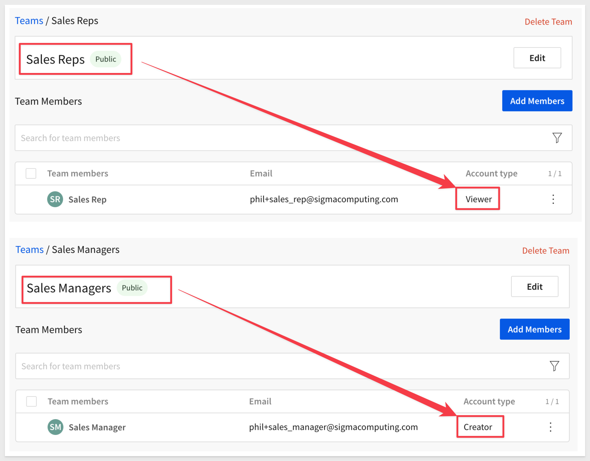 

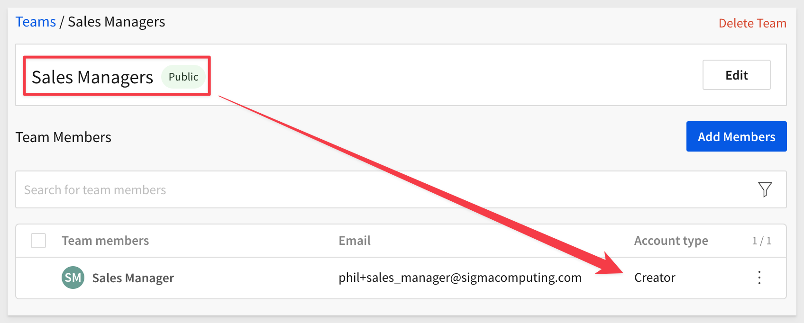 

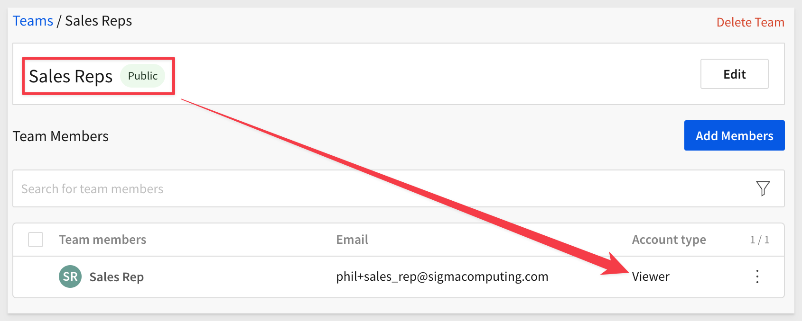 

Now that we have our test users assigned to our teams, we can assign the new user attribute.

Navigate to `Administration` > `User Attributes` and edit the `permit_customer_data` attribute.

CLick `Assign Attribute`:

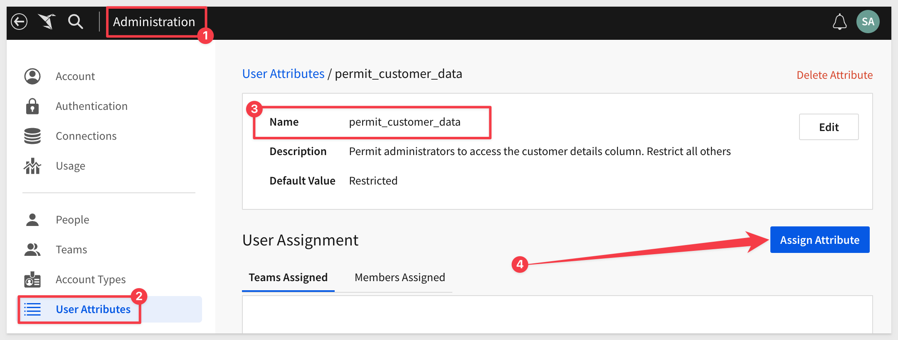

Assign the three teams as follows:

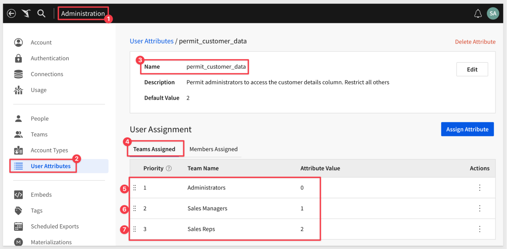

The value you assign to the `Attribute Value` field maps to a preexisting value. By doing this, you're managing CLS through team membership and user attribute value.

**The values have the following effect on the column visibility:**

If you assign `0` to the team, the column data is visible to the team.

If you assign `1` to the team, the column data isn't shown in dataset-based workbooks by default, but is available in the data source column list. The user is able to add the column manually.

If you assign `2` to the team, the column data is never shown.

<aside class="positive">
<strong>IMPORTANT:</strong>  The "Priority" column (in the user attribute assignment screen) order is used when a user is on multiple teams. For example, user A is on both team1 (priority 1) and team2 (priority 2) then team1's value will be enforced for for userA.
</aside>

As we have it configured, Sales Reps should not see the `Cust Json` column. Sales Managers are able to add the column from a table that contains it, or see it if the Administrator already added it to a Workbook.

<!-- END OF SECTION-->

## Assign User Attribute in Dataset
Duration: 20

Now we start to use our configuration against a new test dataset. 

Create a new dataset (click the `+` in the upper left corner of the homepage) and navigate through the available data to the `Sigma Sample Database`. We want to use the `PLUGS_ELECTRONICS_HANDS_ON_LAB_DATA` and really only need the two columns shown to keep things simple for testing:

Once the dataset is configured as shown, click `Get Started`

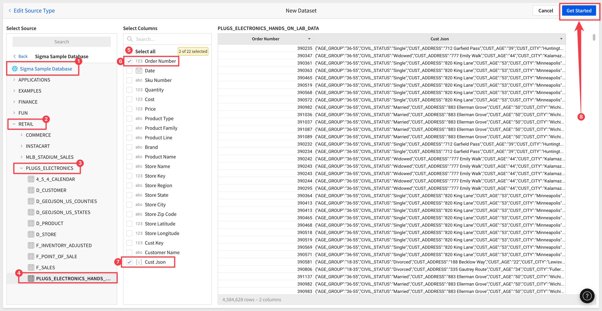

<aside class="negative">
<strong>NOTE:</strong>  CLS user attributes can also be applied existing datasets.
</aside>

The column we want to apply CLS to is called `Cust_Json` and contains data in JSON format.

Sigma is great at working with JSON column data and there is a [QuickStart that shows you how!](https://quickstarts.sigmacomputing.com/guide/tables_json_parsing/index.html?index=..%2F..index#0).

The dataset is presented to you; next click the `edit` button and then click `Columns` and select the `Visibility` drop list for the `Column Name` `Cust Json`.

Select our user attribute, `permit_customer_data` to drive this columns visibility:

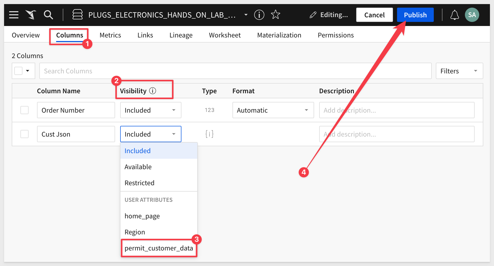

Click `Publish`, then click `Explore`

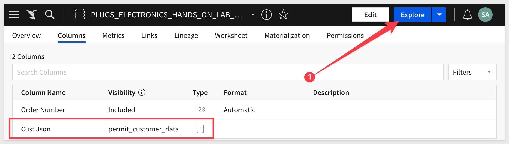

Before we move on to test against our teams, we first need to share this new workbook with them.

<aside class="positive">
<strong>IMPORTANT:</strong>  An important point to understand is the behavior of the (0,1) attribute values when first creating and sharing a workbook. If we share this workbook with the "Cust_Json" column in the table, the Sales Managers team (attribute value=1) will also have the column immediately in the table because they are allowed. If we prefer that they have to manually add it, then simply remove the column from the table. They will be able to add it back manually, because they are permitted by the attribute's value for visibility, to access it in the list of available data source columns.
</aside>

Let's remove the column from table display, so it is not displayed by default:

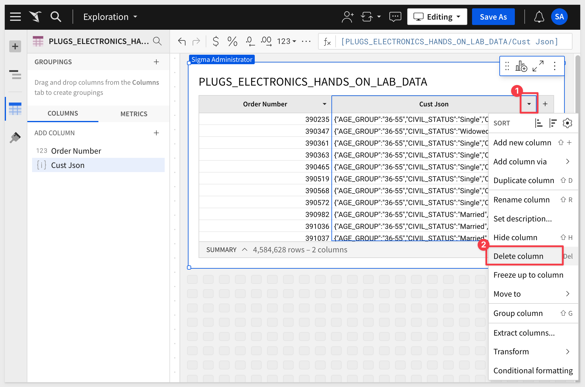

We can see that the column is still available, just not shown:

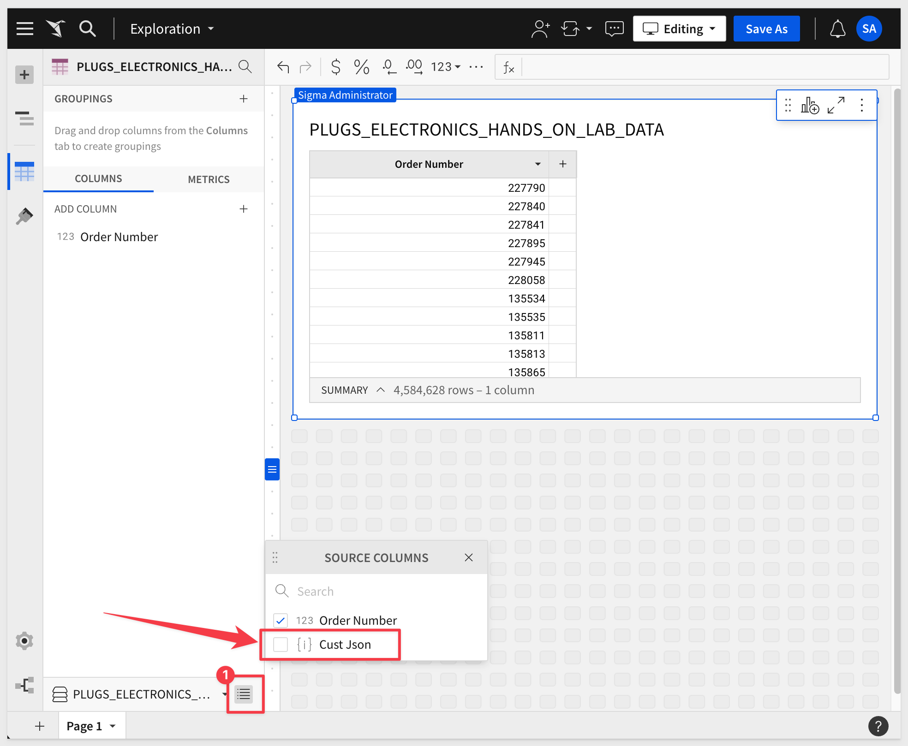

Click the `Save As` button and name the workbook `Column Level Security`.

In the workbook, share with the `Sales Managers` and `Sales Reps` teams (uncheck the `Send email` checkbox):

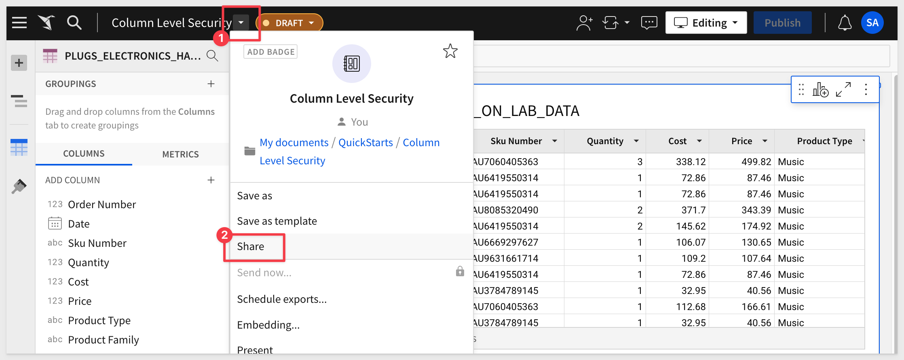

and...

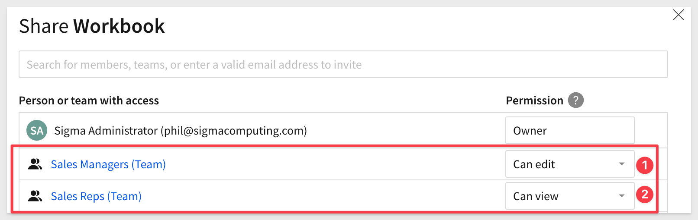

<!-- END OF SECTION-->

## Impersonate Test Users
Duration: 20

Instead of logging out and back in with each user to test, Sigma has a neat feature that allows an administrator to "impersonate" any other user. This saves you time in the development lifecycle. 

[To read more about user impersonation, click here](https://help.sigmacomputing.com/docs/impersonate-users)

Navigate to `Administration` > `People` and click to impersonate the user who is a "Sales Rep":

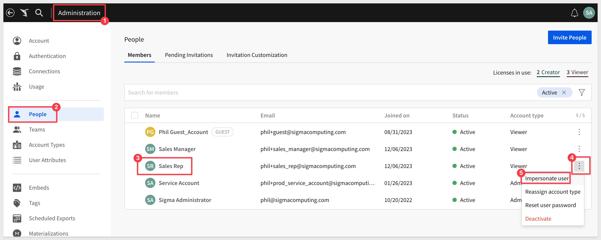

The portal header changes to indicate impersonation is enabled. Navigate back to `Home` > `Shared with me` and click to select the `Column Level Security` workbook:

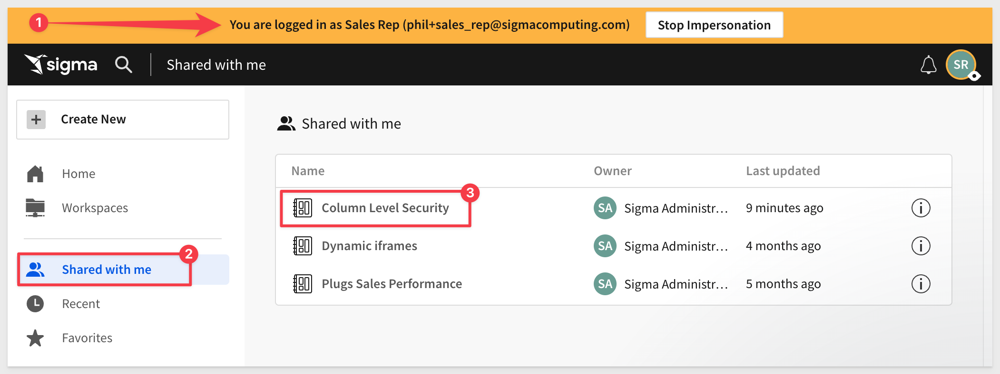

The workbook is displayed (as a `Viewer` role) and the user sees no reference to the restricted column `Cust Json`:

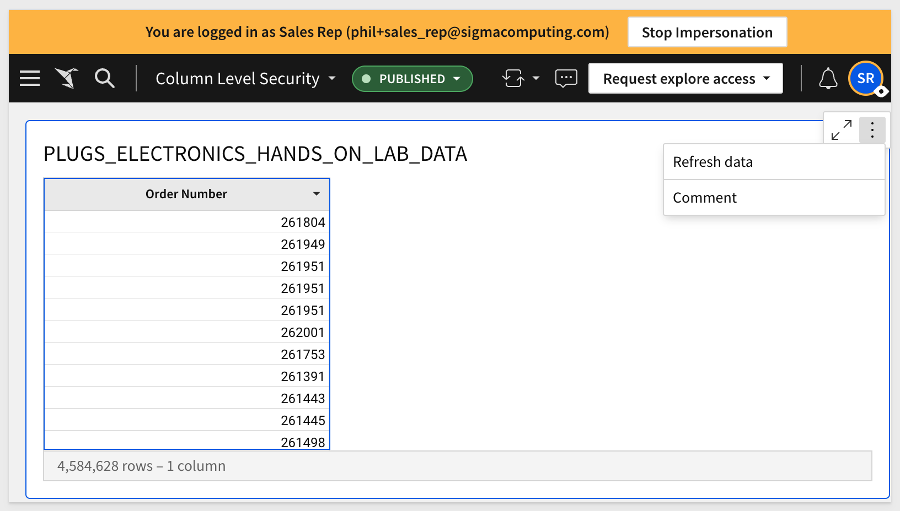

Click the page header button to `Stop Impersonation`.

Navigate back to `Administration` > `People` and this time, impersonate the `Sales Manager` user:

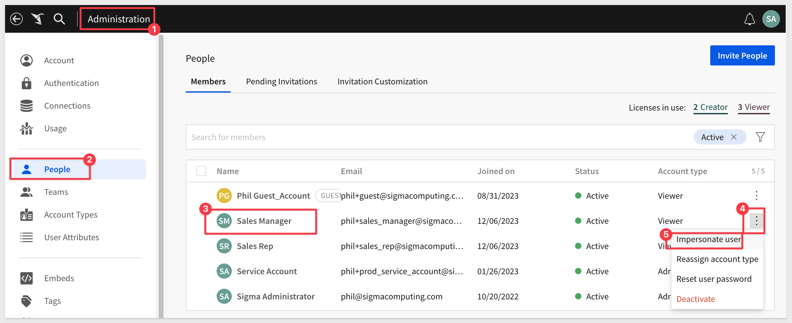

The portal header changes to indicate impersonation is enabled. Navigate back to `Home` > `Shared with me` and click to select the `Column Level Security` workbook.

The workbook table is not showing the `Cust_Json` column and this is expected, given our configuration:

Click the `Edit` button. 

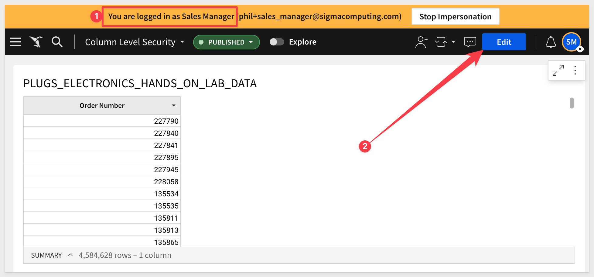

Click the table (to select it) and open the `PLUGS_ELECTRONICS_HANDS_ON_LAB_DATA` source column list. 

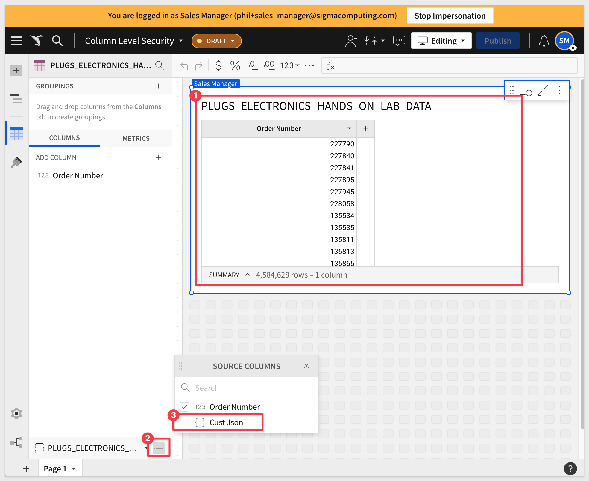

Here we can see that the `Cust_Json` column is available, but the checkbox is not "ticked"

Let's go ahead and add it to the table ("tick" the checkbox on) and `Publish` the workbook.

<aside class="positive">
<strong>IMPORTANT:</strong> Alternatively, instead of publishing the workbook, we can use the 'Save As' feature to create a modified version. This version would display the restricted column by default, and we could choose not to share it with the Sales Reps team. 

Another option, if avoiding duplication of the workbook is preferred, involves copying the table to a 'hidden' page within the same workbook, where the 'Cust_Json' column is visible. However, from a compliance standpoint, this approach might not be ideal. 

Ultimately, it's important to have various options, and the choice of implementation rests with each customer.
</aside>

Let's now check as `Sale Rep`, how this edit by the `Sales Manager` has effected the workbook.

Stop Impersonation again.

Navigate to `Administration` > `People` and click to impersonate the user who is a "Sales Rep":

The portal header changes to indicate impersonation is enabled. Navigate back to `Home` > `Shared with me` and click to select the `Column Level Security` workbook:

This time, a column is displayed in the second column position, but the content is **"Restricted"** and each cell shows **"No Access"**. 

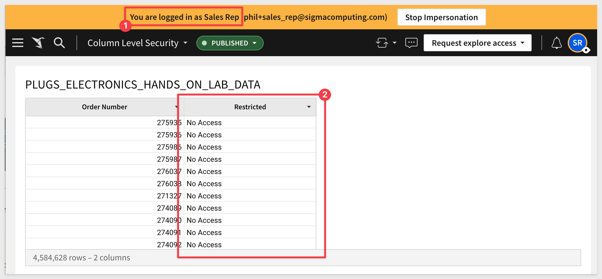

There are some instances where this is the desired result as opposed to not showing the column at all. 

Sigma allows you to support both use cases.

Sigma also provides users to "Request explore access" if they feel that they do not have sufficient permissions to perform their job:

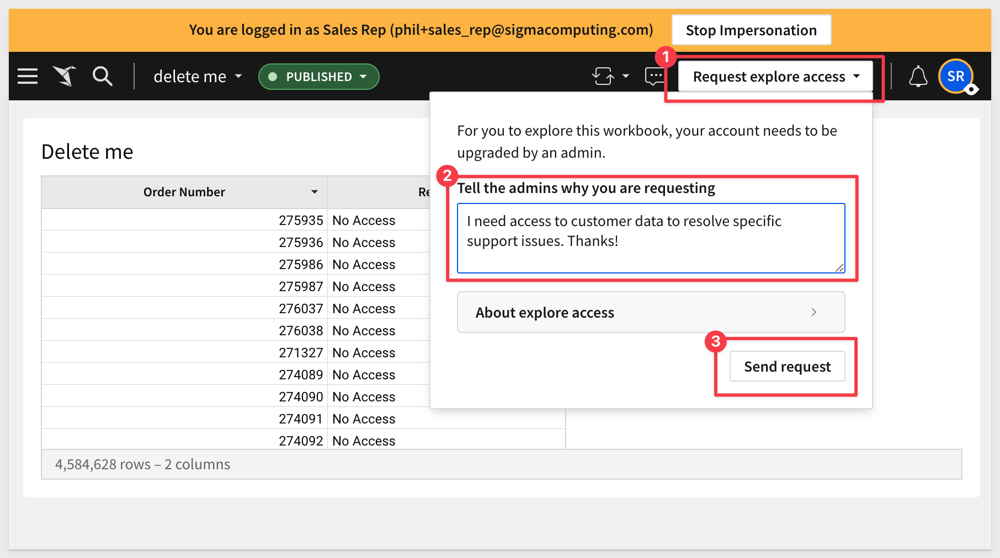

The workbook owner will get an email, and can grant permission, if they have the rights to do so. 

This feature can also be disabled, so that users are not presented the option at all.

For more information on this topic, [please refer to this document](https://help.sigmacomputing.com/docs/license-upgrade-requests#enable-or-disable-upgrade-requests)

<!-- END OF SECTION-->

## What we've covered
Duration: 5

In this QuickStart, we learned how to apply column-level security in Sigma using the administrative user interface, as well as the various implications of different configurations.

**Additional Resource Links**

Be sure to check out all the latest developments at [Sigma's First Friday Feature page!](https://quickstarts.sigmacomputing.com/firstfridayfeatures/)

[Help Center Home](https://help.sigmacomputing.com) 
[Sigma Community](https://community.sigmacomputing.com/) 
[Sigma Blog](https://www.sigmacomputing.com/blog/) 
 

&emsp;
&emsp;

<!-- END OF WHAT WE COVERED -->
<!-- END OF QUICKSTART -->