author: pballai
id: security_managing_secrets_with_hashicorp
summary: security_managing_secrets_with_hashicorp
categories: security
environments: web
status: Published
feedback link: https://github.com/sigmacomputing/sigmaquickstarts/issues
tags: default
lastUpdated: 2026-08-17

# Managing Secrets in Sigma with HashiCorp

## Overview
Duration: 5

Connect Sigma to [HashiCorp Vault](https://www.hashicorp.com/en/products/vault) so database credentials live in your own vault instead of being typed directly into a Sigma connection.

<aside class="negative">
<strong>IMPORTANT:</strong><br> This QuickStart currently supports self-hosted HashiCorp Vault, including Vault Enterprise.
</aside>

Along the way you'll learn how to:
- Connect HashiCorp Vault to Sigma and complete the trust handshake
- Add a secret in Sigma and map it to the right key or path
- Attach a secret to a connection using the secret manager toggle
- Track where each secret is being used with the `Secret access` tab

<aside class="positive">
<strong>WHY IT MATTERS:</strong><br> Credentials stay where your security team already manages them. Sigma never stores the underlying password — it only holds a reference to the secret, and every connection that draws on it is visible in one place.
</aside>

<aside class="positive">
<strong>IMPORTANT:</strong><br> Some screens in Sigma may appear slightly different from those shown in QuickStarts. This is because Sigma continuously adds and enhances functionality. Rest assured, Sigma's intuitive interface ensures that any differences will not prevent you from successfully completing any QuickStart.
</aside>

For more information on Sigma's product release strategy, see [Sigma product releases](https://help.sigmacomputing.com/docs/sigma-product-releases)

If something doesn't work as expected, here's how to [contact Sigma support](https://help.sigmacomputing.com/docs/sigma-support)

### Target Audience
This QuickStart is for Sigma organization admins and security teams responsible for managing connection credentials, particularly those who already store secrets in HashiCorp Vault.

### Prerequisites

<ul>
  <li>Admin account type in your Sigma organization.</li>
  <li>Access to a HashiCorp Vault instance — self-hosted HashiCorp Vault, including Vault Enterprise, is supported at this time. If you don't already have one, this QuickStart walks through spinning up a local Vault dev server for testing.</li>
  <li>A Snowflake connection using key pair authentication — this guide's running example stores the private key and passphrase as secrets. If you don't already have a key pair generated, see <a href="https://quickstarts.sigmacomputing.com/guide/security_snowflake_keypair_rotation/index">Snowflake Key-pair Authorization</a> before continuing.</li>
  <li>Some familiarity with Sigma is assumed. Not all steps will be shown, as the basics are assumed to be understood.</li>
 </ul>

<aside class="positive">
<strong>IMPORTANT:</strong><br> Sigma recommends using non-production resources when completing QuickStarts.
</aside>

<button>[Sigma Free Trial](https://www.sigmacomputing.com/free-trial/)</button>

<aside class="negative">
<strong>IMPORTANT:</strong><br> Some features may carry a "Beta" tag. Beta features are subject to quick, iterative changes. As a result, the latest product version may differ from the contents of this document.
</aside>


## Connect HashiCorp Vault to Sigma
Duration: 10

Before Sigma can reference a secret, it needs a trusted integration with the secret manager that stores it. HashiCorp Vault uses Self-Signed JWT authentication — Sigma acts as a JWT issuer, and Vault verifies tokens Sigma signs rather than Sigma holding a long-lived Vault token.

<aside class="negative">
<strong>IMPORTANT:</strong><br> Generate your Snowflake key pair before starting this section — you'll need the private key and passphrase in hand to store them as secrets later on. See <a href="https://quickstarts.sigmacomputing.com/guide/security_snowflake_keypair_rotation/index">Snowflake Key-pair Authorization</a> if you haven't done this yet.
</aside>

<aside class="positive">
<strong>IMPORTANT:</strong><br> Your Vault instance must be reachable over HTTPS from Sigma — a purely local or internal-only Vault won't work on its own. This QuickStart currently supports self-hosted HashiCorp Vault, including Vault Enterprise. If you don't already have an instance, the steps below spin up a local Vault dev server for testing this integration.
</aside>

<!--
### Option A: Set up an HCP Vault Dedicated instance

If you don't already have a Vault instance, HashiCorp Cloud Platform (HCP) gives you a managed one with a public HTTPS endpoint out of the box — no infrastructure to stand up yourself.

Sign up at [HashiCorp Cloud Platform](https://cloud.hashicorp.com/) and create an organization. When prompted for the organization type, select `Business` — HashiCorp's own guidance recommends this even for testing, since it ties the organization to your company rather than an individual, and it can't be changed after creation.

You'll land on your project's dashboard, listing HCP's available services (Boundary, Packer, Terraform, Vault Dedicated, and others). Click `Vault Dedicated`:


<aside class="negative">
<strong>IMPORTANT:</strong><br> Use `Vault Dedicated`, not `Vault Radar` — Radar is a secrets-scanning product, not the key-value secret store this guide needs.
</aside>

Create your first Vault cluster from here:


The default settings are fine for this QuickStart but give the cluster a unique `Cluster ID` and also select a `Vault tier` of `Development`.


Click `Create Cluster`:


The process can take between 5 and 10 minutes for the cluster to initialize:

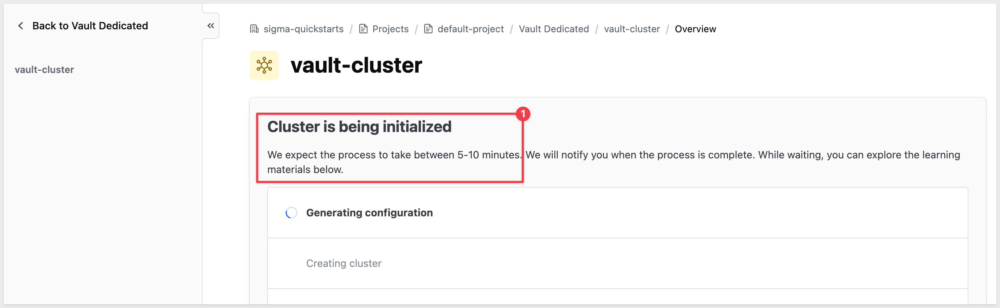

When done, the cluster will show `Running`:

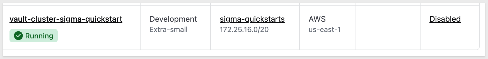

#### Connect to your cluster

<aside class="positive">
<strong>NOTE:</strong><br> HCP Vault Dedicated also ships a full web UI at the same address, where you could click through every step below instead — enabling the secrets engine, writing policies, and adding secrets. This guide uses the CLI instead: a handful of copy-paste commands is faster than clicking through several screens, and the commands work unchanged against any Vault instance.
</aside>

Open your cluster and find the `Cluster URLs` panel. 

Copy the `Public` address — this is your Vault instance's HTTPS endpoint, already reachable from Sigma's cloud servers, no tunnel required.

Next, generate an admin token to authenticate the CLI. 

On the cluster's `Quick actions` panel, click `Generate token`, then click `Copy` on the `New admin token` card:

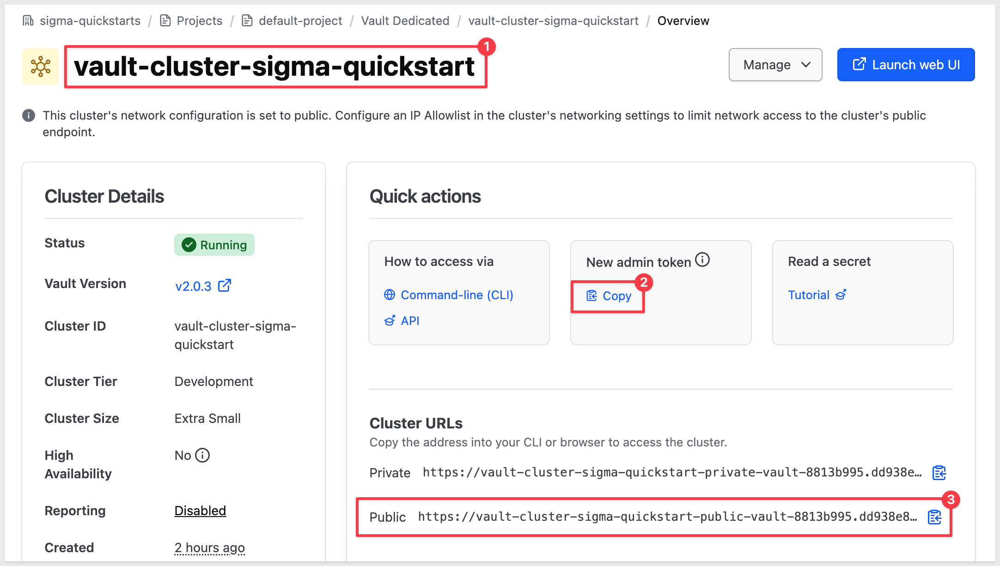

<aside class="negative">
<strong>IMPORTANT:</strong><br> This copies the actual token value to your clipboard — treat it like any other credential and avoid pasting it somewhere it could be logged or screenshotted. It expires in a few hours, which is fine for this QuickStart, but don't reuse it as a long-lived credential.
</aside>

If you don't already have the [Vault CLI](https://developer.hashicorp.com/vault/tutorials/get-started/learn-cli) installed:

```copy-code
brew tap hashicorp/tap
brew install hashicorp/tap/vault
```

Point the CLI at your cluster, and set the `admin` namespace — HCP Vault Dedicated scopes this token to an `admin` namespace rather than the true root namespace, and any `sys/` call (like the mount command below) returns a `403` without it:

```copy-code
export VAULT_ADDR="{your-public-vault-url}"
export VAULT_NAMESPACE="admin"
```

Now log in with the token you just copied:

```copy-code
vault login
```

Paste the token when prompted, rather than passing it directly on the command line where it would land in your shell history. A successful login prints token details (policies, TTL, and so on):

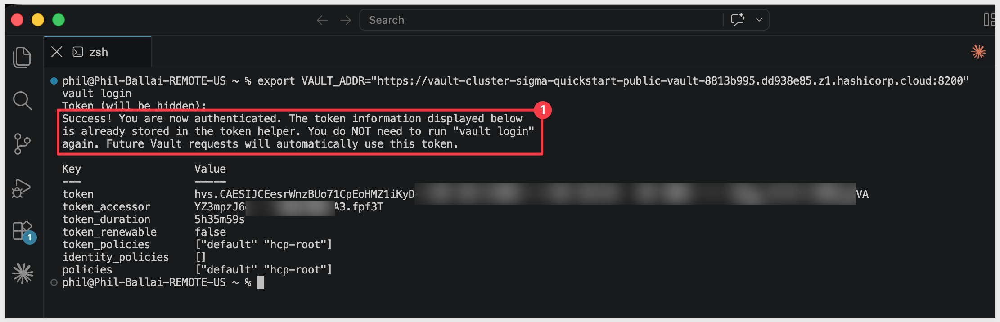

<aside class="positive">
<strong>NOTE:</strong><br> This login is stored by Vault's CLI token helper — new terminal tabs pick it up automatically, so you only need to re-export <code>VAULT_ADDR</code> and <code>VAULT_NAMESPACE</code> in a fresh tab, not the token itself.
</aside>

An HCP Vault Dedicated cluster doesn't come with a KV secrets engine pre-mounted. Enable one now, at a mount path of your choosing — this guide uses `secret`:

```copy-code
vault secrets enable -path=secret kv-v2
```

The response will be similar to:
```code
Success! Enabled the kv-v2 secrets engine at: secret/
```

With that, continue to `Enable a JWT auth method in Vault` below.
-->

### Set up a local Vault dev server

For a quick way to get a testable Vault instance for this QuickStart, run Vault locally in dev mode and expose it through a tunnel. This is a fast path for testing this integration — it isn't a production setup.

#### ngrok setup

This method does require you to create a free account with [ngrok.com](https://ngrok.com/). ngrok is developer infrastructure that routes and secures traffic to your apps, APIs, and AI models — an account is required because ngrok ties every tunnel to an authenticated user, so it can rate-limit and shut down abuse of its infrastructure. Even the free tier won't open a tunnel without an authtoken tied to an account.

Sign up at [ngrok.com](https://ngrok.com/), then go directly to `Your Authtoken` under `Getting Started` in the left nav.

That page shows your actual token plus the exact command to save it, with a `Copy` button:

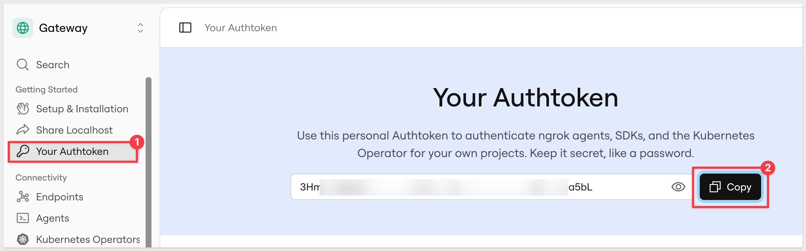

Open a terminal session and run it:

```copy-code
brew install ngrok/ngrok/ngrok
ngrok config add-authtoken {your-authtoken}
```

This installs ngrok and writes the token to local storage:

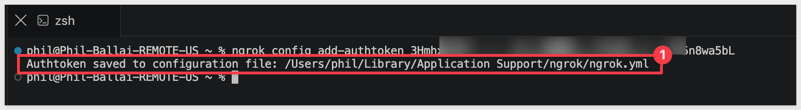

#### Set up Vault

<aside class="negative">
<strong>IMPORTANT:</strong><br> Dev mode stores everything in memory (nothing persists once you stop the process), auto-unseals, and hands you a root token with full access. Use this only for testing this integration, never for real secrets.
</aside>

Create a working folder for this walkthrough and move into it:

```copy-code
mkdir sigma-vault-test
cd sigma-vault-test
```

Install Vault and start a dev server:

```copy-code
brew tap hashicorp/tap
brew install hashicorp/tap/vault
vault server -dev
```

Vault prints a root token and an "Unseal Key" to the terminal on startup — copy the root token, you'll need it for the CLI commands below.

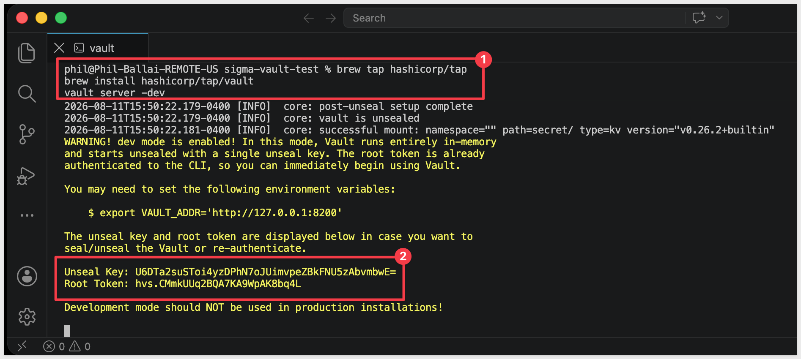

In a new terminal tab, point the Vault CLI at your dev server:

```copy-code
export VAULT_ADDR='http://127.0.0.1:8200'
export VAULT_TOKEN='{root-token-from-startup-output}'
```

Now expose it over HTTPS with the tunnel — ngrok is already installed and authenticated from the setup above, so just start it:

```copy-code
ngrok http 8200
```

ngrok prints a `Forwarding` URL like `https://{random-subdomain}.ngrok-free.app` — that's your `Vault URL` for registering the integration in Sigma. Vault itself is still just speaking plain HTTP on `localhost:8200`; the tunnel is what terminates HTTPS, so Sigma sees a valid HTTPS endpoint either way:

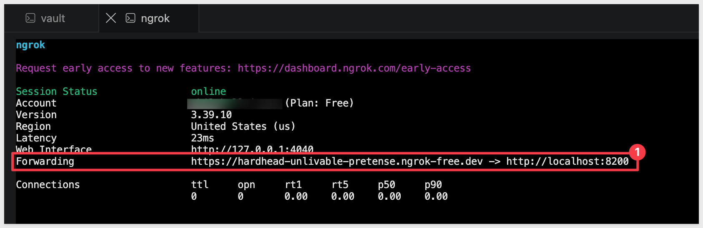

<aside class="positive">
<strong>NOTE:</strong><br> `ngrok http 8200` takes over its terminal tab with a live traffic dashboard — you can't type further commands into that tab while it's running. Leave it alone and open a third terminal tab for the CLI commands below.
</aside>

In that third tab, point the Vault CLI at your dev server again — environment variables don't carry over to a new tab:

```copy-code
export VAULT_ADDR='http://127.0.0.1:8200'
export VAULT_TOKEN='{root-token-from-startup-output}'
```


<!-- END OF SECTION-->

## Enable a JWT auth method in Vault
Duration: 10

We left off here, in the third tab with `VAULT_ADDR` and `VAULT_TOKEN` already exported.

In that tab, run the following to create a policy granting read-only access to the secret path(s) you want Sigma to reach. Every `{curly-brace}` placeholder needs a real value substituted in — for this guide's running example, that's the default `secret/` KV mount and a `hashicorp-*` glob covering both secrets you'll store below:

```copy-code
vault policy write sigma-secrets-policy - <<EOF
path "secret/data/hashicorp-*" {
  capabilities = ["read"]
}
path "sys/mounts" {
  capabilities = ["read", "sudo"]
}
EOF
```

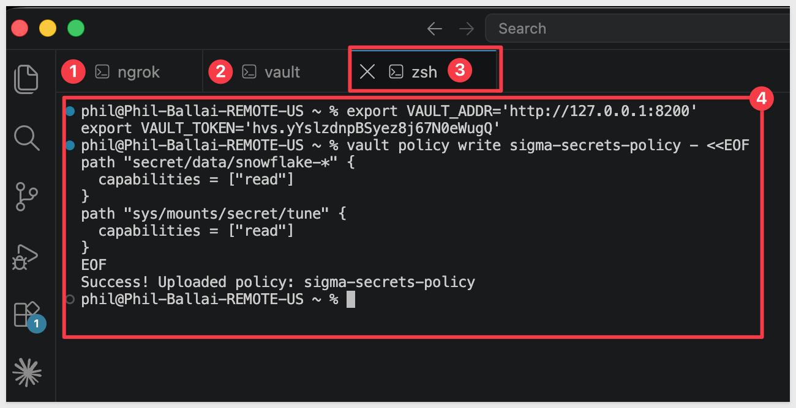

<aside class="positive">
<strong>NOTE:</strong><br> `secret/data/hashicorp-*` uses Vault's trailing-glob syntax to match both `secret/data/hashicorp-privatekey` and `secret/data/hashicorp-passphrase` with one path block — the `*` is only valid as the very last character. If your own secrets don't share a common prefix like this, write a separate `path` block per secret instead. The `sudo` capability on the second path is required — Vault treats the `sys/mounts` endpoint as root-protected, so a client can't even determine your KV version without it.
</aside>

<aside class="negative">
<strong>IMPORTANT:</strong><br> This glob must match the actual secret names you use below, character for character. A policy granting `hashicorp-*` will not cover a secret named `snowflake-privatekey` — Vault returns `403 Forbidden` on any path the policy doesn't explicitly match, even with a correct trust handshake and a correct full API path.
</aside>

That policy only grants read access — it doesn't create anything. If you don't already have a secret stored at that path, write one now, matching this guide's running example. Use single quotes around the value, not double quotes — passphrases often contain `!`, which triggers your shell's history expansion (a confusing `event not found` error) unless it's inside single quotes:

```copy-code
vault kv put secret/hashicorp-privatekey value='{your private key contents}'
```

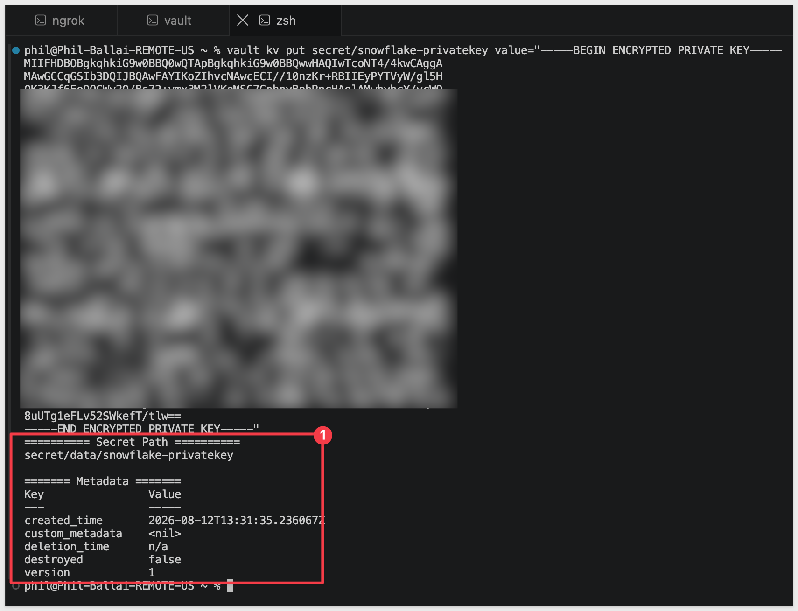

```copy-code
vault kv put secret/hashicorp-passphrase value='{your passphrase}'
```

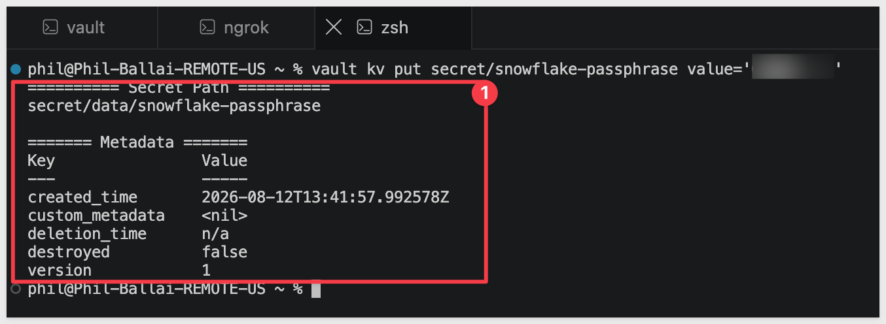

<aside class="positive">
<strong>NOTE:</strong><br> `secret/` is the default KV mount created automatically in dev mode — that's what `secret/data/...` in the policy above refers to. Confirm a secret landed correctly with `vault kv get secret/hashicorp-privatekey`.
</aside>

Enable the JWT auth method at a mount path of your choosing — this example uses `sigma-jwt`:

```copy-code
vault auth enable -path=sigma-jwt jwt
```

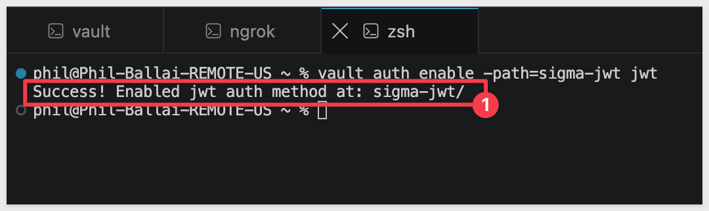

<aside class="negative">
<strong>IMPORTANT:</strong><br> `secret/` above is the mount path for your KV secrets engine (where the actual secret values live) — a separate thing from `sigma-jwt`, the mount path for the JWT auth method you just enabled. Don't reuse the same value for both without meaning to; they serve different purposes.
</aside>

The Vault role that ties this all together needs a `Subject ID` that Sigma generates when you register the integration — that happens in the next step, so hold off creating the role until `Complete the trust handshake in Vault` below, once you actually have that value.

### Register the integration in Sigma

In Sigma, navigate to `Administration` > `Authentication` > `Secret Manager`, then click `Add secret manager`:

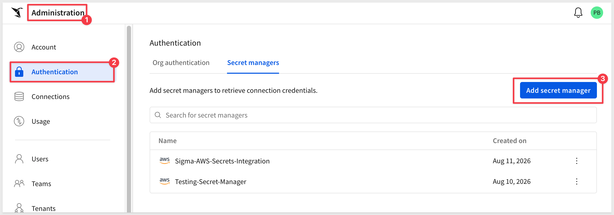

Select `HashiCorp Vault` as the type and `Self-Signed JWT` as the authentication method, then fill in:

- Integration name: a descriptive name for this integration (for example, `HashiCorp-Sigma-Integration-local`)
- Vault URL: your Vault instance's HTTPS address — if you're using the local dev server above, that's your tunnel's `Forwarding` URL. This must be reachable from Sigma's cloud servers, so a local address like `http://127.0.0.1:8200` won't work — use the actual `https://{...}.ngrok-free.app` URL ngrok gave you.
- Mount path: `sigma-jwt` (or whatever you named it above)
- Vault role: `sigma-secrets-policy` — a name for the role you'll create in Vault in the next step; it doesn't need to exist yet
- CA certificate (optional): only needed if your Vault instance uses a private or self-signed certificate. Not applicable if you're following the local dev server + tunnel setup above (ngrok's certificate is already publicly trusted) — but likely needed for a self-hosted Vault Enterprise instance using an internal CA.
- Audience ID: any value you choose (for example, `sigma-vault-integration`) — you'll use this same value when creating the role next

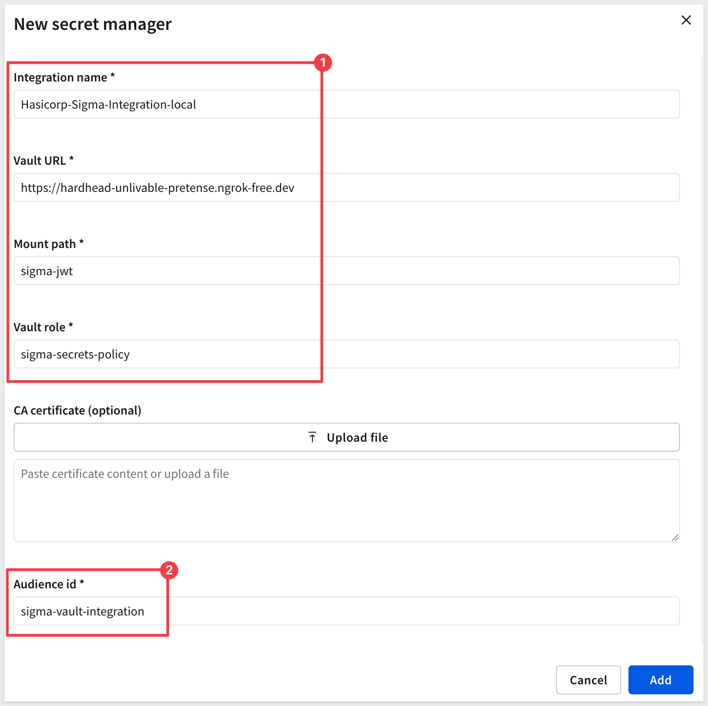

Click `Add`, then open the new integration from the list and record the generated `Subject ID` and `Issuer ID`.

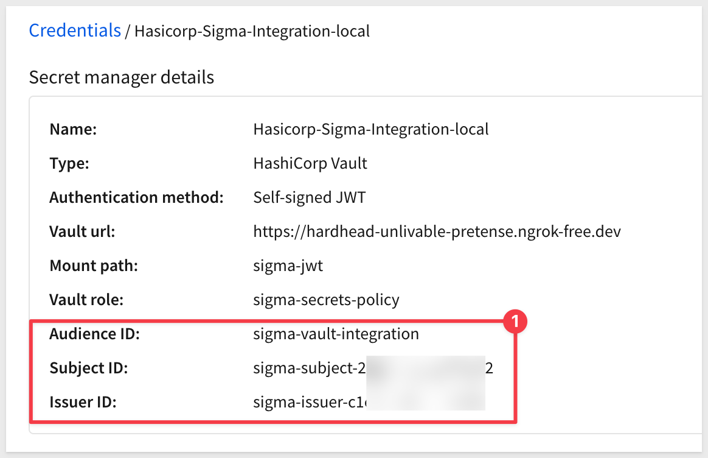

<aside class="negative">
<strong>IMPORTANT:</strong><br> The `Public keys` table further down the page only shows a `Key ID` inline — that's an identifier, not the actual key, and won't work if pasted into Vault. Click the `3-dot` menu on that row and choose `Copy` (or `Download`) to get the real PEM-formatted public key content.
</aside>

<aside class="positive">
<strong>NOTE:</strong><br> This public key is unrelated to any credentials you're storing as secrets. It's Sigma's own key pair, used only to prove Sigma's identity to Vault during login — separate from something like a Snowflake key pair, which is just secret content Vault stores for you and has no bearing on this trust handshake at all.
</aside>

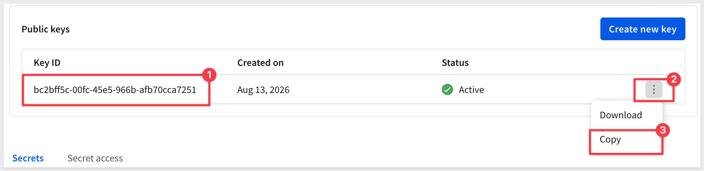

### Complete the trust handshake in Vault

Using the `Subject ID`, `Issuer ID`, and the copied `Public Key` Sigma generated, configure Vault's JWT auth method to trust Sigma as a token issuer:

```copy-code
vault write auth/sigma-jwt/config \
  bound_issuer="{issuer-id-from-sigma}" \
  jwt_validation_pubkeys="{public-key-from-sigma}"
```

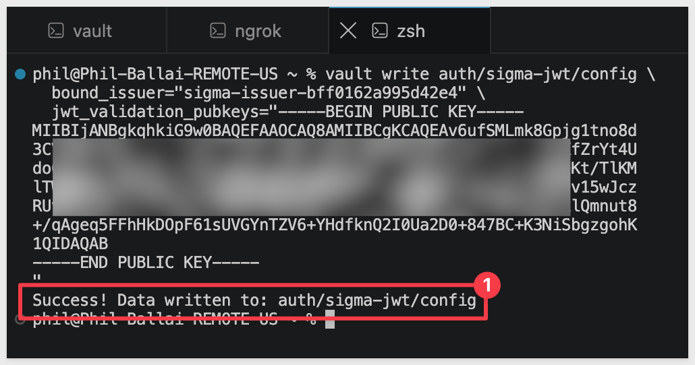

Now create the Vault role, using the `Subject ID` Sigma generated and the same `Audience ID` value you chose and entered into Sigma's form above:

```copy-code
vault write auth/sigma-jwt/role/sigma-secrets-policy \
  role_type="jwt" \
  bound_audiences="{your-audience-id}" \
  bound_subject="{subject-id-from-sigma}" \
  user_claim="sub" \
  policies="sigma-secrets-policy" \
  ttl="1h"
```

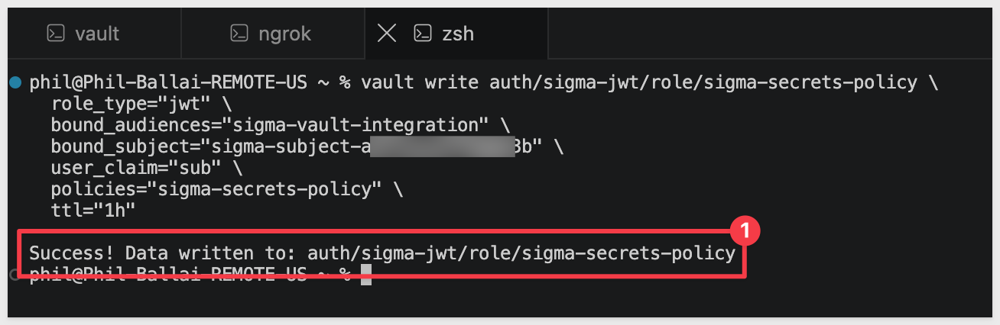

<aside class="positive">
<strong>NOTE:</strong><br> The integration is registered, but you haven't confirmed it actually works yet. Continue to `Add and Use a Secret` to add a secret and verify the trust handshake succeeds end to end.
</aside>


<!-- END OF SECTION-->

## Add and Use a Secret
Duration: 5

With the trust handshake complete, reference your two Vault secrets in Sigma. Sigma only stores a reference to each one — **the values themselves stay in Vault, never in Sigma.**

<aside class="positive">
<strong>NOTE:</strong><br> You already created `secret/hashicorp-privatekey` and `secret/hashicorp-passphrase` via `vault kv put` back in `Enable a JWT auth method in Vault` — nothing further to create in Vault itself.
</aside>

### Add the secrets in Sigma

In Sigma, navigate to `Administration` > `Authentication` > `Secret Manager`, then open the integration you created. On the `Secrets` tab, click `Add secret`:

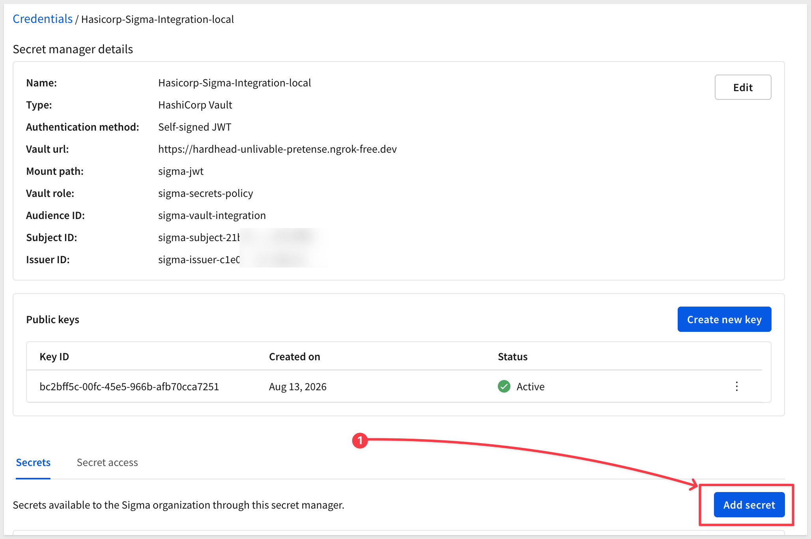

**Private key secret** — fill in:

- Secret name: a friendly label for Sigma, for example:

```copy-code
hashicorp-privatekey
```

- Secret reference: the **full Vault API path**, not the CLI-shorthand path — Sigma doesn't auto-detect your KV version or construct the path for you, so it needs `/v1/{mount}/data/{path}` for a KV v2 mount, for example:

```copy-code
/v1/secret/data/hashicorp-privatekey
```

- Secret format: `JSON` — `vault kv put` always stores secrets as JSON key-value pairs, even for a single value
- Key path:

```copy-code
value
```

  — this matches the key name (`value=`) used when you wrote the secret with `vault kv put`

Click `Add`:

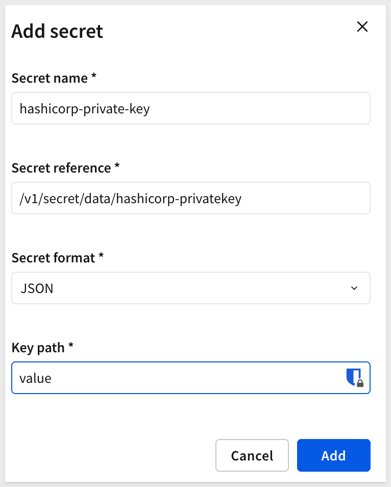

**Passphrase secret** — repeat the same steps with the Secret name:

```copy-code
hashicorp-passphrase
```

The Secret reference (the full API path, same as above):

```copy-code
/v1/secret/data/hashicorp-passphrase
```

Secret format = `JSON`, and Key path = `value`.

Click `Add`.

Both secrets now appear in the `Secrets` list for this integration.

<aside class="positive">
<strong>NOTE:</strong><br> If you stored your own secret with a different key name (for example, `vault kv put secret/mysecret password='...'`), use that key name as `Key path` instead of `value`. If your secret has nested JSON, dot-separated key names (for example, `db.credentials.password`) walk down into it. Check a secret's structure anytime with `vault kv get secret/{path}`.
</aside>

### Confirm Sigma can retrieve both secrets

Before attaching these secrets to a connection, confirm the trust handshake actually works for each one. Open a secret, click the `3-dot` menu > `Test`:

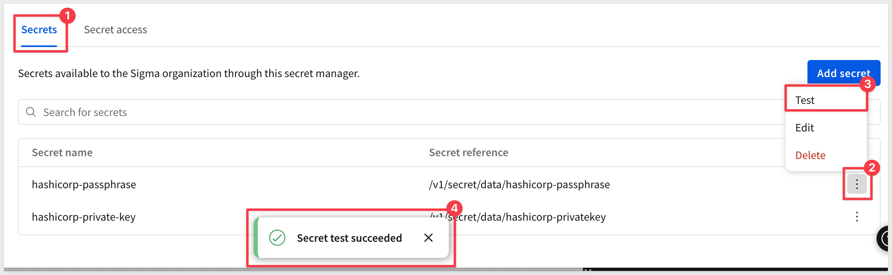

<aside class="negative">
<strong>NOTE:</strong><br> A successful test confirms Sigma can authenticate to Vault via the JWT trust handshake and read that secret's value. Repeat this for the second secret too; a passing test on one doesn't confirm the other.
</aside>

If `Test` fails, double check that `bound_issuer` and `jwt_validation_pubkeys` in `auth/sigma-jwt/config` match Sigma's `Issuer ID` and the key copied via the `3-dot` menu (not the `Key ID`), and that the role's `bound_subject`/`bound_audiences` match Sigma's `Subject ID` and the `Audience ID` you chose when registering the integration.

<aside class="positive">
<strong>IMPORTANT:</strong><br> Passing `Test` confirms Sigma can retrieve *a* value — it doesn't confirm that value is correct for its intended use. See `Common Issues` below if a connection still fails after both secrets pass their tests.
</aside>


<!-- END OF SECTION-->

## Attach a Secret to a Connection
Duration: 5

With a secret added and confirmed working, attach it to whichever connection field needs it. This section uses a Snowflake connection configured with key pair authentication as the running example — if you don't already have a Snowflake key pair, see [Snowflake Key-pair Authorization](https://quickstarts.sigmacomputing.com/guide/security_snowflake_keypair_rotation/index) for how to generate one before continuing.

Each sensitive credential field on a connection — `Password`, `Private key`, `Private key passphrase`, depending on the connection type — has its own `Use secret manager` toggle, so you can mix secret-manager-backed fields with directly-entered ones on the same connection.

### Enable the secret manager toggle on a connection

In Sigma, navigate to `Administration` > `Connections`, then open the connection you want to update (or create a new one).

On the `Private key` field, turn on `Use secret manager`, then fill in:

- Secret manager: the integration you created earlier
- Secret: `hashicorp-privatekey`

Repeat for `Private key passphrase`, this time selecting `hashicorp-passphrase` as the secret:

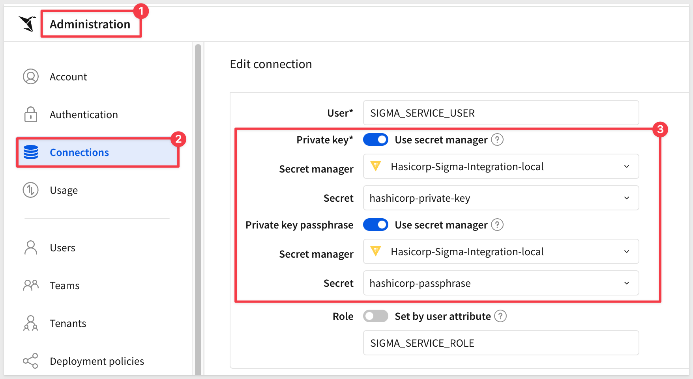

<aside class="negative">
<strong>NOTE:</strong><br> Each credential field toggles independently, so you could leave `Private key` entered directly (via `Add key file`) while only `Private key passphrase` uses the secret manager. That partially defeats the purpose, though — putting both in the secret manager is the better practice, so neither credential piece is typed directly into Sigma.
</aside>

Click `Save`.

If everything is correct, a success message will appear. If not, an error will appear at the top of the page.

<aside class="positive">
<strong>WHY IT MATTERS:</strong><br> The connection never stores the private key or passphrase directly — only a pointer to the secret. Rotate the value in Vault, and every connection referencing it picks up the change automatically, with nothing to update in Sigma.
</aside>

Confirm the connection still works — Browse the connection, open a workbook that uses it, or run a query against it, to verify the secret-manager-backed credentials authenticate correctly.


<!-- END OF SECTION-->

## Monitor Secret Usage
Duration: 5

Before rotating or deleting a secret in Vault, confirm what's actually depending on it — Sigma tracks this for you, so you don't have to find out the hard way.

### Check the Secret access tab

In Sigma, navigate to `Administration` > `Authentication` > `Secret Manager`, then open your integration. Click the `Secret access` tab, next to `Secrets`.

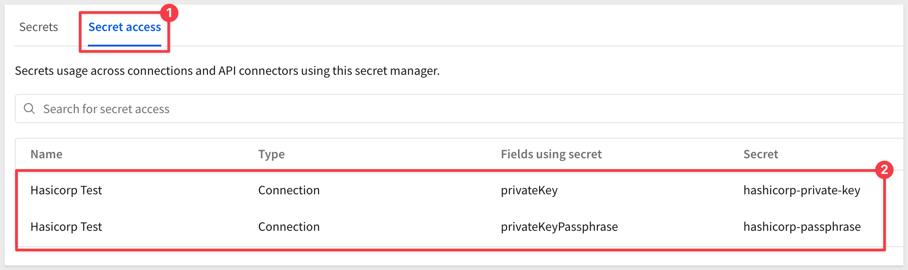

This lists every connection and API connector currently referencing a secret from this integration — check here before rotating a value in Vault or removing a secret from Sigma, so nothing breaks unexpectedly downstream.

<aside class="positive">
<strong>WHY IT MATTERS:</strong><br> Rotating a credential without knowing what depends on it is how outages happen. This tab turns "who's using this?" from a guess into a lookup.
</aside>


<!-- END OF SECTION-->

## Common Issues
Duration: 10

Secret manager integrations involve a lot of moving pieces — Vault's own auth model, Sigma's configuration, and the shape of the secret's underlying value. Most problems trace back to one of the issues below.

### "zsh: event not found" when running a "vault kv put" command

This happens for two reasons stacked together: pasting curly/smart quotes (`“` `”`) instead of straight ones, which your shell doesn't recognize as quotes at all, combined with a value containing `!` — common in generated passwords — which triggers your shell's history expansion unless it's genuinely protected by quotes. Retype the command with straight **single** quotes around the value (`value='YourPassword!'`), not double quotes — single quotes are the only ones that reliably suppress `!` expansion.

### Vault "Test" fails even though login succeeds

Sigma does not auto-detect your KV secrets engine version or build the read path for you — `Secret reference` needs the full Vault API path, not the CLI-shorthand path `vault kv` commands use. For a KV v2 mount (Vault's default), that's `/v1/{mount}/data/{path}`, for example `/v1/secret/data/hashicorp-privatekey` — not `secret/hashicorp-privatekey`. Getting this wrong still lets the JWT trust handshake succeed (you'll see a valid login), but the actual secret read comes back empty.

### "GET /v1/sys/mounts" returns 403 Forbidden

Vault treats the `sys/mounts` endpoint as root-protected, requiring the `sudo` capability even for read access — a plain `capabilities = ["read"]` on that path isn't enough. Add `sudo` alongside `read` in your policy's `sys/mounts` block.

### A connection still fails after fixing a secret's value, even though the secret's own "Test" passes

If you corrected a secret's value after an earlier mistake (a wrong passphrase, a corrupted key), the individual secret's `Test` will reflect the fix immediately — but an existing connection that already references it can hold onto stale state and keep failing anyway. Refreshing the page doesn't always clear this. If toggling `Use secret manager` off and back on for the affected field doesn't help, create a new connection rather than continuing to edit the old one — this reliably picks up the current, correct secret value.

<aside class="negative">
<strong>IMPORTANT:</strong><br> A passing `Test` on a secret confirms Sigma can retrieve *something* from Vault — it does not confirm that value is correct for what you intend to use it for. `Test` has no way to know a private key passphrase should decrypt a specific key, for example. If a connection fails despite every secret passing `Test`, double check the actual stored value character by character rather than assuming the secret manager integration itself is broken.
</aside>


<!-- END OF SECTION-->

## What we've covered
Duration: 5

We connected Sigma to HashiCorp Vault and built a credential flow where nothing sensitive gets typed directly into a Sigma connection — the private key and passphrase for a Snowflake key pair connection live entirely in Vault, and Sigma only ever holds a reference to each one.

The trust mechanism behind this is different from a typical shared-secret setup: Sigma signs its own login requests with a key pair it generates and manages internally, and Vault verifies those signatures against the public key you gave it — no long-lived Vault token ever changes hands. It's the same category of machine-to-machine trust as AWS's role-assumption model, just built on JWTs instead of STS, and it extends to any other Vault-backed credential you'd rather centralize than paste into a connection form.

The payoff compounds once a secret is wired up this way: rotate a value in Vault, and every connection referencing it picks up the change automatically, with nothing to update in Sigma. The `Secret access` tab means you always know what depends on a given secret before you touch it — turning credential rotation from a guessing game into a lookup.

If your organization already treats Vault as the system of record for credentials, this is how that practice extends to Sigma instead of carving out an exception for it.

**Additional Resource Links**

[Blog](https://www.sigmacomputing.com/blog/)<br>
[Community](https://community.sigmacomputing.com/)<br>
[Help Center](https://help.sigmacomputing.com/hc/en-us)<br>
[QuickStarts](https://quickstarts.sigmacomputing.com/)<br>

Be sure to check out all the latest developments at [Sigma's First Friday Feature page!](https://quickstarts.sigmacomputing.com/firstfridayfeatures/)
<br>

[](https://twitter.com/sigmacomputing)&emsp;
[](https://www.linkedin.com/company/sigmacomputing)&emsp;
[](https://www.facebook.com/sigmacomputing)


<!-- END OF WHAT WE COVERED -->
<!-- END OF QUICKSTART -->
