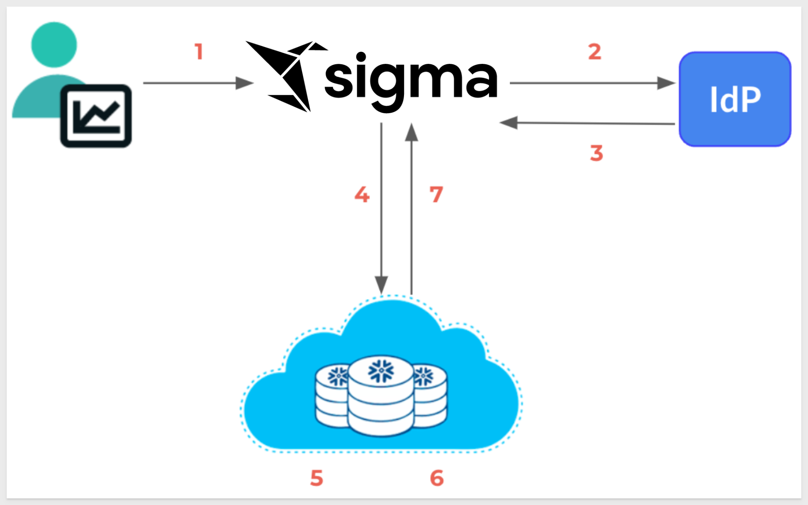
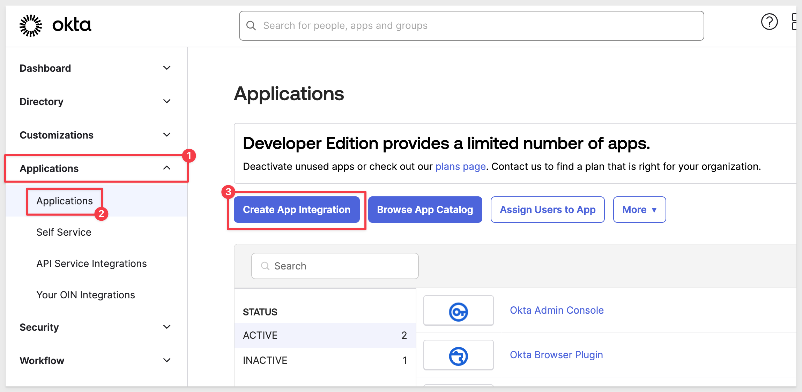

author: pballai
id: security_oauth
summary: security_oauth
categories: Administration
environments: web
status: Published
feedback link: https://github.com/sigmacomputing/sigmaquickstarts/issues
tags: security
lastUpdated: 2024-05-30

# Open Authorization (OAuth)

## Overview 
Duration: 5 

In this QuickStart guide, we will walk through the steps required to set up and use OAuth for connecting Sigma with Snowflake. OAuth provides a secure and efficient way to manage access and permissions between Sigma and Snowflake.

### Target Audience

Sigma administrators interested in implementing RSA connection encryption via key pair authorization and key rotation.

### Prerequisites

<ul>
  <li>A computer with a current browser. It does not matter which browser you want to use.</li>
  <li>Access to a Sigma environment.</li>
  <li>Access to a Snowflake environment. Enterprise is required for trial account testing</li>
  <li>Access to a IdP environment. We will be using an Okta developers account</li>
  <li>Some familiarity with Sigma is assumed. Not all steps will be shown as the basics are assumed to be understood.</li>
</ul>

<aside class="postive">
<strong>IMPORTANT:</strong>  Sigma recommends that you use non-production resources when doing QuickStarts.
</aside>

<button>[Sigma Free Trial](https://www.sigmacomputing.com/free-trial/)</button> <button>[Snowflake Free Trial](https://signup.snowflake.com/)</button>
 

<!-- END OF OVERVIEW -->

## What is OAuth?
Duration: 20

OAuth, which stands for Open Authorization, is an open standard developed by the [Internet Engineering Task Force (IETF)](https://www.ietf.org/) for access delegation. 

It provides a secure way for applications to access user information without requiring the user to expose their passwords.

As the time of this QuickStart, the most widely used version of OAuth is 2.0, which is based on [IEFT RFC6749.](https://datatracker.ietf.org/doc/html/rfc6749)

The OAuth 2.0 authorization framework enables a third-party application to obtain limited access to an HTTP service. 

This can be done either on behalf of a resource owner by orchestrating an approval interaction between the resource owner and the HTTP service, or by allowing the third-party application to obtain access on its own behalf.

OAuth allows third-party services (ie: Sigma) to exchange tokens (with Snowflake for example) for authentication, enabling secure and streamlined access to user resources.

### Why Use OAuth?

#### Enhanced Security:
OAuth significantly improves security by allowing users to grant access to their data without sharing their passwords. This minimizes the risk of credentials being exposed or stolen.

#### Granular Access Control:
With OAuth, users can control the level of access granted to third-party applications. This means they can specify which resources or data the application can access and for how long.

#### Seamless User Experience:
OAuth allows users to authorize applications quickly and easily, providing a smooth and hassle-free authentication process. This improves user experience by reducing the need for repeated logins and password entries.

#### Interoperability:
OAuth is widely adopted and supported by many major platforms and services, making it a versatile solution for authentication and authorization across different systems and applications.

It is widely used as a way to grant websites or applications limited access to a user's information without exposing their passwords. OAuth allows third-party services to exchange tokens for authentication, enabling secure and streamlined access to user resources.

### Benefits of Using OAuth with Sigma

#### Secure Data Access:
By using OAuth, Sigma users can securely connect to Snowflake, ensuring that their data access is controlled and monitored.

#### Simplified Integration:
OAuth simplifies the integration process between Sigma and Snowflake, reducing the complexity of managing credentials and access permissions.

#### Improved Compliance:
OAuth helps organizations comply with security and privacy regulations by providing robust access control mechanisms and minimizing the exposure of sensitive credentials.

By using OAuth, you enhance the security, control, and user experience of your data access processes, ensuring a seamless and secure interaction between Sigma and the cloud data warehouse.

<!-- END OF SECTION-->

## How It Works
Duration: 20

OAuth provides a secure way for applications to access user information using tokens instead of passwords. 

This process involves several key steps to ensure secure and delegated access. Below is an illustrated flow of how OAuth works with Sigma and Snowflake:

### By the numbers

#### 1: User connects to Sigma
The user initiates a connection to Sigma, signaling the start of the authentication process.

#### 2: IdP verifies user information
Sigma redirects the user to the `Identity Provider` (IdP) for authentication. The IdP verifies the user's credentials and identity.

#### 3: The IdP authorization server sends an OAuth token to Sigma
Upon successful verification, the IdP's authorization server issues an OAuth token and sends it to Sigma.

#### 4: Sigma passes a connection string to Snowflake with the OAuth token
Sigma includes the OAuth token in a connection string and forwards it to Snowflake, requesting access to the required data.

#### 5: Snowflake validates the OAuth token
Snowflake receives the connection request and validates the OAuth token to ensure it is authentic and has the appropriate permissions.

#### 6: Snowflake performs a user lookup
Snowflake performs a lookup to map the OAuth token to the corresponding user within its system.

#### 7: On verification, Snowflake creates a session for the user to access data in Snowflake based on their Snowflake role(s)
Once the token is verified and the user is identified, Snowflake creates a session for the user, granting access to the data based on their Snowflake roles.

This process ensures that user credentials are never exposed directly to third-party applications. Instead, OAuth tokens are used to securely delegate access, providing a streamlined and secure method for connecting Sigma to Snowflake.

<!-- END OF SECTION-->

## OAuth with Snowflake
Duration: 20

In this section, we will demonstrate using OAuth with Snowflake.

Configuring OAuth with Snowflake and Sigma will allow you to pass Snowflake roles to Sigma organization members. 

This is accomplished by establishing a chain of trust between your IdP, Snowflake warehouse, and Sigma.

<aside class="negative">
<strong>NOTE:</strong>  After you configure these three entities, you can enable OAuth on a per-connection basis in Sigma for any of your Snowflake connections.
</aside>

### IdP Configuration: 
In order to use OAuth with Sigma, we need to have administrative access to an IdP. We will demonstrate using Okta, but any of the other popular IdPs can be substituted. 

Other popular IdP providers are Azure AD (Microsoft), Amazon AWS Identity and Access Management (IAM), Google Identity Platform, Auth0, OneLogin, Ping Identity and so on.

[Okta offers free developers accounts](https://developer.okta.com/signup/), and we will log into one and demonstrate the process. 

<aside class="negative">
<strong>NOTE:</strong>  We show the IdP setup as example. If you are already familiar with setting up your IdP, feel free to skip the section .......
</aside>

**1: Log in to Okta**
Go to your Okta admin console and log in with your admin credentials.

**2: Navigate to Applications**

From the Okta admin dashboard, scroll down and click the button to `Add App`

Click the `Create a new integration` button and select `OIDC - OpenID Connect` and `Web Application`:

Click `Next`.

**3: Configure OpenID Connect Settings**

Enter a name for your app, such as `Sigma OAuth QuickStart`.

Enter the redirect URI for Sigma. 

If running Sigma on AWS, use: https://aws-api.sigmacomputing.com/api/v2/oauth/1/authcode

Sign-out redirect URIs configuration is optional. We will just use https://app.sigmacomputing.com/{YOUR SIGMA ORGANIZATION NAME}/login.

<aside class="negative">
<strong>NOTE:</strong>  Replace the value for {YOUR SIGMA ORGANIZATION NAME} in the url provided.
</aside>

Creating your Sigma OAuth app will generate a `Client ID` and `Secret`. Both fields will be used for configuration in Sigma later.

Scroll down to the `Grant type` section.

Check the boxes for `Authorization Code` and `Refresh Token`:

Scroll down to `Assignments and choose whether the app is assigned to specific groups or users.

This is where we would normally assign the app to the necessary users or groups that will need access.

Since we have not setup any groups or users, just select `Skip group assignment for now` and click `Save`:

**4: Retrieve Client ID and Client Secret**

After saving, you will be redirected to the application's settings page.

Navigate to the `General` tab (if not already there).

Under the `Client Credentials` section, save the `Client ID` and `Client Secret` off to a text file for use later.

These credentials are required for the Sigma configuration:

<!-- END OF SECTION-->

## Sigma OAuth Configuration
Duration: 20

Log into Sigma as `Administrator` and navigate to `Administration` > `Authentication`. Click `Edit`:

For `Authentication Method` select `OAuth or password`. 

<aside class="positive">
<strong>IMPORTANT:</strong>  It is good practice to allow passwords while configuring and testing OAuth so that if a mistake is made, we are still able to login and correct the issue. Once everything is working correctly, just select "OAuth" from the list, without passwords.
</aside>

To keep this simple for now, disable `Guest access` and `2-Factor Authentication`:

Scroll down and enter the values for `Metadata URI`, `Client ID` and `Client Secret`:

<!-- END OF SECTION-->

## asdasd
Duration: 20

<!-- END OF SECTION-->

## asdasd
Duration: 20

<!-- END OF SECTION-->

## What we've covere
Duration: 5

In this lab we learned how to.........

INSERT FINAL IMAGE OF BUILD IF APPROPRIATE

<!-- THE FOLLOWING ADDITIONAL RESOURCES IS REQUIRED AS IS FOR ALL QUICKSTARTS -->
**Additional Resource Links**

[Blog](https://www.sigmacomputing.com/blog/) 
[Community](https://community.sigmacomputing.com/) 
[Help Center](https://help.sigmacomputing.com/hc/en-us) 
[QuickStarts](https://quickstarts.sigmacomputing.com/) 

Be sure to check out all the latest developments at [Sigma's First Friday Feature page!](https://quickstarts.sigmacomputing.com/firstfridayfeatures/)
 

&emsp;
&emsp;

<!-- END OF WHAT WE COVERED -->
<!-- END OF QUICKSTART -->