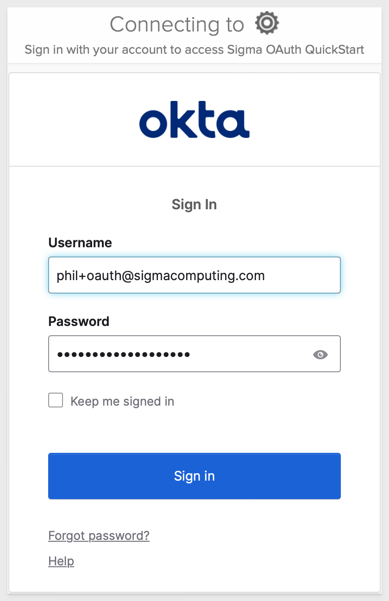
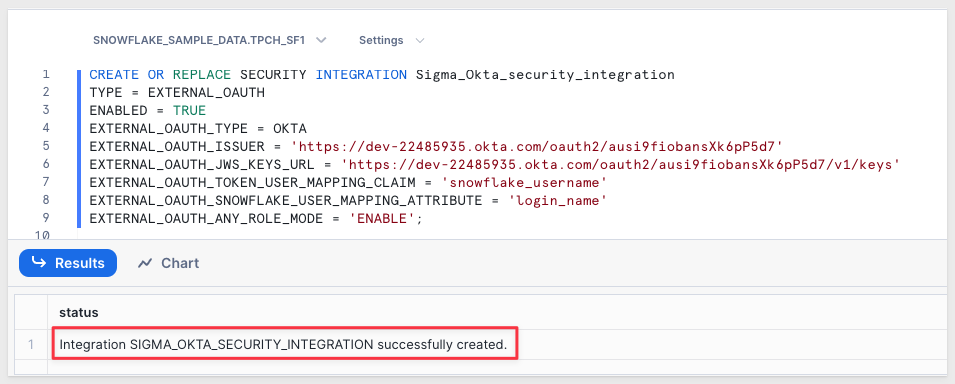
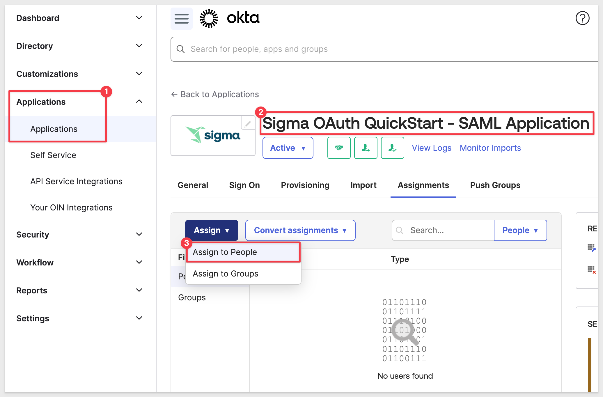
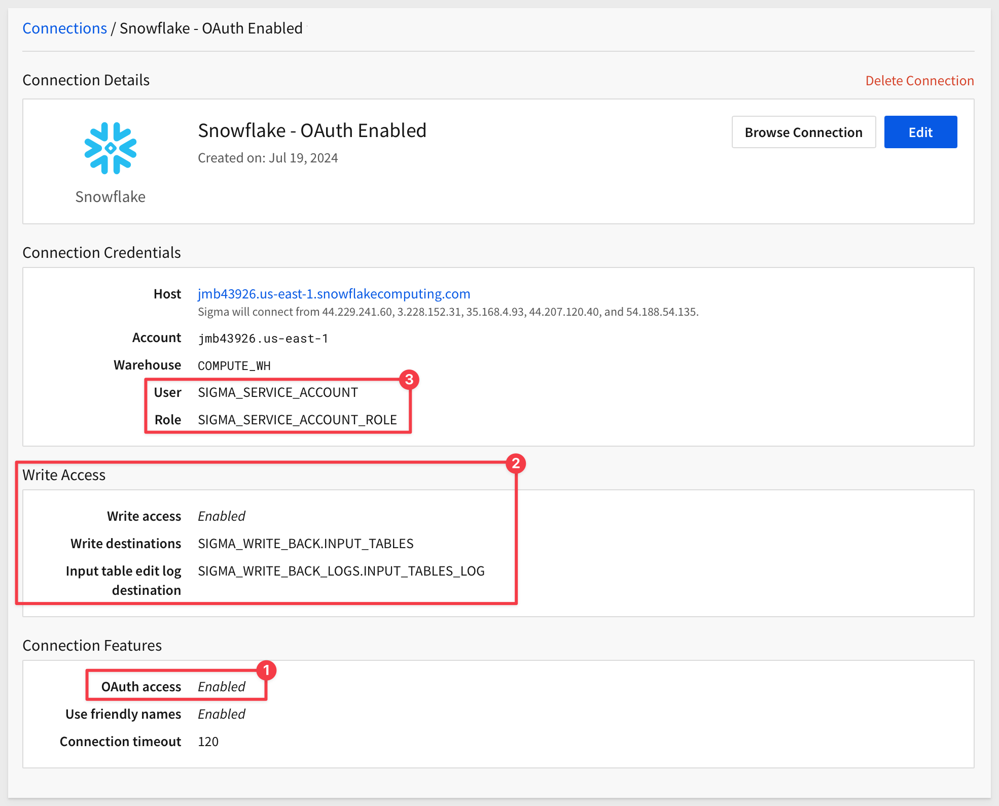
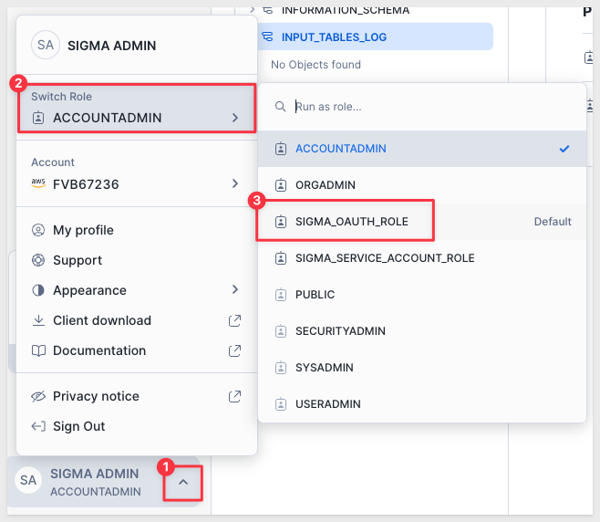

author: pballai
id: security_oauth
summary: security_oauth
categories: security
environments: web
status: Published
feedback link: https://github.com/sigmacomputing/sigmaquickstarts/issues
tags: default
lastUpdated: 2024-07-25

# Open Authorization (OAuth)

## Overview 
Duration: 5 

In this QuickStart guide, we will walk through the steps required to set up and use OAuth with Sigma. OAuth provides a secure and efficient way to manage access and permissions between Sigma and Snowflake. 

We will present this in sections:

1: Configuring for OAuth with user/password authentication<br>
2: Enabling OAuth for Snowflake<br>
3: Enabling user auto-provisioning with Okta and Sigma<br>
4: Configuring Sigma Write-back with OAuth and Snowflake<br>

<aside class="positive">
<strong>IMPORTANT:</strong><br> This will provide a basic demonstration of the various processes, although not all are always required. Exactly how to configure this for your organization is highly dependant on your use case and governance needs.
</aside>

We will not cover all the various configuration options available in Okta or Snowflake, as that is outside the scope of a QuickStart. Please refer to the respective vendors documentation for those details.

<aside class="positive">
<strong>IMPORTANT:</strong><br> Some screens in Sigma may appear slightly different from those shown in QuickStarts. This is because Sigma is continuously adding and enhancing functionality. Rest assured, Sigma’s intuitive interface ensures that any differences will not prevent you from successfully completing any QuickStart.
</aside>

For more information on Sigma's product release strategy, see [Sigma product releases.](https://help.sigmacomputing.com/docs/sigma-product-releases)

### Target Audience

Sigma administrators interested in implementing single-sign-in using the OAuth security model.

### Prerequisites

<ul>
  <li>A computer with a current browser. It does not matter which browser you want to use.</li>
  <li>Access to a Sigma environment.</li>
  <li>Access to a Snowflake environment. Enterprise is required for trial account testing</li>
  <li>Access to a IdP environment. We will be using an Okta developers account</li>
  <li>Some familiarity with Sigma is assumed. Not all steps will be shown as the basics are assumed to be understood.</li>
</ul>

<aside class="postive">
<strong>IMPORTANT:</strong><br> Sigma recommends that you use non-production resources when doing QuickStarts.
</aside>

<button>[Sigma Free Trial](https://www.sigmacomputing.com/free-trial/)</button> <button>[Snowflake Free Trial](https://signup.snowflake.com/)</button> <button>[Okta Developers Account](https://developer.okta.com/signup/)</button>
 

<!-- END OF OVERVIEW -->

## What is OAuth?
Duration: 20

OAuth, which stands for Open Authorization, is an open standard developed by the [Internet Engineering Task Force (IETF)](https://www.ietf.org/) for access delegation. 

It provides a secure way for applications to access user information without requiring the user to expose their passwords.

As the time of this QuickStart, the most widely used version of OAuth is 2.0, which is based on [IEFT RFC6749.](https://datatracker.ietf.org/doc/html/rfc6749)

The OAuth 2.0 authorization framework enables a third-party application to obtain limited access to an HTTP service. 

This can be done either on behalf of a resource owner by orchestrating an approval interaction between the resource owner and the HTTP service, or by allowing the third-party application to obtain access on its own behalf.

OAuth allows third-party services (ie: Sigma) to exchange tokens (with Snowflake for example) for authentication, enabling secure and streamlined access to user resources.

### Why Use OAuth?

#### Enhanced Security:
OAuth significantly improves security by allowing users to grant access to their data without sharing their passwords. This minimizes the risk of credentials being exposed or stolen.

#### Granular Access Control:
With OAuth, users can control the level of access granted to third-party applications. This means they can specify which resources or data the application can access and for how long.

#### Reduced Administrative Overhead:
OAuth simplifies user management by allowing seamless integration with identity providers like Okta. This reduces the need for manual user provisioning and de-provisioning.

#### Seamless User Experience:
OAuth allows users to authorize applications quickly and easily, providing a smooth and hassle-free authentication process. This improves user experience by reducing the need for repeated logins and password entries.

#### Interoperability:
OAuth is widely adopted and supported by many major platforms and services, making it a versatile solution for authentication and authorization across different systems and applications.

It is widely used as a way to grant websites or applications limited access to a user's information without exposing their passwords. OAuth allows third-party services to exchange tokens for authentication, enabling secure and streamlined access to user resources.

### Benefits of Using OAuth with Sigma

By using OAuth, Sigma users can securely connect to Snowflake (or another supported Cloud Data Warehouse, CDW), ensuring that their data access is controlled and monitored. OAuth facilitates the secure exchange of tokens, minimizing the risk of exposing sensitive credentials.

#### Centralized Permission and Access Control
Sigma does not use its own permission system but instead relies on Snowflake’s credentials for user authentication. This is achieved through the Sigma logon UI in combination with OAuth. By using OAuth, users can log into Sigma using their Snowflake credentials, ensuring that Snowflake manages all user permissions and access controls.

#### Alternative to Sigma-Managed Permissions
In scenarios where organizations prefer to use CDW-based user permission and access control, OAuth provides an alternative to having Sigma manage table access for various users. This allows organizations to maintain a consistent and centralized permission strategy, leveraging Snowflake’s robust access control features.

#### Simplified Integration
OAuth simplifies the integration process between Sigma and Snowflake, reducing the complexity of managing credentials and access permissions. Instead of Sigma managing individual user permissions, Snowflake handles all data access and logon credentials for every user, streamlining the entire process.

#### Improved Compliance
OAuth helps organizations comply with security and privacy regulations by providing robust access control mechanisms and minimizing the exposure of sensitive credentials. By leveraging Snowflake’s permission system, organizations can ensure that all access controls and compliance requirements are uniformly enforced.

By using OAuth, you enhance the security, control, and user experience of your data access processes, ensuring a seamless and secure interaction between Sigma and the cloud data warehouse. This configuration leverages Snowflake’s existing infrastructure to manage user credentials and permissions, reducing administrative overhead and improving overall security.


<!-- END OF SECTION-->

## How It Works
Duration: 20

OAuth provides a secure way for applications to access user information using tokens instead of passwords. 

This process involves several key steps to ensure secure and delegated access. Below is an illustrated flow of how OAuth works with Sigma and Snowflake:


### By the numbers

#### 1: User connects to Sigma
The user initiates a connection to Sigma, signaling the start of the authentication process.

#### 2: IdP verifies user information
Sigma redirects the user to the `Identity Provider` (IdP) for authentication. The IdP verifies the user's credentials, identity, account type, team membership and more.

#### 3: The IdP authorization server sends an OAuth token to Sigma
Upon successful verification, the IdP's authorization server issues an OAuth token and sends it to Sigma.

#### 4: Sigma passes a connection string to Snowflake with the OAuth token
Sigma includes the OAuth token in a connection string and forwards it to Snowflake, requesting access to the required data.

#### 5: Snowflake validates the OAuth token
Snowflake receives the connection request and validates the OAuth token to ensure it is authentic and has the appropriate permissions.

#### 6: Snowflake performs a user lookup
Snowflake performs a lookup to map the OAuth token to the corresponding user within its system.

#### 7: On verification, Snowflake creates a session for the user to access data in Snowflake based on their Snowflake role(s)
Once the token is verified and the user is identified, Snowflake creates a session for the user, granting access to the data based on their Snowflake roles.

This process ensures that user credentials are never exposed directly to third-party applications. Instead, OAuth tokens are used to securely delegate access, providing a streamlined and secure method for connecting Sigma to Snowflake.

Configuring OAuth with Snowflake and Sigma will allow you to pass Snowflake roles to Sigma organization members. 

This is accomplished by establishing a chain of trust between your IdP, Snowflake warehouse, and Sigma.

<aside class="negative">
<strong>NOTE:</strong><br> After you configure these three entities, you can enable OAuth on a per-connection basis in Sigma for any of your Snowflake connections.
</aside>

<aside class="positive">
<strong>USER PROVISIONING:</strong><br> We will initially use a single user whose email is the primary identifier. This user will be manually configured in Okta, Sigma and Snowflake. This will make the initial configuration and validation simple. Once that is all done, we will automate user provisioning as a last step. 
</aside>


<!-- END OF SECTION-->

## Okta developers account
Duration: 20

In order to use OAuth with Sigma, we need to have administrative access to an IdP. We will demonstrate using Okta, but any of the other popular IdPs can be substituted. 

<aside class="positive">
<strong>IMPORTANT:</strong><br> Make sure that the email used for Okta administration is the same as is used in Sigma and Snowflake for administration. While not required, this will make this demonstration easier. 
</aside>

Other popular IdP providers are Azure AD (Microsoft), Amazon AWS Identity and Access Management (IAM), Google Identity Platform, Auth0, OneLogin, Ping Identity and so on.

[Okta offers free developers accounts](https://developer.okta.com/signup/), and we will log into one and demonstrate the process. 

<aside class="negative">
<strong>NOTE:</strong><br> We show the IdP setup as example. If you are already familiar with setting up your IdP, feel free to skip the section.
</aside>

### Create a text file
Before we start configuring things, lets create a text file (any text editor is fine to use) to hold a few values as we create them. 

Temporarily holding these values will make things a little easier for us as we go, especially since we want to use incognito/private browser sessions. 

Create the following placeholders in the text file:
```code
TEST USER CREDENTIALS:
EMAIL = 
PASSWORD = 

OKTA:
METADATA URI = 
CLIENT ID =
CLIENT SECRET =
EXTERNAL_OAUTH_ISSUER =
EXTERNAL_OAUTH_JWS_KEYS_URL =
AUTHORIZATION SERVER = Sigma OAuth QuickStart Server
APPLICATION = Sigma OAuth QuickStart
TESTING SCOPE = session:role-any

SNOWFLAKE:
TRIAL ACCOUNT URL =  
SECURITY INTEGRATION = 

SIGMA:
Sign-in redirect URIs = https://aws-api.sigmacomputing.com/api/v2/oauth/1/authcode
Sign-out redirect URI = 
TRIAL ACCOUNT URL = 
BEARER TOKEN = 
```

`Save` the file with blank values for now.

<aside class="positive">
<strong>IMPORTANT:</strong><br> Sharing this information with Sigma support can help us resolve setup issues you may be having too!
</aside>


## Create a new Okta application integration
Duration: 5 

We are still in Okta as administrator.

From the Okta admin dashboard, scroll down to `Applications` and `Applications`. Click the button to `Create App Integration`:


Select `OIDC - OpenID Connect` and `Web Application`:


Click `Next`.

Enter a name for your app, such as `Sigma OAuth QuickStart`.

Give your app a logo if you want.

Click on the `Refresh Token` checkbox.

Enter the `Sign-in redirect URIs` for Sigma. Remove the default one by clicking on the `x` button and then click `+ Add URI`

If running Sigma on AWS, use: 
```code
https://aws-api.sigmacomputing.com/api/v2/oauth/1/authcode
```

If running Sigma on Azure use:
```code
https://api.us.azure.sigmacomputing.com/
```

If running Sigma on GCP use:
```code
https://api.sigmacomputing.com/api/v2/oauth/1/authcode
```

Configuring a `Sign-out redirect URI` is optional. This is the page the users will see upon logout from Sigma.

We will use (replacing `{YOUR-SIGMA-ORGANIZATION-NAME}` with our Sigma trials organization name):
```code
https://app.sigmacomputing.com/{YOUR-SIGMA-ORGANIZATION-NAME}/login
```

Update the text file with the `sign-in redirect URI` and `sign-out redirect URI` values.

Scroll down to `Assignments` and choose if the new app is assigned to specific groups or users.

This is where we would normally assign the app to the necessary users or groups that will need access.

Just select `Skip group assignment for now` and click `Save`:

The configuration should look similar to this now: 


### Retrieve Client ID and Client Secret

After saving, you will be redirected to the new applications settings page.

Navigate to the `General` tab (if not already there).

Under the `Client Credentials` section, copy both the `Client ID` and `Client Secret` off to our text file for use later.

Okta provides buttons to allow quick copy of each value.

These credentials are required for the Sigma configuration:


<!-- END OF SECTION-->

## Create an Okta authorization server
Duration: 5 

From the Okta admin dashboard, Navigate to `Security` > `API` in the left-hand sidebar.

In the `Authorization Servers` tab, click on the `Add Authorization Server` button:


Enter a name for your authorization server, such as `Sigma OAuth QuickStart Server.`

Provide a description for the authorization server if desired.

For `Audience`, we must provide the URL of the Snowflake account we intend to use later, when we create a Sigma connection to Snowflake.

For example: 
```code
https://<your-snowflake-account>.snowflakecomputing.com
```

If you don’t know where to find this, log into your Snowflake account and click on the profile icon, as shown below, to copy the URL:


Paste the URL into Okta and click `Save`:


After saving, Okta will return us to the `Sigma OAuth QuickStart Server` page. 

Scroll down to copy the `Metadata URI`:


Copy the `Metadata URI` off to our text file for later use.

The `Metadata URI` is also the value for `EXTERNAL_OAUTH_ISSUER` and `EXTERNAL_OAUTH_JWS_KEYS_URL` in our text file. with some edits.

For `EXTERNAL_OAUTH_ISSUER`, delete the trailing `/.well-known/oauth-authorization-server` from the URL.

For `EXTERNAL_OAUTH_JWS_KEYS_URL`, delete the trailing `/.well-known/oauth-authorization-server` and replace with `/v1/keys`.

For example, the text file should look similar to this, except with your values:


<aside class="negative">
<strong>NOTE:</strong><br> The private information shown above is no longer valid; we wanted to show the exact information to make this as easy as possible.
</aside>

### Add scope to auth server
Click the `Scopes` tab and the `+ Add Scope` button:


Under `Edit Scope` configure as shown, adding a scope named `session:role-any`:


Click `Save`.

### Add claim to auth server
Click the `Claims` tab and the `Add Claim` button:


Under `Add Claim` configure as shown:


<aside class="negative">
<strong>NOTE:</strong><br> We added this claim for Snowflake now to save a few steps later. It is not required for the OAuth between Okta and Sigma until we add the Snowflake connection in Sigma too. It was just convenient to configure now, since we are already here. 
</aside>

### Add access policy to auth server
Click the `Access Policies` tab and the `Add Policy` button:

Under `Add Policy` configure as shown. Number 3 shows searching the available Okta apps to find our `Sigma OAuth QuickStart` app. Select that one and click `Create Policy`:


With the policy created, we can click the `Add rule` button:


Configure the rule as shown below:


Click `Create rule`.


<!-- END OF SECTION-->

## Create Test User Accounts
Duration: 5 

As previously mentioned, we will use a single email as our test user in all three systems. It can be any email you prefer, but you will need to accept an email in order to complete account setup in Sigma.

`People` in OKTA will be mapped to both Sigma and Snowflake (once we fully complete the configuration).

### Add test user in Okta
Log into the Okta admin console with admin credentials.

Navigate to `Directory` > `People` and click `Add person`:


Add your test user's email, taking care to manually set a password. 

<aside class="positive">
<strong>IMPORTANT:</strong><br> We will use email address as the unique identifier, so take care to set both the username and email the same, to keep things simple for now.
</aside>


Make note of this email/password in our text file. 

### Add user in Sigma
Add the same user/password in Sigma. We selected to use the `Pro` license type but it does not matter for this exercise.


If you don't know how, see [Invite new organization members.](https://help.sigmacomputing.com/docs/invite-new-organization-members)

### Add users in Snowflake
Run the following sql script in the Snowflake trial account, editing for your values:

```code
-- 1: Set account admin role for script:
USE ROLE ACCOUNTADMIN;

-- 2: Set database to sample data:
USE DATABASE SNOWFLAKE_SAMPLE_DATA;

-- 3: Create Role:
CREATE OR REPLACE ROLE SIGMA_OAUTH_ROLE comment = 'For Sigma OAuth QuickStart';

-- NOTE: The Snowflake Sample Database is shared asset and that limits what privileges are allowed. This is ok, we will work around that.

-- 4: Grant privileges to the newly created role on one Snowflake sample database:
GRANT IMPORTED PRIVILEGES ON DATABASE SNOWFLAKE_SAMPLE_DATA TO ROLE SIGMA_OAUTH_ROLE;

-- 5: Create a TEST user for new Sigma Connection:
CREATE OR REPLACE USER "YOUR-TEST-USER-EMAIL"
    password = 'YOUR-TEST-USER-PASSWORD'
    login_name = "YOUR-TEST-USER-EMAIL"
    display_name = "YOUR-TEST-USER-EMAIL"
    first_name = 'TEST'
    last_name = 'USER'
    must_change_password = false
    disabled = false
    default_warehouse = compute_wh
    default_namespace = SNOWFLAKE_SAMPLE_DATA
    default_role = SIGMA_OAUTH_ROLE
    comment = 'For Sigma OAuth QuickStart';

-- 6: Grant the role to the user:
    GRANT ROLE SIGMA_OAUTH_ROLE TO USER "YOUR-TEST-USER-EMAIL";

-- 7: Grant warehouse usage to role:
    GRANT USAGE ON WAREHOUSE COMPUTE_WH TO ROLE SIGMA_OAUTH_ROLE
```

<aside class="positive">
<strong>IMPORTANT:</strong><br> Our Okta authorization server is configured to use the users email address to match the username in  Snowflake. 

This is why our Snowflake script sets the users login name to the email address. 

This configuration can be different; this is just how we are doing it in this QuickStart.

We could also have use the "sub" claim from Okta as well but it is common to have multiple Okta claims, and assign them to different scopes. 
</aside>


<aside class="negative">
<strong>NOTE:</strong><br> Make sure to set the password to the same one used for this user in Sigma. This won't be required later, when we implement user provisioning. 
</aside>

### What about admin access in Snowflake
When creating your Snowflake trial account, what email address did you use for admin access?

Let's pause and think about this a second. We just added our test user account to Okta, Sigma and Snowflake, but we have not yet created a Snowflake connection in Sigma. 

We will do that later, but when we do, **we must log in using SSO** and use the Sigma email address so that we can access the administrative section of Sigma. 

If the Sigma admin user's email address is not also added to Snowflake, it will not be possible to add the connection in Sigma using SSO. We would get an error similar to this one if the admin user is not in Snowflake too:


Bottom line; we need to also add the Sigma administrators email (IF IT DOES NOT ALREADY EXIST) using the same Snowflake script we just ran to add our test user to Snowflake.

If it already exists in Snowflake, skip this part of this section.

Go ahead and add the Sigma administrator to Snowflake, taking care to adjust the script for the new values:
```code
-- 1: Set account admin role for script:
USE ROLE ACCOUNTADMIN;

-- NOTE: The Snowflake Sample Database is shared asset and that limits what privileges are allowed. This is ok, we will work around that.

-- 2: Create a SIGMA ADMIN USER:
CREATE OR REPLACE USER "YOUR-SIGMA-ADMIN-EMAIL"
    password = 'YOUR-SIGMA-ADMIN-PASSWORD'
    login_name = "YOUR-SIGMA-ADMIN-EMAIL"
    display_name = "YOUR-SIGMA-ADMIN-EMAIL"
    first_name = 'SIGMA'
    last_name = 'ADMIN'
    must_change_password = false
    disabled = false
    default_warehouse = COMPUTE_WH
    default_namespace = SNOWFLAKE_SAMPLE_DATA
    default_role = SIGMA_OAUTH_ROLE
    comment = 'For Sigma OAuth QuickStart';

-- 3: Grant the role to the user:
    GRANT ROLE sigma_oauth_role TO USER "YOUR-SIGMA-ADMIN-USER-EMAIL";

-- 4: Grant warehouse usage to role:
    GRANT USAGE ON WAREHOUSE COMPUTE_WH TO ROLE SIGMA_OAUTH_ROLE
```

### Error: Could not connect to database
There are many possible places where incorrect configuration can throw an error. In the case of this error, shown below, the Snowflake admin user has not been assigned a default role:


If you never have seen this error, GREAT!. If you do get it when attempting to add the OAuth-enabled Snowflake connection in Sigma, we just need to update the Snowflake admin user to have a default role. 

For example, our Snowflake admin user is named "QUICKSTARTS" so the script to run in Snowflake to provision the a default role is this:
```code
-- Update the user default role
ALTER USER QUICKSTARTS SET
    DEFAULT_ROLE = SIGMA_OAUTH_ROLE;
```

In practice, this issue is not likely to occur, but in trial accounts, lots of things can happen as "experiments" are performed. 


<!-- END OF SECTION-->

## Provision Okta app to test user
Duration: 20

Now that we have a test user, we need to give them an Okta `assignment` to the `Sigma OAuth QuickStart` app we created earlier.

In Okta, navigate to `Applications` > `Applications` and click to select the `Sigma OAuth QuickStart` app and then select the `Assignments` tab. Select `Assign` and `Assign to People`:


Click the `Assign` button for our test user.

Wait for the modal to appear called `Assign Sigma OAuth QuickStart to People`, scroll to the bottom and click `Save and Go Back`.


Click `Done`.

Our test user is now assigned to our Okta application:


### Okta token preview
Okta provides a method to validate our test user can obtain a valid token, based on a configuration.

Navigate to `Security` > `API` > `Authorization Servers` > `Sigma OAuth QuickStart Server` and the `Token Preview` tab.

Fill out the form and click `Preview Token`:


We can see that the value for our claim called `snowflake_username` is returning our test users email address. This is the value that will be passed from Okta to Snowflake when we try to use an OAuth enabled Snowflake connection in Sigma. 

If you are unable to get a valid token in this page, something is not configured correctly.


<!-- END OF SECTION-->

## Sigma OAuth Configuration
Duration: 20

Log into Sigma as `Administrator` and navigate to `Administration` > `Authentication`. Click `Edit`:


For `Authentication Method` select `OAuth or password`. 

<aside class="positive">
<strong>IMPORTANT:</strong><br> It is good practice to allow passwords while configuring and testing OAuth so that if a mistake is made, we are still able to login and correct the issue. Once everything is working correctly, just select "OAuth" from the list, without passwords.
</aside>

To keep this simple for now, disable `Guest access` and `2-Factor Authentication`:


Scroll down and enter the values for `Metadata URI`, `Client ID` and `Client Secret` we saved from Okta earlier, and click `Save`:


### Login to Sigma with OAuth - Test
Open a new incognito (or private) browser window and navigate to your Sigma login page. You can copy it from the text file, if you made note of it there.

We want to click the button or link to `Sign in with SSO`:


Sigma will redirect the login request to Okta. Login using the test users email/password.



We the configurations were done correctly, we will successfully access Sigma:


If all you needed was basic OAuth, you are done.

<aside class="negative">
<strong>NOTE:</strong><br> This configuration included extra steps for Snowflake that would not be required for "basic OAuth". Basic OAuth assumes that users need some level of manual management in both the IdP and Sigma. This may or may not be optimal for your organization but some customers go this route, so we are discussing some of the many possibilities. We definitely will not cover them all in a QuickStart.
</aside>

Next, we will configure an OAuth-based Sigma connection to Snowflake.


<!-- END OF SECTION-->

## Snowflake Configuration
Duration: 20

The Sigma connection to Snowflake will use a **Snowflake Security Integration** to enable OAuth communications.

A Snowflake Security Integration configuration is a setup process that allows Snowflake to integrate with external security providers for authentication and authorization purposes. This configuration enables Snowflake to securely handle user identities and access controls by leveraging external identity providers, such as Okta, Azure AD, or other OAuth and SAML-compliant services.

Log in to your Snowflake account with the necessary `ACCOUNTADMIN` privileges.

### Create a Security Integration:
We will use the previously copied `EXTERNAL_OAUTH_ISSUER` and `EXTERNAL_OAUTH_JWS_KEYS_URL` in the Snowflake security integration configuration.

Run the following script in a Snowflake SQL Worksheet, changing the values for `EXTERNAL_OAUTH_ISSUER`
and `EXTERNAL_OAUTH_JWS_KEYS_URL` for your values:
```code
CREATE OR REPLACE SECURITY INTEGRATION Sigma_Okta_security_integration
TYPE = EXTERNAL_OAUTH
ENABLED = TRUE
EXTERNAL_OAUTH_TYPE = OKTA
EXTERNAL_OAUTH_ISSUER = 'YOUR VALUE'
EXTERNAL_OAUTH_JWS_KEYS_URL = 'YOUR VALUE'
EXTERNAL_OAUTH_TOKEN_USER_MAPPING_CLAIM = 'snowflake_username'
EXTERNAL_OAUTH_SNOWFLAKE_USER_MAPPING_ATTRIBUTE = 'login_name'
EXTERNAL_OAUTH_ANY_ROLE_MODE = 'ENABLE';
```

The expected result is:



<aside class="negative">
<strong>NOTE:</strong><br> The Snowflake script is set to create or replace so if a mistake is made you may edit the script and rerun it again. The screenshot above also shows commented commands to show the details for the security integration and of the user used (in this example; your user's name will be different).
</aside>

### Explanation of each script parameter:

 <ul>
      <li><strong>EXTERNAL_OAUTH_TYPE:</strong> Specifies the type of external OAuth provider (Okta in this case).</li>
      <li><strong>EXTERNAL_OAUTH_ISSUER:</strong> The Issuer URL from your Okta authorization server.</li>
      <li><strong>EXTERNAL_OAUTH_JWS_KEYS_URL:</strong> The JWKS URL for fetching the signing keys.</li>
      <li><strong>EXTERNAL_OAUTH_AUDIENCE_LIST:</strong>  Specifies the expected audience of the OAuth token.</li>
      <li><strong>EXTERNAL_OAUTH_TOKEN_USER_MAPPING_CLAIM:</strong> The claim in the OAuth token that maps to the Snowflake user (usually sub for subject).</li>
      <li><strong>EXTERNAL_OAUTH_SNOWFLAKE_USER_MAPPING_ATTRIBUTE:</strong> The Snowflake email attribute to map the OAuth claim to email address, but this can be customized based on your setup.</li>
      <li><strong>EXTERNAL_OAUTH_ANY_ROLE_MODE:</strong> Enables or disables the ability for the user to assume any role specified in the token.</li>
</ul>

With Snowflake configured, we can move on to create an OAuth enabled connection to Snowflake in Sigma.


<!-- END OF SECTION-->


## Create New Sigma Connection
Duration: 20

Before we can create an OAuth connection to Snowflake in Sigma, we need to first log into Sigma using OAuth and the Sigma administrator account (not the test user).

There are some configuration errors that can cause common issues when we try to log onto Sigma using SSO. You may not see these issues, but we want to mention them just in case you do. 

1: Okta presents the login screen, but when the Sigma admin credentials are used, an error occurs that looks like this:


The most likely reason for this is that the Sigma administrators email is not assigned to the Okta application. Check that it is assigned here:


2: Trying to add the Snowflake connection in Sigma when logged in with username/password will also fail, as OAuth must be used first:


Understanding that, log into Sigma using SSO and navigate to `Administration` > `Connections` and click `Create Connection`.

Configure a `Snowflake` connection using the name `Snowflake - OAuth Enabled`.


Click `Create`.

Sigma will try to establish the connection. When it is ready, we can click on the `Browse Connection` button:


And see the available data:


We will want to grant permission to our test user to use this connection:


### Test OAuth
Open a new incognito/private browser session and login using the test users credentials.

If all is well, we should now see the Snowflake OAuth enabled connection, and be able to click into it and browse the data available to the role `sigma_oauth_role`:


If you are able to browser the data, we are done with this section.


<!-- END OF SECTION-->

## User Provisioning
Duration: 20

To leverage user and group auto-provisioning from your IdP to Sigma, we utilize the Security Assertion Markup Language (SAML) in addition to the OAuth configuration we previously completed.

SAML provisioning automates the creation of user accounts when users first attempt SSO and do not yet have an account in Sigma.

Beyond automatic user creation, SAML facilitates the granting and revoking of team memberships as part of the provisioning process.

With this setup, user management in Sigma is no longer necessary, as it is handled by the IdP.

This topic can become quite expansive. In the spirit of keeping a QuickStart “quick,” we will move through this quickly, providing just an overview of how it works

The setup and configuration of SAML in Okta is also demonstrated in the QuickStart, [Single Sign-On with Sigma and Okta.](https://quickstarts.sigmacomputing.com/guide/administration_sso_okta/index.html?index=..%2F..index#0)

For detailed Sigma SAML documentation, see [Single sign-on with SAML.](https://help.sigmacomputing.com/docs/single-sign-on-with-saml)

### Step 1: Disable password authentication in Sigma
In order to make IdP provisioning available in Sigma, we need to disable password login as an option.

Log into Sigma as administrator and navigate to `Administration` > `Authentication` and click `Edit`.

Select `OAuth` from the list and click `Save` (the Client secret will be required to perform this step):


### Step 2: Enable Sigma Account Type and Team Provisioning
Scroll down to `Account Type and Team Provisioning` which appears after password authentication is removed. Click `Setup`:


Sigma will present a three-step process. Click on the checkbox to accept the guidance in step 1.


Provide a name for the token and click `Next`:


Sigma generates two values for us. Copy each of these off to our text file for later use. Click `Done`:


### Step 3: Create Okta SAML 2.0 Application
We need to create an integration point that is based on SAML for this use case. We also need to leave the existing `Sigma OAuth QuickStart` Okta application in-place and active.

This time, we will take advantage of Okta's App Catalog, which Sigma is a member of. It makes the configuration of Okta applications simple as the integration work is done for us, except for a few details we must provide.

In Okta, navigate back to `Applications` and click the button to `Browse App Catalog`:


Type Sigma into the search bar and select either `Sigma on AWS` or `Sigma on GCP` depending on where your Sigma instance is hosted: and click `Create New App`:


Okta informs us that the Sigma integration is `Okta Verified`. Click `+ Add Integration`:


Name the new application `Sigma OAuth QuickStart - SAML Application` and click `Next`:


### Step 4: Create API Integration
Before we assign this new Okta application to users, we need to configure the integration with our specific Sigma instance. 

Click on the `Provisioning` tab and then click `Configure API Integration`:


Clink on the checkbox for `Enable API Integration` and provide the Sigma Bearer Token that we stored in our text file earlier.


Clicking `Test API Credentials` should result in a message `Sigma on AWS was verified successfully!`. 

Click `Save`.

### Step 5: Set email as primary username 
In the `Sign On` tab, click `Edit` and scroll down to `Credentials Details`. 

Change the `Application username format` to `email` instead of Okta username. Click `Save`:


### Step 6: Enable Provisioning to App
On the `Provisioning` tab, click `Edit` in the `Provisioning to App` section.

Enable all three options and click `Save`:


### Step 7: Adjust Okta profile for User Type
We need to match the `user types` in Okta to the default (and any custom) `account types` in Sigma. In this way, users added in Okta can be mapped to an account type in Sigma, to assure role-based access control policies in Sigma are enforced. 

In Okta, navigate to `Directory` > `Profile Editor` and click on the `Sigma OAuth QuickStart - SAML Application User` profile.

Scroll down to `Attributes` and click on the pencil icon for `User Type`:


Remove any existing `Attribute members` and add the ones shown below (this assumes s Sigma Trial instance is being used):


Click on the checkbox for `Attribute required`.

Click `Save Attribute`.

### Step 8: Add a user (Okta person)
In Okta, add a new user and verify they appear in Sigma.

Navigate to `Directory` > `People` and click `Add person`. Fill out the form for the new user and click `Save`. 


<aside class="negative">
<strong>NOTE:</strong><br> There are many options in Okta (and other IdPs too). We are just demonstrating with the minimum configuration so that the general workflow is clear.
</aside>

### Step 9: Assign user to applications
There are a few paths for this; we will show one workflow.

We need to add the new user to both the OAuth and SAML applications we created in Okta, since both are being used.

Navigate to `Applications` > `Applications` and click the link for `Sigma OAuth QuickStart - SAML Application`.

Click `Assign` and then `Assign to People`:



Select the new user from the list of available and click `Assign`.

In the next modal window, select a `User Type` from the list. We selected `Pro`, but it does not matter right now in this example. Click `Save and Go Back`:


The user now shows `Assigned`. Click `Done`.

Repeat the process, adding the new user to the `Sigma OAuth QuickStart` application as well. 

### Step 10: Verify user in Sigma
Login into Sigma as administrator and verify that the new user was created there, with the specified account type:


<aside class="negative">
<strong>NOTE:</strong><br> Deleting the user from Okta's directory will also remove them from Sigma.
</aside>

We are done with Okta at this point, so it is ok to log out of that. We will not need it in the next section.


<!-- END OF SECTION-->

## Sigma Write-back Features with OAuth
Duration: 20

When data isn’t in the warehouse, it usually requires a cumbersome technical and people process to ETL data into the warehouse. Now, users who need to add data to the warehouse can do so directly.

Sigma Input Tables are perfect for this requirement and there are many others too. Here a just a few examples:

<table>
    <thead>
        <tr>
            <th colspan="2"><strong>Common Use Cases for Input Tables</strong></th>
        </tr>
    </thead>
    <tbody>
        <tr>
            <td> 
              <ul>
                <li><strong>Territory planning</strong></li>
                <li><strong>Sales planning</strong></li>
                <li><strong>Scenarios</strong></li>
                <li><strong>Forecasts</strong></li>
              </ul>
            </td>
            <td>
            <ul>
                <li><strong>Territory planning</strong></li>
                <li><strong>Sales planning</strong></li>
                <li><strong>Supply chain modeling</strong></li>
                <li><strong>Categorizations</strong></li>
              </ul>
              </td>
        </tr>
    </tbody>
</table>


To read more about these input table use cases, see [Sigma Input Tables: Use Cases](https://quickstarts.sigmacomputing.com/guide/input_tables_use_cases/index.html?index=..%2F..index#0)

Sigma allows you to leverage the benefits of OAuth permission management with Write-back features like input tables, warehouse views, workbook materializations, and CSV uploads. While is great, we do not want any authenticated Snowflake user to automatically have access to the data that is written back to the warehouse from Sigma Write-back. 

To avoid this, Sigma requires a Snowflake service account that has been granted the `CREATE` privilege on the edit log destination schema in Snowflake. This way, data that is written back can be managed in a more controlled way.

When your organization utilizes input tables, enabling OAuth with write access will also require you to designate a Snowflake schema as the input table edit log destination. 

<aside class="positive">
<strong>IMPORTANT:</strong><br> It is important to understand that the service account is only used for Write-back functions. Users still use SSO, OAuth and your IdP for authentication.
</aside>

### Snowflake Service Account
Before we can enable Write-back in Sigma, we need to create a a few objects and grants in Snowflake, and a service account. 

We will break this into discrete steps, just so that we can explain in-between. These steps could easily be done at once. 

<aside class="positive">
<strong>IMPORTANT:</strong><br> The scripts show one way to make this work. That said, there are many ways to configure user/service accounts, roles and grants in Snowflake. These instructions are only meant to be demonstrative and in no way represent the best-practice or only way to configure Snowflake. We leave those design decisions to customers to decide what works best for their environment and use case. 
</aside>

In the Snowflake portal, create a new SQL worksheet and copy/paste the following code blocks, adjusting for your desired values, and running them one at a time. Ensure that each operation is successful before moving on to the next. 

#### Create a service account

```code
-- Switch to admin role:
USE ROLE ACCOUNTADMIN;

-- Create a role for the service account user:
CREATE ROLE IF NOT EXISTS SIGMA_SERVICE_ACCOUNT_ROLE;

-- Create service account user:
CREATE OR REPLACE USER SIGMA_SERVICE_ACCOUNT
  PASSWORD = 'a*Gu2sc9DBk*8c'
  LOGIN_NAME = 'SIGMA_SERVICE_ACCOUNT'
  DISPLAY_NAME = 'SIGMA_SERVICE_ACCOUNT'
  FIRST_NAME = 'SIGMA'
  LAST_NAME = 'SERVICE_ACCOUNT'
  DEFAULT_ROLE = SIGMA_SERVICE_ACCOUNT_ROLE
  COMMENT = 'For Sigma OAuth QuickStart'
  DEFAULT_WAREHOUSE = COMPUTE_WH
  MUST_CHANGE_PASSWORD = FALSE
  DISABLED = FALSE;

-- Grant service account role for the service account user:
GRANT ROLE SIGMA_SERVICE_ACCOUNT_ROLE TO USER SIGMA_SERVICE_ACCOUNT;

-- Also grant the service account role to my admin user so that they can see write-back log table data in the Snowflake UI
GRANT ROLE SIGMA_SERVICE_ACCOUNT_ROLE TO USER {YOUR_SNOWFLAKE_ADMIN_USERNAME};

```

Run the script to create the account, making sure Snowflake responds with `Statement executed successfully.`

#### Create Write-back database and schema

```code
-- Switch to admin role:
USE ROLE ACCOUNTADMIN;

-- Set a default database (This one exists in Snowflake trials but may not exist in your instance)
USE DATABASE SNOWFLAKE_SAMPLE_DATA;

-- Create a database to store Write-back table data:
CREATE DATABASE IF NOT EXISTS SIGMA_WRITE_BACK;
USE DATABASE SIGMA_WRITE_BACK;
CREATE SCHEMA IF NOT EXISTS INPUT_TABLES;

-- Create a database to store Write-back logs:
CREATE DATABASE IF NOT EXISTS SIGMA_WRITE_BACK_LOGS;
USE DATABASE SIGMA_WRITE_BACK_LOGS;
CREATE SCHEMA IF NOT EXISTS INPUT_TABLES_LOG;
```

#### Grants

```code
-- Switch to admin role:
USE ROLE ACCOUNTADMIN;

-- Set a default database (This one exists in Snowflake trials but may not exist in your instance)
USE DATABASE SNOWFLAKE_SAMPLE_DATA;

-- Grant USAGE on the databases to the role:
GRANT USAGE ON DATABASE SIGMA_WRITE_BACK TO ROLE SIGMA_OAUTH_ROLE;
GRANT USAGE ON DATABASE SIGMA_WRITE_BACK_LOGS TO ROLE SIGMA_SERVICE_ACCOUNT_ROLE;

-- Grant privileges on the schema to the role:
GRANT USAGE, CREATE TABLE, CREATE VIEW, CREATE STAGE ON SCHEMA SIGMA_WRITE_BACK_LOGS.INPUT_TABLES_LOG TO ROLE SIGMA_SERVICE_ACCOUNT_ROLE;
GRANT USAGE, CREATE TABLE, CREATE VIEW, CREATE STAGE ON SCHEMA SIGMA_WRITE_BACK.INPUT_TABLES TO ROLE SIGMA_OAUTH_ROLE;

-- Grant usage on COMPUTE_WH to service account user:
GRANT USAGE ON WAREHOUSE COMPUTE_WH TO ROLE SIGMA_SERVICE_ACCOUNT_ROLE;

```

We can check to verify that the two database and schema have been created as expected.

<aside class="negative">
<strong>NOTE:</strong><br> Before you check, make sure you are using the Snowflake ACCOUNT_ADMIN role and then refresh the database list or the new databases may not be visible to you in Snowflake.
</aside>


### Enabling Sigma Write-back

In Sigma, navigate to `Administration` > `Connections` and edit the `Snowflake - OAuth Enabled` connection. 

Scroll down to `Write Access` and click the `Enable write access` toggle to on. 

Provide the information for the service account and related details:


<aside class="positive">
<strong>IMPORTANT:</strong><br> Sigma Write Access supports having multiple Write Destinations (number 5 in the image above). This allows partitioning off input table data in any way that suits your organizations needs.  
</aside>

Click `Save`. Sigma will warn you that `Existing documents will likely break`. This refers to input tables that were created prior to this connection configuration change. In this instance, click `Save` to proceed as we have not created any input tables previously on this connection. 

[Migration for existing input tables is discussed here.](https://help.sigmacomputing.com/docs/configure-oauth-with-write-access#best-practices-when-upgrading-to-oauth-with-input-tables)

The connection will now show that Oauth is still enabled (number 1 in the image below) and Write Access is configured (number 2) and the Write Access Logs will use the specified service account and role (number 3):



### Create an input table
In Sigma, create a new workbook and add a new input table. 

Be sure to select the connection `Snowflake - OAuth Enabled' so that our input table data and logs are stored where we configured them to be.

Enter some text into the first row of the new input table and hit `Enter`:


In Snowflake, switch roles to use the `SIGMA_OAUTH_ROLE`:



Recall from the previous steps that this role has the permission to read/wite to the `SIGMA_WITE_BACK` database and related schema.

Expanding the hierarchy, we can see that our row of data is present in the new input table table:


Switch roles once again to use the `SIGMA_SERVICE_ACCOUNT_ROLE`, allowing us to access the `SIGMA_WRITE_BACK_LOG` database and tables where we can see the log details for when we added one row of data to the new input table:


If you are interested in setting up Write-back in an OAuth enabled connection, see [Configure OAuth with write access](https://help.sigmacomputing.com/docs/configure-oauth-with-write-access)

### Input tables created by others?
This demonstration covers input tables that are created by one user. What about input tables that might be created and saved in the same Write-back location, but by other Sigma users?

Of course, users with the correct Snowflake grants can create and work with input tables, as we have already done.

However, if we want to have other users access them too, we need to create a grant for that. 

This Snowflake example (and incomplete) script shows the general idea of what needs to be executed as part of a configuration.

```code
GRANT ALL ON ALL FUTURE TABLES TO <> ON SCHEMA <>
```


<!-- END OF SECTION-->

## What we've covered
Duration: 5

In this QuickStart we covered using OAuth with Sigma and Snowflake using Okta as our IdP. Integrations like this can be quite complex, so we endeavored to keep things as simple as possible to discuss and demonstrate the basics. We hope you found this useful and time well spent. 

<!-- THE FOLLOWING ADDITIONAL RESOURCES IS REQUIRED AS IS FOR ALL QUICKSTARTS -->
**Additional Resource Links**

[Blog](https://www.sigmacomputing.com/blog/)<br>
[Community](https://community.sigmacomputing.com/)<br>
[Help Center](https://help.sigmacomputing.com/hc/en-us)<br>
[QuickStarts](https://quickstarts.sigmacomputing.com/)<br>

Be sure to check out all the latest developments at [Sigma's First Friday Feature page!](https://quickstarts.sigmacomputing.com/firstfridayfeatures/)
<br>

[](https://twitter.com/sigmacomputing)&emsp;
[](https://www.linkedin.com/company/sigmacomputing)&emsp;
[](https://www.facebook.com/sigmacomputing)


<!-- END OF WHAT WE COVERED -->
<!-- END OF QUICKSTART -->
