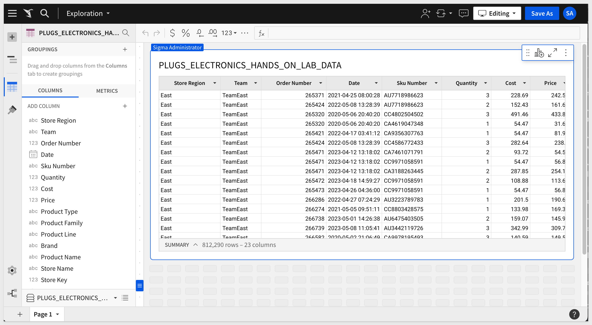
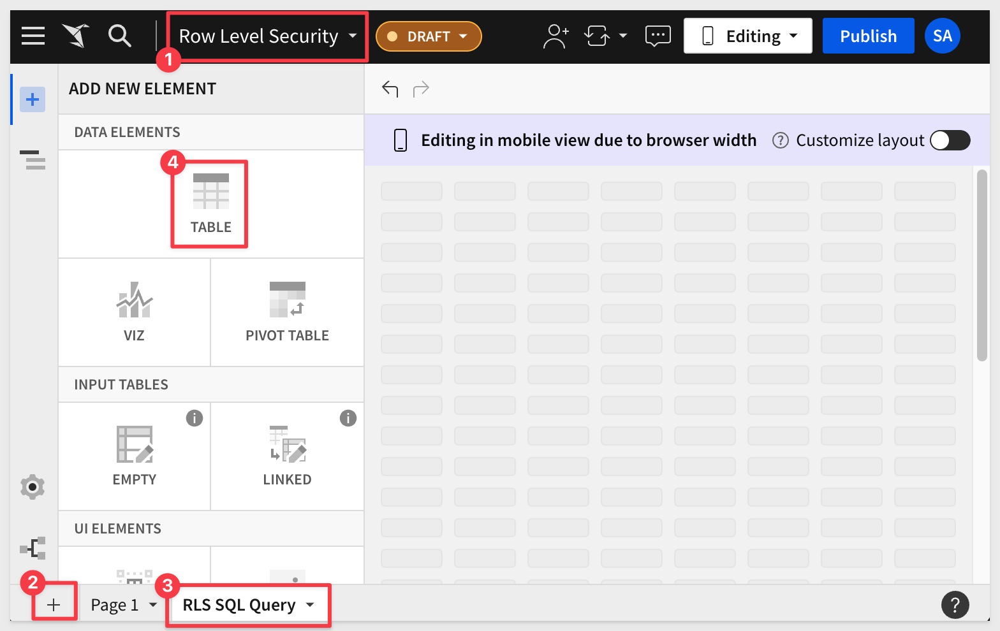
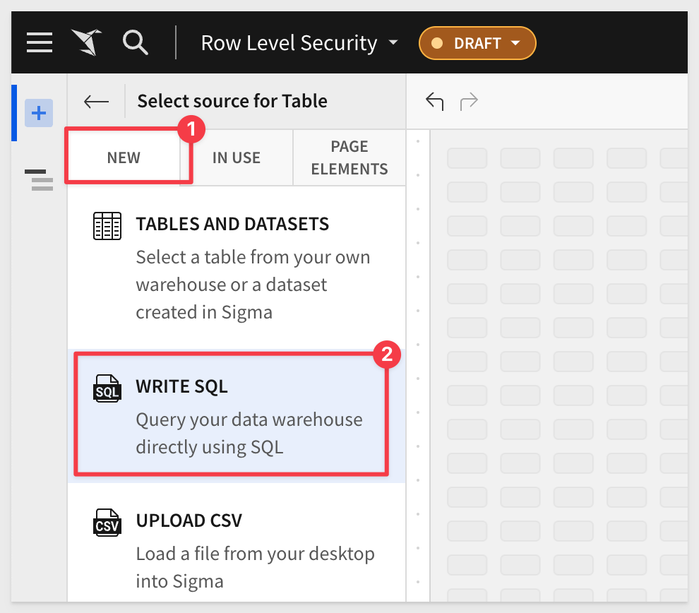
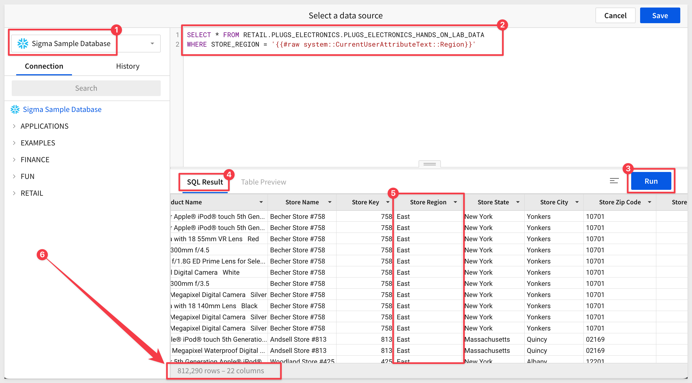

author: pballai
id: security_row_level_security
summary: security_row_level_security
categories: Security
environments: web
status: Published
feedback link: https://github.com/sigmacomputing/sigmaquickstarts/issues
tags: default
lastUpdated: 2023-10-16

# Implementing Row Level Security
<!-- The above name is what appears on the website and is searchable. -->

## Overview 
Duration: 5 

This QuickStart provides insight into the different methods available for content creators to limit data access to a user, based on an implementation of row level security (RLS) in Sigma. 

While there are several options that we will explore, RLS should **always** be applied as close to the data as possible. In the case of Sigma, that is at the Dataset being used to drive workbooks. 

There are four methods to apply RLS at the dataset level:

**1:** CurrentUserEmail()<br>
Returns `True` if the email of the logged in user viewing the data matches some column data.

[Documentation](https://help.sigmacomputing.com/docs/currentuseremail)

**2:** CurrentUserTeam()<br>
Returns `True` if the current user is a member of any of the Team(s) who have been granted access to the data.

[Documentation](https://help.sigmacomputing.com/docs/manage-teams)

**3:** User Attributes<br>
You can create and assign a user attribute(s) to users (members) or Teams. You can use this functionality in a dataset to enforce row-level security using the function CurrentUserAttributeText in a formula. User Attributes are custom names that you create.

[Documentation](https://help.sigmacomputing.com/docs/user-attributes#assign-user-attributes)

**4:** Custom SQL<br>
If your dataset is derived from a custom SQL query, you may uses any of the first three methods as criteria in a where clause.

[Documentation](https://help.sigmacomputing.com/docs/write-custom-sql)

It is also possible to apply data security at the warehouse level, but that is not in the scope of this QuickStart.

<aside class="positive">
<strong>IMPORTANT:</strong><br> Some screens in Sigma may appear slightly different from those shown in QuickStarts. This is because Sigma is continuously adding and enhancing functionality. Rest assured, Sigma’s intuitive interface ensures that any differences will not prevent you from successfully completing any QuickStart.
</aside>

For more information on Sigma's product release strategy, see [Sigma product releases.](https://help.sigmacomputing.com/docs/sigma-product-releases)

 ### Target Audience
Anyone who is trying to enforce row level security, such that the logged in Sigma user only has access to row data they are allowed to see.

### Prerequisites

<ul>
  <li>A computer with a current browser. It does not matter which browser you want to use.</li>
  <li>Access to your Sigma environment.</li>
  <li>Some familiarity with Sigma is assumed. Not all steps will be shown as the basics are assumed to be understood.</li>
  <li>To implement this feature, you must have "Can Edit" access on the individual dataset.</li>
</ul>

<aside class="postive">
<strong>IMPORTANT:</strong><br> Sigma recommends that you use non-production resources when doing QuickStarts.
</aside>

<button>[Sigma Free Trial](https://www.sigmacomputing.com/free-trial/)</button>
  
### What You’ll Learn
We will review several methods for achieving row-level security in Sigma. This will help you understand the options and choose the best solution for your use case.


<!-- END OF SECTION-->

## Sample Dataset Creation
Duration: 20

We will first create a new Dataset using Sigma's sample data, and add a few columns that we will use to evaluate the different methods of RLS.

Log into Sigma as `Administrator` and click the `Create New` button and select `Dataset`:


Select `Dataset` from the list os source option:


Using the sidebar navigation, locate the `Connections` > `Sigma Sample Database` > `Retail` > `Plugs Electronics` > `Plugs Electronics Hands On Lab` table and select that as shown and click `Get Started`:


We now have our source table. Let's assume that we want to limit data based on the `Region` that each transaction was in. This table has a `Store Region` column, so we can use that for each of our test case.

The table does not have `email` or `Team` columns that we need for our test case, so we will add them using simple Sigma functions.

To make things easier, first click the `Worksheet` tab and then drag the `Store Region` column to so that it is the first column shown:

<br>


#### Add Email Column:

Now, from the `Worksheet` tab, click the `Store Region` drop-menu and select `Add a new column`:


Double-click the new column's header and rename the column `Email`.

We want to have Sigma populate this column for us (because the data is not in our base table) and we want to make it obvious for our use-cases. 

Sigma has a function that allows for this called [Switch](https://help.sigmacomputing.com/docs/switch). 

Switch will evaluate the `Store Region` column and based on the data in each row, will add an email that we specify, in the `Email` column. 

Let's assume that our email will be evaluated and we are only allowed to see the `East` region. All other regions will be assigned a fictitious email for testing purposes.

<aside class="positive">
<strong>IMPORTANT:</strong><br> RLS is going to evaluate the logged in user. so you MUST use your email, not the one shown in the example.
</aside>

In the formula bar for `Email` enter the following formula:
```code
Switch([Store Region], "East", "phil@sigmacomputing.com", "bob@company.com")
```

We can see the results if we sort the `Store Region` column ascending and then descending (for example):


<aside class="negative">
<strong>NOTE:</strong><br> Something to not take for granted is that our base table is over 4.5 MILLION rows! We are using it trivially, while Sigma handles the scale of the data for smooth user experience.
</aside>


#### Add Team Column:
We will now just repeat the same exercise only this time, our new column should be named `Team` and the function for the column modified to match a Sigma Team name (that we have yet to create, we will do that later).
```code
Switch([Store Region], "East", "TeamEast", "TeamEveryone")
```

Our `Switch` function allows any member of `TeamEast` to see the `East` Store Region rows. `TeamEveryone` will see everything else.

Click the `Publish` and `Explore` buttons in the upper right corner.

We can see the base data and our new columns now but RLS is not being enforced yet. We will do that in the next section.


<aside class="positive">
<strong>IMPORTANT:</strong><br> A subtle but key point to understand is that we could have done the same work in a published exploration and the applied RLS to that Workbook. While this would work, if that Workbook is saved again later, it is possible another creator could remove the RLS that was built in the Workbook. Building at the source dataset prevents this from happening.
</aside>


<!-- END OF SECTION-->

## CurrentUserEmail RLS
Duration: 20

Navigate back to our Dataset. You can do this by clicking the Paper Crane icon and then `Recent` and you will see your Dataset:


Adding RLS based on email is now pretty simple. 

Click the `Edit` button in the upper right corner to place the Dataset in edit mode.

Click the `Worksheet` tab.

Add a new column and name it `test for email`.

Set the new column's formula to:
```code
CurrentUserEmail() = [email]
```

This will evaluate the email address using when I logged into Sigma against the value for email in each row.

When there is a match, the row's cell is set to `True`, otherwise `False`:


Now it is just a matter of setting a filter on the `test for email` column so that the table only shows the rows that are `True`:


<aside class="negative">
<strong>NOTE:</strong><br> You can use the column's menu to select to add a filter OR use the sidebar menu to perform the same function (under #3 in the screenshot)
</aside>


Now if we click `Publish` and `Explore` the data is automatically filtered based on my email address and we only see 812K rows and only `Store Region` in the `East`. 

A final cleanup step is to hide the `email`, and `test for email` columns as the user does not need to see them.

Return to the dataset but this time we will use a different method (instead of `Recents`):


It's nice to have options! Pick the workflow you prefer. 

Back in the Dataset, click the `Worksheet` tab, and click the `Edit` button.

Click the `email` column, hold the shift key and click the `test for email` column to select them both at the same time. 

Click `Hide columns`:


Click `Publish` and `Explore` and notice that the data is still restricted but the two columns we just hid are not in the table AND they are also not included in the list of available columns on the left sidebar.



We left the `Team` column in place so we can use that in the next section.

Now a user can use this table as a source of data to build more tables, pivots, viz ect, and the RLS will just carry forward.

That's it! Simple right?


<!-- END OF SECTION-->

## CurrentUserTeam RLS
Duration: 20

The workflow for team-based RLS is very much the same as `CurrentUserEmail` in terms of the table function and table filter. The difference is that the user's data rights are evaluated based on which team(s) they are a member of.

In that case, we need to create some teams and add our user's to them for RLS to work.

Before we add teams, let's configure the Dataset to use `CurrentUserTeam`.

Return to the Dataset. click the `Worksheet` tab and place it in `Edit` mode.

We don't have to delete the `email` and `test for email` columns but we do need to disable the `test for email` filter since we don't want to use that method in this example.

That is a simple matter of sliding the filter from blue to grey to disable it:


Your table row count should then return to 4.5M:


Now we can do the same steps but this time add a new column called `test for team`, setting it's formula to:
```code
CurrentUserInTeam([Team])
```

Once you have applied the formula, all the rows under `test for team` will be `False` because the current user (you) is not a member of our two teams (TeamEast and TeamEveryone).

We need to create those teams and assign members.


`Publish` the Dataset and this time, click `Explore` and then the `Save As` button. Give your Workbook a name and store it in a folder if you like:


Click the `Paper Crane` icon to return to the homepage and then click the `Administration` link.

Now click `Teams` from the left sidebar and then click `Create Team`:


Name our new Team `TeamEast` and set the access to `Public`:


There are a few options on this screen but we will not cover them all here. If you are interested, [the documentation is here.](https://help.sigmacomputing.com/docs/manage-teams)

Click `Create`.

The team is created and my user (as Administrator) is added automatically. It is easy to add new members by clicking the `Add Members` button. 


Repeat the process to add our second team ("TeamEveryone") but this time, remove yourself from the team so the team has no members:


Navigate back to our `Workbook`. We see there are 4.5M rows displayed. **What went wrong?** 

We know that the current user is a member of `TeamEast`, the data should only show Store Regions in the `East`.

When we added the `test for team` we never added the required filter for the `True/False` data!. 

Return to the Dataset and add that filter:


Publish this Dataset and return to our Workbook.

Now we get the results we want. `test for team` is all `True`, we only see `East` rows for `Store Region`:


We can hide these two extra columns if we want; you know how to do that now. Just make sure to do it at the Dataset, and not the Workbook. 

Click `Publish` > `Expore` > `Save As` and use the same name to over-write the Workbook we saved earlier.

Now what happens if we add ourself back into `TeamEveryone`?

<aside class="positive">
<strong>IMPORTANT:</strong><br> Because my logged on user is a member of both teams, we are able to see all 4.5M rows. This flexibility allows team membership RLS to drive interesting use-cases when some users need to be able to see more data than others through multi-team membership.
</aside>


Now what if we don't have email address in the source data and don't want to use Sigma Teams? We will explore that in the next section.


<!-- END OF SECTION-->

## User Attribute RLS
Duration: 20

User Attributes (UA) can be used to provide a customized experience for your Sigma Teams or Members. They do not depend on email or currentTeam membership to work and allow you to apply RLS to any column in a Dataset.

They are assigned using a function in a Dataset column to provide row-level security.

Once you create a UA, you assign it to a Team(s) or individual users(s). You then use this functionality in a Dataset to enforce row-level security in a similar manner as we have done with `CurrentUserEmail` and `CurrentUserTeam`, but this time we use the function `CurrentUserAttributeText` in the formula.  

In the following use-case, we don't want to use Teams or Email columns as we assume they don't exist in our source data. 

Navigate to `Administration` > `User Attributes` and click `Create`.

Name the new UA `Region`. 

We need to assign this UA to either an existing `Team` or individual users (`Members`). 

We will use ourself (as `Member`) and assign the `Assigned Value` to only the `East` region.

Click `Assign Attribute`:


Click `Assign`.


<aside class="positive">
<strong>IMPORTANT:</strong><br> When using Team assignment, UAs also have a priority column. The priority determines which value is used for a user who may be a member of more than one team.
</aside>

Return to the Dataset, place it in `Edit` mode, and click on the `Worksheet` tab.

Add a new column next to `Store Region`, rename it `test for ua_Region` and set it's formula to:
```code
CurrentUserAttributeText("Region") = [Store Region]
```

Don't forget to set the filter as we have done before:


If we open the `Store Region` drop menu and select `Column details` we can see that there is only one `Store Region` shown for `East` and we have the expected 812K rows of data:


Hide the `Team` and `test for team` and `test for ua_Region` columns.

You can Publish this Dataset and check your Workbook if you like now. The results should show 812K rows and no indication to the user that data is being restricted:


<!-- END OF SECTION-->

## Custom SQL
Duration: 20

Since we already successfully configured a UA (Region), we can use it in a Custom SQL dataset to provide RLS.

This method can be used anywhere in the SQL statement for any UA. 
 
UAs can also be used to switch the database name, table name, or in the select or where clauses.

In our use case the `Store Region` for each transaction is present in a column. We can leverage Custom SQL to filter the data directly (using a where clause) and not have to worry about applying a function and filter in the Sigma dataset.

Using the example we just did in the last exercise, we will create another Dataset based on SQL query instead of adding the dataset through the `Create New` workflow.

### Steps:

<aside class="negative">
<strong>NOTE:</strong><br> Prior to this, when developing in Sigma we would get “no data” until we looked at the actual embed page with UA passed for Region. That can be desirable in the case that the Parent Application fails to pass a value for Region. We don't want to show any data in that case. 
</aside>

Navigate to the previously create `Row Level Security` Workbook and `edit` it.

Create a `new Page` and rename it to `RLS SQL Query`.

Click `+ Add New` and `Table`. 



For `Source`, select `New` and then `Write SQL`.



In the Connections drop down, select `Sigma Sample Database`.

In the large open whitespace `paste the following code`:

```sql
SELECT * FROM RETAIL.PLUGS_ELECTRONICS.PLUGS_ELECTRONICS_HANDS_ON_LAB_DATA
WHERE STORE_REGION = '{{#raw system::CurrentUserAttributeText::Region}}'
```

This SQL code will get all columns from the table we have used previously, but limit the return based on the UA `Region` and it's `Membership` of just my user, and the `Attribute Value` of `East`. 

<aside class="negative">
<strong>NOTE:</strong><br>  This syntax ('{{#raw system::CurrentUserAttributeText::Region}}') can be used anywhere in the SQL statement for any user attribute e.g. it can be used to switch the database name, table name, or in the select clause or where clause.
</aside>

`Click Run.` You should only see rows from Store Region=East.



You can now choose to save this query and using it as a data source for our Workbook.

While this method feels like less steps, not all users are comfortable writing SQL. For those who are, it is a **great option** to have.


<!-- END -->

## What we've covered
Duration: 5

In this QuickStart we learned how to implement four different methods to enforce row level security against a set of data and some of the fine details when working with RLS in Sigma

For those wanting to apply RLS in an embedding environment, [see this QuickStart.](https://quickstarts.sigmacomputing.com/guide/embedding_4_row_level_security/index.html?index=..%2F..index#0)

<!-- THE FOLLOWING ADDITIONAL RESOURCES IS REQUIRED AS IS FOR ALL QUICKSTARTS -->
**Additional Resource Links**

Be sure to check out all the latest developments at [Sigma's First Friday Feature page!](https://quickstarts.sigmacomputing.com/firstfridayfeatures/)

[Help Center Home](https://help.sigmacomputing.com)<br>
[Sigma Community](https://community.sigmacomputing.com/)<br>
[Sigma Blog](https://www.sigmacomputing.com/blog/)<br>
<br>

[](https://twitter.com/sigmacomputing)&emsp;
[](https://www.linkedin.com/company/sigmacomputing)&emsp;
[](https://www.facebook.com/sigmacomputing)


<!-- END OF WHAT WE COVERED -->
<!-- END OF QUICKSTART -->
