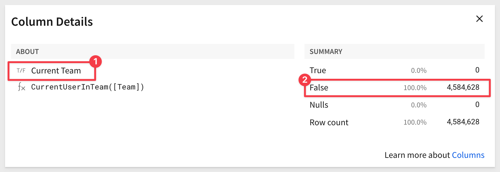

author: pballai
id: security_row_level_security
summary: security_row_level_security
categories: Security
environments: web
status: Published
feedback link: https://github.com/sigmacomputing/sigmaquickstarts/issues
tags: default
lastUpdated: 2025-06-11

# Implementing Row-Level Security (RLS)
<!-- The above name is what appears on the website and is searchable. -->

## Overview 
Duration: 5 

This QuickStart provides insight into the different methods available for content creators to limit data access to a user, based on an implementation of row-level security (RLS) in Sigma. 

While there are several options that we will explore, RLS should **always** be applied as close to the data as possible. In the case of Sigma, that is at the data model used to drive workbooks. 

There are four methods to apply RLS at the data model level:

**1: CurrentUserEmail()**<br>
Returns `True` if the email of the logged in user viewing the data matches some column data.

[Documentation](https://help.sigmacomputing.com/docs/currentuseremail)

**2: CurrentUserTeam()**<br>
Returns `True` if the current user is a member of any of the Team(s) who have been granted access to the data.

[Documentation](https://help.sigmacomputing.com/docs/manage-teams)

**3: User Attributes**<br>
You can create and assign user attribute(s) to users (members) or Teams. You can use this functionality in a data model to enforce row-level security using the function CurrentUserAttributeText in a formula. User Attributes are custom names that you create.

[Documentation](https://help.sigmacomputing.com/docs/user-attributes#assign-user-attributes)

**4: Custom SQL**<br>
If your data model is derived from a custom SQL query, you may use any of the first three methods as criteria in a where clause.

[Documentation](https://help.sigmacomputing.com/docs/write-custom-sql)

It is also possible to apply data security at the warehouse level, but that is not in the scope of this QuickStart.

<aside class="positive">
<strong>IMPORTANT:</strong><br> Some screens in Sigma may appear slightly different from those shown in QuickStarts. This is because Sigma continuously adds and enhances functionality. Rest assured, Sigma’s intuitive interface ensures that any differences will not prevent you from successfully completing any QuickStart.
</aside>

For more information on Sigma's product release strategy, see [Sigma product releases](https://help.sigmacomputing.com/docs/sigma-product-releases)

If something is not working as you expect, here’s how to [contact Sigma support](https://help.sigmacomputing.com/docs/sigma-support)

 ### Target Audience
This QuickStart is intended for anyone looking to implement row-level security in Sigma, ensuring that each logged-in user can only access the data they are authorized to see.

### Prerequisites

<ul>
  <li>A computer with a current browser. It does not matter which browser you want to use.</li>
  <li>Access to your Sigma environment.</li>
  <li>Some familiarity with Sigma is assumed. Not all steps will be shown as the basics are assumed to be understood.</li>
</ul>

<aside class="positive">
<strong>IMPORTANT:</strong><br> Sigma recommends using non-production resources when completing QuickStarts.
</aside>

<button>[Sigma Free Trial](https://www.sigmacomputing.com/free-trial/)</button>

<aside class="negative">
<strong>IMPORTANT:</strong><br> Some features may carry a "Beta" tag. Beta features are subject to quick, iterative changes. As a result, the latest product version may differ from the contents of this document.
</aside>
 
  

<!-- END OF SECTION-->

## Create a Data Model
Duration: 20

We will first create a new Data model using Sigma's sample data, and add a few columns that we will use to evaluate the different methods of RLS.

Log into Sigma as `Administrator` and click the `Create New` button and select `Data model`:


Select `Data` > `Table` from the element bar:


Search for `Hands` and select `Plugs Electronics Hands On Lab` table from the `Retail` schema:


Let's assume that we want to limit data based on the `Region` that each transaction was in. This table has a `Store Region` column, so we can use that for each of our test cases.

Drag the `Store Region` column to the first position:


The table does not have `email` or `Team` columns that we need for our test case, so we will add them using simple Sigma functions.

#### Add email column:
Now, from the `Worksheet` tab, click the `Store Region` dropdown menu and select `Add a new column`:


Double-click the new column's header and rename the column `Email`.

We want to have Sigma populate this column for us (because the data is not in our base table) and we want to make it obvious for our use cases. 

Sigma has a function that allows for this called [Switch](https://help.sigmacomputing.com/docs/switch)

Switch will evaluate the `Store Region` column and based on the data in each row, will add an email that we specify, in the `Email` column. 

Let's assume that our email will be evaluated and we are only allowed to see the `East` region. All other regions will be assigned a fictitious email for testing purposes.

<aside class="positive">
<strong>IMPORTANT:</strong><br> RLS is going to evaluate the logged in user so you must use your email, not the one shown in the example.
</aside>

In the formula bar for `Email` enter the following formula:
```code
Switch([Store Region], "East", "phil@sigmacomputing.com", "bob@company.com")
```

Sigma evaluates the formula for accuracy, provides instructions and an example and everything is correct, a green checkmark will appear.

The `magic wand` icon is Sigma's AI formula assistant. For more information, see [Use AI with formulas](https://help.sigmacomputing.com/docs/use-ai-with-formulas)

`Store Region` now shows phil for rows with `East` and bob for all the other rows:


<aside class="negative">
<strong>NOTE:</strong><br> One thing not to take for granted is that our base table is over 4.5 MILLION rows! We are using it trivially while Sigma handles the scale of the data for smooth user experience.
</aside>

#### Add Team Column:
We will now just repeat the same exercise only this time, our new column should be named `Team` and the function for the column modified to match a Sigma team name (that we have yet to create, we will do that later).
```code
Switch([Store Region], "East", "Team_East", "Team_Everyone")
```

Our `Switch` function allows any member of `Team_East` to see the `East` Store Region rows. `Team_Everyone` will see everything else.

Save the data model as `RLS_QuickStart`:


Click `Publish`.


<!-- END OF SECTION-->

## Email-based RLS
Duration: 20

Adding RLS based on email is now pretty simple. We will add another column for a test email address. This column will evaluate the address of the user who is currently logged onto Sigma, based on the [CurrentUserEmail](https://help.sigmacomputing.com/docs/currentuseremail) function and the `Email` column, returning a boolean (true/false).

Add a new column and name it `Current_User`.

Set the new column's formula to:
```code
CurrentUserEmail() = [Email]
```

When there is a match, the row's cell is set to `True`; otherwise `False`:


Now it is just a matter of setting a filter on the `Current_User` column so that the table only shows the rows that are `True`:


A final cleanup step is to hide the `Email`, and `Current_user` columns; users do not need to see them. We moved the `Current_User` column next to `Email` for clarity:


Click `Publish`.

### A quick test
Up until now, we have been working in a data model. Let's take a look at what users will see.

Switch to the `Published view`:


This "landing page" for our data model provides lots of useful information although, since we just created it, much of it is not populated:


For more information, see [Get started with data modeling](https://help.sigmacomputing.com/docs/get-started-with-data-modeling)

Click `Explore`.

We are placed into an unsaved workbook with our table. The `Store Region` is restricted to `East` (as expected). The two hidden columns are not shown but they are still accessible to a workbook builder. 

This is useful for troubleshooting purposes but in some cases, may not be desirable due to regulatory or compliance requirements. In those cases, these columns would be further secured using [Column-Level Security](https://help.sigmacomputing.com/docs/column-level-security) in the data model.

To learn more about Column-Level Security in data models, see the QuickStart: [Implementing Column Level Security](https://quickstarts.sigmacomputing.com/guide/security_column_level_security/index.html?index=..%2F..index#0)


Click `Save as` and name the new workbook `Implementing Row-Level Security`.

Now we have a workbook that builders can use to create other content and the region filtering on email will just work, since that is built into the data model. Users could also just use this workbook directly once it is shared to them.

That's it! Simple right?

<aside class="negative">
<strong>PRO TIP:</strong><br> Keep the workbook open in a second browser tab to reduce clicks when testing. Not required, but we love saving clicks.
</aside>


<!-- END OF SECTION-->

## Team-based RLS
Duration: 20

The workflow for team-based RLS is similar to `CurrentUserEmail` in terms of the table function and table filter. The difference is that the user's data rights are evaluated based on which team(s) they are a member of.

To demonstrate this, we need to create some teams and add our user's to them for RLS to work.

Before we add teams, let's configure the data model to use `CurrentUserTeam`.

Click the icon to return to the Sigma homepage and open the `RLS_QuickStart` data model. 

Click the `Edit` link at the top of the page.

Let's keep our email work in place but disable the filter that enables it to be enforced:


The table's row count should then return to approximately 4.5M rows.

### Add team column
Now we can do the same steps, this time adding a new column called `Current Team`, setting its formula to:
```code
CurrentUserInTeam([Team])
```


Once you have applied the formula, all the rows under `Current Team` will be `False` because the current user (you) is not a member of our two teams (Team_East and Team_Everyone), which have not been created yet.

Sigma provides `Column details` to let us quickly see the shape of the data in a column:


This is a convenient way to confirm that all the cells for `Current Team` are indeed `False`:



Click `Publish`.

### Create teams
We need to create those teams and assign members.

Return to the homepage and then click the `Administration` link.

Now click `Teams` from the left sidebar and then click `Create Team`:


Name the team `Team_East` and click `Create`

There are a few options on this screen but we will not cover them all here. For more information see, [Manage Teams](https://help.sigmacomputing.com/docs/manage-teams)

It is easy to add new members by clicking the `Add Members` button. 

Click `Add members` and add yourself:


Repeat the process to add a second team named `Team_Everyone` but this time we won't add any members.

Navigate back to the `Implementing Row-Level Security` workbook. We see there are approximately 4.5M rows displayed. **What went wrong?** 

After we added the `Current Team` column we did not add the required filter!

Return to the `RLS_QuickStart` data model and add that filter:


Publish this data model and return to the workbook.

Now we get the results we want: `Current Team` is all `True`, we only see `East` rows for `Store Region` and the row count is lower:


You can hide these two columns; you know how to do that now. Just make sure to do it in the data model and not the workbook. 

What happens if we add ourself back into `Team_Everyone`?

<aside class="positive">
<strong>IMPORTANT:</strong><br> Because my logged-in user is a member of both teams, we are able to see all 4.5M rows. This flexibility allows team membership RLS to support interesting use cases when some users need to be able to see more data than others through multi-team membership.
</aside>


<!-- END OF SECTION-->

## User Attribute-based RLS
Duration: 20

[User Attributes](https://help.sigmacomputing.com/docs/user-attributes) (UA) can be used to provide a customized experience for Sigma teams or members (users). UAs do not depend on email or team membership to work and allow you to apply RLS to any column in a data model.

You assign them using a function in a data model column to provide row-level security.

Once you create a UA, you assign it to a team or individual users. The UA is then applied to a data model to enforce row-level security in a similar manner as we have done with `CurrentUserEmail` and `CurrentUserTeam`, but this time we use the function `CurrentUserAttributeText` in the formula.  

### Create user attribute
Navigate to `Administration` > `User Attributes` and click `Create`.

Name the new UA `Region`, and leave the default value blank. Click `Create`.

Sigma allows us to assign this UA to either an existing `Team` or individual users.

We will assign ourself and set the `Assigned Value` to `East` only:


Click `Assign`.

### Configure the data model
Return to the data model, put it in `Edit` mode.

Disable the filter for `Current Team`.

Add a new column next to `Store Region`, rename it `ua_Region` and set it's formula to:
```code
CurrentUserAttributeText("Region") = [Store Region]
```

Add a filter on `ua_Region` to show only the `True` rows:


With the filter applied, we can see that there is only one `Store Region` shown for `East` and we have the expected ~812K rows of data:


Hide the `ua_Region` column.

You can `Publish` this data model and check the workbook if you like. The results will be the same and no indication to the user that data is being restricted, but there is a notice that the source has been updated:

Since we made the changes, we know what they are. Click `Select All` and then `Update`:


<aside class="negative">
<strong>NOTE:</strong><br> This warning is very useful when multiple people are working on data models and workbooks. The screenshot above simulates that since the Current Team was added back when in our workflow it had been previously hidden. This extra check works to limit unwanted data exposure.
</aside>

We could add ourselves to `Team_Everyone` and test to see if all approximately 4.5M rows are shown but we will skip that as we already demonstrated that working in the email RLS section and the workflow is the same.


<!-- END OF SECTION-->

## Custom SQL
Duration: 20

Since we’ve already successfully configured a UA for region, we can leverage it in a custom SQL data model to provide RLS.

This method can be used anywhere in the SQL statement for any UA. 
 
<aside class="positive">
<strong>IMPORTANT:</strong><br> UAs can be used to switch the database name, table name, or in the SELECT or WHERE clauses. This flexibility can open up some interesting use cases.
</aside>

Navigate back to the data model and click `Edit`.

Create a `new Page` and rename it to `RLS_SQL_Query`.

Use the `Element bar` to add a `Table` to the page but this time, select `SQL` as the source:


Use the `Sigma Sample Database` for the connection.

Our workbook now has an element to allow custom SQL code. It also lets us explore the contents of the `Sigma Sample Database` contents in the right-side `Element panel`:


In the large open whitespace, paste the following code:

```sql
SELECT * FROM RETAIL.PLUGS_ELECTRONICS.PLUGS_ELECTRONICS_HANDS_ON_LAB_DATA
WHERE STORE_REGION = '{{#raw system::CurrentUserAttributeText::Region}}'
AND Date >= DATEADD(DAY, -90, CURRENT_DATE)
```

This SQL code will get the last 90 days of data, and further limit the return based on the UA `Region` and its `Membership`, which was set to ourselves in the last section. Since the default value for the UA is `East`, that is what is enforced.

Click `Run`. You will now only see rows where `Store Region = East`:


While this method feels like less steps, not all users are comfortable writing SQL. For those who are, it is a **great option** to have.

All we need to do is maintain the UA membership, and the query will enforce it.


<!-- END -->

## What we've covered
Duration: 5

In this QuickStart, we learned how to implement four different methods to enforce row-level security against a set of data, and explored key details for working with RLS in Sigma.

To learn more about Sigma Data Models, see the QuickStart: [Fundamentals 10: Data Modeling](https://quickstarts.sigmacomputing.com/guide/fundamentals_10_data_modeling/index.html?index=..%2F..index#0)

To learn more about Column-Level Security in data models, see the QuickStart: [Implementing Column Level Security](https://quickstarts.sigmacomputing.com/guide/security_column_level_security/index.html?index=..%2F..index#0)

<!-- THE FOLLOWING ADDITIONAL RESOURCES IS REQUIRED AS IS FOR ALL QUICKSTARTS -->
**Additional Resource Links**

Be sure to check out all the latest developments at [Sigma's First Friday Feature page!](https://quickstarts.sigmacomputing.com/firstfridayfeatures/)

[Help Center Home](https://help.sigmacomputing.com)<br>
[Sigma Community](https://community.sigmacomputing.com/)<br>
[Sigma Blog](https://www.sigmacomputing.com/blog/)<br>
<br>

[](https://twitter.com/sigmacomputing)&emsp;
[](https://www.linkedin.com/company/sigmacomputing)&emsp;
[](https://www.facebook.com/sigmacomputing)


<!-- END OF WHAT WE COVERED -->
<!-- END OF QUICKSTART -->
